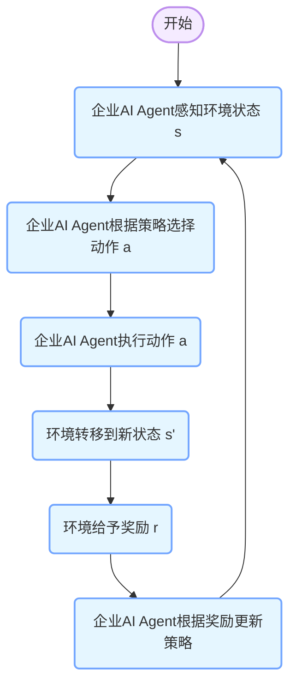

# 企业AI Agent的强化学习在智能建筑管理中的节能应用

> 关键词：企业AI Agent、强化学习、智能建筑管理、节能应用、马尔可夫决策过程

> 摘要：本文深入探讨了企业AI Agent的强化学习在智能建筑管理中节能应用的相关技术和方法。首先介绍了研究的背景、目的、预期读者和文档结构，明确了相关术语。接着阐述了核心概念，包括企业AI Agent、强化学习和智能建筑管理节能应用的原理及它们之间的联系，并给出了相应的示意图和流程图。详细讲解了强化学习的核心算法原理，通过Python代码进行说明，同时介绍了其数学模型和公式。通过实际项目案例，展示了如何搭建开发环境、实现源代码并进行解读分析。还列举了强化学习在智能建筑管理节能方面的实际应用场景，推荐了学习资源、开发工具框架和相关论文著作。最后总结了未来发展趋势与挑战，解答了常见问题，并提供了扩展阅读和参考资料。

## 1. 背景介绍 
### 1.1 目的和范围
随着全球能源问题的日益严峻，建筑能耗作为能源消耗的重要组成部分，受到了广泛关注。智能建筑管理系统旨在通过先进的技术手段优化建筑的能源使用效率，降低能耗。企业AI Agent的强化学习为智能建筑管理的节能应用提供了一种新的思路和方法。本文章的目的是深入探讨企业AI Agent的强化学习在智能建筑管理节能应用中的原理、算法、实际案例和未来发展趋势，范围涵盖从理论基础到实际应用的各个方面。

### 1.2 预期读者
本文预期读者包括从事智能建筑管理、能源管理、人工智能和机器学习领域的研究人员、工程师、技术爱好者，以及对建筑节能和智能系统感兴趣的企业管理人员和决策者。

### 1.3 文档结构概述
本文将按照以下结构进行组织：首先介绍核心概念及其联系，为后续的学习打下基础；接着详细讲解强化学习的核心算法原理和具体操作步骤，并给出Python代码示例；然后介绍强化学习的数学模型和公式，并通过举例进行说明；之后通过实际项目案例展示代码的实现和解读；再列举强化学习在智能建筑管理节能中的实际应用场景；推荐相关的学习资源、开发工具框架和论文著作；最后总结未来发展趋势与挑战，解答常见问题，并提供扩展阅读和参考资料。

### 1.4 术语表
#### 1.4.1 核心术语定义
- **企业AI Agent**：是一种能够感知环境、做出决策并采取行动以实现特定目标的人工智能实体，在企业环境中，它可以根据企业的需求和规则进行自主学习和决策。
- **强化学习**：是一种机器学习方法，智能体通过与环境进行交互，根据环境反馈的奖励信号来学习最优的行为策略，以最大化长期累积奖励。
- **智能建筑管理**：利用先进的信息技术和自动化控制技术，对建筑的设备系统、能源系统、安全系统等进行集中管理和优化控制，以提高建筑的运行效率和舒适度。
- **节能应用**：通过各种技术手段和管理措施，降低建筑的能源消耗，提高能源利用效率，实现可持续发展。

#### 1.4.2 相关概念解释
- **马尔可夫决策过程（MDP）**：是强化学习的理论基础，它描述了一个智能体在环境中进行决策的过程，其中环境的状态转移具有马尔可夫性，即下一状态只取决于当前状态和智能体的动作。
- **策略**：是智能体在每个状态下选择动作的规则，强化学习的目标就是学习到一个最优策略，使得长期累积奖励最大。
- **奖励函数**：是环境根据智能体的动作给予的反馈信号，用于评价智能体的行为好坏，智能体的目标是通过学习最大化累积奖励。

#### 1.4.3 缩略词列表
- **MDP**：马尔可夫决策过程（Markov Decision Process）
- **Q - learning**：Q学习算法（Q - learning Algorithm）
- **SARSA**：状态 - 动作 - 奖励 - 状态 - 动作算法（State - Action - Reward - State - Action Algorithm）

## 2. 核心概念与联系 

### 核心概念原理
#### 企业AI Agent
企业AI Agent是一种具有自主性、适应性和学习能力的人工智能实体。它可以感知企业环境中的各种信息，如建筑的能源消耗数据、设备运行状态等，并根据这些信息做出决策和采取行动。企业AI Agent的核心是其决策机制，它可以基于强化学习等算法不断优化自己的决策策略，以实现企业的目标，如节能、提高设备运行效率等。

#### 强化学习
强化学习是一种通过智能体与环境进行交互来学习最优行为策略的机器学习方法。智能体在每个时间步观察环境的状态 $s_t$，选择一个动作 $a_t$ 执行，环境根据智能体的动作转移到下一个状态 $s_{t + 1}$，并给予智能体一个奖励 $r_t$。智能体的目标是通过不断地与环境交互，学习到一个最优策略 $\pi^*$，使得长期累积奖励 $G_t=\sum_{k = 0}^{\infty}\gamma^k r_{t + k}$ 最大，其中 $\gamma$ 是折扣因子，用于权衡即时奖励和未来奖励。

#### 智能建筑管理节能应用
智能建筑管理节能应用是指利用先进的信息技术和自动化控制技术，对建筑的能源系统进行优化管理，以降低建筑的能源消耗。具体措施包括对空调、照明、电梯等设备的智能控制，根据建筑的实际使用情况和环境条件调整设备的运行参数，实现能源的合理分配和高效利用。

### 架构的文本示意图
```plaintext
企业AI Agent
|
|-- 感知模块（获取建筑环境信息，如温度、湿度、能耗等）
|
|-- 决策模块（基于强化学习算法，根据感知信息做出决策）
|
|-- 执行模块（执行决策，控制建筑设备，如调节空调温度、开关照明等）
|
|-- 学习模块（根据环境反馈的奖励信号，更新决策策略）

智能建筑环境
|
|-- 建筑设备（空调、照明、电梯等）
|
|-- 环境因素（温度、湿度、光照等）
|
|-- 能源消耗监测系统

企业AI Agent与智能建筑环境的交互
|
|-- 企业AI Agent感知智能建筑环境信息
|
|-- 企业AI Agent根据信息做出决策并执行动作
|
|-- 智能建筑环境根据动作发生变化并反馈奖励信号给企业AI Agent
```

### Mermaid流程图


## 3. 核心算法原理 & 具体操作步骤 

### 强化学习算法原理
强化学习的核心是学习一个最优策略，使得智能体在与环境交互过程中获得最大的长期累积奖励。常见的强化学习算法包括Q - learning和SARSA等。

#### Q - learning算法原理
Q - learning是一种无模型的强化学习算法，它通过学习一个Q值函数 $Q(s, a)$ 来表示在状态 $s$ 下采取动作 $a$ 的预期累积奖励。Q值函数的更新公式如下：
$$Q(s_t, a_t) \leftarrow Q(s_t, a_t)+\alpha\left[r_t+\gamma\max_{a}Q(s_{t + 1}, a)-Q(s_t, a_t)\right]$$
其中，$\alpha$ 是学习率，控制每次更新的步长；$\gamma$ 是折扣因子，用于权衡即时奖励和未来奖励。

#### Python代码实现Q - learning算法
```python
import numpy as np

class QLearningAgent:
    def __init__(self, num_states, num_actions, learning_rate=0.1, discount_factor=0.9):
        self.num_states = num_states
        self.num_actions = num_actions
        self.learning_rate = learning_rate
        self.discount_factor = discount_factor
        self.q_table = np.zeros((num_states, num_actions))

    def choose_action(self, state, epsilon=0.1):
        if np.random.uniform(0, 1) < epsilon:
            # 探索：随机选择一个动作
            action = np.random.choice(self.num_actions)
        else:
            # 利用：选择Q值最大的动作
            action = np.argmax(self.q_table[state, :])
        return action

    def update_q_table(self, state, action, reward, next_state):
        # Q - learning更新公式
        max_q_next = np.max(self.q_table[next_state, :])
        self.q_table[state, action] += self.learning_rate * (reward + self.discount_factor * max_q_next - self.q_table[state, action])


# 示例使用
num_states = 10
num_actions = 4
agent = QLearningAgent(num_states, num_actions)

# 模拟一次交互
state = 0
action = agent.choose_action(state)
next_state = 1
reward = 1
agent.update_q_table(state, action, reward, next_state)

print("更新后的Q表：")
print(agent.q_table)
```

### 具体操作步骤
1. **定义环境和状态动作空间**：确定智能建筑管理中的环境状态（如温度、湿度、能耗等）和可执行的动作（如调节空调温度、开关照明等），并对状态和动作进行离散化处理。
2. **初始化Q表**：创建一个Q表，用于存储每个状态 - 动作对的Q值，初始值可以设为0。
3. **设置超参数**：包括学习率 $\alpha$、折扣因子 $\gamma$ 和探索率 $\epsilon$ 等。
4. **进行训练**：
    - 智能体在每个时间步观察环境状态 $s_t$。
    - 根据 $\epsilon$ - 贪心策略选择一个动作 $a_t$。
    - 执行动作 $a_t$，环境转移到下一个状态 $s_{t + 1}$，并给予奖励 $r_t$。
    - 根据Q - learning更新公式更新Q表。
5. **评估和优化**：训练完成后，评估智能体的性能，并根据评估结果调整超参数，进行进一步的优化。

## 4. 数学模型和公式 & 详细讲解 & 举例说明 

### 马尔可夫决策过程（MDP）
马尔可夫决策过程是强化学习的理论基础，它可以用一个五元组 $(S, A, P, R, \gamma)$ 来表示，其中：
- $S$ 是有限的状态集合。
- $A$ 是有限的动作集合。
- $P(s'|s, a)$ 是状态转移概率，表示在状态 $s$ 下执行动作 $a$ 后转移到状态 $s'$ 的概率。
- $R(s, a)$ 是奖励函数，表示在状态 $s$ 下执行动作 $a$ 获得的即时奖励。
- $\gamma$ 是折扣因子，$0\leqslant\gamma\leqslant1$，用于权衡即时奖励和未来奖励。

### 策略和价值函数
#### 策略
策略 $\pi$ 是一个从状态到动作的映射，表示在每个状态下选择动作的概率分布。确定性策略 $\pi(s)$ 直接指定在状态 $s$ 下选择的动作，而随机性策略 $\pi(a|s)$ 表示在状态 $s$ 下选择动作 $a$ 的概率。

#### 价值函数
- **状态价值函数**：$V^{\pi}(s)=\mathbb{E}_{\pi}\left[\sum_{k = 0}^{\infty}\gamma^k r_{t + k}|s_t = s\right]$ 表示在策略 $\pi$ 下，从状态 $s$ 开始的预期累积奖励。
- **动作价值函数**：$Q^{\pi}(s, a)=\mathbb{E}_{\pi}\left[\sum_{k = 0}^{\infty}\gamma^k r_{t + k}|s_t = s, a_t = a\right]$ 表示在策略 $\pi$ 下，从状态 $s$ 执行动作 $a$ 开始的预期累积奖励。

### 贝尔曼方程
#### 状态价值函数的贝尔曼方程
$$V^{\pi}(s)=\sum_{a\in A}\pi(a|s)\left[R(s, a)+\gamma\sum_{s'\in S}P(s'|s, a)V^{\pi}(s')\right]$$

#### 动作价值函数的贝尔曼方程
$$Q^{\pi}(s, a)=R(s, a)+\gamma\sum_{s'\in S}P(s'|s, a)\sum_{a'\in A}\pi(a'|s')Q^{\pi}(s', a')$$

### 最优价值函数和最优策略
- 最优状态价值函数：$V^*(s)=\max_{\pi}V^{\pi}(s)$
- 最优动作价值函数：$Q^*(s, a)=\max_{\pi}Q^{\pi}(s, a)$

最优策略 $\pi^*$ 满足 $V^{\pi^*}(s)=V^*(s)$ 和 $Q^{\pi^*}(s, a)=Q^*(s, a)$。

### 举例说明
考虑一个简单的智能建筑管理场景，假设建筑的温度状态 $S=\{s_1, s_2\}$（$s_1$ 表示温度低，$s_2$ 表示温度高），动作 $A=\{a_1, a_2\}$（$a_1$ 表示开空调，$a_2$ 表示关空调）。状态转移概率和奖励函数如下：

| $s$ | $a$ | $s'$ | $P(s'|s, a)$ | $R(s, a)$ |
| --- | --- | --- | --- | --- |
| $s_1$ | $a_1$ | $s_1$ | 0.2 | -1 |
| $s_1$ | $a_1$ | $s_2$ | 0.8 | -1 |
| $s_1$ | $a_2$ | $s_1$ | 0.9 | 0 |
| $s_1$ | $a_2$ | $s_2$ | 0.1 | 0 |
| $s_2$ | $a_1$ | $s_1$ | 0.8 | 1 |
| $s_2$ | $a_1$ | $s_2$ | 0.2 | 1 |
| $s_2$ | $a_2$ | $s_1$ | 0.1 | -2 |
| $s_2$ | $a_2$ | $s_2$ | 0.9 | -2 |

假设折扣因子 $\gamma = 0.9$，我们可以使用贝尔曼方程来计算状态价值函数。

设初始时 $V(s_1)=0$，$V(s_2)=0$。

对于状态 $s_1$：
- 如果选择动作 $a_1$：
  - $Q(s_1, a_1)=R(s_1, a_1)+\gamma\left[P(s_1|s_1, a_1)V(s_1)+P(s_2|s_1, a_1)V(s_2)\right]=-1 + 0.9\times(0.2\times0 + 0.8\times0)=-1$
- 如果选择动作 $a_2$：
  - $Q(s_1, a_2)=R(s_1, a_2)+\gamma\left[P(s_1|s_1, a_2)V(s_1)+P(s_2|s_1, a_2)V(s_2)\right]=0 + 0.9\times(0.9\times0 + 0.1\times0)=0$

则 $V(s_1)=\max\{Q(s_1, a_1), Q(s_1, a_2)\}=0$

对于状态 $s_2$：
- 如果选择动作 $a_1$：
  - $Q(s_2, a_1)=R(s_2, a_1)+\gamma\left[P(s_1|s_2, a_1)V(s_1)+P(s_2|s_2, a_1)V(s_2)\right]=1 + 0.9\times(0.8\times0 + 0.2\times0)=1$
- 如果选择动作 $a_2$：
  - $Q(s_2, a_2)=R(s_2, a_2)+\gamma\left[P(s_1|s_2, a_2)V(s_1)+P(s_2|s_2, a_2)V(s_2)\right]=-2 + 0.9\times(0.1\times0 + 0.9\times0)=-2$

则 $V(s_2)=\max\{Q(s_2, a_1), Q(s_2, a_2)\}=1$

通过不断迭代更新状态价值函数，最终可以收敛到最优状态价值函数。

## 5. 项目实战：代码实际案例和详细解释说明 

### 5.1  开发环境搭建
#### 安装Python
首先需要安装Python，建议使用Python 3.7及以上版本。可以从Python官方网站（https://www.python.org/downloads/） 下载安装包进行安装。

#### 安装必要的库
在智能建筑管理的强化学习项目中，需要使用一些Python库，如NumPy、Matplotlib等。可以使用pip命令进行安装：
```bash
pip install numpy matplotlib
```

### 5.2  源代码详细实现和代码解读
以下是一个简单的智能建筑温度控制的强化学习项目的代码实现：

```python
import numpy as np
import matplotlib.pyplot as plt

# 定义环境
class BuildingEnvironment:
    def __init__(self):
        # 温度范围从16到30度，离散化为15个状态
        self.num_states = 15
        # 动作：降低温度、保持温度、升高温度
        self.num_actions = 3
        # 初始温度状态
        self.state = np.random.randint(0, self.num_states)
        # 目标温度范围（22 - 24度）
        self.target_min = 6
        self.target_max = 8

    def step(self, action):
        # 根据动作更新温度状态
        if action == 0:  # 降低温度
            if self.state > 0:
                self.state -= 1
        elif action == 1:  # 保持温度
            pass
        else:  # 升高温度
            if self.state < self.num_states - 1:
                self.state += 1

        # 计算奖励
        if self.target_min <= self.state <= self.target_max:
            reward = 1
        else:
            reward = -1

        # 判断是否结束（这里简单设置为不结束）
        done = False

        return self.state, reward, done

    def reset(self):
        # 重置环境到初始状态
        self.state = np.random.randint(0, self.num_states)
        return self.state

# 定义Q - learning智能体
class QLearningAgent:
    def __init__(self, num_states, num_actions, learning_rate=0.1, discount_factor=0.9, epsilon=0.1):
        self.num_states = num_states
        self.num_actions = num_actions
        self.learning_rate = learning_rate
        self.discount_factor = discount_factor
        self.epsilon = epsilon
        self.q_table = np.zeros((num_states, num_actions))

    def choose_action(self, state):
        if np.random.uniform(0, 1) < self.epsilon:
            # 探索：随机选择一个动作
            action = np.random.choice(self.num_actions)
        else:
            # 利用：选择Q值最大的动作
            action = np.argmax(self.q_table[state, :])
        return action

    def update_q_table(self, state, action, reward, next_state):
        # Q - learning更新公式
        max_q_next = np.max(self.q_table[next_state, :])
        self.q_table[state, action] += self.learning_rate * (reward + self.discount_factor * max_q_next - self.q_table[state, action])

# 训练函数
def train(agent, env, num_episodes):
    total_rewards = []
    for episode in range(num_episodes):
        state = env.reset()
        total_reward = 0
        done = False
        while not done:
            action = agent.choose_action(state)
            next_state, reward, done = env.step(action)
            agent.update_q_table(state, action, reward, next_state)
            state = next_state
            total_reward += reward
        total_rewards.append(total_reward)
        if episode % 100 == 0:
            print(f"Episode {episode}: Total Reward = {total_reward}")
    return total_rewards

# 主函数
if __name__ == "__main__":
    env = BuildingEnvironment()
    agent = QLearningAgent(env.num_states, env.num_actions)
    num_episodes = 1000
    total_rewards = train(agent, env, num_episodes)

    # 绘制奖励曲线
    plt.plot(total_rewards)
    plt.xlabel('Episode')
    plt.ylabel('Total Reward')
    plt.title('Training Rewards')
    plt.show()
```

### 5.3  代码解读与分析
#### 环境类 `BuildingEnvironment`
- `__init__` 方法：初始化环境，包括状态数量、动作数量、初始状态和目标温度范围。
- `step` 方法：根据智能体的动作更新环境状态，计算奖励，并返回新的状态、奖励和是否结束的标志。
- `reset` 方法：重置环境到初始状态，并返回初始状态。

#### 智能体类 `QLearningAgent`
- `__init__` 方法：初始化智能体，包括状态数量、动作数量、学习率、折扣因子、探索率和Q表。
- `choose_action` 方法：根据 $\epsilon$ - 贪心策略选择动作。
- `update_q_table` 方法：根据Q - learning更新公式更新Q表。

#### 训练函数 `train`
- 该函数用于训练智能体，在每个回合中，智能体与环境进行交互，根据环境反馈的奖励更新Q表，并记录每个回合的总奖励。

#### 主函数
- 创建环境和智能体对象，设置训练回合数，调用训练函数进行训练，并绘制奖励曲线。

通过观察奖励曲线，可以评估智能体的学习效果。如果奖励曲线逐渐上升并趋于稳定，说明智能体正在学习到最优策略。

## 6. 实际应用场景 
### 空调系统控制
在智能建筑中，空调系统是能耗大户。企业AI Agent的强化学习可以根据室内外温度、湿度、人员密度等环境因素，实时调整空调的运行参数，如温度设定值、风速等，以达到节能的目的。例如，当室内人员较少且室外温度较低时，降低空调的制冷量；当室内人员较多且室外温度较高时，适当提高空调的制冷量。

### 照明系统控制
强化学习可以应用于照明系统的智能控制。根据室内光照强度、人员活动情况等因素，自动调节照明设备的亮度和开关状态。例如，在白天光照充足时，自动关闭部分照明设备；在人员离开房间时，自动关闭该区域的照明设备。

### 电梯系统优化
对于高层建筑的电梯系统，强化学习可以优化电梯的调度策略，减少电梯的空驶率和能耗。根据不同楼层的人员流量、电梯的当前位置和运行状态等信息，智能地分配电梯资源，提高电梯的运行效率。

### 能源管理与调度
企业AI Agent可以综合考虑建筑内各种能源设备的运行情况和能源价格等因素，进行能源的优化管理和调度。例如，在电价低谷时段，开启一些可延迟使用的设备，如热水器、洗衣机等；在电价高峰时段，减少不必要的能源消耗。

## 7. 工具和资源推荐
### 7.1 学习资源推荐
#### 7.1.1 书籍推荐
- 《强化学习：原理与Python实现》：这本书详细介绍了强化学习的基本原理和算法，并提供了丰富的Python代码示例，适合初学者入门。
- 《Reinforcement Learning: An Introduction》（《强化学习导论》）：由强化学习领域的两位权威学者Richard S. Sutton和Andrew G. Barto所著，是强化学习领域的经典教材，涵盖了强化学习的理论和实践的各个方面。

#### 7.1.2 在线课程
- Coursera上的“Reinforcement Learning Specialization”：由University of Alberta提供，包括多门强化学习的课程，从基础概念到高级算法都有涉及。
- edX上的“Introduction to Reinforcement Learning”：由UC Berkeley开设，课程内容深入浅出，适合初学者学习。

#### 7.1.3 技术博客和网站
- OpenAI Blog：OpenAI发布的关于人工智能和强化学习的最新研究成果和技术文章。
- Towards Data Science：一个专注于数据科学和机器学习的博客平台，有很多关于强化学习的优秀文章。

### 7.2 开发工具框架推荐
#### 7.2.1 IDE和编辑器
- PyCharm：一款专业的Python集成开发环境，提供了丰富的代码编辑、调试和分析功能，适合Python项目的开发。
- Jupyter Notebook：一种交互式的开发环境，适合进行数据探索、算法验证和代码演示，在强化学习的实验和教学中广泛使用。

#### 7.2.2 调试和性能分析工具
- TensorBoard：TensorFlow提供的可视化工具，可以用于监控训练过程中的各种指标，如损失函数、奖励曲线等，帮助调试和优化模型。
- cProfile：Python内置的性能分析工具，可以分析代码的运行时间和函数调用情况，找出性能瓶颈。

#### 7.2.3 相关框架和库
- OpenAI Gym：一个开源的强化学习环境库，提供了多种经典的强化学习环境，方便开发者进行算法测试和验证。
- Stable Baselines3：基于PyTorch的强化学习算法库，实现了多种常用的强化学习算法，如DQN、A2C、PPO等，易于使用和扩展。

### 7.3 相关论文著作推荐
#### 7.3.1 经典论文
- “Q - learning” by Christopher J. C. H. Watkins and Peter Dayan：这是Q - learning算法的经典论文，首次提出了Q - learning算法的基本思想和更新公式。
- “Policy Gradient Methods for Reinforcement Learning with Function Approximation” by Richard S. Sutton et al.：该论文提出了策略梯度方法，为基于策略的强化学习算法奠定了基础。

#### 7.3.2 最新研究成果
- 关注NeurIPS、ICML、AAAI等顶级人工智能会议的论文，这些会议收录了强化学习领域的最新研究成果。
- 阅读《Journal of Artificial Intelligence Research》、《Artificial Intelligence》等学术期刊上的相关论文。

#### 7.3.3 应用案例分析
- 一些知名企业和研究机构会发布关于强化学习在智能建筑管理节能应用的案例分析报告，可以通过相关企业的官方网站或学术数据库进行查找。

## 8. 总结：未来发展趋势与挑战
### 未来发展趋势
#### 多智能体协同学习
在智能建筑管理中，可能存在多个不同功能的AI Agent，如空调控制Agent、照明控制Agent等。未来的发展趋势是实现多智能体的协同学习，各个Agent之间通过信息交互和协作，共同优化建筑的能源管理，提高节能效果。

#### 结合深度学习
将强化学习与深度学习相结合，利用深度学习强大的特征提取能力，处理更复杂的环境信息和高维状态空间。例如，使用卷积神经网络（CNN）处理图像数据，如监控摄像头的画面，以更好地感知建筑内的人员活动情况。

#### 与物联网技术深度融合
随着物联网技术的不断发展，智能建筑中的各种设备可以实现互联互通。强化学习可以与物联网技术深度融合，实时获取设备的运行数据和环境信息，实现更精准的能源管理和控制。

### 挑战
#### 数据质量和安全问题
强化学习需要大量的高质量数据进行训练，而智能建筑管理中的数据来源广泛，可能存在数据不准确、不完整等问题。同时，数据安全也是一个重要的挑战，建筑的能源消耗数据和设备运行数据涉及到企业的隐私和安全，需要采取有效的措施进行保护。

#### 算法复杂度和计算资源需求
一些复杂的强化学习算法，如深度强化学习算法，具有较高的复杂度，需要大量的计算资源进行训练。在实际应用中，如何在有限的计算资源下实现高效的训练和推理是一个亟待解决的问题。

#### 环境动态变化适应能力
智能建筑的环境是动态变化的，如人员流动、季节变化等。强化学习算法需要具备良好的环境动态变化适应能力，能够及时调整策略，以保证节能效果的稳定性。

## 9. 附录：常见问题与解答
### 问题1：强化学习在智能建筑管理节能应用中需要多少数据进行训练？
解答：强化学习所需的数据量取决于具体的应用场景和算法复杂度。一般来说，对于简单的场景和算法，可能需要几千到几万条数据进行训练；而对于复杂的场景和深度强化学习算法，可能需要几十万甚至上百万条数据。同时，数据的质量也非常重要，高质量的数据可以提高算法的学习效率和性能。

### 问题2：如何评估强化学习算法在智能建筑管理节能应用中的效果？
解答：可以从多个方面评估强化学习算法的效果，如能源消耗的降低率、室内环境的舒适度、算法的收敛速度和稳定性等。可以通过对比使用强化学习算法前后的能源消耗数据，计算能源消耗的降低率；通过问卷调查或传感器数据评估室内环境的舒适度；通过观察奖励曲线和策略更新情况评估算法的收敛速度和稳定性。

### 问题3：强化学习算法在智能建筑管理中是否可以实时响应环境变化？
解答：强化学习算法的实时响应能力取决于算法的复杂度和计算资源。对于一些简单的算法，如Q - learning算法，在处理小规模的状态和动作空间时，可以实现实时响应。而对于复杂的深度强化学习算法，由于计算量较大，可能需要一定的时间进行推理和决策。在实际应用中，可以通过优化算法结构、使用硬件加速等方法提高算法的实时响应能力。

## 10. 扩展阅读 & 参考资料
### 扩展阅读
- 《智能建筑技术》：介绍了智能建筑的各种技术和应用，包括自动化控制、通信技术、能源管理等方面的内容。
- 《人工智能：现代方法》：一本全面介绍人工智能领域的经典教材，涵盖了机器学习、自然语言处理、计算机视觉等多个方面的知识。

### 参考资料
- Sutton, R. S., & Barto, A. G. (2018). Reinforcement Learning: An Introduction. MIT press.
- Watkins, C. J. C. H., & Dayan, P. (1992). Q - learning. Machine learning, 8(3 - 4), 279 - 292.
- OpenAI Gym官方文档：https://gym.openai.com/docs/
- Stable Baselines3官方文档：https://stable - baselines3.readthedocs.io/en/master/

作者：AI天才研究院/AI Genius Institute & 禅与计算机程序设计艺术 /Zen And The Art of Computer Programming