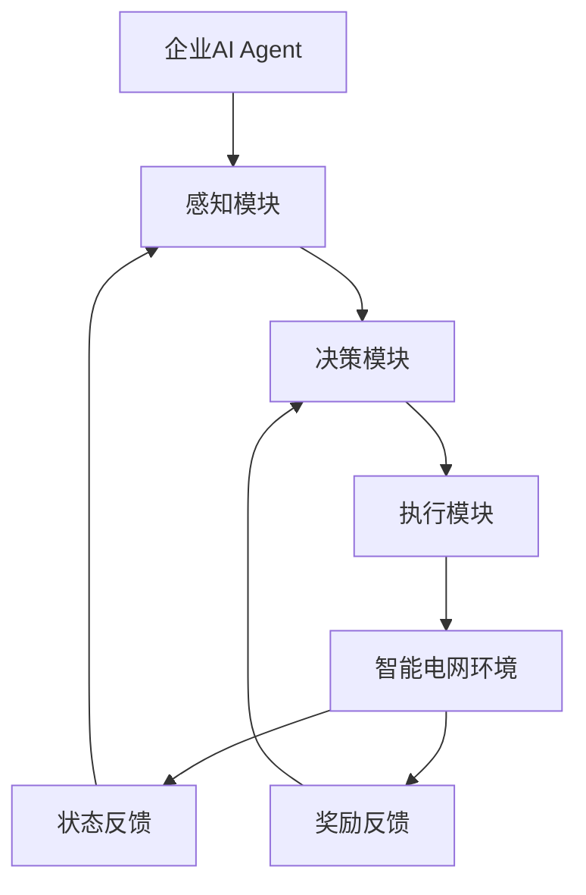

# 企业AI Agent的强化学习在智能电网负载均衡中的应用

> 关键词：企业AI Agent、强化学习、智能电网、负载均衡、电力系统

> 摘要：本文深入探讨了企业AI Agent的强化学习在智能电网负载均衡中的应用。首先介绍了相关背景知识，包括目的范围、预期读者等。接着阐述了核心概念与联系，通过文本示意图和Mermaid流程图展示其架构。详细讲解了核心算法原理及具体操作步骤，并给出Python源代码。同时分析了数学模型和公式，结合实际例子进行说明。通过项目实战，展示了代码实际案例并进行详细解读。还介绍了实际应用场景，推荐了相关工具和资源。最后总结了未来发展趋势与挑战，并给出常见问题解答和扩展阅读参考资料。旨在为相关领域的研究和实践提供全面而深入的指导。

## 1. 背景介绍 
### 1.1 目的和范围
智能电网作为未来电力系统的发展方向，其负载均衡问题至关重要。负载不均衡会导致部分设备过载，增加能源损耗，甚至引发停电事故。本研究的目的在于探索如何利用企业AI Agent的强化学习技术来实现智能电网的负载均衡。具体范围涵盖了从强化学习算法的原理研究，到如何将其应用于智能电网的实际场景，包括负载预测、调度策略制定等方面。

### 1.2 预期读者
本文预期读者包括电力系统领域的工程师、研究人员，人工智能领域对强化学习应用感兴趣的开发者，以及关注智能电网发展的相关企业管理人员。对于电力系统工程师和研究人员，本文可为他们提供新的技术思路来解决负载均衡问题；对于人工智能开发者，可了解强化学习在实际工业场景中的应用；对于企业管理人员，有助于他们把握智能电网技术发展趋势，做出合理的决策。

### 1.3 文档结构概述
本文首先介绍背景知识，让读者了解研究的目的和相关背景信息。接着阐述核心概念与联系，使读者对企业AI Agent、强化学习和智能电网负载均衡有清晰的认识。然后详细讲解核心算法原理和具体操作步骤，通过Python代码进行说明。随后分析数学模型和公式，并举例说明。通过项目实战，展示代码实现和详细解读。介绍实际应用场景，让读者了解该技术的实际用途。推荐相关工具和资源，方便读者进一步学习和研究。最后总结未来发展趋势与挑战，给出常见问题解答和扩展阅读参考资料。

### 1.4 术语表
#### 1.4.1 核心术语定义
- **企业AI Agent**：是指在企业环境中具有自主决策能力的人工智能实体，它可以感知环境信息，根据预设的目标和规则进行决策和行动。
- **强化学习**：是一种机器学习方法，智能体通过与环境进行交互，根据环境反馈的奖励信号来学习最优的行为策略，以最大化长期累积奖励。
- **智能电网**：是将现代信息技术、通信技术与传统电力系统相结合的新型电网，具有智能化、自动化、互动化等特点。
- **负载均衡**：是指将电力系统中的负载合理分配到各个发电设备、输电线路和用电设备上，以避免部分设备过载，提高电网的运行效率和可靠性。

#### 1.4.2 相关概念解释
- **状态空间**：在强化学习中，状态空间是指智能体在环境中可能处于的所有状态的集合。在智能电网负载均衡问题中，状态可以包括各个节点的负载情况、发电设备的运行状态等。
- **动作空间**：是指智能体在某个状态下可以采取的所有可能动作的集合。在负载均衡中，动作可以是调整发电设备的输出功率、切换输电线路等。
- **奖励函数**：是强化学习中的一个重要概念，它用于评估智能体在某个状态下采取某个动作的好坏程度。在智能电网负载均衡中，奖励函数可以根据负载均衡程度、能源损耗等因素来设计。

#### 1.4.3 缩略词列表
- **RL**：强化学习（Reinforcement Learning）
- **AI**：人工智能（Artificial Intelligence）
- **SG**：智能电网（Smart Grid）

## 2. 核心概念与联系 

### 核心概念原理
#### 企业AI Agent
企业AI Agent是人工智能技术在企业领域的应用体现。它具有感知、决策和行动的能力。在智能电网中，企业AI Agent可以作为一个智能的决策者，通过收集电网中的各种信息，如负载数据、设备状态等，然后根据这些信息制定合理的负载均衡策略。

#### 强化学习
强化学习的核心思想是智能体与环境进行交互，通过不断尝试不同的动作，根据环境给予的奖励信号来学习最优的行为策略。在智能电网负载均衡中，强化学习智能体可以根据电网的当前状态选择合适的负载调整动作，然后根据电网反馈的奖励（如负载均衡程度的改善）来更新自己的策略。

#### 智能电网负载均衡
智能电网负载均衡的目标是使电网中的负载分布更加均匀，提高电网的运行效率和可靠性。这需要综合考虑发电设备的发电能力、输电线路的传输能力以及用户的用电需求等因素。

### 架构的文本示意图
```plaintext
企业AI Agent
|
|-- 感知模块：收集智能电网的状态信息（负载、设备状态等）
|
|-- 决策模块：基于强化学习算法，根据感知到的状态信息选择最优动作
|
|-- 执行模块：将决策模块选择的动作应用到智能电网中
|
智能电网环境
|
|-- 状态反馈：将电网的当前状态反馈给企业AI Agent的感知模块
|
|-- 奖励反馈：根据企业AI Agent采取的动作，给予相应的奖励信号
```

### Mermaid流程图


## 3. 核心算法原理 & 具体操作步骤 

### 核心算法原理
在智能电网负载均衡中，我们可以使用深度Q网络（Deep Q-Network，DQN）作为强化学习算法。DQN是一种基于值函数的强化学习算法，它通过神经网络来近似Q值函数。Q值函数表示在某个状态下采取某个动作的预期累积奖励。

### Python源代码详细阐述
```python
import torch
import torch.nn as nn
import torch.optim as optim
import numpy as np
import random

# 定义DQN网络
class DQN(nn.Module):
    def __init__(self, input_dim, output_dim):
        super(DQN, self).__init__()
        self.fc1 = nn.Linear(input_dim, 64)
        self.fc2 = nn.Linear(64, 64)
        self.fc3 = nn.Linear(64, output_dim)

    def forward(self, x):
        x = torch.relu(self.fc1(x))
        x = torch.relu(self.fc2(x))
        return self.fc3(x)

# 定义强化学习智能体
class Agent:
    def __init__(self, input_dim, output_dim, learning_rate=0.001, gamma=0.99, epsilon=1.0, epsilon_decay=0.995, epsilon_min=0.01):
        self.input_dim = input_dim
        self.output_dim = output_dim
        self.learning_rate = learning_rate
        self.gamma = gamma
        self.epsilon = epsilon
        self.epsilon_decay = epsilon_decay
        self.epsilon_min = epsilon_min
        self.model = DQN(input_dim, output_dim)
        self.optimizer = optim.Adam(self.model.parameters(), lr=learning_rate)
        self.criterion = nn.MSELoss()

    def choose_action(self, state):
        if np.random.rand() <= self.epsilon:
            return random.randrange(self.output_dim)
        state = torch.FloatTensor(state).unsqueeze(0)
        q_values = self.model(state)
        action = torch.argmax(q_values).item()
        return action

    def learn(self, state, action, reward, next_state, done):
        state = torch.FloatTensor(state).unsqueeze(0)
        next_state = torch.FloatTensor(next_state).unsqueeze(0)
        action = torch.LongTensor([action])
        reward = torch.FloatTensor([reward])

        q_values = self.model(state)
        q_value = q_values.gather(1, action.unsqueeze(1)).squeeze(1)

        next_q_values = self.model(next_state)
        next_q_value = next_q_values.max(1)[0].detach()
        target = reward + self.gamma * next_q_value * (1 - done)

        loss = self.criterion(q_value, target)
        self.optimizer.zero_grad()
        loss.backward()
        self.optimizer.step()

        if self.epsilon > self.epsilon_min:
            self.epsilon *= self.epsilon_decay
```

### 具体操作步骤
1. **初始化智能体**：设置输入维度、输出维度、学习率、折扣因子等参数，创建DQN网络和优化器。
2. **环境交互**：智能体从智能电网环境中获取当前状态，根据当前状态选择动作。
3. **执行动作**：将选择的动作应用到智能电网中，环境根据动作给出新的状态和奖励。
4. **学习更新**：智能体根据当前状态、动作、奖励和下一个状态进行学习，更新DQN网络的参数。
5. **重复步骤2 - 4**：不断进行环境交互和学习，直到达到预设的训练步数或满足停止条件。

## 4. 数学模型和公式 & 详细讲解 & 举例说明 

### 数学模型和公式
#### Q值函数
在强化学习中，Q值函数 $Q(s, a)$ 表示在状态 $s$ 下采取动作 $a$ 的预期累积奖励。其递归公式为：
$$Q(s, a) = \mathbb{E}[r + \gamma \max_{a'} Q(s', a') | s, a]$$
其中，$r$ 是即时奖励，$\gamma$ 是折扣因子，$s'$ 是下一个状态，$a'$ 是下一个动作。

#### 深度Q网络损失函数
深度Q网络使用均方误差损失函数来更新网络参数。损失函数定义为：
$$L(\theta) = \mathbb{E}[(y - Q(s, a; \theta))^2]$$
其中，$y = r + \gamma \max_{a'} Q(s', a'; \theta^-)$ 是目标Q值，$\theta$ 是当前网络的参数，$\theta^-$ 是目标网络的参数。

### 详细讲解
Q值函数的公式表示了在当前状态下采取某个动作的价值，它不仅考虑了即时奖励，还考虑了未来的预期奖励。折扣因子 $\gamma$ 用于平衡即时奖励和未来奖励的重要性。深度Q网络的损失函数用于衡量当前网络预测的Q值与目标Q值之间的差异，通过最小化损失函数来更新网络参数，使网络能够更好地近似Q值函数。

### 举例说明
假设智能电网中有两个发电设备，状态 $s$ 表示两个设备的当前负载情况，动作 $a$ 表示调整其中一个设备的输出功率。即时奖励 $r$ 根据负载均衡程度来计算，如果调整后负载更加均衡，则 $r$ 为正；否则为负。折扣因子 $\gamma = 0.9$。

初始状态 $s_0$ 下，智能体选择动作 $a_0$，得到即时奖励 $r_0 = 10$，下一个状态 $s_1$。假设在状态 $s_1$ 下，最大的Q值为 $Q(s_1, a_{max}) = 20$。则目标Q值 $y = r_0 + \gamma \times Q(s_1, a_{max}) = 10 + 0.9 \times 20 = 28$。如果当前网络预测的Q值 $Q(s_0, a_0; \theta) = 25$，则损失函数 $L(\theta) = (28 - 25)^2 = 9$。通过反向传播更新网络参数，使损失函数逐渐减小。

## 5. 项目实战：代码实际案例和详细解释说明 

### 5.1  开发环境搭建
#### 硬件环境
- 处理器：Intel Core i7 及以上
- 内存：16GB 及以上
- 硬盘：512GB 及以上

#### 软件环境
- 操作系统：Windows 10 或 Ubuntu 18.04 及以上
- Python 版本：Python 3.7 及以上
- 深度学习框架：PyTorch 1.7 及以上
- 其他依赖库：NumPy、Matplotlib 等

#### 安装步骤
1. 安装 Python：从 Python 官方网站下载并安装 Python 3.7 及以上版本。
2. 安装 PyTorch：根据自己的 CUDA 版本和操作系统，从 PyTorch 官方网站选择合适的安装命令进行安装。
3. 安装其他依赖库：使用 `pip install numpy matplotlib` 命令安装 NumPy 和 Matplotlib。

### 5.2  源代码详细实现和代码解读
```python
import torch
import torch.nn as nn
import torch.optim as optim
import numpy as np
import random
import matplotlib.pyplot as plt

# 定义DQN网络
class DQN(nn.Module):
    def __init__(self, input_dim, output_dim):
        super(DQN, self).__init__()
        self.fc1 = nn.Linear(input_dim, 64)
        self.fc2 = nn.Linear(64, 64)
        self.fc3 = nn.Linear(64, output_dim)

    def forward(self, x):
        x = torch.relu(self.fc1(x))
        x = torch.relu(self.fc2(x))
        return self.fc3(x)

# 定义强化学习智能体
class Agent:
    def __init__(self, input_dim, output_dim, learning_rate=0.001, gamma=0.99, epsilon=1.0, epsilon_decay=0.995, epsilon_min=0.01):
        self.input_dim = input_dim
        self.output_dim = output_dim
        self.learning_rate = learning_rate
        self.gamma = gamma
        self.epsilon = epsilon
        self.epsilon_decay = epsilon_decay
        self.epsilon_min = epsilon_min
        self.model = DQN(input_dim, output_dim)
        self.optimizer = optim.Adam(self.model.parameters(), lr=learning_rate)
        self.criterion = nn.MSELoss()

    def choose_action(self, state):
        if np.random.rand() <= self.epsilon:
            return random.randrange(self.output_dim)
        state = torch.FloatTensor(state).unsqueeze(0)
        q_values = self.model(state)
        action = torch.argmax(q_values).item()
        return action

    def learn(self, state, action, reward, next_state, done):
        state = torch.FloatTensor(state).unsqueeze(0)
        next_state = torch.FloatTensor(next_state).unsqueeze(0)
        action = torch.LongTensor([action])
        reward = torch.FloatTensor([reward])

        q_values = self.model(state)
        q_value = q_values.gather(1, action.unsqueeze(1)).squeeze(1)

        next_q_values = self.model(next_state)
        next_q_value = next_q_values.max(1)[0].detach()
        target = reward + self.gamma * next_q_value * (1 - done)

        loss = self.criterion(q_value, target)
        self.optimizer.zero_grad()
        loss.backward()
        self.optimizer.step()

        if self.epsilon > self.epsilon_min:
            self.epsilon *= self.epsilon_decay

# 定义智能电网环境
class SmartGridEnv:
    def __init__(self):
        self.num_devices = 2
        self.max_load = 100
        self.state = np.random.randint(0, self.max_load, self.num_devices)

    def reset(self):
        self.state = np.random.randint(0, self.max_load, self.num_devices)
        return self.state

    def step(self, action):
        # 简单的动作逻辑：调整其中一个设备的负载
        if action == 0:
            self.state[0] = min(self.state[0] + 10, self.max_load)
        elif action == 1:
            self.state[0] = max(self.state[0] - 10, 0)
        elif action == 2:
            self.state[1] = min(self.state[1] + 10, self.max_load)
        elif action == 3:
            self.state[1] = max(self.state[1] - 10, 0)

        # 计算奖励：负载均衡程度
        load_diff = np.abs(self.state[0] - self.state[1])
        reward = -load_diff

        done = False
        return self.state, reward, done, {}

# 训练智能体
def train_agent():
    env = SmartGridEnv()
    input_dim = env.num_devices
    output_dim = 4
    agent = Agent(input_dim, output_dim)

    num_episodes = 1000
    rewards = []

    for episode in range(num_episodes):
        state = env.reset()
        total_reward = 0
        done = False

        while not done:
            action = agent.choose_action(state)
            next_state, reward, done, _ = env.step(action)
            agent.learn(state, action, reward, next_state, done)
            state = next_state
            total_reward += reward

        rewards.append(total_reward)
        print(f"Episode {episode + 1}: Total Reward = {total_reward}")

    # 绘制奖励曲线
    plt.plot(rewards)
    plt.xlabel('Episode')
    plt.ylabel('Total Reward')
    plt.title('Training Rewards')
    plt.show()

if __name__ == "__main__":
    train_agent()
```

### 代码解读与分析
#### DQN网络
`DQN` 类定义了一个三层全连接神经网络，用于近似Q值函数。输入维度是状态的维度，输出维度是动作的维度。

#### 智能体类
`Agent` 类实现了智能体的主要功能，包括选择动作和学习更新。`choose_action` 方法根据当前的探索率 $\epsilon$ 选择随机动作或根据Q值选择最优动作。`learn` 方法根据当前状态、动作、奖励和下一个状态更新DQN网络的参数。

#### 智能电网环境类
`SmartGridEnv` 类模拟了智能电网的环境，包括初始化状态、重置环境和执行动作等功能。`step` 方法根据选择的动作更新状态，并计算奖励。

#### 训练函数
`train_agent` 函数用于训练智能体。在每个回合中，智能体与环境进行交互，选择动作，获取奖励，并进行学习更新。最后绘制奖励曲线，观察训练效果。

## 6. 实际应用场景 
### 分布式发电系统中的负载均衡
在分布式发电系统中，存在多个分布式电源，如太阳能电池板、风力发电机等。这些电源的输出功率会受到天气等因素的影响，导致负载不均衡。企业AI Agent的强化学习可以根据实时的发电情况和负载需求，动态调整各个分布式电源的输出功率，实现负载均衡。

### 大型数据中心的电力分配
大型数据中心的服务器数量众多，不同服务器的负载差异较大。通过企业AI Agent的强化学习，可以实时监测服务器的负载情况，合理分配电力资源，避免部分服务器过载，同时降低能源损耗。

### 智能微电网的运行管理
智能微电网是一个相对独立的电力系统，包含多种分布式电源、储能设备和负载。企业AI Agent的强化学习可以用于优化微电网的运行策略，实现负载均衡、能量存储和释放的合理调度，提高微电网的稳定性和经济性。

## 7. 工具和资源推荐
### 7.1 学习资源推荐
#### 7.1.1 书籍推荐
- 《强化学习：原理与Python实现》：这本书系统地介绍了强化学习的基本原理和算法，并通过Python代码进行实现，适合初学者入门。
- 《深度学习》：由深度学习领域的三位巨头所著，详细介绍了深度学习的理论和实践，对于理解深度Q网络等深度学习模型有很大帮助。
- 《智能电网：技术、应用与市场》：全面介绍了智能电网的相关技术、应用场景和市场发展趋势，有助于了解智能电网的整体情况。

#### 7.1.2 在线课程
- Coursera上的“强化学习专项课程”：由DeepMind的研究人员授课，内容涵盖了强化学习的基础理论和前沿算法。
- edX上的“深度学习基础”：介绍了深度学习的基本概念和常见模型，为学习深度Q网络提供了必要的知识基础。
- 中国大学MOOC上的“智能电网技术”：由国内高校的教授授课，讲解了智能电网的关键技术和应用案例。

#### 7.1.3 技术博客和网站
- OpenAI博客：提供了强化学习领域的最新研究成果和应用案例。
- DeepMind博客：分享了DeepMind在人工智能领域的研究进展，包括强化学习在游戏、机器人等领域的应用。
- IEEE智能电网杂志官网：发布了智能电网领域的最新研究论文和技术报告。

### 7.2 开发工具框架推荐
#### 7.2.1 IDE和编辑器
- PyCharm：是一款专门为Python开发设计的集成开发环境，具有代码自动补全、调试等功能，适合开发强化学习项目。
- Jupyter Notebook：可以将代码、文本和可视化结果集成在一个文档中，方便进行代码测试和实验记录。
- Visual Studio Code：是一款轻量级的代码编辑器，支持多种编程语言，具有丰富的插件扩展功能。

#### 7.2.2 调试和性能分析工具
- PyTorch Profiler：可以对PyTorch模型进行性能分析，帮助开发者找出代码中的性能瓶颈。
- TensorBoard：是TensorFlow的可视化工具，也可以与PyTorch结合使用，用于可视化训练过程中的损失函数、奖励曲线等指标。
- cProfile：是Python的内置性能分析工具，可以分析代码的运行时间和函数调用次数。

#### 7.2.3 相关框架和库
- PyTorch：是一个开源的深度学习框架，提供了丰富的神经网络模型和优化算法，方便实现深度Q网络。
- Gym：是OpenAI开发的一个强化学习环境库，包含了多种模拟环境，可用于测试和验证强化学习算法。
- NumPy：是Python的一个科学计算库，提供了高效的数组操作和数学函数，在强化学习中经常用于处理状态和动作数据。

### 7.3 相关论文著作推荐
#### 7.3.1 经典论文
- “Playing Atari with Deep Reinforcement Learning”：这篇论文首次提出了深度Q网络（DQN），并证明了其在Atari游戏中的有效性。
- “Human-level control through deep reinforcement learning”：进一步改进了DQN算法，使其在更多的Atari游戏中达到了人类水平的表现。
- “Deep Reinforcement Learning for Energy Management in Smart Homes”：探讨了强化学习在智能家居能源管理中的应用，为智能电网负载均衡提供了参考。

#### 7.3.2 最新研究成果
- 近年来，关于强化学习在智能电网中的应用研究不断涌现，如使用多智能体强化学习解决复杂的电网调度问题，结合深度学习和强化学习进行更准确的负载预测等。可以通过IEEE Xplore、ACM Digital Library等学术数据库搜索相关论文。

#### 7.3.3 应用案例分析
- 一些实际的智能电网项目会发布相关的应用案例分析报告，介绍如何使用强化学习技术实现负载均衡。可以关注国内外电力公司、科研机构的官方网站，获取这些案例分析资料。

## 8. 总结：未来发展趋势与挑战
### 未来发展趋势
#### 多智能体强化学习的应用
随着智能电网的规模不断扩大，系统的复杂性也在增加。多智能体强化学习可以让多个AI Agent协同工作，共同解决负载均衡问题。例如，不同区域的智能体可以相互协作，实现跨区域的负载平衡。

#### 与其他技术的融合
强化学习可以与深度学习、大数据、物联网等技术相结合，提高负载均衡的准确性和效率。例如，通过深度学习进行更准确的负载预测，利用大数据分析挖掘电网中的潜在信息，借助物联网技术实现实时的数据采集和控制。

#### 智能电网的自主化和智能化
未来的智能电网将更加自主化和智能化，企业AI Agent的强化学习可以使电网自动感知环境变化，自主调整负载均衡策略，减少人工干预，提高电网的运行效率和可靠性。

### 挑战
#### 数据安全和隐私问题
智能电网中涉及大量的敏感数据，如用户的用电信息、发电设备的运行状态等。在使用强化学习进行负载均衡时，需要确保数据的安全和隐私，防止数据泄露和恶意攻击。

#### 算法的可解释性
强化学习算法通常是基于黑盒模型，其决策过程难以解释。在智能电网这样的关键领域，需要算法具有可解释性，以便操作人员理解和信任算法的决策。

#### 环境的复杂性和不确定性
智能电网的环境非常复杂，受到天气、用户行为等多种因素的影响，具有很大的不确定性。强化学习算法需要能够适应这种复杂和不确定的环境，提高算法的鲁棒性。

## 9. 附录：常见问题与解答
### 问题1：强化学习在智能电网负载均衡中的收敛速度如何？
解答：强化学习的收敛速度受到多种因素的影响，如算法的选择、学习率、折扣因子等。在实际应用中，可以通过调整这些参数，采用经验回放、目标网络等技术来提高收敛速度。

### 问题2：如何设计合适的奖励函数？
解答：奖励函数的设计需要根据具体的应用场景和目标来确定。在智能电网负载均衡中，奖励函数可以考虑负载均衡程度、能源损耗、设备寿命等因素。例如，可以将负载均衡程度作为主要的奖励指标，同时考虑能源损耗的惩罚项。

### 问题3：企业AI Agent在智能电网中的部署成本高吗？
解答：部署成本包括硬件成本、软件成本和人力成本等。硬件方面，需要配备服务器、传感器等设备；软件方面，需要开发和维护强化学习算法和相关系统；人力方面，需要专业的技术人员进行系统的部署和管理。具体的成本取决于系统的规模和复杂程度。

### 问题4：强化学习算法对数据的质量有什么要求？
解答：强化学习算法对数据的质量要求较高。数据需要具有准确性、完整性和一致性。不准确或不完整的数据可能会导致算法学习到错误的策略。此外，数据的分布也会影响算法的性能，需要保证数据的分布具有代表性。

## 10. 扩展阅读 & 参考资料
### 扩展阅读
- 《人工智能：现代方法》：全面介绍了人工智能的各个领域，包括搜索算法、机器学习、自然语言处理等，对于深入理解人工智能技术有很大帮助。
- 《复杂网络》：智能电网可以看作是一个复杂网络，这本书介绍了复杂网络的基本概念、模型和分析方法，有助于从网络的角度理解智能电网的负载均衡问题。
- 《电力系统分析》：详细讲解了电力系统的基本原理、运行特性和分析方法，对于理解智能电网的物理结构和运行机制有重要意义。

### 参考资料
- Sutton, R. S., & Barto, A. G. (2018). Reinforcement learning: An introduction. MIT press.
- Goodfellow, I., Bengio, Y., & Courville, A. (2016). Deep learning. MIT press.
- IEEE Transactions on Smart Grid：该期刊发表了大量关于智能电网技术和应用的研究论文，是智能电网领域的权威参考资料。

作者：AI天才研究院/AI Genius Institute & 禅与计算机程序设计艺术 /Zen And The Art of Computer Programming