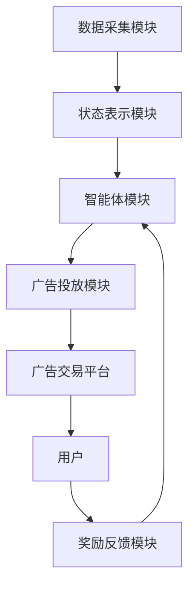

# 企业AI Agent的强化学习在程序化广告投放中的实践

> 关键词：企业AI Agent、强化学习、程序化广告投放、广告优化、智能决策

> 摘要：本文深入探讨了企业AI Agent的强化学习在程序化广告投放中的实践应用。首先介绍了相关背景，包括目的范围、预期读者等。接着阐述了核心概念及联系，详细讲解了强化学习在广告投放中的原理和架构。通过Python代码详细说明了核心算法原理及具体操作步骤，同时给出了相关数学模型和公式并举例说明。在项目实战部分，提供了开发环境搭建、源代码实现及解读。分析了实际应用场景，推荐了学习资源、开发工具框架和相关论文著作。最后总结了未来发展趋势与挑战，解答了常见问题，并提供了扩展阅读和参考资料，旨在为企业在程序化广告投放中运用强化学习提供全面的技术指导和实践思路。

## 1. 背景介绍 
### 1.1 目的和范围
在当今数字化营销时代，程序化广告投放已经成为企业推广产品和服务的重要手段。然而，传统的广告投放策略往往缺乏灵活性和智能性，难以根据实时数据和市场变化做出最优决策。企业AI Agent的强化学习为解决这一问题提供了新的途径。本文的目的在于详细介绍如何将企业AI Agent的强化学习应用于程序化广告投放中，包括算法原理、具体操作步骤、项目实战案例等内容。范围涵盖了从理论基础到实际应用的各个方面，旨在帮助企业更好地理解和运用这一技术，提高广告投放的效果和效率。

### 1.2 预期读者
本文的预期读者包括广告行业从业者，如广告投放经理、营销策划人员等，他们希望通过引入新技术提升广告投放的效果；企业的技术人员，如算法工程师、数据科学家等，对强化学习和程序化广告投放技术感兴趣，希望深入了解相关原理和实现方法；以及对人工智能在商业领域应用有研究需求的学者和研究人员。

### 1.3 文档结构概述
本文首先介绍相关背景知识，包括目的范围、预期读者和文档结构等内容。接着阐述核心概念与联系，包括企业AI Agent、强化学习和程序化广告投放的定义和相互关系。然后详细讲解核心算法原理和具体操作步骤，并给出相应的Python代码示例。通过数学模型和公式进一步深入分析强化学习在广告投放中的应用。在项目实战部分，提供开发环境搭建、源代码实现和代码解读。分析实际应用场景，推荐学习资源、开发工具框架和相关论文著作。最后总结未来发展趋势与挑战，解答常见问题，并提供扩展阅读和参考资料。

### 1.4 术语表
#### 1.4.1 核心术语定义
- **企业AI Agent**：指企业层面应用的人工智能代理，它能够感知环境信息，根据预设的目标和策略进行决策，并采取相应的行动。在程序化广告投放中，企业AI Agent可以根据广告投放环境和数据，自动调整广告投放策略。
- **强化学习**：一种机器学习方法，智能体（Agent）通过与环境进行交互，根据环境反馈的奖励信号来学习最优的行为策略，以最大化长期累积奖励。在广告投放中，智能体可以根据广告投放的效果（如点击率、转化率等）来调整投放策略。
- **程序化广告投放**：利用自动化技术和算法，根据用户的特征、行为和实时数据，在多个广告交易平台上自动购买和投放广告的过程。

#### 1.4.2 相关概念解释
- **状态（State）**：在强化学习中，状态是对环境的一种描述。在广告投放中，状态可以包括用户的特征（如年龄、性别、兴趣爱好等）、广告的属性（如广告类型、出价等）以及当前的市场环境等信息。
- **动作（Action）**：智能体在某个状态下可以采取的行为。在广告投放中，动作可以包括选择投放的广告、调整出价、选择投放的平台等。
- **奖励（Reward）**：环境对智能体采取的动作的反馈。在广告投放中，奖励可以是广告的点击率、转化率、收益等指标。

#### 1.4.3 缩略词列表
- **Q-learning**：一种无模型的强化学习算法，用于学习最优的动作价值函数。
- **MDP**：马尔可夫决策过程（Markov Decision Process），是强化学习中的一种数学模型，用于描述智能体与环境的交互过程。

## 2. 核心概念与联系 

### 核心概念原理
#### 企业AI Agent
企业AI Agent是企业在数字化运营中引入的智能决策实体。它基于人工智能技术，能够收集、分析和处理大量的数据，以实现自动化的决策和行动。在程序化广告投放中，企业AI Agent可以实时监测广告投放的效果，根据用户的行为和市场变化，自动调整广告投放策略，从而提高广告的投放效率和效果。

#### 强化学习
强化学习是一种通过智能体与环境进行交互来学习最优策略的机器学习方法。智能体在每个时间步观察环境的状态，选择一个动作执行，环境根据智能体的动作返回一个奖励和下一个状态。智能体的目标是通过不断地与环境交互，学习到一个最优的策略，使得长期累积奖励最大化。强化学习的核心是动作价值函数 $Q(s,a)$，它表示在状态 $s$ 下采取动作 $a$ 所能获得的期望累积奖励。

#### 程序化广告投放
程序化广告投放是一种基于自动化技术和算法的广告投放方式。它通过实时竞价（RTB）系统，在广告交易平台上自动购买和投放广告。程序化广告投放可以根据用户的特征、行为和实时数据，精准地选择目标受众，提高广告的投放效果。同时，它还可以实时监测广告的投放效果，根据反馈数据调整投放策略。

### 架构的文本示意图
企业AI Agent的强化学习在程序化广告投放中的架构主要包括以下几个部分：
1. **数据采集模块**：负责收集用户的特征数据、广告的展示数据、点击数据、转化数据等信息，为强化学习提供数据支持。
2. **状态表示模块**：将采集到的数据转化为强化学习中的状态表示，以便智能体能够理解和处理。
3. **智能体模块**：基于强化学习算法，根据当前的状态选择最优的动作（如选择广告、调整出价等）。
4. **广告投放模块**：根据智能体选择的动作，在广告交易平台上进行广告投放。
5. **奖励反馈模块**：根据广告投放的效果（如点击率、转化率等），为智能体提供奖励反馈，以便智能体学习和优化策略。

### Mermaid流程图


## 3. 核心算法原理 & 具体操作步骤 

### 核心算法原理 - Q-learning
Q-learning是一种无模型的强化学习算法，用于学习最优的动作价值函数 $Q(s,a)$。其基本思想是通过不断地更新 $Q$ 值，使得智能体能够学习到在每个状态下采取最优动作的策略。

Q-learning的更新公式为：
$$Q(s_t,a_t) \leftarrow Q(s_t,a_t) + \alpha [r_{t+1} + \gamma \max_{a} Q(s_{t+1},a) - Q(s_t,a_t)]$$
其中，$s_t$ 表示当前状态，$a_t$ 表示当前动作，$r_{t+1}$ 表示执行动作 $a_t$ 后获得的奖励，$s_{t+1}$ 表示下一个状态，$\alpha$ 是学习率，$\gamma$ 是折扣因子。

### 具体操作步骤
1. **初始化**：初始化 $Q$ 表，将所有的 $Q(s,a)$ 值初始化为 0。设置学习率 $\alpha$ 和折扣因子 $\gamma$。
2. **循环迭代**：
    - 观察当前状态 $s_t$。
    - 根据 $Q$ 表选择动作 $a_t$，可以采用 $\epsilon$-贪心策略，以一定的概率 $\epsilon$ 随机选择动作，以 $1 - \epsilon$ 的概率选择 $Q$ 值最大的动作。
    - 执行动作 $a_t$，获得奖励 $r_{t+1}$ 和下一个状态 $s_{t+1}$。
    - 根据 Q-learning 更新公式更新 $Q(s_t,a_t)$。
    - 更新当前状态 $s_t = s_{t+1}$。
3. **终止条件**：达到预设的迭代次数或满足其他终止条件。

### Python源代码实现
```python
import numpy as np

# 初始化参数
num_states = 10
num_actions = 5
alpha = 0.1
gamma = 0.9
epsilon = 0.1
num_episodes = 1000

# 初始化Q表
Q = np.zeros((num_states, num_actions))

# 定义环境
def get_reward(state, action):
    # 这里简单模拟奖励，实际应用中需要根据广告投放效果计算
    return np.random.randint(0, 10)

def get_next_state(state, action):
    # 这里简单模拟下一个状态，实际应用中需要根据广告投放情况更新
    return np.random.randint(0, num_states)

# Q-learning算法
for episode in range(num_episodes):
    state = np.random.randint(0, num_states)
    done = False
    while not done:
        # 选择动作
        if np.random.uniform(0, 1) < epsilon:
            action = np.random.randint(0, num_actions)
        else:
            action = np.argmax(Q[state, :])
        
        # 执行动作
        reward = get_reward(state, action)
        next_state = get_next_state(state, action)
        
        # 更新Q表
        Q[state, action] = Q[state, action] + alpha * (reward + gamma * np.max(Q[next_state, :]) - Q[state, action])
        
        # 更新状态
        state = next_state
        
        # 判断是否终止
        if np.random.uniform(0, 1) < 0.1:
            done = True

# 输出最终的Q表
print("Final Q table:")
print(Q)
```

## 4. 数学模型和公式 & 详细讲解 & 举例说明 

### 马尔可夫决策过程（MDP）
马尔可夫决策过程是强化学习中的一种数学模型，用于描述智能体与环境的交互过程。一个 MDP 可以用一个五元组 $(S, A, P, R, \gamma)$ 来表示，其中：
- $S$ 是状态空间，表示环境的所有可能状态。
- $A$ 是动作空间，表示智能体在每个状态下可以采取的所有可能动作。
- $P(s_{t+1}|s_t,a_t)$ 是状态转移概率，表示在状态 $s_t$ 下采取动作 $a_t$ 后转移到状态 $s_{t+1}$ 的概率。
- $R(s_t,a_t)$ 是奖励函数，表示在状态 $s_t$ 下采取动作 $a_t$ 所获得的即时奖励。
- $\gamma$ 是折扣因子，用于衡量未来奖励的重要性。

### 动作价值函数和状态价值函数
- **动作价值函数**：$Q(s,a)$ 表示在状态 $s$ 下采取动作 $a$ 所能获得的期望累积奖励，定义为：
$$Q(s,a) = \mathbb{E} \left[ \sum_{k=0}^{\infty} \gamma^k r_{t+k+1} | s_t = s, a_t = a \right]$$
其中，$r_{t+k+1}$ 是在时间步 $t + k + 1$ 获得的奖励。

- **状态价值函数**：$V(s)$ 表示在状态 $s$ 下遵循最优策略所能获得的期望累积奖励，定义为：
$$V(s) = \max_{a} Q(s,a)$$

### 贝尔曼方程
贝尔曼方程是强化学习中的一个重要方程，用于描述动作价值函数和状态价值函数的递归关系。对于动作价值函数，贝尔曼方程为：
$$Q(s,a) = \mathbb{E} \left[ r + \gamma \max_{a'} Q(s',a') | s, a \right]$$
其中，$s'$ 是下一个状态。

### 举例说明
假设我们有一个简单的广告投放环境，状态空间 $S = \{s_1, s_2\}$，动作空间 $A = \{a_1, a_2\}$。状态转移概率和奖励函数如下：
- $P(s_1|s_1,a_1) = 0.8$，$P(s_2|s_1,a_1) = 0.2$，$R(s_1,a_1) = 1$
- $P(s_1|s_1,a_2) = 0.3$，$P(s_2|s_1,a_2) = 0.7$，$R(s_1,a_2) = 2$
- $P(s_1|s_2,a_1) = 0.6$，$P(s_2|s_2,a_1) = 0.4$，$R(s_2,a_1) = 3$
- $P(s_1|s_2,a_2) = 0.1$，$P(s_2|s_2,a_2) = 0.9$，$R(s_2,a_2) = 4$

折扣因子 $\gamma = 0.9$。

初始时，$Q(s_1,a_1) = Q(s_1,a_2) = Q(s_2,a_1) = Q(s_2,a_2) = 0$。

假设当前状态 $s_t = s_1$，选择动作 $a_t = a_1$。根据状态转移概率，以 0.8 的概率转移到状态 $s_1$，以 0.2 的概率转移到状态 $s_2$。获得奖励 $r_{t+1} = 1$。

根据 Q-learning 更新公式：
$$Q(s_1,a_1) \leftarrow Q(s_1,a_1) + \alpha [r_{t+1} + \gamma \max_{a} Q(s_{t+1},a) - Q(s_1,a_1)]$$

如果转移到状态 $s_1$，则：
$$Q(s_1,a_1) \leftarrow 0 + 0.1 [1 + 0.9 \max(0, 0) - 0] = 0.1$$

如果转移到状态 $s_2$，则：
$$Q(s_1,a_1) \leftarrow 0 + 0.1 [1 + 0.9 \max(0, 0) - 0] = 0.1$$

通过不断地迭代更新，$Q$ 表会逐渐收敛到最优值。

## 5. 项目实战：代码实际案例和详细解释说明 

### 5.1  开发环境搭建
#### 操作系统
可以选择 Linux（如 Ubuntu）、Windows 或 macOS 作为开发操作系统。

#### 编程语言和库
- **Python**：选择 Python 3.x 版本，它是一种广泛使用的编程语言，具有丰富的机器学习和数据处理库。
- **NumPy**：用于数值计算和数组操作。
- **Pandas**：用于数据处理和分析。
- **TensorFlow 或 PyTorch**：用于深度学习模型的构建和训练。

#### 安装步骤
1. 安装 Python：可以从 Python 官方网站（https://www.python.org/downloads/）下载并安装适合你操作系统的 Python 版本。
2. 安装所需库：使用 pip 命令安装所需的库，例如：
```sh
pip install numpy pandas tensorflow
```

### 5.2  源代码详细实现和代码解读
```python
import numpy as np
import pandas as pd
import tensorflow as tf

# 数据加载和预处理
def load_data(file_path):
    data = pd.read_csv(file_path)
    # 假设数据包含用户特征、广告特征和点击标签
    X = data.drop('click', axis=1).values
    y = data['click'].values
    return X, y

# 定义强化学习智能体
class RLAgent:
    def __init__(self, state_size, action_size):
        self.state_size = state_size
        self.action_size = action_size
        self.gamma = 0.95  # 折扣因子
        self.epsilon = 1.0  # 探索率
        self.epsilon_min = 0.01
        self.epsilon_decay = 0.995
        self.learning_rate = 0.001
        self.model = self._build_model()

    def _build_model(self):
        model = tf.keras.Sequential([
            tf.keras.layers.Dense(24, input_dim=self.state_size, activation='relu'),
            tf.keras.layers.Dense(24, activation='relu'),
            tf.keras.layers.Dense(self.action_size, activation='linear')
        ])
        model.compile(loss='mse', optimizer=tf.keras.optimizers.Adam(lr=self.learning_rate))
        return model

    def act(self, state):
        if np.random.rand() <= self.epsilon:
            return np.random.choice(self.action_size)
        act_values = self.model.predict(state)
        return np.argmax(act_values[0])

    def replay(self, memory, batch_size):
        minibatch = np.random.choice(len(memory), batch_size, replace=False)
        for i in minibatch:
            state, action, reward, next_state, done = memory[i]
            target = reward
            if not done:
                target = (reward + self.gamma * np.amax(self.model.predict(next_state)[0]))
            target_f = self.model.predict(state)
            target_f[0][action] = target
            self.model.fit(state, target_f, epochs=1, verbose=0)
        if self.epsilon > self.epsilon_min:
            self.epsilon *= self.epsilon_decay

# 主函数
def main():
    file_path = 'advertising_data.csv'
    X, y = load_data(file_path)
    state_size = X.shape[1]
    action_size = 2  # 假设只有两种动作：投放广告或不投放广告
    agent = RLAgent(state_size, action_size)
    memory = []
    batch_size = 32
    num_episodes = 100

    for episode in range(num_episodes):
        for i in range(len(X)):
            state = X[i].reshape(1, state_size)
            action = agent.act(state)
            reward = y[i]  # 假设点击标签作为奖励
            next_state = X[(i + 1) % len(X)].reshape(1, state_size)
            done = (i == len(X) - 1)
            memory.append((state, action, reward, next_state, done))
            if len(memory) > batch_size:
                agent.replay(memory, batch_size)

    print("Training completed!")

if __name__ == "__main__":
    main()
```

### 5.3  代码解读与分析
#### 数据加载和预处理
`load_data` 函数用于加载广告数据，并将其分为特征矩阵 $X$ 和标签向量 $y$。假设数据包含用户特征、广告特征和点击标签。

#### 强化学习智能体
`RLAgent` 类实现了一个基于深度 Q 网络（DQN）的强化学习智能体。
- `__init__` 方法初始化智能体的参数，包括状态大小、动作大小、折扣因子、探索率等，并构建神经网络模型。
- `_build_model` 方法构建一个简单的全连接神经网络模型，用于学习动作价值函数。
- `act` 方法根据当前状态选择动作，采用 $\epsilon$-贪心策略。
- `replay` 方法用于经验回放，从记忆库中随机选择一批样本进行训练，更新神经网络的参数。

#### 主函数
`main` 函数是程序的入口，负责加载数据、初始化智能体、进行训练等操作。在每个 episode 中，智能体与环境进行交互，将经验存储在记忆库中，并定期进行经验回放来更新模型。

## 6. 实际应用场景 
### 精准广告投放
企业AI Agent的强化学习可以根据用户的实时行为和特征，精准地选择广告进行投放。例如，通过分析用户的浏览历史、搜索记录、购买行为等信息，智能体可以判断用户的兴趣和需求，选择最适合的广告进行展示，从而提高广告的点击率和转化率。

### 广告出价优化
在程序化广告投放中，出价是一个关键因素。强化学习可以根据广告的竞争情况和预期效果，动态地调整出价策略。智能体可以实时监测市场上的广告出价情况和广告展示效果，根据奖励反馈不断优化出价策略，以提高广告的曝光率和投资回报率。

### 广告投放时间优化
不同的时间点用户的活跃度和需求不同，强化学习可以帮助企业选择最佳的广告投放时间。智能体可以分析用户在不同时间段的行为模式和广告效果，根据奖励信号调整广告投放的时间安排，以提高广告的效果。

### 广告组合优化
企业通常会有多种类型的广告可供选择，强化学习可以帮助企业优化广告组合。智能体可以根据不同广告的特点和用户的反馈，选择最有效的广告组合进行投放，以提高广告的整体效果。

## 7. 工具和资源推荐
### 7.1 学习资源推荐
#### 7.1.1 书籍推荐
- 《强化学习：原理与Python实现》：这本书详细介绍了强化学习的基本原理和算法，并通过Python代码进行了实现和讲解，适合初学者入门。
- 《深度学习》：由 Ian Goodfellow、Yoshua Bengio 和 Aaron Courville 编写，是深度学习领域的经典教材，其中也包含了强化学习的相关内容。
- 《Python机器学习》：介绍了Python在机器学习中的应用，包括强化学习的基本算法和实践案例。

#### 7.1.2 在线课程
- Coursera上的“强化学习专项课程”：由DeepMind的研究人员授课，系统地介绍了强化学习的理论和实践。
- edX上的“人工智能基础：强化学习”：提供了强化学习的基础知识和算法实现。
- 哔哩哔哩上有许多关于强化学习的教学视频，适合初学者快速入门。

#### 7.1.3 技术博客和网站
- OpenAI Blog：OpenAI发布的最新研究成果和技术文章，涵盖了强化学习的多个领域。
- DeepMind Blog：DeepMind的官方博客，分享了他们在强化学习领域的最新研究和应用。
- Medium上有许多关于强化学习的优质博客文章，可以关注一些知名作者的账号。

### 7.2 开发工具框架推荐
#### 7.2.1 IDE和编辑器
- PyCharm：是一款专门为Python开发设计的集成开发环境，具有强大的代码编辑、调试和自动补全功能。
- Jupyter Notebook：是一个交互式的开发环境，适合进行数据探索和模型实验。
- Visual Studio Code：是一款轻量级的代码编辑器，支持多种编程语言和插件扩展。

#### 7.2.2 调试和性能分析工具
- TensorBoard：是TensorFlow的可视化工具，可以用于监控模型的训练过程、查看模型的结构和性能指标。
- PyTorch Profiler：是PyTorch的性能分析工具，可以帮助开发者找出代码中的性能瓶颈。
- cProfile：是Python的内置性能分析工具，可以分析代码的执行时间和函数调用情况。

#### 7.2.3 相关框架和库
- TensorFlow：是一个开源的深度学习框架，提供了丰富的工具和函数，支持强化学习算法的实现。
- PyTorch：是另一个流行的深度学习框架，具有动态图的优势，适合快速迭代和实验。
- Stable Baselines：是一个基于OpenAI Gym的强化学习库，提供了多种预训练的强化学习算法和环境。

### 7.3 相关论文著作推荐
#### 7.3.1 经典论文
- “Reinforcement Learning: A Survey”：这是一篇关于强化学习的综述论文，对强化学习的发展历程、基本算法和应用进行了全面的介绍。
- “Playing Atari with Deep Reinforcement Learning”：首次提出了深度 Q 网络（DQN）算法，开创了深度强化学习的先河。
- “Asynchronous Methods for Deep Reinforcement Learning”：提出了异步优势演员-评论家（A3C）算法，提高了强化学习的训练效率。

#### 7.3.2 最新研究成果
- 关注 NeurIPS、ICML、AAAI 等顶级人工智能会议的论文，了解强化学习领域的最新研究进展。
- 在 arXiv 上搜索关于强化学习在广告投放中的应用的论文，获取最新的研究成果。

#### 7.3.3 应用案例分析
- 一些知名企业如谷歌、亚马逊等会发布关于强化学习在广告投放中的应用案例，可以通过他们的官方博客或技术报告进行学习。
- 一些行业研究机构也会发布相关的应用案例分析报告，为企业提供实践参考。

## 8. 总结：未来发展趋势与挑战
### 未来发展趋势
#### 多智能体协同
未来，企业可能会使用多个AI Agent协同进行广告投放，每个智能体负责不同的任务或针对不同的用户群体。多智能体协同可以提高广告投放的效率和效果，实现更复杂的广告策略。

#### 结合其他技术
强化学习可以与其他人工智能技术如深度学习、自然语言处理等相结合，进一步提升广告投放的精准度和智能化水平。例如，通过自然语言处理技术分析用户的文本信息，更好地理解用户的需求和意图。

#### 实时学习和适应
随着市场环境和用户行为的快速变化，企业AI Agent需要具备实时学习和适应的能力。强化学习可以帮助智能体实时调整广告投放策略，以应对不断变化的情况。

### 挑战
#### 数据质量和隐私
强化学习需要大量高质量的数据来进行训练，但在广告投放中，数据的质量和隐私是一个重要的问题。企业需要确保数据的准确性和安全性，同时遵守相关的法律法规。

#### 算法复杂度和计算资源
一些复杂的强化学习算法需要大量的计算资源和时间来进行训练，这对于企业来说可能是一个挑战。企业需要选择合适的算法和优化方法，以降低计算成本。

#### 环境不确定性
广告投放环境存在很多不确定性因素，如竞争对手的策略变化、市场需求的波动等。强化学习智能体需要能够处理这些不确定性，提高决策的鲁棒性。

## 9. 附录：常见问题与解答
### 问题1：强化学习在广告投放中的效果如何衡量？
答：可以通过多种指标来衡量强化学习在广告投放中的效果，如点击率（CTR）、转化率（CVR）、投资回报率（ROI）等。点击率表示广告被点击的次数与展示次数的比例，转化率表示用户完成指定动作（如购买、注册等）的次数与点击次数的比例，投资回报率表示广告投放的收益与成本的比例。

### 问题2：如何选择合适的强化学习算法？
答：选择合适的强化学习算法需要考虑多个因素，如问题的复杂度、数据的规模、计算资源等。对于简单的问题，可以选择 Q-learning 等无模型算法；对于复杂的问题，可以选择深度 Q 网络（DQN）、演员-评论家（AC）等基于深度学习的算法。

### 问题3：强化学习在广告投放中需要多少数据？
答：强化学习需要足够的数据来进行训练，但具体需要多少数据取决于问题的复杂度和算法的类型。一般来说，数据量越大，模型的性能越好。在实际应用中，可以通过逐步增加数据量的方式来训练模型，并进行评估和优化。

### 问题4：如何处理广告投放中的探索与利用平衡问题？
答：探索与利用平衡是强化学习中的一个重要问题。可以采用 $\epsilon$-贪心策略，在训练初期以较大的概率进行探索，尝试不同的动作；随着训练的进行，逐渐减小探索率，更多地利用已学习到的知识。另外，还可以使用一些更复杂的策略，如汤普森采样等。

## 10. 扩展阅读 & 参考资料
### 扩展阅读
- 《强化学习实战：基于Python和PyTorch》：提供了更多强化学习的实践案例和代码实现。
- 《人工智能：一种现代的方法》：全面介绍了人工智能的各个领域，包括强化学习的理论和应用。

### 参考资料
- Sutton, R. S., & Barto, A. G. (2018). Reinforcement learning: An introduction. MIT press.
- Mnih, V., Kavukcuoglu, K., Silver, D., Rusu, A. A., Veness, J., Bellemare, M. G.,... & Petersen, S. (2015). Human-level control through deep reinforcement learning. Nature, 518(7540), 529-533.
- Mnih, V., Badia, A. P., Mirza, M., Graves, A., Lillicrap, T., Harley, T.,... & Kavukcuoglu, K. (2016). Asynchronous methods for deep reinforcement learning. In International conference on machine learning (pp. 1928-1937).

作者：AI天才研究院/AI Genius Institute & 禅与计算机程序设计艺术 /Zen And The Art of Computer Programming