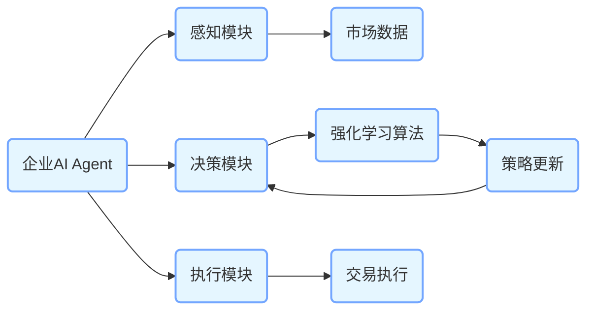

# 企业AI Agent的强化学习在自动化交易策略中的高频应用

> 关键词：企业AI Agent、强化学习、自动化交易策略、高频应用、金融市场

> 摘要：本文深入探讨了企业AI Agent的强化学习在自动化交易策略中的高频应用。首先介绍了相关背景，包括目的、预期读者等内容。接着阐述了核心概念与联系，详细说明了强化学习和企业AI Agent的原理及架构。通过Python代码讲解了核心算法原理和具体操作步骤，并给出了相应的数学模型和公式。结合实际项目案例，从开发环境搭建到源代码实现与解读进行了全面分析。探讨了其在金融市场中的实际应用场景，推荐了学习资源、开发工具框架和相关论文著作。最后总结了未来发展趋势与挑战，解答了常见问题并提供了扩展阅读与参考资料，旨在为企业在自动化交易领域运用强化学习提供全面的技术指导和深入的思考。

## 1. 背景介绍 
### 1.1 目的和范围
在当今高度复杂和快速变化的金融市场中，自动化交易策略的应用越来越广泛。企业AI Agent结合强化学习技术，能够在高频交易场景下，根据市场动态实时调整交易决策，以获取最大利润。本文的目的是深入研究企业AI Agent的强化学习在自动化交易策略中的高频应用，涵盖从理论原理到实际项目开发的各个方面，包括核心概念、算法原理、数学模型、实际案例以及未来发展趋势等。

### 1.2 预期读者
本文预期读者包括金融科技领域的专业人士，如量化交易员、金融分析师等，他们希望通过引入企业AI Agent和强化学习技术来优化现有的自动化交易策略。同时，也适合计算机科学领域的研究者和开发者，特别是对人工智能在金融领域应用感兴趣的人员，以及相关专业的学生，他们可以通过本文了解如何将强化学习应用于实际的金融交易场景。

### 1.3 文档结构概述
本文将按照以下结构进行阐述：首先介绍相关背景信息，让读者了解研究的目的和范围；接着讲解核心概念与联系，包括强化学习和企业AI Agent的原理和架构；然后详细说明核心算法原理和具体操作步骤，并给出相应的数学模型和公式；通过实际项目案例，展示如何在开发环境中实现自动化交易策略；探讨其在金融市场中的实际应用场景；推荐相关的学习资源、开发工具框架和论文著作；最后总结未来发展趋势与挑战，解答常见问题并提供扩展阅读与参考资料。

### 1.4 术语表
#### 1.4.1 核心术语定义
- **企业AI Agent**：是指企业为实现特定目标而设计的具有智能决策能力的软件实体，它能够感知环境信息，根据预设的目标和规则进行决策，并采取相应的行动。
- **强化学习**：是一种机器学习方法，通过智能体（Agent）与环境进行交互，根据环境反馈的奖励信号来学习最优的行为策略，以最大化长期累积奖励。
- **自动化交易策略**：是指利用计算机程序自动执行交易决策的策略，根据预设的规则和算法，在金融市场中进行买卖操作。
- **高频交易**：是指在极短的时间内进行大量交易的交易方式，通常利用计算机算法和高速网络，捕捉市场中的微小价格波动来获取利润。

#### 1.4.2 相关概念解释
- **状态（State）**：在强化学习中，状态是指智能体所处环境的一种描述，它包含了智能体进行决策所需的所有信息。在自动化交易中，状态可以包括市场价格、交易量、技术指标等。
- **动作（Action）**：智能体在某个状态下可以采取的行为。在自动化交易中，动作可以是买入、卖出或持有等。
- **奖励（Reward）**：环境根据智能体采取的动作给予的反馈信号，用于指导智能体学习最优策略。在自动化交易中，奖励可以是交易的利润或损失。

#### 1.4.3 缩略词列表
- **Q-learning**：一种无模型的强化学习算法，用于学习最优动作价值函数。
- **DQN**：深度Q网络（Deep Q-Network），结合了深度学习和Q-learning的算法，用于处理高维状态空间。
- **A2C**：优势行动者 - 评论家算法（Advantage Actor-Critic），是一种基于策略梯度的强化学习算法。

## 2. 核心概念与联系 
### 核心概念原理
#### 强化学习原理
强化学习的基本原理是智能体在环境中不断地进行交互，根据当前状态选择一个动作，环境会根据这个动作返回一个新的状态和一个奖励信号。智能体的目标是通过学习最优的策略，使得长期累积奖励最大化。

强化学习可以分为基于价值的方法和基于策略的方法。基于价值的方法通过学习动作价值函数（如Q函数）来确定最优策略，而基于策略的方法则直接学习策略函数，输出动作的概率分布。

#### 企业AI Agent原理
企业AI Agent是一种专门为企业设计的智能体，它结合了企业的业务目标和规则。在自动化交易中，企业AI Agent可以根据市场数据和企业的风险偏好，自动生成交易决策。企业AI Agent通常包括感知模块、决策模块和执行模块。感知模块负责收集市场信息，决策模块根据感知到的信息和预设的策略进行决策，执行模块则执行决策结果。

### 架构示意图


这个架构图展示了企业AI Agent的主要组成部分及其之间的关系。感知模块从市场获取数据，决策模块利用强化学习算法进行决策，执行模块执行交易操作。强化学习算法根据环境反馈的奖励信号进行策略更新，不断优化决策过程。

## 3. 核心算法原理 & 具体操作步骤 
### 核心算法原理
#### Q-learning算法原理
Q-learning是一种经典的无模型强化学习算法，用于学习最优动作价值函数 $Q(s,a)$，其中 $s$ 表示状态，$a$ 表示动作。Q-learning的目标是通过不断更新 $Q$ 值，使得 $Q(s,a)$ 收敛到最优动作价值函数 $Q^*(s,a)$。

Q-learning的更新公式如下：
$$Q(s_t,a_t) \leftarrow Q(s_t,a_t) + \alpha [r_{t+1} + \gamma \max_{a} Q(s_{t+1},a) - Q(s_t,a_t)]$$
其中，$\alpha$ 是学习率，控制每次更新的步长；$\gamma$ 是折扣因子，用于权衡当前奖励和未来奖励的重要性；$r_{t+1}$ 是在状态 $s_t$ 采取动作 $a_t$ 后获得的即时奖励；$s_{t+1}$ 是下一个状态。

#### Python代码实现
```python
import numpy as np

# 定义Q-learning类
class QLearning:
    def __init__(self, state_size, action_size, learning_rate=0.1, discount_factor=0.9):
        self.state_size = state_size
        self.action_size = action_size
        self.learning_rate = learning_rate
        self.discount_factor = discount_factor
        # 初始化Q表
        self.q_table = np.zeros((state_size, action_size))

    def update_q_table(self, state, action, reward, next_state):
        # 根据Q-learning更新公式更新Q表
        max_q_next = np.max(self.q_table[next_state, :])
        self.q_table[state, action] += self.learning_rate * (reward + self.discount_factor * max_q_next - self.q_table[state, action])

    def get_action(self, state, epsilon):
        # epsilon-greedy策略选择动作
        if np.random.uniform(0, 1) < epsilon:
            # 随机选择动作
            action = np.random.choice(self.action_size)
        else:
            # 选择Q值最大的动作
            action = np.argmax(self.q_table[state, :])
        return action
```

### 具体操作步骤
1. **初始化**：初始化Q表 $Q(s,a)$ 为全零矩阵，设置学习率 $\alpha$、折扣因子 $\gamma$ 和探索率 $\epsilon$。
2. **环境交互**：智能体在环境中进行交互，根据当前状态 $s_t$ 选择一个动作 $a_t$，环境返回下一个状态 $s_{t+1}$ 和即时奖励 $r_{t+1}$。
3. **Q表更新**：根据Q-learning更新公式更新Q表 $Q(s_t,a_t)$。
4. **策略调整**：逐渐降低探索率 $\epsilon$，使得智能体更多地选择最优动作。
5. **终止条件**：当达到预设的训练步数或满足其他终止条件时，训练结束。

## 4. 数学模型和公式 & 详细讲解 & 举例说明 
### 数学模型和公式
#### 马尔可夫决策过程（MDP）
强化学习通常可以用马尔可夫决策过程来描述，它由一个四元组 $(S,A,P,R)$ 组成，其中：
- $S$ 是有限状态集合。
- $A$ 是有限动作集合。
- $P(s_{t+1}|s_t,a_t)$ 是状态转移概率，表示在状态 $s_t$ 采取动作 $a_t$ 后转移到状态 $s_{t+1}$ 的概率。
- $R(s_t,a_t)$ 是奖励函数，表示在状态 $s_t$ 采取动作 $a_t$ 后获得的即时奖励。

#### 最优动作价值函数
最优动作价值函数 $Q^*(s,a)$ 定义为：
$$Q^*(s,a) = \max_{\pi} \mathbb{E} \left[ \sum_{t=0}^{\infty} \gamma^t r_{t+1} | s_0 = s, a_0 = a, \pi \right]$$
其中，$\pi$ 是策略，$\gamma$ 是折扣因子。

#### 贝尔曼最优方程
最优动作价值函数满足贝尔曼最优方程：
$$Q^*(s,a) = \mathbb{E} \left[ r_{t+1} + \gamma \max_{a'} Q^*(s_{t+1},a') | s_t = s, a_t = a \right]$$

### 详细讲解
马尔可夫决策过程为强化学习提供了一个理论框架，它假设智能体的决策只依赖于当前状态，而与历史状态无关。最优动作价值函数 $Q^*(s,a)$ 表示在状态 $s$ 采取动作 $a$ 后，遵循最优策略所能获得的最大长期累积奖励。贝尔曼最优方程则描述了最优动作价值函数的递归性质，通过不断迭代求解贝尔曼最优方程，可以得到最优动作价值函数。

### 举例说明
假设一个简单的交易环境，状态 $s$ 表示股票的价格状态（高、中、低），动作 $a$ 表示买入、卖出或持有。奖励 $r$ 表示交易的利润或损失。初始状态 $s_0$ 为中等价格，智能体选择买入动作 $a_0$。如果下一个状态 $s_1$ 变为高价格，智能体获得正奖励 $r_1$。根据Q-learning算法，智能体将更新 $Q(s_0,a_0)$ 的值，以反映这次交易的收益。

## 5. 项目实战：代码实际案例和详细解释说明 
### 5.1  开发环境搭建
#### 安装Python
首先需要安装Python，建议使用Python 3.7及以上版本。可以从Python官方网站（https://www.python.org/downloads/）下载安装包进行安装。

#### 安装必要的库
在自动化交易项目中，需要安装一些必要的库，如NumPy、Pandas、Matplotlib等。可以使用以下命令进行安装：
```bash
pip install numpy pandas matplotlib
```

#### 数据获取
可以使用第三方金融数据接口，如Tushare、Yahoo Finance等获取股票市场数据。以Tushare为例，需要先在Tushare官网（https://tushare.pro/）注册并获取token，然后安装Tushare库：
```bash
pip install tushare
```

### 5.2  源代码详细实现和代码解读
```python
import tushare as ts
import numpy as np
import pandas as pd
import matplotlib.pyplot as plt

# 设置Tushare token
ts.set_token('your_token')
pro = ts.pro_api()

# 获取股票数据
def get_stock_data(ts_code, start_date, end_date):
    df = pro.daily(ts_code=ts_code, start_date=start_date, end_date=end_date)
    df = df.sort_values('trade_date')
    df['trade_date'] = pd.to_datetime(df['trade_date'])
    df.set_index('trade_date', inplace=True)
    return df

# 定义状态转换函数
def get_state(price, prev_price):
    if price > prev_price:
        return 1  # 上涨状态
    elif price < prev_price:
        return -1  # 下跌状态
    else:
        return 0  # 持平状态

# 定义奖励函数
def get_reward(action, price, prev_price):
    if action == 1:  # 买入
        if price > prev_price:
            return 1  # 盈利
        else:
            return -1  # 亏损
    elif action == -1:  # 卖出
        if price < prev_price:
            return 1  # 盈利
        else:
            return -1  # 亏损
    else:  # 持有
        return 0

# 定义Q-learning类
class QLearning:
    def __init__(self, state_size, action_size, learning_rate=0.1, discount_factor=0.9):
        self.state_size = state_size
        self.action_size = action_size
        self.learning_rate = learning_rate
        self.discount_factor = discount_factor
        self.q_table = np.zeros((state_size, action_size))

    def update_q_table(self, state, action, reward, next_state):
        max_q_next = np.max(self.q_table[next_state, :])
        self.q_table[state, action] += self.learning_rate * (reward + self.discount_factor * max_q_next - self.q_table[state, action])

    def get_action(self, state, epsilon):
        if np.random.uniform(0, 1) < epsilon:
            action = np.random.choice(self.action_size)
        else:
            action = np.argmax(self.q_table[state, :])
        return action

# 主函数
def main():
    ts_code = '000001.SZ'
    start_date = '20200101'
    end_date = '20211231'
    df = get_stock_data(ts_code, start_date, end_date)
    prices = df['close'].values

    state_size = 3  # 上涨、下跌、持平
    action_size = 3  # 买入、卖出、持有
    q_learning = QLearning(state_size, action_size)

    epsilon = 0.1
    num_episodes = 100
    total_rewards = []

    for episode in range(num_episodes):
        total_reward = 0
        prev_price = prices[0]
        for i in range(1, len(prices)):
            price = prices[i]
            state = get_state(price, prev_price) + 1  # 转换为非负索引
            action = q_learning.get_action(state, epsilon)
            if action == 0:
                action = -1  # 卖出
            elif action == 1:
                action = 0  # 持有
            else:
                action = 1  # 买入
            reward = get_reward(action, price, prev_price)
            next_state = get_state(prices[i+1] if i+1 < len(prices) else price, price) + 1
            q_learning.update_q_table(state, action+1, reward, next_state)
            total_reward += reward
            prev_price = price

        total_rewards.append(total_reward)
        print(f'Episode {episode+1}: Total Reward = {total_reward}')

    # 绘制总奖励曲线
    plt.plot(total_rewards)
    plt.xlabel('Episode')
    plt.ylabel('Total Reward')
    plt.title('Total Reward per Episode')
    plt.show()

if __name__ == '__main__':
    main()
```

### 5.3  代码解读与分析
#### 数据获取部分
`get_stock_data` 函数使用Tushare接口获取指定股票在指定日期范围内的日线数据，并对数据进行排序和索引设置。

#### 状态转换和奖励函数
`get_state` 函数根据当前价格和前一价格的比较结果，将状态分为上涨、下跌或持平三种状态。`get_reward` 函数根据动作和价格变化计算奖励值。

#### Q-learning类
`QLearning` 类实现了Q-learning算法的核心功能，包括Q表的初始化、Q表的更新和动作的选择。

#### 主函数
`main` 函数是程序的入口，它首先获取股票数据，然后初始化Q-learning对象。在每个训练回合中，智能体根据当前状态选择动作，与环境进行交互，获取奖励并更新Q表。最后绘制总奖励曲线，观察智能体的学习效果。

## 6. 实际应用场景 
### 高频交易
在高频交易中，企业AI Agent的强化学习可以实时分析市场数据，根据市场的微小价格波动快速做出交易决策。例如，当市场出现短期的价格偏离时，AI Agent可以迅速买入或卖出股票，以获取利润。

### 风险控制
强化学习可以帮助企业AI Agent根据市场风险动态调整交易策略。例如，当市场波动加剧时，AI Agent可以减少交易仓位或增加对冲操作，以降低风险。

### 资产配置
企业AI Agent可以利用强化学习优化资产配置方案。通过学习不同资产之间的相关性和市场表现，AI Agent可以自动调整资产组合，以实现最优的风险 - 收益平衡。

## 7. 工具和资源推荐
### 7.1 学习资源推荐
#### 7.1.1 书籍推荐
- 《强化学习：原理与Python实现》：本书系统地介绍了强化学习的基本原理和常用算法，并通过Python代码进行了详细的实现和讲解。
- 《深度学习》：虽然主要介绍深度学习，但其中也包含了强化学习的相关内容，对于理解强化学习的深度学习基础非常有帮助。
- 《Python金融大数据分析》：介绍了如何使用Python进行金融数据处理和分析，对于开发自动化交易策略有很大的帮助。

#### 7.1.2 在线课程
- Coursera上的“强化学习专项课程”：由知名学者授课，涵盖了强化学习的各个方面，包括理论基础、算法实现和实际应用。
- edX上的“深度学习与强化学习”：结合深度学习和强化学习的知识，通过实际项目案例进行教学。
- 哔哩哔哩上的一些开源强化学习教程：适合初学者快速入门。

#### 7.1.3 技术博客和网站
- OpenAI博客：提供了最新的强化学习研究成果和应用案例。
- Medium上的“强化学习”主题：有很多专业人士分享的强化学习经验和技巧。
- 知乎上的强化学习相关话题：可以与其他爱好者交流和学习。

### 7.2 开发工具框架推荐
#### 7.2.1 IDE和编辑器
- PyCharm：功能强大的Python集成开发环境，支持代码调试、版本控制等功能。
- Jupyter Notebook：交互式的开发环境，适合进行数据探索和模型实验。
- Visual Studio Code：轻量级的代码编辑器，支持多种编程语言和插件扩展。

#### 7.2.2 调试和性能分析工具
- PDB：Python自带的调试工具，可以帮助开发者定位代码中的问题。
- cProfile：Python的性能分析工具，可以分析代码的运行时间和内存使用情况。
- TensorBoard：用于可视化深度学习模型的训练过程和性能指标。

#### 7.2.3 相关框架和库
- Gym：OpenAI开发的强化学习环境库，提供了多种标准的强化学习环境，方便开发者进行算法测试和比较。
- Stable Baselines：基于TensorFlow和PyTorch的强化学习库，提供了多种预训练的强化学习算法，易于使用和扩展。
- TA-Lib：技术分析库，提供了各种金融技术指标的计算方法，可用于自动化交易策略的开发。

### 7.3 相关论文著作推荐
#### 7.3.1 经典论文
- “Q-learning”：由Watkins和Dayan发表的经典论文，介绍了Q-learning算法的基本原理和实现方法。
- “Playing Atari with Deep Reinforcement Learning”：首次将深度学习和强化学习相结合，提出了深度Q网络（DQN）算法，在Atari游戏中取得了很好的效果。
- “Asynchronous Methods for Deep Reinforcement Learning”：提出了异步优势行动者 - 评论家（A3C）算法，提高了强化学习的训练效率。

#### 7.3.2 最新研究成果
- 关注NeurIPS、ICML、AAAI等顶级人工智能会议的论文，了解强化学习在金融领域的最新研究进展。
- arXiv上的相关预印本论文，及时获取最新的研究成果。

#### 7.3.3 应用案例分析
- 一些金融科技公司的研究报告和博客文章，分享了企业AI Agent的强化学习在自动化交易中的实际应用案例和经验教训。

## 8. 总结：未来发展趋势与挑战
### 未来发展趋势
#### 多智能体强化学习
未来，企业AI Agent可能会采用多智能体强化学习的方法，多个智能体之间进行协作和竞争，以更好地适应复杂的金融市场环境。例如，不同的智能体可以负责不同的交易品种或交易策略，通过协作实现整体收益的最大化。

#### 结合深度学习和强化学习
深度学习可以处理高维的市场数据，如文本数据、图像数据等。将深度学习和强化学习相结合，可以提高企业AI Agent对市场信息的理解和分析能力，从而制定更有效的交易策略。

#### 可解释性强化学习
随着金融监管的加强，企业需要对其交易策略进行解释和说明。可解释性强化学习将成为未来的研究热点，通过开发可解释的强化学习模型，企业可以向监管机构和投资者解释交易决策的依据。

### 挑战
#### 数据质量和隐私问题
金融市场数据通常存在噪声和缺失值，数据质量对强化学习模型的性能有很大影响。同时，金融数据涉及用户隐私和商业机密，如何在保证数据安全和隐私的前提下进行数据处理和模型训练是一个挑战。

#### 市场不确定性
金融市场具有高度的不确定性，市场情况可能会突然发生变化。企业AI Agent需要具备快速适应市场变化的能力，否则可能会导致交易损失。

#### 计算资源需求
强化学习模型的训练通常需要大量的计算资源，特别是在处理大规模数据和复杂模型时。如何优化模型结构和训练算法，降低计算资源需求是一个亟待解决的问题。

## 9. 附录：常见问题与解答
### 问题1：强化学习在自动化交易中的优势是什么？
强化学习可以根据市场的实时反馈不断调整交易策略，具有较强的适应性和灵活性。与传统的基于规则的交易策略相比，强化学习能够自动发现市场中的潜在规律，从而获得更高的收益。

### 问题2：如何选择合适的强化学习算法？
选择合适的强化学习算法需要考虑多个因素，如状态空间和动作空间的大小、环境的复杂性、计算资源的限制等。对于简单的交易环境，可以选择Q-learning等基于价值的算法；对于复杂的环境，可以选择基于策略的算法，如A2C、PPO等。

### 问题3：如何评估强化学习模型在自动化交易中的性能？
可以使用多种指标来评估强化学习模型的性能，如累计收益率、夏普比率、最大回撤等。累计收益率反映了模型在一段时间内的总体收益情况，夏普比率衡量了模型在承担单位风险下的收益能力，最大回撤表示模型在交易过程中可能遭受的最大损失。

## 10. 扩展阅读 & 参考资料
### 扩展阅读
- 《金融机器学习入门》：深入介绍了机器学习在金融领域的应用，包括自动化交易、风险评估等方面。
- 《量化交易：如何建立自己的算法交易系统》：详细介绍了量化交易的流程和方法，对于开发自动化交易策略有很大的参考价值。

### 参考资料
- 各金融数据接口的官方文档，如Tushare、Yahoo Finance等。
- 强化学习相关的开源代码库，如OpenAI Gym、Stable Baselines等。
- 学术数据库，如IEEE Xplore、ACM Digital Library等，获取相关的研究论文。

作者：AI天才研究院/AI Genius Institute & 禅与计算机程序设计艺术 /Zen And The Art of Computer Programming