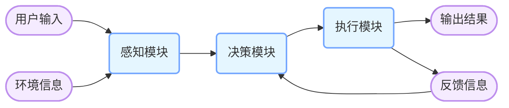

# 企业AI Agent的性能优化策略

> 关键词：企业AI Agent、性能优化、策略、算法、资源管理

> 摘要：本文围绕企业AI Agent的性能优化策略展开深入探讨。首先介绍了相关背景，包括目的、预期读者、文档结构和术语表。接着阐述了企业AI Agent的核心概念与联系，给出了原理和架构的文本示意图及Mermaid流程图。详细讲解了核心算法原理和具体操作步骤，使用Python代码进行阐述。同时分析了数学模型和公式，并举例说明。通过项目实战，展示了开发环境搭建、源代码实现与解读。探讨了企业AI Agent的实际应用场景，推荐了相关的学习资源、开发工具框架和论文著作。最后总结了未来发展趋势与挑战，提供了常见问题解答和扩展阅读参考资料，旨在为企业优化AI Agent性能提供全面的指导。

## 1. 背景介绍 
### 1.1 目的和范围
在当今数字化快速发展的时代，企业AI Agent在各个领域得到了广泛应用，如客户服务、业务流程自动化、数据分析等。然而，随着企业业务的不断拓展和数据量的急剧增加，AI Agent的性能问题逐渐凸显，如响应时间过长、处理效率低下等，这严重影响了企业的运营效率和用户体验。因此，本文的目的是深入研究企业AI Agent的性能优化策略，通过对核心概念、算法原理、数学模型等方面的详细分析，结合实际项目案例，为企业提供全面、有效的性能优化解决方案。本文的范围涵盖了企业AI Agent性能优化的各个方面，包括但不限于算法优化、资源管理、硬件加速等。

### 1.2 预期读者
本文的预期读者主要包括企业的技术管理人员、AI开发工程师、软件架构师等。对于技术管理人员，本文可以帮助他们了解企业AI Agent性能优化的重要性和可行策略，以便在企业的技术决策中做出更明智的选择。对于AI开发工程师，本文提供了详细的算法原理和代码实现，有助于他们在实际开发中优化AI Agent的性能。对于软件架构师，本文的架构分析和优化建议可以为他们设计更高效的企业AI Agent系统提供参考。

### 1.3 文档结构概述
本文将按照以下结构进行组织：首先介绍企业AI Agent性能优化的背景知识，包括目的、预期读者和文档结构。接着阐述企业AI Agent的核心概念与联系，通过文本示意图和Mermaid流程图展示其原理和架构。然后详细讲解核心算法原理和具体操作步骤，使用Python代码进行说明。随后分析数学模型和公式，并举例说明其在性能优化中的应用。通过项目实战，展示开发环境搭建、源代码实现和代码解读。探讨企业AI Agent的实际应用场景。推荐相关的学习资源、开发工具框架和论文著作。最后总结未来发展趋势与挑战，提供常见问题解答和扩展阅读参考资料。

### 1.4 术语表
#### 1.4.1 核心术语定义
- **企业AI Agent**：指在企业环境中运行的人工智能代理程序，它可以自动执行各种任务，如对话交互、数据处理、决策支持等。
- **性能优化**：通过对系统的算法、资源管理、硬件等方面进行改进，提高系统的响应速度、处理效率和吞吐量等性能指标。
- **算法复杂度**：衡量算法执行所需的时间和空间资源的指标，通常用大O符号表示。
- **资源管理**：对系统的计算资源（如CPU、内存、GPU等）和数据资源进行合理分配和调度，以提高资源利用率。

#### 1.4.2 相关概念解释
- **深度学习**：一种基于人工神经网络的机器学习方法，通过多层神经网络自动学习数据的特征和模式，在图像识别、自然语言处理等领域取得了显著的成果。
- **强化学习**：一种通过智能体与环境进行交互，根据环境反馈的奖励信号来学习最优策略的机器学习方法，常用于机器人控制、游戏等领域。
- **云计算**：一种基于互联网的计算模式，通过将计算资源和数据存储在云端，用户可以根据需要随时获取和使用这些资源，具有高可扩展性和灵活性。

#### 1.4.3 缩略词列表
- **CPU**：中央处理器（Central Processing Unit）
- **GPU**：图形处理器（Graphics Processing Unit）
- **RAM**：随机存取存储器（Random Access Memory）
- **API**：应用程序编程接口（Application Programming Interface）

## 2. 核心概念与联系 
企业AI Agent是一个复杂的系统，它涉及到多个核心概念和技术。其基本原理是通过感知环境、理解任务、推理决策和执行动作来完成各种任务。以下是企业AI Agent的核心概念原理和架构的文本示意图：

企业AI Agent主要由感知模块、决策模块和执行模块组成。感知模块负责收集环境信息，如用户输入、传感器数据等。决策模块根据感知到的信息进行分析和推理，制定出最优的行动策略。执行模块则根据决策模块的指令执行相应的动作，如回复用户、控制设备等。

下面是使用Mermaid绘制的企业AI Agent架构流程图：


在这个流程图中，用户输入和环境信息首先进入感知模块，感知模块将处理后的信息传递给决策模块。决策模块根据这些信息进行决策，并将决策结果发送给执行模块。执行模块执行相应的动作并输出结果，同时将反馈信息返回给决策模块，以便进行后续的优化和调整。

## 3. 核心算法原理 & 具体操作步骤 
### 3.1 核心算法原理
企业AI Agent的性能优化涉及到多种算法，这里以深度学习中的神经网络算法为例进行详细讲解。神经网络是一种模仿人类神经系统的计算模型，由多个神经元组成，每个神经元接收输入信号并进行加权求和，然后通过激活函数进行非线性变换，输出结果。

以下是一个简单的Python代码示例，展示了一个两层神经网络的实现：
```python
import numpy as np

# 定义激活函数（这里使用Sigmoid函数）
def sigmoid(x):
    return 1 / (1 + np.exp(-x))

# 定义神经网络类
class NeuralNetwork:
    def __init__(self, input_size, hidden_size, output_size):
        # 初始化权重
        self.weights_input_hidden = np.random.rand(input_size, hidden_size)
        self.weights_hidden_output = np.random.rand(hidden_size, output_size)

    def forward(self, X):
        # 前向传播
        self.hidden_input = np.dot(X, self.weights_input_hidden)
        self.hidden_output = sigmoid(self.hidden_input)
        self.final_input = np.dot(self.hidden_output, self.weights_hidden_output)
        self.final_output = sigmoid(self.final_input)
        return self.final_output

# 示例使用
input_size = 3
hidden_size = 4
output_size = 1
X = np.array([[0.1, 0.2, 0.3]])

nn = NeuralNetwork(input_size, hidden_size, output_size)
output = nn.forward(X)
print("神经网络输出:", output)
```
### 3.2 具体操作步骤
1. **数据预处理**：对输入数据进行清洗、归一化等处理，以提高数据的质量和可用性。
2. **模型选择和设计**：根据任务的需求选择合适的神经网络架构，如全连接网络、卷积神经网络、循环神经网络等，并确定网络的层数、神经元数量等参数。
3. **模型训练**：使用训练数据对神经网络进行训练，通过调整权重和偏置来最小化损失函数。
4. **模型评估**：使用测试数据对训练好的模型进行评估，计算准确率、召回率等性能指标。
5. **模型优化**：根据评估结果对模型进行优化，如调整超参数、增加训练数据等。
6. **部署和应用**：将优化后的模型部署到实际的企业AI Agent系统中，并进行实时的任务处理。

## 4. 数学模型和公式 & 详细讲解 & 举例说明 
### 4.1 神经网络的数学模型
在神经网络中，每个神经元的输出可以用以下公式表示：
$$
z_j = \sum_{i=1}^{n} w_{ij}x_i + b_j
$$
其中，$z_j$ 是神经元 $j$ 的输入，$w_{ij}$ 是输入 $x_i$ 到神经元 $j$ 的权重，$b_j$ 是神经元 $j$ 的偏置。

经过激活函数 $\sigma$ 处理后，神经元的输出为：
$$
a_j = \sigma(z_j)
$$

### 4.2 损失函数
损失函数用于衡量模型的预测结果与真实标签之间的差异，常见的损失函数有均方误差（MSE）和交叉熵损失（Cross-Entropy Loss）。

均方误差的公式为：
$$
MSE = \frac{1}{n} \sum_{i=1}^{n} (y_i - \hat{y}_i)^2
$$
其中，$y_i$ 是真实标签，$\hat{y}_i$ 是模型的预测结果，$n$ 是样本数量。

交叉熵损失的公式为：
$$
CE = - \frac{1}{n} \sum_{i=1}^{n} [y_i \log(\hat{y}_i) + (1 - y_i) \log(1 - \hat{y}_i)]
$$

### 4.3 梯度下降法
梯度下降法是一种常用的优化算法，用于更新神经网络的权重和偏置，以最小化损失函数。其更新公式为：
$$
w_{ij} = w_{ij} - \alpha \frac{\partial L}{\partial w_{ij}}
$$
$$
b_j = b_j - \alpha \frac{\partial L}{\partial b_j}
$$
其中，$\alpha$ 是学习率，$L$ 是损失函数。

### 4.4 举例说明
假设我们有一个简单的线性回归问题，输入 $x = [1, 2, 3]$，真实标签 $y = [2, 4, 6]$。我们使用一个简单的线性模型 $y = wx + b$ 进行预测。

损失函数选择均方误差：
$$
L = \frac{1}{3}[(w \times 1 + b - 2)^2 + (w \times 2 + b - 4)^2 + (w \times 3 + b - 6)^2]
$$

对 $w$ 和 $b$ 求偏导数：
$$
\frac{\partial L}{\partial w} = \frac{2}{3}[(w \times 1 + b - 2) \times 1 + (w \times 2 + b - 4) \times 2 + (w \times 3 + b - 6) \times 3]
$$
$$
\frac{\partial L}{\partial b} = \frac{2}{3}[(w \times 1 + b - 2) + (w \times 2 + b - 4) + (w \times 3 + b - 6)]
$$

假设初始 $w = 0$，$b = 0$，学习率 $\alpha = 0.1$。

第一次迭代：
计算 $\frac{\partial L}{\partial w}$ 和 $\frac{\partial L}{\partial b}$ 的值，然后更新 $w$ 和 $b$：
$$
w = 0 - 0.1 \times \frac{\partial L}{\partial w}
$$
$$
b = 0 - 0.1 \times \frac{\partial L}{\partial b}
$$

重复上述步骤，直到损失函数收敛。

## 5. 项目实战：代码实际案例和详细解释说明 
### 5.1  开发环境搭建
#### 5.1.1 安装Python
首先，需要安装Python编程语言。可以从Python官方网站（https://www.python.org/downloads/）下载适合自己操作系统的Python版本，并按照安装向导进行安装。

#### 5.1.2 安装深度学习框架
这里我们选择使用TensorFlow作为深度学习框架。可以使用以下命令安装TensorFlow：
```sh
pip install tensorflow
```

#### 5.1.3 安装其他依赖库
还需要安装一些其他的依赖库，如NumPy、Pandas等，可以使用以下命令进行安装：
```sh
pip install numpy pandas
```

### 5.2  源代码详细实现和代码解读
以下是一个使用TensorFlow实现的简单的手写数字识别模型的代码示例：
```python
import tensorflow as tf
from tensorflow.keras.datasets import mnist
from tensorflow.keras.models import Sequential
from tensorflow.keras.layers import Flatten, Dense

# 加载MNIST数据集
(x_train, y_train), (x_test, y_test) = mnist.load_data()

# 数据预处理
x_train, x_test = x_train / 255.0, x_test / 255.0

# 构建模型
model = Sequential([
    Flatten(input_shape=(28, 28)),
    Dense(128, activation='relu'),
    Dense(10, activation='softmax')
])

# 编译模型
model.compile(optimizer='adam',
              loss='sparse_categorical_crossentropy',
              metrics=['accuracy'])

# 训练模型
model.fit(x_train, y_train, epochs=5)

# 评估模型
test_loss, test_acc = model.evaluate(x_test, y_test)
print(f"Test accuracy: {test_acc}")
```
### 5.3  代码解读与分析
1. **数据加载**：使用 `mnist.load_data()` 函数加载MNIST手写数字数据集，该数据集包含60000个训练样本和10000个测试样本。
2. **数据预处理**：将像素值归一化到0到1之间，以提高模型的训练效果。
3. **模型构建**：使用 `Sequential` 模型构建一个简单的神经网络，包含一个 `Flatten` 层将二维图像数据转换为一维向量，一个 `Dense` 层作为隐藏层，使用ReLU激活函数，最后一个 `Dense` 层作为输出层，使用Softmax激活函数。
4. **模型编译**：使用 `adam` 优化器和 `sparse_categorical_crossentropy` 损失函数进行模型编译，并指定评估指标为准确率。
5. **模型训练**：使用 `fit` 方法对模型进行训练，训练5个epoch。
6. **模型评估**：使用 `evaluate` 方法对训练好的模型进行评估，计算测试集上的损失和准确率。

## 6. 实际应用场景 
企业AI Agent在多个实际应用场景中都有广泛的应用，以下是一些常见的应用场景：
### 6.1 客户服务
企业可以使用AI Agent作为智能客服，自动回答客户的常见问题，提供实时的帮助和支持。AI Agent可以通过自然语言处理技术理解客户的问题，并根据预设的规则或机器学习模型给出准确的回答。这样可以提高客户服务的效率和质量，减少人工客服的工作量。

### 6.2 业务流程自动化
AI Agent可以自动化执行一些重复性的业务流程，如数据录入、报表生成、订单处理等。通过对业务规则的学习和理解，AI Agent可以准确地完成这些任务，提高业务处理的速度和准确性，降低企业的运营成本。

### 6.3 数据分析和决策支持
AI Agent可以对企业的大量数据进行分析和挖掘，发现数据中的潜在规律和价值。通过机器学习算法，AI Agent可以预测市场趋势、客户需求等，为企业的决策提供有力的支持。

### 6.4 智能营销
AI Agent可以根据客户的行为和偏好，进行个性化的营销推荐。通过对客户数据的分析，AI Agent可以精准地推送适合客户的产品和服务，提高营销效果和客户转化率。

## 7. 工具和资源推荐
### 7.1 学习资源推荐
#### 7.1.1 书籍推荐
- 《深度学习》（Deep Learning）：由Ian Goodfellow、Yoshua Bengio和Aaron Courville合著，是深度学习领域的经典教材，全面介绍了深度学习的基本原理、算法和应用。
- 《Python机器学习》（Python Machine Learning）：由Sebastian Raschka和Vahid Mirjalili合著，详细介绍了使用Python进行机器学习的方法和技术，包括数据预处理、模型选择、评估等。
- 《人工智能：一种现代的方法》（Artificial Intelligence: A Modern Approach）：由Stuart Russell和Peter Norvig合著，是人工智能领域的权威教材，涵盖了人工智能的各个方面，包括搜索算法、知识表示、机器学习等。

#### 7.1.2 在线课程
- Coursera上的“深度学习专项课程”（Deep Learning Specialization）：由Andrew Ng教授主讲，系统地介绍了深度学习的各个方面，包括神经网络、卷积神经网络、循环神经网络等。
- edX上的“人工智能导论”（Introduction to Artificial Intelligence）：由麻省理工学院（MIT）的Patrick Winston教授主讲，介绍了人工智能的基本概念、算法和应用。
- Udemy上的“Python数据科学和机器学习训练营”（Python for Data Science and Machine Learning Bootcamp）：通过实际项目案例，介绍了使用Python进行数据科学和机器学习的方法和技术。

#### 7.1.3 技术博客和网站
- Medium上的Towards Data Science：是一个专注于数据科学和机器学习的技术博客，提供了大量的优质文章和教程。
- Kaggle：是一个数据科学竞赛平台，不仅可以参加各种数据科学竞赛，还可以学习其他参赛者的优秀代码和经验。
- arXiv：是一个预印本平台，提供了大量的学术论文，涵盖了人工智能、机器学习等领域的最新研究成果。

### 7.2 开发工具框架推荐
#### 7.2.1 IDE和编辑器
- PyCharm：是一款专门为Python开发设计的集成开发环境（IDE），提供了丰富的功能，如代码自动完成、调试、版本控制等。
- Jupyter Notebook：是一个交互式的开发环境，适合进行数据探索、模型训练和可视化等工作。
- Visual Studio Code：是一款轻量级的代码编辑器，支持多种编程语言，通过安装插件可以扩展其功能。

#### 7.2.2 调试和性能分析工具
- TensorBoard：是TensorFlow提供的一个可视化工具，可以用于监控模型的训练过程、查看模型的结构和性能指标等。
- Py-Spy：是一个Python性能分析工具，可以用于分析Python代码的性能瓶颈，找出耗时较长的代码段。
- cProfile：是Python标准库中的一个性能分析模块，可以用于分析Python程序的运行时间和函数调用次数。

#### 7.2.3 相关框架和库
- TensorFlow：是一个开源的深度学习框架，提供了丰富的工具和接口，支持多种深度学习模型的开发和训练。
- PyTorch：是另一个流行的深度学习框架，具有动态图的特点，适合进行快速的模型开发和实验。
- Scikit-learn：是一个用于机器学习的Python库，提供了各种机器学习算法和工具，如分类、回归、聚类等。

### 7.3 相关论文著作推荐
#### 7.3.1 经典论文
- “ImageNet Classification with Deep Convolutional Neural Networks”：由Alex Krizhevsky、Ilya Sutskever和Geoffrey E. Hinton发表，介绍了AlexNet卷积神经网络，开启了深度学习在计算机视觉领域的新纪元。
- “Long Short-Term Memory”：由Sepp Hochreiter和Jürgen Schmidhuber发表，提出了长短期记忆网络（LSTM），解决了循环神经网络中的梯度消失问题。
- “Attention Is All You Need”：由Ashish Vaswani等人发表，提出了Transformer模型，在自然语言处理领域取得了巨大的成功。

#### 7.3.2 最新研究成果
- 关注顶级学术会议如NeurIPS（神经信息处理系统大会）、ICML（国际机器学习会议）、CVPR（计算机视觉与模式识别会议）等上的最新研究论文，了解企业AI Agent性能优化的最新技术和方法。

#### 7.3.3 应用案例分析
- 可以参考一些知名企业的AI应用案例，如谷歌、微软、亚马逊等，了解他们在企业AI Agent开发和性能优化方面的实践经验和解决方案。

## 8. 总结：未来发展趋势与挑战
### 8.1 未来发展趋势
- **多模态融合**：未来的企业AI Agent将不仅局限于处理单一模态的数据，如文本、图像等，而是会融合多种模态的数据，如语音、视频等，以提供更全面、准确的服务。
- **强化学习和自主决策**：强化学习技术将在企业AI Agent中得到更广泛的应用，使AI Agent能够在复杂的环境中自主学习和决策，提高其适应性和智能水平。
- **边缘计算和端侧智能**：随着边缘计算技术的发展，企业AI Agent将更多地部署在边缘设备上，实现端侧智能，减少数据传输延迟，提高系统的响应速度和安全性。
- **可解释性和可信AI**：用户对AI Agent的可解释性和可信度要求越来越高，未来的企业AI Agent将更加注重模型的可解释性和透明度，以增强用户的信任。

### 8.2 挑战
- **数据隐私和安全**：企业AI Agent需要处理大量的敏感数据，如客户信息、业务数据等，如何保障数据的隐私和安全是一个重要的挑战。
- **算法复杂度和计算资源需求**：随着AI Agent的功能不断增强，其算法复杂度和计算资源需求也会不断增加，如何在有限的资源下提高性能是一个亟待解决的问题。
- **人才短缺**：企业AI Agent的开发和优化需要具备跨学科知识的专业人才，如人工智能、机器学习、计算机科学等，目前这类人才相对短缺，制约了企业AI Agent的发展。
- **伦理和法律问题**：AI Agent的应用可能会引发一些伦理和法律问题，如算法偏见、责任归属等，需要建立相应的伦理和法律框架来规范其发展。

## 9. 附录：常见问题与解答
### 9.1 如何选择合适的AI Agent算法？
选择合适的AI Agent算法需要考虑多个因素，如任务的类型（分类、回归、聚类等）、数据的特点（规模、维度、分布等）、计算资源的限制等。一般来说，可以先尝试一些经典的算法，如决策树、支持向量机等，然后根据实验结果选择性能最优的算法。同时，也可以参考相关的研究论文和实践经验，了解不同算法在不同场景下的应用效果。

### 9.2 如何优化AI Agent的内存使用？
可以通过以下几种方法优化AI Agent的内存使用：
- **数据压缩**：对数据进行压缩处理，减少数据的存储空间。
- **模型量化**：将模型的参数进行量化，降低模型的内存占用。
- **内存管理策略**：合理分配和释放内存，避免内存泄漏。
- **使用轻量级模型**：选择一些轻量级的模型架构，减少模型的参数数量。

### 9.3 如何提高AI Agent的实时性？
提高AI Agent的实时性可以从以下几个方面入手：
- **硬件加速**：使用GPU、TPU等硬件加速器，提高模型的计算速度。
- **模型优化**：对模型进行剪枝、量化等优化，减少模型的计算量。
- **并行计算**：采用并行计算技术，同时处理多个任务，提高系统的吞吐量。
- **缓存机制**：使用缓存机制，减少重复计算，提高响应速度。

## 10. 扩展阅读 & 参考资料
### 10.1 扩展阅读
- 《AI 3.0》：作者为梅拉妮·米歇尔，探讨了人工智能的发展现状、挑战和未来趋势。
- 《智能时代》：作者为吴军，介绍了人工智能在各个领域的应用和对社会的影响。

### 10.2 参考资料
- 相关的学术论文和研究报告，如IEEE Transactions on Pattern Analysis and Machine Intelligence、ACM Transactions on Intelligent Systems and Technology等期刊上的文章。
- 企业AI Agent的官方文档和技术博客，如TensorFlow、PyTorch等框架的官方文档。

作者：AI天才研究院/AI Genius Institute & 禅与计算机程序设计艺术 /Zen And The Art of Computer Programming