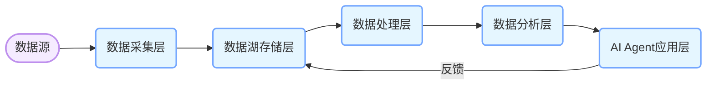

# 企业AI Agent的数据湖架构设计

> 关键词：企业AI Agent、数据湖架构、数据集成、数据分析、数据治理

> 摘要：本文聚焦于企业AI Agent的数据湖架构设计，深入探讨了其核心概念、算法原理、数学模型等内容。通过详细的步骤分析和实际案例，阐述了如何搭建和实现适用于企业AI Agent的数据湖架构。同时，介绍了相关的应用场景、工具资源，并对未来发展趋势与挑战进行了总结，旨在为企业在构建AI Agent数据湖架构时提供全面且深入的技术指导。

## 1. 背景介绍 
### 1.1 目的和范围
随着人工智能技术的飞速发展，企业AI Agent在提升业务效率、优化决策等方面发挥着越来越重要的作用。而数据作为AI Agent的核心驱动力，其有效管理和利用至关重要。数据湖架构能够集成企业内外部的多源异构数据，为AI Agent提供全面、准确的数据支持。本文的目的在于详细阐述企业AI Agent的数据湖架构设计，涵盖从数据的采集、存储、处理到分析应用的全过程，帮助企业构建高效、灵活的数据湖架构，以支持AI Agent的智能决策和业务创新。

### 1.2 预期读者
本文主要面向企业的技术决策者、数据架构师、AI工程师、数据分析师等相关人员。对于希望深入了解企业AI Agent数据湖架构设计的技术爱好者和研究人员也具有一定的参考价值。

### 1.3 文档结构概述
本文将按照以下结构进行阐述：首先介绍核心概念与联系，包括数据湖、企业AI Agent等概念及其相互关系；接着讲解核心算法原理和具体操作步骤，通过Python代码详细说明；然后介绍数学模型和公式，并举例说明；之后通过项目实战展示代码实际案例和详细解释；再介绍实际应用场景；接着推荐相关的工具和资源；最后总结未来发展趋势与挑战，并提供常见问题与解答以及扩展阅读和参考资料。

### 1.4 术语表
#### 1.4.1 核心术语定义
- **企业AI Agent**：指企业中具备人工智能能力的智能体，能够感知环境、自主学习、做出决策并执行相应的任务，以支持企业的业务运营和管理。
- **数据湖**：是一个存储企业各种原始数据的大型存储库，这些数据可以是结构化、半结构化或非结构化的，数据湖允许企业在不进行预先定义模式的情况下存储数据，以便后续进行灵活的分析和处理。
- **数据集成**：将来自不同数据源的数据进行收集、清洗、转换和整合，使其能够在统一的环境中进行处理和分析的过程。
- **数据分析**：对收集到的数据进行探索、挖掘和解释，以发现有价值的信息和模式，为企业决策提供支持。

#### 1.4.2 相关概念解释
- **多源异构数据**：指来自不同数据源（如数据库、文件系统、传感器等）且具有不同格式（如关系型数据、文本数据、图像数据等）的数据。
- **ETL（Extract, Transform, Load）**：即提取、转换和加载，是数据集成过程中的常见操作，用于从数据源中提取数据，对其进行清洗和转换，然后加载到目标存储系统中。
- **数据治理**：是指对企业数据资产进行全面管理的一系列活动，包括数据质量管控、数据安全、数据标准制定等，以确保数据的准确性、完整性和可用性。

#### 1.4.3 缩略词列表
- **AI**：Artificial Intelligence，人工智能
- **ETL**：Extract, Transform, Load
- **OLAP**：Online Analytical Processing，在线分析处理
- **HDFS**：Hadoop Distributed File System，Hadoop分布式文件系统
- **Spark**：Apache Spark，一个快速通用的集群计算系统

## 2. 核心概念与联系 

### 2.1 核心概念原理
#### 2.1.1 数据湖原理
数据湖的核心原理是将企业内外部的各种数据以原始或接近原始的形式存储在一个集中的存储库中。与传统的数据仓库不同，数据湖不需要在数据存储之前进行严格的模式定义，因此可以容纳各种类型的数据。数据湖采用分层架构，通常包括原始数据层、集成数据层和分析数据层。原始数据层直接存储从数据源采集到的原始数据，不进行任何处理；集成数据层对原始数据进行清洗、转换和整合，使其具有一致性和可用性；分析数据层则根据具体的分析需求，对集成数据进行进一步的处理和建模。

#### 2.1.2 企业AI Agent原理
企业AI Agent基于人工智能技术，通过感知环境获取数据，利用机器学习、深度学习等算法对数据进行分析和学习，从而做出决策并执行相应的任务。AI Agent可以分为反应式Agent、基于模型的Agent、基于目标的Agent和基于效用的Agent等不同类型。反应式Agent根据当前的感知信息立即做出反应，不考虑历史信息和未来目标；基于模型的Agent维护一个关于环境的内部模型，根据模型预测未来状态并做出决策；基于目标的Agent具有明确的目标，通过搜索和规划找到实现目标的最佳行动方案；基于效用的Agent在决策时考虑行动的效用，选择能够最大化效用的行动。

### 2.1.3 两者联系
数据湖为企业AI Agent提供了丰富的数据资源，是AI Agent进行学习和决策的基础。AI Agent通过对数据湖中的数据进行分析和挖掘，可以发现有价值的信息和模式，从而为企业提供更智能的决策支持。同时，AI Agent的决策结果也可以反馈到数据湖中，进一步丰富和完善数据湖的数据。例如，AI Agent在分析市场趋势后，可以生成相关的报告并存储在数据湖中，供其他部门参考和使用。

### 2.2 架构的文本示意图
企业AI Agent的数据湖架构主要包括以下几个部分：
- **数据源**：包括企业内部的各种业务系统（如ERP、CRM等）、外部数据源（如社交媒体、第三方数据提供商等）以及传感器网络等。
- **数据采集层**：负责从数据源中采集数据，并将其传输到数据湖中。数据采集可以采用批量采集或实时采集的方式。
- **数据湖存储层**：采用分布式文件系统（如HDFS）或云存储服务（如Amazon S3）存储数据。数据湖存储层可以分为原始数据区、集成数据区和分析数据区。
- **数据处理层**：对数据湖中的数据进行清洗、转换和整合，使其具有一致性和可用性。数据处理可以采用ETL工具（如Talend、Informatica等）或大数据处理框架（如Spark、Flink等）。
- **数据分析层**：利用机器学习、深度学习等算法对数据湖中的数据进行分析和挖掘，发现有价值的信息和模式。数据分析可以采用Python、R等编程语言和相关的机器学习库（如Scikit-learn、TensorFlow等）。
- **AI Agent应用层**：将数据分析的结果应用到企业的具体业务场景中，如智能客服、智能营销、智能决策等。

### 2.3 Mermaid流程图


## 3. 核心算法原理 & 具体操作步骤 

### 3.1 数据采集算法原理
数据采集是将数据源中的数据传输到数据湖中的过程。常见的数据采集算法包括增量采集和全量采集。增量采集只采集数据源中发生变化的数据，适用于数据量较大且数据更新频繁的场景；全量采集则采集数据源中的所有数据，适用于数据量较小且数据更新不频繁的场景。

以下是一个使用Python实现的简单的数据采集示例，通过HTTP请求从Web API获取数据并保存到本地文件：
```python
import requests
import json

# 定义API的URL
api_url = 'https://api.example.com/data'

# 发送HTTP请求
response = requests.get(api_url)

# 检查响应状态码
if response.status_code == 200:
    # 解析JSON数据
    data = response.json()
    
    # 将数据保存到本地文件
    with open('data.json', 'w') as f:
        json.dump(data, f)
    print('数据采集成功')
else:
    print('数据采集失败，状态码：', response.status_code)
```

### 3.2 数据清洗算法原理
数据清洗是对采集到的数据进行预处理，去除噪声、缺失值和重复值等，以提高数据的质量。常见的数据清洗算法包括缺失值处理、异常值处理和重复值处理。

以下是一个使用Python和Pandas库实现的数据清洗示例：
```python
import pandas as pd

# 读取数据
data = pd.read_csv('data.csv')

# 处理缺失值
data = data.dropna()  # 删除包含缺失值的行

# 处理异常值
Q1 = data['column_name'].quantile(0.25)
Q3 = data['column_name'].quantile(0.75)
IQR = Q3 - Q1
lower_bound = Q1 - 1.5 * IQR
upper_bound = Q3 + 1.5 * IQR
data = data[(data['column_name'] >= lower_bound) & (data['column_name'] <= upper_bound)]

# 处理重复值
data = data.drop_duplicates()

# 保存清洗后的数据
data.to_csv('cleaned_data.csv', index=False)
```

### 3.3 数据分析算法原理
数据分析是对清洗后的数据进行挖掘和分析，发现有价值的信息和模式。常见的数据分析算法包括聚类分析、分类分析和回归分析。

以下是一个使用Python和Scikit-learn库实现的简单的聚类分析示例：
```python
from sklearn.cluster import KMeans
import pandas as pd

# 读取数据
data = pd.read_csv('cleaned_data.csv')

# 选择需要进行聚类分析的特征
X = data[['feature1', 'feature2']]

# 创建KMeans模型
kmeans = KMeans(n_clusters=3)

# 训练模型
kmeans.fit(X)

# 获取聚类标签
labels = kmeans.labels_

# 将聚类标签添加到数据中
data['cluster_label'] = labels

# 保存分析结果
data.to_csv('analyzed_data.csv', index=False)
```

### 3.4 具体操作步骤
1. **数据采集**：根据数据源的类型和特点，选择合适的数据采集方式和工具，将数据从数据源中采集到数据湖的原始数据区。
2. **数据清洗**：对采集到的原始数据进行清洗，去除噪声、缺失值和重复值等，提高数据的质量。清洗后的数据存储到数据湖的集成数据区。
3. **数据分析**：根据具体的业务需求，选择合适的数据分析算法和工具，对集成数据区的数据进行分析和挖掘，发现有价值的信息和模式。分析结果存储到数据湖的分析数据区。
4. **AI Agent应用**：将数据分析的结果应用到企业的具体业务场景中，开发相应的AI Agent应用程序，为企业提供智能决策支持。

## 4. 数学模型和公式 & 详细讲解 & 举例说明 

### 4.1 聚类分析数学模型和公式
聚类分析是将数据集中的数据对象划分为多个簇，使得同一簇内的数据对象具有较高的相似度，不同簇内的数据对象具有较低的相似度。常见的聚类算法包括KMeans算法、DBSCAN算法等。

#### 4.1.1 KMeans算法数学模型和公式
KMeans算法的目标是最小化所有数据点到其所属簇中心的距离之和，其数学模型可以表示为：
$$
J = \sum_{i=1}^{k} \sum_{x \in C_i} ||x - \mu_i||^2
$$
其中，$k$ 是簇的数量，$C_i$ 是第 $i$ 个簇，$x$ 是数据点，$\mu_i$ 是第 $i$ 个簇的中心。

KMeans算法的具体步骤如下：
1. 随机初始化 $k$ 个簇中心 $\mu_1, \mu_2, \cdots, \mu_k$。
2. 对于每个数据点 $x$，计算其到每个簇中心的距离，将其分配到距离最近的簇中。
3. 重新计算每个簇的中心。
4. 重复步骤2和3，直到簇中心不再发生变化或达到最大迭代次数。

以下是一个使用Python实现的KMeans算法示例：
```python
import numpy as np

# 生成随机数据
X = np.random.rand(100, 2)

# 定义簇的数量
k = 3

# 随机初始化簇中心
centroids = X[np.random.choice(X.shape[0], k, replace=False)]

# 最大迭代次数
max_iter = 100

for _ in range(max_iter):
    # 分配数据点到最近的簇
    distances = np.array([np.linalg.norm(X - centroid, axis=1) for centroid in centroids])
    labels = np.argmin(distances, axis=0)
    
    # 重新计算簇中心
    new_centroids = np.array([X[labels == i].mean(axis=0) for i in range(k)])
    
    # 判断簇中心是否发生变化
    if np.allclose(new_centroids, centroids):
        break
    
    centroids = new_centroids

print('聚类结果：', labels)
```

### 4.2 分类分析数学模型和公式
分类分析是将数据集中的数据对象划分为不同的类别，使得每个数据对象属于且仅属于一个类别。常见的分类算法包括决策树算法、逻辑回归算法等。

#### 4.2.1 逻辑回归算法数学模型和公式
逻辑回归算法是一种二分类算法，其数学模型可以表示为：
$$
P(y = 1|x) = \frac{1}{1 + e^{-z}}
$$
其中，$y$ 是类别标签，$x$ 是输入特征，$z$ 是线性组合：
$$
z = \theta_0 + \theta_1 x_1 + \theta_2 x_2 + \cdots + \theta_n x_n
$$
$\theta_0, \theta_1, \cdots, \theta_n$ 是模型的参数。

逻辑回归算法的目标是通过最大似然估计来估计模型的参数，使得模型对训练数据的预测概率最大。

以下是一个使用Python和Scikit-learn库实现的逻辑回归算法示例：
```python
from sklearn.linear_model import LogisticRegression
from sklearn.datasets import make_classification
from sklearn.model_selection import train_test_split

# 生成分类数据
X, y = make_classification(n_samples=100, n_features=2, n_informative=2, n_redundant=0, random_state=42)

# 划分训练集和测试集
X_train, X_test, y_train, y_test = train_test_split(X, y, test_size=0.2, random_state=42)

# 创建逻辑回归模型
model = LogisticRegression()

# 训练模型
model.fit(X_train, y_train)

# 预测测试集
y_pred = model.predict(X_test)

print('预测结果：', y_pred)
```

### 4.3 回归分析数学模型和公式
回归分析是用于预测连续数值的算法，常见的回归算法包括线性回归算法、多项式回归算法等。

#### 4.3.1 线性回归算法数学模型和公式
线性回归算法的数学模型可以表示为：
$$
y = \theta_0 + \theta_1 x_1 + \theta_2 x_2 + \cdots + \theta_n x_n + \epsilon
$$
其中，$y$ 是目标变量，$x_1, x_2, \cdots, x_n$ 是输入特征，$\theta_0, \theta_1, \cdots, \theta_n$ 是模型的参数，$\epsilon$ 是误差项。

线性回归算法的目标是通过最小二乘法来估计模型的参数，使得模型对训练数据的预测误差最小。

以下是一个使用Python和Scikit-learn库实现的线性回归算法示例：
```python
from sklearn.linear_model import LinearRegression
from sklearn.datasets import make_regression
from sklearn.model_selection import train_test_split

# 生成回归数据
X, y = make_regression(n_samples=100, n_features=2, noise=0.5, random_state=42)

# 划分训练集和测试集
X_train, X_test, y_train, y_test = train_test_split(X, y, test_size=0.2, random_state=42)

# 创建线性回归模型
model = LinearRegression()

# 训练模型
model.fit(X_train, y_train)

# 预测测试集
y_pred = model.predict(X_test)

print('预测结果：', y_pred)
```

## 5. 项目实战：代码实际案例和详细解释说明 

### 5.1  开发环境搭建
#### 5.1.1 安装Python
首先需要安装Python，可以从Python官方网站（https://www.python.org/downloads/）下载适合自己操作系统的Python版本，并按照安装向导进行安装。

#### 5.1.2 安装必要的库
使用以下命令安装必要的Python库：
```sh
pip install pandas scikit-learn numpy requests
```

#### 5.1.3 安装数据存储系统
可以选择安装Hadoop分布式文件系统（HDFS）或使用云存储服务（如Amazon S3）来存储数据湖中的数据。具体安装步骤可以参考相关的官方文档。

### 5.2  源代码详细实现和代码解读
#### 5.2.1 数据采集模块
```python
import requests
import json

def collect_data(api_url, output_file):
    try:
        # 发送HTTP请求
        response = requests.get(api_url)
        
        # 检查响应状态码
        if response.status_code == 200:
            # 解析JSON数据
            data = response.json()
            
            # 将数据保存到本地文件
            with open(output_file, 'w') as f:
                json.dump(data, f)
            print('数据采集成功')
        else:
            print('数据采集失败，状态码：', response.status_code)
    except Exception as e:
        print('数据采集过程中出现错误：', e)

# 调用数据采集函数
api_url = 'https://api.example.com/data'
output_file = 'data.json'
collect_data(api_url, output_file)
```
代码解读：该函数通过HTTP请求从指定的API获取数据，并将数据保存到本地文件中。如果请求成功，将返回的数据解析为JSON格式并保存；如果请求失败，将打印错误信息。

#### 5.2.2 数据清洗模块
```python
import pandas as pd

def clean_data(input_file, output_file):
    try:
        # 读取数据
        data = pd.read_csv(input_file)
        
        # 处理缺失值
        data = data.dropna()  # 删除包含缺失值的行
        
        # 处理异常值
        Q1 = data['column_name'].quantile(0.25)
        Q3 = data['column_name'].quantile(0.75)
        IQR = Q3 - Q1
        lower_bound = Q1 - 1.5 * IQR
        upper_bound = Q3 + 1.5 * IQR
        data = data[(data['column_name'] >= lower_bound) & (data['column_name'] <= upper_bound)]
        
        # 处理重复值
        data = data.drop_duplicates()
        
        # 保存清洗后的数据
        data.to_csv(output_file, index=False)
        print('数据清洗成功')
    except Exception as e:
        print('数据清洗过程中出现错误：', e)

# 调用数据清洗函数
input_file = 'data.csv'
output_file = 'cleaned_data.csv'
clean_data(input_file, output_file)
```
代码解读：该函数读取CSV文件中的数据，对数据进行缺失值处理、异常值处理和重复值处理，然后将清洗后的数据保存到新的CSV文件中。

#### 5.2.3 数据分析模块
```python
from sklearn.cluster import KMeans
import pandas as pd

def analyze_data(input_file, output_file):
    try:
        # 读取数据
        data = pd.read_csv(input_file)
        
        # 选择需要进行聚类分析的特征
        X = data[['feature1', 'feature2']]
        
        # 创建KMeans模型
        kmeans = KMeans(n_clusters=3)
        
        # 训练模型
        kmeans.fit(X)
        
        # 获取聚类标签
        labels = kmeans.labels_
        
        # 将聚类标签添加到数据中
        data['cluster_label'] = labels
        
        # 保存分析结果
        data.to_csv(output_file, index=False)
        print('数据分析成功')
    except Exception as e:
        print('数据分析过程中出现错误：', e)

# 调用数据分析函数
input_file = 'cleaned_data.csv'
output_file = 'analyzed_data.csv'
analyze_data(input_file, output_file)
```
代码解读：该函数读取清洗后的CSV文件中的数据，选择需要进行聚类分析的特征，创建KMeans模型并进行训练，将聚类标签添加到数据中，最后将分析结果保存到新的CSV文件中。

### 5.3  代码解读与分析
#### 5.3.1 数据采集模块
数据采集模块通过HTTP请求从API获取数据，使用`requests`库发送请求并处理响应。如果请求成功，将返回的数据保存到本地文件中；如果请求失败，将打印错误信息。该模块的优点是简单易用，适用于从Web API获取数据；缺点是只能处理HTTP请求，对于其他类型的数据源需要进行扩展。

#### 5.3.2 数据清洗模块
数据清洗模块使用`pandas`库对CSV文件中的数据进行清洗，包括缺失值处理、异常值处理和重复值处理。该模块的优点是可以快速、方便地处理大量数据；缺点是对于复杂的数据清洗任务，可能需要编写更复杂的代码。

#### 5.3.3 数据分析模块
数据分析模块使用`Scikit-learn`库中的KMeans算法对清洗后的数据进行聚类分析。该模块的优点是可以使用现成的机器学习算法，减少了开发时间和难度；缺点是对于不同的数据分析任务，可能需要选择不同的算法和模型。

## 6. 实际应用场景 
### 6.1 智能客服
企业可以利用数据湖中的客户数据和历史交互记录，训练AI Agent智能客服。智能客服可以通过自然语言处理技术理解客户的问题，并根据数据分析的结果提供准确、个性化的解决方案。例如，当客户咨询产品信息时，智能客服可以根据客户的历史购买记录和偏好，推荐合适的产品。

### 6.2 智能营销
通过对数据湖中的客户数据、市场数据和销售数据进行分析，AI Agent可以制定个性化的营销策略。例如，AI Agent可以根据客户的特征和行为，将客户分为不同的细分群体，然后针对每个细分群体制定不同的营销活动，提高营销效果和客户转化率。

### 6.3 智能决策
企业的管理层可以利用AI Agent对数据湖中的各种数据进行分析和挖掘，获取有价值的信息和决策支持。例如，AI Agent可以分析市场趋势、竞争对手情况和企业内部的运营数据，为管理层提供关于产品研发、市场拓展和资源分配等方面的决策建议。

### 6.4 供应链优化
数据湖可以集成企业供应链中的各种数据，如采购数据、生产数据、物流数据等。AI Agent可以对这些数据进行分析，优化供应链的各个环节。例如，AI Agent可以预测原材料的需求，提前安排采购计划，减少库存成本；同时，AI Agent可以优化物流路线，提高物流效率。

## 7. 工具和资源推荐
### 7.1 学习资源推荐
#### 7.1.1 书籍推荐
- 《Python数据分析实战》：本书介绍了使用Python进行数据分析的基本方法和技巧，包括数据采集、清洗、分析和可视化等方面的内容。
- 《机器学习实战》：通过实际案例介绍了机器学习的基本算法和应用，适合初学者入门。
- 《大数据技术原理与应用》：详细介绍了大数据的相关技术，包括Hadoop、Spark等，对于理解数据湖架构有很大的帮助。

#### 7.1.2 在线课程
- Coursera上的“Python for Data Science”课程：由知名大学的教授授课，系统地介绍了Python在数据分析中的应用。
- edX上的“Machine Learning”课程：由斯坦福大学的教授授课，深入讲解了机器学习的算法和原理。
- Udemy上的“Big Data and Hadoop”课程：介绍了大数据和Hadoop的相关技术，包括HDFS、MapReduce等。

#### 7.1.3 技术博客和网站
- 博客园：是一个技术交流平台，有很多关于数据分析、机器学习和大数据的技术文章。
- 开源中国：提供了大量的开源项目和技术文章，对于学习和实践有很大的帮助。
- Kaggle：是一个数据科学竞赛平台，上面有很多优秀的数据科学项目和解决方案，可以学习到很多实战经验。

### 7.2 开发工具框架推荐
#### 7.2.1 IDE和编辑器
- PyCharm：是一款专业的Python集成开发环境，提供了丰富的代码编辑、调试和分析功能。
- Jupyter Notebook：是一个交互式的开发环境，适合进行数据分析和模型开发，可以实时查看代码的运行结果。
- Visual Studio Code：是一款轻量级的代码编辑器，支持多种编程语言，并且有丰富的插件可以扩展功能。

#### 7.2.2 调试和性能分析工具
- PDB：是Python自带的调试工具，可以在代码中设置断点，逐步调试代码。
- cProfile：是Python的性能分析工具，可以分析代码的运行时间和函数调用情况，帮助优化代码性能。
- TensorBoard：是TensorFlow的可视化工具，可以用于可视化模型的训练过程和性能指标。

#### 7.2.3 相关框架和库
- Pandas：是一个强大的数据处理和分析库，提供了丰富的数据结构和函数，方便进行数据清洗、转换和分析。
- Scikit-learn：是一个常用的机器学习库，提供了各种机器学习算法和工具，如分类、回归、聚类等。
- TensorFlow：是一个开源的深度学习框架，广泛应用于图像识别、自然语言处理等领域。

### 7.3 相关论文著作推荐
#### 7.3.1 经典论文
- “A Survey on Big Data Analytics”：对大数据分析的相关技术和方法进行了全面的综述。
- “The Matrix Factorization Technique for Recommender Systems”：介绍了矩阵分解技术在推荐系统中的应用。
- “Convolutional Neural Networks for Sentence Classification”：提出了使用卷积神经网络进行句子分类的方法。

#### 7.3.2 最新研究成果
- “Transformers: State-of-the-Art Natural Language Processing”：介绍了Transformer模型在自然语言处理中的应用和最新进展。
- “Graph Neural Networks: A Review of Methods and Applications”：对图神经网络的方法和应用进行了综述。
- “Federated Learning: Challenges, Methods, and Future Directions”：探讨了联邦学习的挑战、方法和未来发展方向。

#### 7.3.3 应用案例分析
- 《大数据时代：生活、工作与思维的大变革》：通过实际案例介绍了大数据在各个领域的应用和影响。
- 《人工智能时代：未来的产业变革与职业发展》：分析了人工智能在企业中的应用案例和发展趋势。
- 《智能商业》：介绍了智能商业的模式和应用案例，探讨了数据和算法在商业中的重要性。

## 8. 总结：未来发展趋势与挑战
### 8.1 未来发展趋势
#### 8.1.1 数据湖与AI Agent的深度融合
未来，数据湖将与AI Agent进行更深度的融合，数据湖将为AI Agent提供更丰富、更全面的数据支持，而AI Agent将通过对数据湖中的数据进行分析和挖掘，实现更智能的决策和行动。例如，AI Agent可以自动从数据湖中提取有价值的数据，进行实时分析和预测，为企业提供更及时的决策建议。

#### 8.1.2 数据安全和隐私保护的加强
随着数据湖存储的数据量不断增加，数据安全和隐私保护将变得越来越重要。未来，企业将加强对数据湖的安全管理，采用更先进的加密技术和访问控制机制，确保数据的安全性和隐私性。同时，政府和监管机构也将出台更加严格的数据保护法规，促使企业更加重视数据安全和隐私保护。

#### 8.1.3 云原生数据湖的普及
云原生技术的发展将推动数据湖向云原生方向发展。云原生数据湖具有弹性扩展、高可用性和低成本等优势，能够更好地满足企业的业务需求。未来，越来越多的企业将选择使用云原生数据湖来构建自己的数据基础设施。

### 8.2 挑战
#### 8.2.1 数据质量问题
数据湖中的数据来源广泛，数据质量参差不齐，存在噪声、缺失值和重复值等问题。如何保证数据湖中的数据质量，是企业面临的一个重要挑战。企业需要建立完善的数据治理体系，加强对数据的清洗、转换和验证，提高数据的质量。

#### 8.2.2 数据集成难题
企业的数据通常分散在不同的系统和数据源中，如何将这些多源异构的数据集成到数据湖中，是一个复杂的问题。企业需要选择合适的数据集成工具和方法，解决数据格式不一致、数据语义冲突等问题，实现数据的有效集成。

#### 8.2.3 技术人才短缺
数据湖架构设计和AI Agent开发需要具备多方面的技术知识和技能，包括大数据技术、机器学习技术、数据治理技术等。目前，市场上具备这些技术能力的人才相对短缺，企业面临着技术人才招聘和培养的挑战。

## 9. 附录：常见问题与解答
### 9.1 数据湖和数据仓库有什么区别？
数据湖和数据仓库都是用于存储和管理企业数据的系统，但它们有一些区别。数据仓库通常存储经过处理和清洗的结构化数据，需要在数据存储之前进行严格的模式定义，主要用于支持企业的决策分析。而数据湖可以存储各种类型的数据，包括结构化、半结构化和非结构化数据，不需要在数据存储之前进行模式定义，更加灵活，主要用于支持数据的探索和发现。

### 9.2 如何选择合适的数据采集方式？
选择合适的数据采集方式需要考虑数据源的类型、数据量大小、数据更新频率等因素。如果数据源是Web API，可以使用HTTP请求进行数据采集；如果数据源是数据库，可以使用ETL工具进行数据抽取；如果数据量较大且数据更新频繁，可以采用增量采集的方式；如果数据量较小且数据更新不频繁，可以采用全量采集的方式。

### 9.3 如何评估数据分析模型的性能？
评估数据分析模型的性能需要根据具体的任务和数据类型选择合适的评估指标。对于分类任务，可以使用准确率、召回率、F1值等指标；对于回归任务，可以使用均方误差、平均绝对误差等指标。同时，还可以使用交叉验证等方法来评估模型的泛化能力。

### 9.4 如何保障数据湖的安全性？
保障数据湖的安全性可以从以下几个方面入手：一是采用加密技术对数据进行加密，确保数据在传输和存储过程中的安全性；二是建立严格的访问控制机制，对不同用户和角色分配不同的访问权限；三是定期进行数据备份，防止数据丢失；四是加强对数据湖的监控和审计，及时发现和处理安全事件。

## 10. 扩展阅读 & 参考资料
### 10.1 扩展阅读
- 《数据治理：企业数据资产的管理与应用》
- 《深度学习实战：基于Python的理论与实践》
- 《云计算与大数据：技术原理与应用》

### 10.2 参考资料
- Hadoop官方文档：https://hadoop.apache.org/docs/
- Spark官方文档：https://spark.apache.org/docs/
- Scikit-learn官方文档：https://scikit-learn.org/stable/documentation.html
- TensorFlow官方文档：https://www.tensorflow.org/api_docs

作者：AI天才研究院/AI Genius Institute & 禅与计算机程序设计艺术 /Zen And The Art of Computer Programming