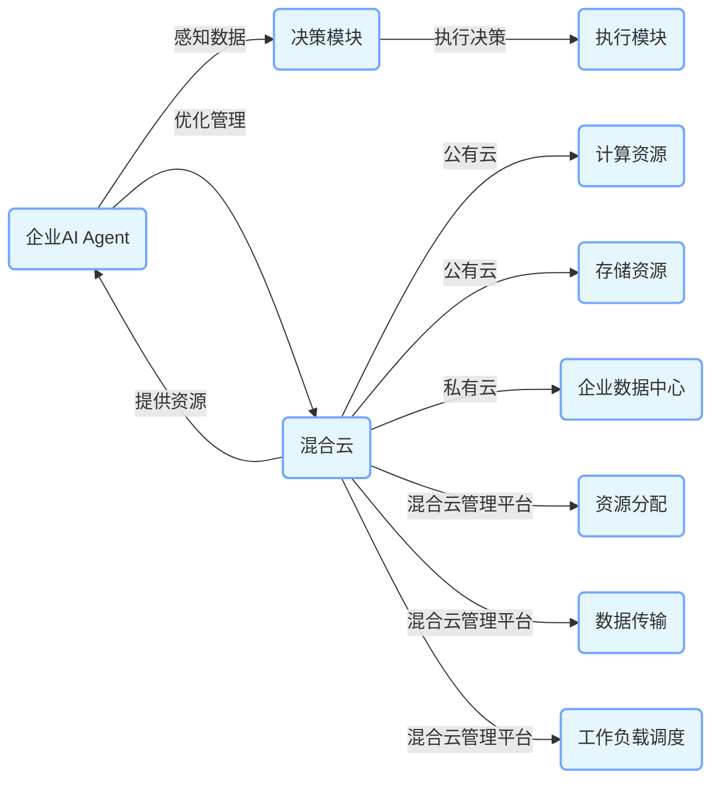

# 企业AI Agent的混合云部署策略

> 关键词：企业AI Agent、混合云部署、策略、云服务、数据安全

> 摘要：本文聚焦于企业AI Agent的混合云部署策略，深入探讨了在混合云环境下部署AI Agent的相关技术原理、操作步骤、数学模型等内容。首先介绍了背景信息，包括目的范围、预期读者等。接着阐述了核心概念与联系，给出了原理和架构的示意图与流程图。详细讲解了核心算法原理及具体操作步骤，使用Python代码进行说明。分析了数学模型和公式并举例。通过项目实战展示代码实现与解读。探讨了实际应用场景，推荐了相关工具和资源。最后总结了未来发展趋势与挑战，提供了常见问题解答和扩展阅读参考资料，旨在为企业在混合云环境中有效部署AI Agent提供全面的指导。

## 1. 背景介绍 
### 1.1 目的和范围
在当今数字化时代，企业面临着越来越复杂的业务需求和激烈的市场竞争。AI Agent作为一种能够自主执行任务、提供智能服务的软件实体，为企业带来了更高的效率和竞争力。而混合云环境结合了公有云和私有云的优势，能够满足企业对数据安全、成本控制和资源弹性的多重需求。本文章的目的在于深入探讨企业AI Agent在混合云环境下的部署策略，涵盖从核心概念的理解到具体部署步骤的实施，以及实际应用场景和未来发展趋势的分析。范围包括AI Agent的基本原理、混合云架构的特点、部署过程中的算法和数学模型，以及通过实际项目案例展示如何在混合云环境中成功部署AI Agent。

### 1.2 预期读者
本文预期读者主要包括企业的CTO、技术架构师、AI开发工程师、云计算专家以及对企业数字化转型和AI技术应用感兴趣的专业人士。这些读者希望了解如何在混合云环境中部署AI Agent，以提升企业的智能化水平和业务效率。同时，对于正在研究云计算和人工智能融合技术的科研人员也具有一定的参考价值。

### 1.3 文档结构概述
本文将按照以下结构进行阐述：首先介绍核心概念与联系，帮助读者理解企业AI Agent和混合云的基本原理和它们之间的关系；接着详细讲解核心算法原理和具体操作步骤，使用Python代码进行示例；然后分析数学模型和公式，并通过具体例子进行说明；通过项目实战展示代码的实际应用和详细解释；探讨实际应用场景，为企业提供实际参考；推荐相关的工具和资源，包括学习资源、开发工具框架和相关论文著作；最后总结未来发展趋势与挑战，提供常见问题解答和扩展阅读参考资料。

### 1.4 术语表
#### 1.4.1 核心术语定义
- **企业AI Agent**：是一种基于人工智能技术的软件实体，能够感知企业环境，自主执行任务，为企业提供智能决策支持和服务。它可以处理复杂的业务逻辑，与企业的各种系统和数据进行交互。
- **混合云**：是一种将公有云和私有云结合在一起的云计算架构。公有云由云服务提供商提供，具有成本低、资源弹性大的特点；私有云则由企业自行搭建和管理，能够更好地满足企业对数据安全和隐私的要求。混合云允许企业根据业务需求灵活地在公有云和私有云之间分配工作负载。
- **云服务**：是指通过互联网提供的各种计算资源和服务，包括计算能力、存储、数据库、软件等。云服务提供商负责管理和维护这些资源，企业可以根据需要按需使用。
- **数据安全**：是指保护企业数据不被未经授权的访问、使用、泄露、破坏或更改的一系列措施和技术。在混合云环境中，数据安全是一个至关重要的问题，需要采取多种手段来保障数据的安全性。

#### 1.4.2 相关概念解释
- **AI Agent的自主性**：AI Agent能够在一定程度上自主地感知环境、做出决策和执行任务，而不需要人类的实时干预。它可以根据预设的规则和算法，对环境变化做出响应，实现智能化的操作。
- **混合云的资源分配**：在混合云环境中，企业需要根据业务需求和资源成本，合理地分配工作负载到公有云和私有云。例如，对于一些对数据安全要求较高的任务，可以放在私有云中执行；而对于一些计算密集型的任务，可以利用公有云的强大计算能力。
- **云服务的多租户特性**：云服务提供商通常采用多租户架构，多个企业或用户可以共享同一套云资源。这种特性可以降低企业的使用成本，但也需要解决数据隔离和安全问题。

#### 1.4.3 缩略词列表
- **AI**：Artificial Intelligence，人工智能
- **IaaS**：Infrastructure as a Service，基础设施即服务
- **PaaS**：Platform as a Service，平台即服务
- **SaaS**：Software as a Service，软件即服务
- **API**：Application Programming Interface，应用程序编程接口

## 2. 核心概念与联系 
### 2.1 企业AI Agent的原理
企业AI Agent的核心原理基于人工智能的多个领域，包括机器学习、自然语言处理、计算机视觉等。它通过感知企业环境中的各种数据，如业务数据、用户反馈、市场信息等，利用机器学习算法进行数据分析和模型训练，从而实现对业务的理解和预测。例如，在客户服务领域，AI Agent可以通过自然语言处理技术理解客户的问题，并根据训练好的模型提供准确的答案和解决方案。

企业AI Agent通常由以下几个部分组成：
- **感知模块**：负责收集企业环境中的各种数据，包括传感器数据、文本数据、图像数据等。
- **决策模块**：利用机器学习模型对感知到的数据进行分析和处理，做出决策和判断。
- **执行模块**：根据决策模块的结果，执行相应的任务，如发送通知、执行操作、与其他系统进行交互等。

### 2.2 混合云的架构
混合云架构结合了公有云和私有云的优势，为企业提供了更加灵活和高效的云计算解决方案。它通常由以下几个部分组成：
- **公有云**：由云服务提供商提供，如亚马逊AWS、微软Azure、谷歌云等。公有云具有成本低、资源弹性大的特点，企业可以根据需要随时使用和扩展计算资源。
- **私有云**：由企业自行搭建和管理，通常部署在企业内部的数据中心或托管在第三方数据中心。私有云能够更好地满足企业对数据安全和隐私的要求，适合处理敏感数据和关键业务。
- **混合云管理平台**：用于管理和协调公有云和私有云之间的资源分配、数据传输和工作负载调度。它提供了统一的界面和工具，方便企业对混合云环境进行监控和管理。

### 2.3 企业AI Agent与混合云的联系
企业AI Agent和混合云之间存在着紧密的联系。混合云为企业AI Agent提供了强大的计算资源和存储能力，使得AI Agent能够处理大规模的数据和复杂的计算任务。同时，混合云的弹性和灵活性也能够满足AI Agent在不同业务场景下的资源需求。例如，在业务高峰期，企业可以利用公有云的资源来扩展AI Agent的计算能力；而在业务低谷期，可以将工作负载迁移到私有云，降低成本。

另一方面，企业AI Agent可以帮助企业更好地管理和优化混合云环境。通过对混合云资源的实时监测和分析，AI Agent可以自动调整资源分配，提高资源利用率，降低成本。同时，AI Agent还可以提供智能决策支持，帮助企业在公有云和私有云之间做出合理的选择。

### 2.4 核心概念原理和架构的文本示意图
```plaintext
企业AI Agent
├── 感知模块
│   ├── 数据收集
│   └── 数据预处理
├── 决策模块
│   ├── 机器学习模型
│   └── 数据分析
└── 执行模块
    ├── 任务执行
    └── 系统交互

混合云架构
├── 公有云
│   ├── 计算资源
│   ├── 存储资源
│   └── 云服务
├── 私有云
│   ├── 企业数据中心
│   ├── 服务器
│   └── 存储设备
└── 混合云管理平台
    ├── 资源分配
    ├── 数据传输
    └── 工作负载调度

企业AI Agent与混合云的联系
├── 混合云为AI Agent提供资源
│   ├── 计算资源支持
│   └── 存储资源支持
└── AI Agent优化混合云管理
    ├── 资源监测与调整
    └── 智能决策支持
```

### 2.5 Mermaid流程图


## 3. 核心算法原理 & 具体操作步骤 
### 3.1 核心算法原理
在企业AI Agent的混合云部署中，涉及到多个核心算法，其中机器学习算法是关键。以常见的监督学习算法——线性回归为例，其原理是通过寻找一个线性函数来拟合输入数据和输出数据之间的关系。假设我们有一组输入特征 $x_1, x_2, \cdots, x_n$ 和对应的输出 $y$，线性回归模型可以表示为：

$$y = \theta_0 + \theta_1x_1 + \theta_2x_2 + \cdots + \theta_nx_n + \epsilon$$

其中，$\theta_0, \theta_1, \cdots, \theta_n$ 是模型的参数，$\epsilon$ 是误差项。线性回归的目标是找到一组最优的参数 $\theta$，使得预测值与实际值之间的误差最小。通常使用最小二乘法来求解这个问题，即最小化以下损失函数：

$$J(\theta) = \frac{1}{2m}\sum_{i=1}^{m}(h_{\theta}(x^{(i)}) - y^{(i)})^2$$

其中，$m$ 是样本数量，$h_{\theta}(x^{(i)})$ 是第 $i$ 个样本的预测值，$y^{(i)}$ 是第 $i$ 个样本的实际值。

### 3.2 Python代码实现线性回归算法
```python
import numpy as np

class LinearRegression:
    def __init__(self):
        self.theta = None

    def fit(self, X, y):
        # 在特征矩阵 X 前添加一列全为 1 的列，用于表示截距项
        X_b = np.c_[np.ones((X.shape[0], 1)), X]
        # 使用正规方程求解参数 theta
        self.theta = np.linalg.inv(X_b.T.dot(X_b)).dot(X_b.T).dot(y)

    def predict(self, X):
        # 在特征矩阵 X 前添加一列全为 1 的列，用于表示截距项
        X_b = np.c_[np.ones((X.shape[0], 1)), X]
        # 进行预测
        return X_b.dot(self.theta)

# 示例数据
X = np.array([[1], [2], [3], [4], [5]])
y = np.array([2, 4, 6, 8, 10])

# 创建线性回归模型实例
model = LinearRegression()
# 训练模型
model.fit(X, y)
# 进行预测
new_X = np.array([[6]])
prediction = model.predict(new_X)
print("预测值:", prediction)
```

### 3.3 具体操作步骤
#### 3.3.1 需求分析
首先，企业需要明确AI Agent的具体需求和业务目标。例如，是用于客户服务、销售预测还是生产调度等。同时，要考虑混合云环境的特点和要求，确定数据存储、计算资源和安全策略。

#### 3.3.2 数据准备
收集和整理与业务相关的数据，并进行预处理。这包括数据清洗、特征工程和数据划分等步骤。数据预处理的质量直接影响到AI模型的性能。

#### 3.3.3 模型选择和训练
根据业务需求和数据特点，选择合适的机器学习模型。如线性回归、逻辑回归、决策树等。使用准备好的数据对模型进行训练，并进行模型评估和调优。

#### 3.3.4 混合云资源配置
根据AI Agent的计算需求和数据安全要求，合理配置混合云资源。将数据和模型部署到公有云和私有云的合适位置，并进行资源分配和调度。

#### 3.3.5 集成和测试
将AI Agent与企业的现有系统进行集成，并进行全面的测试。确保AI Agent能够正常工作，与其他系统之间的交互正常。

#### 3.3.6 部署和监控
将经过测试的AI Agent部署到混合云环境中，并建立监控机制。实时监测AI Agent的运行状态和性能，及时发现和解决问题。

## 4. 数学模型和公式 & 详细讲解 & 举例说明 
### 4.1 线性回归模型的详细讲解
线性回归模型是一种简单而有效的机器学习模型，它假设输入特征和输出之间存在线性关系。在前面的章节中，我们已经介绍了线性回归的基本公式和损失函数。下面我们详细讲解如何使用梯度下降法来求解线性回归模型的参数。

梯度下降法是一种迭代优化算法，它通过不断地更新参数来最小化损失函数。具体步骤如下：
1. 初始化参数 $\theta$。
2. 计算损失函数 $J(\theta)$ 关于参数 $\theta$ 的梯度 $\nabla J(\theta)$。
3. 根据梯度更新参数 $\theta$：$\theta := \theta - \alpha \nabla J(\theta)$，其中 $\alpha$ 是学习率，控制参数更新的步长。
4. 重复步骤 2 和 3，直到损失函数收敛或达到最大迭代次数。

梯度下降法的公式可以表示为：

$$\theta_j := \theta_j - \alpha \frac{1}{m}\sum_{i=1}^{m}(h_{\theta}(x^{(i)}) - y^{(i)})x_j^{(i)}$$

其中，$j = 0, 1, \cdots, n$ 表示参数的索引。

### 4.2 Python代码实现梯度下降法求解线性回归
```python
import numpy as np
import matplotlib.pyplot as plt

class GradientDescentLinearRegression:
    def __init__(self, learning_rate=0.01, num_iterations=1000):
        self.learning_rate = learning_rate
        self.num_iterations = num_iterations
        self.theta = None

    def fit(self, X, y):
        # 在特征矩阵 X 前添加一列全为 1 的列，用于表示截距项
        X_b = np.c_[np.ones((X.shape[0], 1)), X]
        # 初始化参数 theta
        self.theta = np.zeros(X_b.shape[1])

        for iteration in range(self.num_iterations):
            # 计算预测值
            y_pred = X_b.dot(self.theta)
            # 计算误差
            error = y_pred - y
            # 计算梯度
            gradient = (1 / X_b.shape[0]) * X_b.T.dot(error)
            # 更新参数
            self.theta = self.theta - self.learning_rate * gradient

    def predict(self, X):
        # 在特征矩阵 X 前添加一列全为 1 的列，用于表示截距项
        X_b = np.c_[np.ones((X.shape[0], 1)), X]
        # 进行预测
        return X_b.dot(self.theta)

# 示例数据
X = np.array([[1], [2], [3], [4], [5]])
y = np.array([2, 4, 6, 8, 10])

# 创建梯度下降线性回归模型实例
model = GradientDescentLinearRegression(learning_rate=0.01, num_iterations=1000)
# 训练模型
model.fit(X, y)
# 进行预测
new_X = np.array([[6]])
prediction = model.predict(new_X)
print("预测值:", prediction)

# 可视化训练过程
plt.plot(range(1000), [model.predict(X).mean() for _ in range(1000)])
plt.xlabel('迭代次数')
plt.ylabel('预测值均值')
plt.title('梯度下降法训练过程')
plt.show()
```

### 4.3 举例说明
假设我们要预测房屋的价格，已知房屋的面积作为输入特征。我们收集了一组房屋面积和对应的价格数据：

| 房屋面积（平方米） | 房屋价格（万元） |
| --- | --- |
| 50 | 100 |
| 70 | 140 |
| 90 | 180 |
| 110 | 220 |
| 130 | 260 |

我们可以使用线性回归模型来预测不同面积房屋的价格。首先，我们将房屋面积作为输入特征 $X$，房屋价格作为输出 $y$。然后，使用上述的梯度下降法求解线性回归模型的参数。最后，根据训练好的模型，我们可以预测新房屋的价格。

```python
import numpy as np

# 示例数据
X = np.array([[50], [70], [90], [110], [130]])
y = np.array([100, 140, 180, 220, 260])

# 创建梯度下降线性回归模型实例
model = GradientDescentLinearRegression(learning_rate=0.0001, num_iterations=1000)
# 训练模型
model.fit(X, y)

# 预测新房屋的价格
new_X = np.array([[150]])
prediction = model.predict(new_X)
print("预测的房屋价格:", prediction[0], "万元")
```

通过上述例子，我们可以看到线性回归模型在实际应用中的具体使用方法。

## 5. 项目实战：代码实际案例和详细解释说明 
### 5.1  开发环境搭建
#### 5.1.1 操作系统
可以选择 Linux 系统（如 Ubuntu、CentOS）或 Windows 系统作为开发环境。Linux 系统在云计算和人工智能开发中更为常用，因为它具有开源、稳定、安全等优点。

#### 5.1.2 编程语言和环境
使用 Python 作为开发语言，Python 具有丰富的机器学习和数据分析库，如 NumPy、Pandas、Scikit-learn 等。可以使用 Anaconda 来管理 Python 环境，它可以方便地安装和管理各种 Python 库。

#### 5.1.3 云服务提供商
选择合适的云服务提供商，如亚马逊 AWS、微软 Azure 或谷歌云。注册并创建云账户，了解云服务的使用方法和计费规则。

#### 5.1.4 开发工具
使用 PyCharm 或 Jupyter Notebook 作为开发工具。PyCharm 是一款专业的 Python 集成开发环境，提供了丰富的代码编辑、调试和版本控制功能；Jupyter Notebook 则适合进行交互式数据分析和模型训练。

### 5.2  源代码详细实现和代码解读
#### 5.2.1 数据准备
假设我们要开发一个基于企业AI Agent的销售预测系统，使用历史销售数据进行训练。首先，我们需要准备数据。

```python
import pandas as pd

# 读取销售数据
data = pd.read_csv('sales_data.csv')

# 提取特征和目标变量
X = data[['month', 'year', 'promotion']]
y = data['sales']

# 数据划分
from sklearn.model_selection import train_test_split
X_train, X_test, y_train, y_test = train_test_split(X, y, test_size=0.2, random_state=42)
```

代码解读：
- 使用 Pandas 库读取销售数据文件 `sales_data.csv`。
- 提取特征 `month`、`year` 和 `promotion` 作为输入特征 $X$，`sales` 作为目标变量 $y$。
- 使用 `train_test_split` 函数将数据划分为训练集和测试集，测试集占比为 20%。

#### 5.2.2 模型训练
选择线性回归模型进行训练。

```python
from sklearn.linear_model import LinearRegression

# 创建线性回归模型实例
model = LinearRegression()

# 训练模型
model.fit(X_train, y_train)
```

代码解读：
- 导入 `LinearRegression` 类，创建线性回归模型实例。
- 使用训练集数据 `X_train` 和 `y_train` 对模型进行训练。

#### 5.2.3 模型评估
使用测试集数据对模型进行评估。

```python
from sklearn.metrics import mean_squared_error

# 进行预测
y_pred = model.predict(X_test)

# 计算均方误差
mse = mean_squared_error(y_test, y_pred)
print("均方误差:", mse)
```

代码解读：
- 使用训练好的模型对测试集数据 `X_test` 进行预测，得到预测值 `y_pred`。
- 使用 `mean_squared_error` 函数计算预测值和实际值之间的均方误差，评估模型的性能。

#### 5.2.4 混合云部署
将训练好的模型部署到混合云环境中。假设我们使用亚马逊 AWS 的 Elastic Beanstalk 服务。

```bash
# 创建 Elastic Beanstalk 环境
eb init -p python-3.8 my-app
eb create my-env

# 部署代码
eb deploy
```

代码解读：
- 使用 `eb init` 命令初始化 Elastic Beanstalk 项目，指定 Python 3.8 环境。
- 使用 `eb create` 命令创建 Elastic Beanstalk 环境。
- 使用 `eb deploy` 命令将代码部署到 Elastic Beanstalk 环境中。

### 5.3  代码解读与分析
#### 5.3.1 数据准备阶段
数据准备是机器学习项目的重要环节，直接影响到模型的性能。在本项目中，我们使用 Pandas 库读取和处理数据，将数据划分为训练集和测试集，确保模型能够在未见过的数据上进行评估。

#### 5.3.2 模型训练阶段
选择合适的模型是关键。线性回归模型是一种简单而有效的模型，适用于处理线性关系的问题。在本项目中，我们使用 Scikit-learn 库中的 `LinearRegression` 类进行模型训练。

#### 5.3.3 模型评估阶段
使用均方误差作为评估指标，衡量模型的预测准确性。均方误差越小，说明模型的性能越好。

#### 5.3.4 混合云部署阶段
使用亚马逊 AWS 的 Elastic Beanstalk 服务可以方便地将模型部署到云端。Elastic Beanstalk 会自动处理服务器配置、负载均衡等问题，降低了部署的复杂度。

## 6. 实际应用场景 
### 6.1 客户服务
企业AI Agent可以在混合云环境下实现智能客户服务。通过自然语言处理技术，AI Agent能够理解客户的问题，并根据预设的规则和机器学习模型提供准确的答案和解决方案。在混合云环境中，敏感的客户数据可以存储在私有云中，确保数据安全；而对于一些计算密集型的任务，如语音识别和文本生成，可以利用公有云的强大计算能力。例如，一家电商企业可以使用AI Agent为客户提供商品咨询、订单查询、售后处理等服务，提高客户满意度和服务效率。

### 6.2 销售预测
利用企业AI Agent和混合云的优势，企业可以进行更准确的销售预测。AI Agent可以收集和分析历史销售数据、市场趋势、客户行为等信息，使用机器学习模型进行预测。混合云环境可以提供足够的计算资源和存储能力，处理大规模的数据和复杂的计算任务。例如，一家零售企业可以根据销售预测结果，合理安排库存、制定促销策略，提高销售业绩和利润。

### 6.3 生产调度
在制造业中，企业AI Agent可以用于生产调度。AI Agent可以实时监测生产设备的状态、原材料的库存情况和订单需求，根据优化算法进行生产任务的调度。混合云环境可以实现数据的实时传输和共享，确保生产过程的高效和稳定。例如，一家汽车制造企业可以使用AI Agent优化生产线的调度，提高生产效率和产品质量。

### 6.4 风险管理
企业AI Agent可以帮助企业进行风险管理。通过分析企业的财务数据、市场数据和行业信息，AI Agent可以识别潜在的风险，并提供相应的预警和建议。混合云环境可以提供安全可靠的数据存储和处理环境，确保风险数据的保密性和完整性。例如，一家金融企业可以使用AI Agent进行信用风险评估、市场风险监测和合规性检查，降低企业的风险水平。

## 7. 工具和资源推荐
### 7.1 学习资源推荐
#### 7.1.1 书籍推荐
- 《Python机器学习》：这本书详细介绍了使用 Python 进行机器学习的方法和技巧，包括数据预处理、模型选择、训练和评估等内容。
- 《深度学习》：由 Ian Goodfellow、Yoshua Bengio 和 Aaron Courville 合著，是深度学习领域的经典教材，涵盖了深度学习的基本原理、算法和应用。
- 《云计算与分布式系统：从并行处理到物联网》：介绍了云计算和分布式系统的基本概念、架构和技术，对于理解混合云环境有很大的帮助。

#### 7.1.2 在线课程
- Coursera 上的《机器学习》课程：由 Andrew Ng 教授授课，是机器学习领域的经典课程，适合初学者入门。
- edX 上的《深度学习专业课程》：由多家知名高校和企业联合推出，涵盖了深度学习的多个方面，包括卷积神经网络、循环神经网络等。
- Udemy 上的《云计算基础课程》：介绍了云计算的基本概念、云服务提供商和云部署策略，帮助学习者快速了解云计算。

#### 7.1.3 技术博客和网站
- Medium：是一个技术博客平台，上面有很多关于人工智能、云计算和机器学习的优秀文章。
- Towards Data Science：专注于数据科学和机器学习领域，提供了大量的技术文章和案例分析。
- AWS 官方博客：提供了关于亚马逊云服务的最新技术和应用案例，对于了解混合云部署有很大的帮助。

### 7.2 开发工具框架推荐
#### 7.2.1 IDE和编辑器
- PyCharm：是一款专业的 Python 集成开发环境，提供了丰富的代码编辑、调试和版本控制功能。
- Jupyter Notebook：适合进行交互式数据分析和模型训练，支持多种编程语言和可视化工具。
- Visual Studio Code：是一款轻量级的代码编辑器，支持多种编程语言和插件扩展，对于开发和调试 Python 代码非常方便。

#### 7.2.2 调试和性能分析工具
- TensorBoard：是 TensorFlow 提供的可视化工具，用于监控和分析深度学习模型的训练过程和性能。
- Py-Spy：是一个轻量级的 Python 性能分析工具，可以实时监测 Python 程序的 CPU 使用情况和函数调用时间。
- AWS CloudWatch：是亚马逊云服务提供的监控和日志管理工具，可以用于监控混合云环境中应用程序的性能和健康状态。

#### 7.2.3 相关框架和库
- Scikit-learn：是一个常用的 Python 机器学习库，提供了丰富的机器学习算法和工具，如分类、回归、聚类等。
- TensorFlow：是一个开源的深度学习框架，由谷歌开发，广泛应用于图像识别、自然语言处理等领域。
- PyTorch：是另一个流行的深度学习框架，具有动态图的特点，适合进行快速迭代和实验。

### 7.3 相关论文著作推荐
#### 7.3.1 经典论文
- “Deep Residual Learning for Image Recognition”：提出了残差网络（ResNet）的概念，解决了深度神经网络训练中的梯度消失问题，在图像识别领域取得了巨大的成功。
- “Attention Is All You Need”：介绍了注意力机制和 Transformer 模型，在自然语言处理领域引起了广泛的关注和应用。
- “Cloud Computing and Emerging IT Platforms: Vision, Hype, and Reality for Delivering Computing as the 5th Utility”：探讨了云计算的发展趋势和应用前景，是云计算领域的经典论文之一。

#### 7.3.2 最新研究成果
- 在 arXiv 上可以找到很多关于人工智能、云计算和机器学习的最新研究成果。例如，关于强化学习在混合云资源调度中的应用、基于深度学习的企业AI Agent优化等方面的研究。
- 各大顶级学术会议，如 NeurIPS、ICML、CVPR 等，会发布很多最新的研究论文，关注这些会议可以了解到该领域的前沿动态。

#### 7.3.3 应用案例分析
- 一些知名企业会发布关于企业AI Agent和混合云部署的应用案例分析，如谷歌、微软、亚马逊等。这些案例可以帮助我们了解实际应用中的挑战和解决方案。
- 行业报告和研究机构的分析文章也会提供很多有价值的应用案例，如 Gartner、IDC 等发布的报告。

## 8. 总结：未来发展趋势与挑战
### 8.1 未来发展趋势
#### 8.1.1 智能化程度不断提高
随着人工智能技术的不断发展，企业AI Agent的智能化程度将不断提高。未来的AI Agent将能够更好地理解企业环境和业务需求，自主地做出更加复杂和准确的决策。例如，在客户服务领域，AI Agent可以通过情感分析技术更好地理解客户的情绪，提供更加个性化的服务。

#### 8.1.2 与物联网的深度融合
物联网技术的发展将为企业AI Agent带来更多的数据来源和应用场景。AI Agent可以与物联网设备进行实时交互，获取设备状态和环境信息，实现对企业生产和运营的智能化管理。例如，在工业制造领域，AI Agent可以通过与传感器和机器人的连接，实现生产过程的自动化和优化。

#### 8.1.3 混合云架构的优化
混合云架构将不断优化，提供更加灵活、高效和安全的云计算解决方案。云服务提供商将推出更多的混合云管理工具和服务，帮助企业更好地管理和协调公有云和私有云之间的资源。同时，混合云的安全性和可靠性也将得到进一步提升。

### 8.2 挑战
#### 8.2.1 数据安全和隐私问题
在混合云环境中，数据分布在公有云和私有云之间，数据安全和隐私问题是一个巨大的挑战。企业需要采取多种措施来保障数据的安全性，如数据加密、访问控制、安全审计等。同时，还需要遵守相关的法律法规和行业标准，保护用户的隐私。

#### 8.2.2 技术复杂性
企业AI Agent的混合云部署涉及到多个技术领域，如人工智能、云计算、网络通信等。技术的复杂性增加了部署和管理的难度，需要企业拥有专业的技术团队和丰富的实践经验。

#### 8.2.3 成本控制
混合云环境的使用成本包括云服务费用、硬件设备费用、人力成本等。企业需要合理规划和管理成本，选择合适的云服务提供商和资源配置方案，确保在满足业务需求的前提下，降低成本。

## 9. 附录：常见问题与解答
### 9.1 企业AI Agent和混合云部署需要哪些技术基础？
需要掌握人工智能基础知识，如机器学习、深度学习算法；熟悉云计算的基本概念和云服务提供商的使用方法；掌握 Python 编程语言和相关的开发库，如 NumPy、Pandas、Scikit-learn 等。

### 9.2 如何选择合适的云服务提供商？
可以从以下几个方面考虑：云服务的功能和性能、价格和计费方式、数据安全和隐私保护、技术支持和服务质量等。同时，还需要根据企业的业务需求和预算进行综合评估。

### 9.3 混合云部署中如何保障数据安全？
可以采取以下措施：数据加密、访问控制、安全审计、数据备份和恢复等。同时，需要选择具有良好安全记录和信誉的云服务提供商，并遵守相关的法律法规和行业标准。

### 9.4 企业AI Agent的训练数据从哪里获取？
训练数据可以从企业内部的业务系统、数据库中获取，也可以通过网络爬虫、传感器等方式收集外部数据。在获取数据时，需要注意数据的质量和合法性。

### 9.5 如何评估企业AI Agent的性能？
可以使用多种评估指标，如准确率、召回率、均方误差、F1 值等。同时，还可以通过实际应用场景中的业务指标来评估，如客户满意度、销售业绩等。

## 10. 扩展阅读 & 参考资料
- 《人工智能：现代方法》
- 《云计算：概念、技术与架构》
- AWS 官方文档：https://docs.aws.amazon.com/
- Azure 官方文档：https://docs.microsoft.com/en-us/azure/
- Google Cloud 官方文档：https://cloud.google.com/docs/
- 各大顶级学术会议论文：NeurIPS、ICML、CVPR 等

作者：AI天才研究院/AI Genius Institute & 禅与计算机程序设计艺术 /Zen And The Art of Computer Programming