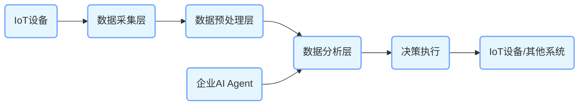

# 企业AI Agent的物联网(IoT)数据分析与应用

> 关键词：企业AI Agent、物联网、数据分析、应用场景、数据处理

> 摘要：本文聚焦于企业AI Agent在物联网数据分析与应用领域的相关内容。详细阐述了企业AI Agent和物联网的核心概念及两者间的联系，深入剖析了核心算法原理并给出Python代码示例，介绍了相关数学模型和公式。通过项目实战展示了如何搭建开发环境、实现源代码并进行解读。同时探讨了实际应用场景，推荐了学习资源、开发工具框架以及相关论文著作。最后对未来发展趋势与挑战进行总结，并给出常见问题解答和扩展阅读参考资料，旨在为企业在该领域的实践提供全面且深入的指导。

## 1. 背景介绍 
### 1.1 目的和范围
随着物联网技术的飞速发展，大量设备产生了海量的数据。企业需要有效的方法来处理和分析这些数据，以获取有价值的信息并做出明智的决策。企业AI Agent作为一种智能代理，能够在物联网环境中自主地进行数据收集、分析和应用。本文的目的是全面探讨企业AI Agent在物联网数据分析与应用中的相关技术、方法和实践，范围涵盖从核心概念的理解到实际项目的开发，以及未来发展趋势的展望。

### 1.2 预期读者
本文的预期读者包括企业IT管理人员、数据分析师、人工智能开发者、物联网工程师以及对企业AI Agent和物联网数据分析感兴趣的研究人员。这些读者可能希望了解如何利用企业AI Agent提升物联网数据的分析效率和应用价值，或者在相关领域进行技术创新和实践。

### 1.3 文档结构概述
本文将按照以下结构进行组织：首先介绍核心概念与联系，帮助读者理解企业AI Agent和物联网的基本原理和相互关系；接着阐述核心算法原理和具体操作步骤，并给出Python代码示例；然后介绍相关的数学模型和公式，并通过举例进行说明；之后通过项目实战展示如何在实际中应用这些技术；再探讨实际应用场景，让读者了解其在不同领域的应用价值；推荐学习资源、开发工具框架和相关论文著作，为读者提供进一步学习的方向；最后总结未来发展趋势与挑战，解答常见问题，并提供扩展阅读参考资料。

### 1.4 术语表
#### 1.4.1 核心术语定义
- **企业AI Agent**：一种具备人工智能能力的智能代理，能够在企业环境中自主地执行任务，如数据收集、分析、决策等。它可以根据预设的规则和目标，与物联网设备进行交互，处理和分析物联网数据。
- **物联网（IoT）**：通过各种信息传感器、射频识别技术、全球定位系统、红外感应器、激光扫描器等各种装置与技术，实时采集任何需要监控、 连接、互动的物体或过程，采集其声、光、热、电、力学、化学、生物、位置等各种需要的信息，通过各类可能的网络接入，实现物与物、物与人的泛在连接，实现对物品和过程的智能化感知、识别和管理。
- **数据分析**：指用适当的统计分析方法对收集来的大量数据进行分析，将它们加以汇总和理解并消化，以求最大化地开发数据的功能，发挥数据的作用。数据分析是为了提取有用信息和形成结论而对数据加以详细研究和概括总结的过程。

#### 1.4.2 相关概念解释
- **数据采集**：从物联网设备中收集各种类型的数据，如传感器数据、设备状态数据等。数据采集是数据分析的基础，确保数据的准确性和完整性对于后续的分析和应用至关重要。
- **数据预处理**：对采集到的数据进行清洗、转换、归一化等操作，以提高数据的质量和可用性。预处理可以去除噪声、处理缺失值、统一数据格式等，为后续的分析提供高质量的数据。
- **模型训练**：使用机器学习或深度学习算法对预处理后的数据进行训练，以构建能够对数据进行预测、分类或聚类的模型。模型训练需要选择合适的算法和参数，并进行反复的实验和优化。

#### 1.4.3 缩略词列表
- **AI**：Artificial Intelligence，人工智能
- **IoT**：Internet of Things，物联网
- **ML**：Machine Learning，机器学习
- **DL**：Deep Learning，深度学习

## 2. 核心概念与联系 
### 核心概念原理
#### 企业AI Agent
企业AI Agent是一种基于人工智能技术的智能代理，它具有自主学习、决策和执行任务的能力。企业AI Agent可以通过与物联网设备进行交互，获取设备产生的数据，并对这些数据进行分析和处理。它可以根据预设的规则和目标，自主地做出决策，并采取相应的行动。例如，在一个智能工厂中，企业AI Agent可以监控生产设备的运行状态，根据设备的性能数据预测设备的故障，并提前安排维护计划。

#### 物联网
物联网是通过各种信息传感器、射频识别技术、全球定位系统等技术，实现物与物、物与人的泛在连接，实现对物品和过程的智能化感知、识别和管理。物联网设备可以实时采集各种数据，如温度、湿度、压力、流量等，并将这些数据传输到云端或本地服务器进行处理。例如，在一个智能家居系统中，物联网设备可以感知室内的温度、湿度、光照等环境参数，并根据用户的需求自动调节空调、灯光等设备的运行状态。

### 架构的文本示意图
企业AI Agent与物联网的架构可以描述如下：物联网设备通过各种通信协议（如MQTT、HTTP等）将采集到的数据传输到数据采集层。数据采集层负责接收和存储这些数据，并将其发送到数据预处理层进行清洗和转换。数据预处理层将处理后的数据发送到数据分析层，数据分析层使用机器学习或深度学习算法对数据进行分析和挖掘。企业AI Agent可以在数据分析层进行决策和执行任务，并将结果反馈到物联网设备或其他系统中。

### Mermaid流程图


## 3. 核心算法原理 & 具体操作步骤 
### 核心算法原理
在企业AI Agent的物联网数据分析中，常用的算法包括机器学习算法和深度学习算法。以下以线性回归算法为例，介绍其原理。

线性回归是一种用于建立自变量和因变量之间线性关系的统计方法。假设我们有一组数据集 $\{(x_1, y_1), (x_2, y_2), \cdots, (x_n, y_n)\}$，其中 $x_i$ 是自变量，$y_i$ 是因变量。线性回归的目标是找到一条直线 $y = \theta_0 + \theta_1x$，使得该直线与数据集的误差最小。误差通常使用均方误差（MSE）来衡量，均方误差的计算公式为：

$$MSE = \frac{1}{n} \sum_{i=1}^{n} (y_i - (\theta_0 + \theta_1x_i))^2$$

我们的目标是找到 $\theta_0$ 和 $\theta_1$ 的值，使得 $MSE$ 最小。可以使用最小二乘法或梯度下降法来求解。

### 具体操作步骤
#### 步骤1：数据准备
首先，需要准备好数据集。假设我们有一个包含自变量 $x$ 和因变量 $y$ 的数据集。

#### 步骤2：模型训练
使用线性回归模型对数据集进行训练，找到最优的 $\theta_0$ 和 $\theta_1$ 值。

#### 步骤3：模型评估
使用测试数据集对训练好的模型进行评估，计算均方误差等指标。

#### 步骤4：预测
使用训练好的模型对新的数据进行预测。

### Python源代码示例
```python
import numpy as np
from sklearn.linear_model import LinearRegression
from sklearn.metrics import mean_squared_error
from sklearn.model_selection import train_test_split

# 生成示例数据
np.random.seed(0)
X = 2 * np.random.rand(100, 1)
y = 4 + 3 * X + np.random.randn(100, 1)

# 划分训练集和测试集
X_train, X_test, y_train, y_test = train_test_split(X, y, test_size=0.2, random_state=42)

# 创建线性回归模型
model = LinearRegression()

# 模型训练
model.fit(X_train, y_train)

# 模型预测
y_pred = model.predict(X_test)

# 模型评估
mse = mean_squared_error(y_test, y_pred)
print(f"均方误差: {mse}")

# 新数据预测
new_X = np.array([[1.5]])
new_y_pred = model.predict(new_X)
print(f"新数据预测结果: {new_y_pred}")
```

## 4. 数学模型和公式 & 详细讲解 & 举例说明 
### 线性回归数学模型和公式
线性回归的数学模型可以表示为：

$$y = \theta_0 + \theta_1x_1 + \theta_2x_2 + \cdots + \theta_nx_n + \epsilon$$

其中，$y$ 是因变量，$x_1, x_2, \cdots, x_n$ 是自变量，$\theta_0, \theta_1, \cdots, \theta_n$ 是模型的参数，$\epsilon$ 是误差项。

为了找到最优的参数 $\theta$，我们通常使用最小二乘法。最小二乘法的目标是最小化误差的平方和，即：

$$J(\theta) = \frac{1}{2m} \sum_{i=1}^{m} (h_{\theta}(x^{(i)}) - y^{(i)})^2$$

其中，$m$ 是样本数量，$h_{\theta}(x^{(i)})$ 是模型的预测值，$y^{(i)}$ 是实际值。

通过对 $J(\theta)$ 求偏导数并令其为 0，可以得到最优的参数 $\theta$ 的解。

### 详细讲解
最小二乘法的原理是通过最小化误差的平方和来找到最优的参数。误差的平方和是一个凸函数，因此可以通过求偏导数的方法找到其最小值。具体来说，对 $J(\theta)$ 求偏导数并令其为 0，得到以下方程组：

$$\frac{\partial J(\theta)}{\partial \theta_j} = \frac{1}{m} \sum_{i=1}^{m} (h_{\theta}(x^{(i)}) - y^{(i)})x_j^{(i)} = 0$$

解这个方程组可以得到最优的参数 $\theta$。

### 举例说明
假设我们有一个简单的线性回归问题，数据集如下：

| $x$ | $y$ |
| --- | --- |
| 1 | 3 |
| 2 | 5 |
| 3 | 7 |

我们的目标是找到一条直线 $y = \theta_0 + \theta_1x$，使得该直线与数据集的误差最小。

首先，计算误差的平方和：

$$J(\theta) = \frac{1}{2 \times 3} \left[ (3 - (\theta_0 + \theta_1 \times 1))^2 + (5 - (\theta_0 + \theta_1 \times 2))^2 + (7 - (\theta_0 + \theta_1 \times 3))^2 \right]$$

然后，对 $J(\theta)$ 求偏导数并令其为 0：

$$\frac{\partial J(\theta)}{\partial \theta_0} = \frac{1}{3} \left[ -2(3 - (\theta_0 + \theta_1 \times 1)) - 2(5 - (\theta_0 + \theta_1 \times 2)) - 2(7 - (\theta_0 + \theta_1 \times 3)) \right] = 0$$

$$\frac{\partial J(\theta)}{\partial \theta_1} = \frac{1}{3} \left[ -2(3 - (\theta_0 + \theta_1 \times 1)) \times 1 - 2(5 - (\theta_0 + \theta_1 \times 2)) \times 2 - 2(7 - (\theta_0 + \theta_1 \times 3)) \times 3 \right] = 0$$

解这个方程组可以得到 $\theta_0 = 1$，$\theta_1 = 2$。因此，最优的直线方程为 $y = 1 + 2x$。

## 5. 项目实战：代码实际案例和详细解释说明 
### 5.1  开发环境搭建
#### 操作系统
建议使用Linux或Windows操作系统。Linux系统具有良好的稳定性和开源生态，适合进行开发和部署；Windows系统则具有友好的用户界面，方便初学者使用。

#### Python环境
安装Python 3.7或以上版本。可以从Python官方网站（https://www.python.org/downloads/）下载并安装。

#### 依赖库安装
使用pip安装所需的依赖库，包括numpy、pandas、scikit-learn等。可以使用以下命令进行安装：

```sh
pip install numpy pandas scikit-learn
```

### 5.2  源代码详细实现和代码解读
以下是一个完整的企业AI Agent的物联网数据分析项目示例，使用线性回归算法对物联网设备的温度数据进行预测。

```python
import numpy as np
import pandas as pd
from sklearn.linear_model import LinearRegression
from sklearn.metrics import mean_squared_error
from sklearn.model_selection import train_test_split

# 读取数据集
data = pd.read_csv('temperature_data.csv')

# 提取特征和标签
X = data[['time']].values
y = data['temperature'].values

# 划分训练集和测试集
X_train, X_test, y_train, y_test = train_test_split(X, y, test_size=0.2, random_state=42)

# 创建线性回归模型
model = LinearRegression()

# 模型训练
model.fit(X_train, y_train)

# 模型预测
y_pred = model.predict(X_test)

# 模型评估
mse = mean_squared_error(y_test, y_pred)
print(f"均方误差: {mse}")

# 新数据预测
new_X = np.array([[10]])
new_y_pred = model.predict(new_X)
print(f"新数据预测结果: {new_y_pred}")
```

### 代码解读与分析
#### 数据读取
使用`pandas`库的`read_csv`函数读取存储在CSV文件中的物联网设备温度数据集。

#### 特征和标签提取
从数据集中提取特征（时间）和标签（温度），并将其转换为NumPy数组。

#### 数据集划分
使用`train_test_split`函数将数据集划分为训练集和测试集，其中测试集占总数据集的20%。

#### 模型创建和训练
创建线性回归模型，并使用训练集对模型进行训练。

#### 模型预测和评估
使用训练好的模型对测试集进行预测，并计算均方误差来评估模型的性能。

#### 新数据预测
使用训练好的模型对新的时间数据进行温度预测。

## 6. 实际应用场景 
### 智能工厂
在智能工厂中，企业AI Agent可以监控生产设备的运行状态，如温度、压力、振动等。通过对这些数据的分析，企业AI Agent可以预测设备的故障，提前安排维护计划，减少设备停机时间，提高生产效率。例如，通过对设备温度数据的分析，企业AI Agent可以发现设备温度异常升高的趋势，及时发出警报并安排维护人员进行检查和维修。

### 智能家居
在智能家居系统中，企业AI Agent可以根据用户的习惯和环境参数，自动调节家居设备的运行状态。例如，根据室内温度和湿度数据，企业AI Agent可以自动调节空调和加湿器的运行，提供舒适的居住环境。同时，企业AI Agent还可以根据用户的作息时间，自动控制灯光和窗帘的开关，实现智能化的家居管理。

### 智能物流
在智能物流领域，企业AI Agent可以监控物流设备的运行状态，如车辆的位置、速度、油耗等。通过对这些数据的分析，企业AI Agent可以优化物流路线，提高运输效率，降低物流成本。例如，根据车辆的实时位置和交通状况，企业AI Agent可以为司机提供最优的行驶路线，避免拥堵，节省运输时间和油耗。

### 智能医疗
在智能医疗领域，企业AI Agent可以监控患者的生命体征数据，如心率、血压、体温等。通过对这些数据的分析，企业AI Agent可以及时发现患者的健康问题，为医生提供决策支持。例如，根据患者的心率数据，企业AI Agent可以发现心率异常的情况，及时通知医生进行诊断和治疗。

## 7. 工具和资源推荐
### 7.1 学习资源推荐
#### 7.1.1 书籍推荐
- 《Python机器学习》：介绍了Python在机器学习领域的应用，包括各种机器学习算法的原理和实现。
- 《深度学习》：由深度学习领域的三位先驱Ian Goodfellow、Yoshua Bengio和Aaron Courville撰写，是深度学习领域的经典教材。
- 《物联网：技术、应用与创新》：全面介绍了物联网的技术、应用和创新，适合对物联网感兴趣的读者。

#### 7.1.2 在线课程
- Coursera上的“机器学习”课程：由斯坦福大学的Andrew Ng教授授课，是机器学习领域的经典在线课程。
- edX上的“深度学习”课程：由深度学习领域的知名学者授课，深入介绍了深度学习的原理和应用。
- 阿里云大学的“物联网开发实战”课程：提供了物联网开发的实战案例和教程，适合初学者学习。

#### 7.1.3 技术博客和网站
- Medium：是一个技术博客平台，上面有很多关于人工智能、物联网等领域的优质文章。
- 机器之心：专注于人工智能领域的资讯和技术分享，提供了很多最新的研究成果和应用案例。
- 物联网智库：关注物联网领域的发展动态和技术趋势，提供了丰富的行业资讯和分析报告。

### 7.2 开发工具框架推荐
#### 7.2.1 IDE和编辑器
- PyCharm：是一款专业的Python集成开发环境，提供了丰富的代码编辑、调试和项目管理功能。
- Jupyter Notebook：是一个交互式的开发环境，适合进行数据分析和模型训练。
- Visual Studio Code：是一款轻量级的代码编辑器，支持多种编程语言和插件扩展。

#### 7.2.2 调试和性能分析工具
- TensorBoard：是TensorFlow提供的可视化工具，可以用于可视化模型的训练过程和性能指标。
- Py-Spy：是一个Python性能分析工具，可以帮助开发者找出代码中的性能瓶颈。
- PDB：是Python自带的调试器，可以用于调试Python代码。

#### 7.2.3 相关框架和库
- TensorFlow：是一个开源的深度学习框架，提供了丰富的深度学习模型和工具。
- PyTorch：是另一个流行的深度学习框架，具有动态图和易于使用的特点。
- Scikit-learn：是一个用于机器学习的Python库，提供了各种机器学习算法和工具。

### 7.3 相关论文著作推荐
#### 7.3.1 经典论文
- “Gradient-Based Learning Applied to Document Recognition”：由Yann LeCun等人撰写，介绍了卷积神经网络在图像识别领域的应用。
- “Attention Is All You Need”：提出了Transformer模型，是自然语言处理领域的重要突破。
- “Deep Residual Learning for Image Recognition”：提出了残差网络（ResNet），解决了深度神经网络训练中的梯度消失问题。

#### 7.3.2 最新研究成果
- 关注顶级学术会议如NeurIPS、ICML、CVPR等的论文，这些会议上发表的论文代表了人工智能领域的最新研究成果。
- 关注知名学术期刊如Journal of Artificial Intelligence Research（JAIR）、Artificial Intelligence等的文章，这些期刊上发表的文章具有较高的学术水平。

#### 7.3.3 应用案例分析
- 研究企业和机构发布的物联网数据分析应用案例，了解实际应用中的技术挑战和解决方案。
- 关注行业报告和白皮书，如Gartner、IDC等机构发布的报告，了解物联网和人工智能领域的市场趋势和应用案例。

## 8. 总结：未来发展趋势与挑战
### 未来发展趋势
#### 融合发展
企业AI Agent和物联网将与其他技术如区块链、边缘计算等深度融合。区块链技术可以提供数据的安全性和可信度，边缘计算可以减少数据传输延迟，提高系统的响应速度。例如，在物联网供应链管理中，结合区块链技术可以实现数据的不可篡改和可追溯，结合边缘计算可以在设备端实时处理数据，提高供应链的效率和透明度。

#### 智能化升级
企业AI Agent将不断提升智能化水平，具备更强的自主学习和决策能力。未来的企业AI Agent可以根据不同的业务场景和需求，自动调整分析方法和策略，实现更加智能化的数据分析和应用。例如，在智能工厂中，企业AI Agent可以根据生产任务的变化，自动优化设备的运行参数，提高生产效率和质量。

#### 行业应用拓展
企业AI Agent的物联网数据分析与应用将在更多行业得到广泛应用，如农业、能源、金融等。在农业领域，企业AI Agent可以监控土壤湿度、光照强度等环境参数，实现精准灌溉和施肥；在能源领域，企业AI Agent可以优化能源分配和管理，提高能源利用效率；在金融领域，企业AI Agent可以分析客户的交易数据，进行风险评估和预测。

### 挑战
#### 数据安全和隐私
物联网设备产生的大量数据包含了用户的敏感信息，如个人健康数据、家庭隐私等。如何保障数据的安全和隐私是企业AI Agent的物联网数据分析与应用面临的重要挑战。需要采用先进的加密技术、访问控制技术等手段，确保数据在传输和存储过程中的安全性。

#### 数据质量和标准
物联网数据来源广泛，数据格式和质量参差不齐。如何提高数据的质量和标准化程度，是进行有效数据分析的关键。需要建立统一的数据采集、传输和存储标准，对数据进行清洗和预处理，提高数据的可用性和可靠性。

#### 技术复杂度和人才短缺
企业AI Agent的物联网数据分析与应用涉及到人工智能、物联网、数据分析等多个领域的技术，技术复杂度较高。同时，目前相关领域的专业人才短缺，企业难以找到具备综合技术能力的人才。需要加强技术研发和人才培养，提高企业的技术水平和创新能力。

## 9. 附录：常见问题与解答
### 问题1：企业AI Agent和传统数据分析方法有什么区别？
企业AI Agent具有自主学习和决策能力，可以根据预设的规则和目标，自动地进行数据收集、分析和应用。而传统数据分析方法通常需要人工干预，数据分析的过程和结果受到人为因素的影响较大。企业AI Agent可以实时地对物联网数据进行分析和处理，及时发现问题并做出决策，提高企业的运营效率和竞争力。

### 问题2：如何选择合适的机器学习算法？
选择合适的机器学习算法需要考虑多个因素，如数据类型、数据规模、问题类型等。如果数据是线性可分的，可以选择线性回归、逻辑回归等线性算法；如果数据是非线性的，可以选择决策树、随机森林、神经网络等非线性算法。同时，还需要根据数据规模和计算资源的情况，选择合适的算法。例如，对于大规模数据集，可以选择分布式计算的算法，提高计算效率。

### 问题3：如何保障物联网数据的安全？
保障物联网数据的安全可以从多个方面入手。首先，采用先进的加密技术对数据进行加密，确保数据在传输和存储过程中的安全性。其次，建立严格的访问控制机制，限制只有授权人员才能访问数据。此外，还需要定期对数据进行备份，防止数据丢失。同时，加强对物联网设备的安全管理，及时更新设备的固件和软件，防范安全漏洞。

## 10. 扩展阅读 & 参考资料
### 扩展阅读
- 《人工智能时代的企业转型》：探讨了人工智能技术对企业的影响和企业如何进行转型。
- 《物联网安全技术》：介绍了物联网安全的相关技术和方法。
- 《数据分析实战》：提供了数据分析的实际案例和操作方法。

### 参考资料
- [TensorFlow官方文档](https://www.tensorflow.org/)
- [PyTorch官方文档](https://pytorch.org/)
- [Scikit-learn官方文档](https://scikit-learn.org/)

作者：AI天才研究院/AI Genius Institute & 禅与计算机程序设计艺术 /Zen And The Art of Computer Programming