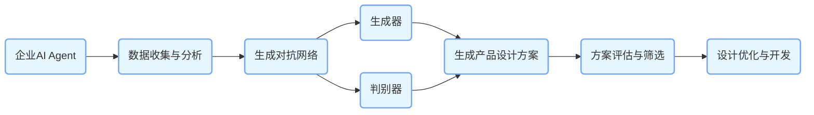

# 企业AI Agent的生成对抗网络在产品设计创新中的应用

> 关键词：企业AI Agent、生成对抗网络、产品设计创新、人工智能、设计优化

> 摘要：本文深入探讨了企业AI Agent的生成对抗网络在产品设计创新中的应用。首先介绍了相关背景知识，包括目的、预期读者、文档结构和术语表。接着阐述了核心概念与联系，详细讲解了生成对抗网络的原理和架构，并给出了相应的示意图和流程图。通过Python源代码详细阐述了核心算法原理及具体操作步骤，同时给出了相关的数学模型和公式并举例说明。在项目实战部分，展示了开发环境搭建、源代码实现与解读。分析了实际应用场景，推荐了学习、开发相关的工具和资源，最后总结了未来发展趋势与挑战，还包含常见问题解答和扩展阅读参考资料，旨在为企业在产品设计创新中运用生成对抗网络提供全面的指导。

## 1. 背景介绍 
### 1.1 目的和范围
在当今竞争激烈的市场环境下，企业的产品设计创新能力是决定其生存和发展的关键因素之一。生成对抗网络（Generative Adversarial Networks, GANs）作为人工智能领域的一项重要技术，为产品设计创新提供了新的思路和方法。企业AI Agent结合生成对抗网络，可以自动化地生成新颖的产品设计方案，帮助企业快速响应市场需求，提高产品的竞争力。

本文的范围主要涵盖企业AI Agent的生成对抗网络在产品设计创新中的基本原理、算法实现、实际应用案例以及相关工具和资源的推荐等方面。旨在为企业的产品设计团队、人工智能研究人员以及对产品设计创新感兴趣的读者提供全面的技术指导和实践参考。

### 1.2 预期读者
- **企业产品设计团队**：包括产品经理、工业设计师、用户体验设计师等，希望通过引入人工智能技术来提升产品设计的创新能力和效率。
- **人工智能研究人员**：对生成对抗网络在实际应用中的拓展和创新感兴趣，希望了解其在产品设计领域的具体应用场景和技术挑战。
- **创业者和投资者**：关注新兴技术在企业中的应用前景，希望探索生成对抗网络在产品设计创新中的商业价值和投资机会。
- **相关专业的学生**：如计算机科学、工业设计、人工智能等专业的学生，希望通过学习本文了解跨学科领域的知识和应用。

### 1.3 文档结构概述
本文将按照以下结构进行组织：
- **核心概念与联系**：介绍企业AI Agent和生成对抗网络的基本概念，以及它们在产品设计创新中的联系和作用。
- **核心算法原理 & 具体操作步骤**：详细讲解生成对抗网络的算法原理，并通过Python代码实现具体的操作步骤。
- **数学模型和公式 & 详细讲解 & 举例说明**：给出生成对抗网络的数学模型和公式，并结合实际例子进行详细讲解。
- **项目实战：代码实际案例和详细解释说明**：通过一个具体的项目实例，展示如何使用企业AI Agent的生成对抗网络进行产品设计创新，包括开发环境搭建、源代码实现和代码解读。
- **实际应用场景**：分析企业AI Agent的生成对抗网络在产品设计创新中的实际应用场景和案例。
- **工具和资源推荐**：推荐相关的学习资源、开发工具和框架，以及经典论文和最新研究成果。
- **总结：未来发展趋势与挑战**：总结企业AI Agent的生成对抗网络在产品设计创新中的发展趋势和面临的挑战。
- **附录：常见问题与解答**：解答读者在学习和应用过程中常见的问题。
- **扩展阅读 & 参考资料**：提供相关的扩展阅读材料和参考资料，方便读者进一步深入学习。

### 1.4 术语表
#### 1.4.1 核心术语定义
- **企业AI Agent**：是指在企业环境中运行的人工智能代理，它可以自动执行各种任务，如数据处理、决策制定、方案生成等，以帮助企业提高运营效率和竞争力。
- **生成对抗网络（GANs）**：是一种深度学习模型，由生成器（Generator）和判别器（Discriminator）两个神经网络组成。生成器负责生成数据，判别器负责判断生成的数据是真实数据还是生成的数据。通过两者的对抗训练，生成器可以逐渐学习到真实数据的分布，从而生成高质量的合成数据。
- **产品设计创新**：是指企业在产品设计过程中引入新的理念、方法和技术，以创造出具有新颖性、实用性和竞争力的产品。

#### 1.4.2 相关概念解释
- **深度学习**：是一种基于人工神经网络的机器学习方法，通过构建多层神经网络来自动学习数据的特征和模式。
- **数据分布**：是指数据在不同取值上的概率分布情况，生成对抗网络的目标是学习真实数据的分布并生成符合该分布的新数据。
- **对抗训练**：是生成对抗网络的核心训练方法，通过生成器和判别器之间的对抗博弈，不断提高生成器生成数据的质量和判别器的判别能力。

#### 1.4.3 缩略词列表
- **GANs**：Generative Adversarial Networks（生成对抗网络）
- **AI**：Artificial Intelligence（人工智能）
- **ML**：Machine Learning（机器学习）
- **DL**：Deep Learning（深度学习）

## 2. 核心概念与联系 
### 2.1 企业AI Agent概述
企业AI Agent是一种能够自主感知企业环境、理解业务需求、并采取相应行动以实现企业目标的人工智能系统。它可以集成多种人工智能技术，如机器学习、自然语言处理、计算机视觉等，以完成各种复杂的任务。在产品设计创新中，企业AI Agent可以作为一个智能助手，帮助设计师收集市场信息、分析用户需求、生成设计方案等。

### 2.2 生成对抗网络原理
生成对抗网络由生成器和判别器两个神经网络组成。生成器的输入是一个随机噪声向量，通过一系列的神经网络层将其转换为一个数据样本。判别器的输入是一个数据样本，输出是一个概率值，表示该样本是真实数据的概率。

在训练过程中，生成器和判别器进行对抗训练。生成器的目标是生成能够欺骗判别器的假数据，而判别器的目标是准确区分真实数据和生成的数据。通过不断的迭代训练，生成器逐渐学习到真实数据的分布，从而生成越来越逼真的假数据。

### 2.3 企业AI Agent与生成对抗网络在产品设计创新中的联系
企业AI Agent可以利用生成对抗网络的强大生成能力，为产品设计创新提供支持。具体来说，企业AI Agent可以收集和分析大量的产品设计数据，包括市场趋势、用户反馈、竞争对手产品等，然后将这些信息作为输入，通过生成对抗网络生成新颖的产品设计方案。同时，企业AI Agent还可以对生成的方案进行评估和筛选，选择最有潜力的方案进行进一步的优化和开发。

### 2.4 核心概念原理和架构的文本示意图
```plaintext
企业AI Agent
|
|-- 数据收集与分析（市场信息、用户需求、竞品数据等）
|
|-- 生成对抗网络
|   |
|   |-- 生成器（输入：随机噪声向量，输出：产品设计方案）
|   |
|   |-- 判别器（输入：产品设计方案，输出：真实概率）
|
|-- 方案评估与筛选
|
|-- 设计优化与开发
```

### 2.5 Mermaid流程图


## 3. 核心算法原理 & 具体操作步骤 
### 3.1 生成对抗网络的算法原理
生成对抗网络的核心思想是通过生成器和判别器之间的对抗训练来学习真实数据的分布。具体来说，生成器 $G$ 接受一个随机噪声向量 $z$ 作为输入，通过神经网络将其转换为一个数据样本 $G(z)$。判别器 $D$ 接受一个数据样本 $x$ 作为输入，输出一个概率值 $D(x)$，表示该样本是真实数据的概率。

在训练过程中，生成器和判别器的目标可以表示为一个极小极大博弈问题：
$$\min_G \max_D V(D, G) = \mathbb{E}_{x \sim p_{data}(x)}[\log D(x)] + \mathbb{E}_{z \sim p_z(z)}[\log(1 - D(G(z)))]$$
其中，$p_{data}(x)$ 是真实数据的分布，$p_z(z)$ 是随机噪声的分布。

### 3.2 具体操作步骤
#### 3.2.1 数据准备
首先，需要收集和整理大量的产品设计数据，包括产品图片、设计文档、用户评价等。将这些数据进行预处理，如归一化、裁剪、缩放等，以适应生成对抗网络的输入要求。

#### 3.2.2 模型定义
使用深度学习框架（如PyTorch或TensorFlow）定义生成器和判别器的神经网络结构。生成器通常采用反卷积层来将随机噪声向量转换为数据样本，判别器通常采用卷积层来提取数据样本的特征并进行分类。

以下是一个使用PyTorch实现的简单生成器和判别器的代码示例：
```python
import torch
import torch.nn as nn

# 定义生成器
class Generator(nn.Module):
    def __init__(self, z_dim=100, img_dim=784):
        super(Generator, self).__init__()
        self.gen = nn.Sequential(
            nn.Linear(z_dim, 256),
            nn.LeakyReLU(0.1),
            nn.Linear(256, img_dim),
            nn.Tanh()
        )

    def forward(self, x):
        return self.gen(x)

# 定义判别器
class Discriminator(nn.Module):
    def __init__(self, img_dim=784):
        super(Discriminator, self).__init__()
        self.disc = nn.Sequential(
            nn.Linear(img_dim, 128),
            nn.LeakyReLU(0.1),
            nn.Linear(128, 1),
            nn.Sigmoid()
        )

    def forward(self, x):
        return self.disc(x)
```

#### 3.2.3 训练过程
在训练过程中，交替更新生成器和判别器的参数。具体步骤如下：
1. **训练判别器**：从真实数据集中随机采样一批数据，同时从随机噪声分布中采样一批噪声向量，通过生成器生成一批假数据。计算判别器对真实数据和假数据的输出，并根据损失函数更新判别器的参数。
2. **训练生成器**：从随机噪声分布中采样一批噪声向量，通过生成器生成一批假数据。计算判别器对这些假数据的输出，并根据损失函数更新生成器的参数。

以下是一个使用PyTorch实现的训练代码示例：
```python
import torch.optim as optim
import torchvision
import torchvision.datasets as datasets
import torchvision.transforms as transforms
from torch.utils.data import DataLoader

# 超参数设置
device = torch.device("cuda" if torch.cuda.is_available() else "cpu")
lr = 3e-4
z_dim = 64
img_dim = 28 * 28
batch_size = 32
num_epochs = 50

# 数据加载
transform = transforms.Compose([
    transforms.ToTensor(),
    transforms.Normalize((0.5,), (0.5,))
])
dataset = datasets.MNIST(root='./data', train=True, transform=transform, download=True)
dataloader = DataLoader(dataset, batch_size=batch_size, shuffle=True)

# 模型初始化
gen = Generator(z_dim, img_dim).to(device)
disc = Discriminator(img_dim).to(device)

# 优化器和损失函数
opt_gen = optim.Adam(gen.parameters(), lr=lr)
opt_disc = optim.Adam(disc.parameters(), lr=lr)
criterion = nn.BCELoss()

# 训练过程
for epoch in range(num_epochs):
    for batch_idx, (real, _) in enumerate(dataloader):
        real = real.view(-1, 784).to(device)
        batch_size = real.shape[0]

        ### 训练判别器
        noise = torch.randn(batch_size, z_dim).to(device)
        fake = gen(noise)
        disc_real = disc(real).view(-1)
        lossD_real = criterion(disc_real, torch.ones_like(disc_real))
        disc_fake = disc(fake.detach()).view(-1)
        lossD_fake = criterion(disc_fake, torch.zeros_like(disc_fake))
        lossD = (lossD_real + lossD_fake) / 2
        disc.zero_grad()
        lossD.backward()
        opt_disc.step()

        ### 训练生成器
        output = disc(fake).view(-1)
        lossG = criterion(output, torch.ones_like(output))
        gen.zero_grad()
        lossG.backward()
        opt_gen.step()

    print(f"Epoch [{epoch + 1}/{num_epochs}] Loss D: {lossD.item():.4f}, Loss G: {lossG.item():.4f}")
```

#### 3.2.4 生成产品设计方案
在训练完成后，可以使用训练好的生成器生成产品设计方案。具体方法是从随机噪声分布中采样一批噪声向量，输入到生成器中，得到生成的产品设计方案。

```python
# 生成产品设计方案
num_samples = 16
noise = torch.randn(num_samples, z_dim).to(device)
generated_samples = gen(noise)
```

## 4. 数学模型和公式 & 详细讲解 & 举例说明 
### 4.1 生成对抗网络的数学模型
生成对抗网络的数学模型可以用以下公式表示：

#### 生成器
生成器 $G$ 是一个函数，它将随机噪声向量 $z \sim p_z(z)$ 映射到数据空间中的一个样本 $G(z)$。通常，$G$ 是一个神经网络，其参数为 $\theta_G$。

#### 判别器
判别器 $D$ 是一个函数，它接受一个数据样本 $x$ 作为输入，输出一个概率值 $D(x)$，表示该样本是真实数据的概率。$D$ 也是一个神经网络，其参数为 $\theta_D$。

#### 目标函数
生成对抗网络的目标是通过极小极大博弈来优化生成器和判别器的参数。具体来说，生成器的目标是最小化判别器将其生成的数据判断为假数据的概率，而判别器的目标是最大化区分真实数据和生成数据的能力。目标函数可以表示为：
$$\min_G \max_D V(D, G) = \mathbb{E}_{x \sim p_{data}(x)}[\log D(x)] + \mathbb{E}_{z \sim p_z(z)}[\log(1 - D(G(z)))]$$

### 4.2 详细讲解
#### 判别器的优化
判别器的目标是最大化目标函数 $V(D, G)$。对于真实数据 $x \sim p_{data}(x)$，判别器希望 $D(x)$ 尽可能接近 1；对于生成的数据 $G(z)$，判别器希望 $D(G(z))$ 尽可能接近 0。因此，判别器的损失函数可以表示为：
$$L_D = -\mathbb{E}_{x \sim p_{data}(x)}[\log D(x)] - \mathbb{E}_{z \sim p_z(z)}[\log(1 - D(G(z)))]$$

#### 生成器的优化
生成器的目标是最小化目标函数 $V(D, G)$。生成器希望判别器将其生成的数据 $G(z)$ 判断为真实数据，即 $D(G(z))$ 尽可能接近 1。因此，生成器的损失函数可以表示为：
$$L_G = -\mathbb{E}_{z \sim p_z(z)}[\log D(G(z))]$$

### 4.3 举例说明
假设我们要使用生成对抗网络生成手写数字图像。真实数据 $x$ 是从 MNIST 数据集中采样的手写数字图像，随机噪声向量 $z$ 是一个 100 维的向量。

#### 判别器的训练
在判别器的训练过程中，我们从 MNIST 数据集中随机采样一批真实图像 $x$，同时从随机噪声分布中采样一批噪声向量 $z$，通过生成器生成一批假图像 $G(z)$。判别器的目标是正确区分真实图像和假图像。对于真实图像，判别器输出的概率值应该接近 1；对于假图像，判别器输出的概率值应该接近 0。

#### 生成器的训练
在生成器的训练过程中，我们从随机噪声分布中采样一批噪声向量 $z$，通过生成器生成一批假图像 $G(z)$。生成器的目标是让判别器将这些假图像判断为真实图像。因此，生成器会不断调整自己的参数，使得生成的图像越来越逼真。

## 5. 项目实战：代码实际案例和详细解释说明 
### 5.1 开发环境搭建
#### 5.1.1 安装Python
首先，需要安装Python编程语言。建议使用Python 3.7及以上版本，可以从Python官方网站（https://www.python.org/downloads/）下载并安装。

#### 5.1.2 安装深度学习框架
本文使用PyTorch作为深度学习框架，可以根据自己的系统和CUDA版本选择合适的安装方式。可以通过以下命令安装PyTorch：
```sh
pip install torch torchvision
```

#### 5.1.3 安装其他依赖库
还需要安装一些其他的依赖库，如NumPy、Matplotlib等，可以使用以下命令安装：
```sh
pip install numpy matplotlib
```

### 5.2 源代码详细实现和代码解读
#### 5.2.1 数据加载和预处理
```python
import torchvision
import torchvision.datasets as datasets
import torchvision.transforms as transforms
from torch.utils.data import DataLoader

# 数据预处理
transform = transforms.Compose([
    transforms.ToTensor(),
    transforms.Normalize((0.5,), (0.5,))
])

# 加载MNIST数据集
dataset = datasets.MNIST(root='./data', train=True, transform=transform, download=True)
dataloader = DataLoader(dataset, batch_size=32, shuffle=True)
```
代码解读：
- `transforms.Compose` 用于组合多个数据预处理操作，这里将图像转换为张量并进行归一化处理。
- `datasets.MNIST` 用于加载MNIST数据集，`root` 指定数据集的存储路径，`train=True` 表示加载训练集，`transform` 指定数据预处理操作，`download=True` 表示如果数据集不存在则自动下载。
- `DataLoader` 用于将数据集封装成可迭代的数据加载器，`batch_size` 指定每个批次的样本数量，`shuffle=True` 表示在每个epoch开始时打乱数据顺序。

#### 5.2.2 模型定义
```python
import torch
import torch.nn as nn

# 定义生成器
class Generator(nn.Module):
    def __init__(self, z_dim=100, img_dim=784):
        super(Generator, self).__init__()
        self.gen = nn.Sequential(
            nn.Linear(z_dim, 256),
            nn.LeakyReLU(0.1),
            nn.Linear(256, img_dim),
            nn.Tanh()
        )

    def forward(self, x):
        return self.gen(x)

# 定义判别器
class Discriminator(nn.Module):
    def __init__(self, img_dim=784):
        super(Discriminator, self).__init__()
        self.disc = nn.Sequential(
            nn.Linear(img_dim, 128),
            nn.LeakyReLU(0.1),
            nn.Linear(128, 1),
            nn.Sigmoid()
        )

    def forward(self, x):
        return self.disc(x)
```
代码解读：
- `Generator` 类定义了生成器的神经网络结构，它接受一个 100 维的随机噪声向量作为输入，通过两个全连接层将其转换为一个 784 维的图像向量。`LeakyReLU` 是一种激活函数，用于引入非线性。`Tanh` 激活函数将输出值限制在 [-1, 1] 范围内。
- `Discriminator` 类定义了判别器的神经网络结构，它接受一个 784 维的图像向量作为输入，通过两个全连接层输出一个概率值，表示该图像是真实图像的概率。`Sigmoid` 激活函数将输出值限制在 [0, 1] 范围内。

#### 5.2.3 训练过程
```python
import torch.optim as optim

# 超参数设置
device = torch.device("cuda" if torch.cuda.is_available() else "cpu")
lr = 3e-4
z_dim = 64
img_dim = 28 * 28
batch_size = 32
num_epochs = 50

# 模型初始化
gen = Generator(z_dim, img_dim).to(device)
disc = Discriminator(img_dim).to(device)

# 优化器和损失函数
opt_gen = optim.Adam(gen.parameters(), lr=lr)
opt_disc = optim.Adam(disc.parameters(), lr=lr)
criterion = nn.BCELoss()

# 训练过程
for epoch in range(num_epochs):
    for batch_idx, (real, _) in enumerate(dataloader):
        real = real.view(-1, 784).to(device)
        batch_size = real.shape[0]

        ### 训练判别器
        noise = torch.randn(batch_size, z_dim).to(device)
        fake = gen(noise)
        disc_real = disc(real).view(-1)
        lossD_real = criterion(disc_real, torch.ones_like(disc_real))
        disc_fake = disc(fake.detach()).view(-1)
        lossD_fake = criterion(disc_fake, torch.zeros_like(disc_fake))
        lossD = (lossD_real + lossD_fake) / 2
        disc.zero_grad()
        lossD.backward()
        opt_disc.step()

        ### 训练生成器
        output = disc(fake).view(-1)
        lossG = criterion(output, torch.ones_like(output))
        gen.zero_grad()
        lossG.backward()
        opt_gen.step()

    print(f"Epoch [{epoch + 1}/{num_epochs}] Loss D: {lossD.item():.4f}, Loss G: {lossG.item():.4f}")
```
代码解读：
- `device` 用于指定使用的计算设备，如果有可用的GPU则使用GPU，否则使用CPU。
- `lr` 是学习率，控制模型参数更新的步长。
- `z_dim` 是随机噪声向量的维度，`img_dim` 是图像向量的维度。
- `batch_size` 是每个批次的样本数量，`num_epochs` 是训练的轮数。
- `gen` 和 `disc` 分别是生成器和判别器的模型实例，`to(device)` 用于将模型移动到指定的计算设备上。
- `opt_gen` 和 `opt_disc` 分别是生成器和判别器的优化器，使用Adam优化算法。
- `criterion` 是损失函数，使用二元交叉熵损失函数（BCELoss）。
- 在训练过程中，交替更新判别器和生成器的参数。对于判别器，分别计算对真实数据和假数据的损失，然后取平均值作为总损失；对于生成器，计算判别器对生成数据的输出与真实标签（全为 1）之间的损失。

#### 5.2.4 生成产品设计方案
```python
import matplotlib.pyplot as plt
import numpy as np

# 生成产品设计方案
num_samples = 16
noise = torch.randn(num_samples, z_dim).to(device)
generated_samples = gen(noise)

# 可视化生成的样本
generated_samples = generated_samples.cpu().detach().view(num_samples, 28, 28).numpy()
fig, axes = plt.subplots(4, 4, figsize=(4, 4))
axes = axes.flatten()
for i in range(num_samples):
    axes[i].imshow(generated_samples[i], cmap='gray')
    axes[i].axis('off')
plt.show()
```
代码解读：
- `num_samples` 是要生成的样本数量。
- `noise` 是从随机噪声分布中采样的噪声向量。
- `generated_samples` 是通过生成器生成的图像向量。
- 使用 `matplotlib` 库将生成的图像可视化，将图像向量转换为 28x28 的矩阵，并显示在一个 4x4 的网格中。

### 5.3 代码解读与分析
#### 5.3.1 数据处理
在数据处理阶段，使用 `torchvision.transforms` 对图像数据进行预处理，将图像转换为张量并进行归一化处理。使用 `torch.utils.data.DataLoader` 将数据集封装成可迭代的数据加载器，方便批量加载数据。

#### 5.3.2 模型设计
生成器和判别器都使用全连接层构建神经网络。生成器的目标是将随机噪声向量转换为逼真的图像，判别器的目标是区分真实图像和生成图像。使用 `LeakyReLU` 激活函数引入非线性，使用 `Tanh` 和 `Sigmoid` 激活函数将输出值限制在特定范围内。

#### 5.3.3 训练过程
在训练过程中，交替更新判别器和生成器的参数。判别器的训练目标是最大化区分真实数据和生成数据的能力，生成器的训练目标是最小化判别器将其生成的数据判断为假数据的概率。使用二元交叉熵损失函数计算损失，并使用Adam优化算法更新模型参数。

#### 5.3.4 结果可视化
在训练完成后，使用生成器生成一批图像，并使用 `matplotlib` 库将这些图像可视化，以便直观地观察生成的效果。

## 6. 实际应用场景 
### 6.1 产品外观设计
企业AI Agent的生成对抗网络可以用于产品外观设计，例如手机、汽车、家具等产品的外观设计。通过学习大量的现有产品外观数据，生成对抗网络可以生成新颖的产品外观设计方案，为设计师提供灵感和参考。

### 6.2 产品功能设计
在产品功能设计方面，生成对抗网络可以根据用户需求和市场趋势，生成新的产品功能组合和设计方案。例如，智能家电的功能设计、软件应用的交互设计等。

### 6.3 包装设计
对于产品的包装设计，生成对抗网络可以学习不同风格和类型的包装设计案例，生成具有吸引力和创新性的包装设计方案，提高产品的市场竞争力。

### 6.4 个性化定制设计
企业可以利用生成对抗网络为用户提供个性化的产品设计服务。通过收集用户的偏好和需求信息，生成对抗网络可以为每个用户生成符合其个性化需求的产品设计方案，提高用户的满意度和忠诚度。

## 7. 工具和资源推荐
### 7.1 学习资源推荐
#### 7.1.1 书籍推荐
- 《深度学习》（Deep Learning）：由Ian Goodfellow、Yoshua Bengio和Aaron Courville撰写，是深度学习领域的经典教材，全面介绍了深度学习的基本概念、算法和应用。
- 《Python深度学习》（Deep Learning with Python）：由Francois Chollet撰写，结合Keras框架介绍了深度学习的实践应用，适合初学者入门。
- 《生成对抗网络实战》（GANs in Action）：由Jakub Langr和Vladimir Bok撰写，详细介绍了生成对抗网络的原理、算法和实践案例。

#### 7.1.2 在线课程
- Coursera上的“深度学习专项课程”（Deep Learning Specialization）：由Andrew Ng教授授课，包括深度学习的基础知识、卷积神经网络、循环神经网络等内容。
- Udemy上的“生成对抗网络实战：从零到GANs专家”（GANs - Generative Adversarial Networks: Zero to GANs Expert）：详细介绍了生成对抗网络的原理和实践应用。
- edX上的“人工智能基础”（Introduction to Artificial Intelligence）：介绍了人工智能的基本概念、算法和应用，包括生成对抗网络的相关内容。

#### 7.1.3 技术博客和网站
- Medium：是一个技术博客平台，有很多关于深度学习和生成对抗网络的优秀文章。
- Towards Data Science：专注于数据科学和机器学习领域的技术博客，提供了很多实用的教程和案例。
- arXiv：是一个预印本论文平台，包含了很多最新的学术研究成果，特别是在人工智能和深度学习领域。

### 7.2 开发工具框架推荐
#### 7.2.1 IDE和编辑器
- PyCharm：是一款专业的Python集成开发环境，提供了丰富的代码编辑、调试和项目管理功能。
- Jupyter Notebook：是一个交互式的笔记本环境，适合进行数据分析、模型训练和结果可视化。
- Visual Studio Code：是一款轻量级的代码编辑器，支持多种编程语言和插件扩展，可用于深度学习开发。

#### 7.2.2 调试和性能分析工具
- TensorBoard：是TensorFlow提供的可视化工具，可以用于监控模型的训练过程、可视化模型结构和分析性能指标。
- PyTorch Profiler：是PyTorch提供的性能分析工具，可以帮助开发者找出代码中的性能瓶颈和优化点。
- NVIDIA Nsight Systems：是NVIDIA提供的性能分析工具，可用于分析GPU上的深度学习应用的性能。

#### 7.2.3 相关框架和库
- PyTorch：是一个开源的深度学习框架，具有动态图和易于使用的特点，广泛应用于学术界和工业界。
- TensorFlow：是Google开发的开源深度学习框架，具有强大的分布式训练和部署能力。
- Keras：是一个高级神经网络API，基于TensorFlow、Theano等后端，简单易用，适合快速原型开发。

### 7.3 相关论文著作推荐
#### 7.3.1 经典论文
- 《Generative Adversarial Networks》：由Ian Goodfellow等人发表于2014年，是生成对抗网络的开创性论文，提出了生成对抗网络的基本概念和算法。
- 《Unsupervised Representation Learning with Deep Convolutional Generative Adversarial Networks》：由Alec Radford等人发表于2015年，提出了深度卷积生成对抗网络（DCGAN），大大提高了生成对抗网络的性能和稳定性。
- 《Conditional Generative Adversarial Nets》：由Mehdi Mirza和Simon Osindero发表于2014年，提出了条件生成对抗网络（CGAN），可以通过条件输入控制生成的数据。

#### 7.3.2 最新研究成果
- 关注顶级学术会议如NeurIPS、ICML、CVPR等的最新论文，了解生成对抗网络在产品设计创新等领域的最新研究进展。
- 关注知名研究机构和学者的个人主页，如OpenAI、DeepMind等，获取最新的研究成果和技术动态。

#### 7.3.3 应用案例分析
- 《Generative Adversarial Networks in Product Design: A Review and Future Directions》：对生成对抗网络在产品设计中的应用进行了综述和展望，分析了当前的研究现状和未来的发展方向。
- 《Using Generative Adversarial Networks for Product Design Innovation: A Case Study》：通过具体的案例研究，展示了生成对抗网络在产品设计创新中的应用效果和价值。

## 8. 总结：未来发展趋势与挑战
### 8.1 未来发展趋势
#### 8.1.1 与其他技术的融合
企业AI Agent的生成对抗网络将与其他人工智能技术如强化学习、迁移学习等深度融合，进一步提高产品设计创新的效率和质量。例如，结合强化学习可以让生成对抗网络在生成设计方案的过程中根据用户反馈进行实时优化。

#### 8.1.2 跨领域应用拓展
生成对抗网络在产品设计创新中的应用将不再局限于传统的工业设计领域，还将拓展到医疗、教育、金融等更多领域。例如，在医疗领域可以用于生成新的药物分子结构设计方案。

#### 8.1.3 个性化和定制化设计
随着消费者对个性化产品的需求不断增加，生成对抗网络将能够更好地实现个性化和定制化的产品设计。通过收集和分析用户的个性化数据，生成对抗网络可以为每个用户生成独一无二的产品设计方案。

### 8.2 挑战
#### 8.2.1 数据质量和数量
生成对抗网络的性能很大程度上依赖于训练数据的质量和数量。在产品设计领域，获取高质量、大规模的设计数据是一个挑战。同时，数据的标注和预处理也需要耗费大量的时间和精力。

#### 8.2.2 模型训练的稳定性
生成对抗网络的训练过程往往不稳定，容易出现梯度消失、梯度爆炸等问题，导致训练失败或生成的结果不理想。如何提高模型训练的稳定性是一个亟待解决的问题。

#### 8.2.3 伦理和法律问题
生成对抗网络生成的产品设计方案可能涉及到知识产权、伦理道德等问题。例如，生成的设计方案可能与现有产品存在相似性，引发知识产权纠纷；或者生成的设计方案可能存在安全隐患或不道德的内容。

## 9. 附录：常见问题与解答
### 9.1 生成对抗网络生成的设计方案是否具有实用性？
生成对抗网络生成的设计方案具有一定的创新性和启发性，但不一定直接具有实用性。这些方案通常需要设计师进行进一步的评估和优化，结合实际的生产工艺、成本、用户需求等因素，才能转化为实际可用的产品设计。

### 9.2 如何评估生成对抗网络生成的设计方案的质量？
可以从多个方面评估生成对抗网络生成的设计方案的质量，如新颖性、可行性、美观性等。可以使用一些客观的指标，如与现有设计的相似度、设计的复杂度等；也可以通过用户调查、专家评估等主观方法进行评估。

### 9.3 生成对抗网络的训练时间通常需要多久？
生成对抗网络的训练时间取决于多个因素，如数据集的大小、模型的复杂度、硬件设备等。一般来说，在普通的GPU上训练一个简单的生成对抗网络可能需要几个小时到几天的时间，而训练一个复杂的模型可能需要数周甚至数月的时间。

### 9.4 如何避免生成对抗网络生成的设计方案出现版权问题？
在使用生成对抗网络生成设计方案时，需要确保训练数据的来源合法，避免使用受版权保护的设计数据。同时，对于生成的设计方案，需要进行版权审查，确保其不侵犯他人的知识产权。

## 10. 扩展阅读 & 参考资料
### 10.1 扩展阅读
- 《AI艺术与设计：从基础到实践》：介绍了人工智能在艺术和设计领域的应用，包括生成对抗网络在设计创新中的应用案例。
- 《设计中的人工智能》：探讨了人工智能技术对设计领域的影响和变革，以及如何利用人工智能提升设计创新能力。
- 《人工智能驱动的产品创新》：分析了人工智能在产品创新中的应用模式和策略，包括生成对抗网络在产品设计中的应用。

### 10.2 参考资料
- Goodfellow, I. J., et al. "Generative adversarial nets." Advances in neural information processing systems. 2014.
- Radford, A., Metz, L., & Chintala, S. "Unsupervised representation learning with deep convolutional generative adversarial networks." arXiv preprint arXiv:1511.06434 (2015).
- Mirza, M., & Osindero, S. "Conditional generative adversarial nets." arXiv preprint arXiv:1411.1784 (2014).

作者：AI天才研究院/AI Genius Institute & 禅与计算机程序设计艺术 /Zen And The Art of Computer Programming