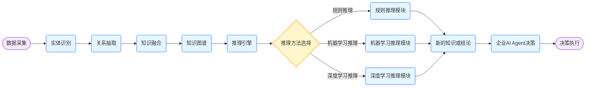

# 企业AI Agent的知识图谱构建与推理系统

> 关键词：企业AI Agent、知识图谱构建、知识图谱推理、语义网络、图数据库

> 摘要：本文聚焦于企业AI Agent的知识图谱构建与推理系统，全面且深入地阐述了其核心概念、算法原理、数学模型、实际案例以及应用场景等方面。通过逐步分析，旨在帮助读者理解如何为企业AI Agent构建有效的知识图谱，并实现高效的推理功能，以提升企业在信息处理、决策支持等方面的能力。同时，文章还提供了丰富的学习资源、开发工具推荐以及对未来发展趋势与挑战的分析，为相关领域的研究和实践提供了有价值的参考。

## 1. 背景介绍 
### 1.1 目的和范围
在当今数字化时代，企业面临着海量且复杂的数据，如何从这些数据中提取有价值的信息并进行有效利用，成为企业提升竞争力的关键。企业AI Agent作为一种智能软件实体，能够模拟人类的认知和决策过程，帮助企业处理各种业务问题。知识图谱作为一种强大的知识表示和管理工具，可以将企业内外部的各种数据关联起来，形成结构化的知识网络，为企业AI Agent提供丰富的背景知识，从而提升其智能水平和决策能力。

本文的范围涵盖了企业AI Agent知识图谱构建与推理系统的各个方面，包括核心概念、构建方法、推理算法、实际应用以及相关的工具和资源等。旨在为企业和研究人员提供一个全面的指南，帮助他们了解和应用这一技术。

### 1.2 预期读者
本文的预期读者包括企业的技术管理人员、数据科学家、AI开发者、研究机构的科研人员以及对企业AI和知识图谱技术感兴趣的人士。对于企业技术管理人员，本文可以帮助他们了解知识图谱在企业AI Agent中的应用价值和实施方法，从而为企业的数字化转型提供决策支持；对于数据科学家和AI开发者，本文提供了详细的技术实现方案和代码示例，有助于他们开展相关的研究和开发工作；对于科研人员，本文可以作为进一步研究的参考资料，激发新的研究思路；对于普通爱好者，本文可以帮助他们了解这一前沿技术的基本原理和应用场景。

### 1.3 文档结构概述
本文将按照以下结构进行组织：
- 核心概念与联系：介绍企业AI Agent、知识图谱构建与推理系统的基本概念，以及它们之间的联系，并通过文本示意图和Mermaid流程图进行直观展示。
- 核心算法原理 & 具体操作步骤：详细讲解知识图谱构建和推理的核心算法原理，并使用Python源代码进行阐述。
- 数学模型和公式 & 详细讲解 & 举例说明：介绍知识图谱构建和推理中涉及的数学模型和公式，并通过具体例子进行说明。
- 项目实战：代码实际案例和详细解释说明：通过一个实际的项目案例，展示如何搭建开发环境、实现源代码以及对代码进行解读和分析。
- 实际应用场景：介绍企业AI Agent的知识图谱构建与推理系统在不同领域的实际应用场景。
- 工具和资源推荐：推荐相关的学习资源、开发工具框架以及论文著作。
- 总结：未来发展趋势与挑战：对企业AI Agent的知识图谱构建与推理系统的未来发展趋势进行分析，并指出可能面临的挑战。
- 附录：常见问题与解答：解答读者在学习和实践过程中可能遇到的常见问题。
- 扩展阅读 & 参考资料：提供相关的扩展阅读材料和参考资料，方便读者进一步深入学习。

### 1.4 术语表
#### 1.4.1 核心术语定义
- **企业AI Agent**：一种运行在企业环境中的智能软件实体，能够感知企业内外的环境信息，根据预设的目标和规则进行推理和决策，并采取相应的行动来完成任务。
- **知识图谱**：一种用图结构来表示知识和语义关系的知识库，由实体、属性和关系组成。实体表示现实世界中的事物，属性描述实体的特征，关系表示实体之间的联系。
- **知识图谱构建**：将企业内外部的各种数据进行抽取、转换和加载，构建成知识图谱的过程，包括实体识别、关系抽取、知识融合等步骤。
- **知识图谱推理**：利用知识图谱中已有的知识，通过推理算法推导出新的知识或结论的过程。

#### 1.4.2 相关概念解释
- **语义网络**：一种基于图的知识表示方法，与知识图谱类似，但语义网络更强调节点和边的语义信息，常用于自然语言处理和人工智能领域。
- **图数据库**：一种专门用于存储和管理图数据的数据库，能够高效地处理图结构数据的存储、查询和分析，是知识图谱存储的常用工具。

#### 1.4.3 缩略词列表
- **RDF**：Resource Description Framework，资源描述框架，是一种用于表示知识和语义信息的标准数据模型。
- **OWL**：Web Ontology Language，网络本体语言，用于定义和描述知识图谱中的概念、属性和关系。
- **SPARQL**：SPARQL Protocol and RDF Query Language，用于查询和操作RDF数据的标准查询语言。

## 2. 核心概念与联系 

### 核心概念原理
#### 企业AI Agent
企业AI Agent是企业智能化的重要组成部分，它可以通过感知企业环境中的各种数据，如市场数据、客户数据、生产数据等，运用自身的智能算法进行分析和推理，为企业提供决策支持和自动化服务。企业AI Agent的智能水平取决于其拥有的知识和推理能力，而知识图谱可以为其提供丰富的背景知识和语义信息，从而提升其智能水平。

#### 知识图谱构建
知识图谱构建是将企业内外部的各种数据转化为结构化知识的过程。主要包括以下几个步骤：
- **数据采集**：从企业的数据库、文档、网页等数据源中采集相关的数据。
- **实体识别**：从采集到的数据中识别出实体，如企业名称、产品名称、人员姓名等。
- **关系抽取**：确定实体之间的关系，如“供应商 - 客户”关系、“生产 - 产品”关系等。
- **知识融合**：将不同数据源中得到的知识进行融合，消除冲突和冗余，形成统一的知识图谱。

#### 知识图谱推理
知识图谱推理是利用知识图谱中已有的知识，通过推理规则和算法推导出新的知识或结论的过程。常见的推理方法包括基于规则的推理、基于机器学习的推理和基于深度学习的推理等。推理可以帮助企业AI Agent发现隐藏的知识和关系，从而为企业的决策提供更全面的支持。

### 架构的文本示意图
```plaintext
企业AI Agent
├── 知识图谱
│   ├── 实体（企业、产品、人员等）
│   ├── 属性（名称、价格、职位等）
│   └── 关系（供应商 - 客户、生产 - 产品等）
├── 推理引擎
│   ├── 规则推理模块
│   ├── 机器学习推理模块
│   └── 深度学习推理模块
└── 感知与决策模块
    ├── 数据感知
    ├── 分析推理
    └── 决策执行
```

### Mermaid流程图


## 3. 核心算法原理 & 具体操作步骤 

### 实体识别算法原理及Python实现
#### 算法原理
实体识别是知识图谱构建的第一步，其目标是从文本中识别出实体。常见的实体识别方法有基于规则的方法、基于机器学习的方法和基于深度学习的方法。这里我们介绍一种基于深度学习的方法，即BiLSTM - CRF（双向长短期记忆网络 - 条件随机场）。

BiLSTM可以捕捉文本中的上下文信息，而CRF可以对序列标注问题进行建模，从而提高实体识别的准确率。具体来说，BiLSTM将输入的文本序列进行编码，得到每个词的特征表示，然后CRF根据这些特征表示进行序列标注，确定每个词所属的实体类别。

#### Python实现
```python
import torch
import torch.nn as nn
import torch.optim as optim
from torch.utils.data import Dataset, DataLoader

# 定义BiLSTM - CRF模型
class BiLSTM_CRF(nn.Module):
    def __init__(self, vocab_size, tag_to_ix, embedding_dim, hidden_dim):
        super(BiLSTM_CRF, self).__init__()
        self.embedding_dim = embedding_dim
        self.hidden_dim = hidden_dim
        self.vocab_size = vocab_size
        self.tag_to_ix = tag_to_ix
        self.tagset_size = len(tag_to_ix)

        self.word_embeds = nn.Embedding(vocab_size, embedding_dim)
        self.lstm = nn.LSTM(embedding_dim, hidden_dim // 2,
                            num_layers=1, bidirectional=True)

        # 将LSTM的输出映射到标签空间
        self.hidden2tag = nn.Linear(hidden_dim, self.tagset_size)

        # 转移矩阵，transitions[i][j]表示从标签j转移到标签i的分数
        self.transitions = nn.Parameter(
            torch.randn(self.tagset_size, self.tagset_size))

        # 确保不会转移到开始标签，也不会从结束标签转移
        self.transitions.data[tag_to_ix[START_TAG], :] = -10000
        self.transitions.data[:, tag_to_ix[STOP_TAG]] = -10000

        self.hidden = self.init_hidden()

    def init_hidden(self):
        return (torch.randn(2, 1, self.hidden_dim // 2),
                torch.randn(2, 1, self.hidden_dim // 2))

    def _forward_alg(self, feats):
        # 前向算法计算分区函数
        init_alphas = torch.full((1, self.tagset_size), -10000.)
        # START_TAG有所有的分数
        init_alphas[0][self.tag_to_ix[START_TAG]] = 0.

        # 包装在一个变量中，以便自动反向传播
        forward_var = init_alphas

        # 迭代句子中的每个词
        for feat in feats:
            alphas_t = []  # 这个时间步的前向变量
            for next_tag in range(self.tagset_size):
                # 广播发射分数：无论前一个标签是什么，都相同
                emit_score = feat[next_tag].view(
                    1, -1).expand(1, self.tagset_size)
                # 第i个条目是如果我们在这个时间步选择next_tag，前一个标签是i的分数
                trans_score = self.transitions[next_tag].view(1, -1)
                # 前一个变量加上发射和转移分数
                next_tag_var = forward_var + trans_score + emit_score
                # 这个标签的分区函数是所有分数的对数和
                alphas_t.append(log_sum_exp(next_tag_var).view(1))
            forward_var = torch.cat(alphas_t).view(1, -1)
        terminal_var = forward_var + self.transitions[self.tag_to_ix[STOP_TAG]]
        alpha = log_sum_exp(terminal_var)
        return alpha

    def _get_lstm_features(self, sentence):
        self.hidden = self.init_hidden()
        embeds = self.word_embeds(sentence).view(len(sentence), 1, -1)
        lstm_out, self.hidden = self.lstm(embeds, self.hidden)
        lstm_out = lstm_out.view(len(sentence), self.hidden_dim)
        lstm_feats = self.hidden2tag(lstm_out)
        return lstm_feats

    def _score_sentence(self, feats, tags):
        # 给出标签序列的分数
        score = torch.zeros(1)
        tags = torch.cat([torch.tensor([self.tag_to_ix[START_TAG]], dtype=torch.long), tags])
        for i, feat in enumerate(feats):
            score = score + \
                    self.transitions[tags[i + 1], tags[i]] + feat[tags[i + 1]]
        score = score + self.transitions[self.tag_to_ix[STOP_TAG], tags[-1]]
        return score

    def _viterbi_decode(self, feats):
        backpointers = []

        # 初始化前向变量
        init_vvars = torch.full((1, self.tagset_size), -10000.)
        init_vvars[0][self.tag_to_ix[START_TAG]] = 0

        # 第i步的forward_var保存第i - 1步的viterbi变量
        forward_var = init_vvars
        for feat in feats:
            bptrs_t = []  # 这个时间步的回溯指针
            viterbivars_t = []  # 这个时间步的viterbi变量

            for next_tag in range(self.tagset_size):
                # next_tag_var[i]保存如果我们在这个时间步选择next_tag，前一个标签是i的最大分数
                next_tag_var = forward_var + self.transitions[next_tag]
                best_tag_id = argmax(next_tag_var)
                bptrs_t.append(best_tag_id)
                viterbivars_t.append(next_tag_var[0][best_tag_id].view(1))
            # 现在添加发射分数，并将forward_var更新为这个时间步的viterbi变量
            forward_var = (torch.cat(viterbivars_t) + feat).view(1, -1)
            backpointers.append(bptrs_t)

        # 过渡到STOP_TAG
        terminal_var = forward_var + self.transitions[self.tag_to_ix[STOP_TAG]]
        best_tag_id = argmax(terminal_var)
        path_score = terminal_var[0][best_tag_id]

        # 跟着回溯指针找到最佳路径
        best_path = [best_tag_id]
        for bptrs_t in reversed(backpointers):
            best_tag_id = bptrs_t[best_tag_id]
            best_path.append(best_tag_id)
        # 弹出开始标签（我们不想把它返回给调用者）
        start = best_path.pop()
        assert start == self.tag_to_ix[START_TAG]  # 检查开始标签
        best_path.reverse()
        return path_score, best_path

    def neg_log_likelihood(self, sentence, tags):
        feats = self._get_lstm_features(sentence)
        forward_score = self._forward_alg(feats)
        gold_score = self._score_sentence(feats, tags)
        return forward_score - gold_score

    def forward(self, sentence):
        # 得到LSTM的发射分数
        lstm_feats = self._get_lstm_features(sentence)

        # 给定发射分数，使用Viterbi算法找到最佳路径
        score, tag_seq = self._viterbi_decode(lstm_feats)
        return score, tag_seq


# 辅助函数
def argmax(vec):
    # 返回向量中最大值的索引
    _, idx = torch.max(vec, 1)
    return idx.item()


def prepare_sequence(seq, to_ix):
    idxs = [to_ix[w] for w in seq]
    return torch.tensor(idxs, dtype=torch.long)


def log_sum_exp(vec):
    max_score = vec[0, argmax(vec)]
    return max_score + \
           torch.log(torch.sum(torch.exp(vec - max_score)))


# 示例数据
START_TAG = "<START>"
STOP_TAG = "<STOP>"
EMBEDDING_DIM = 5
HIDDEN_DIM = 4

# 训练数据
training_data = [
    ("the wall street journal reported today that apple corporation made money".split(),
     "B I I I O O O B I O O".split()),
    ("georgia tech is a university in georgia".split(),
     "B I O O O O B".split())
]

# 创建词汇表和标签表
word_to_ix = {}
for sent, tags in training_data:
    for word in sent:
        if word not in word_to_ix:
            word_to_ix[word] = len(word_to_ix)

tag_to_ix = {"B": 0, "I": 1, "O": 2, START_TAG: 3, STOP_TAG: 4}

# 初始化模型
model = BiLSTM_CRF(len(word_to_ix), tag_to_ix, EMBEDDING_DIM, HIDDEN_DIM)
optimizer = optim.SGD(model.parameters(), lr=0.01, weight_decay=1e-4)

# 训练模型
for epoch in range(300):
    for sentence, tags in training_data:
        # 步骤1. 请记住，PyTorch会累积梯度。
        # 我们需要在每次实例之前清除它们
        model.zero_grad()

        # 步骤2. 为我们的网络准备输入，即将它们转换为单词索引的张量
        sentence_in = prepare_sequence(sentence, word_to_ix)
        targets = torch.tensor([tag_to_ix[t] for t in tags], dtype=torch.long)

        # 步骤3. 运行前向传播
        loss = model.neg_log_likelihood(sentence_in, targets)

        # 步骤4. 通过调用.backward()计算损失、梯度和更新参数
        loss.backward()
        optimizer.step()

# 测试模型
with torch.no_grad():
    precheck_sent = prepare_sequence(training_data[0][0], word_to_ix)
    print(model(precheck_sent))
```

### 关系抽取算法原理及Python实现
#### 算法原理
关系抽取的目标是确定实体之间的关系。常见的关系抽取方法有基于规则的方法、基于机器学习的方法和基于深度学习的方法。这里我们介绍一种基于深度学习的方法，即使用卷积神经网络（CNN）进行关系抽取。

CNN可以自动提取文本中的特征，通过卷积层和池化层对文本进行特征提取和降维，然后将提取的特征输入到全连接层进行分类，确定实体之间的关系类型。

#### Python实现
```python
import torch
import torch.nn as nn
import torch.optim as optim
from torch.utils.data import Dataset, DataLoader
from sklearn.model_selection import train_test_split
from sklearn.preprocessing import LabelEncoder
import numpy as np

# 定义CNN模型
class CNN_Relation_Extraction(nn.Module):
    def __init__(self, vocab_size, embedding_dim, num_filters, filter_sizes, output_dim, dropout):
        super(CNN_Relation_Extraction, self).__init__()
        self.embedding = nn.Embedding(vocab_size, embedding_dim)
        self.convs = nn.ModuleList([
            nn.Conv2d(in_channels=1,
                      out_channels=num_filters,
                      kernel_size=(fs, embedding_dim))
            for fs in filter_sizes
        ])
        self.fc = nn.Linear(len(filter_sizes) * num_filters, output_dim)
        self.dropout = nn.Dropout(dropout)

    def forward(self, x):
        # x: [batch size, sent len]
        embedded = self.embedding(x)
        # embedded: [batch size, sent len, emb dim]
        embedded = embedded.unsqueeze(1)
        # embedded: [batch size, 1, sent len, emb dim]
        conved = [nn.functional.relu(conv(embedded)).squeeze(3) for conv in self.convs]
        # conved_n: [batch size, num_filters, sent len - filter_sizes[n] + 1]
        pooled = [nn.functional.max_pool1d(conv, conv.shape[2]).squeeze(2) for conv in conved]
        # pooled_n: [batch size, num_filters]
        cat = self.dropout(torch.cat(pooled, dim=1))
        # cat: [batch size, num_filters * len(filter_sizes)]
        return self.fc(cat)


# 示例数据
sentences = [
    "Apple is a technology company and it produces iPhones.",
    "Microsoft is a software company and it develops Windows."
]
relations = ["PRODUCES", "DEVELOPS"]

# 数据预处理
word_to_ix = {}
for sentence in sentences:
    for word in sentence.split():
        if word not in word_to_ix:
            word_to_ix[word] = len(word_to_ix)

label_encoder = LabelEncoder()
labels = label_encoder.fit_transform(relations)

# 转换为张量
sentence_tensors = []
for sentence in sentences:
    indices = [word_to_ix[word] for word in sentence.split()]
    sentence_tensors.append(torch.tensor(indices, dtype=torch.long))

label_tensors = torch.tensor(labels, dtype=torch.long)

# 划分训练集和测试集
train_sentences, test_sentences, train_labels, test_labels = train_test_split(sentence_tensors, label_tensors,
                                                                              test_size=0.2, random_state=42)

# 超参数设置
VOCAB_SIZE = len(word_to_ix)
EMBEDDING_DIM = 100
NUM_FILTERS = 100
FILTER_SIZES = [3, 4, 5]
OUTPUT_DIM = len(label_encoder.classes_)
DROPOUT = 0.5
BATCH_SIZE = 1
EPOCHS = 10

# 初始化模型
model = CNN_Relation_Extraction(VOCAB_SIZE, EMBEDDING_DIM, NUM_FILTERS, FILTER_SIZES, OUTPUT_DIM, DROPOUT)
optimizer = optim.Adam(model.parameters())
criterion = nn.CrossEntropyLoss()

# 训练模型
for epoch in range(EPOCHS):
    model.train()
    for sentence, label in zip(train_sentences, train_labels):
        optimizer.zero_grad()
        output = model(sentence.unsqueeze(0))
        loss = criterion(output, label.unsqueeze(0))
        loss.backward()
        optimizer.step()

# 测试模型
model.eval()
correct = 0
total = 0
with torch.no_grad():
    for sentence, label in zip(test_sentences, test_labels):
        output = model(sentence.unsqueeze(0))
        _, predicted = torch.max(output.data, 1)
        total += 1
        correct += (predicted == label).sum().item()

print(f'Accuracy: {100 * correct / total}%')
```

### 知识图谱推理算法原理及Python实现
#### 算法原理
基于规则的推理是一种常见的知识图谱推理方法，它通过定义一系列的规则来推导新的知识。例如，定义规则“如果A是B的父亲，B是C的父亲，那么A是C的祖父”，当知识图谱中存在“A是B的父亲”和“B是C的父亲”的事实时，就可以推导出“A是C的祖父”的新事实。

#### Python实现
```python
# 定义知识图谱
knowledge_graph = {
    ("John", "is_father_of", "Mike"),
    ("Mike", "is_father_of", "Tom")
}

# 定义推理规则
rules = [
    {
        "pattern": [("?x", "is_father_of", "?y"), ("?y", "is_father_of", "?z")],
        "conclusion": ("?x", "is_grandfather_of", "?z")
    }
]

# 推理函数
def rule_based_reasoning(knowledge_graph, rules):
    new_facts = set()
    for rule in rules:
        pattern = rule["pattern"]
        conclusion = rule["conclusion"]
        for fact1 in knowledge_graph:
            for fact2 in knowledge_graph:
                bindings = {}
                if len(pattern) == 2:
                    match1 = True
                    for i in range(3):
                        if pattern[0][i].startswith("?"):
                            if pattern[0][i] not in bindings:
                                bindings[pattern[0][i]] = fact1[i]
                            elif bindings[pattern[0][i]]!= fact1[i]:
                                match1 = False
                                break
                        elif pattern[0][i]!= fact1[i]:
                            match1 = False
                            break
                    if match1:
                        match2 = True
                        for i in range(3):
                            if pattern[1][i].startswith("?"):
                                if pattern[1][i] not in bindings:
                                    bindings[pattern[1][i]] = fact2[i]
                                elif bindings[pattern[1][i]]!= fact2[i]:
                                    match2 = False
                                    break
                            elif pattern[1][i]!= fact2[i]:
                                match2 = False
                                break
                        if match2:
                            new_fact = []
                            for element in conclusion:
                                if element.startswith("?"):
                                    new_fact.append(bindings[element])
                                else:
                                    new_fact.append(element)
                            new_fact = tuple(new_fact)
                            if new_fact not in knowledge_graph:
                                new_facts.add(new_fact)
    return new_facts


# 执行推理
new_facts = rule_based_reasoning(knowledge_graph, rules)
print("New facts:", new_facts)
```

## 4. 数学模型和公式 & 详细讲解 & 举例说明 

### 实体识别中的数学模型
在BiLSTM - CRF模型中，主要涉及到以下数学模型和公式。

#### BiLSTM的前向传播
BiLSTM的前向传播可以表示为：
$$
\begin{align*}
\overrightarrow{h}_t &= \overrightarrow{LSTM}(\overrightarrow{h}_{t - 1}, x_t) \\
\overleftarrow{h}_t &= \overleftarrow{LSTM}(\overleftarrow{h}_{t + 1}, x_t) \\
h_t &= [\overrightarrow{h}_t; \overleftarrow{h}_t]
\end{align*}
$$
其中，$\overrightarrow{h}_t$ 和 $\overleftarrow{h}_t$ 分别表示正向和反向LSTM在时间步 $t$ 的隐藏状态，$x_t$ 表示时间步 $t$ 的输入，$h_t$ 是将正向和反向隐藏状态拼接后的结果。

#### CRF的分区函数
CRF的分区函数 $Z(x)$ 用于计算所有可能的标签序列的分数之和，公式如下：
$$
Z(x) = \sum_{y \in \mathcal{Y}} \exp \left( \sum_{t = 1}^T s(y_{t - 1}, y_t, x) \right)
$$
其中，$\mathcal{Y}$ 表示所有可能的标签序列集合，$s(y_{t - 1}, y_t, x)$ 表示从标签 $y_{t - 1}$ 转移到标签 $y_t$ 的分数，$T$ 表示序列的长度。

#### CRF的损失函数
CRF的损失函数通常采用负对数似然损失，公式如下：
$$
L(x, y) = - \log \frac{\exp \left( \sum_{t = 1}^T s(y_{t - 1}, y_t, x) \right)}{Z(x)}
$$
其中，$x$ 表示输入序列，$y$ 表示真实的标签序列。

### 举例说明
假设我们有一个输入序列 $x = [x_1, x_2, x_3]$，标签集合 $\mathcal{Y} = \{B, I, O\}$。在时间步 $t = 1$，我们有输入 $x_1$，经过BiLSTM得到隐藏状态 $h_1$，然后通过全连接层得到发射分数 $e_1$。假设从标签 $B$ 转移到标签 $I$ 的转移分数为 $t_{B \to I}$，那么从标签 $B$ 转移到标签 $I$ 并发射 $x_1$ 的分数为 $e_1[I] + t_{B \to I}$。

分区函数 $Z(x)$ 需要计算所有可能的标签序列的分数之和，例如，对于标签序列 $y = [B, I, O]$，其分数为 $\exp \left( s(B, I, x_1) + s(I, O, x_2) + s(O, \text{STOP}, x_3) \right)$，其中 $s(y_{t - 1}, y_t, x)$ 由发射分数和转移分数组成。

损失函数 $L(x, y)$ 则是真实标签序列的分数的负对数除以分区函数，通过最小化损失函数来训练模型。

### 关系抽取中的数学模型
在CNN关系抽取模型中，主要涉及到卷积操作和池化操作。

#### 卷积操作
卷积操作可以表示为：
$$
c_{i}^{(l)} = f \left( \sum_{j = 0}^{k - 1} w_{j}^{(l)} x_{i + j} + b^{(l)} \right)
$$
其中，$c_{i}^{(l)}$ 表示第 $l$ 层卷积层在位置 $i$ 的输出，$w_{j}^{(l)}$ 表示第 $l$ 层卷积核的权重，$x_{i + j}$ 表示输入序列在位置 $i + j$ 的元素，$b^{(l)}$ 表示第 $l$ 层的偏置，$f$ 是激活函数，通常使用ReLU函数。

#### 池化操作
池化操作通常采用最大池化，公式如下：
$$
p^{(l)} = \max_{i} c_{i}^{(l)}
$$
其中，$p^{(l)}$ 表示第 $l$ 层池化层的输出。

### 举例说明
假设我们有一个输入序列 $x = [x_1, x_2, x_3, x_4, x_5]$，卷积核的大小为 $k = 3$。在卷积操作中，对于位置 $i = 1$，卷积输出 $c_1$ 为：
$$
c_1 = f \left( w_0 x_1 + w_1 x_2 + w_2 x_3 + b \right)
$$
然后对卷积输出进行最大池化，假设卷积输出为 $[c_1, c_2, c_3]$，则池化输出 $p$ 为：
$$
p = \max \{ c_1, c_2, c_3 \}
$$

### 知识图谱推理中的数学模型
在基于规则的推理中，主要涉及到规则匹配和事实推导。

#### 规则匹配
规则匹配可以看作是一个模式匹配问题，假设规则的模式为 $P = [p_1, p_2, \cdots, p_n]$，知识图谱中的事实集合为 $F$，则规则匹配的目标是找到 $F$ 中满足模式 $P$ 的事实组合。

#### 事实推导
当找到满足规则模式的事实组合时，根据规则的结论部分推导出新的事实。例如，规则的结论为 $C = (a, r, b)$，通过规则匹配得到变量的绑定 $\{ a: A, b: B \}$，则推导出新的事实 $(A, r, B)$。

### 举例说明
假设知识图谱中有事实 $F = \{ (John, is_father_of, Mike), (Mike, is_father_of, Tom) \}$，规则的模式为 $P = [("?x", "is_father_of", "?y"), ("?y", "is_father_of", "?z")]$，结论为 $C = ("?x", "is_grandfather_of", "?z")$。通过规则匹配，我们可以得到变量的绑定 $\{?x: John,?y: Mike,?z: Tom \}$，从而推导出新的事实 $(John, is_grandfather_of, Tom)$。

## 5. 项目实战：代码实际案例和详细解释说明 

### 5.1  开发环境搭建
#### 安装Python和相关库
首先，确保你已经安装了Python 3.x版本。然后，使用以下命令安装所需的库：
```bash
pip install torch
pip install scikit-learn
```
#### 安装图数据库
我们可以使用Neo4j作为图数据库来存储知识图谱。可以从Neo4j官方网站下载并安装Neo4j社区版。安装完成后，启动Neo4j服务，并创建一个新的数据库。

### 5.2  源代码详细实现和代码解读
#### 数据采集和预处理
```python
import pandas as pd

# 假设数据存储在CSV文件中
data = pd.read_csv('data.csv')

# 提取实体和关系信息
entities = set()
relations = []

for index, row in data.iterrows():
    entity1 = row['entity1']
    entity2 = row['entity2']
    relation = row['relation']
    entities.add(entity1)
    entities.add(entity2)
    relations.append((entity1, relation, entity2))

# 创建实体和关系的映射
entity_to_id = {entity: i for i, entity in enumerate(entities)}
relation_to_id = {relation: i for i, relation in enumerate(set([r[1] for r in relations]))}

# 将实体和关系转换为ID
triples = []
for entity1, relation, entity2 in relations:
    entity1_id = entity_to_id[entity1]
    entity2_id = entity_to_id[entity2]
    relation_id = relation_to_id[relation]
    triples.append((entity1_id, relation_id, entity2_id))
```
代码解读：
- 首先，使用`pandas`库读取存储在CSV文件中的数据。
- 然后，提取实体和关系信息，并将实体存储在集合`entities`中，关系存储在列表`relations`中。
- 接着，创建实体和关系到ID的映射，方便后续处理。
- 最后，将实体和关系转换为ID，存储在列表`triples`中。

#### 知识图谱构建
```python
from py2neo import Graph, Node, Relationship

# 连接到Neo4j数据库
graph = Graph("bolt://localhost:7687", auth=("neo4j", "password"))

# 创建实体节点
for entity, entity_id in entity_to_id.items():
    node = Node("Entity", id=entity_id, name=entity)
    graph.create(node)

# 创建关系
for entity1_id, relation_id, entity2_id in triples:
    entity1_node = graph.nodes.match("Entity", id=entity1_id).first()
    entity2_node = graph.nodes.match("Entity", id=entity2_id).first()
    relation_name = [key for key, value in relation_to_id.items() if value == relation_id][0]
    rel = Relationship(entity1_node, relation_name, entity2_node)
    graph.create(rel)
```
代码解读：
- 使用`py2neo`库连接到Neo4j数据库。
- 遍历实体映射，创建实体节点并添加到图数据库中。
- 遍历三元组，根据实体ID找到对应的节点，根据关系ID找到关系名称，创建关系并添加到图数据库中。

#### 知识图谱推理
```python
# 定义推理规则
rules = [
    {
        "pattern": [("?x", "is_parent_of", "?y"), ("?y", "is_parent_of", "?z")],
        "conclusion": ("?x", "is_grandparent_of", "?z")
    }
]

# 执行推理
new_facts = []
for rule in rules:
    pattern = rule["pattern"]
    conclusion = rule["conclusion"]
    query = f"MATCH "
    for i, p in enumerate(pattern):
        if i > 0:
            query += ", "
        query += f"({p[0]}:{p[1]} {{{p[2]}}})"
    query += " RETURN "
    for element in conclusion:
        if element.startswith("?"):
            query += f"{element} "
    result = graph.run(query)
    for record in result:
        bindings = {}
        for element in conclusion:
            if element.startswith("?"):
                bindings[element] = record[element]
        new_fact = []
        for element in conclusion:
            if element.startswith("?"):
                new_fact.append(bindings[element])
            else:
                new_fact.append(element)
        new_fact = tuple(new_fact)
        new_facts.append(new_fact)

# 将新事实添加到知识图谱中
for entity1, relation, entity2 in new_facts:
    entity1_node = graph.nodes.match("Entity", name=entity1).first()
    entity2_node = graph.nodes.match("Entity", name=entity2).first()
    rel = Relationship(entity1_node, relation, entity2_node)
    graph.create(rel)
```
代码解读：
- 定义推理规则，规则由模式和结论组成。
- 遍历规则，将规则模式转换为Cypher查询语句，在图数据库中执行查询。
- 对于查询结果，根据规则结论生成新的事实，并将新事实添加到列表`new_facts`中。
- 遍历新事实列表，将新事实添加到图数据库中。

### 5.3  代码解读与分析
#### 数据采集和预处理部分
这部分代码的主要目的是从CSV文件中提取实体和关系信息，并将其转换为适合后续处理的格式。使用`pandas`库可以方便地读取和处理CSV文件。通过创建实体和关系到ID的映射，可以将实体和关系转换为数字表示，便于在知识图谱构建和推理中使用。

#### 知识图谱构建部分
这部分代码使用`py2neo`库将实体和关系添加到Neo4j图数据库中。首先创建实体节点，然后根据三元组创建关系。`py2neo`提供了简单易用的API，方便与Neo4j数据库进行交互。

#### 知识图谱推理部分
这部分代码实现了基于规则的推理。通过将规则模式转换为Cypher查询语句，在图数据库中查找满足规则模式的事实组合，然后根据规则结论生成新的事实，并将新事实添加到图数据库中。这种方法简单直观，适用于一些简单的推理任务。

## 6. 实际应用场景 
### 企业决策支持
企业AI Agent的知识图谱构建与推理系统可以为企业决策提供全面的支持。通过构建企业内外部的知识图谱，将市场信息、客户信息、产品信息等关联起来，企业AI Agent可以利用推理功能分析市场趋势、预测客户需求、评估产品竞争力等。例如，在制定市场营销策略时，企业AI Agent可以根据知识图谱中的客户偏好、市场动态等信息，推荐最合适的营销渠道和促销活动。

### 供应链管理
在供应链管理中，知识图谱可以将供应商、生产商、经销商、物流商等实体以及它们之间的关系进行建模。企业AI Agent可以通过推理功能优化供应链流程，例如预测原材料供应短缺、评估供应商风险、优化物流配送路线等。例如，当知识图谱中显示某个供应商的交货时间经常延迟时，企业AI Agent可以及时提醒企业寻找替代供应商，以避免生产中断。

### 客户服务
企业AI Agent可以利用知识图谱为客户提供更加智能的服务。通过将客户的历史信息、问题记录、产品信息等整合到知识图谱中，企业AI Agent可以快速准确地回答客户的问题，提供个性化的解决方案。例如，当客户咨询某个产品的使用方法时，企业AI Agent可以根据知识图谱中的产品文档和常见问题解答，为客户提供详细的指导。

### 风险管理
知识图谱可以帮助企业识别和评估各种风险。通过将企业的业务流程、财务数据、市场信息等关联起来，企业AI Agent可以利用推理功能发现潜在的风险因素，例如市场波动风险、信用风险、合规风险等。例如，当知识图谱中显示某个客户的信用评级下降时，企业AI Agent可以及时提醒企业采取措施，如调整信用额度、加强催收等。

## 7. 工具和资源推荐
### 7.1 学习资源推荐
#### 7.1.1 书籍推荐
- 《知识图谱：方法、实践与应用》：本书全面介绍了知识图谱的基本概念、构建方法、推理技术以及实际应用案例，是学习知识图谱的经典教材。
- 《Python自然语言处理实战：核心技术与算法》：本书详细介绍了Python在自然语言处理中的应用，包括实体识别、关系抽取等知识图谱构建的关键技术。
- 《深度学习》：这本书是深度学习领域的经典著作，对于理解知识图谱推理中使用的深度学习算法有很大帮助。

#### 7.1.2 在线课程
- Coursera上的“Knowledge Graphs”课程：由知名高校的教授授课，系统地介绍了知识图谱的理论和实践。
- edX上的“Natural Language Processing”课程：涵盖了自然语言处理的各个方面，包括知识图谱构建和推理的相关内容。
- 中国大学MOOC上的“人工智能基础”课程：介绍了人工智能的基本概念和方法，其中也包括知识图谱的相关知识。

#### 7.1.3 技术博客和网站
- 知识图谱社区（https://kg.cs.tsinghua.edu.cn/）：提供了知识图谱领域的最新研究成果、技术文章和开源项目。
- 机器之心（https://www.alizila.com/）：关注人工智能领域的前沿动态，经常发布知识图谱相关的技术文章和案例分析。
- 博客园（https://www.cnblogs.com/）：有很多开发者分享知识图谱构建和推理的实践经验和代码示例。

### 7.2 开发工具框架推荐
#### 7.2.1 IDE和编辑器
- PyCharm：一款功能强大的Python集成开发环境，提供了代码编辑、调试、版本控制等丰富的功能，适合开发知识图谱相关的Python代码。
- Jupyter Notebook：一种交互式的开发环境，方便进行数据探索、模型训练和代码演示，常用于知识图谱构建和推理的实验和验证。
- Visual Studio Code：一款轻量级的代码编辑器，支持多种编程语言和插件扩展，可用于开发知识图谱项目。

#### 7.2.2 调试和性能分析工具
- Py-Spy：一个用于分析Python代码性能的工具，可以帮助开发者找出代码中的性能瓶颈。
- TensorBoard：TensorFlow提供的可视化工具，可用于监控深度学习模型的训练过程，分析模型的性能和参数变化。
- Neo4j Browser：Neo4j图数据库自带的可视化工具，可用于查询和可视化知识图谱，方便调试和验证推理结果。

#### 7.2.3 相关框架和库
- PyTorch：一个开源的深度学习框架，提供了丰富的神经网络模型和工具，可用于实现知识图谱构建和推理中的深度学习算法。
- SpaCy：一个用于自然语言处理的Python库，提供了高效的实体识别、词性标注等功能，可用于知识图谱构建中的数据预处理。
- rdflib：一个用于处理RDF数据的Python库，可用于知识图谱的存储、查询和操作。

### 7.3 相关论文著作推荐
#### 7.3.1 经典论文
- “TransE: Translating Embeddings for Modeling Multi-relational Data”：提出了TransE模型，用于将知识图谱中的实体和关系嵌入到低维向量空间中，为知识图谱推理提供了新的方法。
