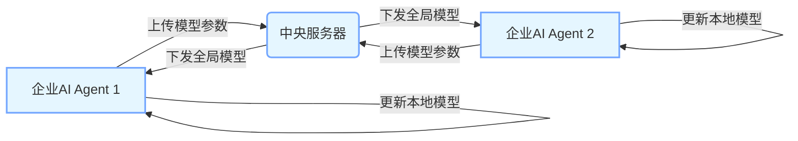

# 企业AI Agent的联邦学习应用：数据隐私保护

> 关键词：企业AI Agent、联邦学习、数据隐私保护、分布式学习、安全计算

> 摘要：本文深入探讨了企业AI Agent在联邦学习中的应用以及如何实现数据隐私保护。随着企业对数据隐私重视程度的不断提高，联邦学习作为一种新兴的分布式机器学习技术，为解决数据隐私问题提供了有效的途径。文章首先介绍了相关背景，包括目的、预期读者、文档结构和术语表。接着阐述了核心概念与联系，通过文本示意图和Mermaid流程图进行清晰展示。详细讲解了核心算法原理，并给出Python源代码示例。同时，对数学模型和公式进行了推导和举例说明。在项目实战部分，介绍了开发环境搭建、源代码实现和代码解读。还分析了实际应用场景，推荐了学习资源、开发工具框架和相关论文著作。最后总结了未来发展趋势与挑战，并给出常见问题解答和扩展阅读参考资料，旨在为企业在利用AI Agent进行联邦学习时保障数据隐私提供全面的技术指导。

## 1. 背景介绍 
### 1.1 目的和范围
随着数字化时代的发展，企业积累了大量的数据。这些数据不仅是企业的重要资产，也是推动AI发展的关键因素。然而，数据隐私问题日益成为企业面临的重大挑战。一方面，法律法规对数据隐私保护的要求越来越严格；另一方面，企业也担心数据泄露可能带来的商业风险。联邦学习作为一种新兴的机器学习技术，允许在不共享原始数据的情况下进行模型训练，为解决数据隐私问题提供了新的思路。

本文的目的是探讨企业AI Agent在联邦学习中的应用，以及如何通过联邦学习实现数据隐私保护。具体范围包括联邦学习的核心概念、算法原理、数学模型、项目实战、实际应用场景、工具和资源推荐等方面。

### 1.2 预期读者
本文的预期读者包括企业的技术决策者、数据科学家、AI工程师、安全专家以及对数据隐私保护和联邦学习感兴趣的研究人员。通过阅读本文，读者可以了解联邦学习的基本原理和应用场景，掌握在企业中应用AI Agent进行联邦学习的技术方法，以及如何保障数据隐私安全。

### 1.3 文档结构概述
本文的结构如下：
1. 背景介绍：介绍文章的目的、预期读者、文档结构和术语表。
2. 核心概念与联系：阐述企业AI Agent、联邦学习和数据隐私保护的核心概念，以及它们之间的联系，并通过文本示意图和Mermaid流程图进行展示。
3. 核心算法原理 & 具体操作步骤：详细讲解联邦学习的核心算法原理，并给出Python源代码示例。
4. 数学模型和公式 & 详细讲解 & 举例说明：推导联邦学习的数学模型和公式，并通过具体例子进行说明。
5. 项目实战：代码实际案例和详细解释说明：介绍开发环境搭建、源代码实现和代码解读。
6. 实际应用场景：分析企业AI Agent在联邦学习中的实际应用场景。
7. 工具和资源推荐：推荐学习资源、开发工具框架和相关论文著作。
8. 总结：未来发展趋势与挑战：总结联邦学习的未来发展趋势和面临的挑战。
9. 附录：常见问题与解答：解答读者在学习和应用联邦学习过程中常见的问题。
10. 扩展阅读 & 参考资料：提供扩展阅读的建议和参考资料。

### 1.4 术语表
#### 1.4.1 核心术语定义
- **企业AI Agent**：企业中具有自主学习和决策能力的智能代理，能够代表企业进行数据处理和模型训练。
- **联邦学习**：一种分布式机器学习技术，允许在不共享原始数据的情况下进行模型训练，通过在本地设备上训练模型并交换模型参数来实现全局模型的优化。
- **数据隐私保护**：采取一系列技术和管理措施，确保数据在收集、存储、使用和传输过程中的安全性和保密性，防止数据泄露和滥用。
- **模型参数**：机器学习模型中的可训练参数，如神经网络中的权重和偏置。
- **全局模型**：通过联邦学习算法整合各个本地模型参数得到的最终模型。

#### 1.4.2 相关概念解释
- **分布式学习**：将学习任务分布到多个设备或节点上进行，以提高学习效率和处理能力。
- **安全多方计算**：一种密码学技术，允许在不泄露各自输入数据的情况下进行联合计算。
- **差分隐私**：一种数据隐私保护技术，通过在数据中添加噪声来保护数据的隐私性。

#### 1.4.3 缩略词列表
- **FL**：联邦学习（Federated Learning）
- **SGD**：随机梯度下降（Stochastic Gradient Descent）
- **DP**：差分隐私（Differential Privacy）

## 2. 核心概念与联系 
### 核心概念原理
#### 企业AI Agent
企业AI Agent是企业中具有自主学习和决策能力的智能代理。它可以代表企业进行数据处理、模型训练和决策制定。企业AI Agent可以根据企业的需求和目标，自主地从各种数据源中收集数据，并进行分析和处理。它还可以利用机器学习算法对数据进行学习和建模，以提高企业的决策效率和竞争力。

#### 联邦学习
联邦学习是一种分布式机器学习技术，它允许在不共享原始数据的情况下进行模型训练。在联邦学习中，各个参与方（如企业、机构或设备）在本地设备上训练模型，并将模型参数上传到中央服务器。中央服务器对这些参数进行聚合，得到全局模型，并将全局模型下发到各个参与方。各个参与方再根据全局模型更新本地模型，如此反复迭代，直到全局模型收敛。

#### 数据隐私保护
数据隐私保护是指采取一系列技术和管理措施，确保数据在收集、存储、使用和传输过程中的安全性和保密性。在联邦学习中，数据隐私保护尤为重要，因为各个参与方不希望自己的原始数据被泄露。常见的数据隐私保护技术包括安全多方计算、差分隐私等。

### 架构的文本示意图
```plaintext
+----------------------+        +----------------------+
|  企业AI Agent 1      |        |  企业AI Agent 2      |
|                      |        |                      |
|  本地数据           |        |  本地数据           |
|  本地模型训练       |        |  本地模型训练       |
|  上传模型参数       |        |  上传模型参数       |
+----------------------+        +----------------------+
              |                             |
              |                             |
              v                             v
+------------------------------------------------+
|                 中央服务器                   |
|                                              |
|  接收模型参数                               |
|  聚合模型参数得到全局模型                   |
|  下发全局模型                               |
+------------------------------------------------+
              |
              |
              v
+----------------------+        +----------------------+
|  企业AI Agent 1      |        |  企业AI Agent 2      |
|                      |        |                      |
|  接收全局模型       |        |  接收全局模型       |
|  更新本地模型       |        |  更新本地模型       |
+----------------------+        +----------------------+
```

### Mermaid流程图


## 3. 核心算法原理 & 具体操作步骤 
### 联邦平均算法（Federated Averaging, FedAvg）原理
联邦平均算法是联邦学习中最常用的算法之一，其核心思想是通过在本地设备上进行多次迭代训练，然后将本地模型参数上传到中央服务器进行聚合，得到全局模型。具体步骤如下：

1. **初始化全局模型**：中央服务器初始化一个全局模型，其参数为 $\theta^0$。
2. **选择参与方**：中央服务器从所有参与方中随机选择一部分参与方，记为 $S$。
3. **下发全局模型**：中央服务器将全局模型 $\theta^t$ 下发到参与方 $i \in S$。
4. **本地模型训练**：参与方 $i$ 在本地数据集 $D_i$ 上使用随机梯度下降（SGD）算法对本地模型进行 $E$ 轮迭代训练，得到本地模型参数 $\theta_i^{t+1}$。
5. **上传模型参数**：参与方 $i$ 将本地模型参数 $\theta_i^{t+1}$ 上传到中央服务器。
6. **聚合模型参数**：中央服务器根据参与方的本地数据集大小 $n_i$ 对模型参数进行加权平均，得到全局模型参数 $\theta^{t+1}$：
$$\theta^{t+1} = \sum_{i \in S} \frac{n_i}{N} \theta_i^{t+1}$$
其中，$N = \sum_{i \in S} n_i$ 是所有参与方的本地数据集大小之和。
7. **重复步骤2-6**：直到全局模型收敛。

### Python源代码示例
```python
import numpy as np
import torch
import torch.nn as nn
import torch.optim as optim

# 定义一个简单的神经网络模型
class SimpleNet(nn.Module):
    def __init__(self):
        super(SimpleNet, self).__init__()
        self.fc1 = nn.Linear(10, 20)
        self.fc2 = nn.Linear(20, 1)

    def forward(self, x):
        x = torch.relu(self.fc1(x))
        x = self.fc2(x)
        return x

# 模拟本地数据集
def generate_local_data(num_samples):
    X = torch.randn(num_samples, 10)
    y = torch.randn(num_samples, 1)
    return X, y

# 本地模型训练
def local_train(model, X, y, num_epochs, lr):
    criterion = nn.MSELoss()
    optimizer = optim.SGD(model.parameters(), lr=lr)
    for epoch in range(num_epochs):
        outputs = model(X)
        loss = criterion(outputs, y)
        optimizer.zero_grad()
        loss.backward()
        optimizer.step()
    return model.state_dict()

# 全局模型聚合
def aggregate_models(local_models, data_sizes):
    total_size = sum(data_sizes)
    global_model = {}
    for key in local_models[0].keys():
        global_model[key] = torch.zeros_like(local_models[0][key])
        for i, model in enumerate(local_models):
            global_model[key] += (data_sizes[i] / total_size) * model[key]
    return global_model

# 联邦学习主函数
def federated_learning(num_clients, num_epochs, local_epochs, lr):
    # 初始化全局模型
    global_model = SimpleNet()
    global_params = global_model.state_dict()

    for epoch in range(num_epochs):
        local_models = []
        data_sizes = []
        # 模拟选择参与方
        for i in range(num_clients):
            # 生成本地数据集
            num_samples = np.random.randint(100, 200)
            X, y = generate_local_data(num_samples)
            # 复制全局模型到本地
            local_model = SimpleNet()
            local_model.load_state_dict(global_params)
            # 本地模型训练
            local_params = local_train(local_model, X, y, local_epochs, lr)
            local_models.append(local_params)
            data_sizes.append(num_samples)

        # 聚合模型参数
        global_params = aggregate_models(local_models, data_sizes)
        # 更新全局模型
        global_model.load_state_dict(global_params)

    return global_model

# 运行联邦学习
num_clients = 3
num_epochs = 10
local_epochs = 5
lr = 0.01
final_model = federated_learning(num_clients, num_epochs, local_epochs, lr)
print("Final global model:", final_model)
```

### 具体操作步骤
1. **定义模型**：定义一个简单的神经网络模型 `SimpleNet`。
2. **生成本地数据集**：使用 `generate_local_data` 函数生成模拟的本地数据集。
3. **本地模型训练**：使用 `local_train` 函数在本地数据集上对本地模型进行训练。
4. **全局模型聚合**：使用 `aggregate_models` 函数对各个参与方的本地模型参数进行聚合，得到全局模型参数。
5. **联邦学习主循环**：在 `federated_learning` 函数中，重复进行本地模型训练和全局模型聚合，直到达到指定的迭代次数。

## 4. 数学模型和公式 & 详细讲解 & 举例说明 
### 损失函数
在联邦学习中，通常使用损失函数来衡量模型的性能。常见的损失函数包括均方误差损失（MSE）、交叉熵损失（Cross Entropy Loss）等。以均方误差损失为例，其定义如下：
$$L(\theta) = \frac{1}{n} \sum_{i=1}^{n} (y_i - f(x_i; \theta))^2$$
其中，$n$ 是数据集的样本数量，$x_i$ 是第 $i$ 个样本的输入，$y_i$ 是第 $i$ 个样本的真实标签，$f(x_i; \theta)$ 是模型在输入 $x_i$ 下的预测输出，$\theta$ 是模型的参数。

### 随机梯度下降（SGD）
随机梯度下降是一种常用的优化算法，用于最小化损失函数。其更新公式如下：
$$\theta_{t+1} = \theta_t - \eta \nabla L(\theta_t; x_j, y_j)$$
其中，$\theta_t$ 是第 $t$ 次迭代的模型参数，$\eta$ 是学习率，$\nabla L(\theta_t; x_j, y_j)$ 是损失函数在样本 $(x_j, y_j)$ 上的梯度。

### 联邦平均算法的数学推导
在联邦平均算法中，全局模型参数的更新公式为：
$$\theta^{t+1} = \sum_{i \in S} \frac{n_i}{N} \theta_i^{t+1}$$
其中，$\theta^{t+1}$ 是第 $t+1$ 次迭代的全局模型参数，$\theta_i^{t+1}$ 是第 $i$ 个参与方在第 $t+1$ 次迭代的本地模型参数，$n_i$ 是第 $i$ 个参与方的本地数据集大小，$N = \sum_{i \in S} n_i$ 是所有参与方的本地数据集大小之和。

### 举例说明
假设有两个参与方 $A$ 和 $B$，其本地数据集大小分别为 $n_A = 100$ 和 $n_B = 200$。在某一次迭代中，参与方 $A$ 的本地模型参数为 $\theta_A = [1, 2, 3]$，参与方 $B$ 的本地模型参数为 $\theta_B = [4, 5, 6]$。则全局模型参数的更新如下：
$$N = n_A + n_B = 100 + 200 = 300$$
$$\theta = \frac{n_A}{N} \theta_A + \frac{n_B}{N} \theta_B = \frac{100}{300} [1, 2, 3] + \frac{200}{300} [4, 5, 6] = [\frac{1}{3} + \frac{8}{3}, \frac{2}{3} + \frac{10}{3}, \frac{3}{3} + \frac{12}{3}] = [3, 4, 5]$$

## 5. 项目实战：代码实际案例和详细解释说明 
### 5.1  开发环境搭建
#### 安装Python
首先，确保你已经安装了Python 3.x 版本。可以从Python官方网站（https://www.python.org/downloads/） 下载并安装。

#### 安装必要的库
使用以下命令安装必要的Python库：
```bash
pip install torch numpy
```
其中，`torch` 是PyTorch深度学习框架，`numpy` 是用于科学计算的库。

### 5.2  源代码详细实现和代码解读
以下是完整的源代码：
```python
import numpy as np
import torch
import torch.nn as nn
import torch.optim as optim

# 定义一个简单的神经网络模型
class SimpleNet(nn.Module):
    def __init__(self):
        super(SimpleNet, self).__init__()
        self.fc1 = nn.Linear(10, 20)
        self.fc2 = nn.Linear(20, 1)

    def forward(self, x):
        x = torch.relu(self.fc1(x))
        x = self.fc2(x)
        return x

# 模拟本地数据集
def generate_local_data(num_samples):
    X = torch.randn(num_samples, 10)
    y = torch.randn(num_samples, 1)
    return X, y

# 本地模型训练
def local_train(model, X, y, num_epochs, lr):
    criterion = nn.MSELoss()
    optimizer = optim.SGD(model.parameters(), lr=lr)
    for epoch in range(num_epochs):
        outputs = model(X)
        loss = criterion(outputs, y)
        optimizer.zero_grad()
        loss.backward()
        optimizer.step()
    return model.state_dict()

# 全局模型聚合
def aggregate_models(local_models, data_sizes):
    total_size = sum(data_sizes)
    global_model = {}
    for key in local_models[0].keys():
        global_model[key] = torch.zeros_like(local_models[0][key])
        for i, model in enumerate(local_models):
            global_model[key] += (data_sizes[i] / total_size) * model[key]
    return global_model

# 联邦学习主函数
def federated_learning(num_clients, num_epochs, local_epochs, lr):
    # 初始化全局模型
    global_model = SimpleNet()
    global_params = global_model.state_dict()

    for epoch in range(num_epochs):
        local_models = []
        data_sizes = []
        # 模拟选择参与方
        for i in range(num_clients):
            # 生成本地数据集
            num_samples = np.random.randint(100, 200)
            X, y = generate_local_data(num_samples)
            # 复制全局模型到本地
            local_model = SimpleNet()
            local_model.load_state_dict(global_params)
            # 本地模型训练
            local_params = local_train(local_model, X, y, local_epochs, lr)
            local_models.append(local_params)
            data_sizes.append(num_samples)

        # 聚合模型参数
        global_params = aggregate_models(local_models, data_sizes)
        # 更新全局模型
        global_model.load_state_dict(global_params)

    return global_model

# 运行联邦学习
num_clients = 3
num_epochs = 10
local_epochs = 5
lr = 0.01
final_model = federated_learning(num_clients, num_epochs, local_epochs, lr)
print("Final global model:", final_model)
```

### 代码解读
1. **定义模型**：`SimpleNet` 类定义了一个简单的两层全连接神经网络模型。
2. **生成本地数据集**：`generate_local_data` 函数生成模拟的本地数据集，输入是样本数量，输出是输入特征 `X` 和标签 `y`。
3. **本地模型训练**：`local_train` 函数在本地数据集上对本地模型进行训练，使用均方误差损失函数和随机梯度下降优化算法。
4. **全局模型聚合**：`aggregate_models` 函数对各个参与方的本地模型参数进行加权平均，得到全局模型参数。
5. **联邦学习主函数**：`federated_learning` 函数实现了联邦学习的主循环，包括选择参与方、下发全局模型、本地模型训练、上传模型参数和聚合模型参数等步骤。
6. **运行联邦学习**：设置参与方数量、迭代次数、本地训练轮数和学习率，调用 `federated_learning` 函数进行联邦学习，并输出最终的全局模型。

### 5.3  代码解读与分析
#### 优点
- **数据隐私保护**：通过在本地设备上进行模型训练，避免了原始数据的共享，保护了数据隐私。
- **分布式计算**：利用多个参与方的计算资源，提高了模型训练的效率。
- **可扩展性**：可以方便地增加参与方的数量，扩展联邦学习系统的规模。

#### 缺点
- **通信开销**：需要频繁地在参与方和中央服务器之间传输模型参数，增加了通信开销。
- **模型收敛速度**：由于各个参与方的本地数据集可能存在差异，模型的收敛速度可能较慢。

#### 改进建议
- **减少通信开销**：可以采用压缩模型参数、减少上传频率等方法来减少通信开销。
- **提高模型收敛速度**：可以采用自适应学习率、模型平均等方法来提高模型的收敛速度。

## 6. 实际应用场景 
### 金融行业
在金融行业，不同银行或金融机构拥有大量的客户数据，但由于数据隐私和竞争的原因，这些数据不能直接共享。通过联邦学习，金融机构可以在不共享原始数据的情况下进行联合建模，例如信用评分模型、风险评估模型等。这样既可以保护客户数据的隐私，又可以提高模型的准确性和泛化能力。

### 医疗行业
医疗数据包含了患者的敏感信息，如病历、诊断结果等，数据隐私保护至关重要。在医疗行业，不同医院或医疗机构可以通过联邦学习进行联合研究，例如疾病预测模型、药物研发等。通过联邦学习，医疗机构可以在不共享患者原始数据的情况下进行模型训练，从而推动医疗领域的发展。

### 物联网行业
在物联网行业，大量的设备产生了海量的数据。这些设备通常具有不同的计算能力和数据分布。通过联邦学习，物联网设备可以在本地进行模型训练，并将模型参数上传到中央服务器进行聚合。这样可以减少数据传输的开销，提高模型的训练效率，同时保护设备数据的隐私。

### 广告行业
在广告行业，不同的广告平台拥有大量的用户数据。通过联邦学习，广告平台可以在不共享用户原始数据的情况下进行联合建模，例如用户画像模型、广告投放模型等。这样可以提高广告投放的精准度，同时保护用户数据的隐私。

## 7. 工具和资源推荐
### 7.1 学习资源推荐
#### 7.1.1 书籍推荐
- 《深度学习》（Deep Learning）：由Ian Goodfellow、Yoshua Bengio和Aaron Courville合著，是深度学习领域的经典教材。
- 《联邦学习》（Federated Learning）：由杨强、刘洋等著，系统介绍了联邦学习的基本原理、算法和应用。

#### 7.1.2 在线课程
- Coursera上的“深度学习专项课程”（Deep Learning Specialization）：由Andrew Ng教授授课，涵盖了深度学习的各个方面。
- edX上的“联邦学习基础”（Foundations of Federated Learning）：由加州大学伯克利分校的教授授课，介绍了联邦学习的基本概念和算法。

#### 7.1.3 技术博客和网站
- Google AI Blog：发布了许多关于联邦学习的研究成果和应用案例。
- 联邦学习社区（https://federatedlearning.cn/）：提供了联邦学习的相关资料、论文和开源项目。

### 7.2 开发工具框架推荐
#### 7.2.1 IDE和编辑器
- PyCharm：是一款专门为Python开发设计的集成开发环境，具有强大的代码编辑、调试和分析功能。
- Jupyter Notebook：是一个交互式的笔记本环境，适合进行数据探索和模型开发。

#### 7.2.2 调试和性能分析工具
- TensorBoard：是TensorFlow提供的可视化工具，可以用于监控模型训练过程、可视化模型结构和分析性能指标。
- PyTorch Profiler：是PyTorch提供的性能分析工具，可以用于分析模型的运行时间和内存使用情况。

#### 7.2.3 相关框架和库
- TensorFlow Federated：是Google开发的联邦学习框架，提供了丰富的API和工具，方便用户进行联邦学习的开发和实验。
- PySyft：是OpenMined开发的隐私保护深度学习框架，支持联邦学习、差分隐私等技术。

### 7.3 相关论文著作推荐
#### 7.3.1 经典论文
- 《Communication-Efficient Learning of Deep Networks from Decentralized Data》：首次提出了联邦平均算法（FedAvg），是联邦学习领域的经典论文。
- 《Differential Privacy: A Survey of Results》：对差分隐私技术进行了全面的综述，介绍了差分隐私的基本概念、算法和应用。

#### 7.3.2 最新研究成果
- 《Adaptive Federated Optimization》：提出了一种自适应联邦优化算法，能够在不同参与方的数据分布差异较大的情况下提高模型的收敛速度。
- 《Federated Learning with Non-IID Data》：研究了在非独立同分布（Non-IID）数据下的联邦学习问题，提出了一些解决方案。

#### 7.3.3 应用案例分析
- 《Federated Learning in Healthcare: A Systematic Review》：对联邦学习在医疗行业的应用进行了系统的综述，分析了联邦学习在医疗数据隐私保护和联合建模方面的优势和挑战。
- 《Federated Learning for Internet of Things: A Survey》：对联邦学习在物联网行业的应用进行了综述，介绍了联邦学习在物联网设备数据隐私保护和模型训练方面的应用案例。

## 8. 总结：未来发展趋势与挑战
### 未来发展趋势
- **跨行业应用**：联邦学习将在更多的行业得到应用，如教育、交通、能源等，推动各行业的数字化转型和智能化发展。
- **与其他技术融合**：联邦学习将与区块链、物联网、人工智能等技术深度融合，形成更加安全、高效、智能的解决方案。
- **标准化和规范化**：随着联邦学习的广泛应用，相关的标准和规范将逐渐完善，促进联邦学习技术的健康发展。

### 挑战
- **数据异质性**：不同参与方的数据可能存在分布差异和特征差异，这会影响模型的收敛速度和性能。需要研究更加有效的算法和策略来解决数据异质性问题。
- **安全和隐私**：虽然联邦学习在一定程度上保护了数据隐私，但仍然面临着安全攻击的风险，如模型窃取、数据泄露等。需要加强安全和隐私保护技术的研究和应用。
- **通信开销**：联邦学习需要频繁地在参与方和中央服务器之间传输模型参数，增加了通信开销。需要研究更加高效的通信协议和算法来减少通信开销。

## 9. 附录：常见问题与解答
### 问题1：联邦学习和传统机器学习有什么区别？
联邦学习和传统机器学习的主要区别在于数据的使用方式。在传统机器学习中，所有的数据都集中在一个地方进行模型训练；而在联邦学习中，数据分散在各个参与方的本地设备上，通过交换模型参数来实现全局模型的训练，避免了原始数据的共享，保护了数据隐私。

### 问题2：联邦学习是否能够完全保护数据隐私？
联邦学习在一定程度上保护了数据隐私，但不能完全保证数据的安全性。虽然原始数据不会被共享，但模型参数的传输和聚合过程仍然可能存在安全风险，如模型窃取、数据泄露等。因此，需要结合其他安全技术，如差分隐私、安全多方计算等，来进一步加强数据隐私保护。

### 问题3：联邦学习的性能如何？
联邦学习的性能受到多种因素的影响，如数据分布、参与方数量、通信开销等。在数据分布较为均匀、参与方数量适中的情况下，联邦学习可以达到与传统机器学习相近的性能。但在数据分布差异较大、参与方数量较多的情况下，模型的收敛速度和性能可能会受到影响。

### 问题4：如何选择适合的联邦学习算法？
选择适合的联邦学习算法需要考虑多个因素，如数据分布、参与方数量、通信开销、模型复杂度等。常见的联邦学习算法包括联邦平均算法（FedAvg）、联邦随机梯度下降算法（FedSGD）等。在实际应用中，可以根据具体情况选择合适的算法，并进行实验和评估。

## 10. 扩展阅读 & 参考资料
### 扩展阅读
- 《区块链与隐私保护》：深入介绍了区块链技术在数据隐私保护方面的应用。
- 《人工智能安全》：探讨了人工智能领域的安全问题和解决方案。

### 参考资料
- 《Federated Learning: Challenges, Methods, and Future Directions》
- 《Privacy-Preserving Machine Learning: A Survey》
- 《The Algorithmic Foundations of Differential Privacy》

作者：AI天才研究院/AI Genius Institute & 禅与计算机程序设计艺术 /Zen And The Art of Computer Programming