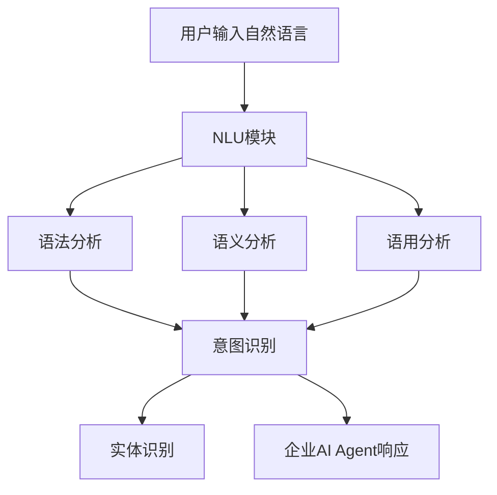

# 企业AI Agent的自然语言理解(NLU)技术深化

> 关键词：企业AI Agent、自然语言理解(NLU)、技术深化、语义分析、意图识别

> 摘要：本文围绕企业AI Agent的自然语言理解(NLU)技术深化展开，深入探讨了NLU技术的核心概念、算法原理、数学模型等内容。通过项目实战案例详细展示了如何在实际开发中运用NLU技术，分析了其实际应用场景。同时，推荐了相关的学习资源、开发工具和论文著作。最后对NLU技术的未来发展趋势与挑战进行总结，并给出常见问题的解答及扩展阅读和参考资料，旨在帮助读者全面深入地了解企业AI Agent中NLU技术的深化内容。

## 1. 背景介绍 
### 1.1 目的和范围
随着企业数字化转型的加速，企业AI Agent在客户服务、智能办公等多个领域发挥着越来越重要的作用。自然语言理解(NLU)作为企业AI Agent的关键技术之一，其性能直接影响到AI Agent与用户交互的效果和质量。本文的目的在于深入探讨企业AI Agent的自然语言理解(NLU)技术的深化内容，包括核心概念、算法原理、数学模型等，范围涵盖了从理论到实践的各个方面，旨在为企业开发和应用更智能的AI Agent提供技术支持和指导。

### 1.2 预期读者
本文预期读者包括从事人工智能、自然语言处理相关领域的研究人员、开发人员，企业中负责AI Agent项目的技术管理人员，以及对企业AI Agent和自然语言理解技术感兴趣的爱好者。

### 1.3 文档结构概述
本文首先介绍NLU技术的背景信息，包括目的、预期读者和文档结构概述等。接着阐述NLU技术的核心概念与联系，通过文本示意图和Mermaid流程图进行详细说明。然后讲解核心算法原理和具体操作步骤，并使用Python源代码进行阐述。之后介绍数学模型和公式，并通过举例说明加深理解。再通过项目实战展示代码实际案例和详细解释说明。随后分析实际应用场景，推荐相关的工具和资源。最后总结未来发展趋势与挑战，给出常见问题与解答以及扩展阅读和参考资料。

### 1.4 术语表
#### 1.4.1 核心术语定义
- **企业AI Agent**：指在企业环境中应用的人工智能代理，能够自动执行各种任务，与用户进行交互，辅助企业决策和业务流程。
- **自然语言理解(NLU)**：是自然语言处理的一个重要分支，旨在让计算机理解人类语言的含义，包括语义、语法、语用等方面。
- **意图识别**：从用户的自然语言输入中识别出用户的真实意图，例如查询信息、请求服务等。
- **实体识别**：识别文本中具有特定意义的实体，如人名、地名、组织机构名等。
- **语义分析**：对文本的语义信息进行分析，理解文本所表达的含义。

#### 1.4.2 相关概念解释
- **自然语言处理(NLP)**：是人工智能领域的一个重要方向，研究如何让计算机处理和理解人类语言，包括自然语言理解、自然语言生成等多个方面。
- **深度学习**：是一种基于人工神经网络的机器学习方法，在自然语言处理领域取得了显著的成果，常用于NLU任务。
- **词向量**：将词语表示为低维向量的形式，使得计算机能够更好地处理和理解词语之间的语义关系。

#### 1.4.3 缩略词列表
- **NLU**：自然语言理解(Natural Language Understanding)
- **NLP**：自然语言处理(Natural Language Processing)
- **AI**：人工智能(Artificial Intelligence)

## 2. 核心概念与联系 

### 自然语言理解(NLU)的核心概念原理
自然语言理解的核心目标是让计算机能够像人类一样理解自然语言的含义。它主要涉及以下几个方面：
- **语法分析**：分析句子的语法结构，确定词语之间的语法关系，例如主谓宾等。
- **语义分析**：理解文本的语义信息，包括词语的含义、句子的逻辑关系等。
- **语用分析**：考虑语言使用的上下文和语境，理解用户的真实意图。

### 企业AI Agent与NLU的联系
企业AI Agent需要通过NLU技术来理解用户的自然语言输入，从而能够准确地响应用户的请求，提供相应的服务和支持。NLU技术是企业AI Agent实现智能交互的基础。

### 文本示意图
```plaintext
企业AI Agent
    |
    |-- NLU模块
        |
        |-- 语法分析
        |-- 语义分析
        |-- 语用分析
        |-- 意图识别
        |-- 实体识别
```

### Mermaid流程图


## 3. 核心算法原理 & 具体操作步骤 

### 基于深度学习的意图识别算法原理
深度学习在自然语言理解中得到了广泛应用，其中一种常见的方法是使用循环神经网络(RNN)及其变体，如长短期记忆网络(LSTM)或门控循环单元(GRU)。这些网络能够处理序列数据，非常适合处理自然语言文本。

下面是一个使用Python和Keras库实现的简单的基于LSTM的意图识别模型的示例代码：

```python
import numpy as np
from keras.preprocessing.text import Tokenizer
from keras.preprocessing.sequence import pad_sequences
from keras.models import Sequential
from keras.layers import Embedding, LSTM, Dense

# 示例数据
texts = ["我想查询天气", "帮我预订酒店", "给我推荐一部电影"]
labels = ["查询天气", "预订酒店", "推荐电影"]

# 分词
tokenizer = Tokenizer()
tokenizer.fit_on_texts(texts)
sequences = tokenizer.texts_to_sequences(texts)

# 填充序列
max_length = max([len(seq) for seq in sequences])
padded_sequences = pad_sequences(sequences, maxlen=max_length)

# 标签编码
label_mapping = {label: index for index, label in enumerate(set(labels))}
encoded_labels = [label_mapping[label] for label in labels]
encoded_labels = np.array(encoded_labels)

# 构建模型
model = Sequential()
model.add(Embedding(input_dim=len(tokenizer.word_index) + 1, output_dim=100, input_length=max_length))
model.add(LSTM(100))
model.add(Dense(len(set(labels)), activation='softmax'))

# 编译模型
model.compile(optimizer='adam', loss='sparse_categorical_crossentropy', metrics=['accuracy'])

# 训练模型
model.fit(padded_sequences, encoded_labels, epochs=10, batch_size=1)

# 预测
new_text = ["我想知道明天的天气"]
new_sequence = tokenizer.texts_to_sequences(new_text)
new_padded_sequence = pad_sequences(new_sequence, maxlen=max_length)
prediction = model.predict(new_padded_sequence)
predicted_label_index = np.argmax(prediction)
reverse_label_mapping = {index: label for label, index in label_mapping.items()}
predicted_label = reverse_label_mapping[predicted_label_index]
print("预测的意图标签是:", predicted_label)
```

### 具体操作步骤
1. **数据准备**：收集和整理用于训练的自然语言文本数据，并对其进行标注，确定每个文本的意图标签。
2. **数据预处理**：对文本数据进行分词、填充等操作，将其转换为适合模型输入的格式。
3. **模型构建**：选择合适的深度学习模型，如LSTM，构建意图识别模型。
4. **模型训练**：使用预处理后的数据对模型进行训练，调整模型的参数。
5. **模型评估**：使用测试数据对训练好的模型进行评估，检查模型的性能。
6. **模型预测**：使用训练好的模型对新的自然语言文本进行意图识别。

## 4. 数学模型和公式 & 详细讲解 & 举例说明 

### 词向量的数学模型
词向量是将词语表示为低维向量的形式，常见的词向量模型有Word2Vec和GloVe。以Word2Vec为例，其基于神经网络的模型结构主要有两种：连续词袋模型(CBOW)和跳字模型(Skip-gram)。

#### 连续词袋模型(CBOW)
CBOW模型的目标是根据上下文词语预测中心词语。假设输入的上下文词语的词向量分别为 $\mathbf{w}_1, \mathbf{w}_2, \cdots, \mathbf{w}_n$，中心词语的词向量为 $\mathbf{w}_c$，则CBOW模型的数学公式如下：

$$\mathbf{h} = \frac{1}{n} \sum_{i=1}^{n} \mathbf{w}_i$$

$$\mathbf{u} = \mathbf{W}' \mathbf{h}$$

$$\mathbf{y} = \text{softmax}(\mathbf{u})$$

其中，$\mathbf{h}$ 是上下文词语的平均词向量，$\mathbf{W}'$ 是隐藏层到输出层的权重矩阵，$\mathbf{u}$ 是输出层的未归一化分数，$\mathbf{y}$ 是输出层的概率分布。

#### 跳字模型(Skip-gram)
跳字模型的目标是根据中心词语预测上下文词语。假设中心词语的词向量为 $\mathbf{w}_c$，上下文词语的词向量分别为 $\mathbf{w}_1, \mathbf{w}_2, \cdots, \mathbf{w}_n$，则跳字模型的数学公式如下：

$$\mathbf{u} = \mathbf{W}' \mathbf{w}_c$$

$$\mathbf{y} = \text{softmax}(\mathbf{u})$$

其中，$\mathbf{W}'$ 是隐藏层到输出层的权重矩阵，$\mathbf{u}$ 是输出层的未归一化分数，$\mathbf{y}$ 是输出层的概率分布。

### 举例说明
假设我们有一个文本句子：“我喜欢吃苹果”，使用Word2Vec模型训练得到词向量。如果我们使用CBOW模型，以“喜欢”为中心词语，“我”和“吃”为上下文词语，那么首先计算上下文词语的平均词向量 $\mathbf{h}$，然后通过权重矩阵 $\mathbf{W}'$ 得到输出层的未归一化分数 $\mathbf{u}$，最后通过softmax函数得到输出层的概率分布 $\mathbf{y}$，预测出中心词语“喜欢”。

## 5. 项目实战：代码实际案例和详细解释说明 

### 5.1  开发环境搭建
- **Python环境**：建议使用Python 3.6及以上版本。
- **深度学习框架**：选择Keras或PyTorch，本文示例使用Keras。
- **相关库**：安装numpy、pandas、scikit-learn等常用库。

### 5.2  源代码详细实现和代码解读
以下是一个更完整的基于Keras的企业AI Agent NLU意图识别项目的代码示例：

```python
import numpy as np
from keras.preprocessing.text import Tokenizer
from keras.preprocessing.sequence import pad_sequences
from keras.models import Sequential
from keras.layers import Embedding, LSTM, Dense
from sklearn.model_selection import train_test_split

# 示例数据
texts = ["我想查询天气", "帮我预订酒店", "给我推荐一部电影", "我想知道明天的温度", "预订今晚的酒店"]
labels = ["查询天气", "预订酒店", "推荐电影", "查询天气", "预订酒店"]

# 分词
tokenizer = Tokenizer()
tokenizer.fit_on_texts(texts)
sequences = tokenizer.texts_to_sequences(texts)

# 填充序列
max_length = max([len(seq) for seq in sequences])
padded_sequences = pad_sequences(sequences, maxlen=max_length)

# 标签编码
label_mapping = {label: index for index, label in enumerate(set(labels))}
encoded_labels = [label_mapping[label] for label in labels]
encoded_labels = np.array(encoded_labels)

# 划分训练集和测试集
X_train, X_test, y_train, y_test = train_test_split(padded_sequences, encoded_labels, test_size=0.2, random_state=42)

# 构建模型
model = Sequential()
model.add(Embedding(input_dim=len(tokenizer.word_index) + 1, output_dim=100, input_length=max_length))
model.add(LSTM(100))
model.add(Dense(len(set(labels)), activation='softmax'))

# 编译模型
model.compile(optimizer='adam', loss='sparse_categorical_crossentropy', metrics=['accuracy'])

# 训练模型
model.fit(X_train, y_train, epochs=10, batch_size=1, validation_data=(X_test, y_test))

# 预测
new_text = ["我想预订明天的酒店"]
new_sequence = tokenizer.texts_to_sequences(new_text)
new_padded_sequence = pad_sequences(new_sequence, maxlen=max_length)
prediction = model.predict(new_padded_sequence)
predicted_label_index = np.argmax(prediction)
reverse_label_mapping = {index: label for label, index in label_mapping.items()}
predicted_label = reverse_label_mapping[predicted_label_index]
print("预测的意图标签是:", predicted_label)
```

### 5.3  代码解读与分析
1. **数据准备**：定义了示例文本数据和对应的意图标签，使用 `Tokenizer` 对文本进行分词处理，将文本转换为序列。
2. **数据预处理**：使用 `pad_sequences` 对序列进行填充，使其长度一致。对标签进行编码，将标签转换为数字形式。
3. **数据集划分**：使用 `train_test_split` 函数将数据集划分为训练集和测试集。
4. **模型构建**：构建一个基于LSTM的深度学习模型，包括嵌入层、LSTM层和全连接层。
5. **模型编译**：使用 `adam` 优化器和 `sparse_categorical_crossentropy` 损失函数编译模型。
6. **模型训练**：使用训练集对模型进行训练，并在验证集上进行验证。
7. **模型预测**：对新的文本进行意图识别，输出预测的意图标签。

## 6. 实际应用场景 
### 客户服务
企业AI Agent可以在客户服务中使用NLU技术，理解客户的问题和需求，自动回答常见问题，提供相关的解决方案，提高客户服务效率和质量。

### 智能办公
在智能办公场景中，AI Agent可以理解员工的自然语言指令，如安排会议、查询文档等，辅助员工完成日常工作任务，提高办公效率。

### 营销推广
通过NLU技术，AI Agent可以分析客户的自然语言反馈，了解客户的兴趣和需求，为企业的营销推广提供数据支持，制定更精准的营销策略。

### 数据分析与决策支持
AI Agent可以理解自然语言形式的数据分析需求，从大量的数据中提取相关信息，为企业的决策提供支持。

## 7. 工具和资源推荐
### 7.1 学习资源推荐
#### 7.1.1 书籍推荐
- 《自然语言处理入门》：适合初学者，介绍了自然语言处理的基本概念和方法。
- 《深度学习》：深度学习领域的经典著作，详细介绍了深度学习的理论和应用。
- 《Python自然语言处理》：结合Python语言，介绍了自然语言处理的实践方法。

#### 7.1.2 在线课程
- Coursera上的“Natural Language Processing Specialization”：由知名教授授课，系统地介绍了自然语言处理的相关知识。
- edX上的“Introduction to Natural Language Processing”：提供了丰富的学习资源和实践项目。

#### 7.1.3 技术博客和网站
- 机器之心：提供人工智能领域的最新技术和研究成果。
- 开源中国：有很多关于自然语言处理的技术文章和开源项目。

### 7.2 开发工具框架推荐
#### 7.2.1 IDE和编辑器
- PyCharm：功能强大的Python集成开发环境，适合开发自然语言处理项目。
- Jupyter Notebook：交互式的开发环境，方便进行数据探索和模型实验。

#### 7.2.2 调试和性能分析工具
- TensorBoard：用于可视化深度学习模型的训练过程和性能指标。
- cProfile：Python内置的性能分析工具，用于分析代码的性能瓶颈。

#### 7.2.3 相关框架和库
- Keras：简单易用的深度学习框架，适合快速搭建自然语言处理模型。
- PyTorch：灵活高效的深度学习框架，在自然语言处理领域有广泛应用。
- NLTK：自然语言处理工具包，提供了丰富的语料库和处理工具。

### 7.3 相关论文著作推荐
#### 7.3.1 经典论文
- “Efficient Estimation of Word Representations in Vector Space”：介绍了Word2Vec模型的原理和实现。
- “Attention Is All You Need”：提出了Transformer模型，在自然语言处理领域取得了巨大成功。

#### 7.3.2 最新研究成果
- 关注ACL（Association for Computational Linguistics）等自然语言处理领域的顶级会议，获取最新的研究成果。

#### 7.3.3 应用案例分析
- 一些企业和研究机构发布的关于企业AI Agent NLU技术应用的案例分析报告，了解实际应用中的经验和教训。

## 8. 总结：未来发展趋势与挑战
### 未来发展趋势
- **多模态融合**：将自然语言