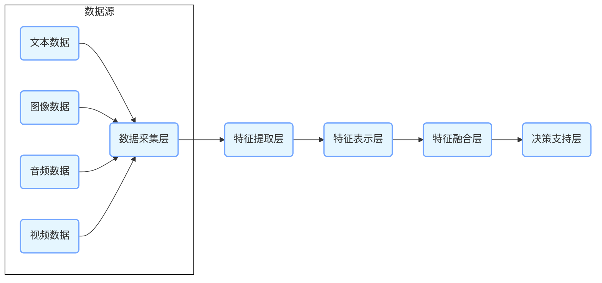

# 企业AI Agent的跨模态学习：融合非结构化数据的决策支持

> 关键词：企业AI Agent、跨模态学习、非结构化数据、决策支持、融合技术

> 摘要：本文聚焦于企业AI Agent的跨模态学习，旨在探讨如何融合非结构化数据以实现有效的决策支持。首先介绍了相关背景，包括研究目的、预期读者等。接着详细阐述了核心概念与联系，通过文本示意图和Mermaid流程图进行直观展示。深入讲解了核心算法原理，并给出Python源代码示例。同时，对涉及的数学模型和公式进行了详细说明和举例。在项目实战部分，提供了开发环境搭建、源代码实现及解读。分析了实际应用场景，推荐了学习资源、开发工具框架和相关论文著作。最后总结了未来发展趋势与挑战，给出常见问题解答和扩展阅读参考资料，为企业利用AI Agent进行跨模态学习和决策支持提供全面的技术指导。

## 1. 背景介绍 
### 1.1 目的和范围
在当今数字化时代，企业面临着海量的数据，其中很大一部分是非结构化数据，如文本、图像、音频和视频等。这些非结构化数据蕴含着丰富的信息，但传统的数据分析方法难以充分挖掘其价值。企业AI Agent的跨模态学习旨在通过融合不同模态的非结构化数据，为企业决策提供更全面、准确的支持。本文章的范围涵盖了跨模态学习的基本概念、核心算法、数学模型、实际应用以及相关的工具和资源，旨在帮助企业更好地理解和应用这一技术。

### 1.2 预期读者
本文预期读者包括企业的技术决策者、数据科学家、AI开发者以及对企业数字化转型和AI应用感兴趣的研究人员。对于技术决策者，本文可以帮助他们了解跨模态学习在企业决策中的潜在价值和应用场景；对于数据科学家和AI开发者，本文提供了详细的技术原理和实现方法，可作为实际项目开发的参考；对于研究人员，本文可以激发他们对相关领域的进一步研究。

### 1.3 文档结构概述
本文将按照以下结构进行组织：首先介绍核心概念与联系，通过文本示意图和Mermaid流程图展示跨模态学习的原理和架构；接着详细讲解核心算法原理，并给出Python源代码示例；然后介绍相关的数学模型和公式，并进行详细说明和举例；在项目实战部分，提供开发环境搭建、源代码实现及解读；分析实际应用场景；推荐学习资源、开发工具框架和相关论文著作；最后总结未来发展趋势与挑战，给出常见问题解答和扩展阅读参考资料。

### 1.4 术语表
#### 1.4.1 核心术语定义
- **企业AI Agent**：是一种能够在企业环境中自主执行任务、与环境交互并做出决策的人工智能系统。它可以集成多种技术，如机器学习、自然语言处理等，以实现特定的业务目标。
- **跨模态学习**：指的是同时处理和分析多种不同模态的数据，如文本、图像、音频等，以获取更全面的信息和知识。通过跨模态学习，可以发现不同模态数据之间的关联和互补性。
- **非结构化数据**：是指没有固定结构和格式的数据，如自由文本、图像、音频和视频等。与结构化数据（如数据库中的表格数据）相比，非结构化数据的处理和分析更加复杂。
- **决策支持**：是指利用数据分析和模型为企业决策提供信息和建议的过程。通过融合非结构化数据的跨模态学习，可以为企业决策提供更丰富、准确的依据。

#### 1.4.2 相关概念解释
- **模态**：在数据处理中，模态是指数据的不同表现形式，如文本、图像、音频和视频等。不同的模态具有不同的特征和信息表示方式。
- **特征提取**：是指从原始数据中提取出具有代表性的特征的过程。在跨模态学习中，需要对不同模态的数据进行特征提取，以便后续的融合和分析。
- **数据融合**：是指将来自不同数据源或模态的数据进行整合和处理，以获取更全面、准确的信息。在企业AI Agent的跨模态学习中，数据融合是关键步骤之一。

#### 1.4.3 缩略词列表
- **AI**：Artificial Intelligence，人工智能
- **NLP**：Natural Language Processing，自然语言处理
- **CV**：Computer Vision，计算机视觉
- **ML**：Machine Learning，机器学习

## 2. 核心概念与联系 

### 核心概念原理
企业AI Agent的跨模态学习主要基于以下原理：不同模态的数据包含了关于同一对象或事件的不同方面的信息，通过融合这些信息，可以获得更全面、准确的理解。例如，在产品推荐系统中，文本数据可以描述产品的功能和特点，图像数据可以展示产品的外观，音频数据可以介绍产品的使用方法。通过跨模态学习，可以将这些不同模态的数据进行融合，从而为用户提供更个性化、准确的推荐。

跨模态学习的核心步骤包括特征提取、特征表示和特征融合。首先，需要对不同模态的数据进行特征提取，将原始数据转换为具有代表性的特征向量。然后，对这些特征向量进行表示学习，使其能够在同一空间中进行比较和融合。最后，通过特征融合算法将不同模态的特征向量进行整合，得到最终的跨模态表示。

### 架构的文本示意图
企业AI Agent的跨模态学习架构主要包括以下几个部分：
1. **数据采集层**：负责收集不同模态的非结构化数据，如文本、图像、音频和视频等。这些数据可以来自企业内部的数据库、文件系统，也可以来自外部的数据源，如社交媒体、新闻网站等。
2. **特征提取层**：对采集到的不同模态的数据进行特征提取。对于文本数据，可以使用词嵌入、主题模型等方法进行特征提取；对于图像数据，可以使用卷积神经网络（CNN）进行特征提取；对于音频数据，可以使用音频特征提取算法，如MFCC（Mel Frequency Cepstral Coefficients）进行特征提取。
3. **特征表示层**：将提取到的不同模态的特征向量进行表示学习，使其能够在同一空间中进行比较和融合。常用的方法包括跨模态哈希、跨模态嵌入等。
4. **特征融合层**：将不同模态的特征向量进行融合，得到最终的跨模态表示。常用的融合方法包括早期融合、晚期融合和混合融合等。
5. **决策支持层**：根据融合后的跨模态表示，为企业决策提供支持。可以使用机器学习算法，如分类器、回归器等，进行决策分析。

### Mermaid流程图


## 3. 核心算法原理 & 具体操作步骤 

### 核心算法原理
在企业AI Agent的跨模态学习中，常用的核心算法包括卷积神经网络（CNN）、循环神经网络（RNN）、Transformer等。下面以文本和图像的跨模态学习为例，介绍核心算法的原理。

#### 卷积神经网络（CNN）
CNN是一种专门用于处理图像数据的深度学习模型。它通过卷积层、池化层和全连接层等组件，自动提取图像的特征。在跨模态学习中，CNN可以用于图像的特征提取。

#### 循环神经网络（RNN）
RNN是一种用于处理序列数据的深度学习模型。它通过循环结构，能够捕捉序列数据中的时序信息。在跨模态学习中，RNN可以用于文本的特征提取。

#### Transformer
Transformer是一种基于注意力机制的深度学习模型，它在自然语言处理和计算机视觉等领域取得了很好的效果。在跨模态学习中，Transformer可以用于跨模态的特征表示和融合。

### 具体操作步骤
以下是一个简单的文本和图像跨模态学习的Python代码示例：

```python
import torch
import torch.nn as nn
import torchvision.models as models
from transformers import BertModel, BertTokenizer

# 图像特征提取模型
class ImageFeatureExtractor(nn.Module):
    def __init__(self):
        super(ImageFeatureExtractor, self).__init__()
        self.resnet = models.resnet18(pretrained=True)
        self.resnet.fc = nn.Identity()  # 移除最后一层全连接层

    def forward(self, images):
        features = self.resnet(images)
        return features

# 文本特征提取模型
class TextFeatureExtractor(nn.Module):
    def __init__(self):
        super(TextFeatureExtractor, self).__init__()
        self.bert = BertModel.from_pretrained('bert-base-uncased')

    def forward(self, input_ids, attention_mask):
        outputs = self.bert(input_ids=input_ids, attention_mask=attention_mask)
        pooled_output = outputs.pooler_output
        return pooled_output

# 跨模态融合模型
class CrossModalFusionModel(nn.Module):
    def __init__(self):
        super(CrossModalFusionModel, self).__init__()
        self.image_extractor = ImageFeatureExtractor()
        self.text_extractor = TextFeatureExtractor()
        self.fc = nn.Linear(512 + 768, 1)  # 假设图像特征维度为512，文本特征维度为768

    def forward(self, images, input_ids, attention_mask):
        image_features = self.image_extractor(images)
        text_features = self.text_extractor(input_ids, attention_mask)
        combined_features = torch.cat((image_features, text_features), dim=1)
        output = self.fc(combined_features)
        return output

# 示例数据
images = torch.randn(4, 3, 224, 224)  # 4张图像，3通道，224x224尺寸
tokenizer = BertTokenizer.from_pretrained('bert-base-uncased')
texts = ["This is a sample text", "Another sample text"]
inputs = tokenizer(texts, return_tensors='pt', padding=True, truncation=True)
input_ids = inputs['input_ids']
attention_mask = inputs['attention_mask']

# 初始化模型
model = CrossModalFusionModel()

# 前向传播
output = model(images, input_ids, attention_mask)
print(output.shape)
```

### 代码解释
1. **ImageFeatureExtractor类**：使用预训练的ResNet-18模型提取图像特征，移除最后一层全连接层以获取中间特征。
2. **TextFeatureExtractor类**：使用预训练的BERT模型提取文本特征，获取池化后的输出。
3. **CrossModalFusionModel类**：将图像特征和文本特征进行拼接，然后通过一个全连接层进行融合。
4. **示例数据**：生成随机图像数据和示例文本数据，并使用BERT分词器进行处理。
5. **前向传播**：将图像和文本数据输入到跨模态融合模型中，得到最终的输出。

## 4. 数学模型和公式 & 详细讲解 & 举例说明 

### 特征提取的数学模型
#### 图像特征提取
在卷积神经网络（CNN）中，卷积层的数学模型可以表示为：
$$
y_{i,j}^l = f\left(\sum_{m=0}^{M-1}\sum_{n=0}^{N-1}x_{i+m,j+n}^{l-1}w_{m,n}^l + b^l\right)
$$
其中，$y_{i,j}^l$ 是第 $l$ 层卷积层的输出特征图中第 $(i,j)$ 位置的值，$x_{i+m,j+n}^{l-1}$ 是第 $l-1$ 层输入特征图中第 $(i+m,j+n)$ 位置的值，$w_{m,n}^l$ 是第 $l$ 层卷积核中第 $(m,n)$ 位置的权重，$b^l$ 是第 $l$ 层的偏置，$f$ 是激活函数，如ReLU。

#### 文本特征提取
在循环神经网络（RNN）中，隐藏状态的更新公式可以表示为：
$$
h_t = f\left(W_{hh}h_{t-1} + W_{xh}x_t + b_h\right)
$$
其中，$h_t$ 是时刻 $t$ 的隐藏状态，$h_{t-1}$ 是时刻 $t-1$ 的隐藏状态，$x_t$ 是时刻 $t$ 的输入，$W_{hh}$ 和 $W_{xh}$ 是权重矩阵，$b_h$ 是偏置，$f$ 是激活函数，如tanh。

### 特征表示的数学模型
在跨模态嵌入中，通常使用一个映射函数将不同模态的特征映射到同一空间。假设 $x^v$ 是图像特征，$x^t$ 是文本特征，映射函数可以表示为：
$$
z^v = g^v\left(x^v\right)
$$
$$
z^t = g^t\left(x^t\right)
$$
其中，$z^v$ 和 $z^t$ 分别是图像和文本在同一空间中的特征表示，$g^v$ 和 $g^t$ 是映射函数。

### 特征融合的数学模型
#### 早期融合
早期融合是在特征提取之前将不同模态的数据进行融合。假设 $x^v$ 是图像数据，$x^t$ 是文本数据，早期融合可以表示为：
$$
x = \left[x^v; x^t\right]
$$
其中，$x$ 是融合后的数据。

#### 晚期融合
晚期融合是在特征提取之后将不同模态的特征进行融合。假设 $z^v$ 是图像特征，$z^t$ 是文本特征，晚期融合可以表示为：
$$
z = \left[z^v; z^t\right]
$$
其中，$z$ 是融合后的特征。

### 举例说明
假设我们有一张图像和一段文本描述，图像的特征向量为 $x^v = [0.1, 0.2, 0.3]$，文本的特征向量为 $x^t = [0.4, 0.5, 0.6]$。

#### 早期融合
早期融合后的数据为 $x = [0.1, 0.2, 0.3, 0.4, 0.5, 0.6]$。

#### 晚期融合
晚期融合后的数据为 $z = [0.1, 0.2, 0.3, 0.4, 0.5, 0.6]$。

## 5. 项目实战：代码实际案例和详细解释说明 

### 5.1  开发环境搭建
#### 操作系统
建议使用Linux系统，如Ubuntu 18.04或更高版本，因为Linux系统在深度学习开发中具有良好的兼容性和稳定性。

#### Python环境
安装Python 3.7或更高版本。可以使用Anaconda来管理Python环境，创建一个新的虚拟环境：
```bash
conda create -n cross_modal python=3.8
conda activate cross_modal
```

#### 深度学习框架
安装PyTorch和相关库：
```bash
pip install torch torchvision torchaudio
```

#### 自然语言处理库
安装Transformers库：
```bash
pip install transformers
```

### 5.2  源代码详细实现和代码解读
以下是一个完整的企业AI Agent跨模态学习项目的源代码示例，用于图像和文本的分类任务：

```python
import torch
import torch.nn as nn
import torch.optim as optim
import torchvision.models as models
from transformers import BertModel, BertTokenizer
from torch.utils.data import Dataset, DataLoader
import pandas as pd
import numpy as np
from PIL import Image

# 自定义数据集类
class CrossModalDataset(Dataset):
    def __init__(self, csv_file, root_dir, transform=None):
        self.data_frame = pd.read_csv(csv_file)
        self.root_dir = root_dir
        self.transform = transform
        self.tokenizer = BertTokenizer.from_pretrained('bert-base-uncased')

    def __len__(self):
        return len(self.data_frame)

    def __getitem__(self, idx):
        if torch.is_tensor(idx):
            idx = idx.tolist()

        img_name = self.data_frame.iloc[idx, 0]
        image_path = f"{self.root_dir}/{img_name}"
        image = Image.open(image_path).convert('RGB')

        text = self.data_frame.iloc[idx, 1]
        label = self.data_frame.iloc[idx, 2]

        if self.transform:
            image = self.transform(image)

        inputs = self.tokenizer(text, return_tensors='pt', padding=True, truncation=True)
        input_ids = inputs['input_ids'].squeeze()
        attention_mask = inputs['attention_mask'].squeeze()

        return image, input_ids, attention_mask, torch.tensor(label, dtype=torch.long)

# 图像特征提取模型
class ImageFeatureExtractor(nn.Module):
    def __init__(self):
        super(ImageFeatureExtractor, self).__init__()
        self.resnet = models.resnet18(pretrained=True)
        self.resnet.fc = nn.Identity()

    def forward(self, images):
        features = self.resnet(images)
        return features

# 文本特征提取模型
class TextFeatureExtractor(nn.Module):
    def __init__(self):
        super(TextFeatureExtractor, self).__init__()
        self.bert = BertModel.from_pretrained('bert-base-uncased')

    def forward(self, input_ids, attention_mask):
        outputs = self.bert(input_ids=input_ids, attention_mask=attention_mask)
        pooled_output = outputs.pooler_output
        return pooled_output

# 跨模态融合模型
class CrossModalFusionModel(nn.Module):
    def __init__(self, num_classes):
        super(CrossModalFusionModel, self).__init__()
        self.image_extractor = ImageFeatureExtractor()
        self.text_extractor = TextFeatureExtractor()
        self.fc = nn.Linear(512 + 768, num_classes)

    def forward(self, images, input_ids, attention_mask):
        image_features = self.image_extractor(images)
        text_features = self.text_extractor(input_ids, attention_mask)
        combined_features = torch.cat((image_features, text_features), dim=1)
        output = self.fc(combined_features)
        return output

# 训练模型
def train_model(model, train_loader, criterion, optimizer, device, epochs):
    model.train()
    for epoch in range(epochs):
        running_loss = 0.0
        for images, input_ids, attention_mask, labels in train_loader:
            images = images.to(device)
            input_ids = input_ids.to(device)
            attention_mask = attention_mask.to(device)
            labels = labels.to(device)

            optimizer.zero_grad()

            outputs = model(images, input_ids, attention_mask)
            loss = criterion(outputs, labels)
            loss.backward()
            optimizer.step()

            running_loss += loss.item()

        print(f'Epoch {epoch + 1}/{epochs}, Loss: {running_loss / len(train_loader)}')

# 测试模型
def test_model(model, test_loader, device):
    model.eval()
    correct = 0
    total = 0
    with torch.no_grad():
        for images, input_ids, attention_mask, labels in test_loader:
            images = images.to(device)
            input_ids = input_ids.to(device)
            attention_mask = attention_mask.to(device)
            labels = labels.to(device)

            outputs = model(images, input_ids, attention_mask)
            _, predicted = torch.max(outputs.data, 1)
            total += labels.size(0)
            correct += (predicted == labels).sum().item()

    print(f'Accuracy: {100 * correct / total}%')

# 主函数
if __name__ == "__main__":
    # 数据路径
    csv_file = 'data.csv'
    root_dir = 'images'

    # 数据预处理
    from torchvision import transforms
    transform = transforms.Compose([
        transforms.Resize((224, 224)),
        transforms.ToTensor(),
        transforms.Normalize(mean=[0.485, 0.456, 0.406], std=[0.229, 0.224, 0.225])
    ])

    # 创建数据集和数据加载器
    dataset = CrossModalDataset(csv_file, root_dir, transform=transform)
    train_size = int(0.8 * len(dataset))
    test_size = len(dataset) - train_size
    train_dataset, test_dataset = torch.utils.data.random_split(dataset, [train_size, test_size])

    train_loader = DataLoader(train_dataset, batch_size=4, shuffle=True)
    test_loader = DataLoader(test_dataset, batch_size=4, shuffle=False)

    # 设备设置
    device = torch.device("cuda" if torch.cuda.is_available() else "cpu")

    # 初始化模型
    num_classes = 2
    model = CrossModalFusionModel(num_classes).to(device)

    # 定义损失函数和优化器
    criterion = nn.CrossEntropyLoss()
    optimizer = optim.Adam(model.parameters(), lr=0.001)

    # 训练模型
    epochs = 10
    train_model(model, train_loader, criterion, optimizer, device, epochs)

    # 测试模型
    test_model(model, test_loader, device)
```

### 5.3  代码解读与分析
#### 自定义数据集类 `CrossModalDataset`
- 用于加载图像和文本数据，并进行预处理。
- `__len__` 方法返回数据集的长度。
- `__getitem__` 方法根据索引返回图像、文本输入、注意力掩码和标签。

#### 图像特征提取模型 `ImageFeatureExtractor`
- 使用预训练的ResNet-18模型提取图像特征。

#### 文本特征提取模型 `TextFeatureExtractor`
- 使用预训练的BERT模型提取文本特征。

#### 跨模态融合模型 `CrossModalFusionModel`
- 将图像特征和文本特征进行拼接，然后通过一个全连接层进行分类。

#### 训练函数 `train_model`
- 定义了模型的训练过程，包括前向传播、损失计算、反向传播和参数更新。

#### 测试函数 `test_model`
- 定义了模型的测试过程，计算模型的准确率。

#### 主函数
- 加载数据、创建数据加载器、初始化模型、定义损失函数和优化器，然后进行训练和测试。

## 6. 实际应用场景 
### 产品推荐
在电子商务领域，企业可以利用AI Agent的跨模态学习技术，融合产品的图像、文本描述和用户的浏览历史等非结构化数据，为用户提供更个性化、准确的产品推荐。例如，通过分析产品的图像可以了解产品的外观和款式，通过分析文本描述可以了解产品的功能和特点，结合用户的浏览历史可以了解用户的兴趣和偏好，从而为用户推荐符合其需求的产品。

### 客户服务
在客户服务领域，企业可以利用跨模态学习技术，融合客户的语音、文本和图像等非结构化数据，提高客户服务的效率和质量。例如，通过分析客户的语音可以了解客户的情绪和需求，通过分析文本可以了解客户的问题和反馈，通过分析图像可以了解客户提供的相关资料，从而为客户提供更准确、及时的解决方案。

### 风险评估
在金融领域，企业可以利用跨模态学习技术，融合企业的财务报表、新闻报道和社交媒体数据等非结构化数据，进行风险评估。例如，通过分析财务报表可以了解企业的财务状况，通过分析新闻报道可以了解企业的市场动态和声誉，通过分析社交媒体数据可以了解公众对企业的看法和评价，从而更全面、准确地评估企业的风险。

### 智能安防
在安防领域，企业可以利用跨模态学习技术，融合监控视频、音频和传感器数据等非结构化数据，实现智能安防。例如，通过分析监控视频可以了解人员的行为和活动，通过分析音频可以了解环境的声音和异常情况，通过分析传感器数据可以了解环境的温度、湿度等信息，从而及时发现安全隐患并采取相应的措施。

## 7. 工具和资源推荐
### 7.1 学习资源推荐
#### 7.1.1 书籍推荐
- 《深度学习》（Deep Learning）：由Ian Goodfellow、Yoshua Bengio和Aaron Courville撰写，是深度学习领域的经典教材，涵盖了深度学习的基本概念、算法和应用。
- 《Python深度学习》（Deep Learning with Python）：由Francois Chollet撰写，介绍了如何使用Python和Keras库进行深度学习开发，适合初学者。
- 《自然语言处理入门》（Natural Language Processing in Action）：由Hobson Lane、Cole Howard和 Hannes Hapke撰写，介绍了自然语言处理的基本概念、算法和应用。

#### 7.1.2 在线课程
- Coursera上的“深度学习专项课程”（Deep Learning Specialization）：由Andrew Ng教授授课，包括深度学习的基础、卷积神经网络、循环神经网络等内容。
- edX上的“人工智能导论”（Introduction to Artificial Intelligence）：由MIT教授授课，介绍了人工智能的基本概念、算法和应用。
- Kaggle上的“深度学习微课程”（Deep Learning Micro-Course）：提供了深度学习的实践教程和案例分析。

#### 7.1.3 技术博客和网站
- Medium上的Towards Data Science：提供了大量关于数据科学、机器学习和深度学习的文章和教程。
- AI科技评论：专注于人工智能领域的技术动态和研究成果，提供了很多有价值的文章和分析。
- 机器之心：关注人工智能领域的前沿技术和应用案例，提供了丰富的资讯和解读。

### 7.2 开发工具框架推荐
#### 7.2.1 IDE和编辑器
- PyCharm：是一款专门为Python开发设计的集成开发环境，提供了丰富的功能和插件，适合Python开发者。
- Jupyter Notebook：是一种交互式的开发环境，支持Python、R等多种编程语言，适合数据探索和模型开发。
- Visual Studio Code：是一款轻量级的代码编辑器，支持多种编程语言和插件，适合快速开发和调试。

#### 7.2.2 调试和性能分析工具
- PyTorch Profiler：是PyTorch官方提供的性能分析工具，可以帮助开发者分析模型的性能瓶颈和资源消耗。
- TensorBoard：是TensorFlow官方提供的可视化工具，可以帮助开发者可视化模型的训练过程和性能指标。
- NVIDIA Nsight Systems：是NVIDIA提供的性能分析工具，适合GPU加速的深度学习模型的性能分析。

#### 7.2.3 相关框架和库
- PyTorch：是一个开源的深度学习框架，提供了丰富的神经网络层和优化算法，支持GPU加速。
- TensorFlow：是另一个开源的深度学习框架，提供了高级的深度学习API和分布式训练支持。
- Transformers：是Hugging Face开发的自然语言处理库，提供了大量预训练的模型和工具，方便进行自然语言处理任务。

### 7.3 相关论文著作推荐
#### 7.3.1 经典论文
- “Attention Is All You Need”：提出了Transformer模型，是自然语言处理领域的重要突破。
- “ImageNet Classification with Deep Convolutional Neural Networks”：提出了AlexNet模型，开创了深度学习在计算机视觉领域的应用。
- “Long Short-Term Memory”：提出了LSTM模型，解决了循环神经网络中的梯度消失问题。

#### 7.3.2 最新研究成果
- “CLIP: Connecting Text and Images”：提出了CLIP模型，实现了文本和图像的跨模态学习。
- “DALL-E 2: Creating Images from Text”：介绍了DALL-E 2模型，实现了从文本生成图像的功能。
- “GPT-3: Language Models are Few-Shot Learners”：介绍了GPT-3模型，展示了大规模语言模型在自然语言处理任务中的强大能力。

#### 7.3.3 应用案例分析
- “Cross-Modal Retrieval with Deep Learning: A Survey”：对跨模态检索领域的深度学习方法进行了综述和分析。
- “Multimodal Machine Learning: A Survey and Taxonomy”：对多模态机器学习领域进行了全面的综述和分类。
- “Applications of Multimodal Deep Learning in Healthcare”：介绍了多模态深度学习在医疗保健领域的应用案例和研究进展。

## 8. 总结：未来发展趋势与挑战
### 未来发展趋势
#### 多模态融合的深度和广度将不断增加
未来，企业AI Agent的跨模态学习将不仅仅局限于文本、图像和音频等常见模态，还将融合更多的模态，如视频、传感器数据等。同时，跨模态融合的方法也将不断创新，从简单的特征拼接和融合发展到更复杂的深度融合和协同学习。

#### 与知识图谱的结合将更加紧密
知识图谱可以为跨模态学习提供丰富的语义信息和知识支持。未来，企业AI Agent将更多地结合知识图谱，利用知识图谱中的实体关系和语义信息，提高跨模态学习的效果和可解释性。

#### 应用场景将不断拓展
随着技术的不断发展，企业AI Agent的跨模态学习将在更多的领域得到应用，如智能交通、智能制造、智能教育等。通过融合不同模态的数据，为这些领域的决策和管理提供更全面、准确的支持。

### 挑战
#### 数据标注和预处理的难度较大
非结构化数据的标注和预处理是跨模态学习的关键步骤，但由于非结构化数据的多样性和复杂性，数据标注和预处理的难度较大。需要开发更高效、准确的数据标注和预处理方法。

#### 计算资源和时间成本较高
跨模态学习需要处理大量的非结构化数据，计算资源和时间成本较高。需要开发更高效的算法和模型，优化计算资源的使用，降低时间成本。

#### 模型的可解释性和鲁棒性有待提高
跨模态学习模型通常比较复杂，模型的可解释性和鲁棒性有待提高。需要开发更可解释、鲁棒的跨模态学习模型，提高模型的可靠性和可信度。

## 9. 附录：常见问题与解答
### 跨模态学习和单模态学习有什么区别？
单模态学习只处理一种模态的数据，如只处理文本数据或只处理图像数据。而跨模态学习同时处理多种不同模态的数据，通过融合不同模态的数据，可以获得更全面、准确的信息和知识。

### 如何选择合适的特征提取方法？
选择合适的特征提取方法需要考虑数据的模态、特点和任务的需求。对于图像数据，可以使用卷积神经网络（CNN）进行特征提取；对于文本数据，可以使用词嵌入、主题模型或预训练的语言模型进行特征提取；对于音频数据，可以使用音频特征提取算法，如MFCC进行特征提取。

### 跨模态学习的融合方法有哪些？
常见的跨模态学习融合方法包括早期融合、晚期融合和混合融合。早期融合是在特征提取之前将不同模态的数据进行融合；晚期融合是在特征提取之后将不同模态的特征进行融合；混合融合是将早期融合和晚期融合相结合。

### 如何评估跨模态学习模型的性能？
可以使用多种指标来评估跨模态学习模型的性能，如准确率、召回率、F1值、均方误差等。具体选择哪种指标需要根据任务的类型和需求来确定。

## 10. 扩展阅读 & 参考资料
### 扩展阅读
- 《人工智能：现代方法》（Artificial Intelligence: A Modern Approach）：全面介绍了人工智能的基本概念、算法和应用，是人工智能领域的经典教材。
- 《计算机视觉：算法与应用》（Computer Vision: Algorithms and Applications）：介绍了计算机视觉的基本概念、算法和应用，适合计算机视觉领域的研究者和开发者。
- 《自然语言处理：理论与实践》（Natural Language Processing: Theory and Practice）：介绍了自然语言处理的基本概念、算法和应用，适合自然语言处理领域的研究者和开发者。

### 参考资料
- Goodfellow, I., Bengio, Y., & Courville, A. (2016). Deep Learning. MIT Press.
- Chollet, F. (2017). Deep Learning with Python. Manning Publications.
- Lane, H., Howard, C., & Hapke, H. (2019). Natural Language Processing in Action. Manning Publications.
- Vaswani, A., Shazeer, N., Parmar, N., Uszkoreit, J., Jones, L., Gomez, A. N.,... & Polosukhin, I. (2017). Attention is all you need. Advances in neural information processing systems, 5998-6008.
- Krizhevsky, A., Sutskever, I., & Hinton, G. E. (2012). ImageNet classification with deep convolutional neural networks. Advances in neural information processing systems, 1097-1105.
- Hochreiter, S., & Schmidhuber, J. (1997). Long short-term memory. Neural computation, 9(8), 1735-1780.

作者：AI天才研究院/AI Genius Institute & 禅与计算机程序设计艺术 /Zen And The Art of Computer Programming