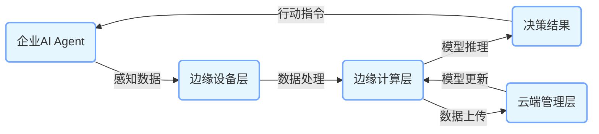

# 企业AI Agent的边缘智能部署策略

> 关键词：企业AI Agent、边缘智能、部署策略、人工智能、边缘计算

> 摘要：本文聚焦于企业AI Agent的边缘智能部署策略。首先介绍了相关背景，包括目的范围、预期读者等。接着阐述了核心概念与联系，剖析了企业AI Agent和边缘智能的原理及架构，并给出相应的文本示意图和Mermaid流程图。详细讲解了核心算法原理和具体操作步骤，通过Python源代码进行说明。探讨了相关的数学模型和公式，并举例说明。通过项目实战展示了代码的实际案例和详细解释。分析了实际应用场景，推荐了相关的工具和资源，包括学习资源、开发工具框架以及论文著作等。最后总结了未来发展趋势与挑战，提供了常见问题与解答以及扩展阅读和参考资料，旨在为企业在AI Agent边缘智能部署方面提供全面且深入的指导。

## 1. 背景介绍 
### 1.1 目的和范围
随着人工智能技术的飞速发展，企业AI Agent在各个领域得到了广泛应用。边缘智能作为一种新兴的计算模式，将计算和数据存储靠近数据源，能够有效减少数据传输延迟、提高系统响应速度和隐私性。本文的目的在于探讨企业AI Agent在边缘智能环境下的部署策略，涵盖从核心概念的理解、算法原理的分析、实际项目的应用到未来发展趋势的展望等多个方面。通过全面的研究，为企业提供一套可行的边缘智能部署方案，帮助企业更好地利用AI Agent提升业务效率和竞争力。

### 1.2 预期读者
本文预期读者主要包括企业的技术管理人员、AI开发工程师、边缘计算领域的研究人员以及对企业数字化转型和人工智能应用感兴趣的专业人士。对于技术管理人员，本文可以帮助他们了解边缘智能部署策略的整体框架和关键要点，以便做出合理的决策；对于AI开发工程师，提供了具体的算法原理和代码实现，有助于他们在实际项目中进行开发和优化；对于研究人员，为进一步的学术研究提供了有价值的参考；而对于对相关领域感兴趣的专业人士，则可以作为入门学习和了解的资料。

### 1.3 文档结构概述
本文共分为十个部分。第一部分为背景介绍，阐述了文章的目的、预期读者和文档结构，以及相关术语的定义。第二部分介绍核心概念与联系，包括企业AI Agent和边缘智能的原理、架构，并给出直观的示意图和流程图。第三部分详细讲解核心算法原理和具体操作步骤，通过Python代码进行说明。第四部分探讨数学模型和公式，并举例说明其应用。第五部分通过项目实战，展示代码的实际案例和详细解释。第六部分分析企业AI Agent边缘智能部署的实际应用场景。第七部分推荐相关的工具和资源，包括学习资源、开发工具框架和论文著作。第八部分总结未来发展趋势与挑战。第九部分为附录，提供常见问题与解答。第十部分列出扩展阅读和参考资料。

### 1.4 术语表
#### 1.4.1 核心术语定义
- **企业AI Agent**：指在企业环境中运行的人工智能代理，它能够感知环境信息，根据预设的目标和规则进行决策，并采取相应的行动来完成任务。可以是软件程序，也可以与硬件设备结合，实现自动化的业务流程和决策支持。
- **边缘智能**：将人工智能技术与边缘计算相结合，在靠近数据源的边缘设备上进行数据处理和智能分析，减少数据传输到云端的需求，从而提高系统的响应速度、降低延迟，并增强数据的隐私性和安全性。
- **部署策略**：为了实现特定的目标，在边缘智能环境下将企业AI Agent进行合理配置和安排的一系列方法和步骤，包括设备选择、算法优化、网络连接等方面的决策。

#### 1.4.2 相关概念解释
- **边缘计算**：一种分布式计算范式，将计算和数据存储靠近数据源，如传感器、物联网设备等。与传统的云计算相比，边缘计算可以减少数据传输延迟，提高系统的实时性和可靠性。
- **人工智能**：研究如何使计算机系统能够模拟人类智能的学科，包括机器学习、深度学习、自然语言处理等多个领域。企业AI Agent通常基于人工智能技术实现其智能决策和行动能力。
- **数据隐私和安全**：在边缘智能部署中，由于数据在边缘设备上进行处理，需要特别关注数据的隐私和安全问题。确保数据不被泄露、篡改，保护企业和用户的敏感信息。

#### 1.4.3 缩略词列表
- **AI**：Artificial Intelligence，人工智能
- **IoT**：Internet of Things，物联网
- **ML**：Machine Learning，机器学习
- **DL**：Deep Learning，深度学习
- **GPU**：Graphics Processing Unit，图形处理单元

## 2. 核心概念与联系 

### 企业AI Agent原理与架构
企业AI Agent的核心是具备感知、决策和行动的能力。其原理基于人工智能算法，通过对环境信息的感知，利用机器学习或深度学习模型进行数据分析和决策推理，最终采取相应的行动。

企业AI Agent的架构通常包括以下几个部分：
1. **感知模块**：负责收集环境信息，如传感器数据、网络数据等。可以通过各种传感器设备、API接口等获取数据。
2. **决策模块**：对感知模块收集到的数据进行分析和处理，利用预训练的模型或实时学习算法进行决策推理。常见的决策算法包括强化学习、规则引擎等。
3. **行动模块**：根据决策模块的结果，采取相应的行动。行动可以是控制设备、发送消息、执行任务等。

以下是企业AI Agent架构的文本示意图：

```plaintext
+-------------------+
|   感知模块        |
| (收集环境信息)    |
+-------------------+
         |
         v
+-------------------+
|   决策模块        |
| (数据分析与决策)  |
+-------------------+
         |
         v
+-------------------+
|   行动模块        |
| (执行决策行动)    |
+-------------------+
```

### 边缘智能原理与架构
边缘智能的核心思想是将智能计算能力下沉到边缘设备，减少数据传输到云端的需求。其原理基于边缘计算和人工智能技术的结合，在边缘设备上部署轻量级的人工智能模型，实现实时的数据处理和分析。

边缘智能的架构通常包括以下几个层次：
1. **边缘设备层**：包括各种传感器、物联网设备、边缘服务器等，负责数据的采集和初步处理。
2. **边缘计算层**：在边缘设备上运行的计算平台，提供计算资源和服务，如模型推理、数据存储等。
3. **云端管理层**：负责对边缘设备和模型进行管理和监控，提供模型更新、配置管理等服务。

以下是边缘智能架构的文本示意图：

```plaintext
+-------------------+
|   云端管理层      |
| (模型管理与监控)  |
+-------------------+
         |
         v
+-------------------+
|   边缘计算层      |
| (本地计算服务)    |
+-------------------+
         |
         v
+-------------------+
|   边缘设备层      |
| (数据采集与处理)  |
+-------------------+
```

### 企业AI Agent与边缘智能的联系
企业AI Agent与边缘智能有着密切的联系。边缘智能为企业AI Agent提供了更高效的运行环境，通过在边缘设备上进行数据处理和模型推理，减少了数据传输延迟，提高了系统的响应速度。同时，企业AI Agent的智能决策和行动能力可以更好地适应边缘环境的动态变化，实现更精准的控制和管理。

以下是企业AI Agent与边缘智能联系的Mermaid流程图：



## 3. 核心算法原理 & 具体操作步骤 

### 核心算法原理
在企业AI Agent的边缘智能部署中，常用的核心算法包括机器学习算法和深度学习算法。以下以强化学习算法为例，介绍其原理。

强化学习是一种通过智能体与环境进行交互，不断尝试不同的行动以最大化累积奖励的学习方法。智能体在每个时间步观察环境状态，选择一个行动执行，环境根据智能体的行动给出一个奖励信号，并进入下一个状态。智能体的目标是学习一个最优策略，即在每个状态下选择能够最大化长期累积奖励的行动。

强化学习的基本要素包括：
- **状态（State）**：表示环境在某个时刻的特征信息。
- **行动（Action）**：智能体在某个状态下可以采取的操作。
- **奖励（Reward）**：环境对智能体采取的行动给予的即时反馈。
- **策略（Policy）**：智能体根据当前状态选择行动的规则。

### 具体操作步骤
以下是使用Python实现一个简单的强化学习算法（Q-learning）的具体步骤和代码：

#### 步骤1：定义环境
首先，我们需要定义一个简单的环境，例如一个网格世界。在这个环境中，智能体需要从起点移动到终点，避开障碍物。

```python
import numpy as np

# 定义网格世界的大小
GRID_SIZE = 5

# 定义起点、终点和障碍物的位置
START = (0, 0)
GOAL = (4, 4)
OBSTACLES = [(2, 2), (3, 2)]

# 定义动作空间
ACTIONS = ['up', 'down', 'left', 'right']

class GridWorld:
    def __init__(self):
        self.state = START
        self.done = False

    def reset(self):
        self.state = START
        self.done = False
        return self.state

    def step(self, action):
        x, y = self.state
        if action == 'up':
            x = max(x - 1, 0)
        elif action == 'down':
            x = min(x + 1, GRID_SIZE - 1)
        elif action == 'left':
            y = max(y - 1, 0)
        elif action == 'right':
            y = min(y + 1, GRID_SIZE - 1)

        new_state = (x, y)
        if new_state in OBSTACLES:
            reward = -10
            self.done = True
        elif new_state == GOAL:
            reward = 10
            self.done = True
        else:
            reward = -1

        self.state = new_state
        return new_state, reward, self.done
```

#### 步骤2：初始化Q表
Q表是一个二维数组，用于存储每个状态-动作对的Q值。Q值表示在某个状态下采取某个行动的预期累积奖励。

```python
# 初始化Q表
q_table = np.zeros((GRID_SIZE * GRID_SIZE, len(ACTIONS)))
```

#### 步骤3：实现Q-learning算法
Q-learning算法的核心是更新Q表，通过不断地与环境交互，根据奖励信号调整Q值。

```python
# 定义超参数
LEARNING_RATE = 0.1
DISCOUNT_FACTOR = 0.9
EPISODES = 1000

for episode in range(EPISODES):
    env = GridWorld()
    state = env.reset()
    state_index = state[0] * GRID_SIZE + state[1]
    done = False

    while not done:
        # 选择动作
        if np.random.uniform(0, 1) < 0.1:
            action_index = np.random.randint(0, len(ACTIONS))
        else:
            action_index = np.argmax(q_table[state_index])

        action = ACTIONS[action_index]

        # 执行动作
        new_state, reward, done = env.step(action)
        new_state_index = new_state[0] * GRID_SIZE + new_state[1]

        # 更新Q表
        q_table[state_index, action_index] = (1 - LEARNING_RATE) * q_table[state_index, action_index] + \
                                             LEARNING_RATE * (reward + DISCOUNT_FACTOR * np.max(q_table[new_state_index]))

        state_index = new_state_index
```

#### 步骤4：测试智能体
训练完成后，我们可以测试智能体在环境中的表现。

```python
env = GridWorld()
state = env.reset()
state_index = state[0] * GRID_SIZE + state[1]
done = False

while not done:
    action_index = np.argmax(q_table[state_index])
    action = ACTIONS[action_index]
    new_state, reward, done = env.step(action)
    new_state_index = new_state[0] * GRID_SIZE + new_state[1]
    state_index = new_state_index
    print(f"State: {state}, Action: {action}, Reward: {reward}")
    state = new_state
```

## 4. 数学模型和公式 & 详细讲解 & 举例说明 

### Q-learning算法的数学模型和公式
Q-learning算法的核心是更新Q表，其更新公式如下：

$$
Q(s_t, a_t) \leftarrow (1 - \alpha) Q(s_t, a_t) + \alpha \left[ r_{t+1} + \gamma \max_{a} Q(s_{t+1}, a) \right]
$$

其中：
- $Q(s_t, a_t)$ 表示在时间步 $t$ 时，状态 $s_t$ 下采取行动 $a_t$ 的Q值。
- $\alpha$ 是学习率，控制每次更新时新信息的权重。
- $r_{t+1}$ 是在时间步 $t+1$ 时，智能体采取行动 $a_t$ 后获得的奖励。
- $\gamma$ 是折扣因子，用于权衡当前奖励和未来奖励的重要性。
- $s_{t+1}$ 是在时间步 $t+1$ 时的新状态。
- $\max_{a} Q(s_{t+1}, a)$ 表示在新状态 $s_{t+1}$ 下，所有可能行动的最大Q值。

### 详细讲解
Q-learning算法的基本思想是通过不断地与环境交互，根据奖励信号来更新Q表。学习率 $\alpha$ 决定了新信息对Q值的影响程度，$\alpha$ 越大，新信息的权重越高；折扣因子 $\gamma$ 用于平衡当前奖励和未来奖励，$\gamma$ 越接近1，智能体越注重未来的长期奖励。

### 举例说明
假设我们有一个简单的环境，状态空间 $S = \{s_1, s_2\}$，动作空间 $A = \{a_1, a_2\}$。初始时，Q表如下：

| State | $a_1$ | $a_2$ |
|-------|-------|-------|
| $s_1$ | 0     | 0     |
| $s_2$ | 0     | 0     |

在某个时间步 $t$，智能体处于状态 $s_1$，选择了行动 $a_1$，执行后获得奖励 $r_{t+1} = 5$，并进入新状态 $s_2$。假设学习率 $\alpha = 0.1$，折扣因子 $\gamma = 0.9$。

根据Q-learning更新公式，我们可以计算更新后的 $Q(s_1, a_1)$：

首先，找到 $\max_{a} Q(s_2, a)$。由于 $Q(s_2, a_1) = Q(s_2, a_2) = 0$，所以 $\max_{a} Q(s_2, a) = 0$。

然后，更新 $Q(s_1, a_1)$：

$$
\begin{align*}
Q(s_1, a_1) &\leftarrow (1 - 0.1) \times 0 + 0.1 \times (5 + 0.9 \times 0) \\
&= 0.1 \times 5 \\
&= 0.5
\end{align*}
$$

更新后的Q表如下：

| State | $a_1$ | $a_2$ |
|-------|-------|-------|
| $s_1$ | 0.5   | 0     |
| $s_2$ | 0     | 0     |

通过不断地与环境交互和更新Q表，智能体可以逐渐学习到最优策略。

## 5. 项目实战：代码实际案例和详细解释说明 

### 5.1  开发环境搭建
在进行企业AI Agent的边缘智能部署项目实战之前，需要搭建相应的开发环境。以下是具体的步骤：

#### 硬件环境
- **边缘设备**：可以选择树莓派、英伟达Jetson Nano等边缘计算设备。这些设备具有较低的功耗和较强的计算能力，适合在边缘环境中运行AI Agent。
- **传感器**：根据项目需求选择合适的传感器，如温度传感器、湿度传感器、摄像头等。传感器用于采集环境数据，为AI Agent提供感知信息。

#### 软件环境
- **操作系统**：在边缘设备上安装适合的操作系统，如Raspbian（适用于树莓派）、Ubuntu（适用于英伟达Jetson Nano）等。
- **编程语言**：选择Python作为开发语言，因为Python具有丰富的机器学习和深度学习库，如TensorFlow、PyTorch等。
- **开发工具**：安装常用的开发工具，如Visual Studio Code、Jupyter Notebook等，方便代码的编写和调试。

### 5.2  源代码详细实现和代码解读
以下是一个基于树莓派和摄像头的企业AI Agent边缘智能部署的实际案例，实现目标检测功能。

#### 步骤1：安装必要的库
在树莓派上安装TensorFlow、OpenCV等必要的库。

```bash
pip install tensorflow opencv-python
```

#### 步骤2：下载预训练模型
从TensorFlow官方模型库中下载预训练的目标检测模型，如SSD MobileNet V2。

```python
import tensorflow as tf
import wget

# 下载预训练模型
model_url = 'http://download.tensorflow.org/models/object_detection/ssd_mobilenet_v2_coco_2018_03_29.tar.gz'
model_file = 'ssd_mobilenet_v2_coco_2018_03_29.tar.gz'
wget.download(model_url, model_file)

# 解压模型
import tarfile
tar = tarfile.open(model_file)
tar.extractall()
tar.close()
```

#### 步骤3：加载模型
加载下载的预训练模型。

```python
# 加载模型
model_path = 'ssd_mobilenet_v2_coco_2018_03_29/saved_model'
detect_fn = tf.saved_model.load(model_path)
```

#### 步骤4：初始化摄像头
初始化树莓派的摄像头。

```python
import cv2

# 初始化摄像头
cap = cv2.VideoCapture(0)
```

#### 步骤5：目标检测循环
在循环中不断读取摄像头的帧，进行目标检测，并显示检测结果。

```python
while True:
    # 读取帧
    ret, frame = cap.read()
    if not ret:
        break

    # 转换为TensorFlow张量
    input_tensor = tf.convert_to_tensor(frame)
    input_tensor = input_tensor[tf.newaxis,...]

    # 进行目标检测
    detections = detect_fn(input_tensor)

    # 获取检测结果
    num_detections = int(detections.pop('num_detections'))
    detections = {key: value[0, :num_detections].numpy()
                  for key, value in detections.items()}
    detections['num_detections'] = num_detections

    # 过滤置信度较低的检测结果
    detections['detection_classes'] = detections['detection_classes'].astype(np.int64)
    scores = detections['detection_scores']
    boxes = detections['detection_boxes']
    classes = detections['detection_classes']
    indices = np.where(scores > 0.5)[0]

    # 在图像上绘制检测框
    for index in indices:
        box = boxes[index]
        class_id = classes[index]
        score = scores[index]

        h, w, _ = frame.shape
        ymin, xmin, ymax, xmax = box
        xmin = int(xmin * w)
        xmax = int(xmax * w)
        ymin = int(ymin * h)
        ymax = int(ymax * h)

        cv2.rectangle(frame, (xmin, ymin), (xmax, ymax), (0, 255, 0), 2)
        cv2.putText(frame, f'{class_id}: {score:.2f}', (xmin, ymin - 10), cv2.FONT_HERSHEY_SIMPLEX, 0.9, (0, 255, 0), 2)

    # 显示图像
    cv2.imshow('Object Detection', frame)

    # 按 'q' 键退出循环
    if cv2.waitKey(1) & 0xFF == ord('q'):
        break

# 释放摄像头并关闭窗口
cap.release()
cv2.destroyAllWindows()
```

### 5.3  代码解读与分析
- **下载预训练模型**：使用 `wget` 库从TensorFlow官方模型库中下载预训练的目标检测模型，并使用 `tarfile` 库进行解压。
- **加载模型**：使用 `tf.saved_model.load` 函数加载下载的模型。
- **初始化摄像头**：使用 `cv2.VideoCapture` 函数初始化树莓派的摄像头。
- **目标检测循环**：在循环中不断读取摄像头的帧，将其转换为TensorFlow张量，然后使用加载的模型进行目标检测。过滤掉置信度较低的检测结果，并在图像上绘制检测框和类别信息。最后显示图像，按 'q' 键退出循环。

通过这个项目实战，我们可以看到如何在边缘设备上部署企业AI Agent，实现实时的目标检测功能。

## 6. 实际应用场景 
企业AI Agent的边缘智能部署在多个领域有着广泛的应用场景，以下是一些具体的例子：

### 工业制造
在工业制造领域，企业AI Agent可以与边缘设备（如传感器、机器人等）结合，实现生产过程的自动化和智能化。例如，通过在生产线上部署边缘智能设备，实时采集设备状态数据、生产质量数据等，AI Agent可以根据这些数据进行实时分析和决策，及时调整生产参数，提高生产效率和产品质量。同时，AI Agent还可以实现设备的预测性维护，提前发现设备故障隐患，减少停机时间。

### 智能交通
在智能交通领域，企业AI Agent的边缘智能部署可以用于交通流量监测、智能驾驶等方面。例如，在路口安装边缘计算设备和摄像头，实时采集交通流量数据和车辆图像，AI Agent可以对这些数据进行分析，实现交通信号灯的智能控制，优化交通流量。在智能驾驶方面，边缘智能可以为车辆提供实时的环境感知和决策支持，减少车辆与云端之间的数据传输延迟，提高驾驶安全性。

### 智能家居
在智能家居领域，企业AI Agent可以与各种智能家居设备（如智能门锁、智能家电、智能传感器等）集成，实现家居环境的智能化控制。例如，通过在家庭中部署边缘智能网关，AI Agent可以实时感知家居环境的温度、湿度、光照等信息，根据用户的习惯和需求自动调节家电设备的运行状态。同时，AI Agent还可以实现家居安全监控，当检测到异常情况时及时通知用户。

### 医疗保健
在医疗保健领域，企业AI Agent的边缘智能部署可以用于远程医疗、健康监测等方面。例如，通过在患者家中部署边缘智能设备（如可穿戴设备、健康监测仪等），实时采集患者的生理数据（如心率、血压、血糖等），AI Agent可以对这些数据进行分析，及时发现患者的健康问题，并提供相应的建议和预警。在远程医疗方面，边缘智能可以为医生提供实时的患者数据和诊断支持，提高医疗效率和质量。

## 7. 工具和资源推荐
### 7.1 学习资源推荐
#### 7.1.1 书籍推荐
- 《人工智能：一种现代的方法》：这是一本经典的人工智能教材，全面介绍了人工智能的各个领域，包括搜索算法、知识表示、机器学习、自然语言处理等。适合初学者系统地学习人工智能的基础知识。
- 《深度学习》：由Ian Goodfellow、Yoshua Bengio和Aaron Courville合著，是深度学习领域的权威著作。详细介绍了深度学习的基本原理、算法和应用，对于深入理解深度学习非常有帮助。
- 《强化学习：原理与Python实现》：本书系统地介绍了强化学习的基本概念、算法和应用，并通过Python代码实现了多个强化学习算法的示例。适合想要学习强化学习的读者。

#### 7.1.2 在线课程
- Coursera上的“人工智能基础”课程：由斯坦福大学的教授授课，涵盖了人工智能的基本概念、算法和应用，是一门非常适合初学者的在线课程。
- edX上的“深度学习专项课程”：由深度学习领域的知名学者授课，包括深度学习基础、卷积神经网络、循环神经网络等多个主题，对于深入学习深度学习非常有帮助。
- Udemy上的“强化学习实战”课程：通过实际项目案例，详细介绍了强化学习的算法实现和应用，适合想要通过实践学习强化学习的读者。

#### 7.1.3 技术博客和网站
- Medium：是一个知名的技术博客平台，上面有很多关于人工智能、边缘计算等领域的优秀文章，作者来自世界各地的技术专家和研究人员。
- Towards Data Science：专注于数据科学和人工智能领域的技术博客，提供了大量的技术文章、案例分析和教程，对于学习和了解相关领域的最新动态非常有帮助。
- arXiv：是一个预印本服务器，提供了大量的学术论文，包括人工智能、机器学习、边缘计算等领域的最新研究成果。可以通过搜索关键词找到相关的论文进行学习和研究。

### 7.2 开发工具框架推荐
#### 7.2.1 IDE和编辑器
- Visual Studio Code：是一款轻量级的代码编辑器，支持多种编程语言和插件扩展。具有丰富的代码编辑功能和调试工具，适合开发各种类型的项目。
- PyCharm：是一款专门为Python开发设计的集成开发环境（IDE），具有强大的代码编辑、调试和代码分析功能。适合开发Python项目，特别是机器学习和深度学习项目。
- Jupyter Notebook：是一个交互式的开发环境，支持Python、R等多种编程语言。可以将代码、文本、图像等内容整合在一起，方便进行数据分析和模型训练。

#### 7.2.2 调试和性能分析工具
- TensorBoard：是TensorFlow提供的一个可视化工具，可以用于可视化模型的训练过程、损失函数曲线、模型结构等。帮助开发者更好地理解和调试模型。
- PyTorch Profiler：是PyTorch提供的性能分析工具，可以用于分析模型的运行时间、内存使用情况等。帮助开发者优化模型的性能。
- cProfile：是Python标准库中的性能分析工具，可以用于分析Python代码的运行时间和函数调用次数。帮助开发者找出代码中的性能瓶颈。

#### 7.2.3 相关框架和库
- TensorFlow：是一个开源的机器学习框架，由Google开发和维护。提供了丰富的机器学习和深度学习算法库，支持多种硬件平台，适合开发各种类型的人工智能项目。
- PyTorch：是一个开源的深度学习框架，由Facebook开发和维护。具有动态计算图的特点，易于使用和调试，适合研究和开发深度学习模型。
- OpenCV：是一个开源的计算机视觉库，提供了丰富的图像处理和计算机视觉算法。可以用于图像识别、目标检测、图像分割等领域。

### 7.3 相关论文著作推荐
#### 7.3.1 经典论文
- “Q-learning”：由Christopher J. C. H. Watkins和Peter Dayan发表，是强化学习领域的经典论文，介绍了Q-learning算法的基本原理和实现方法。
- “ImageNet Classification with Deep Convolutional Neural Networks”：由Alex Krizhevsky、Ilya Sutskever和Geoffrey E. Hinton发表，是深度学习领域的经典论文，介绍了AlexNet卷积神经网络的结构和训练方法，开启了深度学习在计算机视觉领域的应用热潮。
- “Attention Is All You Need”：由Ashish Vaswani等人发表，介绍了Transformer模型的结构和原理，Transformer模型在自然语言处理领域取得了巨大的成功。

#### 7.3.2 最新研究成果
- 可以关注NeurIPS（神经信息处理系统大会）、ICML（国际机器学习会议）、CVPR（计算机视觉与模式识别会议）等顶级学术会议的论文，了解人工智能、边缘计算等领域的最新研究成果。
- 一些知名学术期刊，如Journal of Artificial Intelligence Research（JAIR）、Artificial Intelligence等，也会发表相关领域的高质量研究论文。

#### 7.3.3 应用案例分析
- 《AI in Practice: How 50 Successful Companies Used Artificial Intelligence to Solve Problems》：本书介绍了50家成功应用人工智能解决实际问题的公司案例，包括工业制造、金融、医疗等多个领域。通过这些案例分析，可以了解人工智能在不同行业的应用场景和实践经验。
- 《Edge Computing: Vision and Challenges》：该论文分析了边缘计算的发展趋势和面临的挑战，并通过实际案例介绍了边缘计算在不同领域的应用。对于了解边缘智能的应用和发展具有重要的参考价值。

## 8. 总结：未来发展趋势与挑战
### 未来发展趋势
- **融合化发展**：企业AI Agent的边缘智能部署将与物联网、大数据、云计算等技术进一步融合，形成更加完整的智能生态系统。例如，边缘设备可以通过物联网技术实现互联互通，将采集到的数据上传到云端进行存储和分析，同时云端可以将分析结果反馈给边缘设备，实现智能决策和控制。
- **智能化升级**：随着人工智能技术的不断发展，企业AI Agent的智能水平将不断提高。例如，AI Agent可以具备更强的自主学习能力、推理能力和决策能力，能够更好地适应复杂多变的环境。
- **行业应用拓展**：企业AI Agent的边缘智能部署将在更多行业得到应用，如农业、能源、教育等。例如，在农业领域，AI Agent可以结合边缘智能设备实现农作物的精准种植和病虫害防治；在能源领域，AI Agent可以实现能源的智能管理和优化调配。

### 挑战
- **资源受限**：边缘设备通常具有有限的计算资源、存储资源和能源供应，这给企业AI Agent的部署和运行带来了挑战。需要开发轻量级的人工智能模型和算法，以适应边缘设备的资源限制。
- **数据隐私和安全**：在边缘智能部署中，数据在边缘设备上进行处理，需要特别关注数据的隐私和安全问题。例如，如何防止数据泄露、篡改，如何保证边缘设备的安全性等。
- **标准和规范缺失**：目前，企业AI Agent的边缘智能部署缺乏统一的标准和规范，这给不同厂商的设备和系统之间的互操作性带来了困难。需要制定相关的标准和规范，促进边缘智能技术的健康发展。

## 9. 附录：常见问题与解答
### 问题1：企业AI Agent在边缘智能部署中，如何选择合适的边缘设备？
解答：选择合适的边缘设备需要考虑多个因素，如计算能力、存储容量、功耗、成本等。如果需要处理复杂的人工智能任务，如深度学习模型推理，建议选择具有较强计算能力的边缘设备，如英伟达Jetson Nano。如果对成本和功耗有较高要求，可以选择树莓派等低功耗设备。同时，还需要考虑边缘设备与其他设备和系统的兼容性。

### 问题2：如何解决边缘设备资源受限的问题？
解答：可以采取以下措施解决边缘设备资源受限的问题：
- **模型压缩**：使用模型压缩技术，如剪枝、量化等，减少模型的参数数量和计算量，降低对边缘设备计算资源和存储资源的需求。
- **分布式计算**：将复杂的任务分解为多个子任务，在多个边缘设备之间进行分布式计算，提高计算效率。
- **云端协同**：将一些计算密集型的任务上传到云端进行处理，边缘设备只负责数据采集和简单的预处理，减少边缘设备的计算负担。

### 问题3：在边缘智能部署中，如何保证数据的隐私和安全？
解答：可以采取以下措施保证数据的隐私和安全：
- **数据加密**：对采集到的数据进行加密处理，确保数据在传输和存储过程中的安全性。
- **访问控制**：设置严格的访问控制策略，只有授权的用户和设备才能访问数据。
- **安全审计**：对边缘设备和系统进行安全审计，及时发现和处理安全漏洞和异常行为。

## 10. 扩展阅读 & 参考资料
### 扩展阅读
- 《智能时代：大数据与智能革命重新定义未来》：作者吴军，介绍了大数据和人工智能技术对社会和经济的影响，以及未来智能时代的发展趋势。
- 《机器之心：人工智能如何重塑商业和社会》：作者周伯文，探讨了人工智能在商业和社会领域的应用和挑战，以及如何应对这些挑战。

### 参考资料
- TensorFlow官方文档：https://www.tensorflow.org/
- PyTorch官方文档：https://pytorch.org/
- OpenCV官方文档：https://opencv.org/
- Coursera官方网站：https://www.coursera.org/
- edX官方网站：https://www.edx.org/
- Udemy官方网站：https://www.udemy.com/

作者：AI天才研究院/AI Genius Institute & 禅与计算机程序设计艺术 /Zen And The Art of Computer Programming