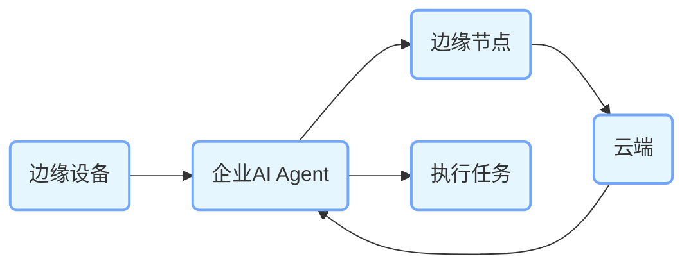

# 企业AI Agent的边缘计算安全防护策略

> 关键词：企业AI Agent、边缘计算、安全防护策略、数据安全、网络安全

> 摘要：本文聚焦于企业AI Agent在边缘计算环境下的安全防护策略。随着企业数字化转型的加速，AI Agent在边缘计算场景中的应用日益广泛，但同时也面临着诸多安全挑战。文章首先介绍了相关背景，包括目的、预期读者、文档结构和术语表。接着阐述了核心概念及联系，详细讲解了核心算法原理与操作步骤，并给出了数学模型和公式。通过项目实战案例，展示了具体的代码实现和分析。探讨了实际应用场景，推荐了学习、开发工具和相关论文著作。最后总结了未来发展趋势与挑战，解答了常见问题，并提供了扩展阅读和参考资料，旨在为企业构建完善的AI Agent边缘计算安全防护体系提供全面的技术指导。

## 1. 背景介绍 
### 1.1 目的和范围
在当今数字化时代，企业越来越多地采用AI Agent技术与边缘计算相结合的方式来处理和分析数据。AI Agent能够在边缘设备上自主执行任务，减少数据传输延迟，提高系统响应速度。然而，边缘计算环境的开放性和分布式特性使得企业AI Agent面临着各种安全威胁，如数据泄露、恶意攻击等。本文的目的在于深入探讨企业AI Agent在边缘计算环境下的安全防护策略，涵盖从数据安全、网络安全到设备安全等多个方面，为企业提供全面、有效的安全解决方案。

### 1.2 预期读者
本文的预期读者包括企业的IT管理人员、安全专家、AI和边缘计算领域的开发者，以及对企业数字化安全感兴趣的研究人员。这些读者希望了解如何保障企业AI Agent在边缘计算环境中的安全性，提升企业信息系统的整体安全水平。

### 1.3 文档结构概述
本文将按照以下结构展开：首先介绍核心概念与联系，明确企业AI Agent和边缘计算的基本原理和架构；接着阐述核心算法原理和具体操作步骤，通过Python代码进行详细说明；然后给出相关的数学模型和公式，并举例说明；通过项目实战案例，展示安全防护策略的具体实现和代码解读；探讨实际应用场景，分析安全防护策略在不同场景下的应用；推荐学习资源、开发工具和相关论文著作；最后总结未来发展趋势与挑战，解答常见问题，并提供扩展阅读和参考资料。

### 1.4 术语表
#### 1.4.1 核心术语定义
- **企业AI Agent**：是指在企业环境中运行的具有自主决策和执行能力的人工智能实体，能够根据预设的目标和规则，在边缘设备或网络中完成特定任务。
- **边缘计算**：是一种将计算和数据存储靠近数据源的分布式计算范式，通过在边缘设备上进行数据处理和分析，减少数据传输到云端的需求，降低延迟。
- **安全防护策略**：是指为保护企业AI Agent在边缘计算环境中的安全而制定的一系列规则、措施和技术手段。

#### 1.4.2 相关概念解释
- **数据加密**：是将数据转换为密文的过程，只有拥有正确密钥的授权方才能解密和访问数据，从而保护数据的机密性。
- **访问控制**：是指对系统资源的访问进行限制和管理的机制，确保只有授权用户能够访问特定的资源。
- **入侵检测**：是一种监测系统活动的技术，通过分析系统日志和网络流量，及时发现并响应潜在的入侵行为。

#### 1.4.3 缩略词列表
- **AI**：Artificial Intelligence，人工智能
- **IoT**：Internet of Things，物联网
- **SSL/TLS**：Secure Sockets Layer/Transport Layer Security，安全套接层/传输层安全协议
- **IDS**：Intrusion Detection System，入侵检测系统
- **VPN**：Virtual Private Network，虚拟专用网络

## 2. 核心概念与联系 
### 2.1 企业AI Agent的原理和架构
企业AI Agent通常由感知模块、决策模块和执行模块组成。感知模块负责收集环境信息，如传感器数据、网络流量等；决策模块根据感知到的信息和预设的目标，运用人工智能算法进行决策；执行模块则根据决策结果执行相应的任务。其架构可以是集中式、分布式或混合式，具体取决于企业的需求和应用场景。

### 2.2 边缘计算的原理和架构
边缘计算的核心思想是将计算和数据存储靠近数据源，通过在边缘设备（如传感器、网关、边缘服务器等）上进行数据处理和分析，减少数据传输到云端的需求。边缘计算架构通常包括边缘设备层、边缘节点层和云端层。边缘设备层负责数据采集；边缘节点层进行数据的初步处理和分析；云端层则提供更高级的数据分析和管理功能。

### 2.3 企业AI Agent与边缘计算的联系
企业AI Agent与边缘计算的结合可以实现数据的实时处理和决策，提高系统的响应速度和效率。AI Agent可以在边缘设备上运行，利用边缘计算的资源进行数据处理和分析，减少数据传输延迟。同时，边缘计算为AI Agent提供了更贴近数据源的计算环境，使得AI Agent能够更好地适应复杂多变的环境。

### 2.4 文本示意图
企业AI Agent在边缘计算环境中的架构可以用以下文本描述：
企业AI Agent分布在边缘设备和边缘节点上，通过网络与云端进行通信。边缘设备负责采集数据并将其传输给AI Agent，AI Agent在边缘节点上进行数据处理和分析，根据分析结果做出决策并执行相应的任务。同时，AI Agent可以将部分数据和决策结果上传到云端进行进一步的分析和管理。

### 2.5 Mermaid流程图


## 3. 核心算法原理 & 具体操作步骤 
### 3.1 数据加密算法原理
数据加密是保护企业AI Agent在边缘计算环境中数据安全的重要手段。常见的数据加密算法有对称加密算法和非对称加密算法。

#### 3.1.1 对称加密算法
对称加密算法使用相同的密钥进行加密和解密。常见的对称加密算法有AES（Advanced Encryption Standard）。AES算法的核心原理是通过多轮的替换、置换和混淆操作，将明文转换为密文。

以下是使用Python实现AES加密和解密的代码示例：
```python
from Crypto.Cipher import AES
from Crypto.Util.Padding import pad, unpad
import os

# 生成随机密钥
key = os.urandom(16)
# 初始化向量
iv = os.urandom(16)

# 明文
plaintext = b"Hello, World!"

# 创建AES加密器
cipher = AES.new(key, AES.MODE_CBC, iv)
# 填充明文
padded_plaintext = pad(plaintext, AES.block_size)
# 加密
ciphertext = cipher.encrypt(padded_plaintext)

# 创建AES解密器
decipher = AES.new(key, AES.MODE_CBC, iv)
# 解密
decrypted_data = decipher.decrypt(ciphertext)
# 去除填充
unpadded_decrypted_data = unpad(decrypted_data, AES.block_size)

print("明文:", plaintext)
print("密文:", ciphertext)
print("解密后的明文:", unpadded_decrypted_data)
```

#### 3.1.2 非对称加密算法
非对称加密算法使用一对密钥，即公钥和私钥。公钥用于加密，私钥用于解密。常见的非对称加密算法有RSA。RSA算法的核心原理是基于大数分解的困难性。

以下是使用Python实现RSA加密和解密的代码示例：
```python
from Crypto.PublicKey import RSA
from Crypto.Cipher import PKCS1_OAEP

# 生成RSA密钥对
key = RSA.generate(2048)
private_key = key.export_key()
public_key = key.publickey().export_key()

# 明文
plaintext = b"Hello, World!"

# 创建RSA公钥加密器
recipient_key = RSA.import_key(public_key)
cipher_rsa = PKCS1_OAEP.new(recipient_key)
# 加密
ciphertext = cipher_rsa.encrypt(plaintext)

# 创建RSA私钥解密器
private_key = RSA.import_key(private_key)
cipher_rsa = PKCS1_OAEP.new(private_key)
# 解密
decrypted_data = cipher_rsa.decrypt(ciphertext)

print("明文:", plaintext)
print("密文:", ciphertext)
print("解密后的明文:", decrypted_data)
```

### 3.2 访问控制算法原理
访问控制是确保只有授权用户能够访问企业AI Agent和边缘计算资源的重要机制。常见的访问控制模型有基于角色的访问控制（RBAC）。

#### 3.2.1 RBAC算法原理
RBAC算法通过定义角色、用户和权限之间的关系，实现对资源的访问控制。用户被分配到不同的角色，每个角色具有特定的权限。当用户请求访问资源时，系统会根据用户所属的角色和该角色的权限来判断是否允许访问。

以下是使用Python实现简单RBAC的代码示例：
```python
class User:
    def __init__(self, name, roles):
        self.name = name
        self.roles = roles

class Role:
    def __init__(self, name, permissions):
        self.name = name
        self.permissions = permissions

class Resource:
    def __init__(self, name):
        self.name = name

class RBAC:
    def __init__(self):
        self.users = []
        self.roles = []
        self.resources = []

    def add_user(self, user):
        self.users.append(user)

    def add_role(self, role):
        self.roles.append(role)

    def add_resource(self, resource):
        self.resources.append(resource)

    def check_access(self, user, resource):
        for role in user.roles:
            for r in self.roles:
                if r.name == role and resource.name in r.permissions:
                    return True
        return False

# 创建角色
admin_role = Role("admin", ["read", "write", "delete"])
user_role = Role("user", ["read"])

# 创建用户
admin_user = User("admin_user", ["admin"])
normal_user = User("normal_user", ["user"])

# 创建资源
resource = Resource("data")

# 创建RBAC实例
rbac = RBAC()
rbac.add_user(admin_user)
rbac.add_user(normal_user)
rbac.add_role(admin_role)
rbac.add_role(user_role)
rbac.add_resource(resource)

# 检查访问权限
print("Admin user access:", rbac.check_access(admin_user, resource))
print("Normal user access:", rbac.check_access(normal_user, resource))
```

### 3.3 入侵检测算法原理
入侵检测是监测企业AI Agent和边缘计算环境中潜在入侵行为的重要技术。常见的入侵检测算法有基于规则的入侵检测和基于机器学习的入侵检测。

#### 3.3.1 基于规则的入侵检测
基于规则的入侵检测通过预定义的规则来判断系统活动是否为入侵行为。当系统活动符合规则时，认为发生了入侵。

以下是一个简单的基于规则的入侵检测示例：
```python
# 规则：如果同一IP地址在短时间内发起大量请求，则认为是入侵
ip_request_count = {}
threshold = 10

def detect_intrusion(ip):
    if ip in ip_request_count:
        ip_request_count[ip] += 1
        if ip_request_count[ip] > threshold:
            print(f"Intrusion detected from IP: {ip}")
    else:
        ip_request_count[ip] = 1

# 模拟请求
ips = ["192.168.1.1", "192.168.1.1", "192.168.1.1", "192.168.1.1", "192.168.1.1",
       "192.168.1.1", "192.168.1.1", "192.168.1.1", "192.168.1.1", "192.168.1.1",
       "192.168.1.1"]

for ip in ips:
    detect_intrusion(ip)
```

#### 3.3.2 基于机器学习的入侵检测
基于机器学习的入侵检测通过训练机器学习模型来识别入侵行为。常见的机器学习算法有决策树、支持向量机等。

以下是一个使用决策树进行入侵检测的示例：
```python
from sklearn.tree import DecisionTreeClassifier
from sklearn.model_selection import train_test_split
from sklearn.metrics import accuracy_score
import numpy as np

# 生成示例数据
X = np.random.rand(100, 5)
y = np.random.randint(0, 2, 100)

# 划分训练集和测试集
X_train, X_test, y_train, y_test = train_test_split(X, y, test_size=0.2, random_state=42)

# 创建决策树分类器
clf = DecisionTreeClassifier()

# 训练模型
clf.fit(X_train, y_train)

# 预测
y_pred = clf.predict(X_test)

# 计算准确率
accuracy = accuracy_score(y_test, y_pred)
print("Accuracy:", accuracy)
```

## 4. 数学模型和公式 & 详细讲解 & 举例说明 
### 4.1 数据加密数学模型
#### 4.1.1 AES算法数学模型
AES算法基于有限域上的代数运算。在AES中，数据被表示为字节矩阵，通过一系列的替换、置换和混淆操作进行加密。

设明文 $P$ 是一个 $4\times4$ 的字节矩阵，密钥 $K$ 也是一个 $4\times4$ 的字节矩阵。AES加密过程可以表示为：

$$C = AES(P, K)$$

其中 $C$ 是密文。AES加密过程包括以下几个步骤：

- **初始轮密钥加**：$P_0 = P \oplus K_0$，其中 $\oplus$ 表示按位异或运算，$K_0$ 是初始轮密钥。
- **多轮的替换、置换和混淆操作**：$P_{i+1} = SubBytes(P_i) \circ ShiftRows(P_i) \circ MixColumns(P_i) \oplus K_{i+1}$，其中 $SubBytes$ 是字节替换操作，$ShiftRows$ 是行移位操作，$MixColumns$ 是列混淆操作，$K_{i+1}$ 是第 $i+1$ 轮的轮密钥。
- **最后一轮**：$C = SubBytes(P_{n-1}) \circ ShiftRows(P_{n-1}) \oplus K_n$，其中 $n$ 是总轮数。

#### 4.1.2 RSA算法数学模型
RSA算法基于数论中的欧拉定理。设 $p$ 和 $q$ 是两个大素数，$n = pq$，$\varphi(n) = (p - 1)(q - 1)$。选择一个整数 $e$，使得 $1 < e < \varphi(n)$ 且 $gcd(e, \varphi(n)) = 1$，则 $e$ 是公钥指数。选择一个整数 $d$，使得 $ed \equiv 1 \pmod{\varphi(n)}$，则 $d$ 是私钥指数。

对于明文 $m$，加密过程为：

$$c = m^e \pmod{n}$$

其中 $c$ 是密文。解密过程为：

$$m = c^d \pmod{n}$$

例如，设 $p = 3$，$q = 11$，则 $n = pq = 33$，$\varphi(n) = (p - 1)(q - 1) = 20$。选择 $e = 3$，因为 $gcd(3, 20) = 1$。求解 $3d \equiv 1 \pmod{20}$，得到 $d = 7$。

对于明文 $m = 5$，加密过程为：

$$c = 5^3 \pmod{33} = 125 \pmod{33} = 26$$

解密过程为：

$$m = 26^7 \pmod{33} = 8031810176 \pmod{33} = 5$$

### 4.2 访问控制数学模型
#### 4.2.1 RBAC数学模型
RBAC模型可以用三元组 $(U, R, P)$ 表示，其中 $U$ 是用户集合，$R$ 是角色集合，$P$ 是权限集合。用户到角色的映射为 $U \to R$，角色到权限的映射为 $R \to P$。

设 $u \in U$，$r \in R$，$p \in P$。用户 $u$ 具有角色 $r$ 表示为 $u \in r$，角色 $r$ 具有权限 $p$ 表示为 $r \to p$。用户 $u$ 具有权限 $p$ 当且仅当存在角色 $r$，使得 $u \in r$ 且 $r \to p$。

例如，设 $U = \{u_1, u_2\}$，$R = \{r_1, r_2\}$，$P = \{p_1, p_2\}$。$u_1 \in r_1$，$r_1 \to p_1$，$u_2 \in r_2$，$r_2 \to p_2$。则 $u_1$ 具有权限 $p_1$，$u_2$ 具有权限 $p_2$。

### 4.3 入侵检测数学模型
#### 4.3.1 基于规则的入侵检测数学模型
基于规则的入侵检测可以用布尔表达式表示。设 $S$ 是系统活动集合，$R$ 是规则集合。对于每个规则 $r \in R$，可以定义一个布尔函数 $f_r: S \to \{True, False\}$，表示系统活动是否符合规则。

当存在规则 $r \in R$，使得 $f_r(s) = True$ 时，认为发生了入侵。

例如，设规则 $r$ 为“同一IP地址在短时间内发起的请求数超过阈值”。设 $s$ 是系统活动，$ip(s)$ 表示活动 $s$ 的IP地址，$count(ip(s))$ 表示该IP地址在短时间内发起的请求数，$threshold$ 是阈值。则布尔函数 $f_r(s)$ 可以定义为：

$$f_r(s) = \begin{cases}
True, & \text{if } count(ip(s)) > threshold \\
False, & \text{otherwise}
\end{cases}$$

#### 4.3.2 基于机器学习的入侵检测数学模型
基于机器学习的入侵检测可以用分类模型表示。设 $X$ 是特征向量集合，$y$ 是标签集合，$y \in \{0, 1\}$，其中 $0$ 表示正常活动，$1$ 表示入侵活动。

机器学习模型 $f: X \to y$ 是一个分类器，通过训练数据 $(X_{train}, y_{train})$ 进行训练，然后对测试数据 $(X_{test})$ 进行预测，得到预测标签 $\hat{y}_{test}$。

例如，使用决策树分类器，决策树是一个二叉树，每个内部节点是一个特征的判断条件，每个叶子节点是一个类别标签。对于一个特征向量 $x \in X$，从根节点开始，根据特征的判断条件进行遍历，直到到达叶子节点，得到预测标签。

## 5. 项目实战：代码实际案例和详细解释说明 
### 5.1  开发环境搭建
#### 5.1.1 安装Python
首先需要安装Python环境。可以从Python官方网站（https://www.python.org/downloads/）下载适合自己操作系统的Python版本，并按照安装向导进行安装。

#### 5.1.2 安装必要的库
在项目中，需要使用一些Python库，如`pycryptodome`、`scikit-learn`等。可以使用以下命令进行安装：
```sh
pip install pycryptodome scikit-learn
```

### 5.2  源代码详细实现和代码解读
#### 5.2.1 数据加密模块
以下是一个完整的数据加密模块的代码示例：
```python
from Crypto.Cipher import AES
from Crypto.Util.Padding import pad, unpad
import os

class DataEncryptor:
    def __init__(self):
        self.key = os.urandom(16)
        self.iv = os.urandom(16)

    def encrypt(self, plaintext):
        cipher = AES.new(self.key, AES.MODE_CBC, self.iv)
        padded_plaintext = pad(plaintext.encode(), AES.block_size)
        ciphertext = cipher.encrypt(padded_plaintext)
        return ciphertext

    def decrypt(self, ciphertext):
        decipher = AES.new(self.key, AES.MODE_CBC, self.iv)
        decrypted_data = decipher.decrypt(ciphertext)
        unpadded_decrypted_data = unpad(decrypted_data, AES.block_size)
        return unpadded_decrypted_data.decode()

# 使用示例
encryptor = DataEncryptor()
plaintext = "Hello, World!"
ciphertext = encryptor.encrypt(plaintext)
decrypted_text = encryptor.decrypt(ciphertext)

print("明文:", plaintext)
print("密文:", ciphertext)
print("解密后的明文:", decrypted_text)
```
代码解读：
- `__init__`方法：初始化密钥和初始化向量。
- `encrypt`方法：将明文进行填充，然后使用AES算法进行加密。
- `decrypt`方法：将密文进行解密，然后去除填充。

#### 5.2.2 访问控制模块
以下是一个完整的访问控制模块的代码示例：
```python
class User:
    def __init__(self, name, roles):
        self.name = name
        self.roles = roles

class Role:
    def __init__(self, name, permissions):
        self.name = name
        self.permissions = permissions

class Resource:
    def __init__(self, name):
        self.name = name

class RBAC:
    def __init__(self):
        self.users = []
        self.roles = []
        self.resources = []

    def add_user(self, user):
        self.users.append(user)

    def add_role(self, role):
        self.roles.append(role)

    def add_resource(self, resource):
        self.resources.append(resource)

    def check_access(self, user, resource):
        for role in user.roles:
            for r in self.roles:
                if r.name == role and resource.name in r.permissions:
                    return True
        return False

# 使用示例
admin_role = Role("admin", ["read", "write", "delete"])
user_role = Role("user", ["read"])

admin_user = User("admin_user", ["admin"])
normal_user = User("normal_user", ["user"])

resource = Resource("data")

rbac = RBAC()
rbac.add_user(admin_user)
rbac.add_user(normal_user)
rbac.add_role(admin_role)
rbac.add_role(user_role)
rbac.add_resource(resource)

print("Admin user access:", rbac.check_access(admin_user, resource))
print("Normal user access:", rbac.check_access(normal_user, resource))
```
代码解读：
- `User`类：表示用户，包含用户的名称和所属角色。
- `Role`类：表示角色，包含角色的名称和权限。
- `Resource`类：表示资源，包含资源的名称。
- `RBAC`类：实现了基于角色的访问控制，包含添加用户、角色和资源的方法，以及检查访问权限的方法。

#### 5.2.3 入侵检测模块
以下是一个完整的入侵检测模块的代码示例：
```python
from sklearn.tree import DecisionTreeClassifier
from sklearn.model_selection import train_test_split
from sklearn.metrics import accuracy_score
import numpy as np

class IntrusionDetector:
    def __init__(self):
        self.clf = DecisionTreeClassifier()

    def train(self, X, y):
        X_train, X_test, y_train, y_test = train_test_split(X, y, test_size=0.2, random_state=42)
        self.clf.fit(X_train, y_train)
        y_pred = self.clf.predict(X_test)
        accuracy = accuracy_score(y_test, y_pred)
        print("Training accuracy:", accuracy)

    def detect(self, X):
        return self.clf.predict(X)

# 使用示例
X = np.random.rand(100, 5)
y = np.random.randint(0, 2, 100)

detector = IntrusionDetector()
detector.train(X, y)

new_X = np.random.rand(10, 5)
predictions = detector.detect(new_X)
print("Predictions:", predictions)
```
代码解读：
- `__init__`方法：初始化决策树分类器。
- `train`方法：将数据集划分为训练集和测试集，训练决策树分类器，并计算训练准确率。
- `detect`方法：使用训练好的模型对新数据进行预测。

### 5.3  代码解读与分析
#### 5.3.1 数据加密模块分析
数据加密模块使用AES算法对数据进行加密和解密。AES算法是一种对称加密算法，具有较高的安全性和效率。通过使用随机生成的密钥和初始化向量，可以确保每次加密的结果不同，增加了数据的安全性。

#### 5.3.2 访问控制模块分析
访问控制模块使用基于角色的访问控制模型，通过定义用户、角色和权限之间的关系，实现了对资源的访问控制。这种模型具有较好的可扩展性和灵活性，可以根据企业的需求进行定制。

#### 5.3.3 入侵检测模块分析
入侵检测模块使用决策树分类器进行入侵检测。决策树是一种简单而有效的机器学习算法，具有较好的解释性和可理解性。通过训练决策树模型，可以识别出潜在的入侵行为。

## 6. 实际应用场景 
### 6.1 工业物联网场景
在工业物联网场景中，企业AI Agent可以部署在边缘设备上，实时监测生产设备的运行状态和数据。边缘计算可以减少数据传输延迟，提高系统的响应速度。然而，工业物联网环境面临着各种安全威胁，如设备被攻击、数据泄露等。

通过采用本文介绍的安全防护策略，如数据加密、访问控制和入侵检测，可以保护企业AI Agent和边缘计算环境的安全。例如，对设备采集的数据进行加密，确保数据在传输和存储过程中的安全性；使用访问控制机制，限制只有授权人员能够访问设备和数据；通过入侵检测系统，及时发现并响应潜在的入侵行为。

### 6.2 智能交通场景
在智能交通场景中，企业AI Agent可以用于交通流量监测、自动驾驶等应用。边缘计算可以在车辆和路边设备上进行数据处理和分析，减少数据传输到云端的需求。然而，智能交通系统面临着网络攻击、数据篡改等安全风险。

采用安全防护策略可以保障智能交通系统的安全运行。例如，对车辆和路边设备之间的通信数据进行加密，防止数据被窃取和篡改；使用访问控制机制，确保只有授权的车辆和设备能够接入网络；通过入侵检测系统，监测网络流量，及时发现异常行为。

### 6.3 医疗物联网场景
在医疗物联网场景中，企业AI Agent可以用于远程医疗监测、医疗设备管理等应用。边缘计算可以在医疗设备上进行数据处理和分析，提高医疗服务的效率和质量。然而，医疗物联网环境涉及到患者的敏感信息，安全问题尤为重要。

通过实施安全防护策略，如数据加密、访问控制和入侵检测，可以保护患者的隐私和医疗数据的安全。例如，对患者的医疗数据进行加密，确保数据在传输和存储过程中的保密性；使用访问控制机制，限制只有授权的医疗人员能够访问患者的医疗数据；通过入侵检测系统，监测医疗设备的网络流量，及时发现潜在的安全威胁。

## 7. 工具和资源推荐
### 7.1 学习资源推荐
#### 7.1.1 书籍推荐
- 《Python密码学编程》：介绍了Python中常用的密码学算法和库，帮助读者掌握数据加密的基本原理和实现方法。
- 《机器学习实战》：通过实际案例介绍了机器学习的基本算法和应用，适合初学者学习入侵检测等机器学习应用。
- 《网络安全基础教程》：全面介绍了网络安全的基本概念、技术和方法，对理解企业AI Agent和边缘计算的安全防护有很大帮助。

#### 7.1.2 在线课程
- Coursera上的“密码学基础”课程：由知名大学教授授课，系统介绍了密码学的基本原理和算法。
- edX上的“机器学习导论”课程：提供了机器学习的基础知识和实践经验，适合初学者入门。
- Udemy上的“网络安全实战”课程：通过实际项目介绍了网络安全的防护技术和工具。

#### 7.1.3 技术博客和网站
- 安全客（https://www.anquanke.com/）：提供了丰富的网络安全技术文章和案例分析，帮助读者了解最新的安全趋势和技术。
- 开源中国（https://www.oschina.net/）：涵盖了各种开源技术和项目，读者可以在上面找到相关的安全防护工具和代码。
- 阮一峰的网络日志（http://www.ruanyifeng.com/blog/）：包含了许多计算机技术的科普文章，对理解相关概念有很大帮助。

### 7.2 开发工具框架推荐
#### 7.2.1 IDE和编辑器
- PyCharm：是一款专门为Python开发设计的集成开发环境，提供了丰富的代码编辑、调试和项目管理功能。
- Visual Studio Code：是一款轻量级的代码编辑器，支持多种编程语言和插件扩展，适合快速开发和调试。

#### 7.2.2 调试和性能分析工具
- pdb：是Python自带的调试器，可以帮助开发者定位代码中的问题。
- cProfile：是Python的性能分析工具，可以分析代码的运行时间和资源消耗情况。

#### 7.2.3 相关框架和库
- PyCryptodome：是Python的一个密码学库，提供了各种加密算法的实现，方便开发者进行数据加密。
- scikit-learn：是Python的一个机器学习库，提供了丰富的机器学习算法和工具，适合开发入侵检测等机器学习应用。

### 7.3 相关论文著作推荐
#### 7.3.1 经典论文
- “AES Proposal: Rijndael”：介绍了AES算法的设计和实现，是理解AES算法的重要参考文献。
- “Role-Based Access Control Models”：详细阐述了基于角色的访问控制模型的原理和应用，对理解访问控制机制有很大帮助。
- “A Survey of Machine Learning for Cyber Security”：对机器学习在网络安全领域的应用进行了全面的综述，为开发入侵检测系统提供了理论基础。

#### 7.3.2 最新研究成果
- 可以关注ACM SIGSAC、IEEE Security & Privacy等学术会议和期刊上的最新研究成果，了解企业AI Agent和边缘计算安全防护的最新技术和趋势。

#### 7.3.3 应用案例分析
- 可以参考一些大型企业的安全防护案例，如谷歌、亚马逊等公司的网络安全实践，学习他们在企业AI Agent和边缘计算安全防护方面的经验和方法。

## 8. 总结：未来发展趋势与挑战
### 8.1 未来发展趋势
#### 8.1.1 智能化安全防护
随着人工智能技术的不断发展，未来的企业AI Agent和边缘计算安全防护将更加智能化。例如，使用深度学习算法进行入侵检测，可以自动学习和识别复杂的入侵模式；使用智能合约实现访问控制，确保访问规则的自动执行和不可篡改。

#### 8.1.2 零信任架构
零信任架构将成为未来企业AI Agent和边缘计算安全防护的重要趋势。零信任架构的核心思想是“默认不信任，始终验证”，即对任何试图访问企业资源的用户、设备和应用都进行严格的身份验证和授权，不依赖于传统的网络边界防护。

#### 8.1.3 区块链技术的应用
区块链技术具有去中心化、不可篡改、可追溯等特点，可以应用于企业AI Agent和边缘计算的安全防护。例如，使用区块链技术实现数据的安全存储和共享，确保数据的完整性和可信度；使用区块链技术实现设备的身份认证和授权，防止设备被伪造和攻击。

### 8.2 挑战
#### 8.2.1 安全技术的复杂性
随着企业AI Agent和边缘计算技术的不断发展，安全防护技术也变得越来越复杂。例如，数据加密算法需要不断更新和升级，以应对新的攻击手段；入侵检测系统需要处理大量的复杂数据，提高检测的准确性和效率。

#### 8.2.2 安全人才的短缺
目前，网络安全领域的专业人才短缺，企业AI Agent和边缘计算安全防护领域更是缺乏既懂人工智能又懂安全技术的复合型人才。这给企业的安全防护工作带来了很大的挑战。

#### 8.2.3 法律法规的不完善
随着企业AI Agent和边缘计算技术的广泛应用，相关的法律法规还不够完善。例如，数据隐私保护、安全责任界定等方面的法律法规还需要进一步健全，以保障企业和用户的合法权益。

## 9. 附录：常见问题与解答
### 9.1 数据加密是否会影响系统性能？
数据加密会在一定程度上影响系统性能，尤其是在处理大量数据时。但是，通过选择合适的加密算法和优化加密过程，可以将性能影响降到最低。例如，使用硬件加密模块可以提高加密速度；采用并行加密技术可以加快数据处理速度。

### 9.2 如何选择合适的访问控制模型？
选择合适的访问控制模型需要考虑企业的具体需求和应用场景。基于角色的访问控制（RBAC）是一种常用的访问控制模型，具有较好的可扩展性和灵活性，适合大多数企业应用。如果企业的安全需求较为复杂，可以考虑使用基于属性的访问控制（ABAC）等更高级的访问控制模型。

### 9.3 入侵检测系统的误报率如何降低？
降低入侵检测系统的误报率可以从以下几个方面入手：选择合适的入侵检测算法，如基于机器学习的入侵检测算法可以通过训练模型来提高检测的准确性；优化规则库，去除不必要的规则，避免规则冲突；结合多种检测方法，如基于规则的检测和基于机器学习的检测相结合，提高检测的全面性。

### 9.4 如何保障边缘设备的安全？
保障边缘设备的安全可以采取以下措施：对边缘设备进行定期的安全更新和补丁管理，修复已知的安全漏洞；对边缘设备进行物理防护，防止设备被盗或被篡改；使用安全的通信协议，如SSL/TLS协议，保障设备之间的通信安全；对边缘设备进行访问控制，限制只有授权人员能够访问设备。

## 10. 扩展阅读 & 参考资料
### 10.1 扩展阅读
- 《人工智能安全》：深入探讨了人工智能领域的安全问题，包括AI Agent的安全防护、对抗攻击等方面的内容。
- 《边缘计算技术与应用》：详细介绍了边缘计算的原理、架构和应用场景，对理解企业AI Agent和边缘计算的结合有很大帮助。
- 《网络安全攻防实战》：通过实际案例介绍了网络安全的攻防技术和策略，对提高安全防护能力有很大的启发。

### 10.2 参考资料
- “NIST Special Publication 800-131A: Transitioning the Use of Cryptographic Algorithms and Key Sizes”：美国国家标准与技术研究院发布的关于密码算法和密钥长度的使用指南。
- “ISO/IEC 27001:2013 Information technology — Security techniques — Information security management systems — Requirements”：国际标准化组织发布的信息安全管理体系标准。
- “OWASP Top Ten Project”：开放 Web 应用安全项目（OWASP）发布的十大 Web 应用安全风险列表，对企业AI Agent和边缘计算的安全防护有一定的参考价值。

作者：AI天才研究院/AI Genius Institute & 禅与计算机程序设计艺术 /Zen And The Art of Computer Programming