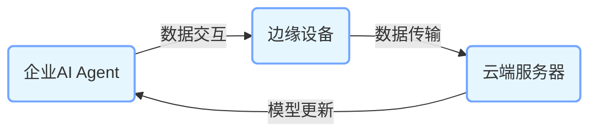

# 企业AI Agent的边缘计算资源优化配置

> 关键词：企业AI Agent、边缘计算、资源优化配置、智能算法、云计算

> 摘要：本文围绕企业AI Agent的边缘计算资源优化配置展开深入探讨。首先介绍了研究的背景、目的、预期读者和文档结构，阐述了相关术语。接着详细解析了企业AI Agent和边缘计算的核心概念及联系，并给出了相应的文本示意图和Mermaid流程图。在核心算法原理部分，使用Python代码进行详细阐述。同时，引入数学模型和公式进行详细讲解并举例说明。通过项目实战，给出代码实际案例并进行详细解释。分析了实际应用场景，推荐了相关的学习资源、开发工具框架和论文著作。最后总结了未来发展趋势与挑战，提供了常见问题解答和扩展阅读参考资料，旨在为企业在AI Agent与边缘计算结合的资源优化配置方面提供全面的技术指导。

## 1. 背景介绍 
### 1.1 目的和范围
随着人工智能技术的飞速发展，企业越来越多地采用AI Agent来自动化执行各种任务，如智能客服、生产流程监控等。同时，边缘计算作为一种新兴的计算模式，能够在靠近数据源的地方进行数据处理和分析，减少数据传输延迟，提高系统的响应速度和可靠性。然而，企业在使用AI Agent进行边缘计算时，面临着资源分配不合理的问题，如计算资源闲置、网络带宽不足等，导致系统性能下降和成本增加。

本文的目的是探讨如何对企业AI Agent的边缘计算资源进行优化配置，以提高资源利用率，降低成本，提升系统的整体性能。具体范围包括核心概念的阐述、优化算法的设计与实现、实际应用场景的分析以及相关工具和资源的推荐等。

### 1.2 预期读者
本文预期读者主要包括企业的IT管理人员、AI开发者、边缘计算工程师以及对人工智能和边缘计算技术感兴趣的研究人员。对于企业IT管理人员，本文可以帮助他们了解如何合理配置边缘计算资源，提高企业的运营效率；对于AI开发者和边缘计算工程师，本文提供了技术实现的思路和方法；对于研究人员，本文可以作为进一步研究的参考资料。

### 1.3 文档结构概述
本文共分为十个部分。第一部分是背景介绍，包括目的和范围、预期读者、文档结构概述和术语表。第二部分阐述核心概念与联系，给出相关的文本示意图和Mermaid流程图。第三部分详细讲解核心算法原理并给出Python代码实现。第四部分介绍数学模型和公式，并举例说明。第五部分进行项目实战，包括开发环境搭建、源代码实现和代码解读。第六部分分析实际应用场景。第七部分推荐相关的工具和资源。第八部分总结未来发展趋势与挑战。第九部分是附录，提供常见问题与解答。第十部分给出扩展阅读和参考资料。

### 1.4 术语表
#### 1.4.1 核心术语定义
- **企业AI Agent**：是指企业中用于自动化执行特定任务的人工智能程序，它可以感知环境、做出决策并采取行动。
- **边缘计算**：是一种将计算和数据存储靠近数据源的计算模式，通过在网络边缘设备上进行数据处理和分析，减少数据传输到云端的延迟。
- **资源优化配置**：是指根据系统的需求和资源的状态，合理分配计算、存储、网络等资源，以达到提高资源利用率和系统性能的目的。

#### 1.4.2 相关概念解释
- **云计算**：是一种基于互联网的计算方式，通过将计算任务分布在大量的计算机构成的资源池上，使用户可以按需获取计算资源。与边缘计算不同，云计算通常在数据中心进行集中式计算。
- **AI模型推理**：是指使用训练好的AI模型对新的数据进行预测和判断的过程。在企业AI Agent中，AI模型推理是一个重要的任务，需要消耗一定的计算资源。

#### 1.4.3 缩略词列表
- **AI**：Artificial Intelligence，人工智能
- **IoT**：Internet of Things，物联网
- **CPU**：Central Processing Unit，中央处理器
- **GPU**：Graphics Processing Unit，图形处理器

## 2. 核心概念与联系 

### 企业AI Agent
企业AI Agent是企业智能化转型的重要工具，它可以根据预设的规则和算法，自动完成各种任务。例如，在智能客服场景中，AI Agent可以通过自然语言处理技术与客户进行交互，解答客户的问题；在生产制造场景中，AI Agent可以实时监控生产设备的运行状态，预测设备故障并及时发出警报。

### 边缘计算
边缘计算将计算和数据存储靠近数据源，如传感器、摄像头等设备。这样可以减少数据传输到云端的延迟，提高系统的响应速度。例如，在智能交通系统中，通过在路边的边缘设备上对交通摄像头采集的视频数据进行实时分析，可以快速识别交通违法行为并进行处理。

### 两者的联系
企业AI Agent在执行任务时需要消耗一定的计算资源，而边缘计算可以为AI Agent提供本地的计算能力。通过将AI Agent部署在边缘设备上，可以减少数据传输延迟，提高系统的实时性和可靠性。同时，边缘计算还可以减轻云端的计算压力，降低企业的运营成本。

#### 文本示意图
```plaintext
企业AI Agent <-- 数据交互 --> 边缘设备（边缘计算节点）
边缘设备 <-- 数据传输 --> 云端服务器
```

#### Mermaid流程图


## 3. 核心算法原理 & 具体操作步骤 

### 核心算法原理
为了实现企业AI Agent的边缘计算资源优化配置，我们可以采用遗传算法。遗传算法是一种模拟自然选择和遗传机制的优化算法，它通过不断迭代搜索最优解。

#### 适应度函数
适应度函数用于评估每个个体（即资源分配方案）的优劣。在本问题中，适应度函数可以定义为系统的整体性能指标，如任务完成时间、资源利用率等。假设我们有 $n$ 个AI Agent和 $m$ 个边缘设备，每个AI Agent有不同的计算需求 $d_i$（$i = 1,2,\cdots,n$），每个边缘设备有不同的计算能力 $c_j$（$j = 1,2,\cdots,m$）。资源分配方案可以表示为一个矩阵 $X$，其中 $x_{ij}$ 表示第 $i$ 个AI Agent分配到第 $j$ 个边缘设备的资源比例。

适应度函数可以定义为：
$$
f(X) = \frac{1}{\sum_{i=1}^{n}\sum_{j=1}^{m}x_{ij}d_i/c_j + \alpha\sum_{j=1}^{m}(1 - \sum_{i=1}^{n}x_{ij})^2}
$$
其中，第一项表示所有AI Agent完成任务的总时间，第二项表示边缘设备的资源闲置率，$\alpha$ 是一个权重系数，用于平衡两者的影响。

#### 遗传操作
- **选择操作**：根据个体的适应度值，选择一部分个体作为父代，用于产生下一代。常用的选择方法有轮盘赌选择、锦标赛选择等。
- **交叉操作**：对选中的父代个体进行交叉操作，生成新的个体。例如，采用单点交叉的方法，随机选择一个交叉点，交换两个父代个体在交叉点之后的部分。
- **变异操作**：对新生成的个体进行变异操作，以增加种群的多样性。例如，随机选择一个基因位，对其进行修改。

### Python源代码实现
```python
import numpy as np

# 定义参数
n = 5  # AI Agent数量
m = 3  # 边缘设备数量
d = np.random.rand(n)  # AI Agent的计算需求
c = np.random.rand(m)  # 边缘设备的计算能力
alpha = 0.1  # 权重系数
pop_size = 20  # 种群大小
max_generations = 100  # 最大迭代次数

# 初始化种群
def initialize_population():
    population = []
    for _ in range(pop_size):
        individual = np.random.rand(n, m)
        individual = individual / individual.sum(axis=1, keepdims=True)
        population.append(individual)
    return population

# 计算适应度函数
def fitness_function(individual):
    total_time = np.sum([individual[i][j] * d[i] / c[j] for i in range(n) for j in range(m)])
    resource_idle = np.sum([(1 - np.sum(individual[:, j]))**2 for j in range(m)])
    return 1 / (total_time + alpha * resource_idle)

# 选择操作（轮盘赌选择）
def selection(population):
    fitness_values = [fitness_function(individual) for individual in population]
    total_fitness = sum(fitness_values)
    probabilities = [fitness / total_fitness for fitness in fitness_values]
    selected_indices = np.random.choice(pop_size, size=pop_size, p=probabilities)
    selected_population = [population[i] for i in selected_indices]
    return selected_population

# 交叉操作（单点交叉）
def crossover(parent1, parent2):
    crossover_point = np.random.randint(1, n)
    child1 = np.vstack((parent1[:crossover_point], parent2[crossover_point:]))
    child2 = np.vstack((parent2[:crossover_point], parent1[crossover_point:]))
    return child1, child2

# 变异操作
def mutation(individual, mutation_rate=0.01):
    for i in range(n):
        for j in range(m):
            if np.random.rand() < mutation_rate:
                individual[i][j] = np.random.rand()
    individual = individual / individual.sum(axis=1, keepdims=True)
    return individual

# 遗传算法主函数
def genetic_algorithm():
    population = initialize_population()
    for generation in range(max_generations):
        selected_population = selection(population)
        new_population = []
        for i in range(0, pop_size, 2):
            parent1 = selected_population[i]
            parent2 = selected_population[i + 1]
            child1, child2 = crossover(parent1, parent2)
            child1 = mutation(child1)
            child2 = mutation(child2)
            new_population.extend([child1, child2])
        population = new_population
    best_individual = max(population, key=fitness_function)
    return best_individual

# 运行遗传算法
best_solution = genetic_algorithm()
print("最优资源分配方案：", best_solution)
```

### 具体操作步骤
1. **初始化种群**：随机生成一定数量的资源分配方案作为初始种群。
2. **计算适应度值**：对每个个体（资源分配方案）计算其适应度值。
3. **选择操作**：根据适应度值选择一部分个体作为父代。
4. **交叉操作**：对选中的父代个体进行交叉操作，生成新的个体。
5. **变异操作**：对新生成的个体进行变异操作，增加种群的多样性。
6. **更新种群**：用新生成的个体替换原种群中的部分个体。
7. **重复步骤2 - 6**：直到达到最大迭代次数或满足停止条件。
8. **输出最优解**：选择适应度值最大的个体作为最优的资源分配方案。

## 4. 数学模型和公式 & 详细讲解 & 举例说明 

### 数学模型
我们可以将企业AI Agent的边缘计算资源优化配置问题建模为一个约束优化问题。设 $x_{ij}$ 表示第 $i$ 个AI Agent分配到第 $j$ 个边缘设备的资源比例，$d_i$ 表示第 $i$ 个AI Agent的计算需求，$c_j$ 表示第 $j$ 个边缘设备的计算能力，$T$ 表示系统的总任务完成时间，$U$ 表示边缘设备的资源利用率。

目标函数为：
$$
\min T = \sum_{i=1}^{n}\sum_{j=1}^{m}x_{ij}d_i/c_j
$$
约束条件为：
$$
\sum_{j=1}^{m}x_{ij} = 1, \quad i = 1,2,\cdots,n
$$
$$
0 \leq x_{ij} \leq 1, \quad i = 1,2,\cdots,n; j = 1,2,\cdots,m
$$
第一个约束条件表示每个AI Agent的资源分配比例之和必须为1，第二个约束条件表示资源分配比例必须在0到1之间。

### 详细讲解
目标函数 $T$ 表示所有AI Agent完成任务的总时间，我们的目标是最小化这个总时间。约束条件保证了每个AI Agent的资源都能得到合理分配，并且分配比例在合法范围内。

### 举例说明
假设我们有2个AI Agent和2个边缘设备，AI Agent的计算需求分别为 $d_1 = 10$ 和 $d_2 = 20$，边缘设备的计算能力分别为 $c_1 = 5$ 和 $c_2 = 10$。

一个可能的资源分配方案为 $X = \begin{bmatrix}0.6 & 0.4\\0.3 & 0.7\end{bmatrix}$，表示第一个AI Agent分配到第一个边缘设备的资源比例为0.6，分配到第二个边缘设备的资源比例为0.4；第二个AI Agent分配到第一个边缘设备的资源比例为0.3，分配到第二个边缘设备的资源比例为0.7。

根据目标函数计算总任务完成时间：
$$
T = \frac{0.6\times10}{5} + \frac{0.4\times10}{10} + \frac{0.3\times20}{5} + \frac{0.7\times20}{10}
$$
$$
= 1.2 + 0.4 + 1.2 + 1.4 = 4.2
$$

## 5. 项目实战：代码实际案例和详细解释说明 

### 5.1  开发环境搭建
- **操作系统**：推荐使用Linux系统，如Ubuntu 18.04及以上版本。
- **Python版本**：Python 3.7及以上版本。
- **安装必要的库**：使用以下命令安装所需的库：
```bash
pip install numpy
```

### 5.2  源代码详细实现和代码解读
以下是完整的Python代码：
```python
import numpy as np

# 定义参数
n = 5  # AI Agent数量
m = 3  # 边缘设备数量
d = np.random.rand(n)  # AI Agent的计算需求
c = np.random.rand(m)  # 边缘设备的计算能力
alpha = 0.1  # 权重系数
pop_size = 20  # 种群大小
max_generations = 100  # 最大迭代次数

# 初始化种群
def initialize_population():
    population = []
    for _ in range(pop_size):
        individual = np.random.rand(n, m)
        individual = individual / individual.sum(axis=1, keepdims=True)
        population.append(individual)
    return population

# 计算适应度函数
def fitness_function(individual):
    total_time = np.sum([individual[i][j] * d[i] / c[j] for i in range(n) for j in range(m)])
    resource_idle = np.sum([(1 - np.sum(individual[:, j]))**2 for j in range(m)])
    return 1 / (total_time + alpha * resource_idle)

# 选择操作（轮盘赌选择）
def selection(population):
    fitness_values = [fitness_function(individual) for individual in population]
    total_fitness = sum(fitness_values)
    probabilities = [fitness / total_fitness for fitness in fitness_values]
    selected_indices = np.random.choice(pop_size, size=pop_size, p=probabilities)
    selected_population = [population[i] for i in selected_indices]
    return selected_population

# 交叉操作（单点交叉）
def crossover(parent1, parent2):
    crossover_point = np.random.randint(1, n)
    child1 = np.vstack((parent1[:crossover_point], parent2[crossover_point:]))
    child2 = np.vstack((parent2[:crossover_point], parent1[crossover_point:]))
    return child1, child2

# 变异操作
def mutation(individual, mutation_rate=0.01):
    for i in range(n):
        for j in range(m):
            if np.random.rand() < mutation_rate:
                individual[i][j] = np.random.rand()
    individual = individual / individual.sum(axis=1, keepdims=True)
    return individual

# 遗传算法主函数
def genetic_algorithm():
    population = initialize_population()
    for generation in range(max_generations):
        selected_population = selection(population)
        new_population = []
        for i in range(0, pop_size, 2):
            parent1 = selected_population[i]
            parent2 = selected_population[i + 1]
            child1, child2 = crossover(parent1, parent2)
            child1 = mutation(child1)
            child2 = mutation(child2)
            new_population.extend([child1, child2])
        population = new_population
    best_individual = max(population, key=fitness_function)
    return best_individual

# 运行遗传算法
best_solution = genetic_algorithm()
print("最优资源分配方案：", best_solution)
```

### 代码解读与分析
1. **参数定义**：定义了AI Agent数量、边缘设备数量、计算需求、计算能力、权重系数、种群大小和最大迭代次数等参数。
2. **初始化种群**：`initialize_population` 函数随机生成初始种群，每个个体表示一个资源分配方案，并且保证每个AI Agent的资源分配比例之和为1。
3. **适应度函数**：`fitness_function` 函数计算每个个体的适应度值，适应度值越高表示该资源分配方案越优。
4. **选择操作**：`selection` 函数采用轮盘赌选择方法，根据个体的适应度值选择父代个体。
5. **交叉操作**：`crossover` 函数采用单点交叉的方法，生成新的个体。
6. **变异操作**：`mutation` 函数对新生成的个体进行变异操作，增加种群的多样性。
7. **遗传算法主函数**：`genetic_algorithm` 函数实现了遗传算法的主循环，不断迭代更新种群，直到达到最大迭代次数。
8. **输出结果**：最后输出最优的资源分配方案。

## 6. 实际应用场景 
### 智能物流
在智能物流系统中，企业AI Agent可以用于实时监控货物的运输状态、优化配送路线等。通过将AI Agent部署在边缘设备上，如物流车辆、仓库传感器等，可以实时处理和分析数据，减少数据传输延迟。例如，AI Agent可以根据实时交通信息和货物配送需求，动态调整配送路线，提高物流效率。同时，通过边缘计算资源优化配置，可以合理分配车辆和仓库设备的计算资源，降低系统成本。

### 工业制造
在工业制造领域，企业AI Agent可以用于设备故障预测、生产质量控制等。边缘计算可以在生产现场对设备传感器采集的数据进行实时分析，及时发现设备故障隐患并采取措施。例如，AI Agent可以通过对设备振动、温度等数据的分析，预测设备的剩余使用寿命，提前安排维护计划。通过优化边缘计算资源配置，可以确保AI Agent能够高效地运行，提高生产的可靠性和质量。

### 智能安防
在智能安防系统中，企业AI Agent可以用于视频监控、人员识别等。边缘计算可以在监控摄像头附近对视频数据进行实时处理，提取关键信息，如人员的面部特征、行为动作等。例如，AI Agent可以通过人脸识别技术识别进入监控区域的人员身份，及时发出警报。通过合理配置边缘计算资源，可以提高安防系统的响应速度和准确性。

## 7. 工具和资源推荐
### 7.1 学习资源推荐
#### 7.1.1 书籍推荐
- 《人工智能：一种现代的方法》：这本书全面介绍了人工智能的基本概念、算法和应用，是学习人工智能的经典教材。
- 《Python机器学习》：详细讲解了Python在机器学习领域的应用，包括各种机器学习算法的实现和案例分析。
- 《边缘计算：原理与实践》：深入探讨了边缘计算的原理、技术和应用场景，对理解边缘计算有很大帮助。

#### 7.1.2 在线课程
- Coursera上的“人工智能基础”课程：由知名高校的教授授课，系统介绍了人工智能的基础知识和算法。
- edX上的“边缘计算与物联网”课程：讲解了边缘计算在物联网中的应用和实现方法。
- 网易云课堂上的“Python数据分析与机器学习实战”课程：通过实际案例让学员掌握Python在数据分析和机器学习中的应用。

#### 7.1.3 技术博客和网站
- 博客园：有很多人工智能和边缘计算领域的技术文章和经验分享。
- 开源中国：提供了大量的开源项目和技术资讯，对学习和实践有很大帮助。
- Towards Data Science：是一个专注于数据科学和人工智能的博客平台，有很多高质量的技术文章。

### 7.2 开发工具框架推荐
#### 7.2.1 IDE和编辑器
- PyCharm：是一款专门为Python开发设计的集成开发环境，具有强大的代码编辑、调试和分析功能。
- Visual Studio Code：是一款轻量级的代码编辑器，支持多种编程语言，并且有丰富的插件扩展。

#### 7.2.2 调试和性能分析工具
- PDB：是Python自带的调试工具，可以帮助开发者定位代码中的问题。
- cProfile：可以对Python代码进行性能分析，找出代码中的性能瓶颈。

#### 7.2.3 相关框架和库
- TensorFlow：是一个开源的机器学习框架，提供了丰富的工具和接口，方便开发者构建和训练AI模型。
- PyTorch：是另一个流行的深度学习框架，具有动态图和易于使用的特点。
- NumPy：是Python中用于科学计算的基础库，提供了高效的数组操作和数学函数。

### 7.3 相关论文著作推荐
#### 7.3.1 经典论文
- “Deep Residual Learning for Image Recognition”：提出了残差网络（ResNet），在图像识别领域取得了巨大的成功。
- “Attention Is All You Need”：介绍了Transformer模型，为自然语言处理领域带来了革命性的变化。

#### 7.3.2 最新研究成果
- 可以关注IEEE Transactions on Artificial Intelligence、ACM Transactions on Intelligent Systems and Technology等学术期刊，获取最新的研究成果。

#### 7.3.3 应用案例分析
- 可以参考一些知名企业的技术博客，如Google AI Blog、Microsoft Research Blog等，了解他们在AI Agent和边缘计算方面的应用案例。

## 8. 总结：未来发展趋势与挑战
### 未来发展趋势
- **智能化程度不断提高**：企业AI Agent将具备更强的自主学习和决策能力，能够更好地适应复杂多变的环境。边缘计算也将与人工智能深度融合，实现更高效的资源优化配置。
- **应用场景不断拓展**：除了现有的智能物流、工业制造、智能安防等领域，企业AI Agent和边缘计算还将在医疗、教育、金融等更多领域得到广泛应用。
- **标准化和规范化**：随着技术的发展，相关的标准和规范将逐渐完善，有利于不同厂商的设备和系统之间的互联互通。

### 挑战
- **资源管理难度加大**：随着企业AI Agent和边缘设备的数量不断增加，资源管理的复杂度也将大大提高，需要更高效的资源优化配置算法和管理系统。
- **安全和隐私问题**：边缘计算将数据处理和存储靠近数据源，增加了数据泄露和安全攻击的风险。同时，企业AI Agent在处理敏感数据时，也需要保证数据的隐私和安全。
- **技术人才短缺**：企业AI Agent和边缘计算涉及到人工智能、计算机网络、嵌入式系统等多个领域的知识，目前相关的技术人才相对短缺，制约了技术的发展和应用。

## 9. 附录：常见问题与解答
### 问题1：遗传算法的收敛速度如何提高？
答：可以通过调整遗传算法的参数，如种群大小、交叉率、变异率等，来提高收敛速度。同时，也可以采用一些改进的遗传算法，如自适应遗传算法、精英保留策略等。

### 问题2：边缘计算与云计算如何协同工作？
答：边缘计算可以在靠近数据源的地方进行数据的初步处理和分析，将处理后的结果传输到云端进行进一步的分析和存储。云端可以为边缘设备提供模型更新、大数据分析等支持，两者相互协作，实现更高效的计算和数据处理。

### 问题3：如何评估企业AI Agent的性能？
答：可以从多个方面评估企业AI Agent的性能，如任务完成时间、准确率、资源利用率等。可以根据具体的应用场景和需求，选择合适的评估指标。

## 10. 扩展阅读 & 参考资料
### 扩展阅读
- 《智能系统：原理、设计与应用》：深入探讨了智能系统的原理和设计方法，对理解企业AI Agent有很大帮助。
- 《云计算与大数据》：介绍了云计算和大数据的相关技术和应用，有助于了解边缘计算与云计算的关系。

### 参考资料
- 相关的学术论文和研究报告，如IEEE、ACM等学术组织发表的论文。
- 企业的技术文档和白皮书，如Google、Microsoft等公司发布的关于AI Agent和边缘计算的技术文档。

作者：AI天才研究院/AI Genius Institute & 禅与计算机程序设计艺术 /Zen And The Art of Computer Programming