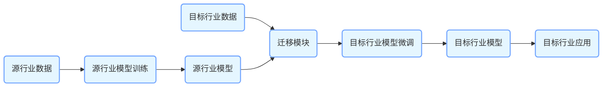

# 企业AI Agent的迁移学习在跨行业应用中的实践

> 关键词：企业AI Agent、迁移学习、跨行业应用、模型迁移、实践案例

> 摘要：本文聚焦于企业AI Agent的迁移学习在跨行业应用中的实践。首先介绍了相关背景，包括目的、预期读者等内容。接着阐述了核心概念与联系，通过示意图和流程图直观呈现。详细讲解了核心算法原理，用Python代码进行说明，同时给出数学模型和公式并举例。通过项目实战展示了代码实现和解读。分析了实际应用场景，推荐了学习资源、开发工具和相关论文。最后总结了未来发展趋势与挑战，还提供了常见问题解答和扩展阅读参考资料，旨在为企业在跨行业应用中运用AI Agent的迁移学习提供全面的技术指导。

## 1. 背景介绍 
### 1.1 目的和范围
随着人工智能技术的飞速发展，企业AI Agent在各个行业的应用越来越广泛。然而，为每个行业单独开发和训练AI Agent成本高、周期长。迁移学习为解决这一问题提供了有效途径，它允许将在一个领域训练好的模型知识迁移到另一个领域。本文的目的是深入探讨企业AI Agent的迁移学习在跨行业应用中的实践，涵盖从理论到实际项目的各个方面，包括核心概念、算法原理、数学模型、项目实战等，为企业在跨行业应用中成功运用迁移学习提供全面的指导。

### 1.2 预期读者
本文预期读者包括企业的技术管理人员、AI开发者、数据科学家、机器学习工程师等。这些读者希望了解如何利用迁移学习技术，将企业现有的AI Agent模型应用到不同行业中，提高开发效率和模型性能，降低成本。

### 1.3 文档结构概述
本文将按照以下结构进行组织：首先介绍核心概念与联系，让读者对企业AI Agent的迁移学习有一个清晰的认识；接着详细讲解核心算法原理和具体操作步骤，并用Python代码进行阐述；然后给出数学模型和公式，并举例说明；通过项目实战展示代码实现和详细解释；分析实际应用场景；推荐相关的工具和资源；最后总结未来发展趋势与挑战，提供常见问题解答和扩展阅读参考资料。

### 1.4 术语表
#### 1.4.1 核心术语定义
- **企业AI Agent**：是指企业为了实现特定业务目标而开发的人工智能代理，它可以自动执行任务、与环境交互、做出决策等。
- **迁移学习**：是一种机器学习技术，它将在一个任务（源任务）上学习到的知识迁移到另一个相关任务（目标任务）上，以提高目标任务的学习效率和性能。
- **跨行业应用**：指将在一个行业中开发和训练的AI Agent模型应用到其他不同行业的场景中。

#### 1.4.2 相关概念解释
- **源领域和目标领域**：源领域是指迁移学习中知识的来源领域，目标领域是指要应用迁移知识的领域。例如，在将电商行业的AI Agent模型迁移到金融行业时，电商行业就是源领域，金融行业就是目标领域。
- **预训练模型**：在大规模数据上进行预先训练得到的模型，它包含了丰富的通用知识，可以作为迁移学习的基础。

#### 1.4.3 缩略词列表
- **AI**：Artificial Intelligence，人工智能
- **ML**：Machine Learning，机器学习
- **DL**：Deep Learning，深度学习

## 2. 核心概念与联系 

### 核心概念原理
企业AI Agent的迁移学习的核心原理是利用在一个行业（源行业）中训练好的AI Agent模型所学到的知识，来帮助在另一个行业（目标行业）中快速训练出性能良好的AI Agent模型。这是基于不同行业之间可能存在一些相似的特征和模式，例如文本处理中的语言结构、图像识别中的物体形状等。通过迁移学习，可以减少目标行业中模型训练所需的数据量和计算资源，同时提高模型的泛化能力和性能。

### 架构的文本示意图
企业AI Agent的迁移学习架构主要包括以下几个部分：
1. **源行业模型**：在源行业的大量数据上进行训练得到的AI Agent模型，它包含了源行业的知识和特征。
2. **迁移模块**：负责将源行业模型的知识迁移到目标行业模型中。这可以通过参数共享、特征提取等方式实现。
3. **目标行业模型**：在目标行业的数据上进行微调的模型，它结合了源行业的知识和目标行业的特定信息。
4. **目标行业数据**：用于训练和评估目标行业模型的数据。

### Mermaid 流程图


## 3. 核心算法原理 & 具体操作步骤 

### 核心算法原理
常见的迁移学习算法有基于特征的迁移学习和基于模型的迁移学习。这里以基于模型的迁移学习为例，介绍其核心算法原理。

基于模型的迁移学习通常采用预训练 - 微调（Pre-training - Fine-tuning）的方法。首先，在源行业的大规模数据上对一个通用的深度学习模型（如卷积神经网络CNN、循环神经网络RNN等）进行预训练，得到一个预训练模型。然后，将预训练模型的部分或全部参数作为目标行业模型的初始参数，在目标行业的少量数据上对模型进行微调。

### 具体操作步骤
1. **选择预训练模型**：根据源行业和目标行业的特点，选择合适的预训练模型，如ResNet、BERT等。
2. **加载预训练模型**：使用深度学习框架（如TensorFlow、PyTorch）加载预训练模型的参数。
3. **修改模型结构**：根据目标行业的任务需求，对预训练模型的输出层进行修改，使其适应目标行业的任务。
4. **冻结部分参数**：为了减少训练时间和防止过拟合，可以冻结预训练模型的部分参数，只训练输出层和部分浅层网络的参数。
5. **微调模型**：在目标行业的数据上对修改后的模型进行微调，使用适当的优化算法（如随机梯度下降SGD、Adam等）和损失函数（如交叉熵损失函数、均方误差损失函数等）进行训练。

### Python源代码实现
以下是一个使用PyTorch实现基于预训练 - 微调的迁移学习的示例代码：
```python
import torch
import torch.nn as nn
import torch.optim as optim
from torchvision import models, datasets, transforms

# 数据预处理
transform = transforms.Compose([
    transforms.Resize(256),
    transforms.CenterCrop(224),
    transforms.ToTensor(),
    transforms.Normalize(mean=[0.485, 0.456, 0.406], std=[0.229, 0.224, 0.225])
])

# 加载目标行业数据集
train_dataset = datasets.ImageFolder(root='path/to/train/data', transform=transform)
train_loader = torch.utils.data.DataLoader(train_dataset, batch_size=32, shuffle=True)

# 加载预训练模型
model = models.resnet18(pretrained=True)

# 修改模型结构
num_ftrs = model.fc.in_features
model.fc = nn.Linear(num_ftrs, len(train_dataset.classes))

# 冻结部分参数
for param in model.parameters():
    param.requires_grad = False
for param in model.fc.parameters():
    param.requires_grad = True

# 定义损失函数和优化器
criterion = nn.CrossEntropyLoss()
optimizer = optim.SGD(model.fc.parameters(), lr=0.001, momentum=0.9)

# 训练模型
device = torch.device("cuda:0" if torch.cuda.is_available() else "cpu")
model.to(device)

for epoch in range(10):
    running_loss = 0.0
    for i, data in enumerate(train_loader, 0):
        inputs, labels = data[0].to(device), data[1].to(device)

        optimizer.zero_grad()

        outputs = model(inputs)
        loss = criterion(outputs, labels)
        loss.backward()
        optimizer.step()

        running_loss += loss.item()
    print(f'Epoch {epoch + 1}, Loss: {running_loss / len(train_loader)}')

print('Finished Training')
```

## 4. 数学模型和公式 & 详细讲解 & 举例说明 

### 数学模型和公式
在基于预训练 - 微调的迁移学习中，核心的数学模型是深度学习模型，如卷积神经网络（CNN）和循环神经网络（RNN）。这里以CNN为例，介绍其数学模型和公式。

#### 卷积层
卷积层是CNN的核心层，它通过卷积操作提取输入图像的特征。设输入图像为 $X \in \mathbb{R}^{H \times W \times C}$，其中 $H$ 是图像的高度，$W$ 是图像的宽度，$C$ 是图像的通道数。卷积核为 $K \in \mathbb{R}^{h \times w \times C \times F}$，其中 $h$ 和 $w$ 是卷积核的高度和宽度，$F$ 是卷积核的数量。卷积操作可以表示为：
$$
Y_{i,j,f} = \sum_{c=0}^{C-1} \sum_{m=0}^{h-1} \sum_{n=0}^{w-1} X_{i+m,j+n,c} \cdot K_{m,n,c,f} + b_f
$$
其中 $Y \in \mathbb{R}^{H' \times W' \times F}$ 是卷积层的输出，$H'$ 和 $W'$ 是输出特征图的高度和宽度，$b_f$ 是第 $f$ 个卷积核的偏置。

#### 激活函数
为了引入非线性，卷积层的输出通常会经过激活函数处理。常用的激活函数有ReLU（Rectified Linear Unit），其定义为：
$$
\mathrm{ReLU}(x) = \max(0, x)
$$

#### 全连接层
全连接层将卷积层和池化层提取的特征进行整合，用于分类或回归任务。设输入特征向量为 $x \in \mathbb{R}^{N}$，全连接层的权重矩阵为 $W \in \mathbb{R}^{M \times N}$，偏置向量为 $b \in \mathbb{R}^{M}$，则全连接层的输出为：
$$
y = Wx + b
$$

### 详细讲解
在迁移学习中，预训练模型在源行业数据上进行训练时，通过卷积层和全连接层学习到了图像的特征和分类模式。在目标行业中，我们保留预训练模型的大部分卷积层参数，只修改全连接层的结构和参数，以适应目标行业的分类任务。通过在目标行业数据上进行微调，模型可以进一步学习到目标行业的特定特征，提高分类性能。

### 举例说明
假设我们有一个在ImageNet数据集上预训练的ResNet模型，用于图像分类任务。现在我们要将这个模型迁移到一个花卉分类的目标行业中。我们可以按照以下步骤进行：
1. 加载预训练的ResNet模型。
2. 修改模型的全连接层，将输出类别数改为花卉的类别数。
3. 冻结预训练模型的卷积层参数，只训练全连接层的参数。
4. 在花卉数据集上对模型进行微调。

通过这种方式，我们可以利用预训练模型在ImageNet数据集上学习到的通用图像特征，快速训练出一个性能良好的花卉分类模型。

## 5. 项目实战：代码实际案例和详细解释说明 

### 5.1  开发环境搭建
#### 操作系统
建议使用Linux系统，如Ubuntu 18.04或更高版本，因为Linux系统对深度学习开发的支持更好。

#### 编程语言和框架
使用Python 3.7或更高版本，深度学习框架选择PyTorch 1.7或更高版本。可以使用以下命令安装PyTorch：
```bash
pip install torch torchvision
```

#### 其他依赖库
还需要安装一些其他的依赖库，如NumPy、Matplotlib等，可以使用以下命令安装：
```bash
pip install numpy matplotlib
```

### 5.2  源代码详细实现和代码解读
以下是一个完整的项目实战代码示例，用于将在CIFAR - 10数据集上预训练的ResNet模型迁移到一个自定义的图像分类数据集上：

```python
import torch
import torch.nn as nn
import torch.optim as optim
from torchvision import models, datasets, transforms
import matplotlib.pyplot as plt

# 数据预处理
transform = transforms.Compose([
    transforms.Resize(256),
    transforms.CenterCrop(224),
    transforms.ToTensor(),
    transforms.Normalize(mean=[0.485, 0.456, 0.406], std=[0.229, 0.224, 0.225])
])

# 加载自定义数据集
train_dataset = datasets.ImageFolder(root='path/to/train/data', transform=transform)
test_dataset = datasets.ImageFolder(root='path/to/test/data', transform=transform)

train_loader = torch.utils.data.DataLoader(train_dataset, batch_size=32, shuffle=True)
test_loader = torch.utils.data.DataLoader(test_dataset, batch_size=32, shuffle=False)

# 加载预训练模型
model = models.resnet18(pretrained=True)

# 修改模型结构
num_ftrs = model.fc.in_features
model.fc = nn.Linear(num_ftrs, len(train_dataset.classes))

# 冻结部分参数
for param in model.parameters():
    param.requires_grad = False
for param in model.fc.parameters():
    param.requires_grad = True

# 定义损失函数和优化器
criterion = nn.CrossEntropyLoss()
optimizer = optim.SGD(model.fc.parameters(), lr=0.001, momentum=0.9)

# 训练模型
device = torch.device("cuda:0" if torch.cuda.is_available() else "cpu")
model.to(device)

train_losses = []
test_losses = []
test_accuracies = []

for epoch in range(10):
    model.train()
    running_loss = 0.0
    for i, data in enumerate(train_loader, 0):
        inputs, labels = data[0].to(device), data[1].to(device)

        optimizer.zero_grad()

        outputs = model(inputs)
        loss = criterion(outputs, labels)
        loss.backward()
        optimizer.step()

        running_loss += loss.item()
    train_loss = running_loss / len(train_loader)
    train_losses.append(train_loss)

    model.eval()
    test_loss = 0.0
    correct = 0
    total = 0
    with torch.no_grad():
        for data in test_loader:
            images, labels = data[0].to(device), data[1].to(device)
            outputs = model(images)
            loss = criterion(outputs, labels)
            test_loss += loss.item()
            _, predicted = torch.max(outputs.data, 1)
            total += labels.size(0)
            correct += (predicted == labels).sum().item()

    test_loss = test_loss / len(test_loader)
    test_losses.append(test_loss)
    accuracy = 100 * correct / total
    test_accuracies.append(accuracy)

    print(f'Epoch {epoch + 1}, Train Loss: {train_loss}, Test Loss: {test_loss}, Test Accuracy: {accuracy}%')

# 绘制训练和测试损失曲线
plt.plot(train_losses, label='Train Loss')
plt.plot(test_losses, label='Test Loss')
plt.xlabel('Epoch')
plt.ylabel('Loss')
plt.legend()
plt.show()

# 绘制测试准确率曲线
plt.plot(test_accuracies, label='Test Accuracy')
plt.xlabel('Epoch')
plt.ylabel('Accuracy (%)')
plt.legend()
plt.show()

print('Finished Training')
```

### 5.3  代码解读与分析
1. **数据预处理**：使用`transforms.Compose`函数定义了一系列的数据预处理操作，包括图像缩放、裁剪、转换为张量和归一化。
2. **数据集加载**：使用`datasets.ImageFolder`函数加载自定义的训练和测试数据集，并使用`DataLoader`函数将数据集转换为可迭代的数据加载器。
3. **模型加载和修改**：加载预训练的ResNet18模型，并修改其全连接层的输出类别数，以适应自定义数据集的分类任务。
4. **参数冻结**：冻结预训练模型的大部分参数，只训练全连接层的参数，以减少训练时间和防止过拟合。
5. **训练和测试**：在训练过程中，使用交叉熵损失函数和随机梯度下降优化器进行模型训练。在每个epoch结束后，使用测试数据集对模型进行评估，计算测试损失和准确率。
6. **可视化**：使用Matplotlib库绘制训练和测试损失曲线以及测试准确率曲线，以便直观地观察模型的训练效果。

## 6. 实际应用场景 
### 医疗行业
在医疗行业中，迁移学习可以将在大规模医学图像数据集（如胸部X光片、脑部MRI等）上预训练的AI Agent模型迁移到特定的疾病诊断任务中。例如，将在公开的胸部X光片数据集上预训练的模型迁移到某个医院的肺炎诊断任务中，可以减少训练所需的医学图像数量，提高诊断的准确性和效率。

### 金融行业
在金融行业中，迁移学习可以将在股票市场数据上预训练的AI Agent模型迁移到其他金融产品的风险评估和预测任务中。例如，将在股票价格预测模型上学习到的特征和模式迁移到债券、期货等金融产品的价格预测中，帮助金融机构做出更准确的决策。

### 制造业
在制造业中，迁移学习可以将在某类机械设备故障诊断数据集上预训练的AI Agent模型迁移到其他类型机械设备的故障诊断任务中。例如，将在汽车发动机故障诊断模型上学习到的知识迁移到飞机发动机故障诊断中，提高故障诊断的速度和准确性，降低维修成本。

### 教育行业
在教育行业中，迁移学习可以将在大规模教育数据（如学生的学习记录、考试成绩等）上预训练的AI Agent模型迁移到个性化学习推荐任务中。例如，将在在线教育平台上预训练的模型迁移到某个学校的课程推荐系统中，根据学生的学习情况和兴趣爱好，为学生推荐合适的课程和学习资源。

## 7. 工具和资源推荐
### 7.1 学习资源推荐
#### 7.1.1 书籍推荐
- 《深度学习》（Deep Learning）：由Ian Goodfellow、Yoshua Bengio和Aaron Courville所著，是深度学习领域的经典教材，涵盖了深度学习的基本概念、算法和应用。
- 《Python深度学习》（Deep Learning with Python）：由Francois Chollet所著，通过Python和Keras框架介绍了深度学习的实践方法，适合初学者入门。
- 《迁移学习》（Transfer Learning）：由Sinno Jialin Pan和Qiang Yang所著，系统地介绍了迁移学习的理论和方法，是迁移学习领域的权威书籍。

#### 7.1.2 在线课程
- Coursera上的“深度学习专项课程”（Deep Learning Specialization）：由Andrew Ng教授授课，包括神经网络和深度学习、改善深层神经网络、结构化机器学习项目、卷积神经网络和序列模型等课程，是学习深度学习的优质课程。
- edX上的“迁移学习”（Transfer Learning）：由Qiang Yang教授授课，深入讲解了迁移学习的理论和实践，适合有一定机器学习基础的学习者。

#### 7.1.3 技术博客和网站
- Medium：是一个技术博客平台，上面有很多关于深度学习和迁移学习的优质文章，可以关注一些知名的博主，如Jeremy Howard、Andrej Karpathy等。
- arXiv：是一个预印本论文库，上面有很多最新的深度学习和迁移学习的研究成果，可以及时了解该领域的前沿动态。

### 7.2 开发工具框架推荐
#### 7.2.1 IDE和编辑器
- PyCharm：是一款专门为Python开发设计的集成开发环境（IDE），具有代码编辑、调试、自动补全、版本控制等功能，适合开发大型的Python项目。
- Jupyter Notebook：是一个交互式的开发环境，可以在浏览器中编写和运行Python代码，同时可以插入文本、图片、公式等，非常适合进行数据探索和模型实验。

#### 7.2.2 调试和性能分析工具
- TensorBoard：是TensorFlow框架提供的可视化工具，可以用于可视化模型的训练过程、损失曲线、准确率曲线等，帮助开发者调试和优化模型。
- PyTorch Profiler：是PyTorch框架提供的性能分析工具，可以用于分析模型的运行时间、内存使用情况等，帮助开发者找出模型的性能瓶颈。

#### 7.2.3 相关框架和库
- PyTorch：是一个开源的深度学习框架，具有动态图机制、易于使用和调试等优点，广泛应用于深度学习的研究和开发中。
- TensorFlow：是另一个开源的深度学习框架，具有强大的分布式训练能力和丰富的工具库，适合大规模的深度学习应用。
- Scikit-learn：是一个开源的机器学习库，提供了丰富的机器学习算法和工具，如分类、回归、聚类、降维等，适合进行传统机器学习任务。

### 7.3 相关论文著作推荐
#### 7.3.1 经典论文
- “A Survey on Transfer Learning”：由Sinno Jialin Pan和Qiang Yang发表于2010年，是迁移学习领域的经典综述论文，系统地介绍了迁移学习的定义、分类、方法和应用。
- “ImageNet Classification with Deep Convolutional Neural Networks”：由Alex Krizhevsky、Ilya Sutskever和Geoffrey E. Hinton发表于2012年，提出了AlexNet卷积神经网络，开启了深度学习在图像分类领域的新纪元。

#### 7.3.2 最新研究成果
- 可以关注每年在NeurIPS、ICML、CVPR、ACL等顶级机器学习和人工智能会议上发表的论文，了解迁移学习领域的最新研究成果。

#### 7.3.3 应用案例分析
- 可以参考一些知名企业和研究机构发布的应用案例分析报告，了解迁移学习在不同行业的实际应用情况和效果。例如，谷歌、微软、亚马逊等公司在其官方博客上会分享一些关于深度学习和迁移学习的应用案例。

## 8. 总结：未来发展趋势与挑战
### 未来发展趋势
- **跨模态迁移学习**：未来，迁移学习将不仅仅局限于单一模态的数据（如图像、文本、语音等），而是会向跨模态迁移学习发展，即可以将在一种模态数据上学习到的知识迁移到另一种模态数据上，例如将图像数据上的知识迁移到文本数据上，实现更强大的人工智能应用。
- **自动迁移学习**：随着自动化机器学习（AutoML）的发展，迁移学习也将朝着自动化的方向发展。未来，可能会出现自动选择迁移学习方法、自动调整模型参数的工具和框架，降低迁移学习的使用门槛，提高开发效率。
- **联邦迁移学习**：在数据隐私和安全日益受到关注的背景下，联邦迁移学习将成为一个重要的发展方向。联邦迁移学习允许在多个参与方之间进行迁移学习，而无需共享原始数据，保护了数据的隐私和安全。

### 挑战
- **领域差异问题**：不同行业之间的领域差异可能非常大，如何有效地将源行业的知识迁移到目标行业中，是迁移学习面临的一个重要挑战。需要研究更有效的迁移学习方法，以克服领域差异带来的影响。
- **数据隐私和安全问题**：在迁移学习过程中，可能需要使用到大量的数据，这些数据可能包含敏感信息。如何在保证数据隐私和安全的前提下进行迁移学习，是一个亟待解决的问题。
- **模型可解释性问题**：深度学习模型通常是黑盒模型，缺乏可解释性。在迁移学习中，如何解释模型的迁移效果和决策过程，是一个重要的研究方向，特别是在一些对安全性和可靠性要求较高的行业（如医疗、金融等）。

## 9. 附录：常见问题与解答
### 问题1：迁移学习一定能提高目标行业模型的性能吗？
答：不一定。迁移学习的效果取决于源行业和目标行业之间的相关性、数据的质量和数量、迁移学习的方法等因素。如果源行业和目标行业之间的相关性较低，或者数据质量较差，迁移学习可能无法提高目标行业模型的性能，甚至可能会降低性能。

### 问题2：如何选择合适的预训练模型？
答：选择合适的预训练模型需要考虑以下几个因素：
- 源行业和目标行业的特点：如果源行业和目标行业都是图像分类任务，可以选择在大规模图像数据集上预训练的模型，如ResNet、VGG等；如果是自然语言处理任务，可以选择在大规模文本数据集上预训练的模型，如BERT、GPT等。
- 模型的复杂度和计算资源：如果计算资源有限，可以选择相对简单的预训练模型；如果计算资源充足，可以选择更复杂的模型，以获得更好的性能。

### 问题3：在迁移学习中，如何判断是否需要冻结预训练模型的参数？
答：一般来说，如果目标行业的数据量较少，为了防止过拟合，可以冻结预训练模型的大部分参数，只训练输出层和部分浅层网络的参数；如果目标行业的数据量较大，可以适当解冻一些参数，让模型学习到更多的目标行业的特征。

## 10. 扩展阅读 & 参考资料
### 扩展阅读
- 可以阅读一些关于人工智能、机器学习和深度学习的前沿研究论文和书籍，深入了解相关领域的最新发展。
- 关注一些知名的技术博客和论坛，如Hacker News、Reddit的机器学习板块等，了解行业动态和技术趋势。

### 参考资料
- 本文中引用的所有论文、书籍、在线课程和技术博客等资料都可以作为参考资料，进一步深入学习相关知识。

作者：AI天才研究院/AI Genius Institute & 禅与计算机程序设计艺术 /Zen And The Art of Computer Programming