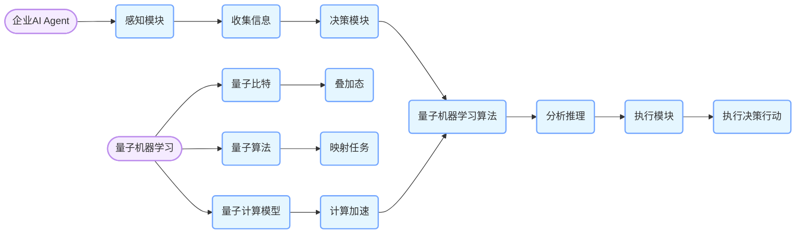

# 企业AI Agent的量子机器学习应用

> 关键词：企业AI Agent、量子机器学习、量子计算、应用场景、技术原理

> 摘要：本文围绕企业AI Agent的量子机器学习应用展开深入探讨。首先介绍了相关背景，包括目的范围、预期读者等内容。接着阐述了核心概念与联系，通过文本示意图和Mermaid流程图进行清晰展示。详细讲解了核心算法原理，用Python代码进行了说明，并给出了数学模型和公式。通过项目实战，从开发环境搭建到源代码实现及解读进行了全面分析。探讨了实际应用场景，推荐了相关的工具和资源，最后总结了未来发展趋势与挑战，还给出了常见问题解答和扩展阅读参考资料，旨在为企业在AI Agent中应用量子机器学习提供全面而深入的指导。

## 1. 背景介绍 
### 1.1 目的和范围
在当今数字化快速发展的时代，企业面临着日益复杂的业务场景和海量的数据处理需求。企业AI Agent作为自动化处理企业业务流程、辅助决策的智能实体，其性能的提升对于企业的竞争力至关重要。量子机器学习结合了量子计算的强大计算能力和机器学习的智能算法，为企业AI Agent带来了新的发展机遇。本文的目的在于深入探讨量子机器学习在企业AI Agent中的应用，涵盖从理论原理到实际应用案例的多个方面，旨在为企业提供全面的技术参考和实践指导，帮助企业更好地理解和应用这一前沿技术。

### 1.2 预期读者
本文的预期读者主要包括企业的技术决策者、AI研发工程师、量子计算领域的研究者以及对企业数字化转型和新兴技术应用感兴趣的专业人士。技术决策者可以通过本文了解量子机器学习在企业AI Agent中的潜在价值和应用前景，为企业的技术战略规划提供参考；AI研发工程师可以获取具体的技术原理和实现方法，用于实际的项目开发；量子计算领域的研究者可以在本文中找到与企业应用相结合的研究方向；而对新兴技术感兴趣的专业人士则可以通过本文初步了解企业AI Agent和量子机器学习的相关知识。

### 1.3 文档结构概述
本文将按照以下结构进行阐述：首先介绍核心概念与联系，帮助读者建立对企业AI Agent和量子机器学习的基本认知；接着详细讲解核心算法原理和具体操作步骤，并给出相应的Python代码示例；然后介绍相关的数学模型和公式，并通过具体例子进行说明；通过项目实战部分，展示量子机器学习在企业AI Agent中的实际应用过程，包括开发环境搭建、源代码实现和代码解读；探讨量子机器学习在企业中的实际应用场景；推荐相关的学习资源、开发工具框架和论文著作；最后总结未来发展趋势与挑战，提供常见问题解答和扩展阅读参考资料。

### 1.4 术语表
#### 1.4.1 核心术语定义
- **企业AI Agent**：指在企业环境中运行的人工智能代理，它能够感知企业环境中的信息，自主做出决策并采取行动，以实现企业的特定目标，如业务流程自动化、智能客服等。
- **量子机器学习**：是将量子计算的原理和方法应用于机器学习领域的交叉学科。它利用量子比特的叠加和纠缠等特性，提高机器学习算法的计算效率和性能。
- **量子比特（qubit）**：是量子计算中的基本信息单元，与经典比特不同，量子比特可以同时处于0和1的叠加态，这使得量子计算机能够并行处理大量信息。
- **量子纠缠**：是量子力学中的一种现象，指两个或多个量子比特之间存在一种特殊的关联，使得一个量子比特的状态会瞬间影响其他量子比特的状态，无论它们之间的距离有多远。

#### 1.4.2 相关概念解释
- **量子计算**：基于量子力学原理进行计算的新型计算模式，通过操纵量子比特的状态来实现计算任务。与经典计算相比，量子计算在某些问题上具有指数级的计算速度优势。
- **机器学习**：是一门多领域交叉学科，涉及概率论、统计学、逼近论、凸分析、算法复杂度理论等多门学科。它专门研究计算机怎样模拟或实现人类的学习行为，以获取新的知识或技能，重新组织已有的知识结构使之不断改善自身的性能。

#### 1.4.3 缩略词列表
- **QML**：Quantum Machine Learning，量子机器学习
- **AI**：Artificial Intelligence，人工智能
- **QC**：Quantum Computing，量子计算

## 2. 核心概念与联系 

### 企业AI Agent概述
企业AI Agent是企业数字化转型的重要工具，它可以在企业的各个业务环节中发挥作用。从业务流程自动化角度来看，企业AI Agent可以自动处理繁琐的日常任务，如数据录入、报表生成等，提高工作效率；在智能客服方面，它可以通过自然语言处理技术与客户进行交互，解答客户的问题，提供个性化的服务。企业AI Agent通常由感知模块、决策模块和执行模块组成。感知模块负责收集企业环境中的信息，如市场数据、客户反馈等；决策模块根据感知到的信息进行分析和推理，做出相应的决策；执行模块则将决策转化为实际的行动。

### 量子机器学习概述
量子机器学习是量子计算与机器学习的融合产物。传统的机器学习算法在处理大规模数据和复杂问题时往往面临计算资源和时间的限制。而量子机器学习利用量子计算的独特特性，如量子比特的叠加和纠缠，可以在某些问题上实现指数级的加速。例如，在量子支持向量机中，通过量子态的表示和操作，可以更高效地进行数据分类。量子机器学习的核心在于设计合适的量子算法，将机器学习任务映射到量子计算模型上。

### 企业AI Agent与量子机器学习的联系
企业AI Agent在处理复杂的业务场景和海量数据时，需要强大的计算能力和高效的算法支持。量子机器学习的出现为企业AI Agent带来了新的发展机遇。量子机器学习可以提高企业AI Agent的决策速度和准确性，使其能够更快地应对市场变化和客户需求。例如，在金融领域的风险评估中，企业AI Agent可以利用量子机器学习算法更快速地分析大量的市场数据和客户信息，做出更准确的风险评估决策。

### 核心概念原理和架构的文本示意图
```plaintext
企业AI Agent
├── 感知模块
│   └── 收集企业环境信息（市场数据、客户反馈等）
├── 决策模块
│   └── 分析推理（借助量子机器学习算法）
└── 执行模块
    └── 执行决策行动

量子机器学习
├── 量子比特（qubit）
│   └── 叠加态表示信息
├── 量子算法
│   └── 映射机器学习任务
└── 量子计算模型
    └── 实现计算加速
```

### Mermaid流程图


## 3. 核心算法原理 & 具体操作步骤 

### 量子支持向量机（QSVM）原理
支持向量机（SVM）是一种经典的机器学习算法，用于分类和回归任务。量子支持向量机（QSVM）则是将SVM的思想与量子计算相结合。在经典SVM中，通过寻找最优的超平面来对数据进行分类。而在QSVM中，利用量子态的特性来表示数据和计算核函数。

#### 核心思想
假设我们有一组训练数据 $\{(x_1, y_1), (x_2, y_2), \cdots, (x_n, y_n)\}$，其中 $x_i$ 是输入数据，$y_i \in \{-1, 1\}$ 是对应的标签。QSVM的目标是找到一个超平面 $w^T x + b = 0$，使得不同类别的数据能够被正确分开，并且间隔最大。在量子计算中，我们可以用量子态来表示数据点 $x_i$，并通过量子门操作来计算核函数 $K(x_i, x_j)$。

#### Python代码实现
```python
import numpy as np
from qiskit import QuantumCircuit, Aer, execute

# 生成随机训练数据
np.random.seed(42)
n_samples = 4
n_features = 2
X = np.random.randn(n_samples, n_features)
y = np.random.choice([-1, 1], n_samples)

# 量子编码函数
def quantum_encoding(x):
    num_qubits = len(x)
    qc = QuantumCircuit(num_qubits)
    for i in range(num_qubits):
        qc.rx(x[i], i)
    return qc

# 计算量子核函数
def quantum_kernel(x1, x2):
    qc1 = quantum_encoding(x1)
    qc2 = quantum_encoding(x2)
    qc = qc1.compose(qc2.inverse())
    qc.measure_all()
    backend = Aer.get_backend('qasm_simulator')
    job = execute(qc, backend, shots=1024)
    result = job.result()
    counts = result.get_counts(qc)
    probability = counts.get('0' * len(x1), 0) / 1024
    return probability

# 构建核矩阵
K = np.zeros((n_samples, n_samples))
for i in range(n_samples):
    for j in range(n_samples):
        K[i, j] = quantum_kernel(X[i], X[j])

print("量子核矩阵:")
print(K)
```

### 具体操作步骤
1. **数据准备**：收集企业相关的数据，并进行预处理，如归一化、特征选择等。
2. **量子编码**：将经典数据编码为量子态，常用的编码方法有角度编码、振幅编码等。
3. **计算量子核函数**：通过量子电路计算数据点之间的核函数值，构建核矩阵。
4. **训练模型**：利用核矩阵和标签数据训练量子支持向量机模型，求解最优的超平面参数。
5. **模型评估**：使用测试数据对训练好的模型进行评估，计算准确率、召回率等指标。
6. **应用部署**：将训练好的模型部署到企业AI Agent中，用于实际的业务决策。

## 4. 数学模型和公式 & 详细讲解 & 举例说明 

### 量子态表示
在量子计算中，一个量子比特可以用二维复向量空间中的向量来表示。一个单量子比特的状态可以表示为：
$$|\psi\rangle = \alpha |0\rangle + \beta |1\rangle$$
其中，$\alpha$ 和 $\beta$ 是复数，满足 $|\alpha|^2 + |\beta|^2 = 1$。$|0\rangle$ 和 $|1\rangle$ 是基态向量，分别表示经典比特的0和1。

例如，当 $\alpha = \frac{1}{\sqrt{2}}$，$\beta = \frac{1}{\sqrt{2}}$ 时，量子比特处于 $|0\rangle$ 和 $|1\rangle$ 的等概率叠加态：
$$|\psi\rangle = \frac{1}{\sqrt{2}} |0\rangle + \frac{1}{\sqrt{2}} |1\rangle$$

### 量子门操作
量子门是量子计算中用于操纵量子比特状态的基本操作。常见的量子门有Pauli门（$X$、$Y$、$Z$）、Hadamard门（$H$）等。

#### Hadamard门
Hadamard门是一个单量子比特门，其矩阵表示为：
$$H = \frac{1}{\sqrt{2}} \begin{bmatrix} 1 & 1 \\ 1 & -1 \end{bmatrix}$$
当对基态 $|0\rangle$ 应用Hadamard门时：
$$H|0\rangle = \frac{1}{\sqrt{2}} \begin{bmatrix} 1 & 1 \\ 1 & -1 \end{bmatrix} \begin{bmatrix} 1 \\ 0 \end{bmatrix} = \frac{1}{\sqrt{2}} |0\rangle + \frac{1}{\sqrt{2}} |1\rangle$$

#### Pauli-X门
Pauli-X门的矩阵表示为：
$$X = \begin{bmatrix} 0 & 1 \\ 1 & 0 \end{bmatrix}$$
当对基态 $|0\rangle$ 应用Pauli-X门时：
$$X|0\rangle = \begin{bmatrix} 0 & 1 \\ 1 & 0 \end{bmatrix} \begin{bmatrix} 1 \\ 0 \end{bmatrix} = |1\rangle$$

### 量子支持向量机的数学模型
在量子支持向量机中，目标是求解以下优化问题：
$$\min_{\alpha} \frac{1}{2} \sum_{i=1}^{n} \sum_{j=1}^{n} \alpha_i \alpha_j y_i y_j K(x_i, x_j) - \sum_{i=1}^{n} \alpha_i$$
subject to:
$$\sum_{i=1}^{n} \alpha_i y_i = 0$$
$$0 \leq \alpha_i \leq C, \quad i = 1, 2, \cdots, n$$
其中，$\alpha_i$ 是拉格朗日乘子，$K(x_i, x_j)$ 是量子核函数，$C$ 是惩罚参数。

求解上述优化问题后，可以得到最优的拉格朗日乘子 $\alpha_i^*$，进而得到超平面的参数 $w$ 和 $b$：
$$w = \sum_{i=1}^{n} \alpha_i^* y_i x_i$$
$$b = y_j - \sum_{i=1}^{n} \alpha_i^* y_i K(x_i, x_j)$$
其中，$j$ 是任意一个支持向量的索引。

### 举例说明
假设我们有两个数据点 $x_1 = [0.5, 0.5]$ 和 $x_2 = [-0.5, -0.5]$，对应的标签 $y_1 = 1$，$y_2 = -1$。我们使用角度编码将数据点编码为量子态：
$$|\psi_1\rangle = R_x(0.5)|0\rangle \otimes R_x(0.5)|0\rangle$$
$$|\psi_2\rangle = R_x(-0.5)|0\rangle \otimes R_x(-0.5)|0\rangle$$
然后计算量子核函数 $K(x_1, x_2) = |\langle\psi_1|\psi_2\rangle|^2$。通过量子电路模拟计算得到 $K(x_1, x_2)$ 的值，再代入量子支持向量机的优化问题中求解，最终得到分类超平面。

## 5. 项目实战：代码实际案例和详细解释说明 

### 5.1  开发环境搭建
#### 安装Python
首先需要安装Python，建议使用Python 3.7及以上版本。可以从Python官方网站（https://www.python.org/downloads/）下载安装包进行安装。

#### 安装Qiskit
Qiskit是一个开源的量子计算框架，用于开发和运行量子算法。可以使用pip命令进行安装：
```sh
pip install qiskit
```

#### 安装其他依赖库
还需要安装一些其他的依赖库，如NumPy、Matplotlib等：
```sh
pip install numpy matplotlib
```

### 5.2  源代码详细实现和代码解读
```python
import numpy as np
from qiskit import QuantumCircuit, Aer, execute
from sklearn.datasets import make_classification
from sklearn.model_selection import train_test_split
from sklearn.preprocessing import StandardScaler

# 生成分类数据集
X, y = make_classification(n_samples=100, n_features=2, n_informative=2, n_redundant=0, random_state=42)
y[y == 0] = -1  # 将标签转换为{-1, 1}

# 数据预处理
scaler = StandardScaler()
X = scaler.fit_transform(X)

# 划分训练集和测试集
X_train, X_test, y_train, y_test = train_test_split(X, y, test_size=0.2, random_state=42)

# 量子编码函数
def quantum_encoding(x):
    num_qubits = len(x)
    qc = QuantumCircuit(num_qubits)
    for i in range(num_qubits):
        qc.rx(x[i], i)
    return qc

# 计算量子核函数
def quantum_kernel(x1, x2):
    qc1 = quantum_encoding(x1)
    qc2 = quantum_encoding(x2)
    qc = qc1.compose(qc2.inverse())
    qc.measure_all()
    backend = Aer.get_backend('qasm_simulator')
    job = execute(qc, backend, shots=1024)
    result = job.result()
    counts = result.get_counts(qc)
    probability = counts.get('0' * len(x1), 0) / 1024
    return probability

# 构建核矩阵
def build_kernel_matrix(X1, X2):
    n1 = len(X1)
    n2 = len(X2)
    K = np.zeros((n1, n2))
    for i in range(n1):
        for j in range(n2):
            K[i, j] = quantum_kernel(X1[i], X2[j])
    return K

# 训练量子支持向量机
from cvxopt import matrix, solvers
def train_qsvm(K, y):
    n = len(y)
    P = matrix(np.outer(y, y) * K)
    q = matrix(-np.ones(n))
    G = matrix(np.vstack((-np.eye(n), np.eye(n))))
    h = matrix(np.hstack((np.zeros(n), np.ones(n) * 10)))  # C = 10
    A = matrix(y.reshape(1, -1))
    b = matrix(0.0)

    sol = solvers.qp(P, q, G, h, A, b)
    alpha = np.array(sol['x']).flatten()
    return alpha

# 预测函数
def predict_qsvm(alpha, K_train_test, y_train):
    y_pred = np.dot(alpha * y_train, K_train_test)
    y_pred = np.sign(y_pred)
    return y_pred

# 构建训练核矩阵
K_train = build_kernel_matrix(X_train, X_train)

# 训练模型
alpha = train_qsvm(K_train, y_train)

# 构建测试核矩阵
K_train_test = build_kernel_matrix(X_train, X_test)

# 预测
y_pred = predict_qsvm(alpha, K_train_test, y_train)

# 计算准确率
accuracy = np.mean(y_pred == y_test)
print(f"准确率: {accuracy}")
```

### 5.3  代码解读与分析
1. **数据生成与预处理**：使用`make_classification`函数生成一个二分类数据集，并将标签转换为{-1, 1}。使用`StandardScaler`对数据进行标准化处理，确保数据的均值为0，方差为1。
2. **量子编码**：`quantum_encoding`函数将经典数据点编码为量子态，通过旋转门操作将数据的特征值编码到量子比特的相位上。
3. **量子核函数计算**：`quantum_kernel`函数通过量子电路计算两个数据点之间的核函数值。首先将两个数据点分别编码为量子态，然后将第二个量子态取逆并与第一个量子态组合，最后进行测量，根据测量结果计算概率作为核函数值。
4. **核矩阵构建**：`build_kernel_matrix`函数用于构建训练集和测试集的核矩阵，通过嵌套循环调用`quantum_kernel`函数计算每对数据点之间的核函数值。
5. **模型训练**：使用`cvxopt`库求解量子支持向量机的优化问题，得到最优的拉格朗日乘子`alpha`。
6. **预测与评估**：`predict_qsvm`函数根据训练得到的`alpha`和核矩阵对测试集进行预测，最后计算预测的准确率。

## 6. 实际应用场景 
### 金融风险评估
在金融领域，企业需要对大量的客户数据和市场数据进行分析，以评估投资风险。企业AI Agent可以利用量子机器学习算法更快速地处理这些数据，提高风险评估的准确性和效率。例如，通过量子支持向量机对客户的信用风险进行分类，能够更准确地识别高风险客户，为企业的信贷决策提供支持。

### 供应链优化
供应链管理涉及到多个环节，如采购、生产、物流等。企业AI Agent可以结合量子机器学习算法对供应链数据进行分析，优化供应链的各个环节。例如，通过量子聚类算法对供应商进行分类，选择最优的供应商组合；利用量子优化算法解决物流路径规划问题，降低物流成本。

### 市场营销
在市场营销中，企业需要了解客户的需求和偏好，制定个性化的营销策略。企业AI Agent可以利用量子机器学习算法对客户数据进行挖掘，发现潜在的客户群体和市场趋势。例如，通过量子神经网络对客户的购买行为进行预测，为企业的产品推荐和促销活动提供依据。

### 医疗诊断
在医疗领域，企业AI Agent可以结合量子机器学习算法对医疗数据进行分析，辅助医生进行疾病诊断。例如，通过量子卷积神经网络对医学影像数据进行分析，提高疾病诊断的准确率；利用量子支持向量机对基因数据进行分类，为个性化医疗提供支持。

## 7. 工具和资源推荐
### 7.1 学习资源推荐
#### 7.1.1 书籍推荐
- 《量子计算与量子信息》（*Quantum Computation and Quantum Information*）：由Michael A. Nielsen和Isaac L. Chuang所著，是量子计算领域的经典教材，全面介绍了量子计算的基本原理和算法。
- 《机器学习》（*Machine Learning*）：由Tom M. Mitchell所著，是机器学习领域的经典教材，系统地介绍了机器学习的基本概念、算法和应用。
- 《量子机器学习》（*Quantum Machine Learning*）：由Vlatko Vedral所著，专门介绍了量子机器学习的相关知识和技术。

#### 7.1.2 在线课程
- Coursera上的“量子计算基础”（*Foundations of Quantum Computing*）课程：由马里兰大学提供，介绍了量子计算的基本原理和编程方法。
- edX上的“机器学习”（*Machine Learning*）课程：由斯坦福大学提供，是一门经典的机器学习入门课程。
- Qiskit官方提供的在线教程：涵盖了量子计算的基础知识和Qiskit框架的使用方法。

#### 7.1.3 技术博客和网站
- Qiskit官方博客（https://qiskit.org/blog/）：提供了量子计算领域的最新技术动态和研究成果。
- Medium上的量子计算和机器学习相关博客：有很多专业人士分享的技术文章和实践经验。
- arXiv（https://arxiv.org/）：是一个预印本服务器，提供了大量的量子计算和机器学习领域的研究论文。

### 7.2 开发工具框架推荐
#### 7.2.1 IDE和编辑器
- PyCharm：是一款专业的Python集成开发环境，提供了丰富的代码编辑、调试和项目管理功能。
- Jupyter Notebook：是一个交互式的开发环境，适合进行数据探索和算法实验。
- Visual Studio Code：是一款轻量级的代码编辑器，支持多种编程语言和插件扩展。

#### 7.2.2 调试和性能分析工具
- Qiskit的调试工具：Qiskit提供了一些调试工具，如`plot_histogram`函数用于可视化量子电路的测量结果。
- Python的`cProfile`模块：可以用于分析Python代码的性能瓶颈。
- PyTorch的性能分析工具：如果使用PyTorch进行量子机器学习开发，可以使用其提供的性能分析工具进行代码优化。

#### 7.2.3 相关框架和库
- Qiskit：是一个开源的量子计算框架，提供了丰富的量子算法和工具，支持多种量子硬件平台。
- PennyLane：是一个用于量子机器学习的开源库，支持多种量子计算后端和机器学习框架。
- TensorFlow Quantum：是Google开发的用于量子机器学习的框架，与TensorFlow集成，方便进行量子神经网络的开发。

### 7.3 相关论文著作推荐
#### 7.3.1 经典论文
- "Quantum Algorithm for Linear Systems of Equations"（线性方程组的量子算法）：提出了一种量子算法，用于求解线性方程组，在某些情况下具有指数级的加速。
- "Support Vector Machines and Kernel Methods: The New Generation of Learning Machines"（支持向量机和核方法：新一代学习机器）：介绍了支持向量机和核方法的基本原理和应用。
- "Quantum Machine Learning: What Quantum Computing Means to Data Mining"（量子机器学习：量子计算对数据挖掘的意义）：探讨了量子机器学习的概念和潜在应用。

#### 7.3.2 最新研究成果
- 关注arXiv上关于量子机器学习的最新论文，了解该领域的最新研究动态和技术进展。
- 参加国际量子计算和机器学习相关的学术会议，如NeurIPS、ICML等，获取最新的研究成果。

#### 7.3.3 应用案例分析
- 一些企业和研究机构会发布关于量子机器学习在实际应用中的案例分析报告，可以通过相关的技术博客和网站获取这些案例，学习实际应用中的经验和技巧。

## 8. 总结：未来发展趋势与挑战
### 未来发展趋势
- **技术融合**：量子机器学习将与其他新兴技术，如人工智能、区块链、物联网等进行深度融合，创造出更多的创新应用场景。例如，在物联网领域，量子机器学习可以用于处理海量的传感器数据，提高物联网系统的智能化水平。
- **硬件发展**：随着量子计算硬件技术的不断发展，量子比特的数量和稳定性将不断提高，这将为量子机器学习的大规模应用提供更强大的计算支持。未来可能会出现专门用于量子机器学习的量子计算芯片。
- **行业应用拓展**：量子机器学习将在更多的行业得到应用，如能源、交通、教育等。企业将越来越重视量子机器学习技术，将其作为提升竞争力的重要手段。

### 挑战
- **硬件限制**：目前量子计算硬件还存在一些问题，如量子比特的退相干时间短、噪声大等，这限制了量子机器学习算法的规模和性能。需要进一步提高量子计算硬件的稳定性和可靠性。
- **算法设计**：设计高效的量子机器学习算法仍然是一个挑战。目前大多数量子机器学习算法还处于理论研究阶段，需要进一步优化和改进，以适应实际应用的需求。
- **人才短缺**：量子机器学习是一个交叉学科领域，需要既懂量子计算又懂机器学习的复合型人才。目前这类人才非常短缺，需要加强相关的教育和培训。

## 9. 附录：常见问题与解答
### 问题1：量子机器学习与经典机器学习有什么区别？
答：量子机器学习利用量子计算的特性，如量子比特的叠加和纠缠，在某些问题上可以实现指数级的计算加速。而经典机器学习则基于经典计算机的计算原理，在处理大规模数据和复杂问题时可能面临计算资源和时间的限制。

### 问题2：企业AI Agent应用量子机器学习需要具备哪些条件？
答：企业需要具备一定的技术基础，包括量子计算和机器学习的相关知识和技能。此外，还需要有合适的硬件设备或云平台支持量子计算，以及足够的企业数据用于模型训练。

### 问题3：量子机器学习算法的可解释性如何？
答：目前量子机器学习算法的可解释性是一个研究热点。由于量子计算的特殊性，量子机器学习算法的可解释性相对较差。一些研究人员正在探索如何提高量子机器学习算法的可解释性，例如通过可视化和特征重要性分析等方法。

### 问题4：量子机器学习的安全性如何？
答：量子机器学习在安全性方面既有优势也有挑战。一方面，量子加密技术可以为量子机器学习提供更高级别的安全保障；另一方面，量子计算也可能对现有的加密算法构成威胁。需要进一步研究和开发适用于量子机器学习的安全技术。

## 10. 扩展阅读 & 参考资料
- Nielsen, M. A., & Chuang, I. L. (2000). *Quantum Computation and Quantum Information*. Cambridge University Press.
- Mitchell, T. M. (1997). *Machine Learning*. McGraw-Hill.
- Vedral, V. (2018). *Quantum Machine Learning*. Oxford University Press.
- Qiskit官方文档（https://qiskit.org/documentation/）
- PennyLane官方文档（https://pennylane.ai/）
- TensorFlow Quantum官方文档（https://www.tensorflow.org/quantum）

作者：AI天才研究院/AI Genius Institute & 禅与计算机程序设计艺术 /Zen And The Art of Computer Programming