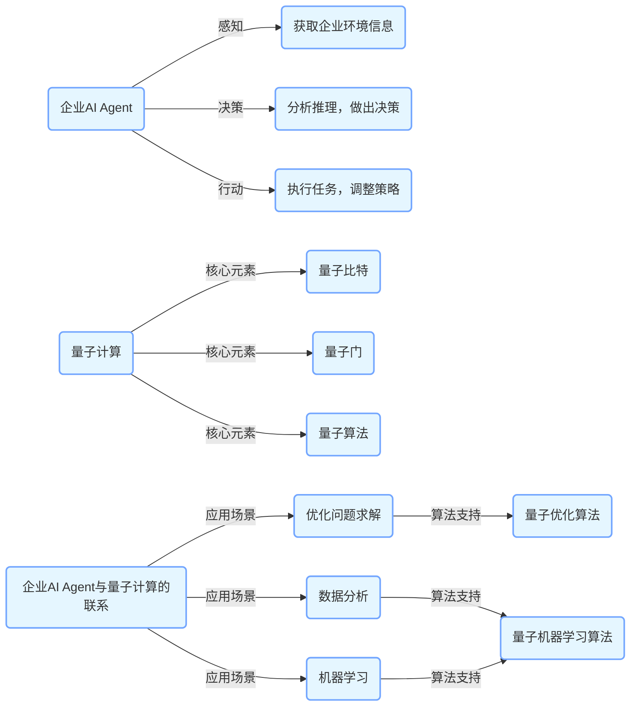

# 企业AI Agent的量子计算潜在应用探索

> 关键词：企业AI Agent、量子计算、潜在应用、算法原理、实战案例

> 摘要：本文旨在深入探索企业AI Agent与量子计算的融合，全面剖析量子计算在企业AI Agent中的潜在应用。首先介绍了研究的背景、目的、预期读者等内容，接着阐述了企业AI Agent和量子计算的核心概念及联系，详细讲解了相关核心算法原理和具体操作步骤，给出了数学模型和公式并举例说明。通过项目实战展示代码案例及解读，分析了实际应用场景。同时推荐了学习资源、开发工具框架和相关论文著作。最后总结了未来发展趋势与挑战，还提供了常见问题解答和扩展阅读参考资料，为企业在这一前沿领域的探索提供了全面而深入的指导。

## 1. 背景介绍 
### 1.1 目的和范围
随着人工智能和量子计算技术的飞速发展，企业对于如何利用这些新兴技术提升自身竞争力有着强烈的需求。本研究的目的在于探索量子计算在企业AI Agent中的潜在应用，为企业在技术创新和业务拓展方面提供思路。研究范围涵盖了企业AI Agent的基本概念、量子计算的原理和技术，以及两者结合可能产生的各种应用场景，包括但不限于优化问题求解、数据分析、机器学习等领域。

### 1.2 预期读者
本文的预期读者主要包括企业的技术决策者、AI开发者、量子计算研究人员以及对新兴技术在企业应用感兴趣的专业人士。对于企业技术决策者，本文可以帮助他们了解量子计算与企业AI Agent结合的潜在价值，为企业的技术战略规划提供参考；对于AI开发者和量子计算研究人员，本文提供了具体的算法原理、代码实现和应用案例，有助于他们在实际项目中进行技术创新；对于对新兴技术感兴趣的专业人士，本文可以作为了解企业AI Agent和量子计算融合的科普读物。

### 1.3 文档结构概述
本文共分为十个部分。第一部分为背景介绍，阐述了研究的目的、范围、预期读者和文档结构。第二部分介绍企业AI Agent和量子计算的核心概念及联系，通过文本示意图和Mermaid流程图进行说明。第三部分详细讲解核心算法原理和具体操作步骤，并使用Python源代码进行阐述。第四部分给出数学模型和公式，并进行详细讲解和举例说明。第五部分通过项目实战展示代码实际案例，并进行详细解释说明。第六部分分析企业AI Agent的量子计算潜在应用场景。第七部分推荐学习资源、开发工具框架和相关论文著作。第八部分总结未来发展趋势与挑战。第九部分为附录，提供常见问题与解答。第十部分提供扩展阅读和参考资料。

### 1.4 术语表
#### 1.4.1 核心术语定义
- **企业AI Agent**：是指在企业环境中运行的人工智能实体，它能够感知环境、做出决策并采取行动，以实现企业的特定目标。企业AI Agent可以基于不同的技术架构和算法实现，如机器学习、深度学习等。
- **量子计算**：是一种基于量子力学原理的计算方式，它利用量子比特（qubit）的特性，如叠加和纠缠，来实现并行计算，从而在某些问题上具有比经典计算更高的计算效率。
- **量子比特（qubit）**：是量子计算中的基本信息单位，与经典比特（bit）不同，量子比特可以同时处于0和1的叠加态，这使得量子计算机能够同时处理多个计算任务。

#### 1.4.2 相关概念解释
- **量子叠加**：是量子比特的一种特性，它允许量子比特同时处于多个状态的叠加。例如，一个量子比特可以同时处于0态、1态或它们的任意线性组合态。
- **量子纠缠**：是指两个或多个量子比特之间存在一种特殊的关联，使得一个量子比特的状态变化会立即影响到其他纠缠量子比特的状态，无论它们之间的距离有多远。
- **量子门**：是量子计算中用于操作量子比特的基本逻辑单元，类似于经典计算中的逻辑门。常见的量子门包括单量子比特门（如Pauli门、Hadamard门等）和多量子比特门（如CNOT门等）。

#### 1.4.3 缩略词列表
- **AI**：Artificial Intelligence，人工智能
- **QC**：Quantum Computing，量子计算
- **qubit**：Quantum Bit，量子比特

## 2. 核心概念与联系 

### 企业AI Agent的核心概念
企业AI Agent是企业级的智能实体，它可以集成多种人工智能技术，如机器学习、自然语言处理、计算机视觉等，以实现对企业业务流程的自动化和优化。企业AI Agent通常具有以下特点：
- **感知能力**：能够通过各种传感器或接口获取企业环境中的信息，如市场数据、客户反馈、生产数据等。
- **决策能力**：基于感知到的信息，运用人工智能算法进行分析和推理，做出合理的决策。
- **行动能力**：根据决策结果，采取相应的行动，如执行任务、调整策略、与其他系统或人员进行交互等。

### 量子计算的核心概念
量子计算是一种基于量子力学原理的新型计算方式。与经典计算不同，量子计算使用量子比特作为信息载体，利用量子比特的叠加和纠缠特性实现并行计算。量子计算的核心概念包括：
- **量子比特**：量子比特是量子计算中的基本信息单位，它可以同时处于0和1的叠加态，这使得量子计算机能够同时处理多个计算任务。
- **量子门**：量子门是量子计算中用于操作量子比特的基本逻辑单元，通过对量子比特施加不同的量子门操作，可以实现各种量子算法。
- **量子算法**：量子算法是基于量子计算原理设计的算法，它利用量子比特的叠加和纠缠特性，在某些问题上具有比经典算法更高的计算效率。

### 企业AI Agent与量子计算的联系
企业AI Agent与量子计算的结合可以为企业带来巨大的潜在价值。量子计算的强大计算能力可以为企业AI Agent提供更高效的算法支持，从而提升企业AI Agent的性能和决策能力。具体来说，量子计算可以在以下方面为企业AI Agent提供支持：
- **优化问题求解**：企业中存在许多优化问题，如供应链优化、资源分配优化等。量子计算可以通过量子优化算法，如量子退火算法、量子近似优化算法等，更高效地求解这些优化问题，为企业AI Agent提供更优的决策方案。
- **数据分析**：企业拥有大量的数据，如何从这些数据中提取有价值的信息是企业面临的一个重要挑战。量子计算可以通过量子机器学习算法，如量子支持向量机、量子神经网络等，更高效地处理和分析这些数据，为企业AI Agent提供更准确的数据分析结果。
- **机器学习**：机器学习是企业AI Agent的核心技术之一。量子计算可以通过量子机器学习算法，如量子梯度下降算法、量子变分算法等，加速机器学习模型的训练过程，提高机器学习模型的性能。

### 文本示意图
```plaintext
企业AI Agent
|-- 感知能力
|   |-- 获取企业环境信息
|-- 决策能力
|   |-- 分析推理，做出决策
|-- 行动能力
|   |-- 执行任务，调整策略

量子计算
|-- 量子比特
|   |-- 叠加态
|-- 量子门
|   |-- 操作量子比特
|-- 量子算法
|   |-- 利用叠加和纠缠特性

企业AI Agent与量子计算的联系
|-- 优化问题求解
|   |-- 量子优化算法
|-- 数据分析
|   |-- 量子机器学习算法
|-- 机器学习
|   |-- 量子机器学习算法
```

### Mermaid流程图


## 3. 核心算法原理 & 具体操作步骤 

### 量子优化算法：量子退火算法原理
量子退火算法是一种基于量子力学原理的优化算法，它通过模拟量子系统的退火过程来寻找优化问题的最优解。量子退火算法的基本思想是将优化问题映射到一个量子系统的哈密顿量上，通过对量子系统进行退火操作，使系统从一个高能量状态逐渐演化到一个低能量状态，最终达到系统的基态，基态对应的解即为优化问题的最优解。

### 具体操作步骤
1. **问题映射**：将优化问题转化为一个量子系统的哈密顿量 $H$。例如，对于一个组合优化问题，可以将其映射到一个自旋玻璃模型的哈密顿量上。
2. **初始态制备**：制备量子系统的初始态 $|\psi_0\rangle$，通常选择一个简单的态，如所有量子比特都处于 $|+\rangle$ 态。
3. **退火过程**：在一定的时间 $T$ 内，对量子系统施加一个随时间变化的哈密顿量 $H(t)$，使系统从初始态 $|\psi_0\rangle$ 逐渐演化到最终态 $|\psi_T\rangle$。退火过程可以通过薛定谔方程来描述：
   $$i\hbar\frac{d}{dt}|\psi(t)\rangle = H(t)|\psi(t)\rangle$$
4. **测量**：对最终态 $|\psi_T\rangle$ 进行测量，得到量子系统的一个经典态，该经典态对应的解即为优化问题的近似最优解。

### Python源代码实现
```python
import numpy as np
from openqaoa.problems import MinimumVertexCover
from openqaoa import QAOA

# 定义一个图
edges = [(0, 1), (1, 2), (2, 0)]
problem = MinimumVertexCover(graph=edges, field=1.0, penalty=10).get_qubo_problem()

# 创建QAOA对象
qaoa = QAOA()
qaoa.set_circuit_properties(p=1, param_type='standard', init_type='rand')
qaoa.compile(problem)

# 优化参数
qaoa.optimize()

# 获取结果
result = qaoa.result
print("最优解:", result.most_probable_states)
```
### 代码解释
1. **问题定义**：使用 `openqaoa` 库定义一个最小顶点覆盖问题，该问题是一个经典的组合优化问题。
2. **创建QAOA对象**：QAOA（量子近似优化算法）是一种基于量子退火思想的量子算法，用于求解组合优化问题。
3. **设置电路属性**：设置QAOA电路的层数 $p$、参数类型和初始参数。
4. **编译问题**：将问题编译成QAOA可以处理的形式。
5. **优化参数**：使用优化算法对QAOA的参数进行优化。
6. **获取结果**：获取优化后的结果，即问题的近似最优解。

## 4. 数学模型和公式 & 详细讲解 & 举例说明 

### 量子比特的数学表示
量子比特是量子计算中的基本信息单位，它可以用一个二维复向量空间中的向量来表示。一个量子比特的状态可以表示为：
$$|\psi\rangle = \alpha|0\rangle + \beta|1\rangle$$
其中，$\alpha$ 和 $\beta$ 是复数，满足 $|\alpha|^2 + |\beta|^2 = 1$。$|0\rangle$ 和 $|1\rangle$ 是量子比特的两个基态，分别对应经典比特的0和1。

### 量子门的数学表示
量子门是量子计算中用于操作量子比特的基本逻辑单元，它可以用一个幺正矩阵来表示。例如，Hadamard门是一个常用的单量子比特门，它的矩阵表示为：
$$H = \frac{1}{\sqrt{2}}\begin{bmatrix}1 & 1\\1 & -1\end{bmatrix}$$
对一个量子比特 $|\psi\rangle = \alpha|0\rangle + \beta|1\rangle$ 施加Hadamard门的操作可以表示为：
$$H|\psi\rangle = \frac{1}{\sqrt{2}}\begin{bmatrix}1 & 1\\1 & -1\end{bmatrix}\begin{bmatrix}\alpha\\\beta\end{bmatrix} = \frac{\alpha + \beta}{\sqrt{2}}|0\rangle + \frac{\alpha - \beta}{\sqrt{2}}|1\rangle$$

### 量子算法的数学模型：量子退火算法
量子退火算法的核心是通过对量子系统的哈密顿量进行退火操作来寻找优化问题的最优解。量子系统的哈密顿量可以表示为：
$$H(t) = (1 - \frac{t}{T})H_0 + \frac{t}{T}H_p$$
其中，$H_0$ 是初始哈密顿量，$H_p$ 是问题哈密顿量，$T$ 是退火时间，$t$ 是当前时间。初始哈密顿量 $H_0$ 通常选择一个简单的哈密顿量，使得系统的基态容易制备；问题哈密顿量 $H_p$ 是与优化问题相关的哈密顿量，其基态对应优化问题的最优解。

### 举例说明
考虑一个简单的二量子比特优化问题，目标是找到一个量子态，使得某个函数 $f(x_1, x_2)$ 取得最小值。我们可以将这个问题映射到一个量子系统的哈密顿量上：
$$H_p = f(x_1, x_2)\begin{bmatrix}1 & 0 & 0 & 0\\0 & 1 & 0 & 0\\0 & 0 & 1 & 0\\0 & 0 & 0 & 1\end{bmatrix}$$
其中，$x_1$ 和 $x_2$ 分别是两个量子比特的取值。初始哈密顿量可以选择为：
$$H_0 = \sigma_x^1 + \sigma_x^2$$
其中，$\sigma_x^i$ 是第 $i$ 个量子比特的Pauli-X门。通过对量子系统施加随时间变化的哈密顿量 $H(t)$，并在退火结束后对系统进行测量，我们可以得到优化问题的近似最优解。

## 5. 项目实战：代码实际案例和详细解释说明 

### 5.1  开发环境搭建
#### 安装Python
首先，需要安装Python环境。建议使用Python 3.7及以上版本。可以从Python官方网站（https://www.python.org/downloads/）下载并安装Python。

#### 安装必要的库
为了实现量子计算和企业AI Agent相关的代码，需要安装一些必要的库，如 `qiskit`、`openqaoa` 等。可以使用以下命令进行安装：
```sh
pip install qiskit openqaoa
```

### 5.2  源代码详细实现和代码解读
#### 案例：使用量子退火算法求解旅行商问题
旅行商问题（TSP）是一个经典的组合优化问题，目标是找到一条经过所有城市且每个城市仅经过一次的最短路径。以下是使用 `openqaoa` 库实现量子退火算法求解TSP的代码：
```python
import numpy as np
from openqaoa.problems import TSP
from openqaoa import QAOA

# 定义城市坐标
coordinates = np.array([[0, 0], [1, 1], [2, 2]])

# 创建TSP问题实例
tsp_problem = TSP(coordinates=coordinates).get_qubo_problem()

# 创建QAOA对象
qaoa = QAOA()
qaoa.set_circuit_properties(p=1, param_type='standard', init_type='rand')
qaoa.compile(tsp_problem)

# 优化参数
qaoa.optimize()

# 获取结果
result = qaoa.result
print("最优路径:", result.most_probable_states)
```
#### 代码解读
1. **导入必要的库**：导入 `numpy`、`openqaoa` 等库。
2. **定义城市坐标**：使用 `numpy` 数组定义城市的坐标。
3. **创建TSP问题实例**：使用 `openqaoa` 库的 `TSP` 类创建一个TSP问题实例，并将其转换为QUBO（二次无约束二进制优化）问题。
4. **创建QAOA对象**：创建一个QAOA对象，并设置电路属性，如层数 $p$、参数类型和初始参数。
5. **编译问题**：将TSP问题编译成QAOA可以处理的形式。
6. **优化参数**：使用优化算法对QAOA的参数进行优化。
7. **获取结果**：获取优化后的结果，即TSP问题的近似最优路径。

### 5.3  代码解读与分析
#### 复杂度分析
量子退火算法求解TSP问题的时间复杂度与问题的规模和退火时间有关。在理想情况下，量子退火算法可以在多项式时间内求解TSP问题，而经典算法（如暴力搜索算法）的时间复杂度是指数级的。

#### 结果分析
由于量子退火算法是一种近似算法，得到的结果可能不是全局最优解，而是近似最优解。可以通过增加退火时间、增加QAOA电路的层数等方法来提高结果的精度。

## 6. 实际应用场景 
### 供应链优化
企业的供应链涉及到多个环节，如采购、生产、运输等，如何优化供应链的成本和效率是企业面临的一个重要问题。量子计算可以通过量子优化算法，如量子退火算法、量子近似优化算法等，更高效地求解供应链优化问题，如车辆路径规划、库存管理、生产调度等。例如，量子退火算法可以在短时间内找到车辆的最优路径，从而降低运输成本和时间。

### 金融风险分析
金融领域存在大量的风险分析问题，如投资组合优化、信用风险评估等。量子计算可以通过量子机器学习算法，如量子支持向量机、量子神经网络等，更高效地处理和分析金融数据，从而提高风险分析的准确性和效率。例如，量子支持向量机可以在处理高维金融数据时具有更高的分类精度和更快的训练速度。

### 客户关系管理
企业的客户关系管理涉及到客户信息的收集、分析和挖掘，如何更好地了解客户需求、提高客户满意度是企业面临的一个重要问题。量子计算可以通过量子数据分析算法，如量子主成分分析、量子聚类算法等，更高效地处理和分析客户数据，从而发现客户的潜在需求和行为模式。例如，量子聚类算法可以在处理大规模客户数据时具有更高的聚类精度和更快的计算速度。

### 药物研发
药物研发是一个复杂而耗时的过程，需要进行大量的分子模拟和筛选。量子计算可以通过量子化学算法，如量子蒙特卡罗方法、量子变分算法等，更高效地进行分子模拟和筛选，从而加速药物研发的进程。例如，量子蒙特卡罗方法可以在处理复杂分子体系时具有更高的计算精度和更快的计算速度。

## 7. 工具和资源推荐
### 7.1 学习资源推荐
#### 7.1.1 书籍推荐
- 《量子计算与量子信息》（Quantum Computation and Quantum Information）：由Michael A. Nielsen和Isaac L. Chuang所著，是量子计算领域的经典教材，全面介绍了量子计算的基本概念、算法和应用。
- 《Python量子计算实战》（Quantum Computing for Computer Scientists）：由Noson S. Yanofsky和Mirco A. Mannucci所著，通过Python代码详细介绍了量子计算的基本原理和实现方法。
- 《企业人工智能实战》（Artificial Intelligence in Business: Insights on AI Strategy and Implementation）：由Marco Iansiti和Karim R. Lakhani所著，介绍了人工智能在企业中的应用案例和实践经验。

#### 7.1.2 在线课程
- Coursera上的“量子计算基础”（Fundamentals of Quantum Computation）课程：由加拿大滑铁卢大学的教授授课，介绍了量子计算的基本概念、算法和实验技术。
- edX上的“人工智能基础”（Foundations of Artificial Intelligence）课程：由美国加州大学伯克利分校的教授授课，介绍了人工智能的基本概念、算法和应用。
- Udemy上的“Python机器学习实战”（Python for Machine Learning and Data Science Masterclass）课程：通过Python代码详细介绍了机器学习的基本原理和实现方法。

#### 7.1.3 技术博客和网站
- Quantum Computing Report：提供量子计算领域的最新新闻、研究成果和市场动态。
- Towards Data Science：是一个专注于数据科学和人工智能的技术博客，提供了大量的技术文章和案例分析。
- Medium上的Quantum Computing Medium：是一个量子计算领域的技术社区，提供了大量的技术文章和讨论。

### 7.2 开发工具框架推荐
#### 7.2.1 IDE和编辑器
- PyCharm：是一款专业的Python集成开发环境，提供了丰富的代码编辑、调试和分析功能。
- Jupyter Notebook：是一个交互式的编程环境，适合用于数据探索、算法实现和结果展示。
- Visual Studio Code：是一款轻量级的代码编辑器，支持多种编程语言和插件扩展。

#### 7.2.2 调试和性能分析工具
- Qiskit Aqua：是IBM开发的一个量子计算软件开发工具包，提供了丰富的量子算法和调试工具。
- OpenQAOA：是一个开源的量子优化算法库，提供了量子退火算法、量子近似优化算法等多种算法的实现和调试工具。
- TensorBoard：是TensorFlow提供的一个可视化工具，用于监控和分析机器学习模型的训练过程和性能。

#### 7.2.3 相关框架和库
- Qiskit：是IBM开发的一个开源量子计算框架，提供了量子电路设计、量子算法实现和量子模拟等功能。
- PennyLane：是一个开源的量子机器学习框架，支持多种量子计算硬件和模拟器，提供了量子神经网络、量子变分算法等多种算法的实现。
- PyTorch Quantum：是Facebook开发的一个量子计算与深度学习融合的框架，提供了量子电路与神经网络的集成和训练功能。

### 7.3 相关论文著作推荐
#### 7.3.1 经典论文
- Shor, P. W. (1994). Algorithms for quantum computation: discrete logarithms and factoring. Proceedings of the 35th annual symposium on Foundations of computer science. This paper introduced Shor's algorithm, which can factorize large integers exponentially faster than classical algorithms.
- Grover, L. K. (1996). A fast quantum mechanical algorithm for database search. Proceedings of the twenty-eighth annual ACM symposium on Theory of computing. This paper introduced Grover's algorithm, which can search an unsorted database quadratically faster than classical algorithms.

#### 7.3.2 最新研究成果
- Arute, F., et al. (2019). Quantum supremacy using a programmable superconducting processor. Nature, 574(7779), 505-510. This paper reported the first experimental demonstration of quantum supremacy using a programmable superconducting processor.
- Cerezo, M., et al. (2021). Variational quantum algorithms. Nature Reviews Physics, 3(9), 625-644. This paper provided a comprehensive review of variational quantum algorithms, which are a class of quantum algorithms that can be implemented on near-term quantum computers.

#### 7.3.3 应用案例分析
- Barkoutsos, P. K., et al. (2019). Quantum algorithms for combinatorial optimization. npj Quantum Information, 5(1), 1-10. This paper presented several quantum algorithms for combinatorial optimization problems, such as the traveling salesman problem and the maximum cut problem, and analyzed their performance on real-world data.
- Dunjko, V., & Briegel, H. J. (2018). Quantum machine learning. Reviews of Modern Physics, 90(2), 025002. This paper provided a comprehensive review of quantum machine learning, which is a field that combines quantum computing and machine learning, and discussed its potential applications in various fields.

## 8. 总结：未来发展趋势与挑战
### 未来发展趋势
#### 技术融合加速
未来，企业AI Agent与量子计算的融合将加速发展。量子计算的强大计算能力将为企业AI Agent提供更高效的算法支持，从而提升企业AI Agent的性能和决策能力。同时，企业AI Agent的应用需求也将推动量子计算技术的不断发展和创新。

#### 应用场景拓展
随着技术的不断发展，企业AI Agent的量子计算潜在应用场景将不断拓展。除了现有的供应链优化、金融风险分析、客户关系管理和药物研发等领域，量子计算还将在更多领域为企业AI Agent提供支持，如物流配送、能源管理、智能制造等。

#### 产业生态完善
未来，企业AI Agent和量子计算的产业生态将不断完善。政府、企业、科研机构等各方将加强合作，共同推动量子计算技术的研发和应用。同时，量子计算相关的硬件设备、软件开发工具、服务提供商等产业环节也将不断发展壮大。

### 挑战
#### 技术门槛高
量子计算是一门新兴的技术，其理论和实验技术都具有较高的门槛。企业在应用量子计算技术时，需要具备一定的量子计算专业知识和技术能力，这对于大多数企业来说是一个挑战。

#### 硬件成本高
目前，量子计算硬件设备的成本仍然很高，且技术还不够成熟。企业在应用量子计算技术时，需要投入大量的资金购买和维护硬件设备，这对于企业来说是一个较大的负担。

#### 人才短缺
量子计算和企业AI Agent领域的专业人才短缺是当前面临的一个重要问题。企业在应用量子计算技术时，需要招聘和培养一批既懂量子计算又懂企业业务的复合型人才，这对于企业来说是一个挑战。

## 9. 附录：常见问题与解答
### 问题1：企业AI Agent和量子计算结合的优势是什么？
答：企业AI Agent和量子计算结合的优势主要体现在以下几个方面：
- **计算效率提升**：量子计算的并行计算能力可以为企业AI Agent提供更高效的算法支持，从而提升企业AI Agent的计算效率。
- **优化问题求解**：量子优化算法可以更高效地求解企业中的优化问题，如供应链优化、资源分配优化等，为企业AI Agent提供更优的决策方案。
- **数据分析**：量子机器学习算法可以更高效地处理和分析企业中的大量数据，为企业AI Agent提供更准确的数据分析结果。

### 问题2：量子计算技术目前的发展水平如何？
答：量子计算技术目前仍处于发展阶段，虽然已经取得了一些重要的研究成果，如量子霸权的实现、量子算法的提出等，但距离大规模商业化应用还有一定的距离。目前，量子计算硬件设备的稳定性、可靠性和可扩展性还需要进一步提高，量子算法的设计和优化也需要不断探索和创新。

### 问题3：企业如何应用量子计算技术？
答：企业应用量子计算技术可以从以下几个方面入手：
- **了解量子计算技术**：企业需要了解量子计算的基本概念、原理和应用场景，评估量子计算技术对企业业务的潜在影响。
- **与科研机构合作**：企业可以与科研机构合作，共同开展量子计算技术的研究和应用，获取最新的技术成果和解决方案。
- **培养和招聘专业人才**：企业需要培养和招聘一批既懂量子计算又懂企业业务的复合型人才，为企业应用量子计算技术提供人才支持。
- **逐步推进应用**：企业可以选择一些适合量子计算技术的业务场景进行试点应用，逐步积累经验，推动量子计算技术在企业中的广泛应用。

## 10. 扩展阅读 & 参考资料
### 扩展阅读
- 《量子比特和量子纠缠：从理论到实践》（Qubits and Quantum Entanglement: From Theory to Practice）：深入介绍了量子比特和量子纠缠的原理和应用，适合对量子计算原理感兴趣的读者。
- 《人工智能在企业数字化转型中的应用》（Artificial Intelligence in Enterprise Digital Transformation）：介绍了人工智能在企业数字化转型中的应用案例和实践经验，适合对企业数字化转型感兴趣的读者。
- 《量子计算的未来发展趋势》（Future Trends in Quantum Computing）：探讨了量子计算的未来发展趋势和挑战，适合对量子计算未来发展感兴趣的读者。

### 参考资料
- Nielsen, M. A., & Chuang, I. L. (2010). Quantum Computation and Quantum Information. Cambridge University Press.
- Yanofsky, N. S., & Mannucci, M. A. (2008). Quantum Computing for Computer Scientists. Cambridge University Press.
- Iansiti, M., & Lakhani, K. R. (2020). Artificial Intelligence in Business: Insights on AI Strategy and Implementation. Harvard Business Review Press.

作者：AI天才研究院/AI Genius Institute & 禅与计算机程序设计艺术 /Zen And The Art of Computer Programming