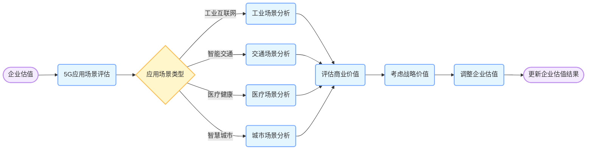

# 企业估值中的5G应用场景评估

> 关键词：企业估值、5G应用场景、评估方法、商业价值、技术影响

> 摘要：本文聚焦于企业估值中5G应用场景的评估。随着5G技术的广泛应用，其对企业的商业价值和发展潜力产生了深远影响。文章首先介绍了相关背景，包括目的范围、预期读者等。接着阐述了5G应用场景的核心概念及联系，详细讲解了核心算法原理与具体操作步骤，并给出了数学模型和公式。通过项目实战案例，深入分析了如何在实际中评估5G应用场景对企业估值的影响。同时探讨了5G应用场景的实际应用领域，推荐了相关学习资源、开发工具和论文著作。最后总结了未来发展趋势与挑战，还提供了常见问题解答和扩展阅读参考资料，旨在为企业在估值过程中准确评估5G应用场景提供全面且深入的指导。

## 1. 背景介绍 
### 1.1 目的和范围
在当今数字化时代，5G技术以其高速率、低延迟和大容量的特性，正深刻地改变着各个行业的商业模式和竞争格局。企业估值是投资决策、企业并购、资产重组等经济活动中的关键环节，而准确评估5G应用场景对企业价值的影响变得至关重要。本文的目的在于探讨如何在企业估值过程中全面、科学地评估5G应用场景的商业价值和战略意义。范围涵盖了不同行业中5G的主要应用场景，如工业互联网、智能交通、医疗健康、智慧城市等，以及这些应用场景如何影响企业的收入、成本、市场份额和未来发展潜力。

### 1.2 预期读者
本文预期读者包括金融投资领域的专业人士，如投资银行家、基金经理、风险投资家等，他们在进行企业估值和投资决策时需要考虑5G技术的影响；企业管理人员和战略规划者，帮助他们评估5G应用对企业价值的提升作用，制定合理的发展战略；以及对5G技术和企业估值感兴趣的研究人员和学者，为他们的学术研究和理论探索提供参考。

### 1.3 文档结构概述
本文将按照以下结构展开：首先介绍5G应用场景评估的背景信息，包括目的、预期读者和文档结构。接着阐述5G应用场景的核心概念，分析其与企业估值的联系，并给出相应的示意图和流程图。然后详细讲解核心算法原理和具体操作步骤，用Python代码进行示例。随后介绍相关的数学模型和公式，并举例说明。通过项目实战案例，展示如何在实际中应用这些方法进行评估。之后探讨5G应用场景的实际应用领域。推荐相关的学习资源、开发工具和论文著作。最后总结未来发展趋势与挑战，提供常见问题解答和扩展阅读参考资料。

### 1.4 术语表
#### 1.4.1 核心术语定义
- **企业估值**：指对企业的经济价值进行评估和估算，通常基于企业的财务状况、市场前景、资产质量等因素。
- **5G应用场景**：指利用5G技术的特性，在不同行业和领域中实现的具体应用方式和业务模式。
- **商业价值**：指5G应用场景为企业带来的直接或间接的经济收益，包括增加收入、降低成本、提高效率等。
- **战略价值**：指5G应用场景对企业的长期发展战略产生的积极影响，如提升企业的竞争力、拓展市场份额、增强品牌影响力等。

#### 1.4.2 相关概念解释
- **5G网络切片**：将一个物理5G网络分割成多个虚拟的逻辑网络，每个网络切片可以根据不同的应用场景和需求，提供定制化的网络服务。
- **边缘计算**：将计算和数据存储靠近数据源或用户终端，减少数据传输延迟，提高系统的响应速度和处理能力。
- **物联网（IoT）**：通过各种信息传感设备，将物品与互联网连接起来，实现物品的智能化识别、定位、跟踪、监控和管理。

#### 1.4.3 缩略词列表
- **5G**：第五代移动通信技术（5th Generation Mobile Communication Technology）
- **IoT**：物联网（Internet of Things）
- **MEC**：多接入边缘计算（Multi - Access Edge Computing）
- **VR**：虚拟现实（Virtual Reality）
- **AR**：增强现实（Augmented Reality）

## 2. 核心概念与联系 
### 核心概念原理
#### 5G技术特性
5G技术具有高速率、低延迟和大容量的特性。高速率意味着可以实现更快的数据传输，例如下载一部高清电影可能只需要几秒钟。低延迟则保证了实时通信的可靠性，在工业控制、自动驾驶等场景中，低延迟能够确保系统的及时响应，避免事故发生。大容量使得可以连接更多的设备，为物联网的大规模应用提供了可能。

#### 5G应用场景分类
- **工业互联网**：5G技术可以实现工厂内设备的实时联网和数据交互，实现智能化生产和管理。例如，通过5G网络连接的机器人可以实现协同作业，提高生产效率和质量。
- **智能交通**：在自动驾驶领域，5G的低延迟特性可以实现车辆与车辆（V2V）、车辆与基础设施（V2I）之间的实时通信，提高交通安全和效率。同时，5G还可以支持智能公交、智能物流等应用。
- **医疗健康**：远程医疗是5G在医疗领域的重要应用，通过5G网络可以实现高清视频会诊、远程手术等，打破地域限制，提高医疗资源的利用效率。
- **智慧城市**：5G可以连接城市中的各种传感器和设备，实现城市管理的智能化。例如，智能路灯可以根据环境光线和交通流量自动调节亮度，智能垃圾桶可以实时监测垃圾满溢情况。

#### 企业估值原理
企业估值通常基于企业的未来现金流折现模型（DCF）、市场比较法、资产基础法等。未来现金流折现模型是将企业未来的预期现金流按照一定的折现率折现到当前，得到企业的价值。市场比较法是通过比较同行业类似企业的市场价值，来估算目标企业的价值。资产基础法是基于企业的资产净值来评估企业的价值。

### 核心概念架构的文本示意图
```plaintext
             企业估值
                |
                | 受影响
                |
         5G应用场景
        /   |   |   \
工业互联网 智能交通 医疗健康 智慧城市
  |         |        |        |
  |         |        |        | 依赖
  |         |        |        |
 5G技术特性（高速率、低延迟、大容量）
```

### Mermaid流程图


## 3. 核心算法原理 & 具体操作步骤 
### 核心算法原理
在企业估值中评估5G应用场景，主要是通过调整企业的未来现金流和折现率来实现。具体来说，可以采用以下方法：

#### 增量现金流法
该方法通过分析5G应用场景为企业带来的额外现金流，包括增加的收入和降低的成本。假设企业在未应用5G技术时的年现金流为 $CF_0$，应用5G技术后，由于提高了生产效率、拓展了市场等原因，每年增加的现金流为 $\Delta CF$。则应用5G技术后的年现金流为 $CF = CF_0+\Delta CF$。

#### 风险调整折现率法
考虑到5G应用场景可能带来的风险和不确定性，需要对折现率进行调整。假设未考虑5G因素时的折现率为 $r_0$，由于5G应用场景的风险，需要增加一个风险溢价 $\Delta r$。则调整后的折现率为 $r = r_0+\Delta r$。

### 具体操作步骤
#### 步骤1：确定5G应用场景
分析企业所处的行业和业务特点，确定可能应用的5G场景。例如，对于制造业企业，可能的应用场景包括工业互联网、智能物流等。

#### 步骤2：评估增量现金流
- **收入增加**：分析5G应用场景如何帮助企业拓展市场、提高产品或服务的附加值，从而增加收入。例如，通过5G实现的远程运维服务可以吸引更多的客户，带来额外的收入。
- **成本降低**：评估5G应用场景如何降低企业的生产成本、运营成本等。例如，在工业生产中，通过5G实现的设备自动化控制可以减少人工成本。

#### 步骤3：确定风险溢价
考虑5G应用场景的技术风险、市场风险、竞争风险等因素，确定风险溢价 $\Delta r$。可以通过参考类似项目的历史数据、专家意见等方式来确定。

#### 步骤4：计算调整后的企业价值
使用调整后的现金流和折现率，通过未来现金流折现模型计算企业的价值。假设企业的预计经营期为 $n$ 年，则企业的价值 $V$ 可以通过以下公式计算：

$$V=\sum_{t = 1}^{n}\frac{CF_t}{(1 + r)^t}$$

其中，$CF_t$ 为第 $t$ 年的现金流，$r$ 为调整后的折现率。

### Python源代码示例
```python
import numpy as np

def calculate_enterprise_value(cf_0, delta_cf, r_0, delta_r, n):
    """
    计算应用5G技术后企业的价值
    :param cf_0: 未应用5G技术时的年现金流
    :param delta_cf: 应用5G技术后每年增加的现金流
    :param r_0: 未考虑5G因素时的折现率
    :param delta_r: 风险溢价
    :param n: 预计经营期
    :return: 企业的价值
    """
    r = r_0 + delta_r
    cf = cf_0 + delta_cf
    cash_flows = np.array([cf] * n)
    discount_factors = np.array([(1 + r) ** t for t in range(1, n + 1)])
    present_values = cash_flows / discount_factors
    enterprise_value = np.sum(present_values)
    return enterprise_value

# 示例参数
cf_0 = 1000000  # 未应用5G技术时的年现金流为100万元
delta_cf = 200000  # 应用5G技术后每年增加的现金流为20万元
r_0 = 0.1  # 未考虑5G因素时的折现率为10%
delta_r = 0.02  # 风险溢价为2%
n = 10  # 预计经营期为10年

enterprise_value = calculate_enterprise_value(cf_0, delta_cf, r_0, delta_r, n)
print(f"应用5G技术后企业的价值为: {enterprise_value} 元")
```

## 4. 数学模型和公式 & 详细讲解 & 举例说明 
### 数学模型和公式
#### 未来现金流折现模型（DCF）
$$V=\sum_{t = 1}^{n}\frac{CF_t}{(1 + r)^t}$$

其中：
- $V$ 表示企业的价值。
- $CF_t$ 表示第 $t$ 年的现金流。
- $r$ 表示折现率。
- $n$ 表示预计经营期。

#### 调整后的现金流和折现率
- **现金流**：$CF_t = CF_{0t}+\Delta CF_t$，其中 $CF_{0t}$ 为未应用5G技术时第 $t$ 年的现金流，$\Delta CF_t$ 为应用5G技术后第 $t$ 年增加的现金流。
- **折现率**：$r = r_0+\Delta r$，其中 $r_0$ 为未考虑5G因素时的折现率，$\Delta r$ 为风险溢价。

### 详细讲解
#### 未来现金流折现模型
该模型的核心思想是将企业未来的预期现金流按照一定的折现率折现到当前，得到企业的价值。折现率反映了资金的时间价值和投资的风险程度。由于未来的现金流具有不确定性，因此需要通过折现率将其调整到当前的价值。

#### 调整后的现金流和折现率
在评估5G应用场景对企业价值的影响时，需要对现金流和折现率进行调整。现金流的调整主要考虑5G应用场景带来的额外收入和成本节约。折现率的调整则考虑了5G应用场景可能带来的风险和不确定性。

### 举例说明
假设一家制造业企业未应用5G技术时，每年的现金流为 $CF_{0}=500$ 万元，预计经营期为 $n = 10$ 年，未考虑5G因素时的折现率为 $r_0=0.1$。应用5G技术后，预计每年可以增加收入200万元，同时降低成本50万元，即每年增加的现金流为 $\Delta CF = 200 + 50=250$ 万元。由于5G应用场景存在一定的技术风险和市场风险，确定风险溢价为 $\Delta r = 0.02$。

#### 计算调整后的现金流和折现率
- 调整后的现金流：$CF = CF_{0}+\Delta CF = 500 + 250 = 750$ 万元。
- 调整后的折现率：$r = r_0+\Delta r = 0.1+0.02 = 0.12$。

#### 计算企业的价值
使用未来现金流折现模型计算企业的价值：

$$V=\sum_{t = 1}^{10}\frac{750}{(1 + 0.12)^t}$$

可以使用Python代码计算：

```python
import numpy as np

cf = 750
r = 0.12
n = 10
cash_flows = np.array([cf] * n)
discount_factors = np.array([(1 + r) ** t for t in range(1, n + 1)])
present_values = cash_flows / discount_factors
enterprise_value = np.sum(present_values)
print(f"应用5G技术后企业的价值为: {enterprise_value} 万元")
```

通过计算得到企业的价值，与未应用5G技术时的价值进行比较，可以评估5G应用场景对企业价值的影响。

## 5. 项目实战：代码实际案例和详细解释说明 
### 5.1  开发环境搭建
#### 安装Python
首先需要安装Python开发环境。可以从Python官方网站（https://www.python.org/downloads/）下载适合自己操作系统的Python版本进行安装。建议安装Python 3.7及以上版本。

#### 安装必要的库
在本项目中，主要使用了 `numpy` 库进行数值计算。可以使用以下命令安装 `numpy` 库：

```sh
pip install numpy
```

### 5.2  源代码详细实现和代码解读
```python
import numpy as np

def calculate_enterprise_value(cf_0, delta_cf, r_0, delta_r, n):
    """
    计算应用5G技术后企业的价值
    :param cf_0: 未应用5G技术时的年现金流
    :param delta_cf: 应用5G技术后每年增加的现金流
    :param r_0: 未考虑5G因素时的折现率
    :param delta_r: 风险溢价
    :param n: 预计经营期
    :return: 企业的价值
    """
    r = r_0 + delta_r
    cf = cf_0 + delta_cf
    cash_flows = np.array([cf] * n)
    discount_factors = np.array([(1 + r) ** t for t in range(1, n + 1)])
    present_values = cash_flows / discount_factors
    enterprise_value = np.sum(present_values)
    return enterprise_value

# 示例参数
cf_0 = 800000  # 未应用5G技术时的年现金流为80万元
delta_cf = 150000  # 应用5G技术后每年增加的现金流为15万元
r_0 = 0.08  # 未考虑5G因素时的折现率为8%
delta_r = 0.01  # 风险溢价为1%
n = 8  # 预计经营期为8年

enterprise_value = calculate_enterprise_value(cf_0, delta_cf, r_0, delta_r, n)
print(f"应用5G技术后企业的价值为: {enterprise_value} 元")
```

### 代码解读与分析
#### 函数定义
`calculate_enterprise_value` 函数接受五个参数：`cf_0` 表示未应用5G技术时的年现金流，`delta_cf` 表示应用5G技术后每年增加的现金流，`r_0` 表示未考虑5G因素时的折现率，`delta_r` 表示风险溢价，`n` 表示预计经营期。函数内部首先计算调整后的折现率 `r` 和现金流 `cf`。

#### 现金流和折现因子计算
使用 `numpy` 数组来存储每年的现金流和折现因子。通过列表推导式生成折现因子数组，然后将现金流数组除以折现因子数组，得到每年现金流的现值。

#### 企业价值计算
将每年现金流的现值求和，得到企业的价值。最后返回企业的价值。

#### 示例参数和结果输出
在代码的最后部分，定义了示例参数，并调用 `calculate_enterprise_value` 函数计算企业的价值。将计算结果打印输出，方便查看。

## 6. 实际应用场景 
### 工业互联网
#### 智能制造
在制造业中，5G技术可以实现设备的实时联网和数据交互。通过5G网络连接的传感器可以实时采集设备的运行状态、生产数据等信息，传输到云端进行分析和处理。企业可以根据分析结果进行生产调度、设备维护等决策，提高生产效率和质量。例如，一家汽车制造企业通过应用5G技术，实现了生产线的自动化协同作业，生产效率提高了30%，产品次品率降低了20%。

#### 远程运维
5G的低延迟特性使得远程运维成为可能。企业可以通过5G网络对分布在不同地区的设备进行远程监控和维护。运维人员可以通过高清视频实时查看设备的运行情况，使用远程控制技术对设备进行操作和调试。例如，一家能源企业通过5G远程运维系统，实现了对风力发电机组的实时监控和故障诊断，降低了运维成本，提高了设备的可靠性。

### 智能交通
#### 自动驾驶
在自动驾驶领域，5G的低延迟和高可靠性是关键因素。通过5G网络，车辆可以与周围的车辆、基础设施进行实时通信，获取交通信息、路况信息等。这有助于提高自动驾驶的安全性和效率。例如，在智能交通示范区，自动驾驶车辆通过5G网络实现了车与车之间的协同驾驶，避免了交通事故的发生。

#### 智能公交和物流
5G技术可以应用于智能公交和物流领域。智能公交系统可以通过5G网络实时获取车辆的位置、运行状态等信息，实现智能调度和实时监控。物流企业可以利用5G网络实现货物的实时跟踪和配送优化。例如，一家物流企业通过应用5G技术，实现了货物的精准定位和配送路线的实时调整，提高了物流效率，降低了成本。

### 医疗健康
#### 远程医疗
远程医疗是5G在医疗领域的重要应用。通过5G网络，可以实现高清视频会诊、远程手术等。专家可以通过高清视频实时查看患者的病情，与当地医生进行远程协作。在远程手术中，5G的低延迟特性可以确保手术操作的实时性和准确性。例如，在偏远地区的医院，通过5G远程医疗系统，患者可以得到大城市专家的诊断和治疗建议。

#### 智能健康监测
5G技术可以支持智能健康监测设备的大规模应用。通过5G网络，可穿戴设备、医疗传感器等可以实时将患者的健康数据传输到医院或健康管理平台。医生可以实时监测患者的健康状况，及时发现潜在的健康问题。例如，一款基于5G的智能手环可以实时监测用户的心率、血压等生理指标，并将数据上传到云端，为用户提供个性化的健康建议。

### 智慧城市
#### 智能能源管理
在智慧城市中，5G技术可以应用于智能能源管理。通过5G网络连接的智能电表、能源传感器等设备，可以实时采集能源消耗数据，实现能源的精准计量和智能调控。例如，城市的电力部门可以根据实时能源消耗数据，调整电网的供电策略，提高能源利用效率。

#### 智能安防
5G技术可以提升城市的安防水平。通过5G网络连接的高清摄像头、智能门禁等设备，可以实现实时监控和预警。当发生异常情况时，系统可以及时将信息发送到相关部门，提高应急响应速度。例如，在城市的重要区域安装5G高清摄像头，实现对人员和车辆的实时监控，有效预防犯罪事件的发生。

## 7. 工具和资源推荐
### 7.1 学习资源推荐
#### 7.1.1 书籍推荐
- 《5G技术原理与应用》：本书详细介绍了5G技术的基本原理、关键技术和应用场景，适合对5G技术感兴趣的初学者阅读。
- 《企业估值：理论与实践》：系统阐述了企业估值的各种方法和模型，以及在实际应用中的注意事项，对于学习企业估值有很大的帮助。
- 《物联网：技术、应用与创新》：介绍了物联网的相关技术和应用场景，其中也涉及到5G与物联网的融合应用，有助于深入理解5G在物联网领域的应用。

#### 7.1.2 在线课程
- Coursera上的“5G Networks: Architecture and Technologies”：由知名高校的教授授课，深入讲解了5G网络的架构和技术原理。
- edX上的“Enterprise Valuation and Financial Modeling”：提供了企业估值和财务建模的系统课程，通过实际案例和项目练习，帮助学员掌握企业估值的方法和技巧。
- 中国大学MOOC上的“物联网技术与应用”：介绍了物联网的基础知识和应用场景，其中包含了5G在物联网中的应用案例。

#### 7.1.3 技术博客和网站
- 5G技术观察网：提供了5G技术的最新动态、研究成果和应用案例，是了解5G技术发展的重要渠道。
- 华尔街见闻：关注金融市场和企业估值领域，发布了大量关于企业估值的分析文章和研究报告。
- 开源中国：是国内知名的技术社区，有很多关于5G技术和企业数字化转型的讨论和分享。

### 7.2 开发工具框架推荐
#### 7.2.1 IDE和编辑器
- PyCharm：是一款专业的Python集成开发环境，提供了丰富的代码编辑、调试和项目管理功能，适合Python开发人员使用。
- Visual Studio Code：是一款轻量级的代码编辑器，支持多种编程语言，具有丰富的插件生态系统，可以满足不同的开发需求。

#### 7.2.2 调试和性能分析工具
- Py-Spy：是一个用于Python程序的性能分析工具，可以实时监测Python程序的CPU使用率、函数调用时间等信息，帮助开发人员找出性能瓶颈。
- PDB：是Python自带的调试器，可以在代码中设置断点，逐行调试程序，方便开发人员排查问题。

#### 7.2.3 相关框架和库
- TensorFlow：是一个开源的机器学习框架，可以用于构建和训练深度学习模型，在5G应用场景的数据分析和预测中有广泛的应用。
- Pandas：是一个用于数据处理和分析的Python库，提供了丰富的数据结构和数据分析工具，方便开发人员处理和分析大量的数据。

### 7.3 相关论文著作推荐
#### 7.3.1 经典论文
- “5G Wireless Systems for the Future”：发表于IEEE Journal on Selected Areas in Communications，全面介绍了5G无线系统的技术架构和发展趋势。
- “Valuation of High - Tech Start - Ups”：探讨了高科技初创企业的估值方法和模型，对于评估应用5G技术的初创企业价值有重要的参考价值。

#### 7.3.2 最新研究成果
- 关注IEEE Communications Magazine、ACM Transactions on Sensor Networks等顶级学术期刊，这些期刊经常发表关于5G技术和企业数字化转型的最新研究成果。

#### 7.3.3 应用案例分析
- 可以参考一些知名咨询公司的研究报告，如麦肯锡、波士顿咨询等，这些报告中包含了大量的5G应用案例分析和企业估值实践经验。

## 8. 总结：未来发展趋势与挑战
### 未来发展趋势
#### 5G与其他技术的融合
未来，5G技术将与人工智能、大数据、物联网等技术深度融合。例如，5G的高速率和低延迟特性可以为人工智能模型的训练和推理提供强大的支持，物联网设备通过5G网络可以实现更高效的数据传输和交互。这种融合将催生更多的创新应用场景，进一步提升企业的价值。

#### 垂直行业应用的深化
5G技术将在各个垂直行业得到更广泛和深入的应用。工业互联网、智能交通、医疗健康等行业将不断探索5G的应用潜力，实现产业的数字化转型和升级。例如，在工业互联网领域，5G将推动智能制造向更高水平发展，实现工厂的全面自动化和智能化。

#### 商业模式的创新
随着5G应用场景的不断拓展，将涌现出更多新的商业模式。例如，基于5G的平台型企业将为产业链上下游的企业提供服务，实现价值共创和共享。同时，5G也将促进共享经济、零工经济等新型经济模式的发展。

### 挑战
#### 技术标准和兼容性问题
5G技术仍处于不断发展和完善的阶段，技术标准和规范还需要进一步统一。不同厂商的设备和系统之间可能存在兼容性问题，这给企业的5G应用部署带来了一定的困难。

#### 安全和隐私问题
5G网络连接的设备数量大幅增加，数据传输量也急剧增大，这使得网络安全和用户隐私保护面临更大的挑战。企业需要加强安全防护措施，确保数据的安全和隐私。

#### 投资成本和收益问题
企业在应用5G技术时需要进行大量的投资，包括网络建设、设备升级等方面。然而，5G应用的收益可能不会立即显现，需要一定的时间来实现。这就要求企业在进行投资决策时，要充分考虑投资成本和收益的平衡。

## 9. 附录：常见问题与解答
### 问题1：如何准确评估5G应用场景带来的增量现金流？
答：评估5G应用场景带来的增量现金流需要综合考虑多个因素。首先，要分析5G应用场景如何影响企业的收入和成本。对于收入方面，可以考虑市场拓展、产品或服务附加值提升等因素；对于成本方面，可以考虑生产成本、运营成本的降低等。可以通过市场调研、行业分析、历史数据参考等方式来估算增量现金流。同时，要注意考虑不确定性因素，进行敏感性分析。

### 问题2：风险溢价如何确定？
答：风险溢价的确定可以参考类似项目的历史数据、专家意见和市场情况。考虑5G应用场景的技术风险、市场风险、竞争风险等因素。例如，如果5G技术在某个行业的应用还处于早期阶段，技术成熟度较低，那么风险溢价可以相对较高。可以通过对不同风险因素进行量化评估，然后综合确定风险溢价。

### 问题3：5G应用场景对企业估值的影响是否具有普遍性？
答：5G应用场景对企业估值的影响因行业和企业而异。在一些对通信技术要求较高、数字化程度较高的行业，如工业互联网、智能交通等，5G应用场景对企业估值的影响可能更为显著。而在一些传统行业，5G应用场景的影响可能相对较小。因此，在评估时需要具体分析企业所处的行业和业务特点。

### 问题4：如何应对5G应用中的安全和隐私问题？
答：企业可以采取多种措施来应对5G应用中的安全和隐私问题。首先，加强网络安全防护，采用加密技术、防火墙等手段保护数据传输的安全。其次，建立完善的安全管理制度，规范员工的操作行为。此外，要加强对用户隐私的保护，明确数据使用规则，取得用户的授权。

## 10. 扩展阅读 & 参考资料
### 扩展阅读
- 《5G时代：经济增长新引擎》：深入探讨了5G技术对经济增长的推动作用和影响。
- 《数字化转型：企业的必由之路》：介绍了企业数字化转型的方法和策略，其中涉及到5G技术在数字化转型中的应用。

### 参考资料
- IEEE 5G standards documents.
- McKinsey Global Institute reports on 5G and industry transformation.
- Annual reports of leading 5G technology companies.

作者：AI天才研究院/AI Genius Institute & 禅与计算机程序设计艺术 /Zen And The Art of Computer Programming