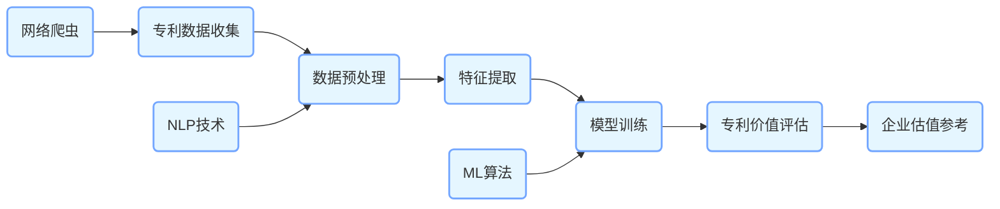

# 企业估值中的AI驱动的自动化专利分析平台评估

> 关键词：企业估值、AI、自动化专利分析平台、评估、知识产权

> 摘要：本文聚焦于企业估值中AI驱动的自动化专利分析平台评估。随着企业竞争日益激烈，专利作为企业重要的知识产权资产，其价值评估对企业估值的影响愈发显著。AI驱动的自动化专利分析平台为专利评估带来了新的方法和技术手段。文章将深入探讨该平台的核心概念、算法原理、数学模型，通过项目实战展示其具体应用，分析实际应用场景，推荐相关工具和资源，并对其未来发展趋势与挑战进行总结，旨在为企业估值中更好地利用此类平台提供全面的参考。

## 1. 背景介绍 
### 1.1 目的和范围
在当今知识经济时代，企业的知识产权尤其是专利资产在企业价值中所占的比重越来越大。准确评估企业的专利价值对于企业估值、并购重组、投资决策等具有重要意义。AI驱动的自动化专利分析平台借助人工智能技术，能够高效、准确地对专利数据进行分析和挖掘。本文章的目的在于全面评估此类平台在企业估值中的应用，探讨其原理、方法、实际效果及未来发展。范围涵盖该平台的核心概念、算法原理、数学模型、项目实战、应用场景、工具资源等多个方面。

### 1.2 预期读者
本文预期读者包括企业管理人员、投资机构分析师、知识产权专家、专利评估师、人工智能技术开发者以及对企业估值和专利分析感兴趣的研究人员等。这些读者希望通过本文深入了解AI驱动的自动化专利分析平台在企业估值中的作用和价值，获取相关技术和应用的知识。

### 1.3 文档结构概述
本文首先介绍相关背景信息，包括目的、预期读者和文档结构。接着阐述核心概念与联系，展示其原理和架构。然后详细讲解核心算法原理和具体操作步骤，通过Python代码进行说明。随后介绍数学模型和公式，并举例说明。通过项目实战展示代码实际案例和详细解释。分析实际应用场景，推荐相关工具和资源。最后总结未来发展趋势与挑战，提供常见问题与解答和扩展阅读参考资料。

### 1.4 术语表
#### 1.4.1 核心术语定义
- **企业估值**：对企业的内在价值进行评估和估算，通常用于投资决策、并购重组、财务报告等场景。
- **AI（人工智能）**：计算机科学的一个分支，旨在使计算机系统能够模拟人类智能，包括学习、推理、决策等能力。
- **自动化专利分析平台**：利用计算机技术和算法，自动对专利数据进行收集、整理、分析和挖掘的软件系统。
- **专利价值评估**：对专利的经济价值、技术价值、法律价值等进行综合评估的过程。

#### 1.4.2 相关概念解释
- **知识产权**：人们对其智力劳动成果所享有的法定权利，包括专利、商标、著作权等。
- **专利数据**：包括专利文本、专利分类号、专利申请人、专利发明人等信息的数据集。
- **数据挖掘**：从大量的数据中发现潜在模式、关系和知识的过程。

#### 1.4.3 缩略词列表
- **AI**：Artificial Intelligence（人工智能）
- **NLP**：Natural Language Processing（自然语言处理）
- **ML**：Machine Learning（机器学习）

## 2. 核心概念与联系 

### 核心概念原理
AI驱动的自动化专利分析平台的核心原理是结合人工智能技术，对海量的专利数据进行处理和分析。首先，通过网络爬虫技术收集专利数据，包括专利文本、分类信息、申请人信息等。然后，利用自然语言处理（NLP）技术对专利文本进行预处理，如分词、词性标注、命名实体识别等，提取关键信息。接着，运用机器学习（ML）算法对处理后的数据进行建模和分析，挖掘专利的技术价值、经济价值和法律价值等。最后，根据分析结果对企业的专利资产进行评估，为企业估值提供参考。

### 架构示意图


该架构图展示了AI驱动的自动化专利分析平台的主要流程。首先通过网络爬虫收集专利数据，然后对数据进行预处理，提取关键特征。接着使用机器学习算法进行模型训练，根据训练好的模型对专利价值进行评估，最终为企业估值提供参考。其中，自然语言处理技术用于数据预处理，机器学习算法用于模型训练和分析。

## 3. 核心算法原理 & 具体操作步骤 

### 核心算法原理
在AI驱动的自动化专利分析平台中，常用的算法包括自然语言处理算法和机器学习算法。以下将详细介绍这些算法的原理，并使用Python代码进行阐述。

#### 自然语言处理算法
自然语言处理算法主要用于对专利文本进行预处理，提取关键信息。其中，分词算法是基础，常用的分词工具包括`jieba`库。以下是一个简单的分词示例：

```python
import jieba

# 专利文本示例
patent_text = "本发明涉及一种新型的电池技术，具有高能量密度和长寿命的特点。"

# 分词
words = jieba.lcut(patent_text)
print(words)
```

在上述代码中，我们使用`jieba`库对专利文本进行分词。`jieba.lcut`函数将文本分割成一个个词语，并返回一个词语列表。

#### 机器学习算法
机器学习算法用于对处理后的数据进行建模和分析，常见的算法包括决策树、支持向量机、神经网络等。以下以决策树算法为例，介绍其在专利价值评估中的应用。

```python
from sklearn.datasets import make_classification
from sklearn.model_selection import train_test_split
from sklearn.tree import DecisionTreeClassifier
from sklearn.metrics import accuracy_score

# 生成示例数据
X, y = make_classification(n_samples=1000, n_features=10, n_informative=5, n_redundant=0, random_state=42)

# 划分训练集和测试集
X_train, X_test, y_train, y_test = train_test_split(X, y, test_size=0.2, random_state=42)

# 创建决策树分类器
clf = DecisionTreeClassifier()

# 训练模型
clf.fit(X_train, y_train)

# 预测
y_pred = clf.predict(X_test)

# 计算准确率
accuracy = accuracy_score(y_test, y_pred)
print(f"Accuracy: {accuracy}")
```

在上述代码中，我们使用`sklearn`库生成示例数据，并将其划分为训练集和测试集。然后创建一个决策树分类器，使用训练集进行训练，最后使用测试集进行预测并计算准确率。

### 具体操作步骤
1. **数据收集**：使用网络爬虫技术从专利数据库中收集专利数据，包括专利文本、分类信息、申请人信息等。
2. **数据预处理**：使用自然语言处理技术对专利文本进行预处理，如分词、词性标注、命名实体识别等，提取关键信息。
3. **特征提取**：从预处理后的数据中提取特征，如专利文本的关键词、分类信息、申请人信息等。
4. **模型训练**：使用机器学习算法对提取的特征进行建模和训练，根据训练好的模型对专利价值进行评估。
5. **企业估值参考**：根据专利价值评估结果，为企业估值提供参考。

## 4. 数学模型和公式 & 详细讲解 & 举例说明 

### 数学模型
在专利价值评估中，常用的数学模型包括层次分析法（AHP）、模糊综合评价法等。以下以层次分析法为例，介绍其数学模型和公式。

层次分析法是一种将复杂问题分解为多个层次，通过比较各层次因素的相对重要性，确定各因素权重的方法。其主要步骤包括：
1. **建立层次结构模型**：将问题分解为目标层、准则层和方案层。
2. **构造判断矩阵**：通过比较各因素的相对重要性，构造判断矩阵。
3. **计算权重**：计算判断矩阵的特征向量，得到各因素的权重。
4. **一致性检验**：检验判断矩阵的一致性，确保权重的合理性。

### 公式
#### 判断矩阵
判断矩阵 $A=(a_{ij})_{n\times n}$ 表示因素 $i$ 相对于因素 $j$ 的重要性，其中 $a_{ij}$ 的取值范围为 $1, 2, \cdots, 9$ 及其倒数。

#### 特征向量
判断矩阵 $A$ 的特征向量 $W=(w_1, w_2, \cdots, w_n)^T$ 满足 $AW=\lambda_{max}W$，其中 $\lambda_{max}$ 是 $A$ 的最大特征值。

#### 一致性指标
一致性指标 $CI=\frac{\lambda_{max}-n}{n - 1}$，其中 $n$ 是判断矩阵的阶数。

#### 随机一致性指标
随机一致性指标 $RI$ 是一个与判断矩阵阶数有关的常数，可通过查表得到。

#### 一致性比率
一致性比率 $CR=\frac{CI}{RI}$，当 $CR<0.1$ 时，认为判断矩阵具有满意的一致性。

### 举例说明
假设我们要评估专利的技术价值、经济价值和法律价值，构造判断矩阵如下：

$$
A = 
\begin{bmatrix}
1 & 3 & 5 \\
\frac{1}{3} & 1 & 3 \\
\frac{1}{5} & \frac{1}{3} & 1
\end{bmatrix}
$$

首先，计算判断矩阵的最大特征值 $\lambda_{max}$ 和特征向量 $W$：

```python
import numpy as np

A = np.array([[1, 3, 5], [1/3, 1, 3], [1/5, 1/3, 1]])

# 计算特征值和特征向量
eigenvalues, eigenvectors = np.linalg.eig(A)

# 最大特征值
lambda_max = np.max(eigenvalues).real

# 特征向量
W = eigenvectors[:, np.argmax(eigenvalues)].real
W = W / np.sum(W)

print(f"lambda_max: {lambda_max}")
print(f"W: {W}")
```

然后，计算一致性指标 $CI$、随机一致性指标 $RI$ 和一致性比率 $CR$：

```python
n = A.shape[0]

# 一致性指标
CI = (lambda_max - n) / (n - 1)

# 随机一致性指标（n=3时，RI=0.58）
RI = 0.58

# 一致性比率
CR = CI / RI

print(f"CI: {CI}")
print(f"RI: {RI}")
print(f"CR: {CR}")
```

由于 $CR<0.1$，认为判断矩阵具有满意的一致性。因此，技术价值、经济价值和法律价值的权重分别为 $W$ 中的元素。

## 5. 项目实战：代码实际案例和详细解释说明 

### 5.1  开发环境搭建
1. **安装Python**：从Python官方网站（https://www.python.org/downloads/）下载并安装Python 3.x版本。
2. **安装必要的库**：使用`pip`命令安装所需的库，如`jieba`、`sklearn`、`numpy`等。

```bash
pip install jieba sklearn numpy
```

### 5.2  源代码详细实现和代码解读
以下是一个简单的AI驱动的自动化专利分析平台的实现示例，包括数据预处理、特征提取、模型训练和专利价值评估。

```python
import jieba
from sklearn.feature_extraction.text import TfidfVectorizer
from sklearn.model_selection import train_test_split
from sklearn.tree import DecisionTreeClassifier
from sklearn.metrics import accuracy_score

# 专利数据示例
patent_data = [
    "本发明涉及一种新型的电池技术，具有高能量密度和长寿命的特点。",
    "该专利提出了一种新的算法，能够提高计算效率。",
    "此发明是关于一种新型的材料，具有良好的导电性。"
]

# 专利价值标签示例（0表示低价值，1表示高价值）
labels = [1, 1, 0]

# 数据预处理：分词
processed_data = []
for text in patent_data:
    words = jieba.lcut(text)
    processed_text = " ".join(words)
    processed_data.append(processed_text)

# 特征提取：TF-IDF
vectorizer = TfidfVectorizer()
X = vectorizer.fit_transform(processed_data)

# 划分训练集和测试集
X_train, X_test, y_train, y_test = train_test_split(X, labels, test_size=0.2, random_state=42)

# 创建决策树分类器
clf = DecisionTreeClassifier()

# 训练模型
clf.fit(X_train, y_train)

# 预测
y_pred = clf.predict(X_test)

# 计算准确率
accuracy = accuracy_score(y_test, y_pred)
print(f"Accuracy: {accuracy}")
```

### 5.3  代码解读与分析
1. **数据预处理**：使用`jieba`库对专利文本进行分词，将分词结果用空格连接成字符串，方便后续处理。
2. **特征提取**：使用`TfidfVectorizer`对预处理后的数据进行特征提取，将文本转换为向量表示。
3. **划分训练集和测试集**：使用`train_test_split`函数将数据划分为训练集和测试集，方便模型训练和评估。
4. **模型训练**：创建决策树分类器，并使用训练集进行训练。
5. **预测和评估**：使用测试集进行预测，并计算准确率，评估模型的性能。

## 6. 实际应用场景 
### 企业估值
在企业估值中，AI驱动的自动化专利分析平台可以帮助评估企业的专利资产价值，为企业的整体估值提供重要参考。通过对专利的技术价值、经济价值和法律价值进行评估，可以更准确地反映企业的知识产权实力和潜在价值。

### 投资决策
投资机构在进行投资决策时，可以使用该平台对目标企业的专利情况进行分析，评估其技术创新能力和市场竞争力。专利价值高的企业往往具有更大的发展潜力和投资价值，有助于投资机构做出更明智的投资决策。

### 并购重组
在企业并购重组过程中，该平台可以帮助双方了解目标企业的专利资产情况，评估其价值和风险。通过对专利的分析，可以确定并购重组的价格和交易条款，降低交易风险，提高交易成功率。

### 专利战略规划
企业可以利用该平台对自身的专利情况进行分析，了解自身的技术优势和劣势，制定合理的专利战略规划。通过对竞争对手的专利分析，企业可以发现技术空白和市场机会，提前布局，提高自身的竞争力。

## 7. 工具和资源推荐
### 7.1 学习资源推荐
#### 7.1.1 书籍推荐
- 《Python自然语言处理实战》：介绍了Python在自然语言处理领域的应用，包括分词、词性标注、命名实体识别等技术。
- 《机器学习实战》：通过实际案例介绍了机器学习的基本算法和应用，适合初学者入门。
- 《人工智能：一种现代的方法》：全面介绍了人工智能的基本概念、算法和应用，是人工智能领域的经典教材。

#### 7.1.2 在线课程
- Coursera上的“Natural Language Processing Specialization”：由斯坦福大学教授授课，系统介绍了自然语言处理的理论和实践。
- edX上的“Machine Learning”：由吴恩达教授授课，是机器学习领域的经典课程。
- 中国大学MOOC上的“人工智能基础”：介绍了人工智能的基本概念、算法和应用，适合初学者学习。

#### 7.1.3 技术博客和网站
- 机器之心：提供人工智能领域的最新技术和研究成果，是了解人工智能发展动态的重要渠道。
- 开源中国：提供开源项目和技术文章，是开发者交流和学习的平台。
- 知乎：有很多关于人工智能和专利分析的讨论和分享，可以获取不同的观点和经验。

### 7.2 开发工具框架推荐
#### 7.2.1 IDE和编辑器
- PyCharm：是一款专业的Python集成开发环境，具有代码编辑、调试、版本控制等功能，适合Python开发。
- Visual Studio Code：是一款轻量级的代码编辑器，支持多种编程语言和插件，具有丰富的扩展功能。

#### 7.2.2 调试和性能分析工具
- PDB：Python自带的调试工具，可以帮助开发者定位和解决代码中的问题。
- cProfile：Python的性能分析工具，可以分析代码的运行时间和资源消耗情况。

#### 7.2.3 相关框架和库
- NLTK：自然语言处理工具包，提供了丰富的自然语言处理算法和数据集。
- Scikit-learn：机器学习工具包，提供了多种机器学习算法和模型评估方法。
- TensorFlow：深度学习框架，可用于构建和训练深度学习模型。

### 7.3 相关论文著作推荐
#### 7.3.1 经典论文
- “A Survey on Text Classification Algorithms”：介绍了文本分类的常见算法和方法，是文本分类领域的经典论文。
- “Machine Learning for Patent Analysis”：探讨了机器学习在专利分析中的应用，为该领域的研究提供了重要参考。

#### 7.3.2 最新研究成果
- 关注顶级学术