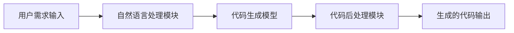

# 企业估值中的AI驱动的自动化代码生成平台评估

> 关键词：企业估值、AI驱动、自动化代码生成平台、评估方法、应用场景

> 摘要：本文聚焦于企业估值中AI驱动的自动化代码生成平台评估。首先介绍了研究的背景、目的、预期读者和文档结构，对相关术语进行了清晰定义。接着阐述了核心概念及联系，通过文本示意图和Mermaid流程图展示其架构。详细讲解了核心算法原理，并用Python代码示例说明。给出了数学模型和公式，结合实例加深理解。进行了项目实战，包括开发环境搭建、源代码实现与解读。探讨了该平台的实际应用场景，推荐了学习资源、开发工具框架和相关论文著作。最后总结了未来发展趋势与挑战，解答常见问题，并提供扩展阅读和参考资料，旨在为企业准确评估AI驱动的自动化代码生成平台价值提供全面指导。

## 1. 背景介绍 
### 1.1 目的和范围
在当今数字化时代，AI技术的飞速发展推动了自动化代码生成平台的兴起。企业对于此类平台的投资和应用越来越广泛，准确评估其价值对于企业的决策至关重要。本研究的目的在于建立一套科学、系统的评估方法，用于企业估值中对AI驱动的自动化代码生成平台进行全面、客观的评估。研究范围涵盖了平台的技术架构、算法原理、应用场景、市场竞争力等多个方面，旨在为企业提供具有实操性的评估框架。

### 1.2 预期读者
本文的预期读者主要包括企业的投资决策者、技术管理人员、财务分析师以及对AI和自动化代码生成领域感兴趣的研究人员。投资决策者可以根据评估结果决定是否对相关平台进行投资；技术管理人员能够了解平台的技术优势和不足，以便更好地进行技术选型和团队管理；财务分析师可以运用评估方法对平台进行财务估值；研究人员则可以从本文中获取相关的理论和实践参考，推动该领域的进一步研究。

### 1.3 文档结构概述
本文共分为十个部分。第一部分为背景介绍，阐述了研究的目的、范围、预期读者和文档结构，并对相关术语进行解释。第二部分介绍核心概念与联系，通过文本示意图和Mermaid流程图展示平台的架构。第三部分详细讲解核心算法原理，并给出Python代码示例。第四部分介绍数学模型和公式，并结合实例进行说明。第五部分进行项目实战，包括开发环境搭建、源代码实现与解读。第六部分探讨平台的实际应用场景。第七部分推荐学习资源、开发工具框架和相关论文著作。第八部分总结未来发展趋势与挑战。第九部分为附录，解答常见问题。第十部分提供扩展阅读和参考资料。

### 1.4 术语表
#### 1.4.1 核心术语定义
- **AI驱动的自动化代码生成平台**：指利用人工智能技术，如机器学习、自然语言处理等，自动生成计算机代码的软件平台。该平台能够根据用户的需求和输入，快速、准确地生成符合要求的代码，提高开发效率和代码质量。
- **企业估值**：是指对企业的整体价值进行评估的过程。在本研究中，主要关注如何评估AI驱动的自动化代码生成平台对企业价值的贡献。
- **评估指标**：用于衡量AI驱动的自动化代码生成平台价值的各项参数，如代码生成效率、代码质量、平台的易用性、市场竞争力等。

#### 1.4.2 相关概念解释
- **机器学习**：是一门多领域交叉学科，涉及概率论、统计学、逼近论、凸分析、算法复杂度理论等多门学科。它专门研究计算机怎样模拟或实现人类的学习行为，以获取新的知识或技能，重新组织已有的知识结构使之不断改善自身的性能。在自动化代码生成平台中，机器学习算法可以用于学习代码模式、预测代码需求等。
- **自然语言处理**：是计算机科学领域与人工智能领域中的一个重要方向。它研究能实现人与计算机之间用自然语言进行有效通信的各种理论和方法。在自动化代码生成平台中，自然语言处理技术可以用于理解用户的自然语言需求，并将其转化为代码生成的指令。

#### 1.4.3 缩略词列表
- **AI**：Artificial Intelligence，人工智能
- **ML**：Machine Learning，机器学习
- **NLP**：Natural Language Processing，自然语言处理

## 2. 核心概念与联系 

### 核心概念原理
AI驱动的自动化代码生成平台的核心原理是利用人工智能技术对大量的代码数据进行学习和分析，从而掌握代码的模式、结构和语义信息。当用户输入需求时，平台通过自然语言处理技术理解用户的意图，并根据学习到的知识生成相应的代码。

具体来说，平台通常会采用以下几个关键步骤：
1. **数据收集与预处理**：收集大量的代码数据，包括开源代码库、企业内部代码等，并对这些数据进行清洗、标注和特征提取等预处理操作，以便后续的学习和分析。
2. **模型训练**：使用机器学习或深度学习算法对预处理后的数据进行训练，构建代码生成模型。常见的模型包括循环神经网络（RNN）、长短期记忆网络（LSTM）、Transformer等。
3. **代码生成**：当用户输入需求时，平台将需求转化为模型可以理解的输入格式，并通过训练好的模型生成相应的代码。生成的代码可能需要进行后处理，如代码优化、错误检查等，以确保代码的质量。

### 架构的文本示意图
```
用户需求输入
|
V
自然语言处理模块
|
V
代码生成模型
|
V
代码后处理模块
|
V
生成的代码输出
```

### Mermaid流程图


## 3. 核心算法原理 & 具体操作步骤 

### 核心算法原理
在AI驱动的自动化代码生成平台中，常用的核心算法包括基于深度学习的序列到序列（Seq2Seq）模型和Transformer模型。下面以Seq2Seq模型为例进行详细讲解。

Seq2Seq模型是一种用于处理序列到序列任务的深度学习模型，由编码器（Encoder）和解码器（Decoder）两部分组成。编码器将输入序列（如用户的需求文本）编码为一个固定长度的向量表示，解码器则根据这个向量表示生成输出序列（如代码）。

具体来说，编码器通常使用循环神经网络（RNN）或其变体（如LSTM、GRU）来处理输入序列。RNN可以处理变长的输入序列，并通过隐藏状态来记忆序列中的信息。解码器也是一个RNN，它根据编码器输出的向量表示和之前生成的输出序列来生成下一个输出。

### 具体操作步骤
以下是使用Python和PyTorch实现一个简单的Seq2Seq模型进行代码生成的具体步骤：

```python
import torch
import torch.nn as nn
import torch.optim as optim

# 定义编码器
class Encoder(nn.Module):
    def __init__(self, input_size, hidden_size):
        super(Encoder, self).__init__()
        self.hidden_size = hidden_size
        self.embedding = nn.Embedding(input_size, hidden_size)
        self.gru = nn.GRU(hidden_size, hidden_size)

    def forward(self, input, hidden):
        embedded = self.embedding(input).view(1, 1, -1)
        output = embedded
        output, hidden = self.gru(output, hidden)
        return output, hidden

    def initHidden(self):
        return torch.zeros(1, 1, self.hidden_size)

# 定义解码器
class Decoder(nn.Module):
    def __init__(self, hidden_size, output_size):
        super(Decoder, self).__init__()
        self.hidden_size = hidden_size
        self.embedding = nn.Embedding(output_size, hidden_size)
        self.gru = nn.GRU(hidden_size, hidden_size)
        self.out = nn.Linear(hidden_size, output_size)
        self.softmax = nn.LogSoftmax(dim=1)

    def forward(self, input, hidden):
        output = self.embedding(input).view(1, 1, -1)
        output = nn.functional.relu(output)
        output, hidden = self.gru(output, hidden)
        output = self.softmax(self.out(output[0]))
        return output, hidden

    def initHidden(self):
        return torch.zeros(1, 1, self.hidden_size)

# 训练模型
def train(input_tensor, target_tensor, encoder, decoder, encoder_optimizer, decoder_optimizer, criterion):
    encoder_hidden = encoder.initHidden()
    encoder_optimizer.zero_grad()
    decoder_optimizer.zero_grad()
    input_length = input_tensor.size(0)
    target_length = target_tensor.size(0)
    encoder_outputs = torch.zeros(input_length, encoder.hidden_size)
    loss = 0
    for ei in range(input_length):
        encoder_output, encoder_hidden = encoder(input_tensor[ei], encoder_hidden)
        encoder_outputs[ei] = encoder_output[0, 0]
    decoder_input = torch.tensor([[0]])
    decoder_hidden = encoder_hidden
    for di in range(target_length):
        decoder_output, decoder_hidden = decoder(decoder_input, decoder_hidden)
        topv, topi = decoder_output.topk(1)
        decoder_input = topi.squeeze().detach()
        loss += criterion(decoder_output, target_tensor[di].unsqueeze(0))
        if decoder_input.item() == 1:
            break
    loss.backward()
    encoder_optimizer.step()
    decoder_optimizer.step()
    return loss.item() / target_length

# 生成代码
def generate_code(input_tensor, encoder, decoder):
    encoder_hidden = encoder.initHidden()
    input_length = input_tensor.size(0)
    encoder_outputs = torch.zeros(input_length, encoder.hidden_size)
    for ei in range(input_length):
        encoder_output, encoder_hidden = encoder(input_tensor[ei], encoder_hidden)
        encoder_outputs[ei] = encoder_output[0, 0]
    decoder_input = torch.tensor([[0]])
    decoder_hidden = encoder_hidden
    output_seq = []
    for di in range(100):  # 最大生成长度
        decoder_output, decoder_hidden = decoder(decoder_input, decoder_hidden)
        topv, topi = decoder_output.topk(1)
        decoder_input = topi.squeeze().detach()
        output_seq.append(decoder_input.item())
        if decoder_input.item() == 1:
            break
    return output_seq
```

### 代码解释
1. **Encoder类**：实现了编码器的功能，使用`nn.Embedding`将输入的词索引转换为词向量，然后使用`nn.GRU`进行序列编码。
2. **Decoder类**：实现了解码器的功能，同样使用`nn.Embedding`和`nn.GRU`，最后使用`nn.Linear`和`nn.LogSoftmax`输出预测的词概率。
3. **train函数**：用于训练模型，通过前向传播计算损失，然后进行反向传播更新模型参数。
4. **generate_code函数**：根据输入的序列生成代码，通过编码器将输入编码，然后使用解码器逐步生成输出序列。

## 4. 数学模型和公式 & 详细讲解 & 举例说明 

### 数学模型和公式
在Seq2Seq模型中，主要涉及到以下几个数学公式：

#### 编码器
编码器的输入是一个词序列 $\mathbf{x} = [x_1, x_2, \cdots, x_T]$，其中 $x_t$ 是第 $t$ 个时间步的输入词，$T$ 是序列的长度。编码器使用RNN（如GRU）进行编码，其更新公式如下：

$$
\mathbf{h}_t = \text{GRU}(\mathbf{x}_t, \mathbf{h}_{t-1})
$$

其中 $\mathbf{h}_t$ 是第 $t$ 个时间步的隐藏状态，$\mathbf{h}_{0}$ 通常初始化为零向量。

#### 解码器
解码器的输入是编码器的最后一个隐藏状态 $\mathbf{h}_T$ 和之前生成的词序列 $\mathbf{y}_{<t} = [y_1, y_2, \cdots, y_{t-1}]$。解码器同样使用RNN进行解码，其更新公式如下：

$$
\mathbf{s}_t = \text{GRU}(\mathbf{y}_{t-1}, \mathbf{s}_{t-1})
$$

其中 $\mathbf{s}_t$ 是第 $t$ 个时间步的隐藏状态，$\mathbf{s}_{0} = \mathbf{h}_T$。

解码器的输出是一个概率分布 $\mathbf{p}_t$，表示在第 $t$ 个时间步生成每个词的概率，其计算公式如下：

$$
\mathbf{p}_t = \text{softmax}(\mathbf{W}_o\mathbf{s}_t + \mathbf{b}_o)
$$

其中 $\mathbf{W}_o$ 是输出层的权重矩阵，$\mathbf{b}_o$ 是偏置向量。

#### 损失函数
训练模型时，通常使用交叉熵损失函数来衡量预测的概率分布 $\mathbf{p}_t$ 与真实标签 $\mathbf{y}_t$ 之间的差异，其计算公式如下：

$$
L = -\sum_{t=1}^{T'} \log(p_{t,y_t})
$$

其中 $T'$ 是目标序列的长度，$p_{t,y_t}$ 是在第 $t$ 个时间步预测到真实标签 $y_t$ 的概率。

### 详细讲解
编码器的作用是将输入序列编码为一个固定长度的向量表示，以便解码器能够根据这个表示生成输出序列。解码器则根据编码器的输出和之前生成的输出序列逐步生成新的输出。损失函数用于衡量模型的预测结果与真实标签之间的差异，通过最小化损失函数来更新模型的参数。

### 举例说明
假设输入序列为 `["print", "hello", "world"]`，目标序列为 `["print", "('", "hello", "world", "')"]`。编码器将输入序列编码为一个隐藏状态向量，解码器根据这个向量和之前生成的词逐步生成目标序列。在训练过程中，模型会根据损失函数的计算结果不断调整参数，以提高生成的代码与目标代码的相似度。

## 5. 项目实战：代码实际案例和详细解释说明 

### 5.1  开发环境搭建
为了实现一个AI驱动的自动化代码生成平台，我们需要搭建以下开发环境：
1. **操作系统**：推荐使用Linux或macOS，因为它们对Python和深度学习框架的支持更好。
2. **Python环境**：安装Python 3.6及以上版本。可以使用Anaconda来管理Python环境，它可以方便地安装和管理各种Python库。
3. **深度学习框架**：使用PyTorch作为深度学习框架，它提供了丰富的神经网络层和优化算法，方便我们实现和训练模型。可以使用以下命令安装PyTorch：
```bash
pip install torch torchvision
```
4. **其他依赖库**：还需要安装一些其他的依赖库，如`numpy`、`pandas`、`matplotlib`等，可以使用以下命令安装：
```bash
pip install numpy pandas matplotlib
```

### 5.2  源代码详细实现和代码解读
以下是一个完整的项目实战代码示例，包括数据处理、模型定义、训练和代码生成：

```python
import torch
import torch.nn as nn
import torch.optim as optim
import numpy as np

# 数据处理
def prepare_sequence(seq, to_ix):
    idxs = [to_ix[w] for w in seq]
    return torch.tensor(idxs, dtype=torch.long)

# 定义编码器
class Encoder(nn.Module):
    def __init__(self, input_size, hidden_size):
        super(Encoder, self).__init__()
        self.hidden_size = hidden_size
        self.embedding = nn.Embedding(input_size, hidden_size)
        self.gru = nn.GRU(hidden_size, hidden_size)

    def forward(self, input, hidden):
        embedded = self.embedding(input).view(1, 1, -1)
        output = embedded
        output, hidden = self.gru(output, hidden)
        return output, hidden

    def initHidden(self):
        return torch.zeros(1, 1, self.hidden_size)

# 定义解码器
class Decoder(nn.Module):
    def __init__(self, hidden_size, output_size):
        super(Decoder, self).__init__()
        self.hidden_size = hidden_size
        self.embedding = nn.Embedding(output_size, hidden_size)
        self.gru = nn.GRU(hidden_size, hidden_size)
        self.out = nn.Linear(hidden_size, output_size)
        self.softmax = nn.LogSoftmax(dim=1)

    def forward(self, input, hidden):
        output = self.embedding(input).view(1, 1, -1)
        output = nn.functional.relu(output)
        output, hidden = self.gru(output, hidden)
        output = self.softmax(self.out(output[0]))
        return output, hidden

    def initHidden(self):
        return torch.zeros(1, 1, self.hidden_size)

# 训练模型
def train(input_tensor, target_tensor, encoder, decoder, encoder_optimizer, decoder_optimizer, criterion):
    encoder_hidden = encoder.initHidden()
    encoder_optimizer.zero_grad()
    decoder_optimizer.zero_grad()
    input_length = input_tensor.size(0)
    target_length = target_tensor.size(0)
    encoder_outputs = torch.zeros(input_length, encoder.hidden_size)
    loss = 0
    for ei in range(input_length):
        encoder_output, encoder_hidden = encoder(input_tensor[ei], encoder_hidden)
        encoder_outputs[ei] = encoder_output[0, 0]
    decoder_input = torch.tensor([[0]])
    decoder_hidden = encoder_hidden
    for di in range(target_length):
        decoder_output, decoder_hidden = decoder(decoder_input, decoder_hidden)
        topv, topi = decoder_output.topk(1)
        decoder_input = topi.squeeze().detach()
        loss += criterion(decoder_output, target_tensor[di].unsqueeze(0))
        if decoder_input.item() == 1:
            break
    loss.backward()
    encoder_optimizer.step()
    decoder_optimizer.step()
    return loss.item() / target_length

# 生成代码
def generate_code(input_tensor, encoder, decoder):
    encoder_hidden = encoder.initHidden()
    input_length = input_tensor.size(0)
    encoder_outputs = torch.zeros(input_length, encoder.hidden_size)
    for ei in range(input_length):
        encoder_output, encoder_hidden = encoder(input_tensor[ei], encoder_hidden)
        encoder_outputs[ei] = encoder_output[0, 0]
    decoder_input = torch.tensor([[0]])
    decoder_hidden = encoder_hidden
    output_seq = []
    for di in range(100):  # 最大生成长度
        decoder_output, decoder_hidden = decoder(decoder_input, decoder_hidden)
        topv, topi = decoder_output.topk(1)
        decoder_input = topi.squeeze().detach()
        output_seq.append(decoder_input.item())
        if decoder_input.item() == 1:
            break
    return output_seq

# 示例数据
training_data = [
    ("print hello world", "print ('hello world')"),
    ("add two numbers", "a = 1; b = 2; c = a + b; print(c)")
]

# 构建词汇表
word_to_ix = {}
for sent, tags in training_data:
    for word in sent.split() + tags.split():
        if word not in word_to_ix:
            word_to_ix[word] = len(word_to_ix)
word_to_ix["<START>"] = len(word_to_ix)
word_to_ix["<END>"] = len(word_to_ix)

# 初始化模型
input_size = len(word_to_ix)
hidden_size = 128
output_size = len(word_to_ix)
encoder = Encoder(input_size, hidden_size)
decoder = Decoder(hidden_size, output_size)

# 定义优化器和损失函数
encoder_optimizer = optim.SGD(encoder.parameters(), lr=0.01)
decoder_optimizer = optim.SGD(decoder.parameters(), lr=0.01)
criterion = nn.NLLLoss()

# 训练模型
n_iters = 1000
for iter in range(n_iters):
    for input_sent, target_sent in training_data:
        input_tensor = prepare_sequence(input_sent.split(), word_to_ix)
        target_tensor = prepare_sequence(target_sent.split() + ["<END>"], word_to_ix)
        loss = train(input_tensor, target_tensor, encoder, decoder, encoder_optimizer, decoder_optimizer, criterion)
    if iter % 100 == 0:
        print(f'Iteration {iter}, Loss: {loss}')

# 生成代码示例
input_sent = "print hello world"
input_tensor = prepare_sequence(input_sent.split(), word_to_ix)
output_seq = generate_code(input_tensor, encoder, decoder)
ix_to_word = {v: k for k, v in word_to_ix.items()}
output_sent = ' '.join([ix_to_word[ix] for ix in output_seq if ix!= word_to_ix["<END>"]])
print(f'Input: {input_sent}')
print(f'Generated code: {output_sent}')
```

### 5.3  代码解读与分析
1. **数据处理**：`prepare_sequence` 函数将输入的词序列转换为对应的索引序列，方便模型处理。
2. **模型定义**：`Encoder` 类和 `Decoder` 类分别定义了编码器和解码器的结构，使用了 `nn.Embedding` 和 `nn.GRU` 层。
3. **训练模型**：`train` 函数实现了模型的训练过程，包括前向传播、损失计算和反向传播。
4. **生成代码**：`generate_code` 函数根据输入的序列生成代码，通过编码器将输入编码，然后使用解码器逐步生成输出序列。
5. **示例数据**：定义了一些示例训练数据，用于演示模型的训练和代码生成过程。
6. **词汇表构建**：构建了一个词汇表，将每个词映射到一个唯一的索引。
7. **模型初始化**：初始化编码器和解码器模型，并定义了优化器和损失函数。
8. **训练过程**：使用示例数据对模型进行训练，每100次迭代打印一次损失值。
9. **代码生成示例**：使用训练好的模型对输入的句子生成代码，并打印生成的代码。

## 6. 实际应用场景 
AI驱动的自动化代码生成平台在多个领域有着广泛的应用场景，以下是一些常见的应用场景：

### 软件开发
在软件开发过程中，自动化代码生成平台可以帮助开发人员快速生成基础代码，提高开发效率。例如，在Web开发中，可以根据需求自动生成前端页面的HTML、CSS和JavaScript代码，以及后端的数据库操作代码。在移动应用开发中，可以根据设计稿自动生成界面布局代码和部分业务逻辑代码。

### 数据处理和分析
在数据处理和分析领域，自动化代码生成平台可以根据用户的需求自动生成数据清洗、数据分析和可视化的代码。例如，当用户需要对一个数据集进行统计分析时，平台可以根据用户输入的分析需求，自动生成Python或R代码，完成数据的读取、清洗、分析和可视化等操作。

### 教育领域
在教育领域，自动化代码生成平台可以作为教学辅助工具，帮助学生更好地理解编程概念和语法。教师可以使用平台生成示例代码，让学生进行学习和实践。同时，平台还可以根据学生的编程作业需求，自动生成代码模板，引导学生完成作业。

### 企业数字化转型
在企业数字化转型过程中，自动化代码生成平台可以帮助企业快速开发和部署各种信息系统，如企业资源规划（ERP）系统、客户关系管理（CRM）系统等。通过自动生成代码，企业可以减少开发时间和成本，提高系统的开发效率和质量。

## 7. 工具和资源推荐
### 7.1 学习资源推荐
#### 7.1.1 书籍推荐
- 《深度学习》（Deep Learning）：由Ian Goodfellow、Yoshua Bengio和Aaron Courville合著，是深度学习领域的经典教材，全面介绍了深度学习的基本概念、算法和应用。
- 《Python深度学习》（Deep Learning with Python）：由Francois Chollet所著，以Keras为框架，介绍了如何使用Python进行深度学习开发，适合初学者入门。
- 《自然语言处理入门》：由何晗所著，系统地介绍了自然语言处理的基本概念、算法和应用，是学习自然语言处理的优秀书籍。

#### 7.1.2 在线课程
- Coursera上的“深度学习专项课程”（Deep Learning Specialization）：由Andrew Ng教授授课，包括五门课程，全面介绍了深度学习的各个方面，是学习深度学习的优质课程。
- edX上的“自然语言处理基础”（Foundations of Natural Language Processing）：由哥伦比亚大学的教授授课，介绍了自然语言处理的基本概念、算法和应用。
- 慕课网上的“Python人工智能实战”：结合实际项目，介绍了如何使用Python进行人工智能开发，适合有一定编程基础的学习者。

#### 7.1.3 技术博客和网站
- Medium：是一个技术博客平台，上面有很多关于人工智能、深度学习和自动化代码生成的优质文章。
- arXiv：是一个预印本论文库，提供了最新的学术研究成果，包括人工智能领域的研究论文。
- GitHub：是一个开源代码托管平台，上面有很多关于人工智能和自动化代码生成的开源项目，可以学习和参考。

### 7.2 开发工具框架推荐
#### 7.2.1 IDE和编辑器
- PyCharm：是一款专门为Python开发设计的集成开发环境（IDE），提供了丰富的代码编辑、调试和版本控制功能。
- Jupyter Notebook：是一个交互式的开发环境，适合进行数据分析和模型训练，支持Python、R等多种编程语言。
- Visual Studio Code：是一款轻量级的代码编辑器，支持多种编程语言和插件扩展，适合快速开发和调试。

#### 7.2.2 调试和性能分析工具
- TensorBoard：是TensorFlow提供的可视化工具，可以用于监控模型的训练过程、查看模型的结构和性能指标等。
- Py-Spy：是一个Python性能分析工具，可以用于分析Python程序的性能瓶颈，找出耗时较长的代码段。
- GDB：是一个通用的调试工具，可以用于调试C、C++和Python等多种编程语言的程序。

#### 7.2.3 相关框架和库
- PyTorch：是一个开源的深度学习框架，提供了丰富的神经网络层和优化算法，方便我们实现和训练模型。
- TensorFlow：是另一个流行的深度学习框架，由Google开发，具有强大的分布式训练和部署能力。
- NLTK：是一个自然语言处理工具包，提供了丰富的自然语言处理算法和数据集，方便我们进行自然语言处理任务。

### 7.3 相关论文著作推荐
#### 7.3.1 经典论文
- “Attention Is All You Need”：提出了Transformer模型，是自然语言处理领域的经典论文，为后续的研究和应用奠定了基础。
- “Sequence to Sequence Learning with Neural Networks”：提出了Seq2Seq模型，用于处理序列到序列的任务，如机器翻译和代码生成。
- “Generating Code from Natural Language using Neural Machine Translation”：介绍了如何使用神经机器翻译技术从自然语言生成代码，是自动化代码生成领域的重要论文。

#### 7.3.2 最新研究成果
- 在arXiv上搜索“Automated Code Generation”和“AI-driven Code Generation”等关键词，可以找到最新的研究成果和论文。
- 参加人工智能和软件工程领域的学术会议，如NeurIPS、ICSE等，了解最新的研究动态和成果。

#### 7.3.3 应用案例分析
- GitHub上有很多开源的自动化代码生成项目，可以查看这些项目的文档和代码，了解其应用场景和实现方法。
- 一些科技公司的博客和技术分享会介绍他们在自动化代码生成方面的应用案例，可以从中学习和借鉴。

## 8. 总结：未来发展趋势与挑战
### 未来发展趋势
1. **模型性能提升**：随着深度学习技术的不断发展，未来的自动化代码生成平台将采用更先进的模型架构和训练方法，提高代码生成的准确性和质量。例如，结合预训练模型和强化学习技术，使模型能够更好地理解用户需求和生成高质量的代码。
2. **跨语言和跨领域支持**：未来的平台将支持更多的编程语言和领域，不仅可以生成Python、Java等常见语言的代码，还可以生成特定领域的代码，如医疗、金融等领域的专业代码。
3. **与开发工具深度集成**：自动化代码生成平台将与现有的开发工具（如IDE、版本控制系统等）深度集成，实现无缝对接，提高开发效率。例如，在IDE中直接调用代码生成功能，根据用户的操作自动生成代码。
4. **个性化定制**：平台将支持个性化定制，根据用户的编程习惯、项目需求和团队规范等，生成符合用户个性化要求的代码。

### 挑战
1. **语义理解困难**：准确理解用户的自然语言需求是自动化代码生成的关键，但自然语言具有歧义性和多样性，如何提高模型的语义理解能力是一个挑战。
2. **代码质量保证**：生成的代码需要满足一定的质量标准，如可读性、可维护性和安全性等。如何保证生成的代码质量，避免出现错误和漏洞，是一个需要解决的问题。
3. **数据隐私和安全**：自动化代码生成平台需要大量的代码数据进行训练，这些数据可能包含企业的敏感信息和知识产权。如何保护数据的隐私和安全，防止数据泄露和滥用，是一个重要的挑战。
4. **伦理和法律问题**：随着自动化代码生成技术的发展，可能会出现一些伦理和法律问题，如代码的版权归属、自动化代码生成是否会导致程序员失业等。如何解决这些问题，需要社会各界共同探讨。

## 9. 附录：常见问题与解答
### 问题1：自动化代码生成平台能否完全替代程序员？
解答：目前的自动化代码生成平台还不能完全替代程序员。虽然平台可以帮助程序员快速生成基础代码，提高开发效率，但在复杂的业务逻辑实现、系统架构设计、代码优化和调试等方面，还需要程序员的专业知识和经验。自动化代码生成平台更像是程序员的辅助工具，可以帮助他们更好地完成工作。

### 问题2：如何评估自动化代码生成平台的性能？
解答：可以从以下几个方面评估自动化代码生成平台的性能：
1. **代码生成效率**：衡量平台生成代码的速度，即从用户输入需求到生成代码的时间。
2. **代码质量**：包括代码的可读性、可维护性、正确性和安全性等方面。可以通过代码审查、单元测试等方式评估代码质量。
3. **功能覆盖度**：评估平台能够支持的编程语言、框架和功能的范围。
4. **用户体验**：包括平台的易用性、界面友好性和交互性等方面。

### 问题3：自动化代码生成平台需要多少训练数据？
解答：自动化代码生成平台需要大量的训练数据来学习代码的模式和结构。具体需要多少训练数据取决于平台的复杂度和应用场景。一般来说，数据量越大，模型的性能越好。可以使用开源代码库、企业内部代码等作为训练数据。

### 问题4：如何保护自动化代码生成平台中的数据隐私和安全？
解答：可以采取以下措施保护数据隐私和安全：
1. **数据加密**：对训练数据和用户输入的数据进行加密处理，防止数据在传输和存储过程中被泄露。
2. **访问控制**：设置严格的访问权限，只有授权人员才能访问和使用数据。
3. **数据匿名化**：在使用数据时，对敏感信息进行匿名化处理，保护用户的隐私。
4. **安全审计**：定期对平台进行安全审计，发现和解决安全漏洞。

## 10. 扩展阅读 & 参考资料
### 扩展阅读
- 《人工智能：现代方法》（Artificial Intelligence: A Modern Approach）：全面介绍了人工智能的基本概念、算法和应用，是学习人工智能的经典教材。
- 《代码大全》（Code Complete）：介绍了软件开发的最佳实践和技巧，对于提高代码质量和开发效率有很大的帮助。
- 《重构：改善既有代码的设计》（Refactoring: Improving the Design of Existing Code）：介绍了代码重构的方法和技巧，帮助程序员提高代码的可维护性和可读性。

### 参考资料
- Goodfellow, I., Bengio, Y., & Courville, A. (2016). Deep Learning. MIT Press.
- Chollet, F. (2017). Deep Learning with Python. Manning Publications.
- Vaswani, A., Shazeer, N., Parmar, N., Uszkoreit, J., Jones, L., Gomez, A. N.,... & Polosukhin, I. (2017). Attention is all you need. Advances in neural information processing systems, 5998-6008.
- Sutskever, I., Vinyals, O., & Le, Q. V. (2014). Sequence to sequence learning with neural networks. Advances in neural information processing systems, 3104-3112.

作者：AI天才研究院/AI Genius Institute & 禅与计算机程序设计艺术 /Zen And The Art of Computer Programming