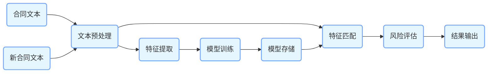

# 企业估值中的AI驱动的自动化合同审查平台评估

> 关键词：企业估值、AI驱动、自动化合同审查平台、评估方法、应用场景

> 摘要：本文聚焦于企业估值中AI驱动的自动化合同审查平台的评估。首先介绍了研究的背景、目的、预期读者和文档结构等内容。接着阐述了核心概念及联系，包括相关原理和架构，并通过Mermaid流程图进行直观展示。详细讲解了核心算法原理，用Python代码进行了示例说明，同时给出了相关数学模型和公式。通过项目实战，介绍了开发环境搭建、源代码实现及解读。分析了该平台在实际中的应用场景，推荐了学习资源、开发工具框架和相关论文著作。最后总结了未来发展趋势与挑战，解答了常见问题并提供了扩展阅读和参考资料，旨在为全面评估AI驱动的自动化合同审查平台提供系统的方法和思路。

## 1. 背景介绍 
### 1.1 目的和范围
在当今数字化时代，企业面临着大量合同管理的挑战，合同审查工作繁琐且容易出错。AI驱动的自动化合同审查平台应运而生，旨在提高合同审查的效率和准确性。本研究的目的是对这类平台进行全面评估，以确定其在企业估值中的价值。评估范围涵盖平台的技术原理、功能特性、市场应用、开发成本、未来潜力等多个方面。

### 1.2 预期读者
本文预期读者包括企业管理者、投资分析师、技术开发者、法律专业人士等。企业管理者可以通过本文了解如何评估自动化合同审查平台对企业的价值，以便做出投资决策；投资分析师可以借助评估方法对相关企业进行估值；技术开发者可以从原理和算法的讲解中获取开发灵感；法律专业人士可以了解技术如何辅助合同审查工作。

### 1.3 文档结构概述
本文将按照以下结构展开：首先介绍核心概念与联系，让读者了解自动化合同审查平台的基本原理和架构；接着阐述核心算法原理和具体操作步骤，并给出Python代码示例；然后介绍相关的数学模型和公式，帮助读者理解评估的理论基础；通过项目实战，详细介绍开发环境搭建、源代码实现和代码解读；分析实际应用场景，展示平台的价值；推荐学习资源、开发工具框架和相关论文著作；最后总结未来发展趋势与挑战，解答常见问题并提供扩展阅读和参考资料。

### 1.4 术语表
#### 1.4.1 核心术语定义
- **AI驱动**：指利用人工智能技术，如自然语言处理（NLP）、机器学习（ML）等，来实现系统的自动化和智能化。
- **自动化合同审查平台**：基于AI技术，能够自动对合同文本进行分析、审查，识别关键条款、风险点等信息的软件平台。
- **企业估值**：对企业的整体价值进行评估，考虑企业的资产、负债、盈利能力、市场前景等多个因素。

#### 1.4.2 相关概念解释
- **自然语言处理（NLP）**：是人工智能的一个分支，旨在让计算机理解、处理和生成人类语言。在合同审查平台中，NLP技术用于解析合同文本，提取关键信息。
- **机器学习（ML）**：让计算机通过数据学习模式和规律，从而进行预测和决策。在合同审查中，ML算法可以用于风险评估、条款分类等任务。

#### 1.4.3 缩略词列表
- **NLP**：Natural Language Processing（自然语言处理）
- **ML**：Machine Learning（机器学习）
- **API**：Application Programming Interface（应用程序编程接口）

## 2. 核心概念与联系 
### 核心概念原理
AI驱动的自动化合同审查平台主要基于自然语言处理和机器学习技术。其核心原理是将合同文本作为输入，通过一系列的处理步骤，提取关键信息、识别条款类型、评估风险等。具体步骤如下：
1. **文本预处理**：对合同文本进行清洗，去除噪声、格式化文本，以便后续处理。
2. **特征提取**：从文本中提取有意义的特征，如关键词、短语、句子结构等。
3. **模型训练**：使用机器学习算法，如深度学习模型，对提取的特征进行训练，以识别不同类型的条款和风险。
4. **结果输出**：根据训练好的模型，对新的合同文本进行分析，输出审查结果，如关键条款摘要、风险评估报告等。

### 架构示意图


该流程图展示了自动化合同审查平台的工作流程。首先，对已有的合同文本进行预处理、特征提取和模型训练，将训练好的模型存储起来。当有新的合同文本输入时，同样进行预处理和特征提取，然后与存储的模型进行匹配，进行风险评估，最后输出审查结果。

## 3. 核心算法原理 & 具体操作步骤 
### 核心算法原理
在自动化合同审查平台中，常用的算法包括基于规则的算法和机器学习算法。这里我们以基于深度学习的自然语言处理算法为例进行讲解。深度学习模型，如循环神经网络（RNN）及其变体长短期记忆网络（LSTM），能够处理序列数据，适合处理合同文本这种长文本数据。

#### LSTM原理
LSTM是一种特殊的RNN，能够解决传统RNN中的梯度消失问题，从而更好地处理长序列数据。LSTM的核心是细胞状态，通过三个门控机制（输入门、遗忘门和输出门）来控制细胞状态的更新和信息的流动。

输入门决定了新的输入信息有多少会被添加到细胞状态中；遗忘门决定了细胞状态中的哪些信息会被遗忘；输出门决定了细胞状态中的哪些信息会被输出。

### 具体操作步骤及Python代码示例
```python
import numpy as np
import tensorflow as tf
from tensorflow.keras.preprocessing.text import Tokenizer
from tensorflow.keras.preprocessing.sequence import pad_sequences
from tensorflow.keras.models import Sequential
from tensorflow.keras.layers import Embedding, LSTM, Dense

# 示例合同文本数据
contract_texts = [
    "本合同由甲方和乙方于2023年1月1日签订。",
    "甲方应在合同签订后10个工作日内支付预付款。",
    "乙方应在收到预付款后30天内交付货物。"
]
# 示例标签（假设为条款类型）
labels = [0, 1, 2]

# 文本预处理
tokenizer = Tokenizer()
tokenizer.fit_on_texts(contract_texts)
sequences = tokenizer.texts_to_sequences(contract_texts)
max_length = max([len(seq) for seq in sequences])
padded_sequences = pad_sequences(sequences, maxlen=max_length)

# 构建LSTM模型
model = Sequential()
model.add(Embedding(input_dim=len(tokenizer.word_index) + 1, output_dim=100, input_length=max_length))
model.add(LSTM(128))
model.add(Dense(3, activation='softmax'))

# 编译模型
model.compile(optimizer='adam', loss='sparse_categorical_crossentropy', metrics=['accuracy'])

# 训练模型
labels = np.array(labels)
model.fit(padded_sequences, labels, epochs=10, batch_size=1)

# 对新合同文本进行预测
new_contract_text = "甲方应在合同签订后15个工作日内支付尾款。"
new_sequence = tokenizer.texts_to_sequences([new_contract_text])
new_padded_sequence = pad_sequences(new_sequence, maxlen=max_length)
prediction = model.predict(new_padded_sequence)
predicted_label = np.argmax(prediction)

print(f"预测的条款类型标签: {predicted_label}")
```
代码解释：
1. **数据准备**：首先定义了示例合同文本数据和对应的标签。使用`Tokenizer`对文本进行分词处理，将文本转换为序列，然后使用`pad_sequences`对序列进行填充，使其长度一致。
2. **模型构建**：构建了一个简单的LSTM模型，包括嵌入层、LSTM层和全连接层。嵌入层将输入的词序列转换为向量表示，LSTM层处理序列数据，全连接层输出预测结果。
3. **模型训练**：使用`compile`方法编译模型，指定优化器、损失函数和评估指标。然后使用`fit`方法对模型进行训练。
4. **预测**：对新的合同文本进行预处理，然后使用训练好的模型进行预测，输出预测的条款类型标签。

## 4. 数学模型和公式 & 详细讲解 & 举例说明 
### 嵌入层公式
在嵌入层中，将词索引转换为词向量。假设输入的词索引为 $x$，嵌入矩阵为 $E$，则输出的词向量 $v$ 可以表示为：
$$v = E[x]$$
其中，$E$ 是一个 $V \times d$ 的矩阵，$V$ 是词汇表的大小，$d$ 是词向量的维度。

### LSTM单元公式
LSTM单元的核心是细胞状态 $C_t$，其更新过程由输入门 $i_t$、遗忘门 $f_t$ 和输出门 $o_t$ 控制。具体公式如下：
1. **遗忘门**：
$$f_t = \sigma(W_f[h_{t-1}, x_t] + b_f)$$
其中，$\sigma$ 是 sigmoid 函数，$W_f$ 是遗忘门的权重矩阵，$h_{t-1}$ 是上一时刻的隐藏状态，$x_t$ 是当前时刻的输入，$b_f$ 是遗忘门的偏置。

2. **输入门**：
$$i_t = \sigma(W_i[h_{t-1}, x_t] + b_i)$$
$$\tilde{C}_t = \tanh(W_C[h_{t-1}, x_t] + b_C)$$
其中，$W_i$ 和 $W_C$ 分别是输入门和候选细胞状态的权重矩阵，$b_i$ 和 $b_C$ 是对应的偏置。

3. **细胞状态更新**：
$$C_t = f_t \odot C_{t-1} + i_t \odot \tilde{C}_t$$
其中，$\odot$ 表示逐元素相乘。

4. **输出门**：
$$o_t = \sigma(W_o[h_{t-1}, x_t] + b_o)$$
$$h_t = o_t \odot \tanh(C_t)$$
其中，$W_o$ 是输出门的权重矩阵，$b_o$ 是输出门的偏置。

### 举例说明
假设词汇表大小 $V = 100$，词向量维度 $d = 10$，则嵌入矩阵 $E$ 是一个 $100 \times 10$ 的矩阵。如果输入的词索引 $x = 5$，则通过 $v = E[5]$ 可以得到对应的词向量。

对于LSTM单元，假设 $h_{t-1}$ 是一个长度为 128 的向量，$x_t$ 是一个长度为 100 的向量，$W_f$ 是一个 $228 \times 128$ 的矩阵（因为 $[h_{t-1}, x_t]$ 的长度为 $128 + 100 = 228$），$b_f$ 是一个长度为 128 的向量。通过上述公式可以计算出遗忘门的输出 $f_t$，进而更新细胞状态和隐藏状态。

## 5. 项目实战：代码实际案例和详细解释说明 
### 5.1  开发环境搭建
#### 操作系统
可以选择Windows、Linux或macOS操作系统。这里以Ubuntu 20.04为例进行说明。

#### 编程语言和环境
使用Python 3.8及以上版本。可以通过以下命令安装Python：
```bash
sudo apt update
sudo apt install python3.8
```

#### 依赖库安装
使用`pip`安装所需的依赖库，包括`tensorflow`、`numpy`、`keras`等：
```bash
pip install tensorflow numpy keras
```

### 5.2  源代码详细实现和代码解读
以下是一个更完整的自动化合同审查平台的源代码示例：
```python
import numpy as np
import tensorflow as tf
from tensorflow.keras.preprocessing.text import Tokenizer
from tensorflow.keras.preprocessing.sequence import pad_sequences
from tensorflow.keras.models import Sequential
from tensorflow.keras.layers import Embedding, LSTM, Dense
from sklearn.model_selection import train_test_split

# 加载合同文本数据和标签
def load_data():
    # 假设从文件中读取合同文本和标签
    contract_texts = []
    labels = []
    with open('contracts.txt', 'r', encoding='utf-8') as f:
        for line in f:
            text, label = line.strip().split('\t')
            contract_texts.append(text)
            labels.append(int(label))
    return contract_texts, labels

# 数据预处理
def preprocess_data(contract_texts, labels):
    tokenizer = Tokenizer()
    tokenizer.fit_on_texts(contract_texts)
    sequences = tokenizer.texts_to_sequences(contract_texts)
    max_length = max([len(seq) for seq in sequences])
    padded_sequences = pad_sequences(sequences, maxlen=max_length)
    labels = np.array(labels)
    X_train, X_test, y_train, y_test = train_test_split(padded_sequences, labels, test_size=0.2, random_state=42)
    return X_train, X_test, y_train, y_test, tokenizer, max_length

# 构建LSTM模型
def build_model(input_dim, output_dim, max_length):
    model = Sequential()
    model.add(Embedding(input_dim=input_dim, output_dim=output_dim, input_length=max_length))
    model.add(LSTM(128))
    model.add(Dense(3, activation='softmax'))
    model.compile(optimizer='adam', loss='sparse_categorical_crossentropy', metrics=['accuracy'])
    return model

# 训练模型
def train_model(model, X_train, y_train, epochs=10, batch_size=1):
    model.fit(X_train, y_train, epochs=epochs, batch_size=batch_size)
    return model

# 评估模型
def evaluate_model(model, X_test, y_test):
    loss, accuracy = model.evaluate(X_test, y_test)
    print(f"测试集损失: {loss}, 测试集准确率: {accuracy}")

# 预测新合同文本
def predict_new_text(model, tokenizer, max_length, new_text):
    new_sequence = tokenizer.texts_to_sequences([new_text])
    new_padded_sequence = pad_sequences(new_sequence, maxlen=max_length)
    prediction = model.predict(new_padded_sequence)
    predicted_label = np.argmax(prediction)
    return predicted_label

# 主函数
def main():
    contract_texts, labels = load_data()
    X_train, X_test, y_train, y_test, tokenizer, max_length = preprocess_data(contract_texts, labels)
    input_dim = len(tokenizer.word_index) + 1
    output_dim = 100
    model = build_model(input_dim, output_dim, max_length)
    model = train_model(model, X_train, y_train)
    evaluate_model(model, X_test, y_test)
    new_text = "甲方应在合同签订后20个工作日内交付保证金。"
    predicted_label = predict_new_text(model, tokenizer, max_length, new_text)
    print(f"预测的条款类型标签: {predicted_label}")

if __name__ == "__main__":
    main()
```
### 5.3  代码解读与分析
1. **数据加载**：`load_data`函数从文件中读取合同文本和对应的标签。假设文件中每行包含一个合同文本和一个标签，用制表符分隔。
2. **数据预处理**：`preprocess_data`函数对合同文本进行分词、填充和划分训练集和测试集。使用`Tokenizer`将文本转换为序列，使用`pad_sequences`对序列进行填充，使用`train_test_split`将数据划分为训练集和测试集。
3. **模型构建**：`build_model`函数构建一个LSTM模型，包括嵌入层、LSTM层和全连接层。编译模型时指定优化器、损失函数和评估指标。
4. **模型训练**：`train_model`函数使用训练集对模型进行训练。
5. **模型评估**：`evaluate_model`函数使用测试集对模型进行评估，输出测试集的损失和准确率。
6. **预测**：`predict_new_text`函数对新的合同文本进行预处理，然后使用训练好的模型进行预测，输出预测的条款类型标签。
7. **主函数**：`main`函数调用上述函数，完成数据加载、预处理、模型构建、训练、评估和预测的整个流程。

## 6. 实际应用场景 
### 企业法务部门
企业法务部门每天需要处理大量的合同审查工作，AI驱动的自动化合同审查平台可以大大提高审查效率。平台可以快速识别合同中的关键条款，如付款条款、违约责任条款等，标记出潜在的风险点，为法务人员提供参考。同时，平台可以对合同进行分类管理，方便后续的查询和统计。

### 金融机构
金融机构在贷款、投资等业务中需要对大量的合同进行审查。自动化合同审查平台可以帮助金融机构评估合同的风险，如借款人的还款能力、抵押物的合法性等。平台可以快速分析合同条款，提供风险评估报告，为金融机构的决策提供支持。

### 律师事务所
律师事务所处理各种类型的合同案件，自动化合同审查平台可以辅助律师进行合同审查和分析。平台可以帮助律师快速了解合同的核心内容，发现潜在的法律问题，提高工作效率和服务质量。

### 合同管理软件提供商
合同管理软件提供商可以将自动化合同审查功能集成到其软件中，为客户提供更全面的合同管理解决方案。通过AI驱动的合同审查功能，软件可以帮助客户更好地管理合同风险，提高合同管理的效率。

## 7. 工具和资源推荐
### 7.1 学习资源推荐
#### 7.1.1 书籍推荐
- 《Python自然语言处理实战：核心技术与算法》：详细介绍了Python在自然语言处理中的应用，包括文本预处理、特征提取、机器学习算法等内容。
- 《深度学习》：由深度学习领域的三位顶尖专家撰写，系统介绍了深度学习的基本原理、算法和应用。
- 《合同审查思维体系与实务技能》：从法律实务的角度介绍了合同审查的方法和技巧，有助于理解合同审查的业务需求。

#### 7.1.2 在线课程
- Coursera上的“Natural Language Processing Specialization”：由顶尖大学的教授授课，涵盖了自然语言处理的多个方面，包括词法分析、句法分析、语义理解等。
- edX上的“Deep Learning Fundamentals”：介绍了深度学习的基本概念、算法和应用，适合初学者入门。

#### 7.1.3 技术博客和网站
- Medium上的“Towards Data Science”：有很多关于人工智能、机器学习和自然语言处理的技术文章和案例分析。
- 博客园：国内的技术博客平台，有很多开发者分享的关于Python、深度学习等方面的技术文章。

### 7.2 开发工具框架推荐
#### 7.2.1 IDE和编辑器
- PyCharm：功能强大的Python集成开发环境，提供代码编辑、调试、版本控制等功能。
- Visual Studio Code：轻量级的代码编辑器，支持多种编程语言，有丰富的插件可以扩展功能。

#### 7.2.2 调试和性能分析工具
- TensorBoard：TensorFlow提供的可视化工具，可以帮助开发者可视化模型的训练过程、性能指标等。
- Py-Spy：用于分析Python程序性能的工具，可以找出程序中的性能瓶颈。

#### 7.2.3 相关框架和库
- TensorFlow：开源的深度学习框架，提供了丰富的工具和接口，方便开发者构建和训练深度学习模型。
- PyTorch：另一个流行的深度学习框架，具有动态图的特点，适合快速开发和实验。
- NLTK：自然语言处理工具包，提供了丰富的文本处理功能，如分词、词性标注、命名实体识别等。

### 7.3 相关论文著作推荐
#### 7.3.1 经典论文
- “Attention Is All You Need”：介绍了Transformer架构，是自然语言处理领域的重要突破。
- “Long Short-Term Memory”：首次提出了LSTM模型，解决了传统RNN中的梯度消失问题。

#### 7.3.2 最新研究成果
- 在ACL（Association for Computational Linguistics）、EMNLP（Conference on Empirical Methods in Natural Language Processing）等自然语言处理领域的顶级会议上，有很多关于合同审查、自然语言处理应用的最新研究成果。

#### 7.3.3 应用案例分析
- 一些知名企业或研究机构会发布关于AI驱动的合同审查平台的应用案例分析报告，可以在相关的行业网站或研究机构的官方网站上查找。

## 8. 总结：未来发展趋势与挑战
### 未来发展趋势
- **智能化程度不断提高**：随着人工智能技术的不断发展，自动化合同审查平台的智能化程度将不断提高。平台将能够更好地理解合同文本的语义，识别更复杂的条款和风险，提供更准确的审查结果。
- **与其他系统集成**：平台将与企业的其他系统，如合同管理系统、财务管理系统等进行集成，实现数据的共享和流程的自动化。例如，当合同审查通过后，自动触发付款流程。
- **跨语言和跨文化支持**：随着全球化的发展，企业面临的合同文本可能来自不同的国家和地区，使用不同的语言。未来的平台将提供跨语言和跨文化的支持，能够处理多种语言的合同文本。

### 挑战
- **数据质量和标注问题**：自动化合同审查平台需要大量的高质量数据进行训练，数据的质量和标注的准确性直接影响模型的性能。获取和标注大量的合同数据是一个挑战。
- **法律和合规问题**：合同审查涉及到法律问题，平台的审查结果需要符合法律法规的要求。如何确保平台的合法性和合规性是一个重要的挑战。
- **模型解释性问题**：深度学习模型通常是黑盒模型，难以解释其决策过程。在合同审查中，需要能够解释模型为什么认为某个条款存在风险，这是一个需要解决的问题。

## 9. 附录：常见问题与解答
### 问题1：自动化合同审查平台能否完全替代人工审查？
解答：目前还不能完全替代人工审查。虽然平台可以提高审查效率，识别一些常见的风险点，但合同审查涉及到法律、商业等多个方面的知识和判断，需要人工进行综合评估。平台可以作为人工审查的辅助工具，提高工作效率和准确性。

### 问题2：如何保证平台的审查结果的准确性？
解答：可以从以下几个方面保证平台的审查结果的准确性：
- 使用大量的高质量数据进行训练，提高模型的泛化能力。
- 定期对模型进行评估和优化，根据新的数据和反馈不断调整模型。
- 结合人工审查进行验证和校准，确保审查结果的可靠性。

### 问题3：平台是否支持定制化的审查规则？
解答：一些先进的自动化合同审查平台支持定制化的审查规则。企业可以根据自身的业务需求和风险偏好，定义特定的审查规则，平台会根据这些规则对合同进行审查。

## 10. 扩展阅读 & 参考资料
### 扩展阅读
- 《人工智能时代的法律变革》：探讨了人工智能技术对法律领域的影响和挑战，包括合同审查等方面。
- 《智能合同：原理、技术与应用》：介绍了智能合同的基本原理、技术实现和应用场景，与自动化合同审查平台有一定的关联。

### 参考资料
- 相关的学术论文和研究报告，可以在IEEE Xplore、ACM Digital Library等学术数据库中查找。
- 行业报告和白皮书，如Gartner、Forrester等咨询公司发布的关于人工智能在企业应用的报告。

作者：AI天才研究院/AI Genius Institute & 禅与计算机程序设计艺术 /Zen And The Art of Computer Programming