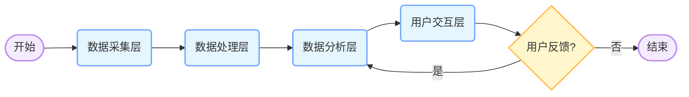

# 企业估值中的AI驱动的自动化新闻聚合平台评估

> 关键词：企业估值、AI驱动、自动化新闻聚合平台、评估方法、市场分析

> 摘要：本文聚焦于企业估值中AI驱动的自动化新闻聚合平台评估。首先介绍了相关背景，包括目的范围、预期读者等内容。接着阐述核心概念与联系，通过文本示意图和Mermaid流程图呈现其原理架构。详细讲解核心算法原理及操作步骤，运用Python代码进行说明。深入分析数学模型和公式，并举例说明。通过项目实战展示代码案例及详细解读。探讨实际应用场景，推荐相关工具和资源，包括学习资源、开发工具框架和论文著作。最后总结未来发展趋势与挑战，给出常见问题解答及扩展阅读参考资料，旨在为全面评估此类平台提供深入且系统的技术分析。

## 1. 背景介绍 
### 1.1 目的和范围
在当今数字化信息爆炸的时代，新闻内容呈现出海量、分散的特点。AI驱动的自动化新闻聚合平台应运而生，它能够高效地收集、整理和推送新闻信息，满足用户对多样化新闻的需求。本文章的目的在于为企业估值中对这类平台进行科学、准确的评估提供全面的方法和思路。范围涵盖了从平台的核心概念、算法原理、数学模型到实际应用场景等多个方面，旨在帮助投资者、企业管理者等相关人员深入了解此类平台的价值和潜力。

### 1.2 预期读者
预期读者包括金融投资领域的专业人士，如风险投资家、私募股权投资者等，他们需要对AI驱动的自动化新闻聚合平台进行估值，以决定是否进行投资。同时，也包括新闻媒体行业的从业者和管理者，他们希望通过了解平台评估方法，更好地规划自身业务发展和战略布局。此外，计算机科学和人工智能领域的研究人员和开发者也可以从本文中获取关于平台技术原理和应用的相关信息。

### 1.3 文档结构概述
本文首先介绍核心概念与联系，让读者对AI驱动的自动化新闻聚合平台有基本的认识。接着详细讲解核心算法原理和具体操作步骤，结合Python代码进行说明。然后阐述数学模型和公式，并举例分析。通过项目实战展示代码案例和详细解释。探讨实际应用场景，为读者提供平台在现实中的应用思路。推荐相关的工具和资源，方便读者进一步学习和研究。最后总结未来发展趋势与挑战，解答常见问题，并提供扩展阅读和参考资料。

### 1.4 术语表
#### 1.4.1 核心术语定义
- **AI驱动**：指利用人工智能技术，如机器学习、自然语言处理等，来实现平台的自动化运行和决策。
- **自动化新闻聚合平台**：能够自动从多个新闻源收集新闻内容，进行分类、筛选和推荐的平台。
- **企业估值**：对企业的价值进行评估，以确定其在市场中的合理价格。

#### 1.4.2 相关概念解释
- **机器学习**：是人工智能的一个分支，通过让计算机从数据中学习模式和规律，从而实现预测和决策。
- **自然语言处理**：涉及计算机与人类语言之间的交互，包括文本分类、情感分析、信息提取等技术。

#### 1.4.3 缩略词列表
- **NLP**：Natural Language Processing，自然语言处理
- **ML**：Machine Learning，机器学习

## 2. 核心概念与联系 
### 核心概念原理
AI驱动的自动化新闻聚合平台主要基于人工智能技术实现新闻的自动化收集、处理和分发。其核心原理是利用自然语言处理技术对新闻文本进行分析，包括文本分类、关键词提取、情感分析等，以便更好地理解新闻内容。同时，通过机器学习算法对用户的行为数据进行分析，实现个性化的新闻推荐。

平台的架构主要包括数据采集层、数据处理层、数据分析层和用户交互层。数据采集层负责从各种新闻源（如新闻网站、社交媒体等）收集新闻数据；数据处理层对采集到的数据进行清洗、分类和标注；数据分析层利用机器学习和自然语言处理算法对处理后的数据进行分析，提取有价值的信息；用户交互层则为用户提供新闻浏览、搜索和推荐等服务。

### 文本示意图
```plaintext
              用户交互层
                |
                | 用户请求、反馈
                v
           数据分析层
    (机器学习、NLP算法分析)
                |
                | 分析结果
                v
           数据处理层
 (数据清洗、分类、标注)
                |
                | 处理后数据
                v
           数据采集层
(从新闻源收集数据)
```

### Mermaid流程图


## 3. 核心算法原理 & 具体操作步骤 
### 核心算法原理
#### 文本分类算法
文本分类是自动化新闻聚合平台的重要环节，用于将新闻文章归类到不同的主题类别中。常用的文本分类算法有朴素贝叶斯算法。朴素贝叶斯算法基于贝叶斯定理，假设特征之间相互独立。其核心思想是计算文本属于每个类别的概率，然后选择概率最大的类别作为文本的分类结果。

#### 关键词提取算法
关键词提取用于从新闻文本中提取出能够代表文本主题的关键词。TF-IDF（Term Frequency-Inverse Document Frequency）算法是一种常用的关键词提取算法。TF-IDF算法通过计算词的词频（TF）和逆文档频率（IDF）来评估词的重要性，词频表示词在文本中出现的频率，逆文档频率表示词在整个文档集合中出现的频率的倒数。

### 具体操作步骤
#### 文本分类操作步骤
1. 数据准备：收集大量的新闻文本数据，并进行标注，即为每个文本指定一个类别标签。
2. 特征提取：将文本转换为向量表示，常用的方法是词袋模型，即将文本中的每个词作为一个特征，统计每个词在文本中出现的频率。
3. 模型训练：使用训练数据对朴素贝叶斯分类器进行训练。
4. 模型评估：使用测试数据对训练好的模型进行评估，计算模型的准确率、召回率等指标。
5. 预测：使用训练好的模型对新的新闻文本进行分类预测。

#### 关键词提取操作步骤
1. 数据预处理：对新闻文本进行清洗，去除停用词、标点符号等。
2. 计算TF-IDF值：对于每个词，计算其在文本中的TF-IDF值。
3. 选择关键词：根据TF-IDF值，选择值较高的词作为关键词。

### Python源代码详细阐述
```python
import numpy as np
from sklearn.feature_extraction.text import CountVectorizer, TfidfTransformer
from sklearn.naive_bayes import MultinomialNB
from sklearn.pipeline import Pipeline
from sklearn.datasets import fetch_20newsgroups
from sklearn.model_selection import train_test_split
from sklearn.metrics import accuracy_score

# 数据准备
categories = ['alt.atheism', 'soc.religion.christian']
twenty_train = fetch_20newsgroups(subset='train', categories=categories, shuffle=True, random_state=42)
twenty_test = fetch_20newsgroups(subset='test', categories=categories, shuffle=True, random_state=42)

# 文本分类模型训练
text_clf = Pipeline([
    ('vect', CountVectorizer()),
    ('tfidf', TfidfTransformer()),
    ('clf', MultinomialNB()),
])

text_clf.fit(twenty_train.data, twenty_train.target)

# 模型评估
predicted = text_clf.predict(twenty_test.data)
print("文本分类准确率:", accuracy_score(twenty_test.target, predicted))

# 关键词提取
from sklearn.feature_extraction.text import TfidfVectorizer

corpus = [
    'This is the first document.',
    'This document is the second document.',
    'And this is the third one.',
    'Is this the first document?',
]

vectorizer = TfidfVectorizer()
X = vectorizer.fit_transform(corpus)
feature_names = vectorizer.get_feature_names_out()

for doc_index in range(len(corpus)):
    feature_index = X[doc_index, :].nonzero()[1]
    tfidf_scores = zip(feature_index, [X[doc_index, x] for x in feature_index])
    sorted_tfidf_scores = sorted(tfidf_scores, key=lambda x: x[1], reverse=True)
    top_keywords = [feature_names[i] for i, score in sorted_tfidf_scores[:3]]
    print(f"文档 {doc_index + 1} 的关键词: {top_keywords}")
```

## 4. 数学模型和公式 & 详细讲解 & 举例说明 
### 朴素贝叶斯算法数学模型和公式
#### 贝叶斯定理
贝叶斯定理的公式为：
$$P(C|X)=\frac{P(X|C)P(C)}{P(X)}$$
其中，$P(C|X)$ 表示在特征 $X$ 出现的条件下，类别 $C$ 发生的概率；$P(X|C)$ 表示在类别 $C$ 发生的条件下，特征 $X$ 出现的概率；$P(C)$ 表示类别 $C$ 发生的先验概率；$P(X)$ 表示特征 $X$ 出现的概率。

#### 朴素贝叶斯分类器
在朴素贝叶斯分类器中，假设特征之间相互独立，即：
$$P(X|C)=\prod_{i=1}^{n}P(x_i|C)$$
其中，$X=(x_1,x_2,\cdots,x_n)$ 是特征向量。

分类器的决策规则是选择概率最大的类别作为预测结果，即：
$$\hat{C}=\arg\max_{C}P(C|X)=\arg\max_{C}\frac{P(X|C)P(C)}{P(X)}=\arg\max_{C}P(X|C)P(C)$$

### 详细讲解
贝叶斯定理的核心思想是通过已知的先验概率和条件概率，计算后验概率。在文本分类中，先验概率 $P(C)$ 可以通过训练数据中每个类别的样本数量占总样本数量的比例来估计；条件概率 $P(x_i|C)$ 可以通过计算在类别 $C$ 的样本中，特征 $x_i$ 出现的频率来估计。

### 举例说明
假设有一个新闻文本分类问题，类别有“体育”和“科技”，特征是文本中的单词。训练数据中有 100 篇新闻，其中 60 篇是体育新闻，40 篇是科技新闻。在体育新闻中，“篮球”这个词出现了 30 次，在科技新闻中，“篮球”这个词出现了 5 次。现在有一篇新的新闻文本，其中包含“篮球”这个词，我们要预测这篇新闻属于哪个类别。

先验概率：
$P(体育)=\frac{60}{100}=0.6$
$P(科技)=\frac{40}{100}=0.4$

条件概率：
$P(篮球|体育)=\frac{30}{60}=0.5$
$P(篮球|科技)=\frac{5}{40}=0.125$

后验概率：
$P(体育|篮球)=\frac{P(篮球|体育)P(体育)}{P(篮球)}=\frac{0.5\times0.6}{P(篮球)}$
$P(科技|篮球)=\frac{P(篮球|科技)P(科技)}{P(篮球)}=\frac{0.125\times0.4}{P(篮球)}$

由于分母 $P(篮球)$ 对于两个类别是相同的，我们只需要比较分子的大小：
$P(篮球|体育)P(体育)=0.5\times0.6 = 0.3$
$P(篮球|科技)P(科技)=0.125\times0.4 = 0.05$

因为 $0.3>0.05$，所以预测这篇新闻属于“体育”类别。

### TF-IDF算法数学模型和公式
#### 词频（TF）
词频是指词在文本中出现的频率，公式为：
$$TF_{t,d}=\frac{n_{t,d}}{\sum_{t' \in d}n_{t',d}}$$
其中，$n_{t,d}$ 表示词 $t$ 在文档 $d$ 中出现的次数，$\sum_{t' \in d}n_{t',d}$ 表示文档 $d$ 中所有词的出现次数之和。

#### 逆文档频率（IDF）
逆文档频率是指词在整个文档集合中出现的频率的倒数，公式为：
$$IDF_{t}=\log\frac{N}{df_{t}}$$
其中，$N$ 表示文档集合中的文档总数，$df_{t}$ 表示包含词 $t$ 的文档数。

#### TF-IDF值
TF-IDF值是词频和逆文档频率的乘积，公式为：
$$TF - IDF_{t,d}=TF_{t,d}\times IDF_{t}$$

### 详细讲解
词频反映了词在文本中的重要性，词出现的频率越高，其在文本中的重要性可能越高。逆文档频率反映了词的区分度，词在文档集合中出现的频率越低，其区分不同文档的能力越强。TF-IDF值综合考虑了词频和逆文档频率，能够更准确地评估词在文本中的重要性。

### 举例说明
假设有一个文档集合包含 100 篇文档，其中文档 $d_1$ 包含 100 个词，“苹果”这个词在文档 $d_1$ 中出现了 5 次，在整个文档集合中有 20 篇文档包含“苹果”这个词。

词频：
$$TF_{苹果,d_1}=\frac{5}{100}=0.05$$

逆文档频率：
$$IDF_{苹果}=\log\frac{100}{20}=\log5\approx1.61$$

TF-IDF值：
$$TF - IDF_{苹果,d_1}=0.05\times1.61 = 0.0805$$

## 5. 项目实战：代码实际案例和详细解释说明 
### 5.1  开发环境搭建
#### 操作系统
可以选择Windows、Linux或macOS操作系统。建议使用Linux系统，如Ubuntu，因为它对Python开发环境的支持较好。

#### Python环境
安装Python 3.7及以上版本。可以从Python官方网站（https://www.python.org/downloads/）下载安装包进行安装。

#### 依赖库安装
使用pip命令安装项目所需的依赖库，主要包括：
```bash
pip install scikit-learn numpy pandas requests beautifulsoup4
```
其中，`scikit-learn` 用于机器学习算法，`numpy` 用于数值计算，`pandas` 用于数据处理，`requests` 用于网络请求，`beautifulsoup4` 用于网页解析。

### 5.2  源代码详细实现和代码解读
```python
import requests
from bs4 import BeautifulSoup
import pandas as pd
from sklearn.feature_extraction.text import TfidfVectorizer
from sklearn.naive_bayes import MultinomialNB
from sklearn.model_selection import train_test_split
from sklearn.metrics import accuracy_score

# 数据采集
def collect_news(url):
    response = requests.get(url)
    soup = BeautifulSoup(response.text, 'html.parser')
    news_list = []
    articles = soup.find_all('article')
    for article in articles:
        title = article.find('h2').text.strip()
        content = article.find('p').text.strip()
        news_list.append({'title': title, 'content': content})
    return news_list

# 数据预处理
def preprocess_data(news_list):
    df = pd.DataFrame(news_list)
    df['text'] = df['title'] + ' ' + df['content']
    return df

# 特征提取和模型训练
def train_model(df):
    vectorizer = TfidfVectorizer()
    X = vectorizer.fit_transform(df['text'])
    y = df['category']  # 假设数据集中有category列
    X_train, X_test, y_train, y_test = train_test_split(X, y, test_size=0.2, random_state=42)
    clf = MultinomialNB()
    clf.fit(X_train, y_train)
    predicted = clf.predict(X_test)
    print("模型准确率:", accuracy_score(y_test, predicted))
    return clf, vectorizer

# 主函数
def main():
    url = 'https://example.com/news'  # 替换为实际的新闻网站URL
    news_list = collect_news(url)
    df = preprocess_data(news_list)
    clf, vectorizer = train_model(df)
    # 可以使用训练好的模型进行新的新闻分类预测

if __name__ == "__main__":
    main()
```

### 代码解读与分析
#### 数据采集部分
`collect_news` 函数通过 `requests` 库发送HTTP请求获取新闻网页的内容，然后使用 `BeautifulSoup` 库解析网页，提取新闻的标题和内容，并将其存储在一个列表中。

#### 数据预处理部分
`preprocess_data` 函数将采集到的新闻数据转换为 `pandas` 的 `DataFrame` 对象，并将标题和内容合并为一个文本列。

#### 特征提取和模型训练部分
`train_model` 函数使用 `TfidfVectorizer` 对文本数据进行特征提取，将文本转换为向量表示。然后使用 `train_test_split` 函数将数据集划分为训练集和测试集。使用 `MultinomialNB` 分类器进行模型训练，并计算模型在测试集上的准确率。

#### 主函数部分
`main` 函数调用上述函数，完成数据采集、预处理和模型训练的整个流程。

## 6. 实际应用场景 
### 金融投资领域
在金融投资领域，AI驱动的自动化新闻聚合平台可以为投资者提供及时、准确的市场信息。平台可以对新闻进行实时监测和分析，提取与金融市场相关的关键信息，如公司财报、宏观经济数据等。投资者可以根据平台提供的信息，快速做出投资决策。例如，当平台监测到某家公司发布了利好财报新闻时，投资者可以及时关注该公司的股票走势。

### 新闻媒体行业
新闻媒体行业可以利用此类平台提高新闻采编效率。平台可以自动收集和整理来自不同渠道的新闻素材，编辑人员可以根据平台提供的分类和推荐，快速找到有价值的新闻线索。同时，平台还可以对新闻进行情感分析，帮助媒体了解公众对不同新闻事件的态度和反应。

### 企业公关与品牌管理
企业可以通过自动化新闻聚合平台监测与自身相关的新闻报道，及时了解公众对企业品牌的评价和反馈。平台可以对新闻进行情感分析，帮助企业识别正面和负面新闻，以便采取相应的公关措施。例如，当平台监测到负面新闻时，企业可以及时发布澄清声明，维护品牌形象。

## 7. 工具和资源推荐
### 7.1 学习资源推荐
#### 7.1.1 书籍推荐
- 《Python机器学习》：这本书详细介绍了Python在机器学习领域的应用，包括各种机器学习算法的原理和实现。
- 《自然语言处理入门》：对自然语言处理的基本概念、算法和应用进行了系统的介绍，适合初学者。
- 《人工智能：现代方法》：是人工智能领域的经典教材，涵盖了机器学习、自然语言处理等多个方面的内容。

#### 7.1.2 在线课程
- Coursera上的“机器学习”课程：由斯坦福大学的Andrew Ng教授授课，是机器学习领域的经典课程。
- edX上的“自然语言处理”课程：提供了自然语言处理的深入学习内容，包括各种算法和应用案例。
- 阿里云天池的人工智能实战课程：结合实际项目，让学习者在实践中掌握人工智能技术。

#### 7.1.3 技术博客和网站
- Medium：上面有很多关于人工智能、机器学习和自然语言处理的技术文章和案例分享。
- 机器之心：专注于人工智能领域的资讯和技术解读，提供最新的行业动态和技术趋势。
- 开源中国：是国内知名的开源技术社区，有很多关于Python和人工智能的技术文章和代码分享。

### 7.2 开发工具框架推荐
#### 7.2.1 IDE和编辑器
- PyCharm：是一款专业的Python集成开发环境，提供了丰富的代码编辑、调试和项目管理功能。
- Jupyter Notebook：是一个交互式的开发环境，适合进行数据分析和模型实验。
- Visual Studio Code：是一款轻量级的代码编辑器，支持多种编程语言，有丰富的插件可以扩展功能。

#### 7.2.2 调试和性能分析工具
- PDB：是Python自带的调试器，可以帮助开发者定位和解决代码中的问题。
- cProfile：是Python的性能分析工具，可以分析代码的运行时间和资源消耗情况。
- TensorBoard：是TensorFlow的可视化工具，可以帮助开发者可视化模型的训练过程和性能指标。

#### 7.2.3 相关框架和库
- Scikit-learn：是一个强大的机器学习库，提供了各种机器学习算法的实现和工具。
- NLTK：是一个自然语言处理库，包含了大量的语料库和工具，方便进行文本处理和分析。
- SpaCy：是另一个高效的自然语言处理库，具有快速的处理速度和丰富的功能。

### 7.3 相关论文著作推荐
#### 7.3.1 经典论文
- 《A Tutorial on Naive Bayes Classification》：对朴素贝叶斯分类算法进行了详细的介绍和分析。
- 《Term Weighting Approaches in Automatic Text Retrieval》：是TF-IDF算法的经典论文，阐述了该算法的原理和应用。

#### 7.3.2 最新研究成果
- 可以关注ACL（Association for Computational Linguistics）、ICML（International Conference on Machine Learning）等顶级学术会议上的最新研究成果。

#### 7.3.3 应用案例分析
- 一些知名企业的技术博客会分享他们在AI驱动的自动化新闻聚合平台方面的应用案例，如谷歌、百度等。

## 8. 总结：未来发展趋势与挑战
### 未来发展趋势
#### 智能化程度不断提高
未来，AI驱动的自动化新闻聚合平台将更加智能化。平台将能够更好地理解新闻内容的语义和语境，提供更精准的新闻分类和推荐。例如，平台可以根据用户的兴趣和行为，自动生成个性化的新闻专题。

#### 多模态融合
除了文本新闻，平台将逐渐融合图像、视频等多模态信息。用户可以通过平台获取更丰富的新闻内容，提高新闻的可读性和吸引力。

#### 与区块链技术结合
区块链技术可以为新闻的真实性和版权保护提供保障。未来的平台可能会与区块链技术结合，确保新闻的来源可追溯和不可篡改。

### 挑战
#### 数据质量和隐私问题
平台需要处理大量的新闻数据，数据质量直接影响到模型的性能。同时，用户的个人信息和浏览行为数据也需要得到有效的保护，避免数据泄露和滥用。

#### 算法偏见
机器学习算法可能存在偏见，导致新闻推荐的不公平性。平台需要采取措施来减少算法偏见，确保用户能够获取到多样化的新闻内容。

#### 法律和监管问题
随着AI技术在新闻领域的应用越来越广泛，相关的法律和监管问题也日益凸显。平台需要遵守相关的法律法规，确保新闻内容的合法性和合规性。

## 9. 附录：常见问题与解答
### 问题1：如何提高自动化新闻聚合平台的新闻分类准确率？
解答：可以从以下几个方面入手：一是增加训练数据的数量和多样性，让模型学习到更多的特征和模式；二是选择合适的特征提取方法和分类算法，如使用更复杂的深度学习模型；三是对数据进行预处理，去除噪声和无用信息，提高数据质量。

### 问题2：自动化新闻聚合平台如何处理实时新闻数据？
解答：可以使用实时数据采集和处理技术，如使用消息队列和流式处理框架。当有新的新闻数据产生时，及时将其采集到平台中，并进行实时处理和分析，以便快速为用户提供最新的新闻信息。

### 问题3：如何评估自动化新闻聚合平台的价值？
解答：可以从多个方面进行评估，如用户数量、用户活跃度、新闻质量、技术创新性等。同时，可以参考同类型平台的市场估值和行业平均水平，综合考虑平台的未来发展潜力和盈利能力。

## 10. 扩展阅读 & 参考资料
### 扩展阅读
- 《深度学习》：进一步深入学习深度学习的原理和应用，了解如何将深度学习技术应用到自动化新闻聚合平台中。
- 《大数据时代》：了解大数据技术在新闻领域的应用和影响，为平台的发展提供更多的思路。

### 参考资料
- 相关的学术论文和研究报告，如ACM、IEEE等学术数据库中的论文。
- 行业报告和统计数据，如艾瑞咨询、Gartner等机构发布的报告。

作者：AI天才研究院/AI Genius Institute & 禅与计算机程序设计艺术 /Zen And The Art of Computer Programming