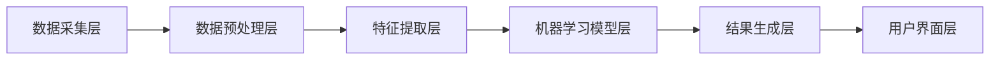

# 企业估值中的AI驱动的自动化科学文献综述平台评估

> 关键词：企业估值、AI驱动、自动化科学文献综述平台、评估指标、实际应用

> 摘要：本文聚焦于企业估值中AI驱动的自动化科学文献综述平台，旨在深入剖析此类平台的核心概念、算法原理、数学模型等方面。通过详细的项目实战案例展示其在实际中的应用，探讨了其在不同场景下的作用。同时，提供了相关的工具和资源推荐，分析了未来发展趋势与挑战，并对常见问题进行了解答。帮助读者全面了解和评估该类平台在企业估值领域的价值和应用潜力。

## 1. 背景介绍 
### 1.1 目的和范围
在当今竞争激烈的商业环境中，准确的企业估值对于投资者、管理者和其他利益相关者至关重要。随着信息爆炸时代的到来，科学文献数量呈指数级增长，手动进行文献综述变得极为耗时且困难。AI驱动的自动化科学文献综述平台应运而生，旨在提高文献综述的效率和准确性。本文章的目的是对这类平台在企业估值中的应用进行全面评估，范围涵盖平台的核心概念、算法原理、实际应用场景等多个方面。

### 1.2 预期读者
本文预期读者包括企业估值领域的专业人士，如投资分析师、财务顾问、企业管理者等，他们希望借助先进的技术手段提高估值的准确性和效率；同时也适合对人工智能在金融领域应用感兴趣的研究人员和学生，帮助他们了解该领域的最新发展动态。

### 1.3 文档结构概述
本文首先介绍了相关的背景信息，包括目的、预期读者和文档结构。接着阐述了核心概念与联系，展示了平台的原理和架构。然后详细讲解了核心算法原理和具体操作步骤，结合Python代码进行说明。之后介绍了数学模型和公式，并通过举例进行解释。在项目实战部分，提供了代码实际案例和详细解释。随后探讨了实际应用场景，推荐了相关的工具和资源。最后总结了未来发展趋势与挑战，解答了常见问题，并提供了扩展阅读和参考资料。

### 1.4 术语表
#### 1.4.1 核心术语定义
- **企业估值**：指对企业的经济价值进行评估的过程，通常基于企业的财务状况、市场前景、行业竞争等因素。
- **AI驱动**：指利用人工智能技术，如机器学习、自然语言处理等，来实现系统的自动化和智能化。
- **自动化科学文献综述平台**：一种能够自动收集、整理、分析科学文献的平台，通过AI技术提高文献综述的效率和准确性。

#### 1.4.2 相关概念解释
- **机器学习**：是一门多领域交叉学科，涉及概率论、统计学、逼近论、凸分析、算法复杂度理论等多门学科。它专门研究计算机怎样模拟或实现人类的学习行为，以获取新的知识或技能，重新组织已有的知识结构使之不断改善自身的性能。
- **自然语言处理**：是计算机科学领域与人工智能领域中的一个重要方向。它研究能实现人与计算机之间用自然语言进行有效通信的各种理论和方法，包括文本分类、信息抽取、机器翻译等。

#### 1.4.3 缩略词列表
- **NLP**：Natural Language Processing，自然语言处理
- **ML**：Machine Learning，机器学习

## 2. 核心概念与联系 
### 核心概念原理
AI驱动的自动化科学文献综述平台主要基于机器学习和自然语言处理技术。其核心原理是通过对大量科学文献的学习和分析，提取有价值的信息，并进行分类、总结和评估。具体来说，平台首先会收集相关的科学文献，这些文献可以来自学术数据库、行业报告等。然后，利用自然语言处理技术对文献进行预处理，如分词、词性标注、命名实体识别等，将文本转化为计算机能够理解的形式。接着，使用机器学习算法对预处理后的数据进行分析，如文本分类、聚类、情感分析等，以提取文献中的关键信息。最后，根据提取的信息生成文献综述报告，为企业估值提供参考。

### 架构的文本示意图
以下是该平台的架构文本示意图：
1. **数据采集层**：负责从各种数据源收集科学文献，包括学术数据库、行业网站、新闻媒体等。
2. **数据预处理层**：对采集到的文献进行清洗、分词、词性标注、命名实体识别等预处理操作，将文本转化为结构化的数据。
3. **特征提取层**：从预处理后的数据中提取有价值的特征，如关键词、主题、情感倾向等。
4. **机器学习模型层**：使用各种机器学习算法对提取的特征进行分析和建模，如文本分类、聚类、回归等。
5. **结果生成层**：根据机器学习模型的输出结果，生成文献综述报告，包括文献摘要、关键发现、趋势分析等。
6. **用户界面层**：为用户提供交互界面，方便用户查询、浏览和下载文献综述报告。

### Mermaid 流程图


## 3. 核心算法原理 & 具体操作步骤 
### 核心算法原理
#### 文本分类算法
文本分类是将文本划分到不同类别的过程。在企业估值的文献综述中，文本分类可以用于将文献分为不同的主题，如市场分析、财务状况、竞争态势等。常用的文本分类算法有朴素贝叶斯算法、支持向量机算法、深度学习算法等。

以下是一个使用Python和Scikit-learn库实现朴素贝叶斯文本分类的示例代码：
```python
from sklearn.feature_extraction.text import TfidfVectorizer
from sklearn.naive_bayes import MultinomialNB
from sklearn.pipeline import Pipeline
from sklearn.datasets import fetch_20newsgroups

# 加载数据集
categories = ['alt.atheism', 'soc.religion.christian']
train_data = fetch_20newsgroups(subset='train', categories=categories)
test_data = fetch_20newsgroups(subset='test', categories=categories)

# 创建文本分类管道
text_clf = Pipeline([
    ('tfidf', TfidfVectorizer()),
    ('clf', MultinomialNB()),
])

# 训练模型
text_clf.fit(train_data.data, train_data.target)

# 预测
predicted = text_clf.predict(test_data.data)

# 计算准确率
accuracy = sum(predicted == test_data.target) / len(test_data.target)
print(f"Accuracy: {accuracy}")
```

#### 文本聚类算法
文本聚类是将相似的文本聚为一类的过程。在企业估值的文献综述中，文本聚类可以用于发现文献中的潜在主题和趋势。常用的文本聚类算法有K-means算法、层次聚类算法等。

以下是一个使用Python和Scikit-learn库实现K-means文本聚类的示例代码：
```python
from sklearn.feature_extraction.text import TfidfVectorizer
from sklearn.cluster import KMeans
from sklearn.datasets import fetch_20newsgroups

# 加载数据集
categories = ['alt.atheism', 'soc.religion.christian']
data = fetch_20newsgroups(subset='all', categories=categories)

# 提取特征
vectorizer = TfidfVectorizer(stop_words='english')
X = vectorizer.fit_transform(data.data)

# 创建K-means模型
kmeans = KMeans(n_clusters=2, random_state=42)
kmeans.fit(X)

# 输出聚类结果
labels = kmeans.labels_
for i in range(len(data.data)):
    print(f"Document: {data.data[i][:50]}... Cluster: {labels[i]}")
```

### 具体操作步骤
1. **数据收集**：从各种数据源收集与企业估值相关的科学文献，如学术数据库、行业报告、新闻媒体等。
2. **数据预处理**：对收集到的文献进行清洗、分词、词性标注、命名实体识别等预处理操作，将文本转化为结构化的数据。
3. **特征提取**：从预处理后的数据中提取有价值的特征，如关键词、主题、情感倾向等。
4. **模型训练**：使用提取的特征训练机器学习模型，如文本分类模型、文本聚类模型等。
5. **结果生成**：根据训练好的模型对新的文献进行分类和聚类，生成文献综述报告。
6. **评估和优化**：对生成的文献综述报告进行评估，根据评估结果对模型进行优化。

## 4. 数学模型和公式 & 详细讲解 & 举例说明 
### 文本分类中的数学模型和公式
#### 朴素贝叶斯算法
朴素贝叶斯算法基于贝叶斯定理，假设特征之间相互独立。贝叶斯定理的公式为：
$$P(C|X)=\frac{P(X|C)P(C)}{P(X)}$$
其中，$P(C|X)$ 是在给定特征 $X$ 的情况下类别 $C$ 的后验概率，$P(X|C)$ 是在类别 $C$ 下特征 $X$ 的条件概率，$P(C)$ 是类别 $C$ 的先验概率，$P(X)$ 是特征 $X$ 的先验概率。

在文本分类中，$X$ 表示文本的特征向量，$C$ 表示文本的类别。朴素贝叶斯算法通过计算每个类别的后验概率，选择后验概率最大的类别作为文本的分类结果。

举例说明：假设我们有一个文本分类任务，要将文本分为“正面”和“负面”两类。我们有一个训练数据集，其中包含一些已经标注好类别的文本。我们可以使用朴素贝叶斯算法来训练一个分类模型。首先，计算每个类别的先验概率 $P(C)$，例如 $P(正面)=0.6$，$P(负面)=0.4$。然后，计算每个特征在每个类别下的条件概率 $P(X|C)$，例如对于特征“好”，$P(好|正面)=0.8$，$P(好|负面)=0.2$。最后，对于一个新的文本，计算其在每个类别下的后验概率 $P(C|X)$，选择后验概率最大的类别作为分类结果。

#### 支持向量机算法
支持向量机算法的目标是找到一个最优的超平面，将不同类别的样本分开。在文本分类中，支持向量机算法将文本的特征向量映射到高维空间中，然后在高维空间中寻找最优的超平面。

支持向量机算法的数学模型可以表示为：
$$\min_{w,b}\frac{1}{2}\|w\|^2+C\sum_{i=1}^{n}\xi_i$$
$$s.t. y_i(w^T\phi(x_i)+b)\geq 1-\xi_i, \xi_i\geq 0, i=1,2,\cdots,n$$
其中，$w$ 是超平面的法向量，$b$ 是超平面的偏移量，$\phi(x_i)$ 是将样本 $x_i$ 映射到高维空间的函数，$\xi_i$ 是松弛变量，$C$ 是惩罚参数。

### 文本聚类中的数学模型和公式
#### K-means算法
K-means算法的目标是将 $n$ 个样本划分为 $k$ 个簇，使得每个样本到其所属簇的质心的距离之和最小。

K-means算法的数学模型可以表示为：
$$\min_{S}\sum_{i=1}^{k}\sum_{x\in S_i}\|x-\mu_i\|^2$$
其中，$S=\{S_1,S_2,\cdots,S_k\}$ 是样本的划分，$\mu_i$ 是第 $i$ 个簇的质心。

K-means算法的具体步骤如下：
1. 随机选择 $k$ 个样本作为初始质心。
2. 将每个样本分配到距离其最近的质心所在的簇。
3. 重新计算每个簇的质心。
4. 重复步骤2和3，直到质心不再变化或达到最大迭代次数。

举例说明：假设我们有一个包含10个样本的数据集，要将其划分为2个簇。我们可以使用K-means算法来实现。首先，随机选择2个样本作为初始质心。然后，将每个样本分配到距离其最近的质心所在的簇。接着，重新计算每个簇的质心。重复这个过程，直到质心不再变化。最终，我们得到了一个将10个样本划分为2个簇的结果。

## 5. 项目实战：代码实际案例和详细解释说明 
### 5.1  开发环境搭建
#### 安装Python
首先，需要安装Python。可以从Python官方网站（https://www.python.org/downloads/）下载适合自己操作系统的Python版本，并按照安装向导进行安装。

#### 安装必要的库
在Python环境中，需要安装一些必要的库，如Scikit-learn、NLTK、Pandas等。可以使用以下命令来安装这些库：
```sh
pip install scikit-learn nltk pandas
```

#### 下载数据集
可以从学术数据库、行业报告等数据源下载与企业估值相关的科学文献数据集。

### 5.2  源代码详细实现和代码解读
以下是一个完整的示例代码，实现了一个简单的AI驱动的自动化科学文献综述平台：
```python
import pandas as pd
from sklearn.feature_extraction.text import TfidfVectorizer
from sklearn.naive_bayes import MultinomialNB
from sklearn.model_selection import train_test_split
from sklearn.metrics import accuracy_score

# 加载数据集
data = pd.read_csv('literature_data.csv')
X = data['text']
y = data['category']

# 划分训练集和测试集
X_train, X_test, y_train, y_test = train_test_split(X, y, test_size=0.2, random_state=42)

# 特征提取
vectorizer = TfidfVectorizer(stop_words='english')
X_train_vec = vectorizer.fit_transform(X_train)
X_test_vec = vectorizer.transform(X_test)

# 训练模型
clf = MultinomialNB()
clf.fit(X_train_vec, y_train)

# 预测
y_pred = clf.predict(X_test_vec)

# 计算准确率
accuracy = accuracy_score(y_test, y_pred)
print(f"Accuracy: {accuracy}")

# 生成文献综述报告
def generate_report(data, clf, vectorizer):
    categories = clf.classes_
    report = {}
    for category in categories:
        category_data = data[data['category'] == category]
        category_text = ' '.join(category_data['text'])
        keywords = vectorizer.get_feature_names_out()
        tfidf_matrix = vectorizer.transform([category_text])
        feature_index = tfidf_matrix[0,:].nonzero()[1]
        tfidf_scores = zip(feature_index, [tfidf_matrix[0, x] for x in feature_index])
        sorted_tfidf_scores = sorted(tfidf_scores, key=lambda x: x[1], reverse=True)
        top_keywords = [keywords[i] for i, score in sorted_tfidf_scores[:10]]
        report[category] = top_keywords
    return report

report = generate_report(data, clf, vectorizer)
print("Literature Review Report:")
for category, keywords in report.items():
    print(f"Category: {category}")
    print(f"Top Keywords: {keywords}")
```

### 代码解读与分析
1. **数据加载**：使用Pandas库加载包含文献文本和类别的数据集。
2. **数据划分**：使用Scikit-learn库的`train_test_split`函数将数据集划分为训练集和测试集。
3. **特征提取**：使用`TfidfVectorizer`将文本转化为TF-IDF特征向量。
4. **模型训练**：使用朴素贝叶斯算法训练文本分类模型。
5. **预测和评估**：使用训练好的模型对测试集进行预测，并计算准确率。
6. **生成文献综述报告**：根据训练好的模型和特征提取器，生成每个类别的文献综述报告，包括前10个关键词。

## 6. 实际应用场景 
### 投资决策
在投资决策中，投资者需要对目标企业进行全面的评估。AI驱动的自动化科学文献综述平台可以帮助投资者快速收集和分析与目标企业相关的科学文献，了解企业的市场前景、技术实力、竞争态势等方面的信息，从而做出更明智的投资决策。

### 企业战略规划
企业管理者在制定战略规划时，需要了解行业的发展趋势和竞争对手的情况。该平台可以帮助企业管理者收集和分析相关的科学文献，发现行业的热点和趋势，为企业的战略规划提供参考。

### 学术研究
在学术研究中，研究人员需要对相关领域的文献进行综述，了解研究现状和前沿动态。该平台可以帮助研究人员快速收集和整理大量的文献，提高文献综述的效率和准确性。

## 7. 工具和资源推荐
### 7.1 学习资源推荐
#### 7.1.1 书籍推荐
- 《机器学习》（周志华著）：全面介绍了机器学习的基本概念、算法和应用。
- 《自然语言处理入门》（何晗著）：详细介绍了自然语言处理的基础知识和常用算法。
- 《Python数据分析实战》（Sebastian Raschka著）：介绍了使用Python进行数据分析的方法和技巧。

#### 7.1.2 在线课程
- Coursera上的“机器学习”课程（Andrew Ng教授主讲）：经典的机器学习课程，讲解深入透彻。
- edX上的“自然语言处理”课程：系统介绍了自然语言处理的理论和实践。
- 网易云课堂上的“Python数据分析与挖掘实战”课程：结合实际案例，讲解Python在数据分析和挖掘中的应用。

#### 7.1.3 技术博客和网站
- 博客园：有很多技术博客，涵盖了机器学习、自然语言处理等多个领域。
- 开源中国：提供了大量的开源项目和技术文章。
- Kaggle：是一个数据科学竞赛平台，有很多优秀的数据集和解决方案。

### 7.2 开发工具框架推荐
#### 7.2.1 IDE和编辑器
- PyCharm：是一款专业的Python集成开发环境，功能强大，支持代码调试、版本控制等。
- Jupyter Notebook：是一个交互式的开发环境，适合进行数据分析和机器学习实验。
- Visual Studio Code：是一款轻量级的代码编辑器，支持多种编程语言和插件扩展。

#### 7.2.2 调试和性能分析工具
- PDB：Python自带的调试工具，可以帮助开发者定位和解决代码中的问题。
- cProfile：Python的性能分析工具，可以分析代码的运行时间和内存使用情况。
- TensorBoard：是TensorFlow的可视化工具，可以帮助开发者可视化模型的训练过程和性能指标。

#### 7.2.3 相关框架和库
- Scikit-learn：是一个常用的机器学习库，提供了丰富的机器学习算法和工具。
- NLTK：是一个自然语言处理库，提供了各种自然语言处理工具和数据集。
- TensorFlow：是一个开源的深度学习框架，广泛应用于图像识别、自然语言处理等领域。

### 7.3 相关论文著作推荐
#### 7.3.1 经典论文
- “A Comparison of Event Models for Naive Bayes Text Classification”：介绍了朴素贝叶斯文本分类的不同事件模型。
- “Support-Vector Networks”：提出了支持向量机算法的基本理论和方法。
- “K-Means++: The Advantages of Careful Seeding”：介绍了K-means++算法，改进了K-means算法的初始质心选择方法。

#### 7.3.2 最新研究成果
- “Transformer-based models for text classification”：研究了基于Transformer架构的文本分类模型。
- “Graph neural networks for natural language processing”：探讨了图神经网络在自然语言处理中的应用。
- “Explainable AI in financial applications”：研究了可解释人工智能在金融领域的应用。

#### 7.3.3 应用案例分析
- “Using AI-driven literature review platforms in enterprise valuation: A case study”：通过实际案例分析了AI驱动的文献综述平台在企业估值中的应用。
- “How financial institutions are leveraging AI for data analysis”：介绍了金融机构如何利用人工智能进行数据分析。
- “The impact of AI on investment decision-making”：研究了人工智能对投资决策的影响。

## 8. 总结：未来发展趋势与挑战
### 未来发展趋势
- **智能化程度不断提高**：随着人工智能技术的不断发展，AI驱动的自动化科学文献综述平台的智能化程度将不断提高，能够更加准确地理解和分析文献内容。
- **与其他技术的融合**：该平台将与大数据、云计算、区块链等技术进行融合，实现更高效的数据处理和存储，提高平台的性能和安全性。
- **应用领域不断拓展**：除了企业估值领域，该平台还将在医疗、教育、科研等领域得到更广泛的应用。

### 挑战
- **数据质量问题**：科学文献的质量参差不齐，存在噪声和错误信息，如何提高数据质量是一个挑战。
- **算法的可解释性**：一些复杂的机器学习算法，如深度学习算法，缺乏可解释性，如何提高算法的可解释性是一个需要解决的问题。
- **隐私和安全问题**：在收集和处理科学文献数据时，需要保护用户的隐私和数据安全，防止数据泄露和滥用。

## 9. 附录：常见问题与解答
### 问题1：AI驱动的自动化科学文献综述平台的准确性如何保证？
解答：平台的准确性可以通过多种方式保证，如使用高质量的数据集进行训练、选择合适的机器学习算法、进行模型评估和优化等。此外，还可以结合人工审核来提高结果的准确性。

### 问题2：该平台可以处理哪些类型的文献？
解答：该平台可以处理各种类型的文献，包括学术论文、行业报告、新闻文章等。只要文献是以文本形式存在，都可以进行处理。

### 问题3：平台的运行效率如何？
解答：平台的运行效率取决于多种因素，如数据集的大小、算法的复杂度、硬件设备等。通过优化算法和使用高性能的硬件设备，可以提高平台的运行效率。

## 10. 扩展阅读 & 参考资料
### 扩展阅读
- 《人工智能：现代方法》（Stuart Russell、Peter Norvig著）：全面介绍了人工智能的基本概念、算法和应用。
- 《深度学习》（Ian Goodfellow、Yoshua Bengio、Aaron Courville著）：详细介绍了深度学习的理论和实践。
- 《数据挖掘：概念与技术》（Jiawei Han、Jian Pei、Jianying Yin著）：介绍了数据挖掘的基本概念、算法和应用。

### 参考资料
- 学术数据库：如IEEE Xplore、ACM Digital Library、ScienceDirect等。
- 行业报告：如麦肯锡报告、波士顿咨询集团报告等。
- 相关网站：如AI开源社区、机器学习论坛等。

作者：AI天才研究院/AI Genius Institute & 禅与计算机程序设计艺术 /Zen And The Art of Computer Programming