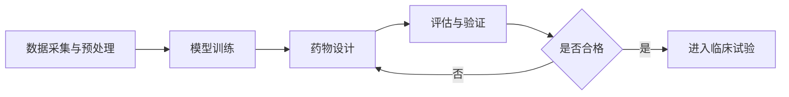

# 企业估值中的AI驱动的药物设计平台评估

> 关键词：企业估值、AI驱动、药物设计平台、评估方法、市场潜力

> 摘要：本文聚焦于企业估值中AI驱动的药物设计平台评估。随着人工智能技术在药物研发领域的广泛应用，AI驱动的药物设计平台展现出巨大潜力。文章首先介绍了相关背景，包括目的、预期读者、文档结构和术语表。接着阐述了核心概念与联系，详细讲解了核心算法原理及具体操作步骤，给出了数学模型和公式并举例说明。通过项目实战展示了代码实际案例及详细解释。分析了实际应用场景，推荐了相关工具和资源。最后总结了未来发展趋势与挑战，解答常见问题并提供扩展阅读和参考资料，旨在为准确评估AI驱动的药物设计平台企业价值提供全面且深入的指导。

## 1. 背景介绍 
### 1.1 目的和范围
目的在于构建一套全面且科学的评估体系，用于准确评估AI驱动的药物设计平台企业的价值。随着人工智能与药物研发的深度融合，这类企业在生物医药领域崭露头角，但目前缺乏统一、有效的估值方法。本评估将涵盖平台的技术实力、研发效率、市场潜力、知识产权等多个关键方面，以帮助投资者、企业管理者等相关方做出合理的决策。

### 1.2 预期读者
本文预期读者包括生物医药行业的投资者、企业管理人员、药物研发专业人员、金融分析师以及对AI和药物设计交叉领域感兴趣的研究人员。投资者可通过本文了解如何评估该类平台企业的投资价值，企业管理人员能借助评估方法优化企业战略，药物研发人员可关注平台技术优势，金融分析师能提升对该新兴领域企业的估值能力，研究人员则可获取相关研究的基础和思路。

### 1.3 文档结构概述
本文将按照以下结构展开：首先介绍背景信息，包括目的、读者和文档结构等；接着阐述核心概念与联系，明确AI驱动的药物设计平台相关概念及相互关系；然后详细讲解核心算法原理及具体操作步骤，给出Python代码示例；随后介绍数学模型和公式，并举例说明；通过项目实战展示代码案例及解读；分析实际应用场景；推荐相关工具和资源；总结未来发展趋势与挑战；解答常见问题并提供扩展阅读和参考资料。

### 1.4 术语表
#### 1.4.1 核心术语定义
- **AI驱动的药物设计平台**：利用人工智能技术，如机器学习、深度学习等，辅助药物研发过程，包括靶点发现、药物分子设计、活性预测等环节的综合性平台。
- **企业估值**：对企业整体价值进行评估的过程，考虑企业的资产、负债、盈利能力、市场前景等多方面因素。
- **靶点发现**：确定与疾病相关的生物分子靶点，为药物研发提供目标。
- **药物分子设计**：根据靶点信息，设计具有潜在治疗活性的药物分子结构。

#### 1.4.2 相关概念解释
- **机器学习**：让计算机通过数据学习模式和规律，从而进行预测和决策的技术。在药物设计中，可用于预测药物分子的活性、毒性等。
- **深度学习**：机器学习的一个分支，通过多层神经网络模拟人类大脑的学习过程，在图像识别、自然语言处理和药物设计等领域有广泛应用。
- **药物研发周期**：从靶点发现到药物上市的整个过程所需的时间，AI驱动的药物设计平台旨在缩短这一周期。

#### 1.4.3 缩略词列表
- **AI**：Artificial Intelligence（人工智能）
- **ML**：Machine Learning（机器学习）
- **DL**：Deep Learning（深度学习）
- **FDA**：Food and Drug Administration（美国食品药品监督管理局）

## 2. 核心概念与联系 

### 核心概念原理
AI驱动的药物设计平台核心在于利用人工智能技术处理大量的生物医学数据，包括基因序列、蛋白质结构、化合物信息等，以辅助药物研发的各个环节。其原理基于机器学习和深度学习算法，通过对已知数据的学习，建立预测模型，用于预测药物分子的活性、毒性、药代动力学性质等。

例如，在靶点发现阶段，平台可以分析基因表达数据、蛋白质相互作用网络等，识别与疾病相关的潜在靶点。在药物分子设计阶段，利用生成模型生成新的药物分子结构，并通过评分函数评估其潜在活性。

### 架构的文本示意图
AI驱动的药物设计平台通常包含以下几个主要模块：
1. **数据采集与预处理模块**：负责收集各种生物医学数据，并进行清洗、标注和特征提取。
2. **模型训练模块**：使用机器学习或深度学习算法对预处理后的数据进行训练，建立预测模型。
3. **药物设计模块**：基于训练好的模型，进行靶点发现、药物分子设计和优化。
4. **评估与验证模块**：对设计出的药物分子进行活性、毒性等方面的评估和验证。

### Mermaid流程图


## 3. 核心算法原理 & 具体操作步骤 

### 核心算法原理
在AI驱动的药物设计平台中，常用的算法包括支持向量机（SVM）、随机森林（RF）、卷积神经网络（CNN）和生成对抗网络（GAN）等。以下以卷积神经网络（CNN）为例，介绍其在药物活性预测中的原理。

卷积神经网络是一种深度学习模型，特别适合处理具有网格结构的数据，如图像、音频和生物序列等。在药物活性预测中，CNN可以将药物分子的结构信息转换为二维或三维矩阵，然后通过卷积层提取特征，池化层减少特征维度，最后通过全连接层进行预测。

### 具体操作步骤及Python源代码
以下是一个简单的使用Python和Keras库实现的CNN药物活性预测示例：

```python
import numpy as np
from keras.models import Sequential
from keras.layers import Conv2D, MaxPooling2D, Flatten, Dense

# 生成示例数据
# 假设我们有1000个药物分子，每个分子用一个10x10的矩阵表示
X_train = np.random.rand(1000, 10, 10, 1)
y_train = np.random.randint(0, 2, 1000)

# 构建CNN模型
model = Sequential()
model.add(Conv2D(32, (3, 3), activation='relu', input_shape=(10, 10, 1)))
model.add(MaxPooling2D((2, 2)))
model.add(Conv2D(64, (3, 3), activation='relu'))
model.add(MaxPooling2D((2, 2)))
model.add(Flatten())
model.add(Dense(64, activation='relu'))
model.add(Dense(1, activation='sigmoid'))

# 编译模型
model.compile(optimizer='adam', loss='binary_crossentropy', metrics=['accuracy'])

# 训练模型
model.fit(X_train, y_train, epochs=10, batch_size=32)

# 预测
X_test = np.random.rand(100, 10, 10, 1)
predictions = model.predict(X_test)
```

### 代码解释
1. **数据生成**：使用`np.random.rand`生成随机的训练数据`X_train`和标签`y_train`。
2. **模型构建**：使用`Sequential`模型构建CNN，包括卷积层、池化层、全连接层等。
3. **模型编译**：使用`adam`优化器和`binary_crossentropy`损失函数编译模型。
4. **模型训练**：使用`fit`方法训练模型。
5. **预测**：使用训练好的模型对测试数据`X_test`进行预测。

## 4. 数学模型和公式 & 详细讲解 & 举例说明 

### 卷积层数学模型
卷积层是CNN的核心层，其数学模型可以表示为：

$$y_{i,j}^l = f\left(\sum_{m=0}^{M - 1}\sum_{n=0}^{N - 1}w_{m,n}^l x_{i + m,j + n}^{l - 1}+b^l\right)$$

其中，$y_{i,j}^l$ 是第 $l$ 层卷积层的输出特征图中第 $(i,j)$ 位置的值，$f$ 是激活函数（如ReLU），$w_{m,n}^l$ 是第 $l$ 层的卷积核权重，$x_{i + m,j + n}^{l - 1}$ 是第 $l - 1$ 层输入特征图中对应位置的值，$b^l$ 是偏置项。

### 池化层数学模型
池化层用于减少特征图的维度，常用的池化方法是最大池化。最大池化的数学模型可以表示为：

$$y_{i,j}^l=\max_{m = 0}^{M-1}\max_{n = 0}^{N - 1}x_{i\times s+m,j\times s + n}^{l-1}$$

其中，$y_{i,j}^l$ 是第 $l$ 层池化层的输出特征图中第 $(i,j)$ 位置的值，$s$ 是池化步长，$x_{i\times s+m,j\times s + n}^{l-1}$ 是第 $l - 1$ 层输入特征图中对应位置的值。

### 全连接层数学模型
全连接层将卷积层和池化层的输出特征图展平后进行线性变换，其数学模型可以表示为：

$$y_k^l = f\left(\sum_{i = 0}^{N-1}w_{ki}^l x_i^{l - 1}+b_k^l\right)$$

其中，$y_k^l$ 是第 $l$ 层全连接层的第 $k$ 个输出值，$f$ 是激活函数（如ReLU或Sigmoid），$w_{ki}^l$ 是第 $l$ 层全连接层的权重，$x_i^{l - 1}$ 是第 $l - 1$ 层输入值，$b_k^l$ 是偏置项。

### 举例说明
假设我们有一个输入特征图 $x$ 是一个 $3\times3$ 的矩阵：

$$x=\begin{bmatrix}
1 & 2 & 3\\
4 & 5 & 6\\
7 & 8 & 9
\end{bmatrix}$$

使用一个 $2\times2$ 的卷积核 $w$：

$$w=\begin{bmatrix}
1 & 2\\
3 & 4
\end{bmatrix}$$

偏置项 $b = 1$，激活函数为ReLU。则卷积操作如下：

首先计算卷积结果：

$$\begin{align*}
y_{0,0}&=\sum_{m = 0}^{1}\sum_{n = 0}^{1}w_{m,n}x_{m,n}+b\\
&=1\times1 + 2\times2+3\times4 + 4\times5+1\\
&=1 + 4+12 + 20+1\\
&=38
\end{align*}$$

同理计算其他位置的值，最终得到卷积层的输出特征图。

## 5. 项目实战：代码实际案例和详细解释说明 

### 5.1  开发环境搭建
#### 安装Python
首先需要安装Python，建议使用Python 3.7及以上版本。可以从Python官方网站（https://www.python.org/downloads/）下载安装包进行安装。

#### 安装必要的库
使用pip命令安装以下必要的库：
```sh
pip install numpy pandas keras tensorflow scikit-learn
```

### 5.2  源代码详细实现和代码解读
以下是一个完整的项目实战代码，用于药物活性预测：

```python
import numpy as np
import pandas as pd
from sklearn.model_selection import train_test_split
from keras.models import Sequential
from keras.layers import Conv2D, MaxPooling2D, Flatten, Dense

# 加载数据
data = pd.read_csv('drug_data.csv')
X = data.drop('activity', axis=1).values
y = data['activity'].values

# 数据预处理
X = X.reshape(-1, 10, 10, 1)

# 划分训练集和测试集
X_train, X_test, y_train, y_test = train_test_split(X, y, test_size=0.2, random_state=42)

# 构建CNN模型
model = Sequential()
model.add(Conv2D(32, (3, 3), activation='relu', input_shape=(10, 10, 1)))
model.add(MaxPooling2D((2, 2)))
model.add(Conv2D(64, (3, 3), activation='relu'))
model.add(MaxPooling2D((2, 2)))
model.add(Flatten())
model.add(Dense(64, activation='relu'))
model.add(Dense(1, activation='sigmoid'))

# 编译模型
model.compile(optimizer='adam', loss='binary_crossentropy', metrics=['accuracy'])

# 训练模型
model.fit(X_train, y_train, epochs=10, batch_size=32, validation_data=(X_test, y_test))

# 评估模型
loss, accuracy = model.evaluate(X_test, y_test)
print(f'Test loss: {loss}, Test accuracy: {accuracy}')
```

### 代码解读与分析
1. **数据加载**：使用`pandas`库加载包含药物特征和活性标签的数据文件`drug_data.csv`。
2. **数据预处理**：将特征数据`X`重塑为适合CNN输入的四维张量。
3. **数据划分**：使用`train_test_split`函数将数据划分为训练集和测试集。
4. **模型构建**：构建一个简单的CNN模型，包括卷积层、池化层和全连接层。
5. **模型编译**：使用`adam`优化器和`binary_crossentropy`损失函数编译模型。
6. **模型训练**：使用`fit`方法训练模型，并在验证集上进行验证。
7. **模型评估**：使用`evaluate`方法评估模型在测试集上的性能。

## 6. 实际应用场景 
### 靶点发现
AI驱动的药物设计平台可以分析大量的基因表达数据、蛋白质相互作用网络等，发现与疾病相关的潜在靶点。例如，通过分析癌症患者的基因数据，平台可以识别出与肿瘤生长和转移相关的关键基因，为开发针对性的抗癌药物提供靶点。

### 药物分子设计
平台可以利用生成模型生成新的药物分子结构，并通过评分函数评估其潜在活性。这可以大大缩短药物研发周期，提高研发效率。例如，一些平台可以根据已知的靶点结构，生成具有高亲和力的药物分子，然后通过虚拟筛选进一步优化。

### 药物活性预测
使用机器学习和深度学习算法，平台可以预测药物分子的活性、毒性、药代动力学性质等。这有助于在药物研发的早期阶段筛选出有潜力的药物分子，减少不必要的实验成本。例如，通过对大量已知药物分子的活性数据进行学习，平台可以预测新设计的药物分子的活性。

### 药物重定位
AI驱动的药物设计平台可以分析已上市药物的作用机制和副作用，发现其新的治疗适应症。这可以为药企提供新的商业机会，同时也可以加快药物的临床应用。例如，一些原本用于治疗心血管疾病的药物，通过平台分析发现其对某种罕见病也有潜在的治疗作用。

## 7. 工具和资源推荐
### 7.1 学习资源推荐
#### 7.1.1 书籍推荐
- 《深度学习》（Deep Learning）：由Ian Goodfellow、Yoshua Bengio和Aaron Courville撰写，是深度学习领域的经典教材，涵盖了深度学习的基本原理、算法和应用。
- 《Python机器学习》（Python Machine Learning）：由Sebastian Raschka和Vahid Mirjalili撰写，介绍了使用Python进行机器学习的方法和技巧，包括各种机器学习算法的实现和应用。
- 《药物化学》（Medicinal Chemistry）：由Foye等人编写，是药物化学领域的权威教材，介绍了药物的设计、合成和作用机制等方面的知识。

#### 7.1.2 在线课程
- Coursera上的“深度学习专项课程”（Deep Learning Specialization）：由Andrew Ng教授授课，包括深度学习的基础知识、卷积神经网络、循环神经网络等内容。
- edX上的“人工智能基础”（Introduction to Artificial Intelligence）：介绍了人工智能的基本概念、算法和应用，适合初学者。
- Kaggle上的“机器学习微课程”（Machine Learning Micro-Course）：提供了实践导向的机器学习教程，通过实际案例学习机器学习的方法和技巧。

#### 7.1.3 技术博客和网站
- Towards Data Science：是一个专注于数据科学和机器学习的博客平台，提供了大量的技术文章和案例分析。
- Medium上的AI板块：有许多关于人工智能和药物设计的文章，涵盖了最新的研究成果和应用案例。
- Bioinformatics.org：是一个生物信息学领域的专业网站，提供了生物医学数据处理、分析和可视化等方面的资源和工具。

### 7.2 开发工具框架推荐
#### 7.2.1 IDE和编辑器
- PyCharm：是一款专业的Python集成开发环境，提供了丰富的代码编辑、调试和项目管理功能。
- Jupyter Notebook：是一个交互式的笔记本环境，适合进行数据分析、模型训练和可视化等工作。
- Visual Studio Code：是一款轻量级的代码编辑器，支持多种编程语言和插件，可用于Python开发。

#### 7.2.2 调试和性能分析工具
- TensorBoard：是TensorFlow提供的可视化工具，可用于监控模型训练过程、查看模型结构和分析性能指标。
- Py-Spy：是一个用于Python代码性能分析的工具，可以实时查看代码的运行时间和内存使用情况。
- Numba：是一个用于加速Python代码的工具，通过即时编译技术将Python代码转换为机器码，提高代码的运行速度。

#### 7.2.3 相关框架和库
- TensorFlow：是一个开源的深度学习框架，提供了丰富的工具和接口，可用于构建和训练各种深度学习模型。
- PyTorch：是另一个流行的深度学习框架，具有动态图和易于使用的特点，适合研究和开发。
- RDKit：是一个开源的化学信息学工具包，提供了分子结构处理、指纹计算、分子相似性分析等功能。

### 7.3 相关论文著作推荐
#### 7.3.1 经典论文
- “Deep Learning” by Yann LeCun, Yoshua Bengio, and Geoffrey Hinton：发表于Nature杂志，是深度学习领域的经典综述论文，介绍了深度学习的发展历程、基本原理和应用。
- “Convolutional Neural Networks for Sentence Classification” by Yoon Kim：提出了使用卷积神经网络进行文本分类的方法，为自然语言处理领域的研究提供了新的思路。
- “Autoencoder-based Dimensionality Reduction for Drug Discovery” by Xiaohua Xu et al.：介绍了使用自编码器进行药物发现中的数据降维和特征提取的方法。

#### 7.3.2 最新研究成果
- 关注顶级学术会议如NeurIPS（神经信息处理系统大会）、ICML（国际机器学习会议）、ACM SIGKDD（知识发现与数据挖掘会议）等上关于AI和药物设计的研究成果。
- 关注顶级学术期刊如Nature、Science、Cell、Journal of Medicinal Chemistry等上的相关研究论文。

#### 7.3.3 应用案例分析
- 一些药企和科研机构会发布关于AI驱动的药物设计平台应用案例的报告和论文，可以关注这些资源，了解实际应用中的经验和教训。

## 8. 总结：未来发展趋势与挑战
### 未来发展趋势
#### 多组学数据融合
未来的AI驱动的药物设计平台将更多地融合多组学数据，如基因组学、转录组学、蛋白质组学和代谢组学等，以更全面地了解疾病的发病机制和药物的作用靶点，提高药物研发的准确性和效率。

#### 强化学习的应用
强化学习在药物设计中的应用将越来越广泛。通过强化学习算法，平台可以在药物设计过程中进行实时反馈和优化，逐步探索出最优的药物分子结构。

#### 跨学科合作
AI驱动的药物设计需要计算机科学、生物学、化学等多个学科的交叉合作。未来，跨学科的研究团队将更加紧密地合作，推动该领域的快速发展。

#### 个性化药物研发
随着精准医学的发展，未来的药物研发将更加注重个性化。AI驱动的药物设计平台可以根据患者的个体基因信息和疾病特征，设计出个性化的药物，提高治疗效果。

### 挑战
#### 数据质量和隐私问题
AI驱动的药物设计需要大量的高质量生物医学数据，但目前数据的质量参差不齐，且存在数据隐私和安全问题。如何获取高质量的数据并保护患者的隐私是一个亟待解决的问题。

#### 模型可解释性
深度学习模型通常是黑盒模型，其决策过程难以解释。在药物设计中，模型的可解释性至关重要，因为医生和患者需要了解药物的作用机制和潜在风险。如何提高模型的可解释性是一个挑战。

#### 法规和伦理问题
AI驱动的药物设计涉及到许多法规和伦理问题，如药物审批、临床试验的设计和执行等。如何在法规和伦理的框架内开展研究和应用是一个需要关注的问题。

#### 技术人才短缺
AI驱动的药物设计需要既懂人工智能又懂药物研发的跨学科人才，但目前这类人才短缺。如何培养和吸引更多的跨学科人才是推动该领域发展的关键。

## 9. 附录：常见问题与解答
### 问题1：AI驱动的药物设计平台能完全替代传统的药物研发方法吗？
解答：目前还不能完全替代。虽然AI驱动的药物设计平台在靶点发现、药物分子设计和活性预测等方面具有很大的优势，但传统的药物研发方法在药物的临床前和临床试验、安全性评估等方面仍然不可或缺。未来，两者将相互补充，共同推动药物研发的发展。

### 问题2：如何评估AI驱动的药物设计平台的性能？
解答：可以从多个方面评估，如平台的预测准确性、研发效率、发现新靶点和新药物分子的能力等。可以使用一些指标来衡量，如准确率、召回率、F1值等。同时，还可以通过实际应用案例和临床试验结果来评估平台的性能。

### 问题3：AI驱动的药物设计平台的开发成本高吗？
解答：开发成本相对较高。一方面，需要大量的计算资源来进行数据处理和模型训练；另一方面，需要专业的技术人才来进行平台的开发和维护。此外，获取高质量的生物医学数据也需要一定的成本。但从长远来看，AI驱动的药物设计平台可以提高研发效率，降低研发成本。

### 问题4：AI驱动的药物设计平台的应用前景如何？
解答：应用前景非常广阔。随着人工智能技术的不断发展和生物医学数据的不断积累，AI驱动的药物设计平台将在药物研发领域发挥越来越重要的作用。它可以加速药物研发进程，提高研发成功率，为患者提供更多的治疗选择。

## 10. 扩展阅读 & 参考资料
### 扩展阅读
- 《人工智能时代的药物研发》：深入探讨了人工智能在药物研发中的应用和挑战。
- 《生物信息学导论》：介绍了生物信息学的基本概念和方法，对于理解AI驱动的药物设计平台的数据处理和分析有帮助。

### 参考资料
- LeCun, Y., Bengio, Y., & Hinton, G. (2015). Deep learning. Nature, 521(7553), 436-444.
- Kim, Y. (2014). Convolutional neural networks for sentence classification. arXiv preprint arXiv:1408.5882.
- Xu, X., et al. (2018). Autoencoder-based dimensionality reduction for drug discovery. Journal of Chemical Information and Modeling, 58(7), 1381-1390.

作者：AI天才研究院/AI Genius Institute & 禅与计算机程序设计艺术 /Zen And The Art of Computer Programming