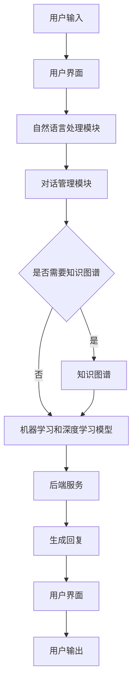

# 企业估值中的AI驱动的虚拟助理系统评估

> 关键词：企业估值、AI驱动、虚拟助理系统、评估方法、价值模型

> 摘要：本文聚焦于企业估值中AI驱动的虚拟助理系统评估这一重要议题。随着人工智能技术的迅猛发展，虚拟助理系统在企业中得到广泛应用，其价值评估对于企业准确衡量自身资产、制定战略决策具有关键意义。文章详细阐述了虚拟助理系统的核心概念与联系，深入剖析其核心算法原理及操作步骤，介绍了相关数学模型和公式，并结合项目实战给出代码案例与解读。同时探讨了该系统的实际应用场景，推荐了相关工具和资源，最后对未来发展趋势与挑战进行总结，旨在为企业和相关从业者提供全面且深入的参考，助力其更好地理解和评估AI驱动的虚拟助理系统在企业中的价值。

## 1. 背景介绍 
### 1.1 目的和范围
在当今数字化时代，AI技术已经成为推动企业发展的重要力量。AI驱动的虚拟助理系统在企业的客户服务、业务流程优化、决策支持等多个方面发挥着日益重要的作用。本文章的目的在于深入探讨如何对企业中的AI驱动的虚拟助理系统进行科学、准确的评估，以确定其在企业估值中的价值。范围涵盖虚拟助理系统的技术原理、应用场景、价值评估方法等多个层面，旨在为企业管理者、投资者、技术专家等提供全面的知识和方法，以便更好地理解和评估虚拟助理系统的价值。

### 1.2 预期读者
本文的预期读者包括企业管理者，他们需要了解虚拟助理系统的价值，以便做出合理的战略决策和资源分配；投资者，他们希望通过准确评估虚拟助理系统的价值来判断企业的投资潜力；技术专家，他们对虚拟助理系统的技术原理和实现细节感兴趣，以推动技术的创新和发展；以及相关领域的研究人员，他们可以从本文中获取研究思路和方法。

### 1.3 文档结构概述
本文首先介绍背景信息，包括目的、预期读者和文档结构概述等内容。接着阐述虚拟助理系统的核心概念与联系，通过文本示意图和Mermaid流程图进行直观展示。然后深入讲解核心算法原理和具体操作步骤，结合Python源代码进行详细说明。随后介绍相关的数学模型和公式，并举例说明。在项目实战部分，给出代码实际案例并进行详细解释。之后探讨虚拟助理系统的实际应用场景。再推荐相关的工具和资源，包括学习资源、开发工具框架和相关论文著作等。最后总结未来发展趋势与挑战，提供常见问题与解答，并列出扩展阅读和参考资料。

### 1.4 术语表
#### 1.4.1 核心术语定义
- **AI驱动的虚拟助理系统**：基于人工智能技术，能够模拟人类对话和行为，为用户提供智能化服务的软件系统。
- **企业估值**：对企业整体价值进行评估的过程，通常考虑企业的资产、收益、市场地位等多个因素。
- **价值评估模型**：用于衡量虚拟助理系统价值的数学模型和方法。

#### 1.4.2 相关概念解释
- **自然语言处理（NLP）**：人工智能的一个分支，研究如何让计算机理解和处理人类语言。
- **机器学习（ML）**：让计算机通过数据学习模式和规律，从而实现预测和决策的技术。
- **深度学习（DL）**：机器学习的一种，通过构建深层神经网络来处理复杂的数据和任务。

#### 1.4.3 缩略词列表
- **NLP**：Natural Language Processing（自然语言处理）
- **ML**：Machine Learning（机器学习）
- **DL**：Deep Learning（深度学习）

## 2. 核心概念与联系 

### 核心概念原理
AI驱动的虚拟助理系统主要基于自然语言处理、机器学习和深度学习等技术。自然语言处理技术使虚拟助理能够理解用户的自然语言输入，包括语音和文本。通过词法分析、句法分析和语义理解等步骤，将用户的输入转化为计算机能够处理的形式。机器学习和深度学习技术则用于训练虚拟助理的模型，使其能够根据历史数据和用户反馈不断优化自身的性能。例如，通过对大量的用户对话数据进行训练，虚拟助理可以学习到不同问题的答案和处理方式，从而提高回答的准确性和效率。

### 架构的文本示意图
AI驱动的虚拟助理系统通常包括以下几个主要部分：
1. **用户界面**：用户与虚拟助理进行交互的接口，包括语音输入、文本输入等方式。
2. **自然语言处理模块**：对用户输入的自然语言进行处理，提取语义信息。
3. **对话管理模块**：负责管理对话的流程和状态，根据用户的输入和历史对话记录生成合适的回复。
4. **知识图谱**：存储虚拟助理所需的知识和信息，为回答用户问题提供支持。
5. **机器学习和深度学习模型**：用于训练和优化虚拟助理的性能。
6. **后端服务**：处理虚拟助理的业务逻辑和数据存储等任务。

### Mermaid流程图


## 3. 核心算法原理 & 具体操作步骤 

### 核心算法原理
AI驱动的虚拟助理系统中常用的算法包括自然语言处理算法和机器学习算法。

#### 自然语言处理算法
- **词法分析**：将用户输入的文本拆分为一个个词语，常用的算法有基于规则的算法和基于统计的算法。例如，中文分词可以使用结巴分词库。
- **句法分析**：分析句子的语法结构，确定词语之间的关系。常用的算法有依存句法分析和成分句法分析。
- **语义理解**：理解用户输入的语义信息，确定用户的意图。常用的算法有基于规则的意图识别和基于机器学习的意图识别。

#### 机器学习算法
- **分类算法**：用于对用户的问题进行分类，例如将问题分为常见问题、技术问题、业务问题等。常用的分类算法有决策树、支持向量机、朴素贝叶斯等。
- **回归算法**：用于预测数值型的结果，例如预测用户的满意度评分。常用的回归算法有线性回归、逻辑回归等。
- **聚类算法**：用于将相似的用户问题或数据进行聚类，以便更好地进行管理和分析。常用的聚类算法有K-Means算法、层次聚类算法等。

### 具体操作步骤

#### 数据收集
收集大量的用户对话数据，包括问题和对应的答案。数据可以来自企业的客户服务记录、在线论坛、社交媒体等。

#### 数据预处理
对收集到的数据进行清洗、标注和特征提取等预处理操作。清洗数据包括去除噪声、重复数据和无效数据等。标注数据是为数据添加标签，例如问题的类别、答案的正确性等。特征提取是从数据中提取有用的特征，例如词语的词频、词性等。

#### 模型训练
使用预处理后的数据对机器学习和深度学习模型进行训练。选择合适的算法和模型结构，设置训练参数，进行多次迭代训练，直到模型的性能达到满意的程度。

#### 模型评估
使用测试数据对训练好的模型进行评估，计算模型的准确率、召回率、F1值等指标，评估模型的性能。

#### 系统部署
将训练好的模型部署到虚拟助理系统中，与其他模块进行集成，实现虚拟助理的功能。

### Python源代码示例
以下是一个简单的基于朴素贝叶斯算法的文本分类示例：

```python
from sklearn.feature_extraction.text import CountVectorizer
from sklearn.naive_bayes import MultinomialNB
from sklearn.model_selection import train_test_split
from sklearn.metrics import accuracy_score

# 示例数据
corpus = [
    "这是一个关于技术的问题",
    "我想了解业务方面的信息",
    "请问这个产品怎么使用",
    "技术支持在哪里",
    "业务拓展有什么策略"
]
labels = ["技术", "业务", "技术", "技术", "业务"]

# 数据预处理
vectorizer = CountVectorizer()
X = vectorizer.fit_transform(corpus)

# 划分训练集和测试集
X_train, X_test, y_train, y_test = train_test_split(X, labels, test_size=0.2, random_state=42)

# 模型训练
clf = MultinomialNB()
clf.fit(X_train, y_train)

# 模型预测
y_pred = clf.predict(X_test)

# 模型评估
accuracy = accuracy_score(y_test, y_pred)
print(f"模型准确率: {accuracy}")
```

## 4. 数学模型和公式 & 详细讲解 & 举例说明 

### 数学模型和公式

#### 朴素贝叶斯分类器
朴素贝叶斯分类器基于贝叶斯定理，其公式为：
$$P(c|x)=\frac{P(x|c)P(c)}{P(x)}$$
其中，$P(c|x)$ 表示在给定特征 $x$ 的情况下，类别 $c$ 的概率；$P(x|c)$ 表示在类别 $c$ 的情况下，特征 $x$ 的概率；$P(c)$ 表示类别 $c$ 的先验概率；$P(x)$ 表示特征 $x$ 的先验概率。

在文本分类中，通常假设特征之间是相互独立的，即朴素贝叶斯的“朴素”假设。因此，$P(x|c)$ 可以表示为：
$$P(x|c)=\prod_{i=1}^{n}P(x_i|c)$$
其中，$x_i$ 表示第 $i$ 个特征。

#### 准确率、召回率和F1值
- **准确率（Accuracy）**：表示模型预测正确的样本数占总样本数的比例，公式为：
$$Accuracy=\frac{TP + TN}{TP + TN + FP + FN}$$
其中，$TP$ 表示真正例（预测为正例且实际为正例），$TN$ 表示真反例（预测为反例且实际为反例），$FP$ 表示假正例（预测为正例但实际为反例），$FN$ 表示假反例（预测为反例但实际为正例）。
- **召回率（Recall）**：表示模型预测正确的正例数占实际正例数的比例，公式为：
$$Recall=\frac{TP}{TP + FN}$$
- **F1值（F1-Score）**：是准确率和召回率的调和平均数，公式为：
$$F1=\frac{2\times Precision\times Recall}{Precision + Recall}$$
其中，$Precision=\frac{TP}{TP + FP}$ 表示精确率。

### 详细讲解
朴素贝叶斯分类器通过计算不同类别下特征的概率，来预测输入样本的类别。在文本分类中，特征通常是词语的词频。先验概率 $P(c)$ 可以通过训练数据中各类别的样本数占总样本数的比例来估计。条件概率 $P(x_i|c)$ 可以通过训练数据中在类别 $c$ 下特征 $x_i$ 的出现频率来估计。

准确率、召回率和F1值是常用的模型评估指标。准确率反映了模型整体的预测准确性，但在样本不平衡的情况下可能会产生误导。召回率反映了模型对正例的识别能力，F1值综合考虑了准确率和召回率，更全面地评估了模型的性能。

### 举例说明
假设我们有一个二分类问题，预测邮件是否为垃圾邮件。在测试集中，有100封邮件，其中实际为垃圾邮件的有60封，实际为正常邮件的有40封。模型预测结果如下：
- 预测为垃圾邮件且实际为垃圾邮件的有50封（$TP = 50$）
- 预测为垃圾邮件但实际为正常邮件的有10封（$FP = 10$）
- 预测为正常邮件但实际为垃圾邮件的有10封（$FN = 10$）
- 预测为正常邮件且实际为正常邮件的有30封（$TN = 30$）

则准确率为：
$$Accuracy=\frac{50 + 30}{50 + 30 + 10 + 10}=0.8$$
召回率为：
$$Recall=\frac{50}{50 + 10}\approx0.833$$
精确率为：
$$Precision=\frac{50}{50 + 10}\approx0.833$$
F1值为：
$$F1=\frac{2\times0.833\times0.833}{0.833 + 0.833}\approx0.833$$

## 5. 项目实战：代码实际案例和详细解释说明 

### 5.1  开发环境搭建
#### 安装Python
首先，确保你已经安装了Python。可以从Python官方网站（https://www.python.org/downloads/） 下载适合你操作系统的Python版本，并按照安装向导进行安装。

#### 安装必要的库
使用pip命令安装必要的库，例如：
```sh
pip install scikit-learn numpy pandas
```

### 5.2  源代码详细实现和代码解读
以下是一个更完整的基于深度学习的虚拟助理意图识别的代码示例：

```python
import numpy as np
import pandas as pd
from sklearn.model_selection import train_test_split
from sklearn.preprocessing import LabelEncoder
from tensorflow.keras.preprocessing.text import Tokenizer
from tensorflow.keras.preprocessing.sequence import pad_sequences
from tensorflow.keras.models import Sequential
from tensorflow.keras.layers import Embedding, LSTM, Dense

# 读取数据
data = pd.read_csv('intents.csv')
texts = data['text'].values
labels = data['label'].values

# 标签编码
label_encoder = LabelEncoder()
encoded_labels = label_encoder.fit_transform(labels)

# 分词
tokenizer = Tokenizer()
tokenizer.fit_on_texts(texts)
sequences = tokenizer.texts_to_sequences(texts)

# 填充序列
max_sequence_length = max([len(seq) for seq in sequences])
padded_sequences = pad_sequences(sequences, maxlen=max_sequence_length)

# 划分训练集和测试集
X_train, X_test, y_train, y_test = train_test_split(padded_sequences, encoded_labels, test_size=0.2, random_state=42)

# 构建模型
model = Sequential()
model.add(Embedding(input_dim=len(tokenizer.word_index) + 1, output_dim=100, input_length=max_sequence_length))
model.add(LSTM(100))
model.add(Dense(len(label_encoder.classes_), activation='softmax'))

# 编译模型
model.compile(optimizer='adam', loss='sparse_categorical_crossentropy', metrics=['accuracy'])

# 训练模型
model.fit(X_train, y_train, epochs=10, batch_size=32, validation_data=(X_test, y_test))

# 模型评估
loss, accuracy = model.evaluate(X_test, y_test)
print(f"模型损失: {loss}, 模型准确率: {accuracy}")

# 预测示例
new_text = ["这是一个新的问题"]
new_sequence = tokenizer.texts_to_sequences(new_text)
new_padded_sequence = pad_sequences(new_sequence, maxlen=max_sequence_length)
prediction = model.predict(new_padded_sequence)
predicted_label = label_encoder.inverse_transform([np.argmax(prediction)])
print(f"预测标签: {predicted_label}")
```

### 5.3  代码解读与分析
1. **数据读取**：使用pandas库读取包含用户问题和对应意图标签的CSV文件。
2. **标签编码**：使用LabelEncoder将文本标签转换为数字标签，方便模型处理。
3. **分词**：使用Tokenizer对用户问题进行分词处理，将文本转换为数字序列。
4. **填充序列**：为了使所有序列长度一致，使用pad_sequences函数对序列进行填充。
5. **划分训练集和测试集**：使用train_test_split函数将数据划分为训练集和测试集。
6. **构建模型**：使用Keras构建一个基于LSTM的深度学习模型，包括嵌入层、LSTM层和全连接层。
7. **编译模型**：使用adam优化器和sparse_categorical_crossentropy损失函数编译模型。
8. **训练模型**：使用训练集对模型进行训练，设置训练轮数和批次大小。
9. **模型评估**：使用测试集对模型进行评估，计算模型的损失和准确率。
10. **预测示例**：对新的用户问题进行预测，将预测结果转换为原始的文本标签。

## 6. 实际应用场景 

### 客户服务
AI驱动的虚拟助理系统可以在客户服务中发挥重要作用。它可以自动回答客户的常见问题，提供产品信息和解决方案，提高客户服务的效率和质量。例如，电商平台的虚拟助理可以回答客户关于商品价格、库存、配送等问题；银行的虚拟助理可以帮助客户查询账户信息、办理业务等。

### 业务流程优化
虚拟助理系统可以协助企业优化业务流程。它可以自动化处理一些重复性的任务，例如数据录入、报表生成等，减少人工操作的错误和时间成本。同时，虚拟助理可以根据业务规则和历史数据提供决策支持，帮助企业做出更明智的决策。

### 智能营销
虚拟助理系统可以用于智能营销。它可以根据用户的偏好和行为数据，为用户提供个性化的推荐和营销信息。例如，在线音乐平台的虚拟助理可以根据用户的听歌历史推荐相似的歌曲；旅游网站的虚拟助理可以根据用户的出行计划推荐合适的旅游目的地和酒店。

### 内部培训
虚拟助理系统可以作为企业内部培训的工具。它可以提供培训资料和学习资源，帮助员工快速掌握新知识和技能。同时，虚拟助理可以与员工进行互动，解答员工的疑问，提高培训的效果。

## 7. 工具和资源推荐
### 7.1 学习资源推荐
#### 7.1.1 书籍推荐
- 《Python自然语言处理》：全面介绍了Python在自然语言处理中的应用，包括词法分析、句法分析、语义理解等内容。
- 《深度学习》：深度学习领域的经典著作，详细介绍了深度学习的原理、算法和应用。
- 《机器学习》：系统阐述了机器学习的基本概念、算法和模型，是学习机器学习的重要参考书籍。

#### 7.1.2 在线课程
- Coursera上的“自然语言处理专项课程”：由顶尖大学的教授授课，内容涵盖自然语言处理的各个方面。
- edX上的“深度学习微硕士学位课程”：提供深度学习的深入学习和实践机会。
- 网易云课堂上的“Python机器学习实战”：通过实际案例讲解Python在机器学习中的应用。

#### 7.1.3 技术博客和网站
- Medium：有很多关于人工智能、自然语言处理和机器学习的优秀博客文章。
- Towards Data Science：专注于数据科学和机器学习领域的技术分享和研究成果。
- 开源中国：提供丰富的技术文章和开源项目，涵盖人工智能、软件开发等多个领域。

### 7.2 开发工具框架推荐
#### 7.2.1 IDE和编辑器
- PyCharm：功能强大的Python集成开发环境，提供代码编辑、调试、版本控制等功能。
- Visual Studio Code：轻量级的代码编辑器，支持多种编程语言和插件扩展，适合快速开发。
- Jupyter Notebook：交互式的开发环境，适合数据探索、模型训练和实验。

#### 7.2.2 调试和性能分析工具
- TensorBoard：TensorFlow的可视化工具，可以帮助用户监控模型的训练过程、分析模型的性能。
- Py-Spy：用于分析Python程序的性能瓶颈，找出耗时的函数和代码段。
- cProfile：Python内置的性能分析工具，可以统计函数的调用次数和执行时间。

#### 7.2.3 相关框架和库
- TensorFlow：开源的深度学习框架，提供丰富的深度学习模型和工具。
- PyTorch：另一个流行的深度学习框架，具有动态图和易于使用的特点。
- scikit-learn：简单高效的机器学习库，提供多种机器学习算法和工具。
- NLTK：自然语言处理工具包，提供词法分析、句法分析、语义理解等功能。

### 7.3 相关论文著作推荐
#### 7.3.1 经典论文
- “Attention Is All You Need”：提出了Transformer架构，是自然语言处理领域的重要突破。
- “Deep Residual Learning for Image Recognition”：提出了残差网络（ResNet），解决了深度学习中的梯度消失问题。
- “Generative Adversarial Nets”：提出了生成对抗网络（GAN），在图像生成、数据增强等领域有广泛应用。

#### 7.3.2 最新研究成果
- 关注顶级学术会议如ACL（计算语言学协会年会）、NeurIPS（神经信息处理系统大会）、ICML（国际机器学习会议）上的最新研究论文，了解AI驱动的虚拟助理系统的前沿技术和发展趋势。

#### 7.3.3 应用案例分析
- 一些知名企业如谷歌、亚马逊、微软等发布的关于虚拟助理系统的应用案例和技术报告，可以深入了解实际应用中的经验和挑战。

## 8. 总结：未来发展趋势与挑战

### 未来发展趋势
- **多模态交互**：未来的虚拟助理系统将支持多种模态的交互，包括语音、文本、图像、手势等。用户可以通过更加自然和多样化的方式与虚拟助理进行交流，提高交互的效率和体验。
- **个性化服务**：虚拟助理系统将更加注重个性化服务，根据用户的偏好、历史记录和上下文信息提供更加精准和个性化的推荐和服务。
- **与物联网的融合**：虚拟助理系统将与物联网设备深度融合，实现对智能家居、智能汽车等设备的远程控制和管理，为用户提供更加便捷的生活体验。
- **跨语言和跨文化支持**：随着全球化的发展，虚拟助理系统将支持更多的语言和文化，打破语言和文化的障碍，为全球用户提供服务。

### 挑战
- **数据隐私和安全**：虚拟助理系统需要处理大量的用户数据，包括个人信息、对话记录等。如何保护用户的数据隐私和安全是一个重要的挑战。
- **语义理解的准确性**：虽然自然语言处理技术取得了很大的进展，但在语义理解的准确性方面仍然存在挑战。特别是对于一些复杂的语言表达和语境，虚拟助理系统可能会出现理解错误。
- **知识更新和维护**：虚拟助理系统需要不断更新和维护知识，以适应不断变化的业务和用户需求。如何高效地更新和维护知识是一个需要解决的问题。
- **伦理和法律问题**：随着虚拟助理系统的广泛应用，一些伦理和法律问题也逐渐浮现，例如虚拟助理的责任认定、虚假信息传播等。需要建立相应的伦理和法律规范来规范虚拟助理系统的发展。

## 9. 附录：常见问题与解答

### 问题1：如何选择适合的机器学习算法？
解答：选择适合的机器学习算法需要考虑多个因素，包括数据的类型、规模、复杂度，以及问题的类型（分类、回归、聚类等）。一般来说，可以先尝试一些简单的算法，如决策树、朴素贝叶斯等，然后根据模型的性能和效果选择更复杂的算法，如深度学习算法。同时，可以使用交叉验证等方法来评估不同算法的性能。

### 问题2：如何提高虚拟助理系统的准确率？
解答：提高虚拟助理系统的准确率可以从以下几个方面入手：
- **数据质量**：确保收集到的数据准确、完整、无噪声，并且具有足够的多样性。
- **特征工程**：选择合适的特征，并对特征进行有效的处理和提取，以提高模型的性能。
- **模型选择和调优**：选择适合的模型，并对模型的参数进行调优，以提高模型的准确率。
- **持续学习**：让虚拟助理系统不断学习新的数据和知识，以适应不断变化的用户需求和业务环境。

### 问题3：虚拟助理系统的开发成本高吗？
解答：虚拟助理系统的开发成本取决于多个因素，包括系统的功能复杂度、技术难度、数据规模、开发团队的经验和成本等。一般来说，简单的虚拟助理系统开发成本相对较低，而复杂的、具有高级功能的虚拟助理系统开发成本较高。同时，开发成本还包括后续的维护和更新成本。

## 10. 扩展阅读 & 参考资料
- 《人工智能：一种现代的方法》
- 《Python机器学习基础教程》
- 相关学术期刊如《Journal of Artificial Intelligence Research》《Artificial Intelligence》等。
- 相关技术论坛和社区，如Stack Overflow、GitHub等。

作者：AI天才研究院/AI Genius Institute & 禅与计算机程序设计艺术 /Zen And The Art of Computer Programming