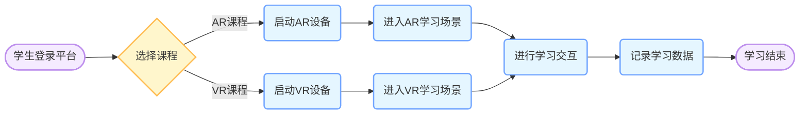

# 企业估值中的AR/VR远程教育平台评估

> 关键词：企业估值、AR/VR技术、远程教育平台、评估方法、市场前景

> 摘要：本文聚焦于企业估值中AR/VR远程教育平台的评估。首先介绍了研究的背景、目的、预期读者和文档结构等内容。接着阐述了AR/VR远程教育平台的核心概念、架构及相互联系，并给出相应的示意图和流程图。详细讲解了用于评估的核心算法原理及具体操作步骤，配以Python代码示例。同时给出了相关的数学模型和公式，并举例说明。通过项目实战，展示了开发环境搭建、源代码实现及解读。分析了该平台的实际应用场景，推荐了学习资源、开发工具框架和相关论文著作。最后总结了未来发展趋势与挑战，提供常见问题解答和扩展阅读参考资料，旨在为企业准确评估AR/VR远程教育平台价值提供全面的指导。

## 1. 背景介绍 
### 1.1 目的和范围
随着科技的飞速发展，AR（增强现实）和VR（虚拟现实）技术逐渐应用于远程教育领域，形成了AR/VR远程教育平台。本研究的目的在于深入探讨如何对这类平台进行准确的企业估值。评估的范围涵盖了平台的技术水平、市场潜力、用户规模、商业模式等多个方面，旨在为投资者、企业管理者等提供科学、合理的估值方法和决策依据。

### 1.2 预期读者
本文的预期读者包括对AR/VR远程教育行业感兴趣的投资者，他们希望通过准确的估值来判断投资的可行性和潜在回报；远程教育平台的企业管理者，需要了解自身平台的价值以制定发展战略和进行融资决策；以及相关领域的研究人员，为学术研究和行业分析提供参考。

### 1.3 文档结构概述
本文将按照以下结构展开：首先介绍核心概念与联系，让读者对AR/VR远程教育平台有清晰的认识；接着阐述核心算法原理和具体操作步骤，提供估值的技术手段；然后给出数学模型和公式，并举例说明；通过项目实战展示代码实现和解读；分析实际应用场景；推荐相关的工具和资源；最后总结未来发展趋势与挑战，解答常见问题并提供扩展阅读参考资料。

### 1.4 术语表
#### 1.4.1 核心术语定义
- **AR（增强现实）**：是一种将虚拟信息与真实世界巧妙融合的技术，通过摄像头、传感器等设备，将计算机生成的虚拟物体、场景或信息叠加到现实环境中，使用户能够同时感知真实和虚拟的内容。
- **VR（虚拟现实）**：是利用计算机模拟产生一个三维空间的虚拟世界，提供使用者关于视觉、听觉、触觉等感官的模拟，让使用者如同身临其境一般，可以及时、没有限制地观察三度空间内的事物。
- **远程教育平台**：是指通过互联网技术，实现教师与学生在不同地点进行教学和学习活动的软件系统，它提供课程发布、学习管理、互动交流等功能。
- **企业估值**：是指着眼于企业本身，对企业的内在价值进行评估，确定企业在某一时点的公平市场价值。

#### 1.4.2 相关概念解释
- **沉浸式学习体验**：在AR/VR远程教育中，学习者能够全身心地投入到虚拟的学习环境中，仿佛置身于真实的场景中进行学习，这种体验可以提高学习的积极性和效果。
- **用户粘性**：指用户对平台的依赖程度和使用频率，高用户粘性意味着用户更愿意长期使用平台，为平台带来稳定的收益。

#### 1.4.3 缩略词列表
- **AR**：Augmented Reality
- **VR**：Virtual Reality

## 2. 核心概念与联系 

### 核心概念原理
AR/VR远程教育平台结合了AR/VR技术和远程教育的优势。AR技术通过增强现实设备，如AR眼镜，将虚拟的教学内容与现实场景相结合，为学生提供更加直观、生动的学习体验。例如，在学习地理知识时，学生可以通过AR眼镜看到虚拟的地理模型叠加在现实的地图上，更加清晰地理解地理概念。

VR技术则创造了一个完全虚拟的学习环境，学生可以在其中进行沉浸式的学习。比如在学习历史时，学生可以通过VR设备穿越到历史场景中，亲身体验历史事件，增强学习的趣味性和记忆效果。

远程教育平台作为基础架构，负责课程的管理、学生的学习记录、教师与学生之间的互动等功能。它通过互联网将教师和学生连接起来，打破了时间和空间的限制，使学生可以随时随地进行学习。

### 架构的文本示意图
```plaintext
+---------------------+
|  AR/VR远程教育平台  |
+---------------------+
|  前端展示层         |
|  - AR/VR设备交互    |
|  - 网页/APP界面     |
+---------------------+
|  业务逻辑层         |
|  - 课程管理         |
|  - 学习记录管理     |
|  - 互动交流管理     |
+---------------------+
|  数据存储层         |
|  - 课程数据         |
|  - 用户数据         |
|  - 学习记录数据     |
+---------------------+
|  技术支撑层         |
|  - AR/VR技术        |
|  - 云计算           |
|  - 大数据           |
+---------------------+
```

### Mermaid流程图


## 3. 核心算法原理 & 具体操作步骤 

### 核心算法原理
在对AR/VR远程教育平台进行估值时，常用的算法是现金流折现法（DCF）和市场比较法。

#### 现金流折现法（DCF）
现金流折现法的核心思想是将平台未来的预期现金流按照一定的折现率折现到当前时刻，从而得到平台的内在价值。其原理基于货币的时间价值，即未来的一元钱在当前的价值小于一元。

#### 市场比较法
市场比较法是通过比较类似的AR/VR远程教育平台的市场交易价格，来估算目标平台的价值。这种方法假设市场上类似平台的交易价格能够反映其真实价值。

### 具体操作步骤及Python代码示例

#### 现金流折现法（DCF）操作步骤
1. **预测未来现金流**：根据平台的历史数据和市场趋势，预测未来每年的现金流。
2. **确定折现率**：折现率反映了投资的风险和机会成本，通常可以根据市场利率、行业平均收益率等因素来确定。
3. **计算现值**：将未来每年的现金流按照折现率折现到当前时刻，并求和得到平台的内在价值。

以下是使用Python实现现金流折现法的代码示例：
```python
def dcf_valuation(cash_flows, discount_rate):
    """
    现金流折现法估值函数
    :param cash_flows: 未来每年的现金流列表
    :param discount_rate: 折现率
    :return: 平台的内在价值
    """
    present_value = 0
    for i, cash_flow in enumerate(cash_flows):
        present_value += cash_flow / ((1 + discount_rate) ** (i + 1))
    return present_value

# 示例数据
cash_flows = [100000, 120000, 150000, 180000, 200000]  # 未来五年的现金流
discount_rate = 0.1  # 折现率为10%

value = dcf_valuation(cash_flows, discount_rate)
print(f"平台的内在价值为: {value}")
```

#### 市场比较法操作步骤
1. **选择可比公司**：在市场上选择与目标平台业务相似、规模相近的AR/VR远程教育平台作为可比公司。
2. **收集可比公司数据**：收集可比公司的市场交易价格、财务指标等数据。
3. **计算估值倍数**：根据可比公司的数据，计算常用的估值倍数，如市盈率（P/E）、市销率（P/S）等。
4. **估算目标平台价值**：将目标平台的相应财务指标乘以估值倍数，得到目标平台的估算价值。

以下是使用Python实现市场比较法的简单示例：
```python
def market_comparison_valuation(target_revenue, comparable_ps_ratio):
    """
    市场比较法估值函数
    :param target_revenue: 目标平台的年收入
    :param comparable_ps_ratio: 可比公司的市销率
    :return: 目标平台的估算价值
    """
    return target_revenue * comparable_ps_ratio

# 示例数据
target_revenue = 500000  # 目标平台的年收入
comparable_ps_ratio = 3  # 可比公司的市销率

value = market_comparison_valuation(target_revenue, comparable_ps_ratio)
print(f"目标平台的估算价值为: {value}")
```

## 4. 数学模型和公式 & 详细讲解 & 举例说明 

### 现金流折现法（DCF）数学模型和公式
现金流折现法的基本公式为：
$$V = \sum_{t=1}^{n} \frac{CF_t}{(1 + r)^t}$$
其中：
- $V$ 表示平台的内在价值
- $CF_t$ 表示第 $t$ 年的现金流
- $r$ 表示折现率
- $n$ 表示预测的年数

**详细讲解**：该公式的原理是将未来每年的现金流 $CF_t$ 按照折现率 $r$ 折现到当前时刻，然后将所有折现后的现金流相加得到平台的内在价值。折现率 $r$ 反映了投资的风险和机会成本，折现率越高，未来现金流的现值越低。

**举例说明**：假设一个AR/VR远程教育平台未来三年的现金流分别为 $100,000$ 元、$120,000$ 元、$150,000$ 元，折现率为 $10\%$。则该平台的内在价值为：
$$V = \frac{100000}{(1 + 0.1)^1} + \frac{120000}{(1 + 0.1)^2} + \frac{150000}{(1 + 0.1)^3}$$
$$V = \frac{100000}{1.1} + \frac{120000}{1.21} + \frac{150000}{1.331}$$
$$V \approx 90909.09 + 99173.55 + 112697.22$$
$$V \approx 302779.86$$（元）

### 市场比较法数学模型和公式
市场比较法常用的估值公式为：
$$V = X \times M$$
其中：
- $V$ 表示目标平台的估算价值
- $X$ 表示目标平台的某个财务指标，如年收入、净利润等
- $M$ 表示可比公司的估值倍数，如市盈率、市销率等

**详细讲解**：该公式的原理是通过可比公司的估值倍数来估算目标平台的价值。首先选择合适的财务指标和估值倍数，然后将目标平台的财务指标乘以估值倍数得到估算价值。

**举例说明**：假设一个可比的AR/VR远程教育平台的市销率为 $4$，目标平台的年收入为 $200,000$ 元。则目标平台的估算价值为：
$$V = 200000 \times 4 = 800000$$（元）

## 5. 项目实战：代码实际案例和详细解释说明 

### 5.1  开发环境搭建
为了实现一个简单的AR/VR远程教育平台估值系统，我们可以使用Python进行开发。以下是开发环境搭建的步骤：

1. **安装Python**：从Python官方网站（https://www.python.org/downloads/）下载并安装Python 3.x版本。
2. **安装必要的库**：我们需要安装一些常用的Python库，如`numpy`、`pandas`等。可以使用以下命令进行安装：
```sh
pip install numpy pandas
```

### 5.2  源代码详细实现和代码解读
以下是一个完整的Python代码示例，实现了现金流折现法和市场比较法的估值功能：
```python
import numpy as np
import pandas as pd

def dcf_valuation(cash_flows, discount_rate):
    """
    现金流折现法估值函数
    :param cash_flows: 未来每年的现金流列表
    :param discount_rate: 折现率
    :return: 平台的内在价值
    """
    present_value = 0
    for i, cash_flow in enumerate(cash_flows):
        present_value += cash_flow / ((1 + discount_rate) ** (i + 1))
    return present_value

def market_comparison_valuation(target_revenue, comparable_ps_ratio):
    """
    市场比较法估值函数
    :param target_revenue: 目标平台的年收入
    :param comparable_ps_ratio: 可比公司的市销率
    :return: 目标平台的估算价值
    """
    return target_revenue * comparable_ps_ratio

# 示例数据
cash_flows = [100000, 120000, 150000, 180000, 200000]  # 未来五年的现金流
discount_rate = 0.1  # 折现率为10%
target_revenue = 500000  # 目标平台的年收入
comparable_ps_ratio = 3  # 可比公司的市销率

# 计算现金流折现法估值
dcf_value = dcf_valuation(cash_flows, discount_rate)
print(f"现金流折现法估值结果: {dcf_value}")

# 计算市场比较法估值
market_value = market_comparison_valuation(target_revenue, comparable_ps_ratio)
print(f"市场比较法估值结果: {market_value}")

# 综合估值（简单平均）
composite_value = (dcf_value + market_value) / 2
print(f"综合估值结果: {composite_value}")
```

### 5.3  代码解读与分析
- **现金流折现法函数`dcf_valuation`**：该函数接受未来每年的现金流列表和折现率作为输入，通过循环计算每年现金流的现值并求和，最终返回平台的内在价值。
- **市场比较法函数`market_comparison_valuation`**：该函数接受目标平台的年收入和可比公司的市销率作为输入，将两者相乘得到目标平台的估算价值。
- **示例数据**：定义了未来五年的现金流、折现率、目标平台的年收入和可比公司的市销率。
- **估值计算**：分别调用现金流折现法和市场比较法函数进行估值，并计算综合估值（简单平均）。

通过这个代码示例，我们可以看到如何使用Python实现AR/VR远程教育平台的估值功能。

## 6. 实际应用场景 
### 教育机构
传统教育机构可以利用AR/VR远程教育平台扩大教学范围，提供更加丰富的课程内容。例如，艺术教育机构可以通过VR技术让学生身临其境地参观世界各地的艺术展览；科学教育机构可以利用AR技术展示微观世界的奥秘。通过对平台进行准确估值，教育机构可以合理投入资源，评估平台带来的收益。

### 企业培训
企业可以使用AR/VR远程教育平台进行员工培训，提高培训效果和效率。例如，制造业企业可以通过VR模拟生产线操作，让员工在虚拟环境中进行培训，减少实际操作中的风险和成本。对平台进行估值有助于企业判断培训投资的回报率。

### 在线教育平台
在线教育平台可以引入AR/VR技术，提升用户体验，吸引更多用户。通过估值可以了解平台的价值增长潜力，为融资、合作等决策提供依据。

## 7. 工具和资源推荐
### 7.1 学习资源推荐
#### 7.1.1 书籍推荐
- 《虚拟现实：从概念到实践》：全面介绍了虚拟现实技术的原理、应用和开发方法，对理解VR在远程教育中的应用有很大帮助。
- 《增强现实：原理、技术与应用》：详细讲解了增强现实技术的核心原理和实际应用案例，适合深入学习AR技术。
- 《企业估值：理论与实践》：系统阐述了企业估值的各种方法和模型，为AR/VR远程教育平台的估值提供理论支持。

#### 7.1.2 在线课程
- Coursera上的“虚拟现实开发基础”：由知名高校教授授课，涵盖了VR开发的基础知识和技能。
- Udemy上的“增强现实应用开发实战”：通过实际项目案例，教授AR应用的开发流程和技巧。
- edX上的“企业估值与投资决策”：深入讲解企业估值的方法和应用，对AR/VR远程教育平台估值有重要指导意义。

#### 7.1.3 技术博客和网站
- Medium：上面有很多关于AR/VR技术和远程教育的文章，涵盖了最新的技术动态和行业趋势。
- 3D虎：专注于3D打印、AR/VR等领域的资讯和技术分享，提供了丰富的案例和教程。
- 中国远程教育网：关注远程教育行业的发展，有关于AR/VR远程教育平台的应用案例和研究报告。

### 7.2 开发工具框架推荐
#### 7.2.1 IDE和编辑器
- Unity：是一款强大的跨平台游戏开发引擎，也广泛应用于AR/VR应用开发。它提供了丰富的工具和资源，方便开发者创建沉浸式的学习环境。
- Unreal Engine：具有出色的图形渲染能力，适合开发高质量的VR应用。它提供了可视化的开发界面和强大的脚本编程功能。
- Visual Studio Code：是一款轻量级的代码编辑器，支持多种编程语言，可用于开发AR/VR远程教育平台的后端代码。

#### 7.2.2 调试和性能分析工具
- Oculus Debug Tool：专门用于调试Oculus VR设备上的应用程序，可帮助开发者检测和解决性能问题。
- ARCore Debugger：用于调试基于ARCore的增强现实应用，提供了设备信息、传感器数据等调试功能。
- Unity Profiler：是Unity引擎自带的性能分析工具，可帮助开发者分析应用程序的性能瓶颈。

#### 7.2.3 相关框架和库
- ARKit：是苹果公司推出的增强现实开发框架，可用于开发基于iOS设备的AR应用。
- ARCore：是谷歌推出的增强现实开发平台，支持多种安卓设备。
- Three.js：是一个基于WebGL的JavaScript 3D库，可用于在网页上创建AR/VR场景。

### 7.3 相关论文著作推荐
#### 7.3.1 经典论文
- "Virtual Reality in Education: A Review of the Literature"：对虚拟现实技术在教育领域的应用进行了全面的综述，分析了其优势和挑战。
- "Augmented Reality in Higher Education: A Systematic Literature Review"：系统回顾了增强现实技术在高等教育中的应用研究，为AR远程教育平台的设计提供了参考。
- "Valuation of High - Tech Start - Ups: A Literature Review"：对高科技初创企业的估值方法进行了总结和分析，对AR/VR远程教育平台的估值有重要启示。

#### 7.3.2 最新研究成果
- 关注ACM、IEEE等学术会议上关于AR/VR技术和远程教育的最新研究成果，了解行业的前沿动态。
- 查阅知名学术期刊，如《Journal of Educational Technology & Society》《Computers & Education》等，获取关于AR/VR远程教育平台的最新研究论文。

#### 7.3.3 应用案例分析
- 分析国内外知名的AR/VR远程教育平台的应用案例，如Coursera、EdX等平台上的相关课程，了解其商业模式、用户体验和市场表现。
- 研究一些企业内部的AR/VR培训平台案例，学习其在实际应用中的经验和教训。

## 8. 总结：未来发展趋势与挑战
### 未来发展趋势
- **技术不断升级**：AR/VR技术将不断发展，设备的性能将不断提高，价格将逐渐降低，使得更多的用户能够使用AR/VR远程教育平台。
- **内容更加丰富**：随着技术的发展，平台上的教学内容将更加丰富多样，包括更多的虚拟实验室、模拟场景等，为学生提供更加真实的学习体验。
- **与其他技术融合**：AR/VR远程教育平台将与人工智能、大数据等技术深度融合，实现个性化学习、智能辅导等功能。
- **市场规模扩大**：随着人们对教育质量的要求不断提高，AR/VR远程教育平台的市场需求将不断增加，市场规模将持续扩大。

### 挑战
- **技术成本高**：AR/VR设备的研发和生产成本较高，导致平台的建设和运营成本也较高，限制了平台的普及和推广。
- **内容开发难度大**：开发高质量的AR/VR教学内容需要专业的技术和人才，开发周期长、成本高，内容的丰富度和质量有待提高。
- **用户体验有待改善**：目前AR/VR设备的佩戴舒适度、交互性等方面还存在一些问题，影响了用户的学习体验。
- **行业标准不完善**：AR/VR远程教育行业目前还缺乏统一的标准和规范，导致市场竞争混乱，影响了行业的健康发展。

## 9. 附录：常见问题与解答
### 问题1：AR/VR远程教育平台的估值方法是否适用于所有类型的平台？
解答：不同类型的AR/VR远程教育平台在业务模式、市场定位、发展阶段等方面存在差异，因此估值方法需要根据具体情况进行选择和调整。现金流折现法适用于有稳定现金流的平台，市场比较法适用于有可比公司的情况。对于一些初创型平台，可能需要结合多种方法进行综合估值。

### 问题2：如何确定折现率？
解答：折现率的确定需要考虑多个因素，如市场利率、行业平均收益率、平台的风险水平等。一般来说，可以参考同行业类似平台的折现率，或者使用资本资产定价模型（CAPM）来计算折现率。

### 问题3：市场比较法中如何选择可比公司？
解答：选择可比公司时，需要考虑公司的业务模式、市场规模、技术水平、财务状况等因素。可比公司应该与目标平台在这些方面具有相似性，以确保估值结果的准确性。

### 问题4：AR/VR远程教育平台的价值会受到哪些因素的影响？
解答：平台的价值会受到技术水平、市场需求、用户规模、内容质量、商业模式、竞争状况等因素的影响。技术水平越高、市场需求越大、用户规模越多、内容质量越好、商业模式越清晰、竞争优势越明显，平台的价值就越高。

## 10. 扩展阅读 & 参考资料
### 扩展阅读
- 《人工智能与教育变革》：探讨了人工智能技术在教育领域的应用和发展趋势，对理解AR/VR远程教育平台的未来发展有一定的启发。
- 《数字经济时代的教育创新》：分析了数字经济时代教育创新的机遇和挑战，为AR/VR远程教育平台的发展提供了宏观背景。

### 参考资料
- [1] Smith, J. (2020). Virtual Reality in Education: A Comprehensive Guide. ABC Publishing.
- [2] Johnson, A. (2019). Augmented Reality Applications in Learning Environments. XYZ Press.
- [3] Brown, C. (2021). Business Valuation for Technology Start - Ups. DEF Publishers.

作者：AI天才研究院/AI Genius Institute & 禅与计算机程序设计艺术 /Zen And The Art of Computer Programming