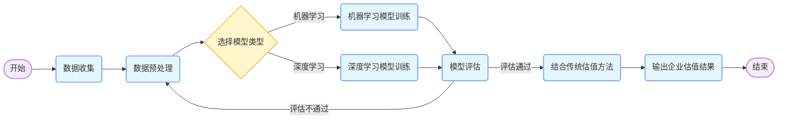

# 企业估值中的人工智能赋能效果评估

> 关键词：企业估值、人工智能赋能、效果评估、机器学习、数据驱动

> 摘要：本文聚焦于企业估值中人工智能赋能效果的评估。首先介绍了相关背景，包括研究目的、预期读者等内容。接着阐述了企业估值和人工智能赋能的核心概念及联系，通过文本示意图和Mermaid流程图展示其架构。详细讲解了核心算法原理，并用Python代码进行说明，同时给出了相关数学模型和公式。在项目实战部分，展示了开发环境搭建、源代码实现及解读。分析了人工智能在企业估值中的实际应用场景，推荐了学习资源、开发工具框架和相关论文著作。最后总结了未来发展趋势与挑战，提供了常见问题解答和扩展阅读参考资料，旨在为评估企业估值中人工智能赋能效果提供全面且深入的指导。

## 1. 背景介绍 
### 1.1 目的和范围
在当今数字化时代，人工智能技术正深刻地改变着各个行业，企业估值领域也不例外。企业估值是金融领域的核心问题之一，它对于投资者的决策、企业的并购重组等活动至关重要。人工智能技术的引入为企业估值带来了新的方法和思路，但如何评估人工智能在企业估值中的赋能效果，成为了一个亟待解决的问题。

本文的目的在于建立一套科学、合理的评估体系，用于评估人工智能在企业估值中的赋能效果。具体范围包括探讨人工智能在企业估值中的应用原理、分析评估所需的核心算法和数学模型、通过实际案例展示评估过程以及分析人工智能赋能在不同场景下的应用效果等。

### 1.2 预期读者
本文预期读者主要包括金融领域的从业者，如投资银行家、基金经理、财务分析师等，他们在日常工作中涉及企业估值，希望了解人工智能技术在该领域的应用和效果评估方法；人工智能领域的研究人员和开发者，他们对人工智能在金融领域的应用感兴趣，想深入了解其具体场景和评估方式；企业的管理者和决策者，他们需要借助准确的企业估值来制定战略决策，关注人工智能赋能对企业估值的影响。

### 1.3 文档结构概述
本文将按照以下结构展开：首先介绍核心概念，包括企业估值和人工智能赋能的定义、原理及它们之间的联系，并通过文本示意图和Mermaid流程图进行展示；接着详细阐述核心算法原理和具体操作步骤，用Python代码进行详细说明；然后介绍相关的数学模型和公式，并举例说明其应用；在项目实战部分，展示开发环境搭建、源代码实现和代码解读；分析人工智能在企业估值中的实际应用场景；推荐学习资源、开发工具框架和相关论文著作；最后总结未来发展趋势与挑战，提供常见问题解答和扩展阅读参考资料。

### 1.4 术语表
#### 1.4.1 核心术语定义
- **企业估值**：是指对企业的经济价值进行评估的过程，通过对企业的资产、负债、盈利能力、市场竞争力等多方面因素进行综合分析，确定企业在特定时间点的价值。
- **人工智能赋能**：是指将人工智能技术应用于企业的业务流程、决策制定等方面，以提升企业的效率、竞争力和价值创造能力。在企业估值中，人工智能赋能主要体现在利用人工智能算法和模型对企业相关数据进行分析和预测，从而提高估值的准确性和可靠性。
- **效果评估**：是指对人工智能在企业估值中所产生的影响和作用进行评价和衡量的过程，通过一系列的指标和方法来判断人工智能赋能是否达到了预期的效果。

#### 1.4.2 相关概念解释
- **机器学习**：是人工智能的一个重要分支，它通过让计算机从数据中自动学习模式和规律，从而实现对未知数据的预测和分类。在企业估值中，机器学习算法可以用于分析企业的财务数据、市场数据等，挖掘其中的潜在信息，为估值提供支持。
- **深度学习**：是一种基于人工神经网络的机器学习方法，它可以处理复杂的非线性关系和大规模的数据。深度学习模型在图像识别、自然语言处理等领域取得了显著的成果，在企业估值中也可以用于处理文本数据、图像数据等，提高估值的准确性。
- **数据驱动**：是指决策和行动基于数据的分析和洞察。在企业估值中，数据驱动意味着利用大量的企业相关数据，通过人工智能算法进行分析和处理，以得出更准确的估值结果。

#### 1.4.3 缩略词列表
- **AI**：Artificial Intelligence，人工智能
- **ML**：Machine Learning，机器学习
- **DL**：Deep Learning，深度学习
- **ROE**：Return on Equity，净资产收益率
- **PE**：Price-to-Earnings Ratio，市盈率

## 2. 核心概念与联系 

### 核心概念原理
#### 企业估值原理
企业估值的基本原理是基于企业未来的现金流和盈利能力。常见的估值方法包括资产基础法、市场法和收益法。资产基础法是通过评估企业的各项资产和负债的价值，来确定企业的净资产价值；市场法是通过比较类似企业的市场价格，来确定目标企业的价值；收益法是通过预测企业未来的现金流，并将其折现到当前时间点，来确定企业的价值。

#### 人工智能赋能原理
人工智能赋能企业估值的原理是利用人工智能算法和模型对企业相关数据进行分析和处理，挖掘其中的潜在信息和规律。例如，机器学习算法可以通过对历史数据的学习，建立预测模型，对企业的未来业绩进行预测；深度学习模型可以处理复杂的文本数据和图像数据，如企业的新闻报道、产品图片等，从中提取有用的信息，为估值提供参考。

### 架构的文本示意图
```plaintext
企业估值系统
|
|-- 数据层
|   |-- 财务数据（资产负债表、利润表、现金流量表）
|   |-- 市场数据（股票价格、行业指数）
|   |-- 文本数据（新闻报道、企业公告）
|   |-- 图像数据（产品图片、企业设施图片）
|
|-- 人工智能处理层
|   |-- 数据预处理（清洗、归一化、特征提取）
|   |-- 机器学习模型（线性回归、决策树、随机森林）
|   |-- 深度学习模型（卷积神经网络、循环神经网络）
|
|-- 估值结果输出层
|   |-- 传统估值方法结合人工智能预测结果
|   |-- 最终企业估值结果
```

### Mermaid流程图


## 3. 核心算法原理 & 具体操作步骤 

### 线性回归算法原理
线性回归是一种最简单的机器学习算法，它用于建立自变量和因变量之间的线性关系。假设我们有一组数据 $(x_1, y_1), (x_2, y_2), \cdots, (x_n, y_n)$，其中 $x_i$ 是自变量，$y_i$ 是因变量。线性回归模型的目标是找到一条直线 $y = \theta_0 + \theta_1x$，使得所有数据点到这条直线的误差平方和最小。

误差平方和的计算公式为：
$$
J(\theta_0, \theta_1) = \frac{1}{2n} \sum_{i=1}^{n} (y_i - (\theta_0 + \theta_1x_i))^2
$$

我们的目标是最小化 $J(\theta_0, \theta_1)$，可以使用梯度下降算法来求解 $\theta_0$ 和 $\theta_1$。

### 梯度下降算法步骤
1. 初始化 $\theta_0$ 和 $\theta_1$ 为任意值。
2. 计算 $J(\theta_0, \theta_1)$ 关于 $\theta_0$ 和 $\theta_1$ 的偏导数：
    - $\frac{\partial J(\theta_0, \theta_1)}{\partial \theta_0} = \frac{1}{n} \sum_{i=1}^{n} (y_i - (\theta_0 + \theta_1x_i))$
    - $\frac{\partial J(\theta_0, \theta_1)}{\partial \theta_1} = \frac{1}{n} \sum_{i=1}^{n} (y_i - (\theta_0 + \theta_1x_i))x_i$
3. 更新 $\theta_0$ 和 $\theta_1$：
    - $\theta_0 = \theta_0 - \alpha \frac{\partial J(\theta_0, \theta_1)}{\partial \theta_0}$
    - $\theta_1 = \theta_1 - \alpha \frac{\partial J(\theta_0, \theta_1)}{\partial \theta_1}$
其中 $\alpha$ 是学习率，控制每次更新的步长。
4. 重复步骤 2 和 3，直到 $J(\theta_0, \theta_1)$ 收敛或达到最大迭代次数。

### Python代码实现
```python
import numpy as np

def linear_regression(X, y, alpha=0.01, num_iters=1000):
    """
    线性回归模型
    :param X: 自变量矩阵，形状为 (n, 1)
    :param y: 因变量向量，形状为 (n,)
    :param alpha: 学习率
    :param num_iters: 迭代次数
    :return: 模型参数 theta
    """
    n = len(y)
    X = np.c_[np.ones((n, 1)), X]  # 添加偏置项
    theta = np.zeros((2, 1))  # 初始化参数

    for iter in range(num_iters):
        # 计算误差
        error = np.dot(X, theta) - y.reshape(-1, 1)
        # 计算梯度
        gradient = (1 / n) * np.dot(X.T, error)
        # 更新参数
        theta = theta - alpha * gradient

    return theta

# 示例数据
X = np.array([1, 2, 3, 4, 5]).reshape(-1, 1)
y = np.array([2, 4, 6, 8, 10])

# 训练模型
theta = linear_regression(X, y)
print("模型参数 theta:", theta)
```

### 具体操作步骤
1. **数据收集**：收集与企业估值相关的数据，如财务数据、市场数据等。
2. **数据预处理**：对收集到的数据进行清洗、归一化等处理，以提高模型的性能。
3. **特征选择**：选择与企业估值相关的特征，作为自变量。
4. **模型训练**：使用线性回归算法对数据进行训练，得到模型参数。
5. **模型评估**：使用评估指标（如均方误差、决定系数等）对模型进行评估，判断模型的性能。
6. **估值预测**：使用训练好的模型对企业的未来业绩进行预测，并结合传统估值方法，得到企业的估值结果。

## 4. 数学模型和公式 & 详细讲解 & 举例说明 

### 收益法估值模型
收益法是企业估值中常用的方法之一，其基本思想是通过预测企业未来的现金流，并将其折现到当前时间点，来确定企业的价值。

#### 公式
企业价值 $V$ 的计算公式为：
$$
V = \sum_{t=1}^{n} \frac{FCF_t}{(1 + r)^t} + \frac{TV}{(1 + r)^n}
$$
其中：
- $FCF_t$ 是第 $t$ 年的自由现金流。
- $r$ 是折现率，反映了资金的时间价值和风险。
- $TV$ 是企业的终值，通常使用永续增长模型计算：
$$
TV = \frac{FCF_{n+1}}{r - g}
$$
其中 $FCF_{n+1}$ 是第 $n+1$ 年的自由现金流，$g$ 是永续增长率。

#### 详细讲解
自由现金流 $FCF_t$ 是指企业在满足了所有运营和投资需求后，剩余的可以自由分配给股东和债权人的现金流量。折现率 $r$ 通常根据企业的风险水平和市场利率来确定，风险越高，折现率越高。永续增长率 $g$ 是指企业在未来长期内的增长率，通常假设为一个较小的正值。

#### 举例说明
假设某企业未来 5 年的自由现金流分别为 $FCF_1 = 100$ 万元，$FCF_2 = 120$ 万元，$FCF_3 = 140$ 万元，$FCF_4 = 160$ 万元，$FCF_5 = 180$ 万元。折现率 $r = 10\%$，永续增长率 $g = 3\%$。

首先计算第 6 年的自由现金流：
$$
FCF_6 = FCF_5 \times (1 + g) = 180 \times (1 + 0.03) = 185.4
$$

然后计算终值：
$$
TV = \frac{FCF_6}{r - g} = \frac{185.4}{0.1 - 0.03} = 2648.57
$$

最后计算企业价值：
$$
\begin{align*}
V &= \frac{100}{(1 + 0.1)^1} + \frac{120}{(1 + 0.1)^2} + \frac{140}{(1 + 0.1)^3} + \frac{160}{(1 + 0.1)^4} + \frac{180}{(1 + 0.1)^5} + \frac{2648.57}{(1 + 0.1)^5}\\
&= 90.91 + 99.17 + 105.18 + 109.28 + 111.74 + 1643.27\\
&= 2159.55
\end{align*}
$$

所以该企业的价值约为 2159.55 万元。

### 人工智能辅助的收益法估值模型
在传统收益法估值模型的基础上，引入人工智能技术可以提高自由现金流预测的准确性。例如，使用机器学习算法对历史财务数据和市场数据进行分析，建立自由现金流预测模型。

假设我们使用线性回归模型预测自由现金流，模型的表达式为：
$$
FCF_t = \theta_0 + \theta_1X_{1t} + \theta_2X_{2t} + \cdots + \theta_kX_{kt}
$$
其中 $X_{it}$ 是第 $t$ 年的第 $i$ 个特征，$\theta_i$ 是模型参数。

通过对历史数据进行训练，得到模型参数 $\theta_i$，然后使用该模型对未来的自由现金流进行预测，再代入收益法估值模型中计算企业价值。

## 5. 项目实战：代码实际案例和详细解释说明 

### 5.1  开发环境搭建
#### 操作系统
建议使用 Linux 或 macOS 操作系统，因为它们对 Python 开发环境的支持较好。如果使用 Windows 操作系统，也可以通过安装 Anaconda 来搭建开发环境。

#### Python 环境
安装 Python 3.7 或以上版本。可以从 Python 官方网站（https://www.python.org/downloads/） 下载安装包进行安装。

#### 安装必要的库
使用以下命令安装必要的 Python 库：
```bash
pip install numpy pandas scikit-learn matplotlib
```
- `numpy`：用于数值计算。
- `pandas`：用于数据处理和分析。
- `scikit-learn`：提供了丰富的机器学习算法和工具。
- `matplotlib`：用于数据可视化。

### 5.2  源代码详细实现和代码解读
#### 数据准备
假设我们有一个包含企业财务数据的 CSV 文件 `financial_data.csv`，其中包含了企业的营业收入、净利润、资产负债率等特征，以及对应的自由现金流。

```python
import pandas as pd

# 读取数据
data = pd.read_csv('financial_data.csv')

# 分离特征和目标变量
X = data.drop('FreeCashFlow', axis=1)
y = data['FreeCashFlow']

# 数据划分
from sklearn.model_selection import train_test_split
X_train, X_test, y_train, y_test = train_test_split(X, y, test_size=0.2, random_state=42)
```
代码解读：
- 使用 `pandas` 库的 `read_csv` 函数读取 CSV 文件。
- 使用 `drop` 方法分离特征和目标变量。
- 使用 `train_test_split` 函数将数据划分为训练集和测试集，测试集占比为 20%。

#### 模型训练
```python
from sklearn.linear_model import LinearRegression

# 创建线性回归模型
model = LinearRegression()

# 模型训练
model.fit(X_train, y_train)
```
代码解读：
- 导入 `LinearRegression` 类创建线性回归模型。
- 使用 `fit` 方法对模型进行训练，传入训练集的特征和目标变量。

#### 模型评估
```python
from sklearn.metrics import mean_squared_error, r2_score

# 模型预测
y_pred = model.predict(X_test)

# 计算评估指标
mse = mean_squared_error(y_test, y_pred)
r2 = r2_score(y_test, y_pred)

print("均方误差:", mse)
print("决定系数:", r2)
```
代码解读：
- 使用 `predict` 方法对测试集进行预测。
- 使用 `mean_squared_error` 函数计算均方误差，使用 `r2_score` 函数计算决定系数。

#### 企业估值
```python
# 假设预测未来 5 年的自由现金流
future_X = pd.DataFrame({
    'Revenue': [1000, 1100, 1200, 1300, 1400],
    'NetProfit': [100, 120, 140, 160, 180],
    'DebtRatio': [0.5, 0.45, 0.4, 0.35, 0.3]
})

future_fcf = model.predict(future_X)

# 折现率
r = 0.1
# 永续增长率
g = 0.03

# 计算终值
terminal_value = future_fcf[-1] * (1 + g) / (r - g)

# 计算企业价值
enterprise_value = 0
for i in range(len(future_fcf)):
    enterprise_value += future_fcf[i] / (1 + r) ** (i + 1)
enterprise_value += terminal_value / (1 + r) ** len(future_fcf)

print("企业价值:", enterprise_value)
```
代码解读：
- 假设未来 5 年的特征数据，使用训练好的模型预测自由现金流。
- 根据收益法估值模型计算企业价值，包括折现未来自由现金流和终值。

### 5.3  代码解读与分析
#### 数据准备阶段
数据准备是机器学习项目的重要环节，它直接影响模型的性能。在本案例中，我们使用 `pandas` 库读取 CSV 文件，并将数据划分为训练集和测试集。数据划分的目的是为了评估模型的泛化能力，避免过拟合。

#### 模型训练阶段
我们选择了线性回归模型进行训练，线性回归是一种简单而有效的机器学习算法，适用于处理线性关系的数据。使用 `fit` 方法对模型进行训练，模型会自动学习特征和目标变量之间的关系。

#### 模型评估阶段
使用均方误差和决定系数作为评估指标。均方误差衡量了预测值和真实值之间的平均误差，值越小表示模型的预测越准确；决定系数表示模型对数据的拟合程度，值越接近 1 表示模型的拟合效果越好。

#### 企业估值阶段
根据预测的未来自由现金流和收益法估值模型计算企业价值。在计算过程中，需要确定折现率和永续增长率，这两个参数的选择会对企业价值的计算结果产生较大影响。

## 6. 实际应用场景 
### 投资决策
在投资决策中，投资者需要对目标企业进行估值，以确定是否值得投资。人工智能赋能的企业估值可以提供更准确的估值结果，帮助投资者做出更明智的决策。例如，通过分析企业的财务数据、市场数据和行业数据，预测企业的未来业绩，从而更准确地评估企业的价值。

### 企业并购重组
在企业并购重组过程中，准确的企业估值是交易的基础。人工智能技术可以帮助评估目标企业的价值，发现潜在的价值增长点和风险因素。例如，通过对目标企业的业务模式、技术创新能力等进行分析，评估其未来的发展潜力，为并购重组提供决策支持。

### 风险管理
企业在经营过程中面临着各种风险，如市场风险、信用风险等。人工智能赋能的企业估值可以帮助企业识别和评估风险，制定相应的风险管理策略。例如，通过分析企业的财务状况和市场环境，预测企业在不同风险情景下的价值变化，为企业的风险管理提供依据。

### 企业战略规划
企业在制定战略规划时，需要对自身的价值和市场地位进行评估。人工智能技术可以帮助企业分析自身的优势和劣势，发现潜在的市场机会和威胁。例如，通过对企业的竞争对手进行分析，评估企业在市场中的竞争力，为企业的战略规划提供参考。

## 7. 工具和资源推荐
### 7.1 学习资源推荐
#### 7.1.1 书籍推荐
- 《Python 机器学习》（Sebastian Raschka 著）：这本书详细介绍了 Python 在机器学习中的应用，包括各种机器学习算法的原理和实现，适合初学者入门。
- 《深度学习》（Ian Goodfellow、Yoshua Bengio 和 Aaron Courville 著）：这是深度学习领域的经典著作，全面介绍了深度学习的理论和应用，适合有一定基础的读者深入学习。
- 《企业估值：理论与实践》（Aswath Damodaran 著）：这本书系统地介绍了企业估值的方法和理论，结合实际案例进行分析，是企业估值领域的权威著作。

#### 7.1.2 在线课程
- Coursera 上的“机器学习”课程（Andrew Ng 教授）：这是一门非常经典的机器学习课程，介绍了机器学习的基本概念、算法和应用，适合初学者学习。
- edX 上的“深度学习专项课程”（Andrew Ng 教授）：该课程深入介绍了深度学习的各种技术和应用，包括卷积神经网络、循环神经网络等，适合有一定机器学习基础的读者学习。
- Udemy 上的“Python 数据分析实战”课程：该课程通过实际案例介绍了 Python 在数据分析中的应用，包括数据处理、可视化和机器学习等方面，适合想要学习数据分析的读者。

#### 7.1.3 技术博客和网站
- Medium：这是一个技术博客平台，上面有很多关于人工智能、机器学习和企业估值的文章，作者来自世界各地的技术专家和从业者。
- Towards Data Science：这是一个专注于数据科学和机器学习的技术博客，上面有很多高质量的文章和教程，适合学习和交流。
- Kaggle：这是一个数据科学竞赛平台，上面有很多关于企业估值和金融数据分析的竞赛项目和数据集，可以通过参与竞赛来提高自己的技术水平。

### 7.2 开发工具框架推荐
#### 7.2.1 IDE和编辑器
- PyCharm：这是一款专门为 Python 开发设计的集成开发环境，具有代码编辑、调试、版本控制等功能，适合专业开发者使用。
- Jupyter Notebook：这是一个交互式的开发环境，可以将代码、文本和可视化结果整合在一起，方便进行数据分析和模型开发，适合初学者和数据科学家使用。
- Visual Studio Code：这是一款轻量级的代码编辑器，支持多种编程语言和插件，具有丰富的扩展功能，适合快速开发和调试。

#### 7.2.2 调试和性能分析工具
- Py-Spy：这是一个用于 Python 程序性能分析的工具，可以实时监测程序的 CPU 使用率和函数调用情况，帮助开发者找出性能瓶颈。
- TensorBoard：这是 TensorFlow 提供的一个可视化工具，可以用于可视化深度学习模型的训练过程和性能指标，帮助开发者调试和优化模型。
- cProfile：这是 Python 标准库中的一个性能分析工具，可以分析程序的函数调用时间和次数，帮助开发者找出性能问题。

#### 7.2.3 相关框架和库
- Scikit-learn：这是一个开源的机器学习库，提供了丰富的机器学习算法和工具，包括分类、回归、聚类等算法，适合初学者和快速开发。
- TensorFlow：这是一个开源的深度学习框架，由 Google 开发，具有高效的计算性能和丰富的工具集，适合开发大规模的深度学习模型。
- PyTorch：这是一个开源的深度学习框架，由 Facebook 开发，具有动态图和易于使用的特点，适合研究和开发深度学习模型。

### 7.3 相关论文著作推荐
#### 7.3.1 经典论文
- “Gradient-Based Learning Applied to Document Recognition”（Yann LeCun、Léon Bottou、Yoshua Bengio 和 Patrick Haffner 著）：这篇论文介绍了卷积神经网络（CNN）在手写数字识别中的应用，是深度学习领域的经典论文之一。
- “Long Short-Term Memory”（Sepp Hochreiter 和 Jürgen Schmidhuber 著）：这篇论文提出了长短期记忆网络（LSTM），解决了循环神经网络（RNN）中的梯度消失问题，是深度学习领域的重要突破。
- “A Machine Learning Approach to Equity Valuation”（Stephen Penman 和 Feng Gu 著）：这篇论文介绍了机器学习在股票估值中的应用，提出了一种基于机器学习的股票估值模型。

#### 7.3.2 最新研究成果
- 可以关注顶级学术会议如 NeurIPS（神经信息处理系统大会）、ICML（国际机器学习会议）、KDD（知识发现与数据挖掘会议）等上的相关研究成果，了解人工智能在企业估值领域的最新进展。
- 查阅学术期刊如 Journal of Financial Economics、Review of Financial Studies 等上的论文，获取关于企业估值和金融数据分析的最新研究成果。

#### 7.3.3 应用案例分析
- 可以参考一些知名投资机构和咨询公司的研究报告，了解他们在企业估值中应用人工智能技术的案例和经验。
- 关注一些科技媒体和行业网站的报道，了解企业在实际应用中如何利用人工智能技术进行估值和决策。

## 8. 总结：未来发展趋势与挑战
### 未来发展趋势
#### 多模态数据融合
未来，企业估值将不仅仅依赖于财务数据和市场数据，还将融合文本数据、图像数据、音频数据等多模态数据。通过多模态数据融合，可以更全面地了解企业的运营状况和市场竞争力，提高估值的准确性。

#### 深度学习和强化学习的应用
深度学习和强化学习技术将在企业估值中得到更广泛的应用。深度学习模型可以处理复杂的非线性关系和大规模的数据，强化学习可以用于优化估值策略和决策过程。例如，使用深度学习模型预测企业的未来业绩，使用强化学习算法优化投资组合。

#### 与区块链技术的结合
区块链技术具有去中心化、不可篡改、安全可靠等特点，将与人工智能技术结合应用于企业估值领域。通过区块链技术，可以实现企业数据的安全共享和可信存储，提高数据的质量和可靠性，从而提高估值的准确性。

#### 智能化估值平台的发展
未来将出现更多智能化的企业估值平台，这些平台将集成人工智能算法、大数据分析、云计算等技术，为用户提供便捷、高效、准确的估值服务。用户可以通过这些平台输入企业相关数据，快速得到企业的估值结果和分析报告。

### 挑战
#### 数据质量和隐私问题
企业估值需要大量的高质量数据，但数据质量往往受到数据采集、存储和处理等环节的影响。此外，数据隐私问题也是一个重要的挑战，如何在保护数据隐私的前提下，充分利用数据进行估值是一个亟待解决的问题。

#### 模型解释性问题
人工智能模型，尤其是深度学习模型，往往具有较高的复杂度，其决策过程难以解释。在企业估值中，模型的解释性非常重要，因为投资者和决策者需要了解估值结果的依据和合理性。如何提高模型的解释性是一个挑战。

#### 技术人才短缺
人工智能技术在企业估值中的应用需要具备金融知识和人工智能技术的复合型人才。目前，这类人才相对短缺，如何培养和吸引更多的复合型人才是推动人工智能在企业估值中应用的关键。

#### 法律法规和监管问题
随着人工智能技术在企业估值中的广泛应用，相关的法律法规和监管问题也日益凸显。如何制定合理的法律法规和监管政策，规范人工智能技术在企业估值中的应用，保护投资者和企业的合法权益，是一个需要解决的问题。

## 9. 附录：常见问题与解答
### 1. 人工智能在企业估值中的应用是否会取代传统估值方法？
不会。人工智能技术可以为企业估值提供更准确的预测和分析，但传统估值方法如资产基础法、市场法和收益法仍然具有重要的作用。在实际应用中，通常会将人工智能技术与传统估值方法相结合，以提高估值的准确性和可靠性。

### 2. 如何选择适合企业估值的人工智能算法？
选择适合企业估值的人工智能算法需要考虑多个因素，如数据的特点、问题的复杂度、模型的解释性等。如果数据具有线性关系，可以选择线性回归算法；如果数据具有复杂的非线性关系，可以选择深度学习算法。此外，还需要考虑模型的解释性，对于一些需要向投资者和决策者解释估值结果的场景，应选择解释性较好的算法。

### 3. 人工智能在企业估值中的应用需要多少数据？
人工智能在企业估值中的应用需要足够的数据来训练模型。数据的数量和质量直接影响模型的性能。一般来说，数据量越大，模型的性能越好。但数据量也不是越多越好，还需要考虑数据的质量和相关性。在实际应用中，需要根据具体情况选择合适的数据量和数据特征。

### 4. 如何评估人工智能在企业估值中的赋能效果？
可以从多个方面评估人工智能在企业估值中的赋能效果，如估值的准确性、估值的效率、风险识别能力等。可以使用一些评估指标，如均方误差、决定系数、夏普比率等，来衡量估值的准确性；可以比较使用人工智能技术前后的估值时间，来评估估值的效率；可以分析人工智能模型对风险因素的识别和预测能力，来评估风险识别能力。

## 10. 扩展阅读 & 参考资料
### 扩展阅读
- 《人工智能时代的金融科技》：本书介绍了人工智能技术在金融领域的应用，包括企业估值、风险管理、投资决策等方面，适合对金融科技感兴趣的读者阅读。
- 《数据驱动的企业估值》：本书详细介绍了如何利用数据驱动的方法进行企业估值，包括数据采集、数据分析、模型构建等方面，适合从事企业估值工作的专业人士阅读。

### 参考资料
- 相关学术论文和研究报告：可以查阅国内外学术期刊和会议上的相关论文，以及知名投资机构和咨询公司的研究报告，获取更深入的理论和实践知识。
- 行业标准和规范：了解企业估值领域的相关行业标准和规范，如《企业价值评估指导意见》等，确保估值过程的合规性和准确性。

作者：AI天才研究院/AI Genius Institute & 禅与计算机程序设计艺术 /Zen And The Art of Computer Programming