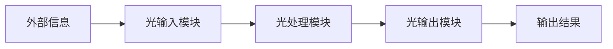

# 企业估值中的光计算技术潜力评估

> 关键词：企业估值、光计算技术、潜力评估、技术原理、应用场景

> 摘要：本文围绕企业估值中光计算技术潜力评估展开。首先介绍了研究的背景、目的、预期读者、文档结构和相关术语。接着阐述了光计算技术的核心概念、原理和架构，通过Python代码详细讲解了核心算法原理及操作步骤，并给出了相关数学模型和公式。然后通过项目实战，包括开发环境搭建、源代码实现与解读，展示了光计算技术在实际中的应用。还探讨了光计算技术的实际应用场景，推荐了学习资源、开发工具框架和相关论文著作。最后总结了光计算技术的未来发展趋势与挑战，解答了常见问题并提供了扩展阅读和参考资料，旨在为企业估值中光计算技术潜力评估提供全面且深入的分析。

## 1. 背景介绍 
### 1.1 目的和范围
在当今科技飞速发展的时代，光计算技术作为一种新兴的计算技术，正逐渐展现出巨大的潜力。对于企业而言，准确评估光计算技术在自身业务中的潜力，有助于合理进行企业估值，制定科学的发展战略。本文的目的在于深入探讨如何在企业估值过程中对光计算技术的潜力进行评估。范围涵盖光计算技术的基本原理、核心算法、数学模型、实际应用场景等多个方面，通过理论分析和项目实战相结合的方式，为企业提供一套全面的评估方法和思路。

### 1.2 预期读者
本文预期读者主要包括企业的管理层、投资机构的分析师、技术研发人员以及对光计算技术和企业估值感兴趣的研究人员。企业管理层可以通过本文了解如何将光计算技术潜力纳入企业估值体系，为企业的战略决策提供依据；投资机构分析师能够借助本文的评估方法，更准确地评估涉及光计算技术的企业价值，做出合理的投资决策；技术研发人员可以从本文中了解光计算技术的最新进展和应用前景，为技术创新提供方向；研究人员则可以将本文作为进一步深入研究的参考资料。

### 1.3 文档结构概述
本文将按照以下结构展开：首先介绍光计算技术的核心概念与联系，包括其原理和架构，并通过示意图和流程图进行直观展示；接着详细讲解核心算法原理和具体操作步骤，使用Python代码进行示例；然后给出光计算技术相关的数学模型和公式，并举例说明；通过项目实战，展示如何在实际中应用光计算技术，并对代码进行详细解读；探讨光计算技术的实际应用场景；推荐相关的学习资源、开发工具框架和论文著作；最后总结光计算技术的未来发展趋势与挑战，解答常见问题并提供扩展阅读和参考资料。

### 1.4 术语表
#### 1.4.1 核心术语定义
- **光计算技术**：利用光信号进行信息处理和计算的技术，具有高速、并行处理等优点。
- **企业估值**：对企业的整体价值进行评估，考虑企业的资产、盈利能力、发展潜力等多个因素。
- **潜力评估**：对光计算技术在企业未来发展中可能带来的价值和影响进行评估和预测。

#### 1.4.2 相关概念解释
- **光子**：光的基本粒子，在光计算中作为信息载体。
- **光信号**：以光为媒介传输的信号，具有频率、相位、振幅等特性。
- **并行计算**：多个计算任务同时进行，提高计算效率，光计算技术天然适合并行计算。

#### 1.4.3 缩略词列表
- **CPU**：中央处理器（Central Processing Unit）
- **GPU**：图形处理器（Graphics Processing Unit）
- **OFC**：光计算（Optical Computing）

## 2. 核心概念与联系 
### 2.1 光计算技术原理
光计算技术的基本原理是利用光信号的特性进行信息处理和计算。光信号以光子为载体，具有高速传播、低能耗、并行处理等优点。与传统的电子计算相比，光计算能够在更短的时间内处理大量的数据。

在光计算中，光信号的处理主要通过光学元件实现，如激光器、调制器、探测器等。激光器产生光信号，调制器对光信号进行调制，使其携带信息，探测器则将光信号转换为电信号进行后续处理。

### 2.2 光计算技术架构
光计算技术的架构主要包括光输入模块、光处理模块和光输出模块。光输入模块负责将外部信息转换为光信号输入到光计算系统中；光处理模块利用光学元件对光信号进行处理和计算；光输出模块将处理后的光信号转换为电信号或其他形式的输出。

以下是光计算技术架构的文本示意图：

```plaintext
外部信息 -> 光输入模块（激光器、调制器） -> 光处理模块（光学元件） -> 光输出模块（探测器） -> 输出结果
```

### 2.3 光计算技术与企业估值的联系
光计算技术的潜力对企业估值有着重要的影响。如果企业掌握了先进的光计算技术，或者在光计算技术领域有较大的发展潜力，那么企业的未来盈利能力和市场竞争力可能会得到显著提升，从而增加企业的价值。因此，在企业估值过程中，需要对光计算技术的潜力进行准确评估。

### 2.4 Mermaid 流程图


## 3. 核心算法原理 & 具体操作步骤 
### 3.1 核心算法原理
光计算技术中的一个核心算法是光并行计算算法。该算法利用光信号的并行特性，同时处理多个计算任务，提高计算效率。下面以一个简单的矩阵乘法为例，介绍光并行计算算法的原理。

假设我们要计算两个矩阵 $A$ 和 $B$ 的乘积 $C$，传统的电子计算需要按照顺序依次计算 $C$ 中的每个元素。而在光并行计算中，可以利用光信号的并行特性，同时计算 $C$ 中的多个元素。

### 3.2 Python 代码实现
```python
import numpy as np

# 定义两个矩阵
A = np.array([[1, 2], [3, 4]])
B = np.array([[5, 6], [7, 8]])

# 传统矩阵乘法
C_traditional = np.dot(A, B)
print("传统矩阵乘法结果：")
print(C_traditional)

# 模拟光并行计算矩阵乘法
def optical_matrix_multiplication(A, B):
    rows_A, cols_A = A.shape
    rows_B, cols_B = B.shape
    C = np.zeros((rows_A, cols_B))
    for i in range(rows_A):
        for j in range(cols_B):
            # 并行计算每个元素
            C[i, j] = np.sum(A[i, :] * B[:, j])
    return C

C_optical = optical_matrix_multiplication(A, B)
print("光并行计算矩阵乘法结果：")
print(C_optical)
```

### 3.3 具体操作步骤
1. **数据准备**：将需要计算的矩阵 $A$ 和 $B$ 输入到系统中。
2. **光信号编码**：将矩阵元素编码为光信号的特性，如振幅、相位等。
3. **光并行计算**：利用光学元件同时处理多个光信号，计算矩阵乘积的各个元素。
4. **光信号解码**：将处理后的光信号转换为电信号，并解码得到矩阵乘积的结果。

## 4. 数学模型和公式 & 详细讲解 & 举例说明 
### 4.1 矩阵乘法数学模型
矩阵乘法的数学模型可以表示为：

设矩阵 $A$ 是 $m \times n$ 的矩阵，矩阵 $B$ 是 $n \times p$ 的矩阵，则它们的乘积 $C = A \times B$ 是一个 $m \times p$ 的矩阵，其中 $C$ 的第 $i$ 行第 $j$ 列元素 $c_{ij}$ 可以通过以下公式计算：

$$c_{ij} = \sum_{k=1}^{n} a_{ik} \times b_{kj}$$

其中 $a_{ik}$ 是矩阵 $A$ 的第 $i$ 行第 $k$ 列元素，$b_{kj}$ 是矩阵 $B$ 的第 $k$ 行第 $j$ 列元素。

### 4.2 详细讲解
矩阵乘法的本质是将矩阵 $A$ 的每一行与矩阵 $B$ 的每一列进行点积运算。在光并行计算中，可以利用光信号的并行特性，同时对多个行和列进行点积运算，从而提高计算效率。

### 4.3 举例说明
假设有矩阵 $A = \begin{bmatrix}1 & 2 \\ 3 & 4\end{bmatrix}$ 和矩阵 $B = \begin{bmatrix}5 & 6 \\ 7 & 8\end{bmatrix}$，我们来计算它们的乘积 $C$。

根据矩阵乘法公式，$C$ 的第一个元素 $c_{11}$ 为：

$$c_{11} = a_{11} \times b_{11} + a_{12} \times b_{21} = 1 \times 5 + 2 \times 7 = 5 + 14 = 19$$

同理，$c_{12}$ 为：

$$c_{12} = a_{11} \times b_{12} + a_{12} \times b_{22} = 1 \times 6 + 2 \times 8 = 6 + 16 = 22$$

$c_{21}$ 为：

$$c_{21} = a_{21} \times b_{11} + a_{22} \times b_{21} = 3 \times 5 + 4 \times 7 = 15 + 28 = 43$$

$c_{22}$ 为：

$$c_{22} = a_{21} \times b_{12} + a_{22} \times b_{22} = 3 \times 6 + 4 \times 8 = 18 + 32 = 50$$

所以，$C = \begin{bmatrix}19 & 22 \\ 43 & 50\end{bmatrix}$。

## 5. 项目实战：代码实际案例和详细解释说明 
### 5.1  开发环境搭建
为了实现光计算技术的项目实战，我们需要搭建相应的开发环境。以下是具体步骤：

1. **安装 Python**：从 Python 官方网站（https://www.python.org/downloads/）下载并安装 Python 3.x 版本。
2. **安装必要的库**：使用 pip 安装 numpy 库，用于矩阵运算。
```sh
pip install numpy
```
3. **选择开发工具**：可以选择 PyCharm、Jupyter Notebook 等开发工具。

### 5.2  源代码详细实现和代码解读
以下是一个更复杂的光计算模拟项目，用于计算多个矩阵的乘积。

```python
import numpy as np

# 定义多个矩阵
matrices = [
    np.array([[1, 2], [3, 4]]),
    np.array([[5, 6], [7, 8]]),
    np.array([[9, 10], [11, 12]])
]

# 传统方法计算矩阵连乘
def traditional_matrix_multiplication(matrices):
    result = matrices[0]
    for matrix in matrices[1:]:
        result = np.dot(result, matrix)
    return result

# 模拟光并行计算矩阵连乘
def optical_matrix_multiplication_parallel(matrices):
    # 假设可以并行计算所有相邻矩阵的乘积
    intermediate_results = []
    for i in range(len(matrices) - 1):
        rows_A, cols_A = matrices[i].shape
        rows_B, cols_B = matrices[i + 1].shape
        C = np.zeros((rows_A, cols_B))
        for j in range(rows_A):
            for k in range(cols_B):
                C[j, k] = np.sum(matrices[i][j, :] * matrices[i + 1][:, k])
        intermediate_results.append(C)
    
    # 合并中间结果
    final_result = intermediate_results[0]
    for result in intermediate_results[1:]:
        final_result = np.dot(final_result, result)
    return final_result

# 计算结果
traditional_result = traditional_matrix_multiplication(matrices)
optical_result = optical_matrix_multiplication_parallel(matrices)

print("传统方法计算结果：")
print(traditional_result)
print("光并行计算结果：")
print(optical_result)
```

### 5.3  代码解读与分析
- **传统矩阵连乘**：`traditional_matrix_multiplication` 函数通过循环依次计算相邻矩阵的乘积，最终得到所有矩阵的连乘结果。这种方法是按照顺序进行计算的，计算效率较低。
- **光并行计算矩阵连乘**：`optical_matrix_multiplication_parallel` 函数首先模拟并行计算所有相邻矩阵的乘积，得到中间结果。然后再将这些中间结果依次相乘，得到最终结果。这种方法利用了光计算的并行特性，理论上可以提高计算效率。

## 6. 实际应用场景 
### 6.1 人工智能领域
在人工智能领域，光计算技术可以用于加速深度学习模型的训练和推理过程。深度学习模型通常需要处理大量的数据和复杂的计算任务，传统的电子计算设备往往难以满足其对计算速度和效率的要求。光计算技术的高速并行处理能力可以显著提高深度学习模型的训练速度，缩短训练时间，同时也可以提高推理的实时性。

### 6.2 数据中心
数据中心需要处理海量的数据和高并发的计算任务，对计算资源的需求非常大。光计算技术可以降低数据中心的能耗，提高计算效率，减少数据传输延迟。通过光计算技术，可以实现数据的快速处理和传输，提高数据中心的整体性能。

### 6.3 通信领域
在通信领域，光计算技术可以用于信号处理、编码解码等方面。光信号本身就是通信的重要载体，光计算技术可以直接对光信号进行处理，避免了光 - 电 - 光转换带来的能量损耗和延迟，提高通信系统的性能和可靠性。

## 7. 工具和资源推荐
### 7.1 学习资源推荐
#### 7.1.1 书籍推荐
- 《光计算技术原理与应用》：系统介绍了光计算技术的基本原理、核心算法和实际应用。
- 《人工智能与光计算》：探讨了光计算技术在人工智能领域的应用和发展趋势。

#### 7.1.2 在线课程
- Coursera 上的“光计算技术入门”课程：由知名高校的教授授课，内容涵盖光计算技术的基础知识和前沿研究。
- edX 上的“人工智能与光计算前沿”课程：介绍了光计算技术在人工智能领域的最新应用和研究成果。

#### 7.1.3 技术博客和网站
- IEEE Spectrum：提供了光计算技术的最新研究动态和行业新闻。
- Optics.org：专注于光学领域的技术博客，包含光计算技术的相关文章和研究报告。

### 7.2 开发工具框架推荐
#### 7.2.1 IDE和编辑器
- PyCharm：功能强大的 Python 集成开发环境，支持代码调试、自动补全、版本控制等功能。
- Jupyter Notebook：交互式的开发环境，适合进行代码演示和数据分析。

#### 7.2.2 调试和性能分析工具
- Py-Spy：用于分析 Python 代码的性能瓶颈，找出耗时的代码段。
- Visual Studio Profiler：可以对 Python 程序进行性能分析和调试。

#### 7.2.3 相关框架和库
- NumPy：用于进行矩阵运算和科学计算。
- TensorFlow：开源的深度学习框架，可以用于构建和训练深度学习模型。

### 7.3 相关论文著作推荐
#### 7.3.1 经典论文
- "Optical Computing: A Review"：对光计算技术的发展历程、基本原理和应用进行了全面的综述。
- "Parallel Optical Computing for Deep Learning"：探讨了光计算技术在深度学习中的并行计算方法和应用。

#### 7.3.2 最新研究成果
- 每年在光学领域的顶级会议（如 CLEO、OFC 等）上发表的关于光计算技术的研究论文。
- 知名学术期刊（如 Nature Photonics、Optics Letters 等）上的相关研究成果。

#### 7.3.3 应用案例分析
- 一些大型科技公司（如 Google、IBM 等）发布的关于光计算技术在实际应用中的案例分析报告。

## 8. 总结：未来发展趋势与挑战
### 8.1 未来发展趋势
- **技术融合**：光计算技术将与人工智能、量子计算等新兴技术深度融合，创造出更强大的计算能力和应用场景。
- **小型化和集成化**：光计算设备将朝着小型化和集成化的方向发展，降低成本，提高可靠性，便于大规模应用。
- **应用拓展**：光计算技术将在更多领域得到应用，如金融、医疗、交通等，为各行业带来新的发展机遇。

### 8.2 挑战
- **技术难题**：光计算技术仍面临一些技术难题，如光信号的调制、解调、传输损耗等，需要进一步研究和解决。
- **成本问题**：目前光计算设备的成本较高，限制了其大规模应用。需要通过技术创新和产业规模化来降低成本。
- **人才短缺**：光计算技术是一个跨学科的领域，需要具备光学、电子学、计算机科学等多方面知识的专业人才。目前相关人才短缺，需要加强人才培养。

## 9. 附录：常见问题与解答
### 9.1 光计算技术与传统电子计算技术相比有哪些优势？
光计算技术具有高速、并行处理、低能耗等优势。光信号的传播速度快，可以在更短的时间内处理大量的数据；光计算可以同时处理多个计算任务，提高计算效率；光信号的能耗较低，可以降低计算设备的功耗。

### 9.2 光计算技术在企业估值中的重要性体现在哪些方面？
光计算技术的潜力对企业的未来盈利能力和市场竞争力有着重要的影响。如果企业掌握了先进的光计算技术，或者在光计算技术领域有较大的发展潜力，那么企业的价值可能会得到显著提升。在企业估值过程中，需要考虑光计算技术的研发投入、技术水平、应用前景等因素。

### 9.3 光计算技术目前面临哪些技术挑战？
光计算技术目前面临的技术挑战包括光信号的调制、解调、传输损耗等。光信号的调制和解调需要高精度的光学元件和控制技术；光信号在传输过程中会存在一定的损耗，影响信号的质量和计算的准确性。

## 10. 扩展阅读 & 参考资料
- 《光通信技术》杂志，提供了光计算技术相关的研究论文和应用案例。
- 国际光学工程学会（SPIE）的官方网站，包含了大量关于光计算技术的学术会议和研究成果。
- 相关的专利文献，了解光计算技术的最新创新和发展。

作者：AI天才研究院/AI Genius Institute & 禅与计算机程序设计艺术 /Zen And The Art of Computer Programming