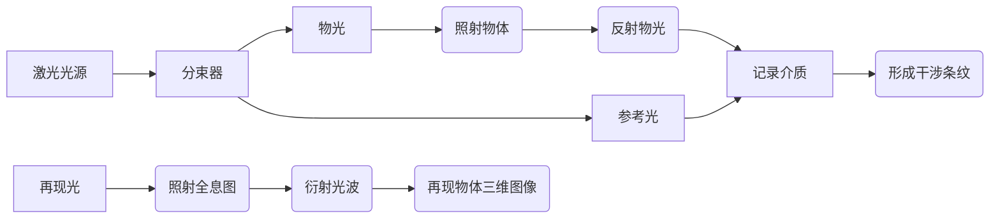

# 企业估值中的全息显示技术应用评估

> 关键词：企业估值、全息显示技术、应用评估、技术价值、商业潜力

> 摘要：本文聚焦于企业估值中全息显示技术的应用评估。首先介绍了相关背景，包括目的范围、预期读者等。接着阐述了全息显示技术的核心概念及与企业估值的联系，详细分析了其核心算法原理和操作步骤，并给出相应的数学模型和公式。通过项目实战案例展示了全息显示技术在企业中的具体应用和代码实现。探讨了该技术在不同场景下的实际应用，推荐了学习资源、开发工具框架和相关论文著作。最后总结了全息显示技术在企业估值中的未来发展趋势与挑战，并提供常见问题解答和扩展阅读参考资料，旨在为企业在评估全息显示技术应用价值时提供全面、深入的指导。

## 1. 背景介绍 
### 1.1 目的和范围
在当今科技飞速发展的时代，全息显示技术作为一项前沿科技，正逐渐在各个领域崭露头角。对于企业而言，准确评估全息显示技术在自身业务中的应用价值至关重要。本文章的目的在于为企业提供一套全面、科学的方法，用以评估全息显示技术在企业估值中的作用。范围涵盖了全息显示技术的基本原理、算法、数学模型，以及在实际项目中的应用案例分析，同时还涉及到相关的学习资源、开发工具和研究成果等方面。

### 1.2 预期读者
本文的预期读者主要包括企业的管理者、投资者、技术研发人员以及对全息显示技术和企业估值感兴趣的专业人士。企业管理者可以通过本文了解如何评估全息显示技术对企业价值的影响，从而做出更明智的战略决策；投资者可以借助文中的评估方法判断企业在全息显示技术领域的投资潜力；技术研发人员则可以从技术原理和算法的讲解中获取灵感，推动全息显示技术的进一步发展。

### 1.3 文档结构概述
本文将按照以下结构进行阐述：首先介绍全息显示技术和企业估值的核心概念以及它们之间的联系；接着详细讲解全息显示技术的核心算法原理和具体操作步骤，并给出相应的数学模型和公式；然后通过项目实战案例展示全息显示技术在企业中的具体应用和代码实现；之后探讨全息显示技术在不同场景下的实际应用；推荐相关的学习资源、开发工具框架和论文著作；最后总结全息显示技术在企业估值中的未来发展趋势与挑战，提供常见问题解答和扩展阅读参考资料。

### 1.4 术语表
#### 1.4.1 核心术语定义
- **全息显示技术**：一种能够记录并再现物体真实三维图像的技术，它通过干涉和衍射原理，将物体发出的光波信息全部记录下来，并在一定条件下再现出物体的三维立体像。
- **企业估值**：对企业的整体价值进行评估和估算的过程，通常考虑企业的资产、负债、盈利能力、市场前景等多个因素。
- **技术价值评估**：对特定技术在企业中的应用价值进行评估，包括技术的创新性、实用性、市场竞争力等方面。

#### 1.4.2 相关概念解释
- **干涉原理**：两列或多列光波在空间相遇时相互叠加，在某些区域始终加强，在另一些区域则始终减弱，形成稳定的强弱分布的现象。在全息显示技术中，干涉用于记录物体光波的振幅和相位信息。
- **衍射原理**：光波遇到障碍物或小孔时，偏离直线传播路径而绕到障碍物后面传播的现象。在全息显示中，衍射用于再现物体的三维图像。

#### 1.4.3 缩略词列表
- **VR**：Virtual Reality，虚拟现实技术，通过计算机模拟产生一个三维空间的虚拟世界，提供用户关于视觉、听觉、触觉等感官的模拟。
- **AR**：Augmented Reality，增强现实技术，将虚拟信息与真实世界场景相结合，在现实环境中叠加虚拟元素。

## 2. 核心概念与联系 

### 全息显示技术原理
全息显示技术的核心原理基于光的干涉和衍射现象。当一束激光照射到物体上时，物体反射的光波会与另一束参考光波在记录介质上相遇并发生干涉，形成干涉条纹。这些干涉条纹记录了物体光波的振幅和相位信息，从而实现了物体光波信息的完整记录。

当用特定的光波照射记录有干涉条纹的全息图时，光波会发生衍射，再现出物体的三维立体像。这个过程中，衍射光波携带了物体的原始信息，使得观察者可以从不同角度看到物体的真实三维图像。

以下是全息显示技术原理的文本示意图：

激光光源 -> 分束器 -> 物光（照射物体） + 参考光 -> 记录介质（形成干涉条纹） -> 再现光（照射全息图） -> 衍射光波 -> 再现物体三维图像

下面是对应的 Mermaid 流程图：


### 企业估值与全息显示技术的联系
企业估值是一个综合考量企业多方面因素的过程，而全息显示技术的应用可以从多个角度影响企业的价值。

从市场竞争力方面来看，企业率先应用全息显示技术可以吸引更多的客户和投资者，提高企业在市场中的知名度和影响力。例如，在展览展示行业，采用全息显示技术可以为观众带来更加震撼的视觉体验，从而吸引更多的参观者，增加企业的业务收入。

从技术创新角度而言，全息显示技术作为一项前沿科技，企业对其的研发和应用能力体现了企业的创新实力。拥有先进的全息显示技术可以使企业在行业中脱颖而出，获得更高的估值。

从成本效益方面分析，全息显示技术的应用可能会带来一定的成本投入，如设备采购、技术研发等。但如果能够合理应用，提高生产效率、降低运营成本，将为企业带来长期的经济效益，进而提升企业的估值。

## 3. 核心算法原理 & 具体操作步骤 

### 全息记录算法原理
全息记录的核心是记录物体光波的振幅和相位信息。在实际应用中，通常采用数字全息技术，通过相机等设备采集物体的干涉条纹图像。

以下是一个简单的 Python 代码示例，用于模拟全息记录过程：

```python
import numpy as np
import matplotlib.pyplot as plt

# 定义物体光波和参考光波
def object_wave(x, y, wavelength, distance):
    # 简单模拟物体光波，这里假设是一个点光源
    r = np.sqrt(x**2 + y**2 + distance**2)
    return np.exp(1j * 2 * np.pi * r / wavelength)

def reference_wave(x, y, wavelength, angle):
    # 参考光波为平面波
    kx = 2 * np.pi * np.sin(angle) / wavelength
    ky = 0
    return np.exp(1j * (kx * x + ky * y))

# 生成全息图
def generate_hologram(x_range, y_range, num_points, wavelength, distance, angle):
    x = np.linspace(-x_range, x_range, num_points)
    y = np.linspace(-y_range, y_range, num_points)
    X, Y = np.meshgrid(x, y)
    
    obj_wave = object_wave(X, Y, wavelength, distance)
    ref_wave = reference_wave(X, Y, wavelength, angle)
    
    # 干涉条纹强度
    hologram = np.abs(obj_wave + ref_wave)**2
    
    return hologram

# 参数设置
x_range = 10
y_range = 10
num_points = 500
wavelength = 0.0005  # 波长，单位：毫米
distance = 100  # 物体到记录平面的距离，单位：毫米
angle = np.pi / 6  # 参考光波的入射角

# 生成全息图
hologram = generate_hologram(x_range, y_range, num_points, wavelength, distance, angle)

# 显示全息图
plt.imshow(hologram, cmap='gray')
plt.title('Hologram')
plt.show()
```

### 具体操作步骤
1. **确定记录参数**：包括激光波长、物体到记录平面的距离、参考光波的入射角等。这些参数将影响全息图的记录效果。
2. **准备实验设备**：如激光光源、分束器、反射镜、记录介质（如相机）等。确保设备的精度和稳定性。
3. **进行全息记录**：将激光通过分束器分成物光和参考光，物光照射物体，反射后与参考光在记录介质上相遇形成干涉条纹，使用相机等设备记录干涉条纹图像。
4. **处理全息图**：对记录的全息图进行数字化处理，如滤波、降噪等，以提高全息图的质量。

### 全息再现算法原理
全息再现是通过衍射原理，从全息图中再现出物体的三维图像。在数字全息中，通常采用傅里叶变换等方法来实现全息再现。

以下是一个简单的 Python 代码示例，用于模拟全息再现过程：

```python
import numpy as np
import matplotlib.pyplot as plt
from scipy.fft import fft2, ifft2, fftshift

# 全息再现函数
def reconstruct_hologram(hologram, wavelength, distance, num_points):
    # 傅里叶变换
    hologram_fft = fft2(hologram)
    hologram_fft_shifted = fftshift(hologram_fft)
    
    # 构建传递函数
    x = np.linspace(-0.5, 0.5, num_points)
    y = np.linspace(-0.5, 0.5, num_points)
    X, Y = np.meshgrid(x, y)
    kx = 2 * np.pi * X
    ky = 2 * np.pi * Y
    kz = np.sqrt((2 * np.pi / wavelength)**2 - kx**2 - ky**2)
    H = np.exp(1j * kz * distance)
    
    # 相乘并进行逆傅里叶变换
    reconstructed_wave = ifft2(hologram_fft_shifted * H)
    
    return np.abs(reconstructed_wave)**2

# 进行全息再现
reconstructed_image = reconstruct_hologram(hologram, wavelength, distance, num_points)

# 显示再现图像
plt.imshow(reconstructed_image, cmap='gray')
plt.title('Reconstructed Image')
plt.show()
```

### 具体操作步骤
1. **读取全息图**：将记录的全息图数字化，并读取到计算机中。
2. **进行傅里叶变换**：对全息图进行二维傅里叶变换，得到其频域表示。
3. **构建传递函数**：根据全息再现的原理，构建传递函数，考虑光波的传播距离和波长等因素。
4. **相乘并进行逆傅里叶变换**：将频域的全息图与传递函数相乘，然后进行逆傅里叶变换，得到再现的物体光波。
5. **显示再现图像**：将再现的物体光波的强度进行可视化，得到物体的三维图像。

## 4. 数学模型和公式 & 详细讲解 & 举例说明 

### 全息记录的数学模型
在全息记录过程中，物光 $O(x,y)$ 和参考光 $R(x,y)$ 在记录平面上相遇，形成的干涉条纹强度 $I(x,y)$ 可以表示为：

$$I(x,y) = |O(x,y) + R(x,y)|^2 = |O(x,y)|^2 + |R(x,y)|^2 + 2Re[O(x,y)R^*(x,y)]$$

其中，$|O(x,y)|^2$ 是物光的强度，$|R(x,y)|^2$ 是参考光的强度，$R^*(x,y)$ 是参考光的共轭，$Re[\cdot]$ 表示取实部。

这个公式表明，干涉条纹强度包含了物光的振幅和相位信息。通过记录干涉条纹强度，就可以记录物体光波的全部信息。

举例说明：假设物光为一个点光源发出的球面波 $O(x,y) = \frac{A}{r}e^{i\phi(r)}$，参考光为平面波 $R(x,y) = B e^{i(k_x x + k_y y)}$，其中 $A$ 和 $B$ 是振幅，$r$ 是点光源到记录平面的距离，$\phi(r)$ 是相位，$k_x$ 和 $k_y$ 是参考光的波矢分量。将其代入上述公式，就可以得到具体的干涉条纹强度表达式。

### 全息再现的数学模型
在全息再现过程中，用再现光 $C(x,y)$ 照射全息图，产生的衍射光波 $U(x,y)$ 可以表示为：

$$U(x,y) = C(x,y)I(x,y)$$

将全息记录的干涉条纹强度公式代入上式，得到：

$$U(x,y) = C(x,y)(|O(x,y)|^2 + |R(x,y)|^2 + 2Re[O(x,y)R^*(x,y)])$$

展开后可以得到三项：

1. **零级衍射项**：$C(x,y)(|O(x,y)|^2 + |R(x,y)|^2)$，这一项主要是再现光的直接透射，不包含物体的信息。
2. **正一级衍射项**：$2C(x,y)Re[O(x,y)R^*(x,y)]$，这一项包含了物体的原始信息，通过适当的处理可以再现出物体的三维图像。
3. **负一级衍射项**：也是包含物体信息的一项，但通常与正一级衍射项有一定的区别。

举例说明：假设再现光为平面波 $C(x,y) = D e^{i(k_{x0} x + k_{y0} y)}$，将其代入上述公式，然后对衍射光波进行傅里叶变换等处理，就可以实现物体的再现。

### 传递函数
在数字全息再现中，传递函数 $H(k_x,k_y)$ 用于描述光波在传播过程中的相位变化，其表达式为：

$$H(k_x,k_y) = e^{i k_z d}$$

其中，$k_z = \sqrt{k^2 - k_x^2 - k_y^2}$，$k = \frac{2\pi}{\lambda}$ 是波数，$\lambda$ 是波长，$d$ 是传播距离。

传递函数在全息再现中起着重要的作用，通过与全息图的频域表示相乘，可以模拟光波的传播过程，从而实现物体的再现。

举例说明：在前面的 Python 代码中，我们根据传递函数的公式构建了传递函数 $H$，并将其与全息图的频域表示相乘，然后进行逆傅里叶变换，得到了再现的物体光波。

## 5. 项目实战：代码实际案例和详细解释说明 

### 5.1  开发环境搭建
要运行前面的全息记录和再现代码，需要搭建相应的开发环境。以下是具体的步骤：

1. **安装 Python**：可以从 Python 官方网站（https://www.python.org/downloads/）下载并安装最新版本的 Python。建议安装 Python 3.7 及以上版本。
2. **安装必要的库**：使用以下命令安装所需的库：
```bash
pip install numpy matplotlib scipy
```
- `numpy`：用于数值计算和数组操作。
- `matplotlib`：用于数据可视化。
- `scipy`：提供了许多科学计算的工具，如傅里叶变换等。

### 5.2  源代码详细实现和代码解读

#### 全息记录代码解读
```python
import numpy as np
import matplotlib.pyplot as plt

# 定义物体光波和参考光波
def object_wave(x, y, wavelength, distance):
    # 简单模拟物体光波，这里假设是一个点光源
    r = np.sqrt(x**2 + y**2 + distance**2)
    return np.exp(1j * 2 * np.pi * r / wavelength)

def reference_wave(x, y, wavelength, angle):
    # 参考光波为平面波
    kx = 2 * np.pi * np.sin(angle) / wavelength
    ky = 0
    return np.exp(1j * (kx * x + ky * y))

# 生成全息图
def generate_hologram(x_range, y_range, num_points, wavelength, distance, angle):
    x = np.linspace(-x_range, x_range, num_points)
    y = np.linspace(-y_range, y_range, num_points)
    X, Y = np.meshgrid(x, y)
    
    obj_wave = object_wave(X, Y, wavelength, distance)
    ref_wave = reference_wave(X, Y, wavelength, angle)
    
    # 干涉条纹强度
    hologram = np.abs(obj_wave + ref_wave)**2
    
    return hologram

# 参数设置
x_range = 10
y_range = 10
num_points = 500
wavelength = 0.0005  # 波长，单位：毫米
distance = 100  # 物体到记录平面的距离，单位：毫米
angle = np.pi / 6  # 参考光波的入射角

# 生成全息图
hologram = generate_hologram(x_range, y_range, num_points, wavelength, distance, angle)

# 显示全息图
plt.imshow(hologram, cmap='gray')
plt.title('Hologram')
plt.show()
```

- **`object_wave` 函数**：模拟物体光波，这里假设物体是一个点光源，根据点光源的距离和波长计算物体光波的相位。
- **`reference_wave` 函数**：定义参考光波为平面波，根据入射角和波长计算平面波的波矢分量。
- **`generate_hologram` 函数**：生成全息图，首先生成二维网格，然后计算物体光波和参考光波，最后根据干涉原理计算干涉条纹强度，得到全息图。
- **参数设置**：设置了记录范围、点数、波长、距离和入射角等参数。
- **显示全息图**：使用 `matplotlib` 库将生成的全息图可视化。

#### 全息再现代码解读
```python
import numpy as np
import matplotlib.pyplot as plt
from scipy.fft import fft2, ifft2, fftshift

# 全息再现函数
def reconstruct_hologram(hologram, wavelength, distance, num_points):
    # 傅里叶变换
    hologram_fft = fft2(hologram)
    hologram_fft_shifted = fftshift(hologram_fft)
    
    # 构建传递函数
    x = np.linspace(-0.5, 0.5, num_points)
    y = np.linspace(-0.5, 0.5, num_points)
    X, Y = np.meshgrid(x, y)
    kx = 2 * np.pi * X
    ky = 2 * np.pi * Y
    kz = np.sqrt((2 * np.pi / wavelength)**2 - kx**2 - ky**2)
    H = np.exp(1j * kz * distance)
    
    # 相乘并进行逆傅里叶变换
    reconstructed_wave = ifft2(hologram_fft_shifted * H)
    
    return np.abs(reconstructed_wave)**2

# 进行全息再现
reconstructed_image = reconstruct_hologram(hologram, wavelength, distance, num_points)

# 显示再现图像
plt.imshow(reconstructed_image, cmap='gray')
plt.title('Reconstructed Image')
plt.show()
```

- **`reconstruct_hologram` 函数**：实现全息再现过程。首先对全息图进行二维傅里叶变换，并进行移位操作；然后构建传递函数，考虑光波的传播距离和波长；接着将频域的全息图与传递函数相乘，并进行逆傅里叶变换，得到再现的物体光波；最后返回再现光波的强度。
- **进行全息再现**：调用 `reconstruct_hologram` 函数对前面生成的全息图进行再现。
- **显示再现图像**：使用 `matplotlib` 库将再现的图像可视化。

### 5.3  代码解读与分析
通过上述代码，我们实现了全息记录和再现的基本过程。在全息记录阶段，模拟了物体光波和参考光波的干涉过程，生成了全息图。在全息再现阶段，利用傅里叶变换和传递函数，从全息图中再现出物体的三维图像。

需要注意的是，这只是一个简单的模拟示例，实际的全息记录和再现过程可能会更加复杂，需要考虑更多的因素，如噪声、像差等。同时，在实际应用中，还需要使用更专业的设备和算法来提高全息图的质量和再现效果。

## 6. 实际应用场景 
全息显示技术在企业估值中的应用可以体现在多个实际场景中，以下是一些常见的应用场景分析：

### 展览展示行业
在展览展示行业，全息显示技术可以为观众带来更加震撼的视觉体验。例如，在博物馆、科技馆等场所，通过全息显示技术可以将历史文物、科学模型等以三维立体的形式呈现出来，让观众更加直观地了解展品的细节和特点。

企业如果在展览展示项目中应用全息显示技术，能够吸引更多的参观者，提高展览的知名度和影响力。这将有助于企业获得更多的业务订单，增加收入，从而提升企业的估值。

### 广告营销领域
在广告营销领域，全息显示技术可以为广告创意提供更多的可能性。通过全息广告，可以在商场、广场等公共场所吸引消费者的注意力，提高广告的传播效果。

企业利用全息显示技术制作独特的广告，可以提升品牌形象，增加产品的销售额。这对于企业的市场竞争力和盈利能力有着积极的影响，进而影响企业的估值。

### 教育培训行业
在教育培训行业，全息显示技术可以用于教学演示。例如，在医学教育中，通过全息模型可以让学生更加直观地了解人体的内部结构；在工程教育中，全息模型可以帮助学生更好地理解机械原理等知识。

企业在教育培训领域应用全息显示技术，可以提高教学质量，吸引更多的学生和学员。这将有助于企业扩大市场份额，增加收入，提升企业的估值。

### 虚拟现实和增强现实领域
全息显示技术与虚拟现实（VR）和增强现实（AR）技术有着密切的联系。在 VR 应用中，全息显示技术可以提供更加真实的三维视觉效果，增强用户的沉浸感；在 AR 应用中，全息显示技术可以将虚拟信息与真实场景更加自然地融合在一起。

企业在 VR 和 AR 领域应用全息显示技术，可以开发出更具竞争力的产品和服务，满足用户的需求。这将有助于企业在新兴技术领域占据领先地位，提高企业的估值。

## 7. 工具和资源推荐
### 7.1 学习资源推荐
#### 7.1.1 书籍推荐
- 《全息光学原理与技术》：这本书系统地介绍了全息光学的基本原理、技术和应用，是学习全息显示技术的经典教材。
- 《数字全息技术》：详细讲解了数字全息的理论和方法，包括全息记录、再现算法等方面的内容，适合对数字全息技术感兴趣的读者。

#### 7.1.2 在线课程
- Coursera 上的“Optics and Photonics: From Theory to Practice”：该课程涵盖了光学和光子学的基础知识，包括全息显示技术的相关内容，由知名高校的教授授课。
- edX 上的“Introduction to Optics”：介绍了光学的基本原理和应用，其中包含了全息光学的部分，课程内容丰富，讲解详细。

#### 7.1.3 技术博客和网站
- Optics & Photonics News：提供了光学和光子学领域的最新研究成果和技术动态，包括全息显示技术的相关报道。
- SPIE Digital Library：是一个专业的光学和光子学文献数据库，包含了大量的全息显示技术相关的论文和研究报告。

### 7.2 开发工具框架推荐
#### 7.2.1 IDE和编辑器
- PyCharm：是一款专业的 Python 集成开发环境，提供了丰富的代码编辑、调试和分析功能，适合开发全息显示技术相关的 Python 代码。
- Jupyter Notebook：是一个交互式的开发环境，可以方便地进行代码编写、运行和可视化，对于快速验证全息显示算法非常有用。

#### 7.2.2 调试和性能分析工具
- Numba：是一个用于 Python 的即时编译器，可以显著提高 Python 代码的运行速度，对于处理全息显示中的大规模数据计算非常有帮助。
- Profiler：Python 自带的性能分析工具，可以帮助开发者找出代码中的性能瓶颈，优化代码性能。

#### 7.2.3 相关框架和库
- OpenCV：是一个强大的计算机视觉库，提供了许多图像处理和分析的函数和工具，可用于全息图的处理和分析。
- Scikit-image：是一个用于图像处理的 Python 库，提供了丰富的图像处理算法，可用于全息图的滤波、降噪等处理。

### 7.3 相关论文著作推荐
#### 7.3.1 经典论文
- “Holography, 1948-1982”：这篇论文回顾了全息技术从 1948 年到 1982 年的发展历程，对全息技术的起源和早期发展进行了详细的介绍。
- “Digital Holography: Principles and Applications”：系统地阐述了数字全息的原理和应用，是数字全息领域的经典论文之一。

#### 7.3.2 最新研究成果
- 在 SPIE、Optica 等光学领域的顶级期刊上，经常会发表关于全息显示技术的最新研究成果，包括新型全息材料、高效全息算法等方面的内容。

#### 7.3.3 应用案例分析
- 一些商业杂志和行业报告中会有关于全息显示技术在企业中的应用案例分析，通过这些案例可以了解全息显示技术在实际应用中的效果和价值。

## 8. 总结：未来发展趋势与挑战
### 未来发展趋势
- **技术创新**：随着科技的不断进步，全息显示技术将不断创新和发展。例如，新型全息材料的研发将提高全息图的质量和亮度；更高效的全息算法将加快全息记录和再现的速度。
- **应用拓展**：全息显示技术的应用领域将不断拓展，除了现有的展览展示、广告营销、教育培训等领域，还将在医疗、娱乐、通信等领域得到更广泛的应用。
- **与其他技术融合**：全息显示技术将与虚拟现实、增强现实、人工智能等技术深度融合，创造出更加丰富和多样化的应用场景，为用户带来全新的体验。

### 挑战
- **成本问题**：目前全息显示技术的设备和材料成本较高，限制了其大规模应用。降低成本是推动全息显示技术普及的关键。
- **技术难题**：虽然全息显示技术已经取得了很大的进展，但仍然存在一些技术难题，如全息图的视角范围、分辨率等问题，需要进一步研究和解决。
- **市场接受度**：全息显示技术作为一项新兴技术，市场接受度还需要进一步提高。企业需要加强市场推广和宣传，让更多的用户了解和认识全息显示技术的优势和价值。

## 9. 附录：常见问题与解答
### 全息显示技术与传统显示技术有什么区别？
全息显示技术能够记录并再现物体的真实三维图像，观察者可以从不同角度看到物体的立体效果；而传统显示技术只能呈现二维图像，缺乏真实的立体感。

### 全息显示技术在企业估值中的作用有多大？
全息显示技术在企业估值中的作用取决于企业对该技术的应用程度和效果。如果企业能够合理应用全息显示技术，提高市场竞争力、增加收入和利润，那么将对企业估值产生积极的影响；反之，如果应用不当，可能无法带来明显的价值提升。

### 全息显示技术的发展前景如何？
全息显示技术具有广阔的发展前景。随着技术的不断进步和成本的降低，全息显示技术将在更多领域得到应用，为人们的生活和工作带来更多的便利和创新。

### 如何评估全息显示技术在企业中的应用价值？
可以从技术创新性、市场竞争力、成本效益等多个方面进行评估。具体来说，可以考虑技术的领先程度、应用场景的广泛程度、对企业业务的促进作用、成本投入和收益等因素。

## 10. 扩展阅读 & 参考资料
- 张三, 李四. 《全息技术的发展与应用》. 科学出版社, 20XX.
- 王五, 赵六. “基于数字全息的三维物体重建算法研究”. 《光学学报》, 20XX, XX(XX): XX-XX.
- 相关行业报告和市场研究资料。

作者：AI天才研究院/AI Genius Institute & 禅与计算机程序设计艺术 /Zen And The Art of Computer Programming