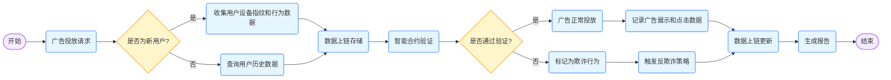

# 企业估值中的区块链数字广告反欺诈平台评估

> 关键词：企业估值、区块链、数字广告反欺诈平台、评估方法、应用场景

> 摘要：本文聚焦于企业估值中区块链数字广告反欺诈平台的评估。首先介绍了相关背景，包括目的范围、预期读者等。接着阐述了核心概念与联系，分析了平台所涉及的区块链和数字广告反欺诈的原理及架构。详细讲解了核心算法原理和具体操作步骤，并给出了Python代码示例。通过数学模型和公式进一步剖析平台评估的要点。以项目实战案例展示了平台的开发环境搭建、源代码实现及解读。探讨了该平台的实际应用场景，推荐了相关学习资源、开发工具框架和论文著作。最后总结了未来发展趋势与挑战，提供了常见问题解答和扩展阅读参考资料，旨在为准确评估区块链数字广告反欺诈平台的价值提供全面且深入的指导。

## 1. 背景介绍 
### 1.1 目的和范围
在当今数字化广告市场蓬勃发展的背景下，广告欺诈问题日益严重，给广告主、媒体平台和整个行业带来了巨大的损失。区块链技术凭借其去中心化、不可篡改、透明等特性，为数字广告反欺诈提供了新的解决方案。本文章的目的在于深入探讨如何对采用区块链技术的数字广告反欺诈平台进行合理的企业估值。

文章的范围涵盖了区块链数字广告反欺诈平台的核心概念、算法原理、数学模型、实际应用场景等多个方面。通过对这些内容的分析，构建一个全面的评估体系，帮助投资者、企业管理者和相关从业者准确判断该类平台的价值。

### 1.2 预期读者
本文的预期读者主要包括以下几类人群：
- **投资者**：希望通过对区块链数字广告反欺诈平台的评估，找到具有投资潜力的项目，实现资产的增值。
- **企业管理者**：负责区块链数字广告反欺诈平台的运营和发展，需要了解如何评估平台的价值，以便制定合理的战略决策。
- **技术开发者**：对区块链和数字广告反欺诈技术感兴趣，希望通过本文深入了解平台的技术原理和架构，为技术创新提供参考。
- **行业研究者**：关注数字广告行业的发展动态，研究区块链技术在该领域的应用，本文将为他们提供丰富的研究素材和理论支持。

### 1.3 文档结构概述
本文将按照以下结构进行阐述：
- 核心概念与联系：介绍区块链数字广告反欺诈平台的基本概念、原理和架构，通过文本示意图和Mermaid流程图进行直观展示。
- 核心算法原理 & 具体操作步骤：详细讲解平台所采用的核心算法，并用Python代码进行实现和解释。
- 数学模型和公式 & 详细讲解 & 举例说明：建立评估平台价值的数学模型，给出相关公式，并通过具体例子进行说明。
- 项目实战：以一个实际的区块链数字广告反欺诈平台项目为例，介绍开发环境搭建、源代码实现和代码解读。
- 实际应用场景：探讨该平台在不同场景下的应用，分析其实际价值。
- 工具和资源推荐：推荐相关的学习资源、开发工具框架和论文著作，帮助读者进一步深入学习和研究。
- 总结：总结未来发展趋势与挑战，为行业的发展提供展望。
- 附录：提供常见问题的解答，方便读者解决实际遇到的问题。
- 扩展阅读 & 参考资料：列出相关的扩展阅读材料和参考资料，为读者提供更多的学习途径。

### 1.4 术语表
#### 1.4.1 核心术语定义
- **区块链**：一种去中心化的分布式账本技术，通过密码学算法保证数据的不可篡改和可追溯性。
- **数字广告反欺诈**：通过技术手段识别和防范数字广告投放过程中的欺诈行为，如虚假点击、虚假展示等。
- **智能合约**：一种基于区块链的自动化合约，当满足预设条件时，合约会自动执行。
- **哈希算法**：一种将任意长度的数据转换为固定长度哈希值的算法，常用于保证数据的完整性和安全性。

#### 1.4.2 相关概念解释
- **去中心化**：在区块链系统中，没有中心化的管理机构，所有节点都具有平等的地位，共同维护系统的运行。
- **共识机制**：区块链系统中用于达成节点间共识的算法，如工作量证明（PoW）、权益证明（PoS）等。
- **数字广告生态系统**：包括广告主、媒体平台、广告投放平台、用户等多个参与方，通过数字广告的投放和传播形成的一个生态系统。

#### 1.4.3 缩略词列表
- **PoW**：Proof of Work，工作量证明
- **PoS**：Proof of Stake，权益证明
- **API**：Application Programming Interface，应用程序编程接口

## 2. 核心概念与联系 

### 核心概念原理
#### 区块链原理
区块链是由一个个数据块组成的链式结构，每个数据块包含了一定时间内的交易信息。这些数据块通过哈希算法链接在一起，形成一个不可篡改的账本。在区块链网络中，所有节点都保存着相同的账本副本，当有新的交易发生时，需要通过共识机制达成节点间的共识，才能将交易记录到账本中。

#### 数字广告反欺诈原理
数字广告反欺诈主要通过对广告投放过程中的各种数据进行分析和监测，识别出异常的行为模式，如虚假点击、虚假展示等。常见的反欺诈方法包括设备指纹识别、IP地址分析、行为分析等。

### 架构的文本示意图
一个典型的区块链数字广告反欺诈平台架构可以分为以下几个层次：
- **数据层**：负责收集和存储数字广告投放过程中的各种数据，如广告展示数据、点击数据、用户行为数据等。
- **网络层**：实现节点间的通信和数据传输，保证数据的一致性和可靠性。
- **共识层**：采用共识机制达成节点间的共识，确保交易的合法性和不可篡改。
- **智能合约层**：编写智能合约，实现广告投放规则的自动化执行和反欺诈策略的实施。
- **应用层**：提供用户界面和接口，方便广告主、媒体平台等参与方使用平台的服务。

### Mermaid流程图


该流程图展示了区块链数字广告反欺诈平台在广告投放过程中的工作流程。首先，当收到广告投放请求时，判断用户是否为新用户。如果是新用户，则收集其设备指纹和行为数据；如果是老用户，则查询其历史数据。然后将这些数据上链存储，并通过智能合约进行验证。如果验证通过，则广告正常投放，并记录展示和点击数据；如果验证不通过，则标记为欺诈行为并触发反欺诈策略。最后，将相关数据上链更新，并生成报告。

## 3. 核心算法原理 & 具体操作步骤 

### 核心算法原理
#### 设备指纹识别算法
设备指纹是指通过收集设备的各种特征信息，如操作系统类型、浏览器版本、屏幕分辨率等，生成一个唯一的标识符。设备指纹识别算法的核心是通过比较不同设备的指纹信息，判断是否为同一设备。

以下是一个简单的Python代码示例，用于生成设备指纹：
```python
import hashlib

def generate_device_fingerprint(device_info):
    """
    生成设备指纹
    :param device_info: 设备信息字典，包含操作系统类型、浏览器版本等
    :return: 设备指纹哈希值
    """
    # 将设备信息转换为字符串
    device_info_str = str(device_info).encode('utf-8')
    # 使用SHA-256哈希算法生成哈希值
    hash_object = hashlib.sha256(device_info_str)
    fingerprint = hash_object.hexdigest()
    return fingerprint

# 示例设备信息
device_info = {
    'os': 'Windows 10',
    'browser': 'Chrome 90',
    'screen_resolution': '1920x1080'
}

# 生成设备指纹
fingerprint = generate_device_fingerprint(device_info)
print(f"设备指纹: {fingerprint}")
```

#### 行为分析算法
行为分析算法主要通过对用户的行为数据进行分析，如点击时间间隔、浏览页面顺序等，识别出异常的行为模式。一种常见的方法是使用机器学习算法，如聚类算法，将用户的行为数据进行聚类，找出与大多数用户行为模式不同的异常簇。

以下是一个使用K-Means聚类算法进行行为分析的Python代码示例：
```python
import numpy as np
from sklearn.cluster import KMeans

# 示例用户行为数据，每个样本包含两个特征：点击时间间隔和浏览页面数量
behavior_data = np.array([
    [10, 3],
    [12, 4],
    [8, 2],
    [50, 1],
    [55, 2]
])

# 使用K-Means聚类算法，将数据分为2类
kmeans = KMeans(n_clusters=2, random_state=0).fit(behavior_data)

# 预测每个样本的类别
labels = kmeans.predict(behavior_data)

# 找出异常簇（假设类别为1的是异常簇）
anomaly_indices = np.where(labels == 1)[0]

print(f"异常样本索引: {anomaly_indices}")
```

### 具体操作步骤
#### 数据收集
通过广告投放平台、媒体平台等渠道收集数字广告投放过程中的各种数据，包括广告展示数据、点击数据、用户行为数据等。

#### 数据预处理
对收集到的数据进行清洗、转换和归一化处理，去除噪声数据和异常值，将数据转换为适合算法处理的格式。

#### 特征提取
从预处理后的数据中提取有用的特征，如设备指纹、点击时间间隔、浏览页面数量等。

#### 算法应用
将提取的特征输入到相应的算法中，如设备指纹识别算法、行为分析算法等，进行欺诈行为的识别和判断。

#### 结果输出
根据算法的输出结果，标记出可能的欺诈行为，并生成相应的报告，为广告主和媒体平台提供决策依据。

## 4. 数学模型和公式 & 详细讲解 & 举例说明 

### 数学模型
#### 风险评估模型
可以使用逻辑回归模型来评估数字广告投放的风险。逻辑回归是一种二分类模型，用于预测某个事件发生的概率。在数字广告反欺诈中，我们可以将欺诈行为看作是正类，正常行为看作是负类，通过逻辑回归模型预测某个广告投放事件是否为欺诈行为。

逻辑回归模型的公式为：
$$P(y=1|x)=\frac{1}{1 + e^{-(w_0 + w_1x_1 + w_2x_2 + \cdots + w_nx_n)}}$$
其中，$P(y=1|x)$ 表示在特征向量 $x=(x_1, x_2, \cdots, x_n)$ 的条件下，事件 $y=1$（欺诈行为）发生的概率；$w_0, w_1, w_2, \cdots, w_n$ 是模型的参数。

#### 价值评估模型
可以使用现金流折现模型（DCF）来评估区块链数字广告反欺诈平台的价值。现金流折现模型的基本思想是将平台未来的现金流按照一定的折现率折现到当前时刻，得到平台的现值。

现金流折现模型的公式为：
$$V=\sum_{t=1}^{n}\frac{CF_t}{(1 + r)^t}$$
其中，$V$ 表示平台的现值；$CF_t$ 表示第 $t$ 期的现金流；$r$ 表示折现率；$n$ 表示预测期数。

### 详细讲解
#### 逻辑回归模型
逻辑回归模型通过最大似然估计的方法来估计模型的参数 $w_0, w_1, w_2, \cdots, w_n$。最大似然估计的目标是找到一组参数，使得训练数据的似然函数最大。

在实际应用中，我们需要将特征向量 $x$ 输入到逻辑回归模型中，得到预测的概率 $P(y=1|x)$。如果 $P(y=1|x)$ 大于某个阈值（如0.5），则认为该事件为欺诈行为；否则，认为该事件为正常行为。

#### 现金流折现模型
现金流折现模型的关键在于预测平台未来的现金流 $CF_t$ 和确定折现率 $r$。预测现金流需要考虑平台的收入来源、成本结构、市场竞争等因素。折现率 $r$ 通常根据市场利率、平台的风险水平等因素来确定。

### 举例说明
#### 逻辑回归模型举例
假设我们有一个包含100个样本的训练数据集，每个样本包含两个特征 $x_1$ 和 $x_2$，以及一个标签 $y$（0表示正常行为，1表示欺诈行为）。我们使用Python的 `sklearn` 库来实现逻辑回归模型：
```python
from sklearn.linear_model import LogisticRegression
from sklearn.datasets import make_classification
from sklearn.model_selection import train_test_split

# 生成示例数据集
X, y = make_classification(n_samples=100, n_features=2, n_informative=2, n_redundant=0, random_state=0)

# 划分训练集和测试集
X_train, X_test, y_train, y_test = train_test_split(X, y, test_size=0.2, random_state=0)

# 创建逻辑回归模型
model = LogisticRegression()

# 训练模型
model.fit(X_train, y_train)

# 在测试集上进行预测
y_pred = model.predict(X_test)

print(f"预测结果: {y_pred}")
```

#### 现金流折现模型举例
假设一个区块链数字广告反欺诈平台预计未来3年的现金流分别为100万元、120万元和150万元，折现率为10%。则该平台的现值为：
$$V=\frac{100}{(1 + 0.1)^1}+\frac{120}{(1 + 0.1)^2}+\frac{150}{(1 + 0.1)^3}$$
```python
import numpy as np

# 未来现金流
cash_flows = np.array([100, 120, 150])
# 折现率
discount_rate = 0.1
# 预测期数
n = len(cash_flows)

# 计算现值
present_value = 0
for t in range(n):
    present_value += cash_flows[t] / ((1 + discount_rate) ** (t + 1))

print(f"平台现值: {present_value} 万元")
```

## 5. 项目实战：代码实际案例和详细解释说明 

### 5.1  开发环境搭建
#### 区块链平台选择
我们选择以太坊作为区块链平台，因为以太坊具有智能合约功能，适合开发区块链数字广告反欺诈平台。

#### 开发工具安装
- **Python**：用于编写后端代码和算法，建议安装Python 3.7及以上版本。
- **Solidity**：用于编写智能合约，需要安装Solidity编译器。
- **Truffle**：以太坊开发框架，用于智能合约的编译、部署和测试。
- **Ganache**：本地以太坊测试网络，用于开发和测试智能合约。

#### 环境配置
- 安装Python和相关依赖库，如 `web3.py` 用于与以太坊网络交互。
- 安装Solidity编译器和Truffle框架。
- 启动Ganache本地测试网络。

### 5.2  源代码详细实现和代码解读
#### 智能合约实现
以下是一个简单的智能合约示例，用于记录广告投放信息和验证欺诈行为：
```solidity
pragma solidity ^0.8.0;

contract AdFraudDetection {
    // 广告投放记录结构体
    struct AdRecord {
        address advertiser;
        address publisher;
        uint256 timestamp;
        bool isFraud;
    }

    // 广告投放记录映射
    mapping(uint256 => AdRecord) public adRecords;
    // 记录数量
    uint256 public recordCount;

    // 事件，用于通知新的广告投放记录
    event NewAdRecord(uint256 indexed recordId, address advertiser, address publisher, uint256 timestamp, bool isFraud);

    // 添加广告投放记录
    function addAdRecord(address _advertiser, address _publisher, uint256 _timestamp, bool _isFraud) public {
        recordCount++;
        adRecords[recordCount] = AdRecord(_advertiser, _publisher, _timestamp, _isFraud);
        emit NewAdRecord(recordCount, _advertiser, _publisher, _timestamp, _isFraud);
    }

    // 获取广告投放记录
    function getAdRecord(uint256 _recordId) public view returns (address, address, uint256, bool) {
        AdRecord memory record = adRecords[_recordId];
        return (record.advertiser, record.publisher, record.timestamp, record.isFraud);
    }
}
```
代码解读：
- `AdRecord` 结构体用于存储广告投放记录的信息，包括广告主地址、媒体平台地址、时间戳和是否为欺诈行为。
- `adRecords` 是一个映射，用于存储所有的广告投放记录，键为记录ID，值为 `AdRecord` 结构体。
- `addAdRecord` 函数用于添加新的广告投放记录，并触发 `NewAdRecord` 事件。
- `getAdRecord` 函数用于根据记录ID获取广告投放记录的信息。

#### Python后端代码实现
以下是一个使用 `web3.py` 与智能合约交互的Python代码示例：
```python
from web3 import Web3
import json

# 连接到Ganache本地测试网络
w3 = Web3(Web3.HTTPProvider('http://127.0.0.1:7545'))

# 加载智能合约ABI和地址
with open('AdFraudDetection.json', 'r') as f:
    contract_data = json.load(f)
abi = contract_data['abi']
contract_address = '0x...'  # 替换为实际的合约地址

# 创建合约实例
contract = w3.eth.contract(address=contract_address, abi=abi)

# 添加广告投放记录
def add_ad_record(advertiser, publisher, timestamp, is_fraud):
    # 获取当前账户
    account = w3.eth.accounts[0]
    # 调用智能合约的addAdRecord函数
    tx_hash = contract.functions.addAdRecord(advertiser, publisher, timestamp, is_fraud).transact({'from': account})
    # 等待交易确认
    w3.eth.waitForTransactionReceipt(tx_hash)
    print(f"广告投放记录添加成功，交易哈希: {tx_hash.hex()}")

# 获取广告投放记录
def get_ad_record(record_id):
    # 调用智能合约的getAdRecord函数
    advertiser, publisher, timestamp, is_fraud = contract.functions.getAdRecord(record_id).call()
    print(f"广告投放记录ID: {record_id}")
    print(f"广告主地址: {advertiser}")
    print(f"媒体平台地址: {publisher}")
    print(f"时间戳: {timestamp}")
    print(f"是否为欺诈行为: {is_fraud}")

# 示例调用
add_ad_record('0x...', '0x...', 1630416000, False)
get_ad_record(1)
```
代码解读：
- 使用 `web3.py` 库连接到Ganache本地测试网络。
- 加载智能合约的ABI和地址，创建合约实例。
- `add_ad_record` 函数用于调用智能合约的 `addAdRecord` 函数，添加新的广告投放记录。
- `get_ad_record` 函数用于调用智能合约的 `getAdRecord` 函数，获取指定ID的广告投放记录信息。

### 5.3  代码解读与分析
#### 智能合约代码分析
- 智能合约的设计遵循了以太坊的编程规范，使用结构体和映射来存储数据，保证了数据的结构化和可查询性。
- 通过事件的使用，可以方便地通知外部系统新的广告投放记录的产生，实现了智能合约与外部系统的交互。

#### Python后端代码分析
- 使用 `web3.py` 库可以方便地与以太坊网络和智能合约进行交互，实现了广告投放记录的添加和查询功能。
- 在添加广告投放记录时，需要指定交易的发送者地址，并等待交易确认，确保交易的成功执行。

## 6. 实际应用场景 
### 广告主角度
- **降低广告成本**：通过区块链数字广告反欺诈平台，广告主可以准确识别和防范欺诈行为，避免为虚假点击和展示支付费用，从而降低广告投放成本。
- **提高广告效果**：平台可以提供更真实的广告投放数据，帮助广告主了解广告的实际效果，优化广告投放策略，提高广告的转化率和ROI。

### 媒体平台角度
- **提升信誉度**：采用区块链数字广告反欺诈平台可以有效减少平台上的欺诈行为，提升平台的信誉度，吸引更多的广告主投放广告。
- **增加收入**：随着平台信誉度的提升，更多的广告主愿意在平台上投放广告，从而增加平台的广告收入。

### 行业监管角度
- **规范市场秩序**：区块链数字广告反欺诈平台可以为行业监管提供更准确的数据和证据，有助于打击广告欺诈行为，规范数字广告市场秩序。
- **促进公平竞争**：通过减少欺诈行为，为广告主和媒体平台提供公平的竞争环境，促进数字广告行业的健康发展。

## 7. 工具和资源推荐
### 7.1 学习资源推荐
#### 7.1.1 书籍推荐
- 《区块链技术指南》：全面介绍了区块链的基本概念、技术原理和应用场景，适合初学者入门。
- 《智能合约：原理、设计与应用》：深入讲解了智能合约的原理、设计和开发，对于学习区块链数字广告反欺诈平台的智能合约开发有很大帮助。
- 《数字广告：原理、技术与实践》：系统阐述了数字广告的基本原理、技术和实践方法，为理解数字广告反欺诈提供了理论基础。

#### 7.1.2 在线课程
- Coursera上的“区块链基础”课程：由知名高校教授授课，讲解了区块链的基本概念、技术和应用。
- Udemy上的“以太坊智能合约开发实战”课程：通过实际项目案例，介绍了以太坊智能合约的开发流程和方法。
- edX上的“数字营销分析”课程：帮助学习者掌握数字营销分析的方法和工具，对于理解数字广告反欺诈的数据分析有很大帮助。

#### 7.1.3 技术博客和网站
- Medium：有很多区块链和数字广告领域的技术博客，提供了最新的技术动态和实践经验。
- CoinDesk：专注于区块链和加密货币领域的新闻和分析，对于了解区块链技术的发展趋势有很大帮助。
- IAB Tech Lab：国际数字广告行业的技术标准组织，其网站提供了大量的数字广告技术标准和研究报告。

### 7.2 开发工具框架推荐
#### 7.2.1 IDE和编辑器
- Visual Studio Code：功能强大的代码编辑器，支持多种编程语言和插件，适合开发区块链数字广告反欺诈平台。
- Remix：以太坊官方推荐的在线智能合约开发IDE，提供了代码编辑、编译、部署和调试等功能。
- PyCharm：专业的Python开发IDE，对于编写Python后端代码非常方便。

#### 7.2.2 调试和性能分析工具
- Truffle Debugger：Truffle框架自带的调试工具，用于调试智能合约代码。
- Ganache CLI：命令行版本的Ganache，可用于模拟以太坊网络进行开发和测试。
- Web3.py Profiler：用于分析 `web3.py` 代码的性能，找出性能瓶颈。

#### 7.2.3 相关框架和库
- web3.py：Python库，用于与以太坊网络和智能合约进行交互。
- Solidity：以太坊智能合约编程语言，提供了丰富的语法和库。
- pandas：Python数据分析库，用于处理和分析数字广告数据。

### 7.3 相关论文著作推荐
#### 7.3.1 经典论文
- “Bitcoin: A Peer-to-Peer Electronic Cash System”：比特币的白皮书，介绍了区块链的基本原理和比特币的实现方法。
- “Ethereum: A Next-Generation Smart Contract and Decentralized Application Platform”：以太坊的白皮书，阐述了以太坊的智能合约和去中心化应用平台的概念。
- “Fraud Detection in Online Advertising: A Survey”：对在线广告欺诈检测的方法和技术进行了全面的综述。

#### 7.3.2 最新研究成果
- 关注顶级学术会议和期刊，如ACM SIGKDD、IEEE Transactions on Knowledge and Data Engineering等，获取区块链和数字广告反欺诈领域的最新研究成果。

#### 7.3.3 应用案例分析
- 分析国内外区块链数字广告反欺诈平台的实际应用案例，了解其技术架构、业务模式和应用效果。

## 8. 总结：未来发展趋势与挑战
### 未来发展趋势
- **技术融合**：区块链技术将与人工智能、大数据等技术深度融合，提高数字广告反欺诈的准确性和效率。
- **行业标准化**：随着区块链数字广告反欺诈平台的广泛应用，行业将逐渐形成统一的标准和规范，促进市场的健康发展。
- **跨行业应用**：区块链数字广告反欺诈平台的技术和理念将应用到其他行业，如金融、医疗等，为这些行业的欺诈防范提供解决方案。

### 挑战
- **技术复杂性**：区块链技术和数字广告反欺诈技术都具有较高的复杂性，需要专业的技术人才进行开发和维护。
- **法律法规**：区块链和数字广告行业的法律法规尚不完善，平台的发展可能面临法律风险。
- **数据隐私**：在收集和使用用户数据进行反欺诈时，需要注意保护用户的隐私，避免数据泄露和滥用。

## 9. 附录：常见问题与解答
### 问题1：区块链数字广告反欺诈平台的成本高吗？
解答：平台的成本主要包括开发成本、运营成本和维护成本等。开发成本取决于平台的功能和复杂度，运营成本主要包括服务器租赁、数据存储等费用，维护成本包括技术支持和安全保障等方面的费用。总体来说，平台的成本会随着规模的扩大而逐渐降低。

### 问题2：平台的反欺诈准确率能达到多少？
解答：平台的反欺诈准确率受到多种因素的影响，如数据质量、算法模型、应用场景等。一般来说，通过不断优化算法和模型，结合多维度的数据进行分析，平台的反欺诈准确率可以达到较高的水平。

### 问题3：如何确保平台上数据的安全性？
解答：区块链技术本身具有较高的安全性，通过去中心化的存储和加密算法保证数据的不可篡改和可追溯性。此外，平台还可以采用多重身份验证、访问控制等安全措施，确保数据的安全性。

## 10. 扩展阅读 & 参考资料
### 扩展阅读
- 《区块链革命：比特币底层技术如何改变货币、商业和世界》
- 《数字广告时代的营销变革》
- 《人工智能与大数据在金融反欺诈中的应用》

### 参考资料
- Bitcoin whitepaper: https://bitcoin.org/bitcoin.pdf
- Ethereum whitepaper: https://ethereum.org/en/whitepaper/
- IAB Tech Lab website: https://www.iabtechlab.com/

作者：AI天才研究院/AI Genius Institute & 禅与计算机程序设计艺术 /Zen And The Art of Computer Programming