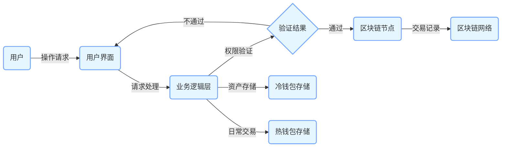

# 企业估值中的区块链数字资产托管系统评估

> 关键词：企业估值、区块链、数字资产托管系统、评估方法、风险分析

> 摘要：本文聚焦于企业估值中区块链数字资产托管系统的评估。随着区块链技术的发展，数字资产托管系统在企业中的重要性日益凸显。文章深入探讨了该系统的核心概念、算法原理、数学模型，通过实际案例展示了评估过程，分析了其实际应用场景，并推荐了相关工具和资源。最后总结了未来发展趋势与挑战，为企业合理评估区块链数字资产托管系统提供了全面的指导。

## 1. 背景介绍 
### 1.1 目的和范围
在当今数字化经济时代，区块链技术以其去中心化、不可篡改、安全透明等特性，催生了大量数字资产。企业为了保障数字资产的安全，往往会采用数字资产托管系统。本文章的目的在于为企业在进行自身估值时，提供一套全面且科学的区块链数字资产托管系统评估方法和思路。评估范围涵盖了系统的技术架构、安全性能、业务流程、市场竞争力等多个方面，旨在帮助企业准确衡量该系统对企业价值的贡献。

### 1.2 预期读者
本文预期读者主要包括企业管理者、财务分析师、投资机构人员、区块链技术开发者以及对数字资产托管领域感兴趣的研究人员。企业管理者可以通过本文了解如何评估托管系统对企业整体估值的影响；财务分析师能掌握专业的评估方法，为企业估值提供更准确的依据；投资机构人员可借助评估结果判断企业的投资价值；区块链技术开发者可以从评估角度审视系统的优化方向；研究人员则能获取相关领域的最新研究和实践成果。

### 1.3 文档结构概述
本文将按照以下结构展开：首先介绍区块链数字资产托管系统的核心概念以及各概念之间的联系，通过文本示意图和 Mermaid 流程图进行清晰展示；接着阐述核心算法原理，并结合 Python 源代码详细说明具体操作步骤；然后介绍评估过程中涉及的数学模型和公式，并举例说明其应用；之后通过项目实战，展示代码实际案例并进行详细解释；再分析该系统的实际应用场景；随后推荐相关的学习资源、开发工具框架以及论文著作；最后总结未来发展趋势与挑战，并给出常见问题与解答以及扩展阅读和参考资料。

### 1.4 术语表
#### 1.4.1 核心术语定义
- **区块链**：一种分布式账本技术，通过密码学算法将数据块按时间顺序相连，形成链式数据结构，实现数据的不可篡改和去中心化存储。
- **数字资产**：基于区块链技术发行的虚拟资产，如比特币、以太坊等加密货币，以及其他通证化的资产。
- **数字资产托管系统**：一种专门用于存储、管理和保护数字资产的系统，通常采用多重签名、冷钱包存储等技术手段，确保资产的安全。
- **企业估值**：对企业整体价值进行评估的过程，综合考虑企业的财务状况、市场竞争力、技术实力等多个因素。

#### 1.4.2 相关概念解释
- **多重签名**：一种加密技术，要求多个私钥持有者共同签名才能完成一笔交易，增加了数字资产的安全性。
- **冷钱包**：一种离线存储数字资产的方式，将私钥存储在不联网的设备上，避免网络攻击导致资产被盗。
- **热钱包**：与冷钱包相对，是一种在线存储数字资产的方式，方便用户进行日常交易，但安全性相对较低。

#### 1.4.3 缩略词列表
- **API**：Application Programming Interface，应用程序编程接口，用于不同软件系统之间的交互。
- **SDK**：Software Development Kit，软件开发工具包，提供开发特定软件所需的工具和资源。
- **HSM**：Hardware Security Module，硬件安全模块，一种用于保护密钥和执行加密操作的硬件设备。

## 2. 核心概念与联系 
### 核心概念原理
区块链数字资产托管系统的核心原理是基于区块链的分布式账本技术和密码学算法，确保数字资产的安全存储和管理。系统通过多重签名技术，要求多个私钥持有者共同签名才能完成资产的转移，增加了资产的安全性。同时，采用冷钱包存储方式，将私钥存储在离线设备上，避免网络攻击。

### 架构的文本示意图
区块链数字资产托管系统主要由以下几个部分组成：
- **用户界面**：提供用户与系统交互的界面，用户可以通过该界面进行资产查询、交易等操作。
- **业务逻辑层**：处理用户的请求，如资产存储、转移等，并进行相应的权限验证和安全检查。
- **区块链节点**：与区块链网络进行交互，完成数字资产的交易记录和验证。
- **冷钱包存储**：用于存储数字资产的私钥，采用离线存储方式，确保资产的安全。
- **热钱包存储**：用于日常交易的数字资产存储，与网络连接，方便用户进行快速交易。

### Mermaid 流程图


## 3. 核心算法原理 & 具体操作步骤 
### 核心算法原理
在区块链数字资产托管系统中，核心算法主要包括密码学算法和共识算法。密码学算法用于保证数字资产的安全性，如哈希算法、椭圆曲线加密算法等。共识算法用于确保区块链网络中各个节点的数据一致性，如工作量证明（PoW）、权益证明（PoS）等。

### 具体操作步骤及 Python 代码实现
#### 1. 生成公私钥对
在数字资产托管系统中，用户需要生成自己的公私钥对，用于资产的签名和验证。以下是使用 Python 的 `ecdsa` 库生成椭圆曲线公私钥对的示例代码：
```python
import ecdsa
import os

# 生成私钥
private_key = os.urandom(32)
sk = ecdsa.SigningKey.from_string(private_key, curve=ecdsa.SECP256k1)

# 生成公钥
vk = sk.get_verifying_key()
public_key = vk.to_string()

print("私钥:", private_key.hex())
print("公钥:", public_key.hex())
```
#### 2. 签名和验证
用户在进行数字资产交易时，需要使用私钥对交易信息进行签名，接收方使用公钥对签名进行验证。以下是签名和验证的示例代码：
```python
# 待签名的消息
message = b"Hello, Blockchain!"

# 签名
signature = sk.sign(message)

# 验证
is_valid = vk.verify(signature, message)

print("签名是否有效:", is_valid)
```
#### 3. 多重签名实现
多重签名要求多个私钥持有者共同签名才能完成一笔交易。以下是一个简单的多重签名示例：
```python
# 生成多个私钥和公钥
private_keys = [os.urandom(32) for _ in range(3)]
signing_keys = [ecdsa.SigningKey.from_string(pk, curve=ecdsa.SECP256k1) for pk in private_keys]
verifying_keys = [sk.get_verifying_key() for sk in signing_keys]

# 待签名的消息
message = b"Multi-signature Transaction"

# 多个签名
signatures = [sk.sign(message) for sk in signing_keys]

# 验证签名
is_valid = all([vk.verify(sig, message) for vk, sig in zip(verifying_keys, signatures)])

print("多重签名是否有效:", is_valid)
```

## 4. 数学模型和公式 & 详细讲解 & 举例说明 
### 哈希算法
哈希算法是区块链中常用的密码学算法，用于将任意长度的数据映射为固定长度的哈希值。常见的哈希算法有 SHA-256、RIPEMD-160 等。哈希算法具有以下特点：
- **确定性**：相同的输入总是产生相同的输出。
- **快速计算**：可以在短时间内计算出哈希值。
- **雪崩效应**：输入的微小变化会导致输出的巨大变化。
- **不可逆性**：无法从哈希值反推出原始输入。

哈希算法的数学公式可以表示为：$H(x) = y$，其中 $x$ 是输入数据，$y$ 是哈希值，$H$ 是哈希函数。

例如，使用 Python 的 `hashlib` 库计算字符串的 SHA-256 哈希值：
```python
import hashlib

message = "Hello, Blockchain!"
hash_object = hashlib.sha256(message.encode())
hash_value = hash_object.hexdigest()

print("SHA-256 哈希值:", hash_value)
```

### 椭圆曲线加密算法
椭圆曲线加密算法（ECC）是一种非对称加密算法，基于椭圆曲线离散对数问题。在 ECC 中，私钥是一个随机整数，公钥是椭圆曲线上的一个点。签名和验证过程基于椭圆曲线的数学运算。

椭圆曲线的方程可以表示为：$y^2 = x^3 + ax + b$，其中 $a$ 和 $b$ 是曲线的参数。

以下是一个简单的椭圆曲线加密示例：
```python
import ecdsa

# 生成私钥
private_key = ecdsa.SigningKey.generate(curve=ecdsa.SECP256k1)

# 生成公钥
public_key = private_key.get_verifying_key()

# 待签名的消息
message = b"Hello, ECC!"

# 签名
signature = private_key.sign(message)

# 验证
is_valid = public_key.verify(signature, message)

print("签名是否有效:", is_valid)
```

### 共识算法
共识算法用于确保区块链网络中各个节点的数据一致性。以工作量证明（PoW）为例，矿工需要通过不断尝试不同的随机数，找到一个满足特定条件的哈希值。这个过程需要消耗大量的计算资源，从而保证了区块链的安全性。

PoW 的数学公式可以表示为：$H(block\_header + nonce) < target$，其中 $block\_header$ 是区块头，$nonce$ 是随机数，$target$ 是目标哈希值。

以下是一个简单的 PoW 示例：
```python
import hashlib

block_header = "Block Header Data"
target = "0000FFFFFFFFFFFFFFFFFFFFFFFFFFFFFFFFFFFFFFFFFFFFFFFFFFFFFFFFFFFF"

nonce = 0
while True:
    data = block_header + str(nonce)
    hash_object = hashlib.sha256(data.encode())
    hash_value = hash_object.hexdigest()
    if hash_value < target:
        print("找到有效哈希值:", hash_value)
        print("随机数:", nonce)
        break
    nonce += 1
```

## 5. 项目实战：代码实际案例和详细解释说明 
### 5.1  开发环境搭建
#### 操作系统
建议使用 Linux 系统，如 Ubuntu 18.04 或更高版本，因为 Linux 系统对区块链开发有较好的支持。

#### 编程语言
使用 Python 作为开发语言，Python 具有丰富的库和工具，方便进行区块链开发。

#### 相关库和框架
- `ecdsa`：用于椭圆曲线加密算法的实现。
- `hashlib`：用于哈希算法的实现。
- `Flask`：用于搭建 Web 服务器，提供用户界面。

安装相关库的命令如下：
```sh
pip install ecdsa flask
```

### 5.2  源代码详细实现和代码解读
以下是一个简单的区块链数字资产托管系统的示例代码：
```python
from flask import Flask, request
import ecdsa
import hashlib
import json

app = Flask(__name__)

# 模拟数字资产存储
assets = {}

# 生成公私钥对
def generate_key_pair():
    private_key = ecdsa.SigningKey.generate(curve=ecdsa.SECP256k1)
    public_key = private_key.get_verifying_key()
    return private_key.to_string().hex(), public_key.to_string().hex()

# 签名交易
def sign_transaction(private_key, message):
    sk = ecdsa.SigningKey.from_string(bytes.fromhex(private_key), curve=ecdsa.SECP256k1)
    signature = sk.sign(message.encode())
    return signature.hex()

# 验证签名
def verify_transaction(public_key, message, signature):
    vk = ecdsa.VerifyingKey.from_string(bytes.fromhex(public_key), curve=ecdsa.SECP256k1)
    try:
        return vk.verify(bytes.fromhex(signature), message.encode())
    except ecdsa.BadSignatureError:
        return False

# 注册用户
@app.route('/register', methods=['POST'])
def register():
    private_key, public_key = generate_key_pair()
    assets[public_key] = 0
    return json.dumps({
        "private_key": private_key,
        "public_key": public_key,
        "balance": 0
    })

# 存储资产
@app.route('/deposit', methods=['POST'])
def deposit():
    data = request.get_json()
    public_key = data.get('public_key')
    amount = data.get('amount')
    if public_key in assets:
        assets[public_key] += amount
        return json.dumps({
            "message": "存款成功",
            "balance": assets[public_key]
        })
    return json.dumps({"message": "用户不存在"})

# 转移资产
@app.route('/transfer', methods=['POST'])
def transfer():
    data = request.get_json()
    sender_public_key = data.get('sender_public_key')
    receiver_public_key = data.get('receiver_public_key')
    amount = data.get('amount')
    signature = data.get('signature')
    message = f"{sender_public_key}{receiver_public_key}{amount}"
    if verify_transaction(sender_public_key, message, signature):
        if sender_public_key in assets and assets[sender_public_key] >= amount:
            assets[sender_public_key] -= amount
            if receiver_public_key not in assets:
                assets[receiver_public_key] = 0
            assets[receiver_public_key] += amount
            return json.dumps({
                "message": "转账成功",
                "sender_balance": assets[sender_public_key],
                "receiver_balance": assets[receiver_public_key]
            })
        return json.dumps({"message": "余额不足"})
    return json.dumps({"message": "签名验证失败"})

# 查询余额
@app.route('/balance', methods=['GET'])
def balance():
    public_key = request.args.get('public_key')
    if public_key in assets:
        return json.dumps({"balance": assets[public_key]})
    return json.dumps({"message": "用户不存在"})

if __name__ == '__main__':
    app.run(debug=True)
```

### 5.3  代码解读与分析
- **生成公私钥对**：`generate_key_pair` 函数使用 `ecdsa` 库生成椭圆曲线公私钥对，并返回十六进制字符串表示的私钥和公钥。
- **签名交易**：`sign_transaction` 函数使用私钥对交易信息进行签名，并返回签名的十六进制字符串。
- **验证签名**：`verify_transaction` 函数使用公钥对签名进行验证，返回验证结果。
- **注册用户**：`/register` 接口为用户生成公私钥对，并初始化用户的资产余额为 0。
- **存储资产**：`/deposit` 接口用于用户存款，增加用户的资产余额。
- **转移资产**：`/transfer` 接口用于用户之间的资产转移，需要验证签名和余额是否充足。
- **查询余额**：`/balance` 接口用于查询用户的资产余额。

## 6. 实际应用场景 
### 金融机构
银行、证券等金融机构可以使用区块链数字资产托管系统来管理客户的数字资产，如加密货币、数字证券等。系统的安全性和透明性可以有效降低资产被盗和挪用的风险，提高客户的信任度。

### 加密货币交易所
加密货币交易所可以利用数字资产托管系统来保障用户的资产安全。通过多重签名和冷钱包存储等技术，防止黑客攻击和内部人员的违规操作。

### 企业财务
企业可以使用数字资产托管系统来管理自身的数字资产，如企业发行的通证、数字版权等。系统可以提供资产的实时查询和审计功能，方便企业进行财务管理。

### 供应链金融
在供应链金融领域，数字资产托管系统可以用于管理供应链中的数字资产，如应收账款、仓单等。通过区块链的不可篡改特性，确保资产的真实性和流转的透明性。

## 7. 工具和资源推荐
### 7.1 学习资源推荐
#### 7.1.1 书籍推荐
- 《区块链：技术驱动金融》：全面介绍了区块链技术的原理、应用和发展趋势，适合初学者入门。
- 《精通比特币》：深入讲解了比特币的技术原理和实现细节，对于理解区块链底层技术有很大帮助。
- 《区块链实战》：通过实际案例展示了区块链在不同领域的应用，具有很强的实践指导意义。

#### 7.1.2 在线课程
- Coursera 上的 “区块链基础” 课程：由知名高校教授授课，系统介绍了区块链的基本概念和技术原理。
- edX 上的 “区块链技术与应用” 课程：结合实际案例，讲解了区块链在金融、供应链等领域的应用。
- 网易云课堂上的 “Python 区块链开发实战” 课程：通过 Python 代码实现区块链系统，适合有一定编程基础的学习者。

#### 7.1.3 技术博客和网站
- Medium：有很多区块链技术专家和开发者在上面分享最新的技术文章和研究成果。
- CoinDesk：专注于区块链和加密货币领域的新闻和分析，提供了丰富的行业信息。
- 巴比特：国内知名的区块链资讯平台，涵盖了区块链技术、应用、行业动态等多个方面的内容。

### 7.2 开发工具框架推荐
#### 7.2.1 IDE和编辑器
- PyCharm：专业的 Python 集成开发环境，提供了代码编辑、调试、版本控制等功能。
- Visual Studio Code：轻量级的代码编辑器，支持多种编程语言和插件扩展，适合快速开发。
- Sublime Text：简洁高效的代码编辑器，具有丰富的插件库，可用于快速编写代码。

#### 7.2.2 调试和性能分析工具
- pdb：Python 自带的调试工具，可用于调试 Python 代码。
- cProfile：Python 标准库中的性能分析工具，可用于分析代码的运行时间和性能瓶颈。
- Flask-DebugToolbar：Flask 框架的调试工具，可用于调试 Flask 应用程序。

#### 7.2.3 相关框架和库
- Ethereum：以太坊区块链平台，提供了智能合约开发和部署的功能。
- Hyperledger Fabric：开源的企业级区块链平台，适用于构建联盟链应用。
- web3.py：Python 库，用于与以太坊区块链进行交互。

### 7.3 相关论文著作推荐
#### 7.3.1 经典论文
- “Bitcoin: A Peer-to-Peer Electronic Cash System”：比特币的白皮书，阐述了比特币的设计理念和技术原理。
- “Ethereum: A Next-Generation Smart Contract and Decentralized Application Platform”：以太坊的白皮书，介绍了以太坊的智能合约和去中心化应用平台。
- “The Byzantine Generals Problem”：关于分布式系统中一致性问题的经典论文，对区块链共识算法的设计有重要影响。

#### 7.3.2 最新研究成果
- 关注顶级学术会议如 ACM SIGCOMM、IEEE INFOCOM 等，这些会议上会有关于区块链技术的最新研究成果。
- 查阅知名学术期刊如 IEEE Transactions on Computers、ACM Transactions on Internet Technology 等，获取区块链领域的前沿研究。

#### 7.3.3 应用案例分析
- 可以参考各大金融机构和科技公司发布的区块链应用案例报告，了解区块链在实际业务中的应用效果和挑战。

## 8. 总结：未来发展趋势与挑战
### 未来发展趋势
- **合规化发展**：随着监管政策的逐步完善，区块链数字资产托管系统将更加注重合规性，确保系统的运营符合法律法规的要求。
- **与传统金融融合**：数字资产托管系统将与传统金融机构的业务深度融合，为用户提供更加多元化的金融服务。
- **技术创新**：随着区块链技术的不断发展，数字资产托管系统将不断引入新的技术，如零知识证明、多方计算等，提高系统的安全性和隐私性。
- **应用场景拓展**：除了金融领域，数字资产托管系统将在更多领域得到应用，如物联网、医疗、教育等。

### 挑战
- **安全风险**：尽管区块链技术具有较高的安全性，但数字资产托管系统仍然面临着黑客攻击、私钥丢失等安全风险。
- **监管不确定性**：不同国家和地区对区块链和数字资产的监管政策存在差异，这给数字资产托管系统的全球发展带来了一定的不确定性。
- **技术兼容性**：区块链技术仍处于发展阶段，不同的区块链平台和标准之间存在兼容性问题，这给数字资产托管系统的开发和集成带来了挑战。
- **用户教育**：数字资产托管系统的使用需要一定的技术知识和安全意识，目前大部分用户对数字资产的认识还比较有限，需要加强用户教育。

## 9. 附录：常见问题与解答
### 问题 1：区块链数字资产托管系统与传统资产托管系统有什么区别？
答：区块链数字资产托管系统基于区块链技术，具有去中心化、不可篡改、安全透明等特点。而传统资产托管系统通常依赖于中心化的机构，存在单点故障和数据篡改的风险。此外，区块链数字资产托管系统可以实现资产的实时查询和审计，提高了资产的管理效率。

### 问题 2：如何保障数字资产托管系统的安全性？
答：可以采用多重签名、冷钱包存储、硬件安全模块等技术手段来保障系统的安全性。同时，定期进行安全审计和漏洞修复，加强员工的安全意识培训。

### 问题 3：数字资产托管系统是否可以支持多种数字资产？
答：是的，数字资产托管系统可以支持多种数字资产，如比特币、以太坊、数字证券等。系统可以通过集成不同的区块链节点，实现对多种数字资产的管理。

### 问题 4：数字资产托管系统的成本高吗？
答：数字资产托管系统的成本主要包括硬件设备、软件开发、安全维护等方面。具体成本取决于系统的规模和功能需求。随着区块链技术的发展和普及，系统的成本有望逐渐降低。

## 10. 扩展阅读 & 参考资料
### 扩展阅读
- 《区块链革命：比特币底层技术如何改变货币、商业和世界》
- 《区块链社会：解码区块链全球应用与投资案例》
- 《数字资产：重新定义金融与经济新格局》

### 参考资料
- Bitcoin whitepaper: https://bitcoin.org/bitcoin.pdf
- Ethereum whitepaper: https://ethereum.org/en/whitepaper/
- ecdsa Python library documentation: https://pypi.org/project/ecdsa/
- Flask documentation: https://flask.palletsprojects.com/

作者：AI天才研究院/AI Genius Institute & 禅与计算机程序设计艺术 /Zen And The Art of Computer Programming