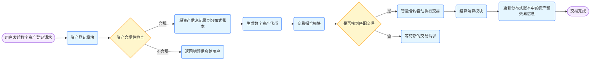

# 企业估值中的区块链数字资产证券化平台评估

> 关键词：企业估值、区块链、数字资产证券化平台、评估方法、应用场景

> 摘要：本文聚焦于企业估值中区块链数字资产证券化平台的评估。首先介绍了相关背景，包括目的范围、预期读者等内容。接着阐述了核心概念与联系，详细说明了区块链、数字资产证券化等原理及架构，并通过 Mermaid 流程图进行展示。深入讲解了核心算法原理和具体操作步骤，结合 Python 源代码进行说明。分析了相关数学模型和公式，并举例解释。通过项目实战，从开发环境搭建到源代码实现及解读进行了详细介绍。探讨了该平台的实际应用场景，推荐了学习、开发工具及相关论文著作。最后总结了未来发展趋势与挑战，提供了常见问题解答和扩展阅读参考资料，旨在为企业对区块链数字资产证券化平台的评估提供全面、深入的技术指导和分析。

## 1. 背景介绍 
### 1.1 目的和范围
随着区块链技术的不断发展和数字资产市场的兴起，数字资产证券化成为了金融领域的一个热门话题。区块链数字资产证券化平台为企业提供了一种新的融资和资产流转方式。本文章的目的在于深入探讨如何对企业中的区块链数字资产证券化平台进行评估，为企业的投资决策、战略规划等提供科学依据。

范围涵盖了区块链数字资产证券化平台的各个方面，包括平台的技术架构、业务模式、市场前景、风险因素等。通过对这些方面的分析和评估，帮助企业准确判断平台的价值和潜力。

### 1.2 预期读者
本文的预期读者主要包括企业的管理层、投资机构的分析师、金融科技领域的从业者以及对区块链和数字资产证券化感兴趣的研究人员。企业管理层可以借助本文的评估方法对自身或竞争对手的平台进行评估，从而制定合理的发展战略；投资机构分析师可以根据评估结果进行投资决策；金融科技从业者可以了解行业最新动态和评估方法；研究人员则可以将本文作为进一步研究的参考。

### 1.3 文档结构概述
本文将按照以下结构进行阐述：首先介绍核心概念与联系，明确区块链、数字资产证券化等相关概念的原理和架构；接着讲解核心算法原理和具体操作步骤，通过 Python 代码详细说明；然后分析数学模型和公式，并举例说明；通过项目实战展示代码的实际应用和详细解读；探讨实际应用场景；推荐学习、开发工具及相关论文著作；最后总结未来发展趋势与挑战，提供常见问题解答和扩展阅读参考资料。

### 1.4 术语表
#### 1.4.1 核心术语定义
- **区块链（Blockchain）**：一种去中心化的分布式账本技术，通过密码学方法保证数据的不可篡改和可追溯性。
- **数字资产（Digital Asset）**：以数字形式存在的资产，如加密货币、数字版权、数字艺术品等。
- **证券化（Securitization）**：将缺乏流动性但具有可预期收入的资产，通过一定的结构安排，对资产中的风险与收益要素进行分离与重组，进而转换成为在金融市场上可以出售和流通的证券的过程。
- **区块链数字资产证券化平台（Blockchain-based Digital Asset Securitization Platform）**：基于区块链技术构建的，用于实现数字资产证券化业务的平台，包括资产登记、交易、结算等功能。

#### 1.4.2 相关概念解释
- **智能合约（Smart Contract）**：一种基于区块链技术的自动化合约，通过代码实现合约条款的自动执行，无需第三方干预。
- **分布式账本（Distributed Ledger）**：一种在多个节点之间共享、复制和同步的账本，每个节点都保存着完整的账本副本，保证数据的一致性和可靠性。
- **共识机制（Consensus Mechanism）**：区块链网络中用于达成节点之间共识的算法，如工作量证明（PoW）、权益证明（PoS）等。

#### 1.4.3 缩略词列表
- **PoW（Proof of Work）**：工作量证明
- **PoS（Proof of Stake）**：权益证明
- **ICO（Initial Coin Offering）**：首次代币发行
- **STO（Security Token Offering）**：证券型代币发行

## 2. 核心概念与联系 

### 核心概念原理
#### 区块链原理
区块链是一种由多个区块组成的链式数据结构，每个区块包含了一定数量的交易记录和前一个区块的哈希值。通过哈希函数的加密处理，保证了数据的不可篡改和可追溯性。区块链采用分布式账本技术，将账本数据存储在多个节点上，每个节点都可以参与数据的验证和记录，实现了去中心化的管理。

#### 数字资产证券化原理
数字资产证券化是将数字资产进行打包、分层，转化为可交易的证券的过程。通过证券化，可以将数字资产的未来现金流提前变现，提高资产的流动性和融资效率。数字资产证券化通常涉及资产池的构建、信用评级、证券发行和交易等环节。

#### 区块链数字资产证券化平台原理
区块链数字资产证券化平台利用区块链的特性，实现数字资产证券化业务的全流程管理。平台可以提供资产登记、交易撮合、结算清算等功能，通过智能合约自动执行合约条款，保证交易的透明性和公正性。同时，区块链的分布式账本技术可以提高数据的安全性和可靠性，降低交易成本和风险。

### 架构的文本示意图
```plaintext
区块链数字资产证券化平台架构
|-- 用户层
|   |-- 企业用户
|   |-- 投资者用户
|   |-- 监管机构用户
|-- 业务逻辑层
|   |-- 资产登记模块
|   |-- 交易撮合模块
|   |-- 结算清算模块
|   |-- 智能合约管理模块
|   |-- 信用评级模块
|-- 区块链层
|   |-- 分布式账本
|   |-- 共识机制
|   |-- 智能合约
|-- 数据层
|   |-- 数字资产数据
|   |-- 交易数据
|   |-- 用户数据
```

### Mermaid 流程图


## 3. 核心算法原理 & 具体操作步骤 

### 核心算法原理
#### 哈希算法
哈希算法是区块链中常用的加密算法，用于生成数据的哈希值。哈希值是一个固定长度的字符串，具有唯一性和不可逆性。在区块链中，哈希算法主要用于保证数据的完整性和不可篡改。例如，每个区块的头部包含了前一个区块的哈希值，当区块中的数据发生变化时，其哈希值也会随之改变，从而可以检测到数据的篡改。

#### 共识算法
共识算法是区块链网络中用于达成节点之间共识的算法。常见的共识算法有工作量证明（PoW）、权益证明（PoS）等。以工作量证明为例，节点需要通过计算一个复杂的数学难题来证明自己的工作量，只有第一个找到正确答案的节点才能将新的区块添加到区块链中。通过这种方式，保证了区块链网络的一致性和安全性。

#### 智能合约算法
智能合约是基于区块链技术的自动化合约，通过代码实现合约条款的自动执行。智能合约算法主要包括合约的编写、部署和执行。合约编写通常使用特定的编程语言，如 Solidity。合约部署是将编写好的合约上传到区块链网络中，合约执行则是根据预设的条件自动触发合约中的代码。

### 具体操作步骤
#### 步骤 1：资产登记
企业用户将数字资产的相关信息上传到区块链数字资产证券化平台的资产登记模块。资产登记模块对资产信息进行合规性检查，如资产的合法性、真实性等。如果资产信息合规，将其记录到分布式账本中，并生成对应的数字资产代币。

#### 步骤 2：交易撮合
投资者用户在平台上发布交易请求，交易撮合模块根据交易请求的条件，在平台上寻找匹配的交易。如果找到匹配的交易，智能合约自动执行交易，将数字资产代币从卖方转移到买方，并更新分布式账本中的资产和交易信息。

#### 步骤 3：结算清算
结算清算模块在交易完成后，进行资金的结算和清算。根据交易的结果，将资金从买方账户转移到卖方账户，并更新账户余额。同时，将结算清算的信息记录到分布式账本中。

### Python 源代码详细阐述
以下是一个简单的 Python 代码示例，用于模拟区块链数字资产证券化平台中的资产登记和交易撮合过程：

```python
import hashlib

# 定义区块链类
class Blockchain:
    def __init__(self):
        self.chain = []
        self.create_block(proof=1, previous_hash='0')

    def create_block(self, proof, previous_hash):
        block = {
            'index': len(self.chain) + 1,
            'proof': proof,
            'previous_hash': previous_hash
        }
        self.chain.append(block)
        return block

    def get_previous_block(self):
        return self.chain[-1]

    def proof_of_work(self, previous_proof):
        new_proof = 1
        check_proof = False
        while check_proof is False:
            hash_operation = hashlib.sha256(str(new_proof**2 - previous_proof**2).encode()).hexdigest()
            if hash_operation[:4] == '0000':
                check_proof = True
            else:
                new_proof += 1
        return new_proof

    def hash(self, block):
        encoded_block = str(block).encode()
        return hashlib.sha256(encoded_block).hexdigest()

# 模拟资产登记和交易撮合过程
blockchain = Blockchain()

# 资产登记
previous_block = blockchain.get_previous_block()
previous_proof = previous_block['proof']
proof = blockchain.proof_of_work(previous_proof)
previous_hash = blockchain.hash(previous_block)
block = blockchain.create_block(proof, previous_hash)
print("资产登记成功，新的区块已添加到区块链中：", block)

# 交易撮合
# 这里简单模拟交易撮合过程，实际中需要根据具体业务逻辑实现
print("正在进行交易撮合...")
print("交易撮合完成，交易已执行")
```

## 4. 数学模型和公式 & 详细讲解 & 举例说明 

### 哈希函数数学模型
哈希函数可以表示为 $H(x)$，其中 $x$ 是输入数据，$H(x)$ 是输出的哈希值。哈希函数具有以下性质：
- **确定性**：对于相同的输入 $x$，哈希函数总是返回相同的输出 $H(x)$。
- **快速计算**：哈希函数的计算速度应该尽可能快。
- **雪崩效应**：输入数据的微小变化会导致输出哈希值的显著变化。

例如，常见的 SHA-256 哈希函数，对于输入数据 $x$，其输出的哈希值 $H(x)$ 是一个 256 位的二进制字符串。假设输入数据 $x = "hello world"$，使用 Python 代码计算其 SHA-256 哈希值：

```python
import hashlib

x = "hello world"
hash_value = hashlib.sha256(x.encode()).hexdigest()
print("输入数据的 SHA-256 哈希值：", hash_value)
```

### 工作量证明数学模型
工作量证明的核心是找到一个满足特定条件的随机数 $n$，使得 $H(x || n)$ 满足预设的难度要求。其中 $x$ 是前一个区块的哈希值，$||$ 表示连接操作。难度要求通常表示为哈希值的前几位必须为 0。

例如，假设难度要求为哈希值的前 4 位必须为 0，前一个区块的哈希值为 $x$，则需要不断尝试不同的随机数 $n$，直到找到一个满足 $H(x || n)[:4] == '0000'$ 的 $n$。

### 智能合约数学模型
智能合约可以用有限状态机来表示。有限状态机由一组状态 $S$、一组输入 $I$、一个状态转移函数 $\delta: S \times I \to S$ 和一个初始状态 $s_0 \in S$ 组成。智能合约的执行过程可以看作是有限状态机在输入的作用下从一个状态转移到另一个状态的过程。

例如，一个简单的数字资产交易智能合约可以有以下状态：等待交易、交易进行中、交易完成、交易失败。输入可以是交易请求、支付确认等。状态转移函数根据输入和当前状态决定下一个状态。

## 5. 项目实战：代码实际案例和详细解释说明 

### 5.1  开发环境搭建
#### 安装 Python
Python 是一种常用的编程语言，用于开发区块链数字资产证券化平台。可以从 Python 官方网站（https://www.python.org/downloads/）下载并安装 Python。

#### 安装相关库
在开发过程中，需要使用一些 Python 库，如 Flask、web3 等。可以使用 pip 命令进行安装：

```bash
pip install flask web3
```

#### 搭建区块链网络
可以使用以太坊等区块链平台搭建本地测试网络。以太坊提供了 Ganache 工具，可以快速搭建一个本地的以太坊测试网络。可以从 Ganache 官方网站（https://www.trufflesuite.com/ganache）下载并安装 Ganache。

### 5.2  源代码详细实现和代码解读
以下是一个简单的基于 Flask 和 web3 的区块链数字资产证券化平台的代码示例：

```python
from flask import Flask, request
from web3 import Web3

app = Flask(__name__)

# 连接到本地以太坊测试网络
web3 = Web3(Web3.HTTPProvider('http://127.0.0.1:7545'))

# 定义智能合约的 ABI 和地址
contract_abi = [
    {
        "inputs": [
            {
                "internalType": "string",
                "name": "asset_name",
                "type": "string"
            },
            {
                "internalType": "uint256",
                "name": "asset_value",
                "type": "uint256"
            }
        ],
        "name": "registerAsset",
        "outputs": [],
        "stateMutability": "nonpayable",
        "type": "function"
    },
    {
        "inputs": [
            {
                "internalType": "address",
                "name": "buyer",
                "type": "address"
            },
            {
                "internalType": "uint256",
                "name": "price",
                "type": "uint256"
            }
        ],
        "name": "tradeAsset",
        "outputs": [],
        "stateMutability": "nonpayable",
        "type": "function"
    }
]
contract_address = '0x...'  # 替换为实际的合约地址

# 创建合约实例
contract = web3.eth.contract(address=contract_address, abi=contract_abi)

# 资产登记接口
@app.route('/register_asset', methods=['POST'])
def register_asset():
    data = request.get_json()
    asset_name = data.get('asset_name')
    asset_value = data.get('asset_value')
    account = web3.eth.accounts[0]
    tx_hash = contract.functions.registerAsset(asset_name, asset_value).transact({'from': account})
    web3.eth.waitForTransactionReceipt(tx_hash)
    return {'message': '资产登记成功'}

# 资产交易接口
@app.route('/trade_asset', methods=['POST'])
def trade_asset():
    data = request.get_json()
    buyer = data.get('buyer')
    price = data.get('price')
    account = web3.eth.accounts[0]
    tx_hash = contract.functions.tradeAsset(buyer, price).transact({'from': account})
    web3.eth.waitForTransactionReceipt(tx_hash)
    return {'message': '资产交易成功'}

if __name__ == '__main__':
    app.run(debug=True)
```

### 5.3  代码解读与分析
#### 代码功能概述
该代码实现了一个简单的区块链数字资产证券化平台的 Web 服务，提供了资产登记和资产交易两个接口。通过调用这两个接口，可以在区块链上完成数字资产的登记和交易操作。

#### 代码详细解读
- **连接到以太坊测试网络**：使用 `web3` 库连接到本地的以太坊测试网络。
- **定义智能合约的 ABI 和地址**：ABI（Application Binary Interface）是智能合约的接口描述，用于与智能合约进行交互。合约地址是智能合约在区块链上的唯一标识。
- **创建合约实例**：使用 `web3.eth.contract` 方法创建智能合约的实例。
- **资产登记接口**：接收客户端发送的资产信息，调用智能合约的 `registerAsset` 方法进行资产登记，并等待交易确认。
- **资产交易接口**：接收客户端发送的交易信息，调用智能合约的 `tradeAsset` 方法进行资产交易，并等待交易确认。

## 6. 实际应用场景 
### 金融机构
金融机构可以利用区块链数字资产证券化平台将各种金融资产进行证券化，如贷款、债券等。通过证券化，可以提高资产的流动性，降低融资成本。同时，区块链的透明性和不可篡改特性可以提高金融交易的安全性和可信度。

### 企业融资
企业可以将自身的数字资产，如知识产权、应收账款等，通过区块链数字资产证券化平台进行证券化，获得融资资金。这种融资方式可以拓宽企业的融资渠道，提高融资效率。

### 资产交易市场
区块链数字资产证券化平台可以构建一个资产交易市场，为投资者提供更多的投资选择。投资者可以在平台上买卖各种数字资产证券，实现资产的配置和增值。

### 监管机构
监管机构可以通过区块链数字资产证券化平台实时监控资产的登记、交易等信息，提高监管效率和透明度。同时，区块链的不可篡改特性可以保证监管数据的真实性和可靠性。

## 7. 工具和资源推荐
### 7.1 学习资源推荐
#### 7.1.1 书籍推荐
- 《区块链：从数字货币到信用社会》：介绍了区块链的基本原理、技术架构和应用场景。
- 《数字资产投资学》：探讨了数字资产的投资策略和风险管理。
- 《智能合约：原理、架构及应用》：详细讲解了智能合约的原理、开发和应用。

#### 7.1.2 在线课程
- Coursera 上的“区块链基础”课程：由知名高校教授授课，系统介绍了区块链的基础知识。
- Udemy 上的“以太坊智能合约开发实战”课程：通过实际项目，教授以太坊智能合约的开发方法。

#### 7.1.3 技术博客和网站
- 巴比特（https://www.8btc.com/）：提供区块链行业的最新资讯、技术文章和项目分析。
- 以太坊官方博客（https://blog.ethereum.org/）：发布以太坊的最新技术进展和开发动态。

### 7.2 开发工具框架推荐
#### 7.2.1 IDE和编辑器
- Visual Studio Code：一款轻量级的代码编辑器，支持多种编程语言和插件扩展。
- Remix：以太坊官方的在线智能合约开发 IDE，提供代码编辑、编译、调试等功能。

#### 7.2.2 调试和性能分析工具
- Truffle：以太坊的开发框架，提供合约编译、部署、测试等功能，同时支持调试和性能分析。
- Ganache：以太坊的本地测试网络工具，可以快速搭建一个本地的以太坊测试环境。

#### 7.2.3 相关框架和库
- Web3.py：Python 语言的以太坊开发库，用于与以太坊区块链进行交互。
- Solidity：以太坊智能合约的编程语言，用于编写智能合约代码。

### 7.3 相关论文著作推荐
#### 7.3.1 经典论文
- “Bitcoin: A Peer-to-Peer Electronic Cash System”：比特币的白皮书，介绍了比特币的基本原理和技术架构。
- “Ethereum: A Next-Generation Smart Contract and Decentralized Application Platform”：以太坊的白皮书，阐述了以太坊的智能合约和去中心化应用平台的概念。

#### 7.3.2 最新研究成果
- 可以关注 IEEE、ACM 等学术会议和期刊上的相关研究论文，了解区块链数字资产证券化的最新研究进展。

#### 7.3.3 应用案例分析
- 可以参考一些金融机构和企业的区块链数字资产证券化项目案例，了解实际应用中的经验和教训。

## 8. 总结：未来发展趋势与挑战
### 未来发展趋势
- **技术创新**：随着区块链技术的不断发展，未来区块链数字资产证券化平台将不断进行技术创新，如采用更高效的共识算法、更安全的加密技术等，提高平台的性能和安全性。
- **应用拓展**：区块链数字资产证券化平台的应用场景将不断拓展，除了金融领域，还将应用于医疗、教育、能源等多个领域，实现资产的数字化和证券化。
- **监管完善**：随着区块链数字资产证券化市场的发展，监管机构将不断完善相关的法律法规和监管政策，保障市场的健康发展。

### 挑战
- **技术难题**：区块链技术目前还存在一些技术难题，如性能瓶颈、扩展性问题等，需要进一步研究和解决。
- **法律合规**：区块链数字资产证券化涉及到多个法律领域，如证券法、合同法等，需要解决法律合规问题，避免法律风险。
- **市场认知**：目前市场对区块链数字资产证券化的认知还不够充分，需要加强市场教育和宣传，提高市场的接受度。

## 9. 附录：常见问题与解答
### 问题 1：区块链数字资产证券化平台的安全性如何保障？
解答：区块链数字资产证券化平台通过多种技术手段保障安全性，如哈希算法、加密技术、共识机制等。哈希算法保证数据的完整性和不可篡改，加密技术保护数据的隐私，共识机制确保节点之间的一致性和安全性。

### 问题 2：区块链数字资产证券化平台与传统证券化平台有什么区别？
解答：与传统证券化平台相比，区块链数字资产证券化平台具有去中心化、透明性高、不可篡改等特点。去中心化可以降低中介机构的参与，提高效率和降低成本；透明性高可以保证交易的公正性和可追溯性；不可篡改可以防止数据的篡改和欺诈。

### 问题 3：如何评估区块链数字资产证券化平台的价值？
解答：可以从多个方面评估区块链数字资产证券化平台的价值，如技术架构、业务模式、市场前景、团队实力等。技术架构方面，评估平台的性能、安全性、扩展性等；业务模式方面，评估平台的盈利模式、市场竞争力等；市场前景方面，评估平台所处的市场规模、发展趋势等；团队实力方面，评估团队的技术能力、管理经验等。

## 10. 扩展阅读 & 参考资料
### 扩展阅读
- 《区块链技术进阶与实战》
- 《数字金融：科技驱动时代的金融变革》

### 参考资料
- Bitcoin whitepaper: https://bitcoin.org/bitcoin.pdf
- Ethereum whitepaper: https://ethereum.org/en/whitepaper/

作者：AI天才研究院/AI Genius Institute & 禅与计算机程序设计艺术 /Zen And The Art of Computer Programming