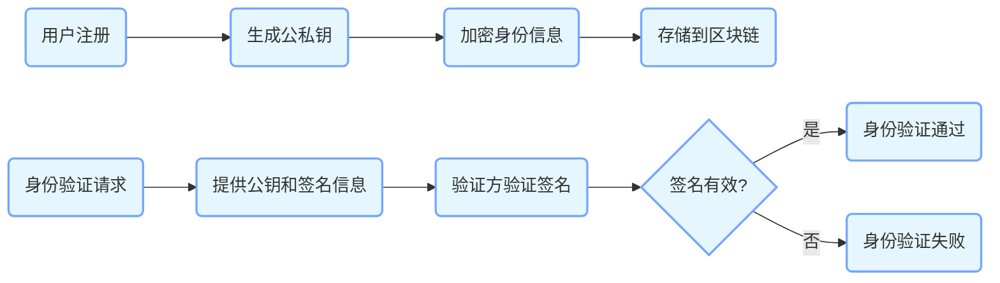

# 企业估值中的区块链数字身份认证系统评估

> 关键词：企业估值、区块链、数字身份认证系统、评估方法、应用场景

> 摘要：本文聚焦于企业估值中区块链数字身份认证系统的评估。首先介绍了相关背景，包括目的范围、预期读者等。接着阐述了区块链数字身份认证系统的核心概念与联系，详细说明了其原理和架构。通过Python代码讲解了核心算法原理及具体操作步骤，并给出了相关数学模型和公式。以实际项目为例，展示了开发环境搭建、源代码实现与解读。探讨了该系统在不同场景下的实际应用，推荐了学习资源、开发工具框架和相关论文著作。最后总结了未来发展趋势与挑战，解答了常见问题并提供了扩展阅读和参考资料，旨在为企业在评估区块链数字身份认证系统时提供全面的技术和理论支持。

## 1. 背景介绍 
### 1.1 目的和范围
在当今数字化时代，企业面临着日益复杂的安全和信任问题，数字身份认证成为保障企业信息安全和业务正常开展的关键环节。区块链技术以其去中心化、不可篡改、可追溯等特性，为数字身份认证带来了新的解决方案。本文章的目的在于深入探讨如何对企业中的区块链数字身份认证系统进行准确评估，以帮助企业更好地了解该系统的价值、性能和潜在风险。

范围涵盖了区块链数字身份认证系统的核心概念、算法原理、数学模型、实际应用案例以及评估所需考虑的各个方面，包括技术、经济、市场等因素。

### 1.2 预期读者
本文预期读者包括企业管理者、投资分析师、技术研发人员、安全专家以及对区块链和数字身份认证领域感兴趣的学者和爱好者。企业管理者可以通过本文了解如何评估区块链数字身份认证系统对企业的价值和影响，以便做出合理的决策；投资分析师可以依据评估方法对相关企业进行准确估值；技术研发人员可以深入了解系统的技术原理和实现细节，为系统的优化和改进提供参考；安全专家可以从安全角度对系统进行评估和审查；学者和爱好者则可以通过本文全面了解该领域的最新动态和研究成果。

### 1.3 文档结构概述
本文共分为十个部分。第一部分为背景介绍，阐述了文章的目的、范围、预期读者和文档结构。第二部分介绍区块链数字身份认证系统的核心概念与联系，包括系统的原理和架构。第三部分讲解核心算法原理及具体操作步骤，通过Python代码进行详细说明。第四部分给出数学模型和公式，并进行详细讲解和举例。第五部分通过项目实战，展示开发环境搭建、源代码实现与解读。第六部分探讨系统的实际应用场景。第七部分推荐学习资源、开发工具框架和相关论文著作。第八部分总结未来发展趋势与挑战。第九部分解答常见问题。第十部分提供扩展阅读和参考资料。

### 1.4 术语表
#### 1.4.1 核心术语定义
- **区块链（Blockchain）**：一种分布式账本技术，由一系列按时间顺序相连的区块组成，每个区块包含一定数量的交易信息，通过密码学算法保证数据的不可篡改和可追溯性。
- **数字身份（Digital Identity）**：是指在数字世界中代表个体或实体的唯一标识，包含用户的各种属性和信息，可用于身份验证和授权。
- **数字身份认证系统（Digital Identity Authentication System）**：用于验证用户数字身份的系统，通过多种技术手段确保用户身份的真实性和合法性。
- **智能合约（Smart Contract）**：一种基于区块链技术的自动化合约，以代码形式编写，当满足预设条件时自动执行，无需第三方干预。

#### 1.4.2 相关概念解释
- **去中心化（Decentralization）**：区块链系统不依赖于单一的中心化机构，而是由多个节点共同维护和管理，每个节点都具有相同的权利和义务，提高了系统的可靠性和安全性。
- **共识机制（Consensus Mechanism）**：区块链网络中用于达成节点间共识的算法，确保所有节点对账本状态的一致性，常见的共识机制有工作量证明（PoW）、权益证明（PoS）等。
- **加密算法（Encryption Algorithm）**：用于对数据进行加密和解密的算法，保证数据在传输和存储过程中的安全性，如哈希算法、对称加密算法和非对称加密算法等。

#### 1.4.3 缩略词列表
- **PoW**：Proof of Work，工作量证明
- **PoS**：Proof of Stake，权益证明
- **PKI**：Public Key Infrastructure，公钥基础设施
- **DID**：Decentralized Identifier，去中心化标识符

## 2. 核心概念与联系 

### 核心概念原理
区块链数字身份认证系统的核心原理是利用区块链的分布式账本特性，将用户的数字身份信息存储在区块链上，通过加密算法保证身份信息的安全性和隐私性。用户拥有自己的私钥，用于对身份信息进行签名和验证，只有持有正确私钥的用户才能证明自己的身份。

系统的工作流程如下：
1. 用户注册：用户在系统中注册时，生成一对公私钥，公钥作为用户的数字身份标识，私钥由用户自己保管。
2. 身份信息存储：用户的身份信息（如姓名、身份证号等）经过加密处理后存储在区块链上，只有用户使用私钥才能解密查看。
3. 身份验证：当用户需要进行身份验证时，向验证方提供自己的公钥和经过私钥签名的身份信息，验证方通过公钥验证签名的有效性，从而确认用户的身份。

### 架构的文本示意图
```plaintext
+----------------------+
|  用户终端            |
|  (持有私钥)          |
+----------------------+
           |
           |  身份信息交互
           v
+----------------------+
|  区块链网络          |
|  (存储加密身份信息)  |
+----------------------+
           |
           |  验证请求
           v
+----------------------+
|  验证方系统          |
|  (验证身份签名)      |
+----------------------+
```

### Mermaid 流程图


## 3. 核心算法原理 & 具体操作步骤 

### 加密算法原理
在区块链数字身份认证系统中，常用的加密算法包括哈希算法和非对称加密算法。哈希算法用于生成数据的哈希值，保证数据的完整性；非对称加密算法用于身份信息的加密和解密以及签名验证。

以下是使用Python实现的简单示例，使用`hashlib`库进行哈希计算，`cryptography`库进行非对称加密和签名验证：

```python
import hashlib
from cryptography.hazmat.backends import default_backend
from cryptography.hazmat.primitives.asymmetric import rsa, padding
from cryptography.hazmat.primitives import serialization, hashes

# 生成RSA公私钥对
def generate_keypair():
    private_key = rsa.generate_private_key(
        public_exponent=65537,
        key_size=2048,
        backend=default_backend()
    )
    public_key = private_key.public_key()
    return private_key, public_key

# 对数据进行哈希计算
def hash_data(data):
    hash_object = hashlib.sha256(data.encode())
    return hash_object.hexdigest()

# 使用私钥进行签名
def sign_data(private_key, data):
    signature = private_key.sign(
        data.encode(),
        padding.PSS(
            mgf=padding.MGF1(hashes.SHA256()),
            salt_length=padding.PSS.MAX_LENGTH
        ),
        hashes.SHA256()
    )
    return signature

# 使用公钥进行签名验证
def verify_signature(public_key, data, signature):
    try:
        public_key.verify(
            signature,
            data.encode(),
            padding.PSS(
                mgf=padding.MGF1(hashes.SHA256()),
                salt_length=padding.PSS.MAX_LENGTH
            ),
            hashes.SHA256()
        )
        return True
    except Exception:
        return False

# 示例使用
if __name__ == "__main__":
    private_key, public_key = generate_keypair()
    data = "Hello, World!"
    hashed_data = hash_data(data)
    signature = sign_data(private_key, data)
    is_valid = verify_signature(public_key, data, signature)
    print(f"Data: {data}")
    print(f"Hashed Data: {hashed_data}")
    print(f"Signature: {signature}")
    print(f"Signature is valid: {is_valid}")
```

### 具体操作步骤
1. **生成公私钥对**：调用`generate_keypair`函数生成RSA公私钥对，私钥由用户保管，公钥可以公开。
2. **哈希计算**：使用`hash_data`函数对用户的身份信息进行哈希计算，得到哈希值，用于验证数据的完整性。
3. **签名操作**：用户使用私钥对身份信息进行签名，调用`sign_data`函数生成签名。
4. **验证签名**：验证方使用用户的公钥对签名进行验证，调用`verify_signature`函数判断签名是否有效。

## 4. 数学模型和公式 & 详细讲解 & 举例说明 

### 哈希函数
哈希函数是一种将任意长度的输入数据映射为固定长度输出的函数，通常用 $H(x)$ 表示，其中 $x$ 是输入数据。哈希函数具有以下特性：
- **确定性**：对于相同的输入 $x$，哈希函数总是返回相同的输出 $H(x)$。
- **高效性**：计算哈希值的时间复杂度较低。
- **抗碰撞性**：很难找到两个不同的输入 $x_1$ 和 $x_2$，使得 $H(x_1) = H(x_2)$。

常见的哈希函数有SHA-256，其数学表达式可以表示为：
$$ H(x) = SHA - 256(x) $$

例如，对于输入数据 $x = "Hello, World!"$，使用Python计算其SHA-256哈希值：
```python
import hashlib

data = "Hello, World!"
hash_object = hashlib.sha256(data.encode())
hash_value = hash_object.hexdigest()
print(f"Hash value of '{data}': {hash_value}")
```

### 非对称加密算法
非对称加密算法使用一对公私钥，公钥用于加密，私钥用于解密。设公钥为 $PK$，私钥为 $SK$，明文为 $M$，密文为 $C$，加密过程可以表示为：
$$ C = E_{PK}(M) $$
解密过程可以表示为：
$$ M = D_{SK}(C) $$

签名过程则是使用私钥对消息的哈希值进行签名，设消息为 $M$，签名为 $S$，签名过程可以表示为：
$$ S = Sign_{SK}(H(M)) $$
验证过程则是使用公钥验证签名的有效性，验证过程可以表示为：
$$ Verify_{PK}(M, S) = True \text{ 或 } False $$

例如，在上述Python代码中，使用RSA算法进行加密、签名和验证：
```python
from cryptography.hazmat.backends import default_backend
from cryptography.hazmat.primitives.asymmetric import rsa, padding
from cryptography.hazmat.primitives import serialization, hashes

# 生成公私钥对
private_key = rsa.generate_private_key(
    public_exponent=65537,
    key_size=2048,
    backend=default_backend()
)
public_key = private_key.public_key()

# 明文
message = "Hello, World!"

# 加密
encrypted = public_key.encrypt(
    message.encode(),
    padding.OAEP(
        mgf=padding.MGF1(algorithm=hashes.SHA256()),
        algorithm=hashes.SHA256(),
        label=None
    )
)

# 解密
decrypted = private_key.decrypt(
    encrypted,
    padding.OAEP(
        mgf=padding.MGF1(algorithm=hashes.SHA256()),
        algorithm=hashes.SHA256(),
        label=None
    )
)

print(f"Original message: {message}")
print(f"Decrypted message: {decrypted.decode()}")
```

## 5. 项目实战：代码实际案例和详细解释说明 

### 5.1  开发环境搭建
#### 操作系统
推荐使用Linux系统，如Ubuntu 20.04，因为Linux系统对开发和部署区块链应用具有良好的支持。

#### 编程语言
使用Python 3.8及以上版本，Python具有丰富的库和工具，方便进行区块链和加密算法的开发。

#### 区块链平台
选择Hyperledger Fabric作为区块链平台，它是一个开源的企业级区块链框架，具有高度的可扩展性和安全性。

#### 安装依赖库
使用`pip`安装所需的Python库：
```bash
pip install cryptography hashlib flask
```
其中，`cryptography`用于加密算法，`hashlib`用于哈希计算，`flask`用于搭建Web服务。

### 5.2  源代码详细实现和代码解读
以下是一个简单的区块链数字身份认证系统的Python代码示例：

```python
from flask import Flask, request
import hashlib
from cryptography.hazmat.backends import default_backend
from cryptography.hazmat.primitives.asymmetric import rsa, padding
from cryptography.hazmat.primitives import serialization, hashes

app = Flask(__name__)

# 模拟区块链存储用户身份信息
blockchain = {}

# 生成RSA公私钥对
def generate_keypair():
    private_key = rsa.generate_private_key(
        public_exponent=65537,
        key_size=2048,
        backend=default_backend()
    )
    public_key = private_key.public_key()
    private_pem = private_key.private_bytes(
        encoding=serialization.Encoding.PEM,
        format=serialization.PrivateFormat.PKCS8,
        encryption_algorithm=serialization.NoEncryption()
    )
    public_pem = public_key.public_bytes(
        encoding=serialization.Encoding.PEM,
        format=serialization.PublicFormat.SubjectPublicKeyInfo
    )
    return private_pem, public_pem

# 对数据进行哈希计算
def hash_data(data):
    hash_object = hashlib.sha256(data.encode())
    return hash_object.hexdigest()

# 使用私钥进行签名
def sign_data(private_pem, data):
    private_key = serialization.load_pem_private_key(
        private_pem,
        password=None,
        backend=default_backend()
    )
    signature = private_key.sign(
        data.encode(),
        padding.PSS(
            mgf=padding.MGF1(hashes.SHA256()),
            salt_length=padding.PSS.MAX_LENGTH
        ),
        hashes.SHA256()
    )
    return signature

# 使用公钥进行签名验证
def verify_signature(public_pem, data, signature):
    public_key = serialization.load_pem_public_key(
        public_pem,
        backend=default_backend()
    )
    try:
        public_key.verify(
            signature,
            data.encode(),
            padding.PSS(
                mgf=padding.MGF1(hashes.SHA256()),
                salt_length=padding.PSS.MAX_LENGTH
            ),
            hashes.SHA256()
        )
        return True
    except Exception:
        return False

# 用户注册接口
@app.route('/register', methods=['POST'])
def register():
    data = request.get_json()
    username = data.get('username')
    if username in blockchain:
        return {'message': 'Username already exists'}, 400
    private_pem, public_pem = generate_keypair()
    blockchain[username] = {
        'public_key': public_pem.decode(),
        'hashed_data': hash_data(str(data))
    }
    return {'private_key': private_pem.decode(), 'public_key': public_pem.decode()}, 201

# 身份验证接口
@app.route('/authenticate', methods=['POST'])
def authenticate():
    data = request.get_json()
    username = data.get('username')
    signature = data.get('signature')
    public_pem = blockchain.get(username, {}).get('public_key', '').encode()
    hashed_data = blockchain.get(username, {}).get('hashed_data')
    if not public_pem or not hashed_data:
        return {'message': 'User not found'}, 404
    is_valid = verify_signature(public_pem, hashed_data, signature)
    if is_valid:
        return {'message': 'Authentication successful'}, 200
    else:
        return {'message': 'Authentication failed'}, 401

if __name__ == '__main__':
    app.run(debug=True)
```

### 5.3  代码解读与分析
#### 代码结构
- **导入必要的库**：包括Flask、哈希库和加密库等。
- **定义全局变量**：使用`blockchain`字典模拟区块链存储用户身份信息。
- **定义加密相关函数**：如`generate_keypair`生成公私钥对，`hash_data`进行哈希计算，`sign_data`进行签名，`verify_signature`进行签名验证。
- **定义路由接口**：
  - `/register`：用户注册接口，接收用户信息，生成公私钥对，将用户的公钥和哈希后的信息存储在模拟区块链中，并返回公私钥给用户。
  - `/authenticate`：身份验证接口，接收用户的用户名和签名，从模拟区块链中获取公钥和哈希信息，验证签名的有效性，返回验证结果。

#### 安全性分析
- **公私钥生成**：使用RSA算法生成2048位的公私钥对，保证了密钥的安全性。
- **哈希计算**：使用SHA-256哈希算法对用户信息进行哈希计算，防止信息被篡改。
- **签名验证**：使用私钥对哈希信息进行签名，验证方使用公钥验证签名，确保身份信息的真实性和完整性。

## 6. 实际应用场景 
### 金融行业
在金融行业，区块链数字身份认证系统可以用于客户身份验证、账户管理和交易授权等方面。通过区块链技术，金融机构可以实现客户身份信息的安全存储和共享，提高身份验证的效率和准确性，降低欺诈风险。例如，银行在开户时可以使用该系统验证客户的身份信息，确保客户的真实性和合法性；在进行大额交易时，通过验证客户的数字身份签名，确保交易的安全性。

### 医疗行业
在医疗行业，区块链数字身份认证系统可以用于患者身份管理、医疗记录共享和医疗数据安全等方面。患者的数字身份信息可以存储在区块链上，只有经过授权的医疗机构和医生才能访问患者的医疗记录，保证了患者隐私的安全性。同时，该系统可以实现医疗数据的跨机构共享，提高医疗服务的效率和质量。例如，患者在不同医院就诊时，医生可以通过该系统快速获取患者的历史医疗记录，为诊断和治疗提供参考。

### 政府政务
在政府政务领域，区块链数字身份认证系统可以用于电子政务、社会保障和公共服务等方面。政府部门可以使用该系统对公民的身份进行验证，提供更加便捷和高效的政务服务。例如，公民在办理社保业务、申请政府补贴等时，通过数字身份认证系统可以快速完成身份验证，减少繁琐的手续和等待时间。

### 物联网行业
在物联网行业，区块链数字身份认证系统可以用于设备身份验证、数据传输安全和设备管理等方面。物联网设备的数字身份信息可以存储在区块链上，设备之间通过数字身份进行通信和交互，确保设备的合法性和数据的安全性。例如，智能家居设备在连接到网络时，通过验证设备的数字身份签名，防止设备被非法入侵和控制。

## 7. 工具和资源推荐
### 7.1 学习资源推荐
#### 7.1.1 书籍推荐
- 《区块链技术指南》：详细介绍了区块链的基本原理、技术架构和应用场景，适合初学者入门。
- 《数字身份：区块链与隐私保护》：深入探讨了数字身份认证的相关技术和方法，以及区块链在数字身份领域的应用。
- 《Python密码学编程》：介绍了Python中常用的加密算法和库，对于理解和实现区块链数字身份认证系统的加密部分有很大帮助。

#### 7.1.2 在线课程
- Coursera上的“区块链基础”课程：由知名大学教授授课，系统讲解区块链的基本概念、技术和应用。
- edX上的“数字身份与隐私”课程：专注于数字身份认证和隐私保护的相关知识和技术。
- 中国大学MOOC上的“Python编程基础”课程：适合零基础学习者，为后续学习区块链和加密算法的Python实现打下基础。

#### 7.1.3 技术博客和网站
- Medium：上面有很多关于区块链和数字身份认证的技术文章和观点分享。
- 巴比特：国内知名的区块链资讯网站，提供丰富的区块链技术和应用案例。
- 开源中国：有很多开发者分享的区块链和加密算法的代码和经验。

### 7.2 开发工具框架推荐
#### 7.2.1 IDE和编辑器
- PyCharm：专业的Python集成开发环境，具有强大的代码编辑、调试和分析功能。
- Visual Studio Code：轻量级的代码编辑器，支持多种编程语言和插件扩展，适合快速开发。

#### 7.2.2 调试和性能分析工具
- pdb：Python自带的调试器，可以帮助开发者定位和解决代码中的问题。
- cProfile：Python的性能分析工具，可以分析代码的执行时间和资源消耗情况。

#### 7.2.3 相关框架和库
- Hyperledger Fabric：企业级区块链框架，提供了丰富的功能和工具，适合开发区块链数字身份认证系统。
- Ethereum：开源的区块链平台，支持智能合约的开发和部署，可用于实现复杂的数字身份认证逻辑。
- Cryptography：Python的加密库，提供了多种加密算法和工具，方便进行身份信息的加密和解密。

### 7.3 相关论文著作推荐
#### 7.3.1 经典论文
- “Bitcoin: A Peer-to-Peer Electronic Cash System”：比特币的白皮书，介绍了区块链的基本概念和原理。
- “The Blockchain Economy: A Blueprint for a Decentralized Future”：探讨了区块链技术对经济和社会的影响，以及区块链在各个领域的应用前景。

#### 7.3.2 最新研究成果
- 可以关注IEEE、ACM等学术会议和期刊上发表的关于区块链和数字身份认证的最新研究论文，了解该领域的前沿技术和发展趋势。

#### 7.3.3 应用案例分析
- 一些知名企业和机构发布的区块链数字身份认证系统的应用案例报告，如IBM、微软等公司的相关案例，可以从中学习实际应用中的经验和教训。

## 8. 总结：未来发展趋势与挑战
### 未来发展趋势
- **标准化和互操作性**：随着区块链数字身份认证系统的广泛应用，行业将逐渐形成统一的标准和规范，不同系统之间的互操作性将得到提高，方便用户在不同平台和场景下使用数字身份。
- **与其他技术的融合**：区块链将与人工智能、物联网、大数据等技术深度融合，创造出更加智能、高效和安全的数字身份认证解决方案。例如，结合人工智能技术进行身份信息的自动识别和验证，提高认证的准确性和效率。
- **应用场景的拓展**：除了金融、医疗、政务等领域，区块链数字身份认证系统将在更多行业和场景中得到应用，如教育、娱乐、供应链等，为各个行业的数字化转型提供支持。

### 挑战
- **技术性能问题**：区块链技术目前还存在性能瓶颈，如交易处理速度慢、存储成本高等问题，需要进一步优化和改进，以满足大规模应用的需求。
- **法律和监管问题**：区块链数字身份认证系统涉及用户的隐私和个人信息，需要建立健全相关的法律法规和监管机制，确保用户权益得到保护。
- **安全风险**：尽管区块链具有一定的安全性，但仍然面临着黑客攻击、私钥丢失等安全风险，需要加强安全防护措施，提高系统的安全性和可靠性。

## 9. 附录：常见问题与解答
### 1. 区块链数字身份认证系统与传统身份认证系统有什么区别？
传统身份认证系统通常依赖于中心化的机构进行身份验证和管理，存在单点故障和数据泄露的风险。而区块链数字身份认证系统采用去中心化的架构，将身份信息存储在区块链上，通过加密算法保证信息的安全性和隐私性，用户拥有自己的私钥，能够更好地控制自己的身份信息。

### 2. 如何保证区块链上存储的身份信息的安全性？
通过使用加密算法对身份信息进行加密处理，只有持有正确私钥的用户才能解密查看。同时，区块链的不可篡改特性保证了身份信息一旦存储在区块链上，就无法被恶意修改。此外，还可以采用多因素认证、访问控制等技术手段进一步提高信息的安全性。

### 3. 区块链数字身份认证系统的成本高吗？
区块链数字身份认证系统的成本主要包括开发成本、运维成本和存储成本等。开发成本取决于系统的复杂度和功能需求；运维成本包括节点的运行和维护费用；存储成本与区块链的存储容量和使用的存储技术有关。随着区块链技术的不断发展和成熟，成本有望逐渐降低。

### 4. 该系统是否能够完全防止身份欺诈？
虽然区块链数字身份认证系统具有较高的安全性，但并不能完全防止身份欺诈。黑客可能会通过攻击用户的设备获取私钥，或者利用系统的漏洞进行欺诈行为。因此，需要结合其他安全措施，如安全教育、实时监测和应急响应等，来降低身份欺诈的风险。

## 10. 扩展阅读 & 参考资料
### 扩展阅读
- 《区块链革命：比特币底层技术如何改变货币、商业和世界》
- 《智能合约：从区块链到金融科技》
- 《密码学原理与实践》

### 参考资料
- Bitcoin Whitepaper: https://bitcoin.org/bitcoin.pdf
- Hyperledger Fabric Documentation: https://hyperledger-fabric.readthedocs.io/
- Cryptography Library Documentation: https://cryptography.io/

作者：AI天才研究院/AI Genius Institute & 禅与计算机程序设计艺术 /Zen And The Art of Computer Programming