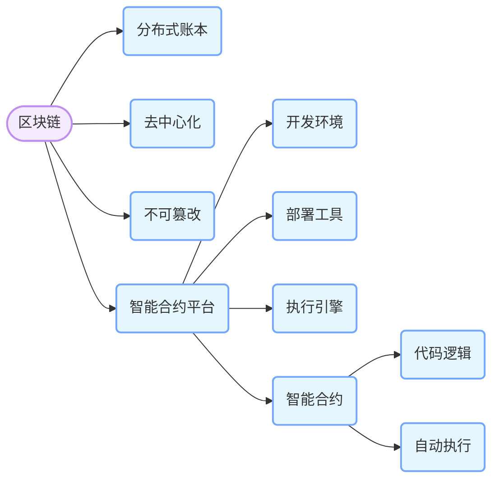

# 企业估值中的区块链智能合约平台评估

> 关键词：企业估值、区块链、智能合约平台、评估指标、价值分析

> 摘要：本文聚焦于企业估值中区块链智能合约平台的评估。首先介绍了研究的背景、目的、预期读者等内容，接着阐述了区块链和智能合约平台的核心概念及联系，详细讲解了评估所涉及的核心算法原理与具体操作步骤，给出了相关的数学模型和公式并举例说明。通过项目实战展示代码案例及解读，分析了区块链智能合约平台在不同场景下的实际应用，推荐了相关的学习资源、开发工具框架和论文著作。最后总结了未来发展趋势与挑战，解答常见问题并提供扩展阅读与参考资料，旨在为企业在进行区块链智能合约平台估值时提供全面且深入的指导。

## 1. 背景介绍 
### 1.1 目的和范围
在当今数字化经济迅速发展的时代，区块链技术以其去中心化、不可篡改、安全透明等特性，成为推动金融科技、供应链管理、物联网等众多领域变革的关键力量。智能合约作为区块链技术的重要应用，能够自动执行合约条款，大大提高了业务流程的效率和可信度。随着越来越多的企业涉足区块链智能合约平台的开发和应用，准确评估这些平台的价值对于投资者、企业管理者以及监管机构都具有至关重要的意义。

本文的目的在于构建一套全面、科学的评估体系，用于企业估值中对区块链智能合约平台的评估。范围涵盖了区块链智能合约平台的技术架构、性能指标、经济模型、市场竞争力等多个方面，旨在为不同利益相关者提供实用的评估方法和决策依据。

### 1.2 预期读者
本文的预期读者包括：
- **投资者**：希望了解区块链智能合约平台的投资价值，以便做出明智的投资决策。
- **企业管理者**：对企业内部的区块链智能合约平台进行评估，优化资源配置，提升平台竞争力。
- **行业分析师**：研究区块链智能合约平台的市场趋势和发展动态，为行业报告提供数据支持。
- **监管机构**：评估区块链智能合约平台的合规性和风险，制定相应的监管政策。

### 1.3 文档结构概述
本文将按照以下结构展开：
- **核心概念与联系**：介绍区块链和智能合约平台的基本概念，分析它们之间的关系，并给出相关的文本示意图和Mermaid流程图。
- **核心算法原理 & 具体操作步骤**：讲解评估区块链智能合约平台所涉及的核心算法，通过Python源代码详细阐述算法的实现过程，并给出具体的操作步骤。
- **数学模型和公式 & 详细讲解 & 举例说明**：建立评估的数学模型，给出相关公式，并通过实际例子进行详细讲解。
- **项目实战：代码实际案例和详细解释说明**：通过一个具体的项目实战，展示如何使用代码实现对区块链智能合约平台的评估，并对代码进行详细解读。
- **实际应用场景**：分析区块链智能合约平台在不同行业的实际应用场景，以及评估在这些场景中的重要性。
- **工具和资源推荐**：推荐学习区块链和智能合约平台评估的相关资源，包括书籍、在线课程、技术博客等，以及开发工具框架和相关论文著作。
- **总结：未来发展趋势与挑战**：总结区块链智能合约平台评估的未来发展趋势，分析面临的挑战。
- **附录：常见问题与解答**：解答读者在评估过程中常见的问题。
- **扩展阅读 & 参考资料**：提供相关的扩展阅读材料和参考资料，方便读者深入学习。

### 1.4 术语表
#### 1.4.1 核心术语定义
- **区块链（Blockchain）**：一种分布式账本技术，由多个区块组成，每个区块包含一定数量的交易记录，通过密码学算法保证数据的安全性和不可篡改。
- **智能合约（Smart Contract）**：一种以代码形式编写的合约，运行在区块链上，能够自动执行合约条款，无需第三方干预。
- **智能合约平台（Smart Contract Platform）**：为智能合约的开发、部署和执行提供支持的区块链平台，如以太坊、EOS等。
- **企业估值（Business Valuation）**：对企业的价值进行评估的过程，通常考虑企业的财务状况、市场竞争力、发展前景等因素。

#### 1.4.2 相关概念解释
- **去中心化（Decentralization）**：区块链系统中，没有中央控制机构，所有节点共同参与数据的存储和验证，提高了系统的可靠性和安全性。
- **共识机制（Consensus Mechanism）**：区块链网络中节点达成一致的算法，确保数据的一致性和完整性，常见的共识机制有工作量证明（PoW）、权益证明（PoS）等。
- **Gas**：在以太坊等智能合约平台中，执行智能合约需要消耗一定的计算资源，Gas是衡量这种计算资源消耗的单位。

#### 1.4.3 缩略词列表
- **PoW**：Proof of Work，工作量证明
- **PoS**：Proof of Stake，权益证明
- **DApp**：Decentralized Application，去中心化应用

## 2. 核心概念与联系 

### 区块链概述
区块链是一种分布式账本技术，它将数据存储在多个节点上，每个节点都有完整的数据副本。区块链的核心特点包括去中心化、不可篡改、安全透明等。数据以区块的形式存储，每个区块包含前一个区块的哈希值，形成一个链式结构。这种结构使得数据一旦被记录就很难被篡改，保证了数据的完整性和可信度。

### 智能合约概述
智能合约是一种以代码形式编写的合约，它运行在区块链上，能够自动执行合约条款。智能合约的优点在于可以减少人为干预，提高交易效率，降低交易成本。例如，在一个简单的智能合约中，可以设定当满足一定条件时，自动进行资金的转移。

### 智能合约平台与区块链的关系
智能合约平台是基于区块链技术构建的，它为智能合约的开发、部署和执行提供了基础设施。区块链为智能合约提供了安全可靠的运行环境，而智能合约则为区块链赋予了更多的应用场景。例如，以太坊是一个著名的智能合约平台，它允许开发者使用Solidity等编程语言编写智能合约，并在以太坊网络上部署和执行。

### 文本示意图
```plaintext
区块链
|
|-- 分布式账本
|-- 去中心化
|-- 不可篡改
|
|-- 智能合约平台
|   |
|   |-- 开发环境
|   |-- 部署工具
|   |-- 执行引擎
|
|-- 智能合约
    |
    |-- 代码逻辑
    |-- 自动执行
```

### Mermaid流程图


## 3. 核心算法原理 & 具体操作步骤 

### 评估指标选择
在评估区块链智能合约平台时，需要考虑多个指标，包括技术性能、经济模型、市场竞争力等。以下是一些常见的评估指标：
- **吞吐量（Throughput）**：指平台在单位时间内能够处理的交易数量，反映了平台的处理能力。
- **延迟（Latency）**：指从交易发起至交易确认所需的时间，体现了平台的响应速度。
- **安全性（Security）**：包括平台的加密算法、共识机制等方面的安全性。
- **开发活跃度（Development Activity）**：通过代码提交数量、社区贡献等指标衡量平台的开发热度。
- **代币经济模型（Token Economics）**：分析平台代币的发行、流通和使用规则。

### 核心算法原理
为了综合评估区块链智能合约平台，我们可以采用加权平均法。首先，为每个评估指标设定一个权重，然后根据平台在每个指标上的表现进行打分，最后将各项得分乘以对应的权重并求和，得到平台的综合评估得分。

### Python源代码实现
```python
# 定义评估指标和权重
metrics = {
    "throughput": 0.2,
    "latency": 0.2,
    "security": 0.2,
    "development_activity": 0.2,
    "token_economics": 0.2
}

# 定义平台在各指标上的得分
platform_scores = {
    "throughput": 80,
    "latency": 70,
    "security": 90,
    "development_activity": 75,
    "token_economics": 85
}

# 计算综合评估得分
total_score = 0
for metric, weight in metrics.items():
    score = platform_scores[metric]
    total_score += score * weight

print(f"平台的综合评估得分: {total_score}")
```

### 具体操作步骤
1. **确定评估指标**：根据平台的特点和评估目的，选择合适的评估指标。
2. **设定指标权重**：根据各指标的重要程度，为每个指标设定相应的权重。
3. **收集数据**：通过各种渠道收集平台在各指标上的表现数据。
4. **打分**：根据收集到的数据，为平台在每个指标上进行打分。
5. **计算综合得分**：按照加权平均法，将各项得分乘以对应的权重并求和，得到平台的综合评估得分。

## 4. 数学模型和公式 & 详细讲解 & 举例说明 

### 数学模型
设评估指标有 $n$ 个，分别为 $M_1, M_2, \cdots, M_n$，对应的权重为 $w_1, w_2, \cdots, w_n$，且 $\sum_{i=1}^{n} w_i = 1$。平台在各指标上的得分分别为 $s_1, s_2, \cdots, s_n$，则平台的综合评估得分 $S$ 可以表示为：

$$S = \sum_{i=1}^{n} w_i s_i$$

### 详细讲解
- 权重 $w_i$ 表示每个评估指标在综合评估中的重要程度，权重之和为 1 保证了综合得分的合理性。
- 得分 $s_i$ 反映了平台在第 $i$ 个评估指标上的表现，可以通过客观数据或主观评价得到。
- 综合评估得分 $S$ 是各指标得分的加权平均值，它综合考虑了平台在多个方面的表现。

### 举例说明
假设我们要评估两个区块链智能合约平台 A 和 B，评估指标包括吞吐量、延迟、安全性、开发活跃度和代币经济模型，权重分别为 0.2、0.2、0.2、0.2 和 0.2。两个平台在各指标上的得分如下表所示：

| 平台 | 吞吐量 | 延迟 | 安全性 | 开发活跃度 | 代币经济模型 |
| ---- | ---- | ---- | ---- | ---- | ---- |
| A | 80 | 70 | 90 | 75 | 85 |
| B | 75 | 80 | 85 | 80 | 82 |

根据上述数学模型，计算平台 A 的综合评估得分：

$$S_A = 0.2\times80 + 0.2\times70 + 0.2\times90 + 0.2\times75 + 0.2\times85 = 80$$

计算平台 B 的综合评估得分：

$$S_B = 0.2\times75 + 0.2\times80 + 0.2\times85 + 0.2\times80 + 0.2\times82 = 80.4$$

从综合评估得分来看，平台 B 的表现略优于平台 A。

## 5. 项目实战：代码实际案例和详细解释说明 

### 5.1  开发环境搭建
为了完成本项目实战，我们需要搭建以下开发环境：
- **Python**：版本 3.7 及以上，用于编写评估代码。
- **Jupyter Notebook**：方便进行代码的编写、调试和展示。
- **相关库**：安装 `pandas` 用于数据处理，`matplotlib` 用于数据可视化。

可以使用以下命令安装所需库：
```bash
pip install pandas matplotlib
```

### 5.2  源代码详细实现和代码解读
以下是一个完整的项目实战代码，用于评估多个区块链智能合约平台：

```python
import pandas as pd
import matplotlib.pyplot as plt

# 定义评估指标和权重
metrics = {
    "throughput": 0.2,
    "latency": 0.2,
    "security": 0.2,
    "development_activity": 0.2,
    "token_economics": 0.2
}

# 定义多个平台在各指标上的得分
platform_scores = {
    "Platform A": {
        "throughput": 80,
        "latency": 70,
        "security": 90,
        "development_activity": 75,
        "token_economics": 85
    },
    "Platform B": {
        "throughput": 75,
        "latency": 80,
        "security": 85,
        "development_activity": 80,
        "token_economics": 82
    },
    "Platform C": {
        "throughput": 85,
        "latency": 75,
        "security": 88,
        "development_activity": 78,
        "token_economics": 83
    }
}

# 计算各平台的综合评估得分
platform_evaluation = {}
for platform, scores in platform_scores.items():
    total_score = 0
    for metric, weight in metrics.items():
        score = scores[metric]
        total_score += score * weight
    platform_evaluation[platform] = total_score

# 将评估结果转换为 DataFrame
evaluation_df = pd.DataFrame.from_dict(platform_evaluation, orient='index', columns=['综合评估得分'])

# 打印评估结果
print(evaluation_df)

# 绘制柱状图展示评估结果
plt.bar(evaluation_df.index, evaluation_df['综合评估得分'])
plt.xlabel('平台')
plt.ylabel('综合评估得分')
plt.title('区块链智能合约平台综合评估得分')
plt.show()
```

### 代码解读与分析
- **数据定义**：首先定义了评估指标和权重，以及多个平台在各指标上的得分。
- **计算综合评估得分**：通过循环遍历每个平台的得分，根据加权平均法计算综合评估得分，并将结果存储在 `platform_evaluation` 字典中。
- **数据处理**：使用 `pandas` 库将评估结果转换为 DataFrame，方便进行数据处理和展示。
- **结果展示**：打印评估结果，并使用 `matplotlib` 库绘制柱状图，直观地展示各平台的综合评估得分。

通过这个项目实战，我们可以清晰地看到如何使用代码实现对多个区块链智能合约平台的评估，并对评估结果进行可视化展示。

## 6. 实际应用场景 
### 金融领域
在金融领域，区块链智能合约平台可以用于实现自动化的金融交易，如证券交易、贷款发放等。评估区块链智能合约平台的价值可以帮助金融机构选择合适的平台，提高交易效率，降低风险。例如，银行在选择区块链智能合约平台进行跨境支付时，需要评估平台的吞吐量、延迟和安全性等指标，以确保交易的快速、准确和安全。

### 供应链管理
在供应链管理中，区块链智能合约平台可以实现供应链的透明化和可追溯性。通过评估平台的性能和功能，企业可以优化供应链流程，减少中间环节，降低成本。例如，一家制造企业在选择区块链智能合约平台管理原材料采购时，需要考虑平台的开发活跃度和代币经济模型，以确保平台能够持续发展并满足企业的需求。

### 物联网
在物联网领域，区块链智能合约平台可以实现设备之间的自动交易和数据共享。评估平台的价值可以帮助物联网企业选择合适的平台，提高设备的互操作性和安全性。例如，一家智能家居企业在选择区块链智能合约平台实现设备之间的自动缴费时，需要评估平台的安全性和兼容性，以确保用户数据的安全和设备的正常运行。

## 7. 工具和资源推荐
### 7.1 学习资源推荐
#### 7.1.1 书籍推荐
- 《区块链技术指南》：全面介绍了区块链的技术原理、应用场景和发展趋势。
- 《智能合约：原理、架构与应用》：深入讲解了智能合约的设计、开发和部署。
- 《区块链实战：Hyperledger Fabric开发实战》：通过实际案例介绍了Hyperledger Fabric区块链平台的开发和应用。

#### 7.1.2 在线课程
- Coursera上的“Blockchain Specialization”：由知名高校教授授课，系统介绍区块链的基础知识和应用。
- Udemy上的“Ethereum and Solidity: The Complete Developer's Guide”：专注于以太坊智能合约的开发。
- edX上的“Blockchain and Money”：探讨区块链技术对金融领域的影响。

#### 7.1.3 技术博客和网站
- Medium上的区块链相关博客：有许多行业专家分享区块链技术的最新研究成果和实践经验。
- CoinDesk：提供区块链和加密货币领域的新闻和分析。
- Ethereum官方文档：详细介绍以太坊智能合约平台的开发和使用。

### 7.2 开发工具框架推荐
#### 7.2.1 IDE和编辑器
- Visual Studio Code：功能强大的代码编辑器，支持多种编程语言和插件，可用于智能合约开发。
- Remix：以太坊官方推荐的在线智能合约开发环境，方便初学者快速上手。
- Truffle Suite：一套用于以太坊智能合约开发、测试和部署的工具集。

#### 7.2.2 调试和性能分析工具
- Ganache：用于本地以太坊开发的个人区块链，方便进行智能合约的调试和测试。
- Remix的调试功能：可以对智能合约进行单步调试，查看变量的值和执行流程。
- Chainstack：提供区块链节点的托管服务和性能监控工具。

#### 7.2.3 相关框架和库
- Web3.py：Python语言的以太坊开发库，方便与以太坊网络进行交互。
- Solidity：以太坊智能合约的编程语言，提供了丰富的合约开发功能。
- OpenZeppelin：一套用于开发安全智能合约的库，包含了许多常用的合约模板和工具。

### 7.3 相关论文著作推荐
#### 7.3.1 经典论文
- “Bitcoin: A Peer-to-Peer Electronic Cash System”：比特币的白皮书，介绍了比特币的基本原理和实现方法。
- “Ethereum: A Next-Generation Smart Contract and Decentralized Application Platform”：以太坊的白皮书，阐述了以太坊的设计理念和技术架构。
- “Hyperledger Fabric: A Distributed Operating System for Permissioned Blockchains”：Hyperledger Fabric的技术报告，详细介绍了该平台的架构和实现。

#### 7.3.2 最新研究成果
- IEEE Transactions on Dependable and Secure Computing上的区块链相关研究论文：关注区块链的安全性和可靠性。
- ACM SIGMOD Conference上的区块链数据管理研究论文：探讨区块链数据的存储和处理。
- International Conference on Blockchain and Cryptocurrency上的最新研究成果：涵盖了区块链技术的各个方面。

#### 7.3.3 应用案例分析
- 金融机构应用区块链智能合约平台的案例分析：如JP Morgan使用Quorum平台进行证券交易的案例。
- 供应链企业应用区块链技术的案例研究：如沃尔玛使用区块链技术实现食品溯源的案例。
- 物联网企业应用区块链智能合约的案例分享：如三星使用区块链技术实现设备之间的自动交易的案例。

## 8. 总结：未来发展趋势与挑战
### 未来发展趋势
- **性能提升**：随着技术的不断进步，区块链智能合约平台的吞吐量和延迟将得到进一步改善，能够满足更多大规模应用的需求。
- **跨链互操作性**：不同区块链智能合约平台之间的跨链互操作性将成为未来的发展方向，实现不同平台之间的资产转移和数据共享。
- **行业应用拓展**：区块链智能合约平台将在更多行业得到广泛应用，如医疗、教育、能源等，推动各行业的数字化转型。
- **合规性加强**：随着监管政策的不断完善，区块链智能合约平台将更加注重合规性，确保平台的合法运营。

### 挑战
- **技术难题**：区块链智能合约平台面临着许多技术难题，如共识机制的优化、智能合约的安全性等，需要不断进行技术创新和改进。
- **监管不确定性**：区块链技术的监管政策尚不完善，不同国家和地区的监管标准存在差异，给平台的发展带来了一定的不确定性。
- **用户教育**：区块链和智能合约技术相对复杂，普通用户对其了解和接受程度较低，需要加强用户教育和普及。
- **市场竞争**：随着区块链智能合约平台的不断涌现，市场竞争日益激烈，平台需要不断提升自身的竞争力，才能在市场中立足。

## 9. 附录：常见问题与解答
### 问题1：如何确定评估指标的权重？
答：评估指标的权重可以根据评估目的和平台的特点来确定。一般来说，可以通过专家评估、层次分析法等方法来确定权重。在实际应用中，也可以根据经验和数据进行调整。

### 问题2：智能合约平台的安全性如何评估？
答：评估智能合约平台的安全性可以从多个方面入手，如加密算法的强度、共识机制的安全性、智能合约的代码审计等。可以参考相关的安全标准和规范，也可以使用专业的安全评估工具进行检测。

### 问题3：如何收集平台在各指标上的数据？
答：可以通过多种渠道收集平台在各指标上的数据，如平台官方文档、开源代码库、行业报告、第三方数据平台等。对于一些难以获取的数据，也可以通过问卷调查、专家访谈等方式进行收集。

### 问题4：评估结果的准确性如何保证？
答：为了保证评估结果的准确性，需要确保数据的真实性和可靠性，选择合适的评估方法和指标，进行多次评估和验证。同时，也可以参考多个评估机构的结果，进行综合分析。

## 10. 扩展阅读 & 参考资料
### 扩展阅读
- 《区块链：从数字货币到信用社会》
- 《区块链革命：比特币底层技术如何改变货币、商业和世界》
- 《数字资产：加密货币、区块链与智能合约入门》

### 参考资料
- [Ethereum官方网站](https://ethereum.org/)
- [Hyperledger官方网站](https://www.hyperledger.org/)
- [CoinMarketCap](https://coinmarketcap.com/)
- [CryptoCompare](https://www.cryptocompare.com/)

作者：AI天才研究院/AI Genius Institute & 禅与计算机程序设计艺术 /Zen And The Art of Computer Programming