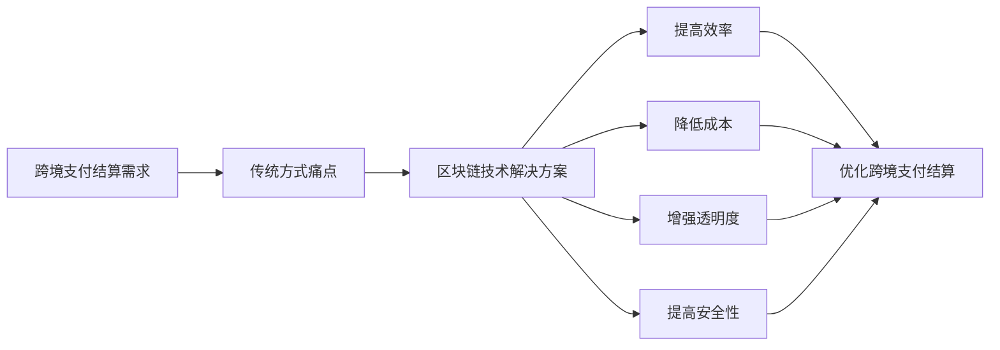

# 企业估值中的区块链跨境支付结算平台评估

> 关键词：企业估值、区块链、跨境支付结算平台、评估方法、应用场景

> 摘要：本文聚焦于企业估值中区块链跨境支付结算平台的评估。首先介绍了研究背景，明确目的、范围、预期读者等。接着阐述核心概念，分析区块链与跨境支付结算的联系。详细讲解核心算法原理，给出Python代码示例，同时呈现数学模型与公式。通过项目实战，展示开发环境搭建、代码实现与解读。探讨了该平台的实际应用场景，推荐了学习资源、开发工具和相关论文。最后总结未来发展趋势与挑战，解答常见问题并提供扩展阅读与参考资料，旨在为评估区块链跨境支付结算平台提供全面、深入的技术与理论支持。

## 1. 背景介绍 
### 1.1 目的和范围
随着全球经济一体化的加速，跨境贸易和金融活动日益频繁，跨境支付结算的需求不断增长。传统的跨境支付结算方式存在着效率低、成本高、透明度差等问题。区块链技术以其去中心化、不可篡改、分布式账本等特性，为跨境支付结算带来了新的解决方案。本文章的目的在于探讨如何对企业的区块链跨境支付结算平台进行合理、准确的估值，为投资者、企业管理者等提供决策依据。

本文章的范围涵盖了区块链跨境支付结算平台的核心概念、算法原理、数学模型、项目实战、应用场景等方面，同时还对相关的工具和资源进行了推荐，旨在全面、系统地介绍企业估值中区块链跨境支付结算平台评估的方法和要点。

### 1.2 预期读者
本文的预期读者包括但不限于以下几类人群：
1. **投资者**：希望了解区块链跨境支付结算平台的投资价值，以便做出合理的投资决策。
2. **企业管理者**：需要对企业自身的区块链跨境支付结算平台进行评估，为企业的战略规划和发展提供参考。
3. **金融从业者**：关注金融科技领域的发展，尤其是区块链在跨境支付结算中的应用，希望通过本文深入了解相关技术和评估方法。
4. **技术研究人员**：对区块链技术和跨境支付结算的结合感兴趣，希望从技术和理论层面进行深入研究。

### 1.3 文档结构概述
本文的文档结构如下：
1. **背景介绍**：介绍文章的目的、范围、预期读者和文档结构概述，同时给出相关术语的定义和解释。
2. **核心概念与联系**：阐述区块链和跨境支付结算的核心概念，分析它们之间的联系，并通过文本示意图和Mermaid流程图进行展示。
3. **核心算法原理 & 具体操作步骤**：详细讲解区块链跨境支付结算平台的核心算法原理，给出Python源代码示例，并说明具体的操作步骤。
4. **数学模型和公式 & 详细讲解 & 举例说明**：介绍评估区块链跨境支付结算平台的数学模型和公式，进行详细讲解，并通过具体的例子进行说明。
5. **项目实战：代码实际案例和详细解释说明**：通过一个实际的项目案例，展示区块链跨境支付结算平台的开发环境搭建、源代码实现和代码解读。
6. **实际应用场景**：探讨区块链跨境支付结算平台在不同领域的实际应用场景。
7. **工具和资源推荐**：推荐学习区块链和跨境支付结算相关知识的书籍、在线课程、技术博客和网站，以及开发工具、框架和相关论文。
8. **总结：未来发展趋势与挑战**：总结区块链跨境支付结算平台的未来发展趋势，分析面临的挑战。
9. **附录：常见问题与解答**：解答关于区块链跨境支付结算平台评估的常见问题。
10. **扩展阅读 & 参考资料**：提供相关的扩展阅读资料和参考文献。

### 1.4 术语表
#### 1.4.1 核心术语定义
- **区块链（Blockchain）**：一种去中心化的分布式账本技术，由一个个数据块组成，每个数据块包含了一定时间内的交易信息，通过密码学技术保证数据的不可篡改和安全性。
- **跨境支付结算（Cross - border Payment and Settlement）**：指不同国家或地区之间的经济主体进行资金转移和债务清偿的过程。
- **智能合约（Smart Contract）**：一种以计算机代码形式编写的合约，能够自动执行合约条款，当满足预设条件时，自动进行交易和结算。
- **哈希函数（Hash Function）**：一种将任意长度的输入数据转换为固定长度输出数据的函数，具有不可逆性和唯一性，常用于保证数据的完整性和安全性。
- **共识机制（Consensus Mechanism）**：区块链网络中节点之间达成一致的算法，用于确保所有节点对账本状态的共识，常见的共识机制有工作量证明（PoW）、权益证明（PoS）等。

#### 1.4.2 相关概念解释
- **去中心化（Decentralization）**：区块链的核心特性之一，意味着没有一个中心化的机构或节点控制整个网络，所有节点都具有平等的地位，共同维护网络的运行。
- **分布式账本（Distributed Ledger）**：一种在多个节点之间共享、复制和同步的账本，每个节点都保存了完整的账本副本，保证了数据的一致性和透明度。
- **加密货币（Cryptocurrency）**：基于区块链技术的一种数字货币，使用密码学技术进行加密和验证，如比特币、以太坊等。

#### 1.4.3 缩略词列表
- **PoW**：Proof of Work，工作量证明
- **PoS**：Proof of Stake，权益证明
- **DApp**：Decentralized Application，去中心化应用
- **API**：Application Programming Interface，应用程序编程接口

## 2. 核心概念与联系 

### 区块链核心概念
区块链是一种由多个节点共同维护的分布式账本技术。它将数据以区块的形式进行存储，每个区块包含了一定时间内的交易记录以及前一个区块的哈希值，通过这种方式形成一个链式结构，保证了数据的不可篡改和可追溯性。

### 跨境支付结算核心概念
跨境支付结算是指不同国家或地区之间的经济主体进行资金转移和债务清偿的过程。传统的跨境支付结算通常需要通过多个金融机构和中间环节，涉及不同国家的法律法规和监管要求，导致支付流程繁琐、效率低下、成本高昂。

### 两者联系
区块链技术可以为跨境支付结算带来诸多优势，从而解决传统方式的痛点。具体联系如下：
- **提高效率**：区块链的分布式账本特性使得交易信息可以实时在各个节点之间共享，减少了中间环节的处理时间，从而提高了跨境支付结算的效率。
- **降低成本**：去除了传统跨境支付结算中的多个中间机构，减少了手续费和其他费用，降低了支付成本。
- **增强透明度**：所有交易记录都被记录在区块链上，且不可篡改，各方可以实时查看交易状态，增强了支付结算的透明度。
- **提高安全性**：区块链使用密码学技术保证数据的安全性，防止交易信息被篡改和伪造，提高了跨境支付结算的安全性。

### 文本示意图
```plaintext
跨境支付结算需求 --> 传统方式痛点（效率低、成本高、透明度差）
传统方式痛点 --> 区块链技术解决方案
区块链技术解决方案 --> 提高效率、降低成本、增强透明度、提高安全性
提高效率、降低成本、增强透明度、提高安全性 --> 优化跨境支付结算
```

### Mermaid 流程图


## 3. 核心算法原理 & 具体操作步骤 

### 核心算法原理

#### 哈希函数
哈希函数是区块链中非常重要的算法之一。它将任意长度的输入数据转换为固定长度的输出数据，通常用十六进制表示。在区块链中，哈希函数用于保证数据的完整性和安全性。例如，每个区块的头部包含了该区块的哈希值，以及前一个区块的哈希值。如果某个区块的数据被篡改，那么该区块的哈希值就会发生变化，从而导致后续所有区块的哈希值都发生变化，这样就可以很容易地发现数据的篡改。

以下是一个简单的Python代码示例，使用`hashlib`库计算字符串的哈希值：
```python
import hashlib

def calculate_hash(data):
    """
    计算数据的哈希值
    :param data: 输入的数据
    :return: 哈希值
    """
    if isinstance(data, str):
        data = data.encode()
    hash_object = hashlib.sha256(data)
    return hash_object.hexdigest()

data = "Hello, Blockchain!"
hash_value = calculate_hash(data)
print(f"数据的哈希值: {hash_value}")
```

#### 共识机制
共识机制是区块链网络中节点之间达成一致的算法。在跨境支付结算平台中，常见的共识机制有工作量证明（PoW）和权益证明（PoS）。

##### 工作量证明（PoW）
工作量证明要求节点通过计算一个复杂的数学难题来证明自己的工作量。第一个解决难题的节点可以将新的区块添加到区块链上，并获得一定的奖励。这种机制保证了区块链的安全性，但也存在能耗高、效率低等问题。

以下是一个简单的PoW算法的Python代码示例：
```python
import hashlib
import time

class Block:
    def __init__(self, index, previous_hash, data):
        self.index = index
        self.previous_hash = previous_hash
        self.data = data
        self.timestamp = time.time()
        self.nonce = 0
        self.hash = self.calculate_hash()

    def calculate_hash(self):
        block_string = f"{self.index}{self.previous_hash}{self.data}{self.timestamp}{self.nonce}"
        return hashlib.sha256(block_string.encode()).hexdigest()

    def mine_block(self, difficulty):
        target = "0" * difficulty
        while self.hash[:difficulty]!= target:
            self.nonce += 1
            self.hash = self.calculate_hash()
        print(f"区块 {self.index} 已挖掘: {self.hash}")

# 创建区块链
blockchain = [Block(0, "0", "Genesis Block")]
previous_block = blockchain[0]

# 挖掘新的区块
difficulty = 2
for i in range(1, 5):
    new_block = Block(i, previous_block.hash, f"Data for block {i}")
    new_block.mine_block(difficulty)
    blockchain.append(new_block)
    previous_block = new_block
```

##### 权益证明（PoS）
权益证明根据节点持有的代币数量来决定其获得记账权的概率。持有代币越多的节点，获得记账权的概率越大。这种机制相对PoW来说，能耗更低，效率更高。

### 具体操作步骤

#### 交易发起
用户在跨境支付结算平台上发起一笔交易，输入交易金额、收款方信息等。

#### 交易验证
平台对交易信息进行验证，包括用户身份验证、账户余额验证等。

#### 交易打包
验证通过后，将交易信息打包成一个区块。

#### 共识达成
通过共识机制，节点之间达成一致，确定该区块是否可以添加到区块链上。

#### 区块添加
如果共识达成，将该区块添加到区块链上，并更新账本状态。

#### 结算完成
交易信息被记录在区块链上后，完成支付结算。

## 4. 数学模型和公式 & 详细讲解 & 举例说明 

### 哈希函数的数学原理
哈希函数可以表示为一个函数 $H: X \to Y$，其中 $X$ 是输入数据的集合，$Y$ 是输出哈希值的集合。哈希函数需要满足以下几个特性：
- **确定性**：对于相同的输入 $x \in X$，哈希函数 $H(x)$ 总是返回相同的输出 $y \in Y$。
- **快速计算**：能够在较短的时间内计算出哈希值。
- **抗碰撞性**：很难找到两个不同的输入 $x_1$ 和 $x_2$，使得 $H(x_1) = H(x_2)$。

### 工作量证明（PoW）的数学模型
在PoW算法中，节点需要找到一个随机数（nonce），使得区块的哈希值满足一定的条件。假设哈希函数为 $H$，区块的信息为 $B$，随机数为 $n$，难度目标为 $T$，则节点需要找到一个 $n$，使得 $H(B + n) < T$。

例如，假设难度目标 $T$ 是一个以若干个零开头的哈希值，节点需要不断尝试不同的随机数 $n$，直到计算出的哈希值 $H(B + n)$ 满足以相同数量的零开头。

### 权益证明（PoS）的数学模型
在PoS算法中，节点获得记账权的概率 $P$ 与节点持有的代币数量 $S$ 成正比。可以用以下公式表示：
$$P = \frac{S}{\sum_{i = 1}^{N}S_i}$$
其中，$S$ 是当前节点持有的代币数量，$S_i$ 是第 $i$ 个节点持有的代币数量，$N$ 是节点的总数。

### 举例说明

#### 哈希函数举例
假设输入数据为字符串 "Hello, World!"，使用SHA - 256哈希函数计算其哈希值。在Python中可以这样实现：
```python
import hashlib

data = "Hello, World!"
hash_object = hashlib.sha256(data.encode())
hash_value = hash_object.hexdigest()
print(f"数据的哈希值: {hash_value}")
```
运行上述代码，输出的哈希值是一个固定长度的十六进制字符串。

#### 工作量证明举例
假设有一个简单的区块链，每个区块包含一个索引、前一个区块的哈希值、交易数据和时间戳。难度目标设置为哈希值以两个零开头。以下是一个完整的Python代码示例：
```python
import hashlib
import time

class Block:
    def __init__(self, index, previous_hash, data):
        self.index = index
        self.previous_hash = previous_hash
        self.data = data
        self.timestamp = time.time()
        self.nonce = 0
        self.hash = self.calculate_hash()

    def calculate_hash(self):
        block_string = f"{self.index}{self.previous_hash}{self.data}{self.timestamp}{self.nonce}"
        return hashlib.sha256(block_string.encode()).hexdigest()

    def mine_block(self, difficulty):
        target = "0" * difficulty
        while self.hash[:difficulty]!= target:
            self.nonce += 1
            self.hash = self.calculate_hash()
        print(f"区块 {self.index} 已挖掘: {self.hash}")

# 创建区块链
blockchain = [Block(0, "0", "Genesis Block")]
previous_block = blockchain[0]

# 挖掘新的区块
difficulty = 2
for i in range(1, 5):
    new_block = Block(i, previous_block.hash, f"Data for block {i}")
    new_block.mine_block(difficulty)
    blockchain.append(new_block)
    previous_block = new_block
```
在这个例子中，节点需要不断尝试不同的随机数（nonce），直到计算出的哈希值以两个零开头，才能将该区块添加到区块链上。

#### 权益证明举例
假设有三个节点，节点A持有10个代币，节点B持有20个代币，节点C持有30个代币。那么节点A获得记账权的概率为：
$$P_A=\frac{10}{10 + 20+30}=\frac{10}{60}=\frac{1}{6}$$
节点B获得记账权的概率为：
$$P_B=\frac{20}{10 + 20+30}=\frac{20}{60}=\frac{1}{3}$$
节点C获得记账权的概率为：
$$P_C=\frac{30}{10 + 20+30}=\frac{30}{60}=\frac{1}{2}$$

## 5. 项目实战：代码实际案例和详细解释说明 

### 5.1  开发环境搭建

#### 安装Python
首先需要安装Python，建议使用Python 3.7及以上版本。可以从Python官方网站（https://www.python.org/downloads/）下载安装包，按照安装向导进行安装。

#### 安装必要的库
在区块链跨境支付结算平台的开发中，需要使用一些Python库，如`hashlib`、`requests`等。可以使用`pip`命令进行安装：
```bash
pip install requests
```

#### 搭建开发环境
可以选择使用集成开发环境（IDE），如PyCharm、Visual Studio Code等。这些IDE提供了代码编辑、调试等功能，方便开发。

### 5.2  源代码详细实现和代码解读

以下是一个简单的区块链跨境支付结算平台的Python代码示例：

```python
import hashlib
import time
import requests

class Block:
    def __init__(self, index, previous_hash, data):
        """
        初始化区块
        :param index: 区块索引
        :param previous_hash: 前一个区块的哈希值
        :param data: 区块数据
        """
        self.index = index
        self.previous_hash = previous_hash
        self.data = data
        self.timestamp = time.time()
        self.nonce = 0
        self.hash = self.calculate_hash()

    def calculate_hash(self):
        """
        计算区块的哈希值
        :return: 哈希值
        """
        block_string = f"{self.index}{self.previous_hash}{self.data}{self.timestamp}{self.nonce}"
        return hashlib.sha256(block_string.encode()).hexdigest()

    def mine_block(self, difficulty):
        """
        挖掘区块
        :param difficulty: 难度系数
        """
        target = "0" * difficulty
        while self.hash[:difficulty]!= target:
            self.nonce += 1
            self.hash = self.calculate_hash()
        print(f"区块 {self.index} 已挖掘: {self.hash}")

class Blockchain:
    def __init__(self):
        """
        初始化区块链
        """
        self.chain = [self.create_genesis_block()]
        self.difficulty = 2

    def create_genesis_block(self):
        """
        创建创世区块
        :return: 创世区块
        """
        return Block(0, "0", "Genesis Block")

    def get_latest_block(self):
        """
        获取最新的区块
        :return: 最新的区块
        """
        return self.chain[-1]

    def add_block(self, new_block):
        """
        添加新的区块到区块链
        :param new_block: 新的区块
        """
        new_block.previous_hash = self.get_latest_block().hash
        new_block.mine_block(self.difficulty)
        self.chain.append(new_block)

    def is_chain_valid(self):
        """
        验证区块链的有效性
        :return: 区块链是否有效
        """
        for i in range(1, len(self.chain)):
            current_block = self.chain[i]
            previous_block = self.chain[i - 1]

            if current_block.hash!= current_block.calculate_hash():
                return False

            if current_block.previous_hash!= previous_block.hash:
                return False

        return True

# 创建区块链实例
blockchain = Blockchain()

# 模拟跨境支付交易
transaction1 = {
    "sender": "Alice",
    "receiver": "Bob",
    "amount": 100
}

transaction2 = {
    "sender": "Bob",
    "receiver": "Charlie",
    "amount": 50
}

# 创建新的区块并添加到区块链
block1 = Block(1, "", transaction1)
blockchain.add_block(block1)

block2 = Block(2, "", transaction2)
blockchain.add_block(block2)

# 验证区块链的有效性
if blockchain.is_chain_valid():
    print("区块链有效")
else:
    print("区块链无效")
```

### 5.3  代码解读与分析

#### 代码结构
- **Block类**：表示区块链中的一个区块，包含区块的索引、前一个区块的哈希值、数据、时间戳、随机数和哈希值等属性。提供了计算哈希值和挖掘区块的方法。
- **Blockchain类**：表示整个区块链，包含一个区块链列表和难度系数。提供了创建创世区块、获取最新区块、添加新的区块和验证区块链有效性的方法。

#### 代码执行流程
1. 创建区块链实例，初始化创世区块。
2. 模拟跨境支付交易，创建两个交易数据。
3. 创建两个新的区块，分别包含这两个交易数据。
4. 将新的区块添加到区块链中，每个区块在添加前需要进行挖掘操作。
5. 验证区块链的有效性，如果区块链有效则输出“区块链有效”，否则输出“区块链无效”。

#### 代码功能分析
- **哈希计算**：通过`calculate_hash`方法计算区块的哈希值，保证了数据的完整性和安全性。
- **工作量证明**：通过`mine_block`方法实现工作量证明机制，确保只有通过计算难题的节点才能将新的区块添加到区块链上。
- **区块链验证**：通过`is_chain_valid`方法验证区块链的有效性，防止数据被篡改。

## 6. 实际应用场景 

### 国际贸易
在国际贸易中，跨境支付结算的流程繁琐，涉及多个金融机构和中间环节，导致支付时间长、成本高。区块链跨境支付结算平台可以实现实时结算，减少中间环节，降低支付成本。例如，一家中国的出口企业向美国的进口企业销售商品，通过区块链平台可以直接将货款从美国企业的账户转移到中国企业的账户，无需通过传统的银行转账方式，大大提高了支付效率。

### 跨境汇款
个人之间的跨境汇款也是区块链跨境支付结算平台的一个重要应用场景。传统的跨境汇款需要通过银行或汇款机构，手续费高，到账时间长。使用区块链平台，汇款人可以直接将资金发送给收款人，交易信息实时记录在区块链上，收款人可以快速收到款项，同时手续费也相对较低。

### 金融机构间结算
金融机构之间的跨境结算业务也可以通过区块链平台进行优化。例如，银行之间的资金清算、证券交易的结算等。区块链的分布式账本特性可以实现实时对账和结算，减少结算风险和成本。

### 跨境电商
跨境电商平台涉及大量的跨境支付结算业务。区块链平台可以为跨境电商提供安全、高效的支付解决方案，保障交易双方的权益。例如，买家在跨境电商平台上购买商品，使用区块链平台进行支付，当商品确认收货后，资金自动从买家账户转移到卖家账户，避免了传统支付方式中的纠纷和风险。

## 7. 工具和资源推荐
### 7.1 学习资源推荐
#### 7.1.1 书籍推荐
- 《区块链：技术驱动金融》：这本书详细介绍了区块链的技术原理、应用场景和发展趋势，是一本非常经典的区块链入门书籍。
- 《Mastering Bitcoin》：由Andreas M. Antonopoulos所著，深入讲解了比特币和区块链的底层技术，适合有一定编程基础的读者。
- 《区块链核心算法解析》：系统地介绍了区块链的核心算法，如哈希函数、共识机制等，对于理解区块链的技术原理有很大帮助。

#### 7.1.2 在线课程
- Coursera上的“Blockchain Basics”：由普林斯顿大学教授开设的课程，介绍了区块链的基本概念、技术原理和应用场景。
- edX上的“Blockchain and Money”：麻省理工学院的课程，深入探讨了区块链与金融的关系。
- 网易云课堂上的“区块链技术与应用开发实战”：从实战的角度出发，介绍了区块链的开发和应用。

#### 7.1.3 技术博客和网站
- Medium上有很多关于区块链的技术博客，如“CoinDesk”、“Blockonomi”等，这些博客会及时发布区块链领域的最新技术和动态。
- 以太坊官方网站（https://ethereum.org/）：提供了以太坊的详细文档和开发资源，对于学习以太坊区块链非常有帮助。
- 比特币官方网站（https://bitcoin.org/）：了解比特币的基础知识和技术原理的重要资源。

### 7.2 开发工具框架推荐
#### 7.2.1 IDE和编辑器
- PyCharm：一款专业的Python集成开发环境，提供了代码编辑、调试、版本控制等功能，适合开发区块链相关的Python项目。
- Visual Studio Code：一款轻量级的代码编辑器，支持多种编程语言，有丰富的插件扩展，可用于区块链开发。
- Remix：以太坊官方的在线IDE，用于开发和调试智能合约，提供了可视化的界面和代码编辑功能。

#### 7.2.2 调试和性能分析工具
- Ganache：一款以太坊区块链的本地开发工具，提供了一个模拟的区块链环境，方便开发者进行智能合约的调试和测试。
- Truffle：一个以太坊开发框架，集成了合约编译、部署、测试等功能，同时提供了调试和性能分析工具。
- Hyperledger Caliper：用于区块链性能测试的工具，可以对不同的区块链平台进行性能评估和分析。

#### 7.2.3 相关框架和库
- Web3.py：Python语言的以太坊开发库，提供了与以太坊区块链交互的接口，方便开发者进行智能合约的开发和部署。
- Solidity：以太坊智能合约的编程语言，开发者可以使用Solidity编写智能合约。
- Fabric SDK：Hyperledger Fabric的软件开发工具包，提供了多种编程语言的接口，用于开发基于Hyperledger Fabric的区块链应用。

### 7.3 相关论文著作推荐
#### 7.3.1 经典论文
- “Bitcoin: A Peer - to - Peer Electronic Cash System”：比特币的白皮书，由中本聪所著，是区块链领域的经典论文，奠定了比特币和区块链的基础。
- “Ethereum: A Next - Generation Smart Contract and Decentralized Application Platform”：以太坊的白皮书，介绍了以太坊的技术架构和智能合约的概念。

#### 7.3.2 最新研究成果
- 可以通过IEEE Xplore、ACM Digital Library等学术数据库搜索关于区块链跨境支付结算的最新研究论文，了解该领域的前沿技术和研究动态。

#### 7.3.3 应用案例分析
- 可以关注一些知名企业和机构发布的区块链跨境支付结算应用案例分析报告，如IBM、Ripple等公司的相关报告，了解实际应用中的经验和挑战。

## 8. 总结：未来发展趋势与挑战
### 未来发展趋势
- **广泛应用**：随着区块链技术的不断发展和完善，区块链跨境支付结算平台将在国际贸易、金融、跨境电商等领域得到更广泛的应用。越来越多的企业和机构将采用区块链技术来优化跨境支付结算流程，提高效率和降低成本。
- **与其他技术融合**：区块链将与人工智能、大数据、物联网等技术深度融合，创造出更多的创新应用场景。例如，通过人工智能技术实现交易风险的智能评估，通过大数据分析优化支付结算策略，通过物联网技术实现货物和资金的实时跟踪。
- **监管完善**：随着区块链跨境支付结算的发展，监管机构将出台更加完善的法律法规和监管政策，规范市场秩序，保障用户权益。这将有助于区块链跨境支付结算市场的健康发展。
- **标准化建设**：行业将推动区块链跨境支付结算的标准化建设，包括技术标准、业务标准、安全标准等。标准化的建设将促进不同区块链平台之间的互操作性，提高整个行业的发展水平。

### 挑战
- **技术性能**：目前区块链技术在处理大规模交易时还存在性能瓶颈，如交易确认时间长、吞吐量低等问题。需要进一步研究和开发新的技术来提高区块链的性能，满足跨境支付结算的高并发需求。
- **安全风险**：虽然区块链具有一定的安全性，但仍然面临着黑客攻击、私钥丢失等安全风险。保障区块链跨境支付结算平台的安全是一个重要的挑战，需要加强安全技术的研究和应用。
- **监管合规**：区块链跨境支付结算涉及不同国家和地区的法律法规和监管要求，如何在满足监管要求的前提下开展业务是一个难题。企业需要与监管机构密切合作，共同探索合规的发展模式。
- **用户认知和接受度**：区块链技术对于普通用户来说还比较陌生，用户对区块链跨境支付结算平台的认知和接受度较低。需要加强宣传和教育，提高用户对区块链技术的了解和信任。

## 9. 附录：常见问题与解答
### 1. 区块链跨境支付结算平台与传统支付结算方式有什么区别？
区块链跨境支付结算平台具有去中心化、不可篡改、实时结算、降低成本等优势，而传统支付结算方式通常需要通过多个中间机构，流程繁琐、效率低、成本高。

### 2. 区块链跨境支付结算平台的安全性如何保障？
区块链使用密码学技术保证数据的安全性，如哈希函数、数字签名等。同时，共识机制确保了节点之间的一致性，防止数据被篡改。此外，还可以通过多重签名、冷钱包等技术进一步提高安全性。

### 3. 区块链跨境支付结算平台的成本真的会降低吗？
是的，区块链跨境支付结算平台去除了传统支付方式中的多个中间机构，减少了手续费和其他费用，从而降低了支付成本。

### 4. 区块链跨境支付结算平台的交易速度能有多快？
目前区块链技术在处理大规模交易时还存在性能瓶颈，但随着技术的不断发展，交易速度将逐渐提高。一些区块链平台已经实现了秒级的交易确认时间。

### 5. 区块链跨境支付结算平台是否需要监管？
需要。虽然区块链具有去中心化的特点，但跨境支付结算涉及金融安全和用户权益，需要监管机构出台相应的法律法规和监管政策，规范市场秩序。

## 10. 扩展阅读 & 参考资料
### 扩展阅读
- 《区块链革命：比特币底层技术如何改变货币、商业和世界》：进一步探讨了区块链技术对社会和经济的影响。
- 《区块链实战：Hyperledger Fabric项目开发与应用》：详细介绍了Hyperledger Fabric区块链平台的开发和应用。

### 参考资料
- Nakamoto, S. (2008). Bitcoin: A Peer - to - Peer Electronic Cash System.
- Buterin, V. (2013). Ethereum: A Next - Generation Smart Contract and Decentralized Application Platform.

作者：AI天才研究院/AI Genius Institute & 禅与计算机程序设计艺术 /Zen And The Art of Computer Programming