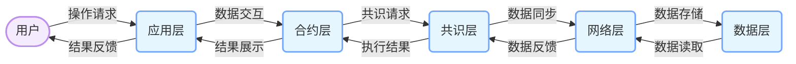

# 企业估值中的区块链跨境贸易金融平台评估

> 关键词：企业估值、区块链、跨境贸易金融平台、评估方法、应用场景

> 摘要：本文聚焦于企业估值中区块链跨境贸易金融平台的评估。在当今全球化经济背景下，区块链跨境贸易金融平台应运而生并逐渐发展。文章旨在深入剖析该平台的核心概念、核心算法原理、数学模型等，通过项目实战案例展示其具体实现过程，探讨其实际应用场景。同时，为读者推荐相关的学习资源、开发工具框架以及论文著作。最后对其未来发展趋势与挑战进行总结，并解答常见问题，为企业准确评估区块链跨境贸易金融平台价值提供全面的理论和实践指导。

## 1. 背景介绍 
### 1.1 目的和范围
随着全球经济一体化的加速，跨境贸易活动日益频繁。传统跨境贸易金融模式存在效率低下、信任成本高、信息不透明等问题。区块链技术凭借其去中心化、不可篡改、可追溯等特性，为跨境贸易金融带来了新的解决方案，催生了区块链跨境贸易金融平台。本文章的目的在于全面探讨在企业估值过程中如何对这类平台进行科学、合理的评估。范围涵盖区块链跨境贸易金融平台的核心概念、技术原理、数学模型、实际应用案例以及相关工具资源等方面。

### 1.2 预期读者
本文预期读者包括企业估值专业人员、区块链技术开发者、跨境贸易金融从业者、金融分析师、投资经理以及对区块链和跨境贸易金融感兴趣的研究人员。通过阅读本文，读者能够深入了解区块链跨境贸易金融平台的评估方法和要点，为实际工作和研究提供有价值的参考。

### 1.3 文档结构概述
本文将按照以下结构展开：首先介绍核心概念与联系，明确区块链跨境贸易金融平台的基本原理和架构；接着阐述核心算法原理和具体操作步骤，并结合 Python 源代码进行详细说明；然后讲解数学模型和公式，并举例说明；通过项目实战部分展示代码实际案例和详细解释；探讨实际应用场景；推荐相关的工具和资源；总结未来发展趋势与挑战；解答常见问题；最后提供扩展阅读和参考资料。

### 1.4 术语表
#### 1.4.1 核心术语定义
- **区块链（Blockchain）**：一种去中心化的分布式账本技术，由一个个数据块按照时间顺序链接而成，每个数据块包含一定时间内的交易信息，具有不可篡改、可追溯的特点。
- **跨境贸易金融（Cross - border Trade Finance）**：指在跨境贸易活动中，为贸易双方提供的资金融通、信用担保、风险管理等金融服务。
- **区块链跨境贸易金融平台（Blockchain - based Cross - border Trade Finance Platform）**：基于区块链技术构建的，为跨境贸易金融活动提供支持的数字化平台，实现贸易信息的共享、交易流程的自动化和金融服务的创新。

#### 1.4.2 相关概念解释
- **智能合约（Smart Contract）**：一种以计算机代码形式编写的合约，当满足预设条件时，能够自动执行合约条款。在区块链跨境贸易金融平台中，智能合约可用于自动处理贸易融资、结算等业务。
- **分布式账本（Distributed Ledger）**：一种在多个参与者之间共享、复制和同步的账本。区块链是分布式账本的一种典型实现，通过分布式账本，各参与方可以实时获取一致的交易信息。

#### 1.4.3 缩略词列表
- **CBDC（Central Bank Digital Currency）**：中央银行数字货币
- **AML（Anti - Money Laundering）**：反洗钱
- **KYC（Know Your Customer）**：了解你的客户

## 2. 核心概念与联系 

### 核心概念原理
区块链跨境贸易金融平台的核心原理是利用区块链的分布式账本、智能合约等技术，解决跨境贸易金融中的信任问题和效率问题。在传统跨境贸易金融中，贸易双方、银行、物流企业等参与方之间信息不共享，导致交易流程繁琐、信任成本高。而区块链跨境贸易金融平台通过将贸易信息、物流信息、金融信息等上链，实现信息的透明共享和不可篡改。

例如，在一笔跨境贸易中，出口商、进口商、银行和物流企业可以将各自掌握的信息记录在区块链上。当货物发货时，物流企业将发货信息上传至区块链，银行可以实时获取该信息，为出口商提供融资服务。同时，智能合约可以根据预设的条件自动执行，如当进口商收到货物并确认无误后，智能合约自动触发银行向出口商付款的操作。

### 架构的文本示意图
一个典型的区块链跨境贸易金融平台架构可以分为以下几个层次：

1. **数据层**：负责存储区块链上的交易数据和相关信息，包括贸易合同、发票、物流单据等。数据层采用分布式存储技术，确保数据的安全性和可靠性。
2. **网络层**：实现区块链节点之间的通信和数据传输。网络层采用 P2P（点对点）网络协议，确保节点之间的信息能够快速、准确地传播。
3. **共识层**：负责达成区块链节点之间的共识，确保所有节点对交易信息的一致性认可。常见的共识算法包括工作量证明（PoW）、权益证明（PoS）等。
4. **合约层**：包含智能合约代码，实现贸易融资、结算、担保等业务逻辑的自动化执行。智能合约由代码编写，部署在区块链上，当满足预设条件时自动触发执行。
5. **应用层**：为用户提供界面和服务，包括贸易双方、银行、物流企业等可以通过应用层接入平台，进行贸易信息的录入、查询、交易等操作。

### Mermaid 流程图


## 3. 核心算法原理 & 具体操作步骤 

### 核心算法原理
在区块链跨境贸易金融平台中，共识算法和智能合约算法是两个核心算法。

#### 共识算法（以 PoS 为例）
权益证明（PoS）算法是一种根据节点持有的代币数量和持有时间来确定记账权的共识算法。其基本原理是：节点持有的代币数量越多、持有时间越长，其获得记账权的概率就越大。

以下是一个简化的 PoS 算法的 Python 实现：
```python
import random

# 定义节点类
class Node:
    def __init__(self, address, stake):
        self.address = address
        self.stake = stake

    def get_stake(self):
        return self.stake

# 定义 PoS 共识算法类
class PoS:
    def __init__(self, nodes):
        self.nodes = nodes

    def select_validator(self):
        total_stake = sum([node.get_stake() for node in self.nodes])
        random_num = random.uniform(0, total_stake)
        current_stake = 0
        for node in self.nodes:
            current_stake += node.get_stake()
            if current_stake >= random_num:
                return node.address

# 创建节点
node1 = Node("Node1", 100)
node2 = Node("Node2", 200)
node3 = Node("Node3", 300)

# 创建 PoS 实例
pos = PoS([node1, node2, node3])

# 选择验证节点
validator = pos.select_validator()
print(f"Selected validator: {validator}")
```

#### 智能合约算法
智能合约算法主要涉及合约的编写、部署和执行。以一个简单的贸易融资智能合约为例，当出口商发货并上传物流信息后，银行根据合约条款为出口商提供融资。

以下是一个简化的贸易融资智能合约的 Python 实现（这里使用伪代码结合 Python 风格）：
```python
# 定义贸易融资智能合约类
class TradeFinanceContract:
    def __init__(self, exporter, importer, bank, financing_amount):
        self.exporter = exporter
        self.importer = importer
        self.bank = bank
        self.financing_amount = financing_amount
        self.shipped = False

    def ship_goods(self):
        self.shipped = True
        if self.shipped:
            self.bank.provide_financing(self.exporter, self.financing_amount)

    def receive_goods(self):
        if self.shipped:
            self.importer.pay(self.bank, self.financing_amount)

# 定义银行类
class Bank:
    def provide_financing(self, exporter, amount):
        print(f"Bank provides {amount} financing to {exporter}")

    def receive_payment(self, importer, amount):
        print(f"Bank receives {amount} payment from {importer}")

# 定义出口商类
class Exporter:
    def __init__(self, name):
        self.name = name

# 定义进口商类
class Importer:
    def __init__(self, name):
        self.name = name

    def pay(self, bank, amount):
        bank.receive_payment(self.name, amount)

# 创建实例
exporter = Exporter("Exporter1")
importer = Importer("Importer1")
bank = Bank()
contract = TradeFinanceContract(exporter.name, importer.name, bank, 10000)

# 出口商发货
contract.ship_goods()

# 进口商收货付款
contract.receive_goods()
```

### 具体操作步骤
1. **节点注册**：贸易双方、银行、物流企业等参与方作为节点加入区块链跨境贸易金融平台，进行身份验证和信息登记。
2. **信息上链**：参与方将贸易相关信息，如贸易合同、发票、物流单据等上传至区块链，确保信息的真实性和不可篡改。
3. **共识达成**：节点通过共识算法对新的交易信息进行验证和确认，达成共识后将交易记录添加到区块链上。
4. **智能合约执行**：根据预设的智能合约条件，当满足条件时自动触发合约执行，完成贸易融资、结算等业务操作。
5. **数据查询和审计**：参与方可以随时查询区块链上的交易信息，监管机构可以进行审计和监管。

## 4. 数学模型和公式 & 详细讲解 & 举例说明 

### 数学模型
在区块链跨境贸易金融平台评估中，可以采用现金流折现模型（DCF）和市场比较模型。

#### 现金流折现模型（DCF）
DCF 模型的基本思想是将平台未来产生的现金流按照一定的折现率折现到当前时刻，以评估平台的价值。其数学公式为：

$$V = \sum_{t = 1}^{n}\frac{CF_t}{(1 + r)^t}$$

其中，$V$ 表示平台的价值，$CF_t$ 表示第 $t$ 期的现金流，$r$ 表示折现率，$n$ 表示预测期数。

#### 市场比较模型
市场比较模型是通过比较类似平台的市场价值来评估目标平台的价值。其基本公式为：

$$V = P \times M$$

其中，$V$ 表示目标平台的价值，$P$ 表示可比平台的市场价格倍数（如市盈率、市销率等），$M$ 表示目标平台的相关指标（如净利润、销售收入等）。

### 详细讲解
#### 现金流折现模型（DCF）
在使用 DCF 模型评估区块链跨境贸易金融平台时，需要预测平台未来各期的现金流。现金流包括平台的收入和成本，收入主要来自于交易手续费、融资服务费等，成本包括技术研发成本、运营成本等。折现率的选择需要考虑市场风险、行业风险等因素，一般可以采用加权平均资本成本（WACC）。

#### 市场比较模型
市场比较模型的关键在于选择合适的可比平台和市场价格倍数。可比平台应与目标平台在业务模式、市场规模、发展阶段等方面具有相似性。市场价格倍数可以根据市场数据进行统计分析得到。

### 举例说明
#### 现金流折现模型（DCF）
假设某区块链跨境贸易金融平台预计未来 5 年的现金流分别为 100 万元、150 万元、200 万元、250 万元、300 万元，折现率为 10%。则该平台的价值为：

$$V=\frac{100}{(1 + 0.1)^1}+\frac{150}{(1 + 0.1)^2}+\frac{200}{(1 + 0.1)^3}+\frac{250}{(1 + 0.1)^4}+\frac{300}{(1 + 0.1)^5}$$

```python
import math

cash_flows = [100, 150, 200, 250, 300]
discount_rate = 0.1
value = 0
for t, cf in enumerate(cash_flows, start=1):
    value += cf / math.pow(1 + discount_rate, t)

print(f"Platform value: {value}万元")
```

#### 市场比较模型
假设市场上类似区块链跨境贸易金融平台的平均市销率为 5 倍，目标平台的年销售收入为 200 万元。则该平台的价值为：

$$V = 5\times200 = 1000$$（万元）

## 5. 项目实战：代码实际案例和详细解释说明 

### 5.1  开发环境搭建
#### 区块链平台选择
选择 Hyperledger Fabric 作为区块链平台，因为它是一个开源的企业级区块链框架，具有高性能、可扩展性和安全性等特点。

#### 开发语言和工具
使用 Python 作为开发语言，搭配 Docker 进行容器化部署，使用 VS Code 作为代码编辑器。

#### 环境搭建步骤
1. 安装 Docker 和 Docker Compose。
2. 下载 Hyperledger Fabric 源代码和示例项目。
3. 配置 Fabric 网络，启动节点和排序服务。
4. 安装 Python 开发环境和相关库，如 Fabric SDK for Python。

### 5.2  源代码详细实现和代码解读
以下是一个简单的 Hyperledger Fabric 智能合约的 Python 实现示例：

```python
from hfc.fabric import Client

# 创建 Fabric 客户端
cli = Client(net_profile="connection.json")

# 获取组织和用户
org1_admin = cli.get_user(org_name='org1.example.com', name='Admin')

# 获取通道
channel = cli.get_channel('mychannel')

# 定义智能合约名称
chaincode_name = 'tradefinance'

# 调用智能合约的查询方法
response = channel.query_by_chaincode(
    requestor=org1_admin,
    chaincode_name=chaincode_name,
    fcn='queryTrade',
    args=['trade1']
)

# 打印查询结果
print(f"Query result: {response}")
```

#### 代码解读
1. **创建 Fabric 客户端**：使用 `Client` 类创建一个 Fabric 客户端实例，通过 `net_profile` 参数指定网络配置文件。
2. **获取组织和用户**：使用 `get_user` 方法获取指定组织和用户的身份信息。
3. **获取通道**：使用 `get_channel` 方法获取指定通道的实例。
4. **定义智能合约名称**：指定要调用的智能合约名称。
5. **调用智能合约的查询方法**：使用 `query_by_chaincode` 方法调用智能合约的查询方法，传入请求者、智能合约名称、函数名和参数。
6. **打印查询结果**：将查询结果打印输出。

### 5.3  代码解读与分析
上述代码实现了一个简单的 Hyperledger Fabric 智能合约查询操作。通过 Fabric SDK for Python，我们可以方便地与 Fabric 网络进行交互，调用智能合约的方法。在实际项目中，还需要实现更多的业务逻辑，如智能合约的部署、交易的提交等。

## 6. 实际应用场景 
### 贸易融资
在跨境贸易中，出口商往往需要在发货后等待一段时间才能收到货款，这会占用大量的资金。区块链跨境贸易金融平台可以通过智能合约实现贸易融资的自动化。出口商将发货信息上传至平台后，银行可以根据智能合约的条款为出口商提供融资，提高资金周转效率。

### 供应链金融
区块链跨境贸易金融平台可以将供应链上的各个环节连接起来，实现供应链金融的创新。例如，核心企业可以将应付账款信息上链，供应商可以凭借这些信息在平台上进行融资。同时，平台可以实时监控供应链上的物流和资金流信息，降低供应链金融的风险。

### 跨境支付结算
传统跨境支付结算存在手续费高、结算周期长等问题。区块链跨境贸易金融平台可以通过数字货币或稳定币实现跨境支付结算的快速、低成本。交易双方可以在平台上直接进行支付结算，无需通过中间银行，提高支付效率。

### 贸易监管
监管机构可以通过区块链跨境贸易金融平台实时获取贸易信息，加强对跨境贸易的监管。平台上的交易信息不可篡改、可追溯，有助于监管机构打击洗钱、逃税等违法犯罪行为。

## 7. 工具和资源推荐
### 7.1 学习资源推荐
#### 7.1.1 书籍推荐
- 《区块链：技术驱动金融》：本书介绍了区块链技术的基本原理和应用场景，是学习区块链的经典书籍。
- 《Hyperledger Fabric实战》：详细介绍了 Hyperledger Fabric 区块链平台的开发和应用，适合有一定编程基础的读者。
- 《跨境贸易金融实务》：全面介绍了跨境贸易金融的业务流程和操作方法，对于理解区块链跨境贸易金融平台的业务背景有很大帮助。

#### 7.1.2 在线课程
- Coursera 上的“区块链基础”课程：由知名高校教授授课，系统介绍了区块链的基本概念、技术原理和应用案例。
- edX 上的“Hyperledger Fabric 开发”课程：深入讲解了 Hyperledger Fabric 平台的开发和部署，提供了实践项目和代码示例。
- 网易云课堂上的“跨境贸易金融课程”：结合实际案例，介绍了跨境贸易金融的业务流程和风险管理。

#### 7.1.3 技术博客和网站
- 区块链中文社区：提供了丰富的区块链技术文章和教程，涵盖了区块链的各个领域。
- Hyperledger 官方博客：发布了 Hyperledger 项目的最新动态和技术文章，对于了解 Hyperledger Fabric 平台有很大帮助。
- 中国贸易金融网：提供了跨境贸易金融的行业资讯和政策解读，有助于了解跨境贸易金融的市场动态。

### 7.2 开发工具框架推荐
#### 7.2.1 IDE和编辑器
- Visual Studio Code：一款轻量级的代码编辑器，支持多种编程语言和插件扩展，适合开发区块链应用。
- IntelliJ IDEA：功能强大的 Java 开发 IDE，对于开发基于 Java 的区块链项目非常方便。
- PyCharm：专业的 Python 开发 IDE，提供了丰富的代码调试和分析工具，适合开发 Python 编写的区块链智能合约。

#### 7.2.2 调试和性能分析工具
- Ganache：以太坊的本地开发和测试工具，提供了一个模拟的以太坊区块链环境，方便开发和调试智能合约。
- Hyperledger Caliper：用于测试 Hyperledger Fabric 网络的性能和吞吐量，提供了详细的测试报告和分析结果。
- Prometheus 和 Grafana：用于监控区块链网络的性能指标，如节点状态、交易吞吐量等，通过可视化界面展示监控数据。

#### 7.2.3 相关框架和库
- Fabric SDK for Python：Hyperledger Fabric 官方提供的 Python 开发 SDK，方便开发者与 Fabric 网络进行交互。
- Web3.py：以太坊的 Python 开发库，用于开发以太坊智能合约和 DApp。
- Truffle：以太坊的开发框架，提供了智能合约的编译、部署和测试等功能，提高开发效率。

### 7.3 相关论文著作推荐
#### 7.3.1 经典论文
- “Bitcoin: A Peer - to - Peer Electronic Cash System”：比特币的白皮书，介绍了比特币的基本原理和实现方法，是区块链技术的开山之作。
- “Ethereum: A Next - Generation Smart Contract and Decentralized Application Platform”：以太坊的白皮书，提出了智能合约和去中心化应用的概念，推动了区块链技术的发展。
- “Hyperledger Fabric: A Distributed Operating System for Permissioned Blockchains”：介绍了 Hyperledger Fabric 平台的架构和设计理念，对于理解企业级区块链平台有重要意义。

#### 7.3.2 最新研究成果
- 关注 IEEE、ACM 等学术会议和期刊上发表的关于区块链和跨境贸易金融的最新研究论文，了解行业的前沿技术和发展趋势。
- 一些知名高校和研究机构的研究报告，如麻省理工学院、斯坦福大学等的区块链研究成果。

#### 7.3.3 应用案例分析
- 分析国内外知名企业在区块链跨境贸易金融领域的应用案例，如马士基、IBM 等公司的区块链跨境贸易项目，学习其成功经验和实践方法。

## 8. 总结：未来发展趋势与挑战
### 未来发展趋势
#### 与物联网、大数据等技术融合
区块链跨境贸易金融平台将与物联网、大数据等技术深度融合，实现贸易信息的全面数字化和智能化。物联网设备可以实时采集货物的运输状态、位置信息等，并上传至区块链平台，为贸易融资和风险管理提供更准确的数据支持。大数据分析可以对区块链上的交易数据进行挖掘和分析，发现潜在的商业机会和风险。

#### 央行数字货币的应用
随着央行数字货币（CBDC）的逐渐推广，区块链跨境贸易金融平台将支持 CBDC 的使用。CBDC 具有交易速度快、成本低、安全性高等优点，可以提高跨境支付结算的效率和便利性，推动跨境贸易的发展。

#### 跨链技术的发展
为了实现不同区块链平台之间的互联互通，跨链技术将得到进一步发展。区块链跨境贸易金融平台可以通过跨链技术与其他区块链平台进行数据交互和业务协同，扩大平台的应用范围和影响力。

### 挑战
#### 法律法规和监管政策
区块链跨境贸易金融涉及多个国家和地区的法律法规和监管政策，不同国家和地区的政策差异较大。如何在合规的前提下开展业务，是区块链跨境贸易金融平台面临的重要挑战。

#### 技术安全性
区块链技术虽然具有一定的安全性，但仍然存在一些安全隐患，如智能合约漏洞、节点攻击等。保障区块链跨境贸易金融平台的技术安全性，防止数据泄露和交易风险，是平台建设和运营的关键。

#### 市场接受度
区块链跨境贸易金融平台是一种新兴的业务模式，市场对其认知度和接受度还相对较低。如何提高市场接受度，吸引更多的贸易企业、金融机构等参与平台，是平台推广和发展的难点。

## 9. 附录：常见问题与解答
### 区块链跨境贸易金融平台如何保证数据的真实性？
区块链跨境贸易金融平台通过区块链的不可篡改和可追溯特性保证数据的真实性。数据一旦上链，就无法被篡改，并且可以追溯到数据的源头。同时，平台可以采用多节点验证和共识机制，确保数据在上传和传输过程中的准确性和一致性。

### 智能合约在区块链跨境贸易金融平台中有哪些应用场景？
智能合约在区块链跨境贸易金融平台中有很多应用场景，如贸易融资、结算、担保等。例如，在贸易融资场景中，智能合约可以根据预设的条件自动触发银行向出口商提供融资的操作；在结算场景中，当进口商收到货物并确认无误后，智能合约可以自动执行付款操作。

### 如何评估区块链跨境贸易金融平台的价值？
可以采用现金流折现模型（DCF）和市场比较模型等方法评估区块链跨境贸易金融平台的价值。DCF 模型通过预测平台未来的现金流并折现到当前时刻来评估价值；市场比较模型通过比较类似平台的市场价值来评估目标平台的价值。

### 区块链跨境贸易金融平台与传统跨境贸易金融模式有哪些区别？
区块链跨境贸易金融平台与传统跨境贸易金融模式相比，具有以下区别：
- **信息透明度高**：区块链平台实现了贸易信息的共享和透明，各参与方可以实时获取一致的信息。
- **信任成本低**：区块链的不可篡改和可追溯特性降低了信任成本，减少了中介机构的参与。
- **效率高**：智能合约的自动化执行提高了交易流程的效率，缩短了交易周期。
- **安全性强**：区块链技术保障了数据的安全性和可靠性，降低了交易风险。

## 10. 扩展阅读 & 参考资料
- 《区块链技术指南》，作者：邹均、高承实等
- 《金融科技：重构未来金融生态》，作者：谢平、邹传伟等
- 国际清算银行（BIS）关于区块链和跨境支付的研究报告
- 世界贸易组织（WTO）关于跨境贸易数字化的相关文件

作者：AI天才研究院/AI Genius Institute & 禅与计算机程序设计艺术 /Zen And The Art of Computer Programming