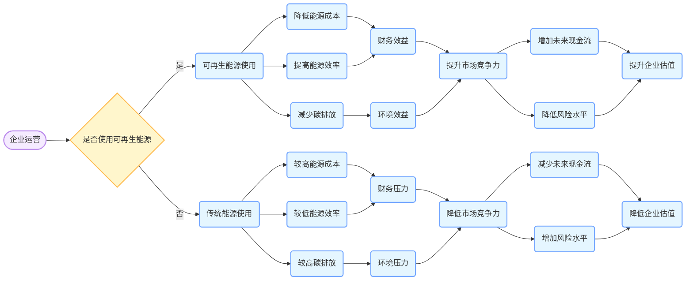

# 企业估值中的可再生能源使用分析

> 关键词：企业估值、可再生能源使用、能源转型、财务评估、环境效益

> 摘要：本文聚焦于企业估值中可再生能源使用的分析。随着全球对可持续发展的关注日益增强，可再生能源的使用在企业运营中扮演着愈发重要的角色。文章首先介绍了相关背景，包括研究目的、预期读者等。接着阐述了核心概念及联系，分析了核心算法原理与操作步骤，并给出了相关数学模型和公式。通过项目实战案例，详细展示了如何在企业估值中纳入可再生能源使用的考量。探讨了实际应用场景，推荐了学习资源、开发工具框架和相关论文著作。最后总结了未来发展趋势与挑战，为企业在可再生能源转型过程中的估值提供全面的分析和指导。

## 1. 背景介绍 
### 1.1 目的和范围
随着全球气候变化问题的加剧和对可持续发展的追求，可再生能源在企业运营中的应用越来越受到关注。企业使用可再生能源不仅有助于减少碳排放，实现环境目标，还可能对企业的财务状况和市场价值产生重要影响。本研究的目的是深入分析企业估值中可再生能源使用的相关因素，探讨如何将可再生能源的使用纳入企业估值模型，为投资者、企业管理者和相关决策者提供科学的评估方法和决策依据。

本研究的范围涵盖了各种类型的企业，包括制造业、服务业、能源行业等，重点关注可再生能源使用对企业成本、收益、风险和市场竞争力的影响。同时，考虑到不同地区的能源政策、市场环境和资源条件的差异，研究也会涉及到区域因素对企业可再生能源使用和估值的影响。

### 1.2 预期读者
本文的预期读者主要包括以下几类：
1. **投资者**：包括股票投资者、风险投资者、私募股权投资者等，他们希望通过了解企业可再生能源使用情况，评估企业的长期发展潜力和投资价值。
2. **企业管理者**：企业的高层管理人员、财务经理和战略规划人员，他们需要在企业决策中考虑可再生能源的使用，以提高企业的竞争力和可持续发展能力。
3. **金融机构**：银行、证券公司、评级机构等金融机构，他们在为企业提供融资、评级和投资建议时，需要考虑企业可再生能源使用对其信用风险和市场价值的影响。
4. **政策制定者**：政府部门的政策制定者和监管人员，他们需要了解企业可再生能源使用的现状和趋势，制定相关的能源政策和法规，推动企业的能源转型和可持续发展。
5. **研究人员**：学术界和研究机构的研究人员，他们对企业估值、可再生能源经济和可持续发展等领域感兴趣，希望通过本文获取相关的研究资料和分析方法。

### 1.3 文档结构概述
本文将按照以下结构进行组织：
1. **背景介绍**：介绍研究的目的、范围、预期读者和文档结构，为后续的分析奠定基础。
2. **核心概念与联系**：阐述企业估值、可再生能源使用等核心概念，分析它们之间的相互关系，并通过文本示意图和 Mermaid 流程图进行直观展示。
3. **核心算法原理 & 具体操作步骤**：介绍在企业估值中纳入可再生能源使用因素的核心算法原理，并给出具体的操作步骤，同时使用 Python 源代码进行详细阐述。
4. **数学模型和公式 & 详细讲解 & 举例说明**：建立数学模型和公式，对企业估值中可再生能源使用的影响进行量化分析，并通过具体的例子进行说明。
5. **项目实战：代码实际案例和详细解释说明**：通过一个实际的项目案例，展示如何在企业估值中应用可再生能源使用的分析方法，包括开发环境搭建、源代码实现和代码解读。
6. **实际应用场景**：探讨企业估值中可再生能源使用分析在不同场景下的应用，如投资决策、企业战略规划、政策制定等。
7. **工具和资源推荐**：推荐相关的学习资源、开发工具框架和论文著作，帮助读者进一步深入学习和研究。
8. **总结：未来发展趋势与挑战**：总结本文的主要内容，分析企业估值中可再生能源使用的未来发展趋势和面临的挑战。
9. **附录：常见问题与解答**：解答读者在阅读本文过程中可能遇到的常见问题。
10. **扩展阅读 & 参考资料**：提供相关的扩展阅读材料和参考资料，方便读者进一步深入研究。

### 1.4 术语表
#### 1.4.1 核心术语定义
1. **企业估值**：指对企业的价值进行评估，通常采用多种方法，如市场法、收益法、成本法等，以确定企业在特定时间点的市场价值。
2. **可再生能源**：指在自然界中可以不断再生、永续利用的能源，包括太阳能、风能、水能、生物能等。
3. **能源转型**：指从传统的化石能源向可再生能源的转变过程，包括能源生产、消费和管理等方面的变革。
4. **环境效益**：指企业使用可再生能源所带来的环境改善效果，如减少碳排放、降低空气污染等。
5. **财务效益**：指企业使用可再生能源所带来的经济效益，如降低能源成本、提高能源效率等。

#### 1.4.2 相关概念解释
1. **能源强度**：指单位产值所消耗的能源量，是衡量企业能源利用效率的重要指标。
2. **碳足迹**：指企业在生产、经营和消费过程中所产生的二氧化碳排放量，是衡量企业碳排放水平的重要指标。
3. **可再生能源渗透率**：指可再生能源在企业能源消费中所占的比例，是衡量企业可再生能源使用程度的重要指标。
4. **绿色溢价**：指使用可再生能源相对于传统化石能源所增加的成本，是影响企业可再生能源使用决策的重要因素之一。

#### 1.4.3 缩略词列表
1. **NPV**：净现值（Net Present Value）
2. **IRR**：内部收益率（Internal Rate of Return）
3. **LCOE**：平准化能源成本（Levelized Cost of Energy）
4. **GHG**：温室气体（Greenhouse Gas）
5. **PV**：光伏发电（Photovoltaic）

## 2. 核心概念与联系 

### 核心概念原理
#### 企业估值原理
企业估值是评估企业市场价值的过程，其核心原理是基于企业未来的预期现金流和风险水平。常见的估值方法包括市场法、收益法和成本法。市场法是通过比较类似企业的市场交易价格来确定目标企业的价值；收益法是通过预测企业未来的现金流，并将其折现到当前时点来计算企业的价值；成本法是通过评估企业的资产价值和负债情况来确定企业的价值。

#### 可再生能源使用原理
可再生能源使用是指企业采用太阳能、风能、水能等可再生能源来满足其能源需求的过程。可再生能源的使用原理基于其可再生性和清洁性，通过将自然能源转化为电能或其他形式的能源，实现能源的可持续供应和环境的保护。

### 架构的文本示意图
企业估值与可再生能源使用之间的关系可以用以下文本示意图表示：

企业估值受到多个因素的影响，包括企业的财务状况、市场竞争力、行业前景等。可再生能源使用作为企业运营的一个重要方面，通过影响企业的成本、收益、风险和市场形象等因素，进而对企业估值产生影响。具体来说，可再生能源使用可以降低企业的能源成本，提高能源效率，减少碳排放，从而带来环境效益和财务效益。这些效益可以提高企业的市场竞争力，增加企业的未来现金流，降低企业的风险水平，最终提升企业的估值。

### Mermaid 流程图


该流程图展示了企业运营中使用可再生能源和传统能源对企业估值的不同影响。使用可再生能源可以带来一系列的效益，从而提升企业估值；而使用传统能源则可能带来财务和环境压力，降低企业估值。

## 3. 核心算法原理 & 具体操作步骤 

### 核心算法原理
在企业估值中纳入可再生能源使用因素的核心算法原理是基于收益法，通过预测企业使用可再生能源后的未来现金流，并将其折现到当前时点来计算企业的价值。具体来说，该算法考虑了可再生能源使用对企业成本、收益和风险的影响，通过调整现金流预测和折现率来反映这些影响。

### 具体操作步骤
1. **数据收集**：收集企业的财务数据、能源使用数据、可再生能源项目的相关数据等，包括能源成本、能源消耗、可再生能源投资成本、补贴政策等。
2. **现金流预测**：根据收集到的数据，预测企业使用可再生能源后的未来现金流。具体步骤如下：
    - **成本预测**：分析可再生能源使用对企业能源成本的影响，预测未来能源成本的变化。同时，考虑可再生能源项目的投资成本、运营成本和维护成本等。
    - **收益预测**：评估可再生能源使用对企业收益的影响，如通过出售多余的可再生能源电力获得的收益、因环境效益提升而带来的市场份额增加等。
    - **风险评估**：分析可再生能源使用带来的风险，如技术风险、政策风险、市场风险等，并对现金流进行风险调整。
3. **折现率确定**：确定合适的折现率，将未来现金流折现到当前时点。折现率应考虑企业的风险水平、市场利率、行业平均收益率等因素。
4. **企业估值计算**：根据预测的现金流和确定的折现率，计算企业的净现值（NPV）或其他估值指标。

### Python 源代码详细阐述
```python
import numpy as np

# 数据收集
# 假设以下数据为示例数据
# 传统能源成本（每年）
traditional_energy_cost = [100000, 105000, 110000, 115000, 120000]
# 可再生能源投资成本
renewable_energy_investment = 500000
# 可再生能源运营成本（每年）
renewable_energy_operating_cost = [20000, 21000, 22000, 23000, 24000]
# 可再生能源收益（每年）
renewable_energy_income = [30000, 32000, 34000, 36000, 38000]
# 折现率
discount_rate = 0.1

# 现金流预测
# 计算使用可再生能源后的每年现金流
cash_flows = []
for i in range(len(traditional_energy_cost)):
    # 传统能源成本节省
    cost_saving = traditional_energy_cost[i] - renewable_energy_operating_cost[i]
    # 可再生能源收益
    income = renewable_energy_income[i]
    # 第 0 年有投资成本
    if i == 0:
        cash_flow = -renewable_energy_investment + cost_saving + income
    else:
        cash_flow = cost_saving + income
    cash_flows.append(cash_flow)

# 企业估值计算
npv = np.npv(discount_rate, cash_flows)

print(f"企业使用可再生能源后的净现值（NPV）为: {npv}")
```

在上述代码中，我们首先定义了相关的数据，包括传统能源成本、可再生能源投资成本、运营成本和收益等。然后，通过循环计算使用可再生能源后的每年现金流。最后，使用 `np.npv` 函数计算企业的净现值。

## 4. 数学模型和公式 & 详细讲解 & 举例说明 

### 数学模型和公式
#### 净现值（NPV）模型
净现值是评估投资项目价值的常用指标，其公式为：

$$NPV = \sum_{t=0}^{n} \frac{CF_t}{(1 + r)^t}$$

其中，$NPV$ 表示净现值，$CF_t$ 表示第 $t$ 期的现金流，$r$ 表示折现率，$n$ 表示项目的寿命期。

#### 内部收益率（IRR）模型
内部收益率是使项目净现值为零的折现率，其公式为：

$$\sum_{t=0}^{n} \frac{CF_t}{(1 + IRR)^t} = 0$$

其中，$IRR$ 表示内部收益率。

### 详细讲解
#### 净现值（NPV）
净现值是将项目未来的现金流折现到当前时点的总和。如果 $NPV > 0$，表示项目的投资回报率高于折现率，项目具有投资价值；如果 $NPV < 0$，表示项目的投资回报率低于折现率，项目不具有投资价值；如果 $NPV = 0$，表示项目的投资回报率等于折现率，项目的投资收益刚好能够覆盖成本。

#### 内部收益率（IRR）
内部收益率是项目的实际投资回报率。当 $IRR$ 大于企业的资本成本时，项目具有投资价值；当 $IRR$ 小于企业的资本成本时，项目不具有投资价值。

### 举例说明
假设某企业考虑投资一个太阳能光伏发电项目，项目的寿命期为 5 年，初始投资成本为 50 万元，每年的运营成本为 2 万元，每年的发电收益为 3 万元。同时，该企业使用传统能源每年的成本为 10 万元。折现率为 10%。

#### 计算现金流
- 第 0 年：现金流 $CF_0 = -50 + (10 - 2) + 3 = -39$（万元）
- 第 1 年：现金流 $CF_1 = (10 - 2) + 3 = 11$（万元）
- 第 2 年：现金流 $CF_2 = (10 - 2) + 3 = 11$（万元）
- 第 3 年：现金流 $CF_3 = (10 - 2) + 3 = 11$（万元）
- 第 4 年：现金流 $CF_4 = (10 - 2) + 3 = 11$（万元）
- 第 5 年：现金流 $CF_5 = (10 - 2) + 3 = 11$（万元）

#### 计算净现值（NPV）
$$NPV = -39 + \frac{11}{(1 + 0.1)^1} + \frac{11}{(1 + 0.1)^2} + \frac{11}{(1 + 0.1)^3} + \frac{11}{(1 + 0.1)^4} + \frac{11}{(1 + 0.1)^5}$$

使用 Python 代码计算：
```python
import numpy as np

cash_flows = [-39, 11, 11, 11, 11, 11]
discount_rate = 0.1
npv = np.npv(discount_rate, cash_flows)
print(f"净现值（NPV）为: {npv}")
```

#### 计算内部收益率（IRR）
使用 Python 代码计算：
```python
irr = np.irr(cash_flows)
print(f"内部收益率（IRR）为: {irr}")
```

通过计算净现值和内部收益率，我们可以评估该太阳能光伏发电项目的投资价值。

## 5. 项目实战：代码实际案例和详细解释说明 

### 5.1  开发环境搭建
#### 安装 Python
首先，确保你已经安装了 Python。可以从 Python 官方网站（https://www.python.org/downloads/）下载适合你操作系统的 Python 版本，并按照安装向导进行安装。

#### 安装必要的库
本项目需要使用 `numpy` 库进行数值计算。可以使用以下命令安装 `numpy`：
```sh
pip install numpy
```

### 5.2  源代码详细实现和代码解读
```python
import numpy as np

# 数据输入
# 传统能源成本（每年）
traditional_energy_costs = [120000, 125000, 130000, 135000, 140000]
# 可再生能源投资成本
renewable_energy_investment = 600000
# 可再生能源运营成本（每年）
renewable_energy_operating_costs = [25000, 26000, 27000, 28000, 29000]
# 可再生能源收益（每年）
renewable_energy_incomes = [35000, 37000, 39000, 41000, 43000]
# 折现率
discount_rate = 0.12

# 计算使用可再生能源后的每年现金流
cash_flows = []
for i in range(len(traditional_energy_costs)):
    # 传统能源成本节省
    cost_saving = traditional_energy_costs[i] - renewable_energy_operating_costs[i]
    # 可再生能源收益
    income = renewable_energy_incomes[i]
    # 第 0 年有投资成本
    if i == 0:
        cash_flow = -renewable_energy_investment + cost_saving + income
    else:
        cash_flow = cost_saving + income
    cash_flows.append(cash_flow)

# 计算净现值（NPV）
npv = np.npv(discount_rate, cash_flows)

# 计算内部收益率（IRR）
irr = np.irr(cash_flows)

# 输出结果
print(f"使用可再生能源后的每年现金流: {cash_flows}")
print(f"净现值（NPV）: {npv}")
print(f"内部收益率（IRR）: {irr}")
```

### 5.3  代码解读与分析
#### 数据输入部分
代码首先定义了一系列的数据，包括传统能源成本、可再生能源投资成本、运营成本、收益和折现率。这些数据是进行现金流预测和企业估值的基础。

#### 现金流计算部分
通过循环遍历每年的传统能源成本、可再生能源运营成本和收益，计算使用可再生能源后的每年现金流。在第 0 年，需要减去可再生能源的投资成本。

#### 估值计算部分
使用 `np.npv` 函数计算净现值，使用 `np.irr` 函数计算内部收益率。净现值和内部收益率是评估项目投资价值的重要指标。

#### 结果输出部分
最后，代码输出了使用可再生能源后的每年现金流、净现值和内部收益率，方便用户进行分析和决策。

## 6. 实际应用场景 
### 投资决策
在投资决策中，投资者可以通过分析企业的可再生能源使用情况，评估企业的长期发展潜力和投资价值。如果企业积极采用可再生能源，能够降低能源成本，提高能源效率，减少碳排放，那么该企业在未来可能具有更强的市场竞争力和可持续发展能力，从而更值得投资。例如，一些清洁能源企业在过去几年中受到了投资者的青睐，其股价也随之上涨。

### 企业战略规划
企业管理者在制定战略规划时，需要考虑可再生能源的使用。通过使用可再生能源，企业可以降低能源成本，提高能源供应的稳定性，减少对传统化石能源的依赖，从而增强企业的抗风险能力。同时，企业使用可再生能源还可以提升企业的品牌形象，满足消费者对环保产品和服务的需求，从而扩大市场份额。例如，一些大型企业已经制定了可再生能源使用目标，并逐步实施相关的能源转型计划。

### 政策制定
政府部门在制定能源政策和法规时，需要考虑企业可再生能源使用的现状和趋势。通过制定相关的政策和法规，如补贴政策、税收优惠政策、碳排放配额制度等，可以鼓励企业增加可再生能源的使用，推动能源转型和可持续发展。例如，许多国家和地区都出台了可再生能源补贴政策，促进了太阳能、风能等可再生能源的发展。

### 风险管理
金融机构在为企业提供融资和风险管理服务时，需要考虑企业可再生能源使用对其信用风险和市场价值的影响。如果企业的可再生能源使用比例较低，面临着较高的能源成本和碳排放风险，那么金融机构可能会提高其融资成本或减少其融资额度。相反，如果企业积极采用可再生能源，具有较低的能源成本和碳排放风险，那么金融机构可能会给予其更优惠的融资条件。

## 7. 工具和资源推荐
### 7.1 学习资源推荐
#### 7.1.1 书籍推荐
1. 《可再生能源经济学》：本书系统介绍了可再生能源的经济原理、市场机制和政策分析，为读者提供了全面的可再生能源经济知识。
2. 《企业估值：理论与实践》：详细阐述了企业估值的各种方法和模型，包括市场法、收益法、成本法等，并结合实际案例进行分析。
3. 《可持续发展与企业战略》：探讨了企业在可持续发展背景下的战略选择和实践经验，包括可再生能源使用、社会责任等方面。

#### 7.1.2 在线课程
1. Coursera 上的“可再生能源技术与政策”课程：由知名高校的教授授课，介绍了可再生能源的技术原理、市场发展和政策环境。
2. edX 上的“企业估值与投资分析”课程：提供了企业估值的理论和方法，以及实际案例分析。
3. Udemy 上的“可持续发展与企业创新”课程：讲解了企业在可持续发展方面的创新实践和战略规划。

#### 7.1.3 技术博客和网站
1. Renewable Energy World：提供了可再生能源行业的最新新闻、技术动态和市场分析。
2. BloombergNEF：专注于能源转型和可持续发展领域的研究和分析，提供了大量的数据和报告。
3. McKinsey & Company：全球知名的管理咨询公司，其网站上有关于企业战略、可持续发展等方面的研究报告和文章。

### 7.2 开发工具框架推荐
#### 7.2.1 IDE和编辑器
1. PyCharm：一款专业的 Python 集成开发环境，具有强大的代码编辑、调试和分析功能。
2. Jupyter Notebook：一种交互式的开发环境，适合进行数据分析和模型验证。
3. Visual Studio Code：一款轻量级的代码编辑器，支持多种编程语言，具有丰富的插件生态系统。

#### 7.2.2 调试和性能分析工具
1. pdb：Python 内置的调试工具，可以帮助开发者定位代码中的错误。
2. cProfile：Python 标准库中的性能分析工具，可以分析代码的运行时间和函数调用情况。
3. Numba：一个用于加速 Python 代码的即时编译器，可以显著提高数值计算的性能。

#### 7.2.3 相关框架和库
1. numpy：用于数值计算和科学计算的基础库，提供了高效的数组操作和数学函数。
2. pandas：用于数据处理和分析的库，提供了灵活的数据结构和数据操作方法。
3. scikit-learn：用于机器学习和数据分析的库，提供了丰富的算法和工具。

### 7.3 相关论文著作推荐
#### 7.3.1 经典论文
1. “The Economics of Renewable Energy”：该论文系统分析了可再生能源的经济特性和市场机制，对可再生能源的发展和政策制定具有重要的指导意义。
2. “Valuation of Renewable Energy Projects: A Real Options Approach”：提出了使用实物期权方法对可再生能源项目进行估值的思路和方法，为可再生能源项目的投资决策提供了新的视角。
3. “Corporate Social Responsibility and Firm Value: The Role of Renewable Energy Use”：研究了企业社会责任和可再生能源使用对企业价值的影响，发现企业积极采用可再生能源可以提升企业的市场价值。

#### 7.3.2 最新研究成果
1. “Renewable Energy and Corporate Financial Performance: Evidence from the S&P 500”：通过对美国 S&P 500 指数成分股的实证研究，分析了可再生能源使用对企业财务绩效的影响。
2. “The Impact of Renewable Energy Policies on Firm Valuation: A Cross - Country Analysis”：进行了跨国分析，探讨了不同国家的可再生能源政策对企业估值的影响。
3. “Sustainable Energy Transition and Corporate Valuation: A Dynamic Perspective”：从动态的角度研究了可持续能源转型过程中企业估值的变化规律。

#### 7.3.3 应用案例分析
1. “Case Study: Valuation of a Solar Power Project in a Developing Country”：以一个发展中国家的太阳能发电项目为例，详细介绍了可再生能源项目的估值方法和过程。
2. “How a Manufacturing Company Improved Its Valuation through Renewable Energy Adoption”：分析了一家制造企业通过采用可再生能源提高企业估值的实际案例，总结了其成功经验和启示。
3. “Renewable Energy Integration in the Energy Sector: A Case Study of a Utility Company”：研究了一家公用事业公司在能源转型过程中可再生能源集成的案例，探讨了其对企业估值和市场竞争力的影响。

## 8. 总结：未来发展趋势与挑战
### 未来发展趋势
#### 可再生能源使用比例持续提高
随着技术的不断进步和成本的不断降低，可再生能源的竞争力将不断增强，企业使用可再生能源的比例将持续提高。越来越多的企业将把可再生能源作为主要的能源供应来源，以降低能源成本，减少碳排放，实现可持续发展。

#### 可再生能源与企业数字化融合加速
随着数字化技术的发展，可再生能源与企业数字化的融合将加速。企业可以通过物联网、大数据、人工智能等技术，实现对可再生能源系统的智能化管理和优化，提高能源利用效率，降低运营成本。例如，智能电网技术可以实现可再生能源的高效分配和存储，提高能源供应的稳定性和可靠性。

#### 企业估值中可再生能源因素的权重增加
投资者和市场对企业的可持续发展能力越来越关注，可再生能源使用将成为评估企业价值的重要因素之一。在未来的企业估值中，可再生能源因素的权重将不断增加，企业的可再生能源使用情况将直接影响其市场价值和融资能力。

### 挑战
#### 技术挑战
虽然可再生能源技术取得了很大的进步，但仍然面临一些技术挑战。例如，太阳能光伏发电的效率有待提高，风能发电的稳定性需要进一步增强，储能技术的成本仍然较高等。这些技术挑战限制了可再生能源的大规模应用和发展。

#### 政策不确定性
可再生能源的发展在很大程度上依赖于政府的政策支持。然而，政策的不确定性给企业的可再生能源投资带来了风险。例如，补贴政策的调整、碳排放配额制度的变化等，都可能影响企业的投资决策和经济效益。

#### 成本压力
尽管可再生能源的成本在不断降低，但与传统化石能源相比，仍然存在一定的成本差距。对于一些资金实力较弱的企业来说，投资可再生能源项目可能面临较大的成本压力。此外，可再生能源项目的建设和运营需要专业的技术和管理人才，人才短缺也可能增加企业的成本。

## 9. 附录：常见问题与解答
### 1. 企业使用可再生能源一定会提高企业估值吗？
不一定。企业使用可再生能源对企业估值的影响取决于多个因素，如可再生能源项目的投资成本、运营成本、收益情况、市场环境等。如果可再生能源项目的投资成本过高，而收益不足以覆盖成本，那么可能会降低企业的盈利能力和估值。此外，如果市场对企业的可再生能源使用情况不认可，也可能不会对企业估值产生积极影响。

### 2. 如何评估可再生能源项目的风险？
评估可再生能源项目的风险可以从以下几个方面入手：
- **技术风险**：分析可再生能源技术的成熟度、可靠性和发展前景，评估技术故障和性能下降的可能性。
- **政策风险**：关注政府的能源政策和法规的变化，评估政策调整对项目收益和成本的影响。
- **市场风险**：研究可再生能源市场的供需情况、价格波动和竞争态势，评估市场变化对项目收益的影响。
- **自然风险**：考虑自然灾害、气候变化等自然因素对可再生能源项目的影响，如太阳能光伏发电项目可能受到阴雨天气的影响，风能发电项目可能受到风速不稳定的影响。

### 3. 企业在选择可再生能源时应考虑哪些因素？
企业在选择可再生能源时应考虑以下因素：
- **资源可用性**：评估当地的可再生能源资源状况，如太阳能辐射强度、风能资源丰富程度、水能资源储量等，选择适合当地资源条件的可再生能源类型。
- **成本效益**：比较不同可再生能源项目的投资成本、运营成本和收益情况，选择成本效益最高的项目。
- **技术可行性**：考虑可再生能源技术的成熟度和可靠性，确保项目能够顺利实施和运行。
- **政策支持**：了解政府的可再生能源政策和法规，选择能够获得政策支持的项目，如补贴政策、税收优惠政策等。
- **企业需求**：根据企业的能源需求和生产特点，选择能够满足企业需求的可再生能源项目。

### 4. 如何将可再生能源使用纳入企业的战略规划？
将可再生能源使用纳入企业的战略规划可以从以下几个方面入手：
- **设定目标**：明确企业在可再生能源使用方面的目标，如可再生能源使用比例、碳排放减少目标等。
- **评估现状**：评估企业当前的能源使用情况和可再生能源资源条件，分析企业在可再生能源使用方面的优势和劣势。
- **制定计划**：根据企业的目标和现状，制定可再生能源使用的具体计划，包括投资项目、技术选型、实施时间表等。
- **资源配置**：为可再生能源项目的实施配置必要的资源，包括资金、人力、技术等。
- **监测和评估**：建立监测和评估机制，定期监测企业的可再生能源使用情况和目标完成情况，及时调整战略规划。

## 10. 扩展阅读 & 参考资料
### 扩展阅读
1. 《能源转型：从化石能源到可再生能源》
2. 《企业可持续发展报告解读》
3. 《绿色金融与可持续投资》

### 参考资料
1. 国家能源局发布的《可再生能源发展“十四五”规划》
2. 国际能源署（IEA）发布的《世界能源展望》
3. 彭博新能源财经（BloombergNEF）发布的相关研究报告
4. 各企业发布的可持续发展报告和年度报告

作者：AI天才研究院/AI Genius Institute & 禅与计算机程序设计艺术 /Zen And The Art of Computer Programming