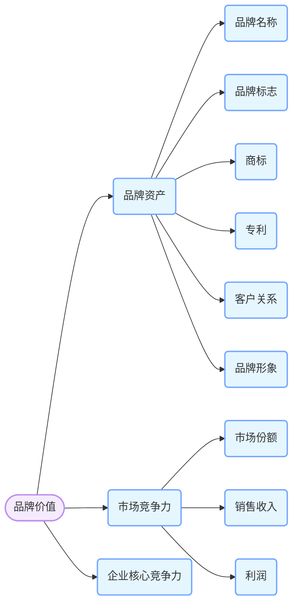

# 企业估值中的品牌价值评估方法

> 关键词：企业估值、品牌价值评估、评估方法、品牌资产、市场竞争力

> 摘要：本文围绕企业估值中的品牌价值评估方法展开深入探讨。首先介绍了研究的背景、目的、预期读者、文档结构和相关术语。接着阐述了品牌价值的核心概念及其与企业各方面的联系，并通过文本示意图和Mermaid流程图进行直观展示。详细讲解了核心算法原理和具体操作步骤，结合Python源代码进行说明。同时给出了相关的数学模型和公式，并举例解释。通过项目实战案例，展示了品牌价值评估在实际中的应用，包括开发环境搭建、源代码实现和代码解读。分析了品牌价值评估在不同场景下的实际应用，推荐了学习资源、开发工具框架和相关论文著作。最后总结了品牌价值评估的未来发展趋势与挑战，解答了常见问题，并提供了扩展阅读和参考资料，旨在为企业准确评估品牌价值提供全面的理论和实践指导。

## 1. 背景介绍 
### 1.1 目的和范围
在当今竞争激烈的商业环境中，品牌已成为企业的重要资产之一。品牌价值不仅反映了企业在消费者心中的形象和声誉，还对企业的市场竞争力、盈利能力和长期发展产生深远影响。因此，准确评估企业的品牌价值对于企业的战略决策、投资分析、并购重组等具有重要意义。本文的目的是系统地介绍企业估值中常用的品牌价值评估方法，分析其原理、优缺点和适用范围，为企业和投资者提供科学、合理的品牌价值评估参考。

本文的范围涵盖了品牌价值评估的基本概念、主要评估方法、数学模型和公式、实际应用案例以及相关的工具和资源推荐。重点关注市场法、收益法和成本法等传统评估方法，同时也介绍了一些新兴的评估方法和技术。

### 1.2 预期读者
本文的预期读者包括企业管理人员、投资者、财务分析师、市场营销人员、品牌专家以及对品牌价值评估感兴趣的学者和研究人员。对于企业管理人员来说，了解品牌价值评估方法有助于制定品牌战略、优化品牌资源配置和提升品牌竞争力；对于投资者来说，准确评估品牌价值可以帮助他们做出更明智的投资决策；对于财务分析师和市场营销人员来说，掌握品牌价值评估方法可以为企业的财务分析和市场推广提供有力支持；对于品牌专家和学者来说，本文可以作为研究品牌价值评估的参考资料。

### 1.3 文档结构概述
本文共分为十个部分，具体结构如下：
1. 背景介绍：介绍文章的目的、范围、预期读者和文档结构。
2. 核心概念与联系：阐述品牌价值的核心概念、与企业各方面的联系，并通过文本示意图和Mermaid流程图进行展示。
3. 核心算法原理 & 具体操作步骤：详细讲解品牌价值评估的核心算法原理和具体操作步骤，结合Python源代码进行说明。
4. 数学模型和公式 & 详细讲解 & 举例说明：给出品牌价值评估的数学模型和公式，并举例解释其应用。
5. 项目实战：代码实际案例和详细解释说明：通过项目实战案例，展示品牌价值评估在实际中的应用，包括开发环境搭建、源代码实现和代码解读。
6. 实际应用场景：分析品牌价值评估在不同场景下的实际应用。
7. 工具和资源推荐：推荐学习资源、开发工具框架和相关论文著作。
8. 总结：未来发展趋势与挑战：总结品牌价值评估的未来发展趋势和面临的挑战。
9. 附录：常见问题与解答：解答品牌价值评估中常见的问题。
10. 扩展阅读 & 参考资料：提供扩展阅读和参考资料，方便读者进一步深入学习。

### 1.4 术语表
#### 1.4.1 核心术语定义
- **品牌价值**：指品牌在市场上所具有的价值，是品牌资产的货币表现。它反映了品牌在消费者心中的认知度、美誉度、忠诚度以及品牌对企业盈利能力和市场竞争力的贡献。
- **品牌资产**：指与品牌相关的一系列资产和负债，包括品牌名称、标志、商标、专利、客户关系、品牌形象等。品牌资产是品牌价值的基础，品牌价值是品牌资产的综合体现。
- **市场法**：是一种通过比较被评估品牌与市场上类似品牌的交易价格来确定品牌价值的评估方法。
- **收益法**：是一种通过预测被评估品牌未来的收益，并将其折现到当前时点来确定品牌价值的评估方法。
- **成本法**：是一种通过计算创建或重建被评估品牌所需的成本来确定品牌价值的评估方法。

#### 1.4.2 相关概念解释
- **品牌知名度**：指消费者对品牌的知晓程度，是品牌价值的重要组成部分。品牌知名度越高，消费者在购买决策时越容易想到该品牌。
- **品牌美誉度**：指消费者对品牌的好感和信任程度，是品牌价值的核心要素之一。品牌美誉度越高，消费者越愿意购买该品牌的产品或服务。
- **品牌忠诚度**：指消费者对品牌的重复购买行为和对品牌的偏好程度，是品牌价值的重要体现。品牌忠诚度越高，消费者越不容易被竞争对手的品牌所吸引。

#### 1.4.3 缩略词列表
- **DCF**：Discounted Cash Flow，折现现金流法
- **EVA**：Economic Value Added，经济增加值法
- **RICS**：Royal Institution of Chartered Surveyors，皇家特许测量师学会

## 2. 核心概念与联系 

### 品牌价值的核心概念
品牌价值是品牌在市场上所具有的价值，它是品牌资产的货币表现。品牌价值的形成是一个长期的过程，受到多种因素的影响，包括品牌的市场定位、品牌形象、品牌传播、产品质量、客户服务等。品牌价值的高低直接影响企业的市场竞争力和盈利能力，是企业核心竞争力的重要组成部分。

### 品牌价值与企业各方面的联系
品牌价值与企业的市场份额、销售收入、利润、资产负债等方面密切相关。一个具有较高品牌价值的企业通常具有较强的市场竞争力，能够吸引更多的消费者，从而提高市场份额和销售收入。同时，品牌价值也可以提高企业的利润率，因为消费者愿意为具有较高品牌价值的产品或服务支付更高的价格。此外，品牌价值还可以增加企业的无形资产，提高企业的资产质量和市场价值。

### 文本示意图
```plaintext
品牌价值
|
|--品牌资产
|   |--品牌名称
|   |--品牌标志
|   |--商标
|   |--专利
|   |--客户关系
|   |--品牌形象
|
|--市场竞争力
|   |--市场份额
|   |--销售收入
|   |--利润
|
|--企业核心竞争力
```

### Mermaid流程图


## 3. 核心算法原理 & 具体操作步骤 

### 市场法
#### 算法原理
市场法是一种通过比较被评估品牌与市场上类似品牌的交易价格来确定品牌价值的评估方法。其基本原理是，在市场上存在大量类似品牌的交易案例，这些交易案例反映了市场对品牌价值的认可程度。通过对这些交易案例进行分析和比较，可以找出与被评估品牌具有相似特征的案例，并根据这些案例的交易价格来估算被评估品牌的价值。

#### 具体操作步骤
1. **确定可比品牌**：在市场上寻找与被评估品牌具有相似特征的品牌，这些特征包括品牌的行业、市场定位、品牌知名度、品牌美誉度、品牌忠诚度等。
2. **收集可比品牌的交易数据**：收集可比品牌的交易价格、交易时间、交易方式等数据。
3. **调整可比品牌的交易价格**：由于可比品牌与被评估品牌在某些方面可能存在差异，因此需要对可比品牌的交易价格进行调整，以使其更能反映被评估品牌的价值。调整因素包括品牌的市场份额、销售收入、利润、增长率等。
4. **计算被评估品牌的价值**：根据调整后的可比品牌交易价格，采用适当的方法计算被评估品牌的价值。常用的方法包括平均法、中位数法、回归分析法等。

#### Python源代码示例
```python
import pandas as pd

# 可比品牌交易数据
comparable_brands = {
    '品牌名称': ['品牌A', '品牌B', '品牌C'],
    '交易价格': [1000, 1200, 1500],
    '市场份额': [0.2, 0.3, 0.4],
    '销售收入': [5000, 6000, 8000],
    '利润': [500, 600, 800]
}

df = pd.DataFrame(comparable_brands)

# 被评估品牌的特征
target_brand = {
    '市场份额': 0.3,
    '销售收入': 6500,
    '利润': 650
}

# 调整系数计算（简单示例，实际中可能更复杂）
adjustment_factors = []
for index, row in df.iterrows():
    factor = (target_brand['市场份额'] / row['市场份额'] +
              target_brand['销售收入'] / row['销售收入'] +
              target_brand['利润'] / row['利润']) / 3
    adjustment_factors.append(factor)

df['调整系数'] = adjustment_factors
df['调整后价格'] = df['交易价格'] * df['调整系数']

# 计算被评估品牌的价值（这里采用平均值法）
target_brand_value = df['调整后价格'].mean()
print(f"被评估品牌的价值: {target_brand_value}")
```

### 收益法
#### 算法原理
收益法是一种通过预测被评估品牌未来的收益，并将其折现到当前时点来确定品牌价值的评估方法。其基本原理是，品牌的价值在于其能够为企业带来未来的经济收益，因此可以通过预测品牌未来的收益，并将其折现到当前时点来估算品牌的价值。

#### 具体操作步骤
1. **预测品牌未来的收益**：根据品牌的历史数据、市场趋势、行业发展前景等因素，预测品牌未来的销售收入、利润等收益指标。
2. **确定折现率**：折现率是将未来收益折现到当前时点的比率，反映了资金的时间价值和投资风险。折现率的确定需要考虑市场利率、行业风险、品牌风险等因素。
3. **计算品牌的现值**：将预测的品牌未来收益按照确定的折现率折现到当前时点，得到品牌的现值。
4. **考虑品牌的剩余经济寿命**：品牌的剩余经济寿命是指品牌在未来能够为企业带来经济收益的时间长度。在计算品牌价值时，需要考虑品牌的剩余经济寿命，以确保评估结果的合理性。

#### Python源代码示例
```python
import numpy as np

# 预测品牌未来每年的收益
future_earnings = [100, 120, 150, 180, 200]
# 折现率
discount_rate = 0.1
# 品牌剩余经济寿命
remaining_life = len(future_earnings)

# 计算品牌的现值
present_values = []
for i in range(remaining_life):
    present_value = future_earnings[i] / ((1 + discount_rate) ** (i + 1))
    present_values.append(present_value)

brand_value = np.sum(present_values)
print(f"品牌的价值: {brand_value}")
```

### 成本法
#### 算法原理
成本法是一种通过计算创建或重建被评估品牌所需的成本来确定品牌价值的评估方法。其基本原理是，品牌的价值等于创建或重建该品牌所需的成本，包括品牌的研发成本、市场推广成本、品牌维护成本等。

#### 具体操作步骤
1. **确定品牌的创建或重建成本**：包括品牌的研发成本、市场推广成本、品牌维护成本等。研发成本包括品牌名称、标志、商标等的设计和注册费用；市场推广成本包括广告宣传费用、促销活动费用等；品牌维护成本包括品牌形象的维护费用、客户关系的维护费用等。
2. **考虑品牌的损耗和贬值**：由于品牌的使用和市场环境的变化，品牌可能会出现损耗和贬值。在计算品牌价值时，需要考虑品牌的损耗和贬值因素，对品牌的创建或重建成本进行调整。
3. **计算品牌的价值**：根据调整后的品牌创建或重建成本，确定品牌的价值。

#### Python源代码示例
```python
# 品牌创建成本
creation_cost = 500
# 市场推广成本
marketing_cost = 300
# 品牌维护成本（假设每年100，共5年）
maintenance_cost = 100 * 5
# 品牌损耗率（假设为20%）
depreciation_rate = 0.2

total_cost = creation_cost + marketing_cost + maintenance_cost
brand_value = total_cost * (1 - depreciation_rate)
print(f"品牌的价值: {brand_value}")
```

## 4. 数学模型和公式 & 详细讲解 & 举例说明 

### 市场法数学模型和公式
市场法的数学模型可以表示为：
$$V = \frac{\sum_{i=1}^{n}V_i \times F_i}{n}$$
其中，$V$ 表示被评估品牌的价值，$V_i$ 表示第 $i$ 个可比品牌的交易价格，$F_i$ 表示第 $i$ 个可比品牌的调整系数，$n$ 表示可比品牌的数量。

调整系数 $F_i$ 的计算公式可以根据具体情况进行确定，例如：
$$F_i = \frac{S_{target}}{S_i} \times \frac{R_{target}}{R_i} \times \frac{P_{target}}{P_i}$$
其中，$S_{target}$ 表示被评估品牌的市场份额，$S_i$ 表示第 $i$ 个可比品牌的市场份额，$R_{target}$ 表示被评估品牌的销售收入，$R_i$ 表示第 $i$ 个可比品牌的销售收入，$P_{target}$ 表示被评估品牌的利润，$P_i$ 表示第 $i$ 个可比品牌的利润。

**举例说明**：假设有三个可比品牌，其交易价格分别为 $V_1 = 1000$，$V_2 = 1200$，$V_3 = 1500$，调整系数分别为 $F_1 = 1.1$，$F_2 = 0.9$，$F_3 = 1.2$，则被评估品牌的价值为：
$$V = \frac{1000 \times 1.1 + 1200 \times 0.9 + 1500 \times 1.2}{3} = \frac{1100 + 1080 + 1800}{3} = \frac{3980}{3} \approx 1326.67$$

### 收益法数学模型和公式
收益法的数学模型可以表示为：
$$V = \sum_{t=1}^{n} \frac{E_t}{(1 + r)^t}$$
其中，$V$ 表示被评估品牌的价值，$E_t$ 表示第 $t$ 年的品牌收益，$r$ 表示折现率，$n$ 表示品牌的剩余经济寿命。

**举例说明**：假设某品牌未来五年的收益分别为 $E_1 = 100$，$E_2 = 120$，$E_3 = 150$，$E_4 = 180$，$E_5 = 200$，折现率 $r = 0.1$，则该品牌的价值为：
$$V = \frac{100}{(1 + 0.1)^1} + \frac{120}{(1 + 0.1)^2} + \frac{150}{(1 + 0.1)^3} + \frac{180}{(1 + 0.1)^4} + \frac{200}{(1 + 0.1)^5}$$
$$V = \frac{100}{1.1} + \frac{120}{1.21} + \frac{150}{1.331} + \frac{180}{1.4641} + \frac{200}{1.61051}$$
$$V \approx 90.91 + 99.17 + 112.69 + 122.94 + 124.18 = 549.89$$

### 成本法数学模型和公式
成本法的数学模型可以表示为：
$$V = C \times (1 - D)$$
其中，$V$ 表示被评估品牌的价值，$C$ 表示品牌的创建或重建成本，$D$ 表示品牌的损耗率。

**举例说明**：假设某品牌的创建或重建成本 $C = 800$，品牌损耗率 $D = 0.2$，则该品牌的价值为：
$$V = 800 \times (1 - 0.2) = 800 \times 0.8 = 640$$

## 5. 项目实战：代码实际案例和详细解释说明 

### 5.1  开发环境搭建
为了实现品牌价值评估的代码示例，我们需要搭建以下开发环境：
1. **Python**：Python是一种高级编程语言，具有简单易学、功能强大的特点，广泛应用于数据处理、机器学习等领域。我们可以从Python官方网站（https://www.python.org/downloads/）下载并安装Python。
2. **Jupyter Notebook**：Jupyter Notebook是一个基于Web的交互式计算环境，支持多种编程语言，包括Python。我们可以使用Anaconda（https://www.anaconda.com/products/individual）来安装Jupyter Notebook，Anaconda是一个Python数据科学平台，包含了Python解释器、Jupyter Notebook以及许多常用的Python库。
3. **相关Python库**：我们需要安装一些常用的Python库，如`pandas`、`numpy`等。可以使用`pip`命令来安装这些库，例如：
```sh
pip install pandas numpy
```

### 5.2  源代码详细实现和代码解读
#### 市场法代码实现
```python
import pandas as pd

# 可比品牌交易数据
comparable_brands = {
    '品牌名称': ['品牌A', '品牌B', '品牌C'],
    '交易价格': [1000, 1200, 1500],
    '市场份额': [0.2, 0.3, 0.4],
    '销售收入': [5000, 6000, 8000],
    '利润': [500, 600, 800]
}

df = pd.DataFrame(comparable_brands)

# 被评估品牌的特征
target_brand = {
    '市场份额': 0.3,
    '销售收入': 6500,
    '利润': 650
}

# 调整系数计算（简单示例，实际中可能更复杂）
adjustment_factors = []
for index, row in df.iterrows():
    factor = (target_brand['市场份额'] / row['市场份额'] +
              target_brand['销售收入'] / row['销售收入'] +
              target_brand['利润'] / row['利润']) / 3
    adjustment_factors.append(factor)

df['调整系数'] = adjustment_factors
df['调整后价格'] = df['交易价格'] * df['调整系数']

# 计算被评估品牌的价值（这里采用平均值法）
target_brand_value = df['调整后价格'].mean()
print(f"被评估品牌的价值: {target_brand_value}")
```
**代码解读**：
1. 首先，我们使用`pandas`库创建了一个包含可比品牌交易数据的DataFrame对象。
2. 然后，定义了被评估品牌的特征。
3. 接着，通过循环计算每个可比品牌的调整系数，并将其添加到DataFrame中。
4. 再根据调整系数计算每个可比品牌的调整后价格，并将其添加到DataFrame中。
5. 最后，使用平均值法计算被评估品牌的价值，并打印输出。

#### 收益法代码实现
```python
import numpy as np

# 预测品牌未来每年的收益
future_earnings = [100, 120, 150, 180, 200]
# 折现率
discount_rate = 0.1
# 品牌剩余经济寿命
remaining_life = len(future_earnings)

# 计算品牌的现值
present_values = []
for i in range(remaining_life):
    present_value = future_earnings[i] / ((1 + discount_rate) ** (i + 1))
    present_values.append(present_value)

brand_value = np.sum(present_values)
print(f"品牌的价值: {brand_value}")
```
**代码解读**：
1. 首先，定义了品牌未来每年的收益、折现率和品牌剩余经济寿命。
2. 然后，通过循环计算每年收益的现值，并将其添加到列表中。
3. 最后，使用`numpy`库的`sum`函数计算品牌的现值，并打印输出。

#### 成本法代码实现
```python
# 品牌创建成本
creation_cost = 500
# 市场推广成本
marketing_cost = 300
# 品牌维护成本（假设每年100，共5年）
maintenance_cost = 100 * 5
# 品牌损耗率（假设为20%）
depreciation_rate = 0.2

total_cost = creation_cost + marketing_cost + maintenance_cost
brand_value = total_cost * (1 - depreciation_rate)
print(f"品牌的价值: {brand_value}")
```
**代码解读**：
1. 首先，定义了品牌的创建成本、市场推广成本、品牌维护成本和品牌损耗率。
2. 然后，计算品牌的总成本。
3. 最后，根据成本法的公式计算品牌的价值，并打印输出。

### 5.3  代码解读与分析
通过以上代码示例，我们可以看到不同的品牌价值评估方法在代码实现上的差异。市场法主要通过比较可比品牌的交易价格并进行调整来估算品牌价值；收益法通过预测品牌未来的收益并折现来计算品牌价值；成本法通过计算品牌的创建或重建成本并考虑损耗来确定品牌价值。

在实际应用中，我们需要根据具体情况选择合适的评估方法。市场法适用于市场上存在大量类似品牌交易案例的情况；收益法适用于品牌具有稳定的未来收益预期的情况；成本法适用于品牌创建或重建成本易于确定的情况。同时，我们还需要注意数据的准确性和可靠性，以及评估方法的合理性和适用性，以确保评估结果的准确性和可信度。

## 6. 实际应用场景 
### 企业战略决策
品牌价值评估可以为企业的战略决策提供重要依据。例如，企业在进行品牌扩张、品牌延伸、品牌收购等战略决策时，需要了解品牌的价值和市场潜力，以便做出合理的决策。通过品牌价值评估，企业可以了解自身品牌的优势和劣势，制定针对性的品牌战略，提高品牌的市场竞争力和盈利能力。

### 投资分析
品牌价值评估对于投资者来说也具有重要意义。投资者在进行股票投资、企业并购等投资决策时，需要考虑企业的品牌价值。一个具有较高品牌价值的企业通常具有较强的市场竞争力和盈利能力，其股票价格也可能具有较高的上涨潜力。因此，投资者可以通过品牌价值评估来筛选投资标的，降低投资风险，提高投资收益。

### 品牌管理
品牌价值评估可以帮助企业进行品牌管理。企业可以通过定期评估品牌价值，了解品牌的发展状况和市场表现，及时发现品牌存在的问题，并采取相应的措施进行改进。同时，品牌价值评估还可以为企业的品牌营销活动提供指导，帮助企业制定合理的品牌营销策略，提高品牌的知名度和美誉度。

### 企业并购重组
在企业并购重组过程中，品牌价值评估是一个重要的环节。并购方需要了解被并购方的品牌价值，以便确定合理的并购价格。同时，被并购方也需要了解自身品牌的价值，以便在并购谈判中争取更有利的条件。通过品牌价值评估，可以为企业并购重组提供客观、公正的依据，促进企业并购重组的顺利进行。

## 7. 工具和资源推荐
### 7.1 学习资源推荐
#### 7.1.1 书籍推荐
- 《品牌资产管理》：本书系统地介绍了品牌资产的概念、评估方法和管理策略，是品牌管理领域的经典著作。
- 《品牌价值评估》：本书详细阐述了品牌价值评估的理论和方法，结合实际案例进行分析，具有较强的实用性。
- 《市场营销原理》：本书是市场营销领域的经典教材，其中包含了品牌营销和品牌价值评估的相关内容。

#### 7.1.2 在线课程
- Coursera平台上的“品牌管理”课程：该课程由知名大学的教授授课，内容涵盖品牌战略、品牌传播、品牌价值评估等方面。
- edX平台上的“市场营销分析”课程：该课程介绍了市场营销分析的方法和工具，包括品牌价值评估的相关内容。
- 网易云课堂上的“品牌营销实战”课程：该课程结合实际案例，讲解品牌营销的策略和方法，对品牌价值评估也有一定的涉及。

#### 7.1.3 技术博客和网站
- 品牌研究网：该网站提供了丰富的品牌研究资料和案例，包括品牌价值评估的相关内容。
- 市场营销界：该网站是市场营销领域的专业网站，有很多关于品牌营销和品牌价值评估的文章和观点。
- 品牌观察网：该网站专注于品牌领域的观察和研究，提供了品牌价值评估的最新动态和趋势。

### 7.2 开发工具框架推荐
#### 7.2.1 IDE和编辑器
- PyCharm：是一款专门为Python开发设计的集成开发环境（IDE），具有强大的代码编辑、调试和项目管理功能。
- Jupyter Notebook：是一个基于Web的交互式计算环境，支持多种编程语言，适合进行数据分析和模型开发。
- Visual Studio Code：是一款轻量级的代码编辑器，支持多种编程语言和插件扩展，可用于Python代码的开发和调试。

#### 7.2.2 调试和性能分析工具
- PySnooper：是一个Python调试工具，可以自动记录函数的调用过程和变量的值，方便调试代码。
- cProfile：是Python标准库中的一个性能分析工具，可以分析代码的运行时间和函数调用次数，帮助优化代码性能。
- memory_profiler：是一个Python内存分析工具，可以分析代码的内存使用情况，帮助发现内存泄漏问题。

#### 7.2.3 相关框架和库
- pandas：是一个用于数据处理和分析的Python库，提供了丰富的数据结构和数据分析工具，可用于品牌价值评估中的数据处理和分析。
- numpy：是一个用于科学计算的Python库，提供了高效的数组操作和数学函数，可用于品牌价值评估中的数值计算。
- scikit-learn：是一个用于机器学习的Python库，提供了多种机器学习算法和工具，可用于品牌价值评估中的模型开发和预测。

### 7.3 相关论文著作推荐
#### 7.3.1 经典论文
- Aaker, D. A. (1991). Managing brand equity: capitalizing on the value of a brand name. Free Press.
- Keller, K. L. (1993). Conceptualizing, measuring, and managing customer-based brand equity. Journal of marketing, 57(1), 1-22.
- Simon, C. J., & Sullivan, M. W. (1993). The measurement and determinants of brand equity: A financial approach. Marketing science, 12(1), 28-52.

#### 7.3.2 最新研究成果
- Interbrand每年发布的《全球最佳品牌报告》：该报告对全球知名品牌的价值进行评估和排名，并分析品牌价值的影响因素和发展趋势。
- Brand Finance每年发布的《全球品牌价值500强报告》：该报告评估了全球最具价值的500个品牌，并提供了品牌价值评估的方法和数据。

#### 7.3.3 应用案例分析
- 《品牌价值评估案例集》：该案例集收集了多个不同行业的品牌价值评估案例，详细介绍了评估过程和方法，对实际应用具有较强的参考价值。
- 各大咨询公司发布的品牌价值评估报告：如麦肯锡、波士顿咨询等公司发布的报告，通常会结合实际案例分析品牌价值评估的应用和实践。

## 8. 总结：未来发展趋势与挑战
### 未来发展趋势
#### 多元化评估方法的融合
未来，品牌价值评估方法将呈现多元化融合的趋势。单一的评估方法往往存在一定的局限性，而将市场法、收益法、成本法等多种方法相结合，可以充分发挥各种方法的优势，提高评估结果的准确性和可靠性。同时，随着人工智能、大数据等技术的发展，一些新兴的评估方法和技术也将不断涌现，如基于机器学习的评估模型、基于区块链的品牌价值评估等。

#### 强调消费者体验和情感因素
在未来的品牌价值评估中，消费者体验和情感因素将越来越受到重视。品牌的价值不仅仅取决于其市场表现和财务指标，还与消费者的认知、情感和忠诚度密切相关。因此，未来的评估方法将更加注重从消费者的角度出发，综合考虑消费者的体验、情感和行为等因素，以更全面地评估品牌的价值。

#### 与企业战略和业务运营的深度结合
品牌价值评估将与企业的战略和业务运营更加紧密地结合。品牌是企业战略的重要组成部分，品牌价值的提升需要与企业的战略目标和业务运营相匹配。未来，品牌价值评估将不仅仅是一个独立的评估过程，而是将贯穿于企业的战略规划、市场营销、产品研发等各个环节，为企业的决策提供更加全面和深入的支持。

### 面临的挑战
#### 数据获取和质量问题
品牌价值评估需要大量的数据支持，包括市场数据、财务数据、消费者数据等。然而，数据的获取和质量往往是一个挑战。一方面，一些数据可能难以获取，如消费者的情感和认知数据；另一方面，数据的质量也可能存在问题，如数据的准确性、完整性和时效性等。因此，如何获取高质量的数据，并对数据进行有效的处理和分析，是品牌价值评估面临的一个重要挑战。

#### 评估方法的主观性和不确定性
品牌价值评估方法存在一定的主观性和不确定性。不同的评估方法可能会得出不同的评估结果，而且评估过程中涉及到的一些参数和假设也需要人为判断。因此，如何减少评估方法的主观性和不确定性，提高评估结果的可信度和可比性，是品牌价值评估需要解决的一个关键问题。

#### 市场环境的快速变化
市场环境的快速变化给品牌价值评估带来了很大的挑战。品牌的价值受到市场竞争、消费者需求、技术创新等多种因素的影响，而这些因素都在不断变化。因此，如何及时反映市场环境的变化，对品牌价值进行动态评估，是品牌价值评估面临的另一个重要挑战。

## 9. 附录：常见问题与解答
### 问题1：品牌价值评估的结果准确吗？
品牌价值评估的结果具有一定的主观性和不确定性，因为评估过程中涉及到一些参数和假设的选择，不同的评估方法也可能会得出不同的结果。但是，如果采用科学、合理的评估方法，并且保证数据的准确性和可靠性，评估结果可以在一定程度上反映品牌的真实价值。同时，品牌价值评估结果也可以作为企业决策的参考依据，而不是绝对的标准。

### 问题2：市场法、收益法和成本法哪种方法更好？
市场法、收益法和成本法各有优缺点，适用于不同的情况。市场法适用于市场上存在大量类似品牌交易案例的情况，能够直接反映市场对品牌价值的认可程度；收益法适用于品牌具有稳定的未来收益预期的情况，能够体现品牌的未来盈利能力；成本法适用于品牌创建或重建成本易于确定的情况，能够反映品牌的历史投入。在实际应用中，需要根据具体情况选择合适的评估方法，也可以将多种方法结合使用，以提高评估结果的准确性和可靠性。

### 问题3：品牌价值评估需要哪些数据？
品牌价值评估需要的数据包括市场数据、财务数据、消费者数据等。市场数据包括市场份额、市场增长率、竞争对手情况等；财务数据包括销售收入、利润、资产负债等；消费者数据包括消费者认知度、美誉度、忠诚度等。不同的评估方法对数据的要求可能会有所不同，因此在进行品牌价值评估时，需要根据具体的评估方法收集相应的数据。

### 问题4：品牌价值评估的频率应该是多久一次？
品牌价值评估的频率取决于企业的需求和品牌的发展情况。对于一些品牌发展较为稳定的企业，可以每年或每两年进行一次品牌价值评估；对于一些品牌发展变化较快的企业，如处于快速扩张期或面临重大战略调整的企业，可能需要更频繁地进行品牌价值评估，以便及时了解品牌的价值变化情况，为企业决策提供支持。

## 10. 扩展阅读 & 参考资料
### 扩展阅读
- 《品牌的力量》：深入探讨了品牌在市场竞争中的作用和价值，以及如何打造强大的品牌。
- 《营销革命》：介绍了市场营销的最新理论和方法，对品牌营销和品牌价值评估有一定的启示。
- 《数字化营销》：探讨了数字化时代下品牌营销的策略和方法，以及如何利用数字化技术提升品牌价值。

### 参考资料
- Aaker, D. A. (1996). Building strong brands. Free Press.
- Keller, K. L. (2003). Strategic brand management: Building, measuring, and managing brand equity. Pearson Prentice Hall.
- Simon, C. J., & Sullivan, M. W. (1993). The measurement and determinants of brand equity: A financial approach. Marketing science, 12(1), 28-52.
- Interbrand. (2023). Best Global Brands Report.
- Brand Finance. (2023). Global 500 Report.

作者：AI天才研究院/AI Genius Institute & 禅与计算机程序设计艺术 /Zen And The Art of Computer Programming