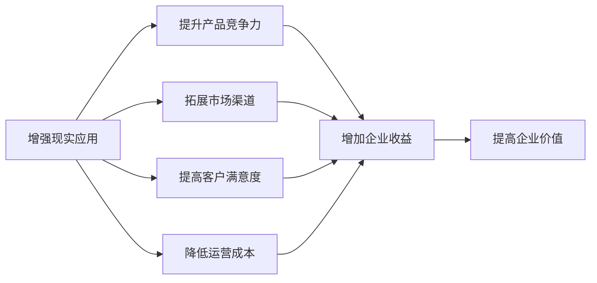

# 企业估值中的增强现实应用评估

> 关键词：企业估值、增强现实、应用评估、评估模型、市场价值

> 摘要：本文聚焦于企业估值中增强现实（AR）应用的评估。随着增强现实技术在企业中的广泛应用，其对企业价值的影响日益显著。文章首先介绍了研究的背景、目的、预期读者和文档结构，对相关术语进行了详细解释。接着阐述了增强现实和企业估值的核心概念及其联系，并通过Mermaid流程图进行了直观展示。深入探讨了用于评估增强现实应用对企业估值影响的核心算法原理，给出Python源代码示例。运用数学模型和公式详细讲解评估过程，并举例说明。通过项目实战，包括开发环境搭建、源代码实现和解读，展示了如何在实际中进行评估。分析了增强现实应用在企业中的实际应用场景，推荐了相关的学习资源、开发工具框架和论文著作。最后总结了未来发展趋势与挑战，解答了常见问题，并提供了扩展阅读和参考资料，旨在为企业准确评估增强现实应用价值提供全面的指导。

## 1. 背景介绍 
### 1.1 目的和范围
近年来，增强现实（AR）技术发展迅猛，众多企业纷纷将其应用于产品展示、营销推广、员工培训等多个领域。然而，如何准确评估增强现实应用对企业价值的贡献，成为企业管理者和投资者面临的重要问题。本文章的目的在于深入探讨企业估值中增强现实应用评估的方法和技术，为企业提供科学、合理的评估框架。

文章的范围涵盖增强现实技术的基本概念、企业估值的常用方法，以及如何将增强现实应用与企业估值相结合。通过理论分析和实际案例，详细阐述增强现实应用对企业市场价值、盈利能力、竞争优势等方面的影响。

### 1.2 预期读者
本文的预期读者包括企业管理者、投资者、金融分析师、技术专家以及对增强现实和企业估值感兴趣的研究人员。企业管理者可以借助本文的评估方法，了解增强现实应用对企业价值的影响，为企业的战略决策提供依据；投资者可以通过评估增强现实应用的价值，更好地判断企业的投资潜力；金融分析师可以将本文的方法应用于企业估值报告中，提高报告的准确性和可靠性；技术专家可以从本文中了解增强现实技术在企业估值中的应用场景和需求，为技术研发提供方向；研究人员可以将本文作为进一步研究的参考，推动相关领域的学术发展。

### 1.3 文档结构概述
本文共分为十个部分。第一部分为背景介绍，阐述了研究的目的、范围、预期读者和文档结构。第二部分介绍增强现实和企业估值的核心概念及其联系，通过文本示意图和Mermaid流程图进行直观展示。第三部分详细讲解用于评估增强现实应用对企业估值影响的核心算法原理，并给出Python源代码示例。第四部分运用数学模型和公式对评估过程进行详细讲解，并举例说明。第五部分通过项目实战，展示如何在实际中进行评估，包括开发环境搭建、源代码实现和解读。第六部分分析增强现实应用在企业中的实际应用场景。第七部分推荐相关的学习资源、开发工具框架和论文著作。第八部分总结未来发展趋势与挑战。第九部分解答常见问题。第十部分提供扩展阅读和参考资料。

### 1.4 术语表
#### 1.4.1 核心术语定义
- **增强现实（Augmented Reality，AR）**：一种将虚拟信息与真实世界场景相结合的技术，通过计算机图形技术和传感器技术，将虚拟的图像、视频、音频等信息叠加到真实场景中，从而增强用户对现实世界的感知和交互体验。
- **企业估值（Business Valuation）**：对企业整体价值进行评估的过程，通常基于企业的财务状况、市场前景、行业竞争等因素，采用一定的估值方法来确定企业的市场价值。
- **市场价值（Market Value）**：企业在市场上的交易价格，反映了市场参与者对企业未来盈利能力和发展潜力的预期。
- **盈利能力（Profitability）**：企业通过经营活动获取利润的能力，通常用净利润、毛利率、净利率等指标来衡量。
- **竞争优势（Competitive Advantage）**：企业在市场竞争中相对于竞争对手所具有的优势，包括技术优势、品牌优势、成本优势等。

#### 1.4.2 相关概念解释
- **虚拟信息（Virtual Information）**：由计算机生成的、不存在于现实世界中的信息，如虚拟图像、视频、音频等。
- **真实世界场景（Real - World Scene）**：用户所处的实际物理环境，包括自然环境、建筑物、物体等。
- **估值方法（Valuation Method）**：用于评估企业价值的各种方法，常见的有收益法、市场法、成本法等。
- **财务指标（Financial Indicator）**：反映企业财务状况和经营成果的各种指标，如资产负债率、营业收入、净利润等。

#### 1.4.3 缩略词列表
- **AR**：Augmented Reality（增强现实）
- **NPV**：Net Present Value（净现值）
- **DCF**：Discounted Cash Flow（现金流折现法）

## 2. 核心概念与联系 

### 增强现实的原理和架构
增强现实技术主要由以下几个部分组成：
1. **数据采集**：通过摄像头、传感器等设备采集现实世界的图像、视频、位置等信息。
2. **数据处理**：对采集到的数据进行处理和分析，提取关键特征，识别物体和场景。
3. **虚拟信息生成**：根据采集到的现实世界信息和用户需求，生成相应的虚拟信息，如虚拟图像、视频、音频等。
4. **信息融合**：将生成的虚拟信息与采集到的现实世界信息进行融合，形成增强现实场景。
5. **显示输出**：将融合后的增强现实场景通过显示器、眼镜等设备输出给用户。

其架构可以用以下Mermaid流程图表示：


### 企业估值的常用方法
企业估值的常用方法主要有以下几种：
1. **收益法**：通过预测企业未来的收益，并将其折现到当前，来确定企业的价值。常用的收益法有现金流折现法（DCF）和净利润折现法。
2. **市场法**：通过比较被评估企业与同行业其他企业的市场交易价格，来确定被评估企业的价值。常用的市场法有市盈率法、市净率法等。
3. **成本法**：通过评估企业的资产价值和负债价值，来确定企业的净资产价值。常用的成本法有重置成本法和清算价值法。

### 增强现实应用与企业估值的联系
增强现实应用可以从多个方面影响企业的价值：
1. **提升产品竞争力**：通过增强现实技术，企业可以为产品增加新的功能和体验，提高产品的附加值，从而增强产品在市场上的竞争力。
2. **拓展市场渠道**：增强现实应用可以为企业开辟新的市场渠道，如通过增强现实广告、营销活动等，吸引更多的潜在客户。
3. **提高客户满意度**：增强现实技术可以为客户提供更加直观、便捷的产品展示和使用指导，提高客户的满意度和忠诚度。
4. **降低运营成本**：在员工培训、生产管理等方面应用增强现实技术，可以提高工作效率，降低运营成本。

增强现实应用与企业估值的联系可以用以下Mermaid流程图表示：


## 3. 核心算法原理 & 具体操作步骤 

### 基于现金流折现法的评估算法原理
现金流折现法（DCF）是一种常用的企业估值方法，其基本原理是将企业未来的现金流折现到当前，来确定企业的价值。在评估增强现实应用对企业估值的影响时，可以通过预测增强现实应用带来的额外现金流，并将其折现到当前，来确定增强现实应用的价值。

具体步骤如下：
1. **预测增强现实应用带来的额外现金流**：分析增强现实应用对企业产品销售、成本控制等方面的影响，预测未来各期的额外现金流。
2. **确定折现率**：折现率反映了投资者对企业未来现金流的风险预期，通常可以采用加权平均资本成本（WACC）作为折现率。
3. **计算净现值（NPV）**：将预测的额外现金流按照折现率折现到当前，计算净现值。净现值即为增强现实应用的价值。

### Python源代码示例
```python
import numpy as np

def calculate_npv(cash_flows, discount_rate):
    """
    计算净现值
    :param cash_flows: 未来各期的现金流列表
    :param discount_rate: 折现率
    :return: 净现值
    """
    npv = 0
    for i, cash_flow in enumerate(cash_flows):
        npv += cash_flow / ((1 + discount_rate) ** i)
    return npv

# 示例数据
extra_cash_flows = [100, 200, 300, 400, 500]  # 未来五年的额外现金流
discount_rate = 0.1  # 折现率为10%

# 计算净现值
npv = calculate_npv(extra_cash_flows, discount_rate)
print(f"增强现实应用的净现值为: {npv}")
```

### 代码解释
- `calculate_npv` 函数接受两个参数：`cash_flows` 表示未来各期的现金流列表，`discount_rate` 表示折现率。
- 在函数内部，使用 `for` 循环遍历现金流列表，将每期的现金流按照折现率折现到当前，并累加到净现值中。
- 最后返回净现值。

### 具体操作步骤
1. **收集数据**：收集企业的历史财务数据、市场数据、增强现实应用的相关信息等。
2. **预测额外现金流**：根据收集到的数据，分析增强现实应用对企业产品销售、成本控制等方面的影响，预测未来各期的额外现金流。
3. **确定折现率**：根据企业的风险状况和市场利率，确定折现率。
4. **计算净现值**：使用 `calculate_npv` 函数计算增强现实应用的净现值。
5. **评估结果分析**：根据计算得到的净现值，评估增强现实应用对企业估值的影响。

## 4. 数学模型和公式 & 详细讲解 & 举例说明 

### 现金流折现法的数学模型和公式
现金流折现法的数学模型可以表示为：
$$
NPV = \sum_{t = 0}^{n} \frac{CF_t}{(1 + r)^t}
$$
其中：
- $NPV$ 表示净现值
- $CF_t$ 表示第 $t$ 期的现金流
- $r$ 表示折现率
- $n$ 表示预测期数

### 详细讲解
- **现金流预测**：在预测现金流时，需要考虑增强现实应用对企业产品销售、成本控制等方面的影响。例如，增强现实应用可以提高产品的附加值，从而增加产品的销售额；同时，增强现实应用可以提高生产效率，降低生产成本。
- **折现率确定**：折现率反映了投资者对企业未来现金流的风险预期。通常可以采用加权平均资本成本（WACC）作为折现率，其计算公式为：
$$
WACC = E/V \times R_e + D/V \times R_d \times (1 - T_c)
$$
其中：
- $E$ 表示企业的股权价值
- $D$ 表示企业的债务价值
- $V = E + D$ 表示企业的总价值
- $R_e$ 表示股权资本成本
- $R_d$ 表示债务资本成本
- $T_c$ 表示企业所得税税率

### 举例说明
假设某企业计划引入增强现实应用，预计未来五年的额外现金流分别为100万元、200万元、300万元、400万元和500万元。企业的加权平均资本成本（WACC）为10%。

根据现金流折现法的公式，计算净现值：
$$
NPV = \frac{100}{(1 + 0.1)^1} + \frac{200}{(1 + 0.1)^2} + \frac{300}{(1 + 0.1)^3} + \frac{400}{(1 + 0.1)^4} + \frac{500}{(1 + 0.1)^5}
$$
```python
import numpy as np

cash_flows = [100, 200, 300, 400, 500]
discount_rate = 0.1
npv = np.sum([cash_flow / ((1 + discount_rate) ** (i + 1)) for i, cash_flow in enumerate(cash_flows)])
print(f"净现值为: {npv}")
```
运行上述代码，得到净现值约为1065.26万元。这意味着增强现实应用对企业的价值贡献约为1065.26万元。

## 5. 项目实战：代码实际案例和详细解释说明 

### 5.1  开发环境搭建
为了实现企业估值中增强现实应用评估的项目，我们需要搭建以下开发环境：
1. **Python环境**：建议使用Python 3.7及以上版本。可以从Python官方网站（https://www.python.org/downloads/）下载并安装。
2. **开发工具**：可以使用PyCharm、Jupyter Notebook等开发工具。这里我们推荐使用Jupyter Notebook，它可以方便地进行代码编写、调试和文档记录。
3. **相关库**：需要安装 `numpy`、`pandas` 等库，用于数据处理和计算。可以使用以下命令进行安装：
```sh
pip install numpy pandas
```

### 5.2  源代码详细实现和代码解读
```python
import numpy as np
import pandas as pd

def calculate_wacc(equity_value, debt_value, equity_cost, debt_cost, tax_rate):
    """
    计算加权平均资本成本（WACC）
    :param equity_value: 股权价值
    :param debt_value: 债务价值
    :param equity_cost: 股权资本成本
    :param debt_cost: 债务资本成本
    :param tax_rate: 企业所得税税率
    :return: 加权平均资本成本
    """
    total_value = equity_value + debt_value
    wacc = (equity_value / total_value) * equity_cost + (debt_value / total_value) * debt_cost * (1 - tax_rate)
    return wacc

def calculate_npv(cash_flows, discount_rate):
    """
    计算净现值
    :param cash_flows: 未来各期的现金流列表
    :param discount_rate: 折现率
    :return: 净现值
    """
    npv = 0
    for i, cash_flow in enumerate(cash_flows):
        npv += cash_flow / ((1 + discount_rate) ** i)
    return npv

# 示例数据
equity_value = 1000  # 股权价值
debt_value = 500  # 债务价值
equity_cost = 0.15  # 股权资本成本
debt_cost = 0.05  # 债务资本成本
tax_rate = 0.25  # 企业所得税税率
extra_cash_flows = [100, 200, 300, 400, 500]  # 未来五年的额外现金流

# 计算加权平均资本成本（WACC）
wacc = calculate_wacc(equity_value, debt_value, equity_cost, debt_cost, tax_rate)
print(f"加权平均资本成本（WACC）为: {wacc}")

# 计算净现值
npv = calculate_npv(extra_cash_flows, wacc)
print(f"增强现实应用的净现值为: {npv}")
```

### 代码解读与分析
- **`calculate_wacc` 函数**：该函数用于计算加权平均资本成本（WACC）。它接受股权价值、债务价值、股权资本成本、债务资本成本和企业所得税税率作为输入参数，根据WACC的计算公式进行计算，并返回计算结果。
- **`calculate_npv` 函数**：该函数用于计算净现值。它接受未来各期的现金流列表和折现率作为输入参数，根据净现值的计算公式进行计算，并返回计算结果。
- **示例数据**：定义了股权价值、债务价值、股权资本成本、债务资本成本、企业所得税税率和未来五年的额外现金流等示例数据。
- **计算WACC**：调用 `calculate_wacc` 函数计算加权平均资本成本（WACC），并打印计算结果。
- **计算净现值**：调用 `calculate_npv` 函数计算增强现实应用的净现值，使用WACC作为折现率，并打印计算结果。

通过这个项目实战，我们可以看到如何使用Python代码实现企业估值中增强现实应用的评估。在实际应用中，我们可以根据具体情况调整示例数据，以适应不同的企业和项目需求。

## 6. 实际应用场景 
### 产品展示与营销
在产品展示和营销方面，增强现实应用可以为企业带来显著的价值提升。例如，在房地产行业，开发商可以使用增强现实技术为客户提供虚拟的房产参观体验。客户可以通过手机或增强现实眼镜，在真实的房产环境中看到虚拟的装修效果、家具布置等，从而更直观地了解房产的特点和优势。这种创新的展示方式可以吸引更多的潜在客户，提高客户的购买意愿，进而增加房产的销售额。

在汽车行业，汽车制造商可以利用增强现实应用为客户提供虚拟的汽车试驾体验。客户可以在展厅中通过增强现实设备，看到虚拟的汽车在不同场景下的行驶效果、性能表现等。同时，还可以对汽车的外观、内饰进行个性化定制，提前感受自己理想中的汽车。这种互动式的营销方式可以提高客户的参与度和满意度，增强品牌影响力。

### 员工培训与教育
增强现实应用在企业员工培训和教育方面也具有广阔的应用前景。例如，在制造业中，企业可以使用增强现实技术为新员工提供虚拟的操作培训。员工可以通过增强现实眼镜，在真实的设备上看到虚拟的操作步骤和提示，进行模拟操作。这种培训方式可以让员工更加直观地了解设备的操作方法和注意事项，提高培训效果和效率，减少培训成本。

在医疗行业，医院可以利用增强现实应用为医护人员提供虚拟的手术培训。医护人员可以通过增强现实设备，在虚拟的手术场景中进行操作练习，提高手术技能和应对突发情况的能力。同时，还可以邀请专家进行远程指导，实现资源共享和知识传承。

### 客户服务与支持
增强现实应用可以为企业的客户服务和支持带来新的突破。例如，在电子产品售后维修方面，企业可以为客户提供增强现实的维修指导。客户可以通过手机应用，扫描故障设备，获取虚拟的维修步骤和解决方案。同时，还可以与客服人员进行实时视频沟通，得到更准确的指导和帮助。这种方式可以提高客户的自助维修能力，缩短维修时间，提高客户满意度。

在旅游行业，旅行社可以为游客提供增强现实的导游服务。游客可以通过手机应用，在旅游景点中看到虚拟的导游讲解、历史文化介绍等。同时，还可以根据自己的兴趣和需求，定制个性化的旅游路线。这种创新的导游服务可以提高游客的旅游体验，增加游客的满意度和忠诚度。

## 7. 工具和资源推荐
### 7.1 学习资源推荐
#### 7.1.1 书籍推荐
- 《增强现实：原理、技术与应用》：本书全面介绍了增强现实技术的原理、技术和应用，包括硬件设备、软件开发、算法设计等方面的内容。适合对增强现实技术感兴趣的初学者和专业人士阅读。
- 《企业估值：理论与实践》：本书系统阐述了企业估值的理论和方法，包括收益法、市场法、成本法等。通过大量的案例分析，帮助读者掌握企业估值的实际操作技巧。
- 《Python数据分析实战》：本书介绍了如何使用Python进行数据分析，包括数据采集、数据清洗、数据可视化等方面的内容。对于需要使用Python进行增强现实应用评估的读者来说，是一本很好的参考书籍。

#### 7.1.2 在线课程
- Coursera上的“增强现实技术与应用”课程：该课程由知名高校的教授授课，内容涵盖增强现实技术的基本原理、开发工具和应用案例等方面。通过在线视频、作业和讨论等方式，帮助学员系统学习增强现实技术。
- edX上的“企业估值与财务建模”课程：该课程介绍了企业估值的基本方法和财务建模的技巧，通过实际案例分析和模拟操作，让学员掌握企业估值的核心要点。
- 网易云课堂上的“Python数据分析从入门到精通”课程：该课程适合Python初学者，通过丰富的案例和实践项目，帮助学员快速掌握Python数据分析的基本技能。

#### 7.1.3 技术博客和网站
- ARtillry：这是一个专注于增强现实和虚拟现实技术的博客，提供最新的行业动态、技术趋势和应用案例等内容。
- Seeking Alpha：该网站提供大量的企业估值分析文章和研究报告，对于了解企业估值的最新方法和实践具有重要的参考价值。
- Medium上的Python数据分析相关博客：Medium上有很多关于Python数据分析的优质博客，作者们分享了自己的经验和技巧，对于提高Python数据分析能力很有帮助。

### 7.2 开发工具框架推荐
#### 7.2.1 IDE和编辑器
- PyCharm：一款专业的Python集成开发环境（IDE），具有代码自动补全、调试、版本控制等功能，适合开发大型的Python项目。
- Jupyter Notebook：一种交互式的开发环境，支持多种编程语言，如Python、R等。可以方便地进行代码编写、调试和文档记录，适合数据科学和机器学习领域的开发。
- Visual Studio Code：一款轻量级的代码编辑器，支持多种编程语言和插件扩展。具有丰富的代码编辑功能和调试功能，适合初学者和专业开发者使用。

#### 7.2.2 调试和性能分析工具
- Py-Spy：一个用于Python代码性能分析的工具，可以实时监测Python程序的CPU使用情况、函数调用时间等信息，帮助开发者找出性能瓶颈。
- PDB：Python自带的调试工具，可以在代码中设置断点，逐步执行代码，查看变量的值和程序的执行流程，方便调试代码。
- Memory Profiler：一个用于Python内存分析的工具，可以分析Python程序的内存使用情况，找出内存泄漏和内存占用过高的问题。

#### 7.2.3 相关框架和库
- ARCore：由Google开发的增强现实开发平台，支持Android和iOS系统。提供了丰富的API和工具，方便开发者快速开发增强现实应用。
- ARKit：由Apple开发的增强现实开发平台，仅支持iOS系统。具有高精度的跟踪和识别功能，为开发者提供了良好的开发体验。
- NumPy：一个用于Python科学计算的基础库，提供了高效的数组操作和数学函数，是进行数据分析和数值计算的必备工具。
- Pandas：一个用于数据处理和分析的Python库，提供了灵活的数据结构和数据操作方法，方便进行数据清洗、转换和分析。

### 7.3 相关论文著作推荐
#### 7.3.1 经典论文
- Azuma, Ronald T. "A survey of augmented reality." Presence: Teleoperators and virtual environments 6.4 (1997): 355-385. 该论文是增强现实领域的经典文献，对增强现实技术的定义、分类、应用和研究现状进行了全面的综述。
- Damodaran, Aswath. "The dark side of valuation: valuing young, distressed, and complex businesses." Pearson Prentice Hall, 2009. 本书深入探讨了企业估值中的难点和挑战，包括对年轻企业、困境企业和复杂企业的估值方法。

#### 7.3.2 最新研究成果
- Huang, Xinyu, et al. "A framework for augmented reality-based product design evaluation considering user experience." Computers in Industry 122 (2020): 103241. 该论文提出了一种基于增强现实的产品设计评估框架，考虑了用户体验因素，为企业在产品设计阶段提供了新的评估方法。
- Wang, Yanhong, et al. "Valuation of augmented reality technology in the context of digital transformation: A real options approach." Technological Forecasting and Social Change 174 (2022): 121227. 该论文采用实物期权方法对数字转型背景下的增强现实技术进行估值，为企业评估增强现实技术的价值提供了新的思路。

#### 7.3.3 应用案例分析
- Li, Ming, et al. "Application of augmented reality technology in the automotive industry: A case study." International Journal of Advanced Manufacturing Technology 117.1-2 (2021): 401-414. 该论文通过案例分析，介绍了增强现实技术在汽车行业的应用情况和效果，为其他企业在汽车行业应用增强现实技术提供了参考。
- Zhang, Xiaohui, et al. "Enhancing customer experience through augmented reality in the retail industry: A case study of IKEA." Journal of Retailing and Consumer Services 58 (2021): 102377. 该论文以宜家为例，分析了增强现实技术在零售行业的应用对客户体验的影响，为零售企业应用增强现实技术提供了实践经验。

## 8. 总结：未来发展趋势与挑战
### 未来发展趋势
#### 技术融合与创新
未来，增强现实技术将与人工智能、物联网、5G等技术深度融合，创造出更加智能、便捷、高效的应用场景。例如，通过与人工智能技术结合，增强现实应用可以实现更加精准的物体识别和场景理解，提供更加个性化的服务；通过与物联网技术结合，增强现实应用可以实现对物理设备的远程控制和监测，提高生产效率和管理水平；通过与5G技术结合，增强现实应用可以实现更加流畅的实时数据传输，提高用户体验。

#### 行业应用拓展
增强现实技术将在更多的行业得到广泛应用，除了目前已经应用的房地产、汽车、医疗、旅游等行业，还将拓展到教育、金融、娱乐等领域。例如，在教育领域，增强现实应用可以为学生提供更加生动、直观的学习体验，提高学习效果；在金融领域，增强现实应用可以为投资者提供更加真实、全面的市场信息，帮助投资者做出更加明智的投资决策；在娱乐领域，增强现实应用可以为用户带来更加沉浸式的娱乐体验，如增强现实游戏、电影等。

#### 消费市场普及
随着增强现实设备的不断发展和价格的不断下降，增强现实应用将逐渐普及到消费市场。未来，消费者可以通过智能手机、智能眼镜等设备随时随地体验增强现实应用，如购物、导航、社交等。增强现实技术将成为人们生活中不可或缺的一部分，改变人们的生活方式和消费习惯。

### 挑战
#### 技术难题
尽管增强现实技术已经取得了很大的进展，但仍然存在一些技术难题需要解决。例如，增强现实设备的续航能力、显示效果、跟踪精度等方面还需要进一步提高；增强现实应用的开发难度较大，需要具备专业的技术知识和开发经验。

#### 隐私和安全问题
增强现实应用需要收集和处理用户的大量个人信息和数据，如位置信息、图像信息等。这就带来了隐私和安全问题，如个人信息泄露、数据滥用等。企业需要加强对用户隐私和数据安全的保护，建立健全的安全管理制度和技术防护措施。

#### 市场接受度
增强现实应用作为一种新兴的技术和应用，市场接受度还需要进一步提高。一些消费者对增强现实技术的了解和认识还不够，对其应用价值和安全性存在疑虑。企业需要加强对增强现实应用的宣传和推广，提高消费者的认知度和接受度。

## 9. 附录：常见问题与解答
### 问题1：增强现实应用评估的准确性如何保证？
解答：增强现实应用评估的准确性受到多种因素的影响，如数据的准确性、预测模型的合理性、折现率的确定等。为了保证评估的准确性，需要收集准确、可靠的数据，采用合理的预测模型和方法，结合企业的实际情况和市场环境，合理确定折现率。同时，还需要对评估结果进行敏感性分析，考虑不同因素的变化对评估结果的影响。

### 问题2：增强现实应用的价值是否会随着时间的推移而降低？
解答：增强现实应用的价值可能会随着时间的推移而发生变化。一方面，随着技术的不断发展和更新换代，增强现实应用可能会逐渐失去竞争力，其价值可能会降低。另一方面，如果企业能够不断对增强现实应用进行升级和优化，保持其技术领先性和创新性，增强现实应用的价值可能会持续提升。因此，企业需要密切关注技术发展趋势和市场需求变化，及时对增强现实应用进行调整和改进。

### 问题3：如何选择适合企业的增强现实应用评估方法？
解答：选择适合企业的增强现实应用评估方法需要考虑多个因素，如企业的行业特点、发展阶段、财务状况、增强现实应用的类型和特点等。常见的评估方法有收益法、市场法、成本法等。收益法适用于能够产生明确现金流的增强现实应用；市场法适用于有可比交易案例的增强现实应用；成本法适用于评估增强现实应用的开发成本和重置成本。企业可以根据自身情况选择合适的评估方法，也可以结合多种方法进行综合评估。

### 问题4：增强现实应用评估是否需要专业的评估机构？
解答：增强现实应用评估可以由企业内部的专业人员进行，也可以委托专业的评估机构进行。如果企业内部有具备相关专业知识和经验的人员，并且能够获取准确、可靠的数据，企业可以自行进行评估。但由于增强现实应用评估涉及到复杂的技术和市场因素，专业的评估机构通常具有更丰富的经验和更专业的知识，能够提供更准确、客观的评估结果。因此，对于一些大型企业或对评估结果要求较高的企业，建议委托专业的评估机构进行评估。

## 10. 扩展阅读 & 参考资料
### 扩展阅读
- 《虚拟现实与增强现实：原理、技术及应用》：本书深入介绍了虚拟现实和增强现实技术的原理、技术和应用，包括硬件设备、软件开发、算法设计等方面的内容。对于想进一步了解增强现实技术的读者来说，是一本很好的参考书籍。
- 《企业价值评估：方法与案例》：本书通过大量的案例分析，介绍了企业价值评估的各种方法和技巧，包括收益法、市场法、成本法等。对于想学习企业估值方法的读者来说，具有重要的参考价值。
- 《Python机器学习实战》：本书介绍了如何使用Python进行机器学习，包括数据预处理、模型选择、模型评估等方面的内容。对于想使用Python进行数据分析和模型预测的读者来说，是一本很好的实践指南。

### 参考资料
- Azuma, Ronald T. "A survey of augmented reality." Presence: Teleoperators and virtual environments 6.4 (1997): 355-385.
- Damodaran, Aswath. "The dark side of valuation: valuing young, distressed, and complex businesses." Pearson Prentice Hall, 2009.
- Huang, Xinyu, et al. "A framework for augmented reality-based product design evaluation considering user experience." Computers in Industry 122 (2020): 103241.
- Wang, Yanhong, et al. "Valuation of augmented reality technology in the context of digital transformation: A real options approach." Technological Forecasting and Social Change 174 (2022): 121227.
- Li, Ming, et al. "Application of augmented reality technology in the automotive industry: A case study." International Journal of Advanced Manufacturing Technology 117.1-2 (2021): 401-414.
- Zhang, Xiaohui, et al. "Enhancing customer experience through augmented reality in the retail industry: A case study of IKEA." Journal of Retailing and Consumer Services 58 (2021): 102377.

作者：AI天才研究院/AI Genius Institute & 禅与计算机程序设计艺术 /Zen And The Art of Computer Programming