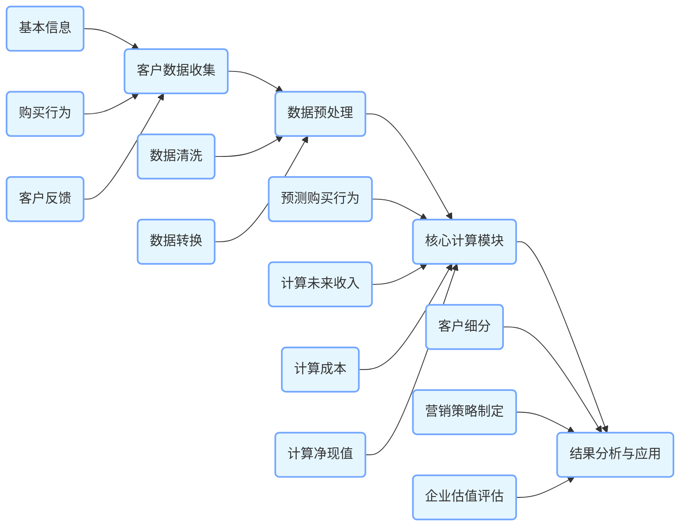

# 企业估值中的客户终身价值计算

> 关键词：企业估值、客户终身价值、计算方法、数学模型、实际应用

> 摘要：本文围绕企业估值中的客户终身价值计算展开深入探讨。首先介绍了该研究的背景，包括目的、预期读者、文档结构和相关术语。接着阐述了客户终身价值的核心概念、联系以及其架构和流程。详细讲解了核心算法原理，并通过Python代码进行示例。对涉及的数学模型和公式进行了深入分析和举例说明。在项目实战部分，给出了开发环境搭建、源代码实现和代码解读。同时探讨了客户终身价值计算在实际中的应用场景，推荐了学习资源、开发工具框架以及相关论文著作。最后总结了未来发展趋势与挑战，还设置了常见问题解答和扩展阅读参考资料，旨在为企业准确计算客户终身价值并合理进行企业估值提供全面的指导。

## 1. 背景介绍 
### 1.1 目的和范围
在当今竞争激烈的商业环境中，企业的价值不仅仅取决于其现有的资产和当前的收入，客户作为企业重要的资源，其带来的长期价值对企业的整体估值有着至关重要的影响。客户终身价值（Customer Lifetime Value，CLV）计算的目的就是通过量化客户在其与企业的整个关系周期内为企业带来的净收益，为企业的战略决策、营销资源分配、产品开发等提供有力的依据。

本文章的范围主要涵盖客户终身价值的基本概念、计算方法、相关数学模型、实际应用案例以及与之相关的学习资源和工具推荐等方面。旨在帮助企业管理者、市场营销人员、投资者以及相关研究人员深入理解客户终身价值的计算原理和应用，从而更准确地评估企业的价值。

### 1.2 预期读者
- **企业管理者**：他们需要了解客户终身价值来制定企业的发展战略、资源分配计划以及评估不同业务线的价值。
- **市场营销人员**：利用客户终身价值来优化营销活动，确定目标客户群体，提高营销效率和投资回报率。
- **投资者**：在评估企业的投资价值时，客户终身价值是一个重要的参考指标，有助于他们做出更明智的投资决策。
- **研究人员**：对客户关系管理、企业估值等领域进行深入研究的学者和专业人士，本文可为他们的研究提供理论和实践基础。

### 1.3 文档结构概述
本文将按照以下结构进行组织：
- 核心概念与联系：介绍客户终身价值的基本概念、相关联系以及其架构和流程。
- 核心算法原理 & 具体操作步骤：详细讲解计算客户终身价值的核心算法，并通过Python代码进行示例。
- 数学模型和公式 & 详细讲解 & 举例说明：对涉及的数学模型和公式进行深入分析，并通过具体例子进行说明。
- 项目实战：代码实际案例和详细解释说明，包括开发环境搭建、源代码实现和代码解读。
- 实际应用场景：探讨客户终身价值计算在实际中的应用场景。
- 工具和资源推荐：推荐相关的学习资源、开发工具框架以及论文著作。
- 总结：未来发展趋势与挑战：总结客户终身价值计算的未来发展趋势以及面临的挑战。
- 附录：常见问题与解答：解答读者在学习和应用过程中可能遇到的常见问题。
- 扩展阅读 & 参考资料：提供进一步学习和研究的扩展阅读资料和参考书目。

### 1.4 术语表
#### 1.4.1 核心术语定义
- **客户终身价值（Customer Lifetime Value，CLV）**：指客户在其与企业的整个关系周期内为企业带来的净收益的现值。它考虑了客户的历史购买行为、未来购买潜力以及客户忠诚度等因素。
- **客户获取成本（Customer Acquisition Cost，CAC）**：企业为了获取一个新客户所花费的平均成本，包括营销费用、销售费用等。
- **客户留存率（Customer Retention Rate，CRR）**：在一定时期内，企业能够保留的客户比例。它反映了客户对企业的忠诚度和满意度。
- **客户流失率（Customer Churn Rate，CCR）**：与客户留存率相反，指在一定时期内，企业失去的客户比例。
- **贴现率（Discount Rate）**：用于将未来的现金流折算为现值的利率。由于货币具有时间价值，未来的现金流需要通过贴现率进行调整，以反映其当前的价值。

#### 1.4.2 相关概念解释
- **客户生命周期（Customer Lifecycle）**：客户与企业从初次接触到最终流失的整个过程，通常包括潜在客户、新客户、活跃客户、流失客户等阶段。
- **客户细分（Customer Segmentation）**：根据客户的特征、行为、需求等因素将客户划分为不同的群体，以便企业能够针对不同的客户群体制定个性化的营销策略和服务方案。
- **终身价值预测（Lifetime Value Prediction）**：利用历史数据和统计模型对客户未来的终身价值进行预测，帮助企业提前做出决策。

#### 1.4.3 缩略词列表
| 缩略词 | 英文全称 | 中文全称 |
| ---- | ---- | ---- |
| CLV | Customer Lifetime Value | 客户终身价值 |
| CAC | Customer Acquisition Cost | 客户获取成本 |
| CRR | Customer Retention Rate | 客户留存率 |
| CCR | Customer Churn Rate | 客户流失率 |

## 2. 核心概念与联系 

### 核心概念原理
客户终身价值的核心原理是基于客户与企业之间的长期关系。企业通过向客户提供产品或服务来获取收入，同时需要投入一定的成本来获取和维护客户关系。客户终身价值就是在考虑了这些收入和成本的基础上，计算出客户在其整个生命周期内为企业带来的净收益。

从经济学的角度来看，客户终身价值是一种未来现金流的折现。由于货币具有时间价值，未来的收入和成本需要通过贴现率进行调整，以反映其当前的价值。因此，客户终身价值的计算需要考虑客户的购买频率、平均购买金额、客户留存率以及贴现率等因素。

### 架构的文本示意图
客户终身价值的计算涉及多个环节和因素，其架构可以用以下文本示意图表示：

```plaintext
客户终身价值计算架构
|-- 客户数据收集
|   |-- 基本信息（年龄、性别、地域等）
|   |-- 购买行为（购买频率、购买金额、购买时间等）
|   |-- 客户反馈（满意度、忠诚度等）
|-- 数据预处理
|   |-- 数据清洗（去除重复数据、处理缺失值等）
|   |-- 数据转换（标准化、归一化等）
|-- 核心计算模块
|   |-- 预测客户未来购买行为
|   |-- 计算客户未来收入
|   |-- 计算客户获取和维护成本
|   |-- 考虑贴现率计算净现值
|-- 结果分析与应用
|   |-- 客户细分
|   |-- 营销策略制定
|   |-- 企业估值评估
```

### Mermaid 流程图


## 3. 核心算法原理 & 具体操作步骤 

### 核心算法原理
客户终身价值的计算方法有多种，其中一种常用的方法是基于历史数据的预测模型。该模型的基本思想是通过分析客户的历史购买行为，预测客户未来的购买频率、平均购买金额和客户留存率，然后计算客户未来的收入和成本，最后考虑贴现率计算客户终身价值的净现值。

具体来说，核心算法可以分为以下几个步骤：
1. **预测客户未来购买频率**：根据客户的历史购买数据，使用时间序列分析、机器学习等方法预测客户未来的购买频率。
2. **预测客户未来平均购买金额**：同样基于客户的历史购买数据，预测客户未来每次购买的平均金额。
3. **计算客户未来收入**：将预测的购买频率和平均购买金额相乘，得到客户未来每年的收入。
4. **计算客户获取和维护成本**：包括营销费用、销售费用、客户服务费用等，根据企业的实际情况进行估算。
5. **考虑贴现率计算净现值**：将未来每年的收入和成本进行贴现，得到客户终身价值的净现值。

### 具体操作步骤及 Python 代码示例
以下是一个简单的 Python 代码示例，用于计算客户终身价值：

```python
import numpy as np

def calculate_clv(
    avg_purchase_amount,  # 平均购买金额
    purchase_frequency,   # 购买频率
    retention_rate,       # 客户留存率
    acquisition_cost,     # 客户获取成本
    discount_rate,        # 贴现率
    years=5               # 预测年限
):
    # 初始化客户终身价值为负的客户获取成本
    clv = -acquisition_cost
    for year in range(1, years + 1):
        # 计算每年的收入
        revenue = avg_purchase_amount * purchase_frequency
        # 考虑客户留存率，计算留存客户的收入
        retained_revenue = revenue * (retention_rate ** year)
        # 计算每年收入的现值
        present_value = retained_revenue / ((1 + discount_rate) ** year)
        # 累加现值到客户终身价值
        clv += present_value
    return clv

# 示例数据
avg_purchase_amount = 100
purchase_frequency = 4
retention_rate = 0.8
acquisition_cost = 200
discount_rate = 0.1

# 计算客户终身价值
clv = calculate_clv(
    avg_purchase_amount,
    purchase_frequency,
    retention_rate,
    acquisition_cost,
    discount_rate
)

print(f"客户终身价值: {clv:.2f} 元")
```

### 代码解释
1. **函数定义**：`calculate_clv` 函数接受平均购买金额、购买频率、客户留存率、客户获取成本、贴现率和预测年限作为输入参数。
2. **初始化客户终身价值**：将客户终身价值初始化为负的客户获取成本，因为在获取客户时需要投入成本。
3. **循环计算每年的收入和现值**：使用 `for` 循环遍历预测年限，计算每年的收入，并考虑客户留存率，计算留存客户的收入。然后将每年的收入进行贴现，得到现值，并累加到客户终身价值中。
4. **返回结果**：最后返回计算得到的客户终身价值。

## 4. 数学模型和公式 & 详细讲解 & 举例说明 

### 数学模型和公式
客户终身价值的数学模型可以用以下公式表示：

$$
CLV = -CAC + \sum_{t=1}^{T} \frac{R_t \times CRR^t}{(1 + r)^t}
$$

其中：
- $CLV$ 表示客户终身价值；
- $CAC$ 表示客户获取成本；
- $T$ 表示预测年限；
- $R_t$ 表示第 $t$ 年的客户收入，$R_t = 平均购买金额 \times 购买频率$；
- $CRR$ 表示客户留存率；
- $r$ 表示贴现率。

### 详细讲解
- **负的客户获取成本**：在计算客户终身价值时，首先需要减去客户获取成本，因为这是企业在获取客户时的初始投入。
- **未来收入的累加**：通过对未来每年的收入进行累加，考虑了客户在整个生命周期内为企业带来的收入。
- **客户留存率的影响**：客户留存率 $CRR$ 的 $t$ 次方表示随着时间的推移，客户继续与企业保持关系的概率。随着时间的增加，客户留存率会逐渐降低，因此未来收入也会相应减少。
- **贴现率的作用**：贴现率 $r$ 用于将未来的现金流折算为现值。由于货币具有时间价值，未来的收入需要通过贴现率进行调整，以反映其当前的价值。

### 举例说明
假设一家电商企业的客户获取成本为 200 元，平均每个客户每次购买金额为 100 元，购买频率为每年 4 次，客户留存率为 0.8，贴现率为 0.1，预测年限为 5 年。

首先，计算每年的收入 $R_t$：
$R_t = 100 \times 4 = 400$（元）

然后，根据公式计算客户终身价值：

$$
\begin{align*}
CLV &= -200 + \sum_{t=1}^{5} \frac{400 \times 0.8^t}{(1 + 0.1)^t}\\
&= -200 + \frac{400 \times 0.8^1}{(1 + 0.1)^1} + \frac{400 \times 0.8^2}{(1 + 0.1)^2} + \frac{400 \times 0.8^3}{(1 + 0.1)^3} + \frac{400 \times 0.8^4}{(1 + 0.1)^4} + \frac{400 \times 0.8^5}{(1 + 0.1)^5}\\
&\approx -200 + 290.91 + 207.92 + 147.87 + 104.84 + 74.96\\
&\approx 626.50
\end{align*}
$$

因此，该电商企业每个客户的终身价值约为 626.50 元。

## 5. 项目实战：代码实际案例和详细解释说明 

### 5.1 开发环境搭建
为了运行上述的 Python 代码，需要搭建相应的开发环境。以下是具体的步骤：

#### 安装 Python
首先，需要安装 Python 解释器。可以从 Python 官方网站（https://www.python.org/downloads/）下载适合自己操作系统的 Python 版本，并按照安装向导进行安装。

#### 安装开发工具
推荐使用 Anaconda 作为 Python 的开发环境管理工具。Anaconda 集成了许多常用的 Python 库和工具，方便进行数据处理和分析。可以从 Anaconda 官方网站（https://www.anaconda.com/products/individual）下载并安装 Anaconda。

#### 创建虚拟环境
为了避免不同项目之间的依赖冲突，建议创建一个虚拟环境。可以使用以下命令创建一个名为 `clv_project` 的虚拟环境：

```bash
conda create -n clv_project python=3.8
```

激活虚拟环境：

```bash
conda activate clv_project
```

### 5.2 源代码详细实现和代码解读
以下是一个更完整的 Python 代码示例，用于计算客户终身价值，并对不同客户群体进行分析：

```python
import numpy as np
import pandas as pd

# 定义计算客户终身价值的函数
def calculate_clv(
    avg_purchase_amount,
    purchase_frequency,
    retention_rate,
    acquisition_cost,
    discount_rate,
    years=5
):
    clv = -acquisition_cost
    for year in range(1, years + 1):
        revenue = avg_purchase_amount * purchase_frequency
        retained_revenue = revenue * (retention_rate ** year)
        present_value = retained_revenue / ((1 + discount_rate) ** year)
        clv += present_value
    return clv

# 示例客户数据
data = {
    '客户ID': [1, 2, 3, 4, 5],
    '平均购买金额': [100, 150, 200, 80, 120],
    '购买频率': [4, 3, 2, 5, 3],
    '客户留存率': [0.8, 0.7, 0.9, 0.6, 0.8],
    '客户获取成本': [200, 250, 300, 150, 220],
    '贴现率': [0.1, 0.1, 0.1, 0.1, 0.1]
}

# 创建 DataFrame
df = pd.DataFrame(data)

# 计算每个客户的终身价值
df['客户终身价值'] = df.apply(
    lambda row: calculate_clv(
        row['平均购买金额'],
        row['购买频率'],
        row['客户留存率'],
        row['客户获取成本'],
        row['贴现率']
    ),
    axis=1
)

# 打印结果
print(df[['客户ID', '客户终身价值']])
```

### 代码解读与分析
1. **导入必要的库**：导入 `numpy` 和 `pandas` 库，用于数据处理和分析。
2. **定义计算客户终身价值的函数**：`calculate_clv` 函数与前面的示例相同，用于计算单个客户的终身价值。
3. **创建示例客户数据**：使用字典 `data` 存储示例客户数据，包括客户 ID、平均购买金额、购买频率、客户留存率、客户获取成本和贴现率。
4. **创建 DataFrame**：使用 `pandas` 的 `DataFrame` 函数将示例数据转换为数据框，方便进行数据处理和分析。
5. **计算每个客户的终身价值**：使用 `DataFrame` 的 `apply` 方法，将 `calculate_clv` 函数应用到每一行数据上，计算每个客户的终身价值，并将结果存储在新的列 `客户终身价值` 中。
6. **打印结果**：打印出客户 ID 和对应的客户终身价值，方便查看计算结果。

通过这个示例代码，可以看到如何使用 Python 对多个客户的终身价值进行计算和分析。在实际应用中，可以根据具体需求对代码进行扩展和优化，例如使用更复杂的预测模型来预测客户的购买行为和留存率。

## 6. 实际应用场景 
客户终身价值的计算在企业的多个方面都有重要的应用，以下是一些常见的实际应用场景：

### 市场营销决策
- **客户细分**：通过计算客户终身价值，可以将客户分为不同的群体，例如高价值客户、中价值客户和低价值客户。针对不同价值的客户群体，企业可以制定个性化的营销策略，提高营销效果和投资回报率。
- **营销资源分配**：根据客户终身价值的大小，企业可以合理分配营销资源。对于高价值客户，可以投入更多的资源进行客户关系维护和深度营销；对于低价值客户，可以采取低成本的营销策略，或者考虑放弃一些价值极低的客户。
- **营销活动评估**：在评估营销活动的效果时，客户终身价值可以作为一个重要的指标。通过比较营销活动前后客户终身价值的变化，可以判断营销活动是否真正提高了客户的价值。

### 产品开发与优化
- **产品定位**：了解不同客户群体的终身价值，可以帮助企业确定产品的定位和目标客户群体。对于高价值客户群体，企业可以开发高端、个性化的产品；对于低价值客户群体，可以开发性价比高的产品。
- **产品功能优化**：根据客户终身价值的反馈，企业可以对产品的功能进行优化。例如，对于高价值客户经常使用的功能，可以进一步加强和完善；对于低价值客户不关心的功能，可以考虑简化或删除。

### 客户关系管理
- **客户留存策略**：客户终身价值高的客户是企业的重要资产，企业需要采取有效的客户留存策略来保持与这些客户的长期关系。例如，提供优质的客户服务、个性化的优惠活动、专属的会员权益等。
- **客户流失预警**：通过监控客户终身价值的变化，可以及时发现客户流失的迹象。当客户的终身价值出现明显下降时，企业可以及时采取措施进行挽留，例如发送关怀邮件、提供特别优惠等。

### 企业估值与投资决策
- **企业估值**：客户终身价值是企业估值的重要组成部分。在评估企业的价值时，考虑客户的长期价值可以更准确地反映企业的真实价值。投资者可以根据客户终身价值的大小来判断企业的投资潜力和未来发展前景。
- **投资决策**：对于投资者来说，客户终身价值可以作为投资决策的重要参考指标。在选择投资项目时，投资者可以优先考虑那些客户终身价值高、客户忠诚度高的企业。

## 7. 工具和资源推荐
### 7.1 学习资源推荐
#### 7.1.1 书籍推荐
- 《客户关系管理：战略、技术与实践》：本书系统地介绍了客户关系管理的基本概念、战略和技术，包括客户终身价值的计算和应用。
- 《营销数据分析：模型与算法》：书中详细讲解了营销数据分析的各种模型和算法，其中包括客户终身价值的预测模型和计算方法。
- 《数据挖掘：概念与技术》：这本书是数据挖掘领域的经典教材，介绍了数据挖掘的基本概念、算法和应用，对于理解客户终身价值计算中的数据处理和建模有很大的帮助。

#### 7.1.2 在线课程
- Coursera 上的“Customer Analytics”课程：该课程由知名大学的教授授课，深入讲解了客户分析的理论和实践，包括客户终身价值的计算和应用。
- edX 上的“Data Science for Business”课程：课程涵盖了数据科学在商业中的应用，包括客户分析、市场细分等内容，对客户终身价值的计算有详细的介绍。
- Udemy 上的“Customer Lifetime Value Calculation and Analysis”课程：专门针对客户终身价值的计算和分析进行讲解，通过实际案例和代码演示，帮助学员掌握相关技能。

#### 7.1.3 技术博客和网站
- Towards Data Science：这是一个专注于数据科学和机器学习的技术博客，上面有很多关于客户分析和客户终身价值计算的文章，内容丰富且具有一定的深度。
- Marketing Analytics Blog：该博客主要关注营销数据分析领域，经常分享客户终身价值计算的最新方法和案例。
- Harvard Business Review：哈佛商业评论是全球知名的商业杂志，上面有很多关于企业战略、市场营销和客户关系管理的文章，其中也涉及到客户终身价值的相关内容。

### 7.2 开发工具框架推荐
#### 7.2.1 IDE和编辑器
- PyCharm：是一款专业的 Python 集成开发环境，具有强大的代码编辑、调试和项目管理功能，适合开发复杂的 Python 项目。
- Jupyter Notebook：是一个交互式的开发环境，支持多种编程语言，尤其适合数据处理和分析。可以在 Jupyter Notebook 中进行代码编写、数据可视化和结果展示。
- Visual Studio Code：是一款轻量级的代码编辑器，具有丰富的插件生态系统。可以通过安装 Python 相关的插件，将其打造成一个强大的 Python 开发环境。

#### 7.2.2 调试和性能分析工具
- pdb：是 Python 自带的调试工具，可以在代码中设置断点，逐步执行代码，帮助开发者找出代码中的问题。
- cProfile：是 Python 标准库中的性能分析工具，可以统计代码的执行时间和函数调用次数，帮助开发者找出代码中的性能瓶颈。
- Py-Spy：是一个轻量级的 Python 性能分析工具，可以实时监控 Python 程序的性能，无需修改代码。

#### 7.2.3 相关框架和库
- Pandas：是一个强大的数据处理和分析库，提供了高效的数据结构和数据操作方法，非常适合处理客户数据。
- NumPy：是 Python 中用于科学计算的基础库，提供了高效的数组操作和数学函数，在客户终身价值计算中可以用于数值计算。
- Scikit-learn：是一个常用的机器学习库，提供了各种机器学习算法和工具，可用于客户终身价值的预测和建模。

### 7.3 相关论文著作推荐
#### 7.3.1 经典论文
- “Managing Customers as Investments: The Strategic Value of Customers in Long - Term Relationships”：该论文首次提出了将客户视为企业的投资，强调了客户终身价值在企业战略中的重要性。
- “Customer Lifetime Value: Marketing Models and Applications”：这篇论文系统地介绍了客户终身价值的计算模型和应用方法，是客户终身价值研究领域的经典之作。

#### 7.3.2 最新研究成果
- 在顶级学术期刊如《Journal of Marketing》、《Marketing Science》等上，经常会发表关于客户终身价值的最新研究成果，包括新的计算模型、预测方法和应用案例等。
- 国际知名的学术会议如 INFORMS Marketing Science Conference 也会有关于客户分析和客户终身价值的专题报告和研究分享。

#### 7.3.3 应用案例分析
- 《Customer Experience Management: A Practical Guide》：书中包含了多个企业的客户体验管理案例，其中不乏客户终身价值计算和应用的案例分析，对于实际应用具有很好的参考价值。
- 一些知名咨询公司如麦肯锡、波士顿咨询集团等会发布关于企业战略和市场营销的研究报告，其中也会涉及到客户终身价值在企业中的应用案例。

## 8. 总结：未来发展趋势与挑战
### 未来发展趋势
- **多渠道数据融合**：随着企业与客户之间的交互渠道越来越多样化，未来客户终身价值的计算将需要融合更多渠道的数据，如线上线下销售数据、社交媒体数据、客户服务数据等，以更全面地了解客户的行为和需求。
- **人工智能和机器学习的应用**：人工智能和机器学习技术将在客户终身价值计算中发挥越来越重要的作用。例如，使用深度学习模型可以更准确地预测客户的未来购买行为和留存率；使用强化学习可以优化企业的营销策略，提高客户终身价值。
- **实时计算和动态调整**：传统的客户终身价值计算通常是基于历史数据进行的，具有一定的滞后性。未来，企业将需要实现实时计算客户终身价值，并根据客户的实时行为和市场变化动态调整营销策略，以提高企业的竞争力。
- **跨行业应用拓展**：客户终身价值的计算不仅局限于传统的零售、金融等行业，未来将在更多行业得到应用，如医疗、教育、娱乐等。不同行业可以根据自身的特点和需求，对客户终身价值的计算方法进行调整和优化。

### 挑战
- **数据质量和安全问题**：客户终身价值的计算依赖于大量的客户数据，数据的质量和安全是关键问题。企业需要确保数据的准确性、完整性和及时性，同时要加强数据安全保护，防止客户数据泄露。
- **模型复杂度和可解释性**：随着人工智能和机器学习技术的应用，客户终身价值的计算模型越来越复杂。然而，复杂的模型往往缺乏可解释性，企业难以理解模型的决策过程和结果，这给实际应用带来了一定的困难。
- **市场变化和不确定性**：市场环境是不断变化的，客户的行为和需求也具有不确定性。如何在复杂多变的市场环境中准确地计算客户终身价值，并及时调整营销策略，是企业面临的一大挑战。
- **组织文化和团队协作**：客户终身价值的计算和应用需要企业内部多个部门的协作，如市场营销、销售、客户服务、数据分析等。然而，不同部门之间的目标和利益可能存在冲突，如何建立良好的组织文化和团队协作机制，是企业实现客户终身价值最大化的关键。

## 9. 附录：常见问题与解答
### 问题 1：客户终身价值计算中，贴现率应该如何选择？
贴现率的选择需要考虑多个因素，包括企业的资金成本、市场利率、投资风险等。一般来说，可以参考企业的加权平均资本成本（WACC）来确定贴现率。如果企业的投资风险较高，可以适当提高贴现率；如果投资风险较低，可以降低贴现率。

### 问题 2：客户留存率和客户流失率有什么关系？
客户留存率和客户流失率是互补的关系，它们的和为 1。即：$客户留存率 + 客户流失率 = 1$。例如，如果客户留存率为 0.8，则客户流失率为 0.2。

### 问题 3：如何提高客户终身价值？
提高客户终身价值可以从以下几个方面入手：
- **提高客户满意度和忠诚度**：通过提供优质的产品和服务，满足客户的需求，提高客户的满意度和忠诚度，从而增加客户的购买频率和购买金额。
- **优化营销策略**：针对不同价值的客户群体，制定个性化的营销策略，提高营销效果和投资回报率。
- **降低客户获取成本**：通过优化营销渠道、提高营销效率等方式，降低客户获取成本。
- **延长客户生命周期**：采取有效的客户留存策略，减少客户流失，延长客户与企业的关系周期。

### 问题 4：客户终身价值计算的结果是否准确？
客户终身价值的计算结果是基于一定的假设和模型的，存在一定的不确定性。计算结果的准确性受到数据质量、模型选择、市场变化等多种因素的影响。因此，在实际应用中，需要结合企业的实际情况和经验，对计算结果进行合理的分析和判断。

## 10. 扩展阅读 & 参考资料
### 扩展阅读
- 《客户体验经济》：深入探讨了客户体验在企业中的重要性，以及如何通过提升客户体验来提高客户终身价值。
- 《增长黑客：如何低成本实现爆发式成长》：介绍了一些创新的营销方法和策略，对于提高客户获取和客户终身价值具有一定的启发作用。

### 参考资料
- Kotler, P., & Armstrong, G. (2018). Principles of Marketing. Pearson.
- Gupta, S., & Lehmann, D. R. (2003). Managing Customers as Investments: The Strategic Value of Customers in Long - Term Relationships. Journal of Marketing, 67(4), 106 - 125.
- Berger, P. D., & Nasr, N. I. (1998). Customer Lifetime Value: Marketing Models and Applications. Journal of Interactive Marketing, 12(1), 17 - 30.

作者：AI天才研究院/AI Genius Institute & 禅与计算机程序设计艺术 /Zen And The Art of Computer Programming