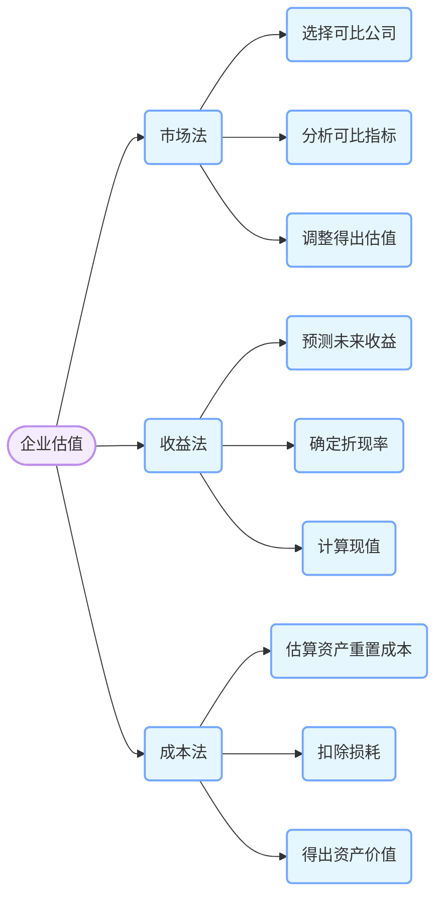

# 企业估值中的常见误区及解决方案

> 关键词：企业估值、常见误区、解决方案、估值方法、财务分析

> 摘要：本文聚焦于企业估值领域，深入剖析了企业估值过程中存在的常见误区，如估值方法选择不当、过度依赖财务数据、忽略非财务因素等。通过详细的理论分析和实际案例研究，阐述了这些误区产生的原因及可能带来的后果。同时，针对每个误区提出了切实可行的解决方案，旨在帮助投资者、企业管理者等相关人员提高企业估值的准确性和可靠性，做出更为合理的决策。

## 1. 背景介绍 
### 1.1 目的和范围
企业估值是投资决策、企业并购、股权交易等经济活动中的关键环节，准确的估值对于各方利益相关者至关重要。然而，在实际操作中，由于各种因素的影响，企业估值往往容易陷入一些误区，导致估值结果与企业的真实价值存在偏差。本文的目的在于系统地梳理企业估值中的常见误区，并提供相应的解决方案，以提高企业估值的质量。本文的范围涵盖了常见的企业估值方法，包括市场法、收益法和成本法，以及在估值过程中需要考虑的财务和非财务因素。

### 1.2 预期读者
本文的预期读者主要包括投资者、企业管理者、财务分析师、并购顾问等与企业估值相关的专业人士，以及对企业估值感兴趣的学生和研究人员。通过阅读本文，读者可以深入了解企业估值中的常见问题，并学习如何避免这些误区，从而提高自身在企业估值方面的能力。

### 1.3 文档结构概述
本文将按照以下结构进行组织：首先介绍企业估值的核心概念和各种估值方法之间的联系；接着详细阐述核心算法原理和具体操作步骤，并通过 Python 代码进行说明；然后介绍企业估值中涉及的数学模型和公式，并结合实际例子进行讲解；随后通过项目实战展示代码的实际应用和详细解释；之后分析企业估值在不同场景下的实际应用；再推荐一些学习企业估值的工具和资源；最后总结企业估值的未来发展趋势与挑战，并提供常见问题的解答和扩展阅读资料。

### 1.4 术语表
#### 1.4.1 核心术语定义
- **企业估值**：指对企业整体价值进行评估和估算的过程，通常基于企业的财务状况、经营业绩、市场前景等因素。
- **市场法**：通过比较被估值企业与类似企业在市场上的交易价格，来确定被估值企业的价值。
- **收益法**：基于企业未来预期收益的现值来评估企业价值的方法。
- **成本法**：通过估算企业各项资产的重置成本，减去各项损耗，来确定企业的价值。

#### 1.4.2 相关概念解释
- **可比公司**：在市场法中，与被估值企业在业务、规模、财务状况等方面具有相似性的其他企业。
- **折现率**：在收益法中，用于将未来收益折算为现值的比率，反映了资金的时间价值和投资风险。
- **资产重置成本**：在成本法中，重新购置或建造与被评估资产具有相同用途和功能的全新资产所需的成本。

#### 1.4.3 缩略词列表
- **DCF**：Discounted Cash Flow，折现现金流法，是收益法的一种常见形式。
- **P/E**：Price-to-Earnings Ratio，市盈率，是市场法中常用的估值指标。
- **PB**：Price-to-Book Ratio，市净率，也是市场法中常用的估值指标。

## 2. 核心概念与联系 

企业估值的核心概念主要围绕市场法、收益法和成本法展开。下面是对这三种方法的原理和架构的文本示意图以及 Mermaid 流程图。

### 原理和架构的文本示意图
- **市场法**：市场法的基本原理是基于市场的有效性，认为在市场上类似的企业应该具有相似的价值。通过寻找与被估值企业可比的公司，分析这些可比公司的市场交易价格和相关财务指标，如市盈率、市净率等，然后根据被估值企业的相应指标进行调整，从而得出被估值企业的价值。
- **收益法**：收益法的核心思想是企业的价值在于其未来能够产生的经济利益。通过预测企业未来的收益，并选择合适的折现率将这些未来收益折算为现值，加总后得到企业的价值。常用的收益法包括折现现金流法（DCF）等。
- **成本法**：成本法是从企业资产的角度出发，认为企业的价值等于其各项资产的重置成本减去各项损耗后的余额。这种方法主要适用于那些资产价值占比较大、经营活动相对简单的企业。

这三种方法之间存在一定的联系和区别。市场法和收益法都更注重企业的未来发展潜力和市场表现，而成本法更侧重于企业的现有资产价值。在实际应用中，通常会综合使用多种方法，以提高估值的准确性。

### Mermaid 流程图


## 3. 核心算法原理 & 具体操作步骤 

### 市场法
#### 算法原理
市场法的核心是通过比较被估值企业与可比公司的估值指标来确定被估值企业的价值。常用的估值指标包括市盈率（P/E）、市净率（PB）等。以市盈率为例，其计算公式为：

$$P/E = \frac{股价}{每股收益}$$

通过计算可比公司的平均市盈率，然后乘以被估值企业的每股收益，即可得到被估值企业的大致价值。

#### 具体操作步骤
1. **选择可比公司**：从市场上筛选出与被估值企业在业务、规模、财务状况等方面具有相似性的公司。
2. **收集数据**：收集可比公司的股价、每股收益等相关数据。
3. **计算可比公司的平均估值指标**：例如，计算可比公司的平均市盈率。
4. **确定被估值企业的相应指标**：获取被估值企业的每股收益。
5. **计算被估值企业的价值**：用平均市盈率乘以被估值企业的每股收益。

#### Python 代码实现
```python
# 可比公司的股价和每股收益
comparable_prices = [20, 25, 30]
comparable_eps = [2, 2.5, 3]

# 计算可比公司的市盈率
pe_ratios = [price / eps for price, eps in zip(comparable_prices, comparable_eps)]

# 计算平均市盈率
average_pe = sum(pe_ratios) / len(pe_ratios)

# 被估值企业的每股收益
target_eps = 2.2

# 计算被估值企业的价值
target_value = average_pe * target_eps

print(f"被估值企业的价值为: {target_value}")
```

### 收益法（以折现现金流法为例）
#### 算法原理
折现现金流法（DCF）的基本原理是将企业未来各期的自由现金流按照一定的折现率折现到当前时刻，然后加总得到企业的价值。其计算公式为：

$$V = \sum_{t=1}^{n} \frac{FCF_t}{(1 + r)^t}$$

其中，$V$ 表示企业的价值，$FCF_t$ 表示第 $t$ 期的自由现金流，$r$ 表示折现率，$n$ 表示预测期数。

#### 具体操作步骤
1. **预测未来自由现金流**：根据企业的历史财务数据和未来发展规划，预测企业未来各期的自由现金流。
2. **确定折现率**：折现率反映了资金的时间价值和投资风险，通常可以采用加权平均资本成本（WACC）作为折现率。
3. **计算各期自由现金流的现值**：将各期的自由现金流按照折现率折现到当前时刻。
4. **加总各期现值**：将各期自由现金流的现值相加，得到企业的价值。

#### Python 代码实现
```python
# 预测的未来自由现金流
fcf = [100, 120, 150, 180, 200]

# 折现率
discount_rate = 0.1

# 计算各期自由现金流的现值
present_values = [cf / (1 + discount_rate) ** (i + 1) for i, cf in enumerate(fcf)]

# 计算企业的价值
enterprise_value = sum(present_values)

print(f"企业的价值为: {enterprise_value}")
```

### 成本法
#### 算法原理
成本法的核心是估算企业各项资产的重置成本，减去各项损耗，得到企业的价值。其计算公式为：

$$V = \sum_{i=1}^{m} RC_i - \sum_{j=1}^{k} D_j$$

其中，$V$ 表示企业的价值，$RC_i$ 表示第 $i$ 项资产的重置成本，$D_j$ 表示第 $j$ 项损耗。

#### 具体操作步骤
1. **估算资产重置成本**：对企业的各项资产进行评估，确定其重置成本。
2. **确定损耗**：考虑资产的有形损耗和无形损耗，确定各项损耗的金额。
3. **计算企业价值**：用资产重置成本减去损耗，得到企业的价值。

#### Python 代码实现
```python
# 各项资产的重置成本
asset_rc = [500, 300, 200]

# 各项损耗
asset_depreciation = [100, 50, 30]

# 计算企业的价值
enterprise_value = sum(asset_rc) - sum(asset_depreciation)

print(f"企业的价值为: {enterprise_value}")
```

## 4. 数学模型和公式 & 详细讲解 & 举例说明 

### 市场法
#### 数学模型和公式
如前文所述，市场法常用的估值指标包括市盈率（P/E）和市净率（PB）。

市盈率公式：$$P/E = \frac{股价}{每股收益}$$

市净率公式：$$PB = \frac{股价}{每股净资产}$$

#### 详细讲解
市盈率反映了市场对企业盈利的预期，较高的市盈率通常表示市场对企业未来盈利增长的预期较高。市净率则反映了市场对企业净资产的估值，市净率大于 1 表示市场对企业的估值高于其净资产价值。

#### 举例说明
假设可比公司 A 的股价为 20 元，每股收益为 2 元，可比公司 B 的股价为 25 元，每股收益为 2.5 元。则可比公司 A 的市盈率为 $20 \div 2 = 10$，可比公司 B 的市盈率为 $25 \div 2.5 = 10$。平均市盈率为 10。被估值企业的每股收益为 2.2 元，则被估值企业的价值为 $10 \times 2.2 = 22$ 元。

### 收益法（以折现现金流法为例）
#### 数学模型和公式
折现现金流法的公式为：

$$V = \sum_{t=1}^{n} \frac{FCF_t}{(1 + r)^t}$$

#### 详细讲解
该公式中，$FCF_t$ 表示第 $t$ 期的自由现金流，$r$ 表示折现率，$n$ 表示预测期数。折现率反映了资金的时间价值和投资风险，预测期数通常根据企业的发展阶段和行业特点来确定。

#### 举例说明
假设企业未来 5 年的自由现金流分别为 100 万元、120 万元、150 万元、180 万元和 200 万元，折现率为 10%。则各期自由现金流的现值分别为：

第 1 期：$\frac{100}{(1 + 0.1)^1} \approx 90.91$（万元）

第 2 期：$\frac{120}{(1 + 0.1)^2} \approx 99.17$（万元）

第 3 期：$\frac{150}{(1 + 0.1)^3} \approx 112.70$（万元）

第 4 期：$\frac{180}{(1 + 0.1)^4} \approx 122.94$（万元）

第 5 期：$\frac{200}{(1 + 0.1)^5} \approx 124.18$（万元）

企业的价值为各期现值之和，即 $90.91 + 99.17 + 112.70 + 122.94 + 124.18 = 549.90$（万元）

### 成本法
#### 数学模型和公式
成本法的公式为：

$$V = \sum_{i=1}^{m} RC_i - \sum_{j=1}^{k} D_j$$

#### 详细讲解
该公式中，$RC_i$ 表示第 $i$ 项资产的重置成本，$D_j$ 表示第 $j$ 项损耗。重置成本是指重新购置或建造与被评估资产具有相同用途和功能的全新资产所需的成本，损耗包括有形损耗和无形损耗。

#### 举例说明
假设企业有三项资产，重置成本分别为 500 万元、300 万元和 200 万元，各项资产的损耗分别为 100 万元、50 万元和 30 万元。则企业的价值为 $(500 + 300 + 200) - (100 + 50 + 30) = 820$（万元）

## 5. 项目实战：代码实际案例和详细解释说明 

### 5.1  开发环境搭建
为了实现企业估值的代码，我们可以使用 Python 编程语言，并安装以下必要的库：
- **NumPy**：用于数值计算。
- **Pandas**：用于数据处理和分析。

可以使用以下命令来安装这些库：
```sh
pip install numpy pandas
```

### 5.2  源代码详细实现和代码解读
以下是一个综合使用市场法和收益法进行企业估值的代码示例：

```python
import numpy as np
import pandas as pd

# 市场法部分
# 可比公司数据
comparable_data = pd.DataFrame({
    '股价': [20, 25, 30],
    '每股收益': [2, 2.5, 3]
})

# 计算可比公司的市盈率
comparable_data['市盈率'] = comparable_data['股价'] / comparable_data['每股收益']

# 计算平均市盈率
average_pe = comparable_data['市盈率'].mean()

# 被估值企业的每股收益
target_eps = 2.2

# 市场法估值
market_value = average_pe * target_eps

# 收益法部分
# 预测的未来自由现金流
fcf = [100, 120, 150, 180, 200]

# 折现率
discount_rate = 0.1

# 计算各期自由现金流的现值
present_values = [cf / (1 + discount_rate) ** (i + 1) for i, cf in enumerate(fcf)]

# 收益法估值
income_value = sum(present_values)

# 综合估值（简单平均）
combined_value = (market_value + income_value) / 2

print(f"市场法估值: {market_value}")
print(f"收益法估值: {income_value}")
print(f"综合估值: {combined_value}")
```

### 5.3  代码解读与分析
- **市场法部分**：首先，我们使用 Pandas 库创建了一个包含可比公司股价和每股收益的数据框。然后，计算了可比公司的市盈率，并求出平均市盈率。最后，用平均市盈率乘以被估值企业的每股收益，得到市场法估值。
- **收益法部分**：定义了预测的未来自由现金流和折现率，通过列表推导式计算了各期自由现金流的现值，并将其相加得到收益法估值。
- **综合估值**：将市场法估值和收益法估值进行简单平均，得到综合估值。

需要注意的是，在实际应用中，可能需要根据具体情况对不同方法的估值结果进行加权平均，以更合理地反映企业的价值。

## 6. 实际应用场景 
企业估值在许多实际场景中都有着重要的应用，以下是一些常见的应用场景：

### 投资决策
投资者在进行股票投资、风险投资等活动时，需要对目标企业进行估值，以判断其是否具有投资价值。通过准确的估值，投资者可以避免高估或低估企业的价值，从而做出更为明智的投资决策。

### 企业并购
在企业并购过程中，估值是确定交易价格的关键依据。并购方需要对被并购企业进行估值，以评估并购的可行性和合理性。同时，被并购方也需要对自身价值进行评估，以争取更有利的交易条件。

### 股权交易
在股权交易中，如股权转让、增资扩股等，双方需要对企业的股权价值进行评估，以确定交易价格。合理的估值可以保障交易双方的利益，促进股权交易的顺利进行。

### 企业重组
企业在进行重组时，如合并、分立等，需要对相关企业的价值进行评估，以确定重组方案的合理性和可行性。准确的估值可以帮助企业优化资源配置，提高企业的竞争力。

### 财务报告
在企业的财务报告中，有时需要对企业的某些资产或业务进行估值，以反映其真实价值。例如，在对商誉进行减值测试时，需要对相关资产组的价值进行评估。

## 7. 工具和资源推荐
### 7.1 学习资源推荐
#### 7.1.1 书籍推荐
- 《价值评估：公司价值的衡量与管理》：这本书全面介绍了企业估值的理论和方法，包括市场法、收益法和成本法等，是企业估值领域的经典著作。
- 《投资中最简单的事》：虽然不是专门的企业估值书籍，但书中包含了许多关于估值和投资决策的实用方法和经验，对投资者和企业管理者有很大的启发。
- 《财务报表分析与证券定价》：帮助读者掌握财务报表分析的方法，从而更好地理解企业的财务状况和经营业绩，为企业估值提供基础。

#### 7.1.2 在线课程
- Coursera 上的“Corporate Finance”：由知名高校教授授课，系统介绍了企业财务和估值的相关知识。
- edX 上的“Valuation for Mergers, Buyouts and Restructuring”：专注于企业并购、收购和重组中的估值问题，具有很强的实践性。
- 中国大学 MOOC 上的“财务管理”：涵盖了企业估值的基本理论和方法，适合初学者学习。

#### 7.1.3 技术博客和网站
- Seeking Alpha：提供了大量关于企业估值和投资分析的文章和研究报告，有助于读者了解市场动态和最新的估值方法。
- Bloomberg：全球知名的金融信息服务提供商，提供丰富的金融数据和分析工具，可用于企业估值和市场研究。
- 雪球：国内知名的投资交流平台，有许多投资者分享企业估值和投资经验的文章和讨论。

### 7.2 开发工具框架推荐
#### 7.2.1 IDE和编辑器
- PyCharm：功能强大的 Python 集成开发环境，提供代码编辑、调试、版本控制等一系列功能，适合开发企业估值相关的 Python 代码。
- Jupyter Notebook：交互式的开发环境，方便进行数据分析和代码演示，适合在学习和研究企业估值时使用。

#### 7.2.2 调试和性能分析工具
- PDB：Python 自带的调试工具，可以帮助开发者定位代码中的问题。
- cProfile：Python 标准库中的性能分析工具，可以分析代码的运行时间和函数调用情况，帮助优化代码性能。

#### 7.2.3 相关框架和库
- NumPy：用于高效的数值计算，在企业估值的计算过程中经常会用到。
- Pandas：用于数据处理和分析，方便处理和整理企业的财务数据。
- Scikit-learn：提供了许多机器学习算法和工具，可以用于企业估值中的预测和建模。

### 7.3 相关论文著作推荐
#### 7.3.1 经典论文
- “The Capital Asset Pricing Model: Theory and Evidence”：介绍了资本资产定价模型（CAPM），该模型在企业估值中常用于确定折现率。
- “Dividend Policy, Growth, and the Valuation of Shares”：探讨了股利政策与企业价值之间的关系，对企业估值有重要的理论指导意义。

#### 7.3.2 最新研究成果
- 关注顶尖学术期刊，如《Journal of Finance》《Review of Financial Studies》等，这些期刊会发表关于企业估值的最新研究成果。

#### 7.3.3 应用案例分析
- 可以参考一些专业的财经媒体和研究机构发布的企业估值应用案例分析报告，了解不同行业和企业的估值方法和实践经验。

## 8. 总结：未来发展趋势与挑战
### 未来发展趋势
- **多元化估值方法的融合**：随着企业经营环境的日益复杂，单一的估值方法可能无法准确反映企业的真实价值。未来，将更多地采用多元化估值方法的融合，综合考虑市场、收益、成本等多个因素，以提高估值的准确性。
- **大数据和人工智能的应用**：大数据和人工智能技术的发展将为企业估值带来新的机遇。通过分析大量的企业数据和市场信息，利用人工智能算法可以更精准地预测企业的未来收益和风险，从而提高估值的可靠性。
- **非财务因素的重视**：除了传统的财务指标，未来企业估值将更加重视非财务因素，如企业的创新能力、品牌价值、管理团队素质等。这些非财务因素对企业的长期发展和价值创造具有重要影响。

### 挑战
- **数据质量和可靠性**：准确的企业估值依赖于高质量的数据。然而，在实际应用中，数据的质量和可靠性往往存在问题，如数据缺失、错误、不一致等。如何获取和处理高质量的数据是企业估值面临的一大挑战。
- **不确定性和风险的评估**：企业的未来发展充满不确定性和风险，如市场波动、技术变革、政策调整等。准确评估这些不确定性和风险，并将其纳入估值模型中，是企业估值的难点之一。
- **专业人才的短缺**：企业估值需要具备丰富的财务、金融、统计等知识的专业人才。目前，市场上这类专业人才相对短缺，如何培养和吸引更多的专业人才是企业估值行业面临的挑战之一。

## 9. 附录：常见问题与解答
### 问题 1：如何选择合适的估值方法？
解答：选择合适的估值方法需要考虑多个因素，如企业的行业特点、发展阶段、财务状况等。一般来说，对于成熟的企业，市场法和收益法可能更为适用；对于资产价值占比较大的企业，成本法可能更合适。在实际应用中，通常会综合使用多种方法，以提高估值的准确性。

### 问题 2：折现率的确定有哪些方法？
解答：折现率的确定方法有多种，常见的包括资本资产定价模型（CAPM）、加权平均资本成本（WACC）等。CAPM 通过考虑市场风险溢价、无风险利率和企业的贝塔系数来确定折现率；WACC 则综合考虑了企业的股权成本和债务成本。

### 问题 3：如何处理企业估值中的不确定性？
解答：处理企业估值中的不确定性可以采用多种方法，如敏感性分析、情景分析等。敏感性分析可以分析不同因素的变化对估值结果的影响程度；情景分析则可以设定不同的情景，评估企业在不同情景下的价值。

### 问题 4：企业估值结果与市场价格不一致怎么办？
解答：企业估值结果与市场价格不一致是常见的现象。这可能是由于市场情绪、信息不对称等因素导致的。在这种情况下，需要进一步分析估值结果和市场价格的合理性，结合企业的基本面和市场情况，做出合理的决策。

## 10. 扩展阅读 & 参考资料
- 《金融市场与金融机构》
- 《公司理财》
- 相关的行业研究报告和财经新闻

作者：AI天才研究院/AI Genius Institute & 禅与计算机程序设计艺术 /Zen And The Art of Computer Programming