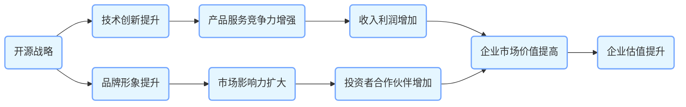

# 企业估值中的开源战略价值评估

> 关键词：企业估值、开源战略、价值评估、开源生态、财务模型

> 摘要：本文聚焦于企业估值中开源战略价值评估这一重要议题。随着开源运动的蓬勃发展，开源战略对于企业的影响日益显著，然而其价值在企业估值中尚未得到充分且准确的衡量。文章旨在深入探讨开源战略的核心概念与原理，剖析其在企业估值中的关键算法和数学模型，通过实际项目案例展示如何进行开源战略价值的评估，并介绍相关的应用场景、工具和资源。最后对开源战略价值评估的未来发展趋势与挑战进行总结，为企业在估值过程中更全面地考量开源战略价值提供理论和实践指导。

## 1. 背景介绍 
### 1.1 目的和范围
在当今数字化时代，开源软件和开源项目在全球范围内得到了广泛的应用和发展。许多企业纷纷采用开源战略，通过参与开源社区、贡献开源代码等方式来提升自身的竞争力和创新能力。然而，在传统的企业估值方法中，往往忽略了开源战略所带来的潜在价值。本文章的目的在于填补这一空白，探讨如何在企业估值中准确评估开源战略的价值。

本文的范围涵盖了开源战略的基本概念、开源战略对企业的影响机制、开源战略价值评估的方法和模型，以及实际应用案例和相关工具资源等方面。通过全面深入的研究，为企业管理者、投资者和相关研究人员提供有价值的参考。

### 1.2 预期读者
本文的预期读者包括企业管理者、投资者、财务分析师、开源社区开发者、研究机构人员以及对开源战略和企业估值感兴趣的人士。企业管理者可以通过本文了解如何在企业战略决策中更好地发挥开源战略的价值，并在估值过程中准确评估其贡献；投资者可以借助本文的方法和模型，更全面地评估企业的价值，做出更明智的投资决策；财务分析师可以将开源战略价值评估纳入其分析体系，提升分析的准确性和全面性；开源社区开发者可以了解企业对开源战略的需求和价值考量，促进开源项目与企业的更好结合；研究机构人员可以在本文的基础上开展更深入的研究；对开源战略和企业估值感兴趣的人士可以通过本文获得系统的知识和见解。

### 1.3 文档结构概述
本文共分为十个部分。第一部分为背景介绍，阐述了文章的目的和范围、预期读者、文档结构概述以及术语表。第二部分介绍核心概念与联系，包括开源战略、企业估值等核心概念的原理和架构，并通过文本示意图和 Mermaid 流程图进行展示。第三部分讲解核心算法原理和具体操作步骤，使用 Python 源代码详细阐述开源战略价值评估的算法。第四部分介绍数学模型和公式，并进行详细讲解和举例说明。第五部分通过项目实战，展示代码实际案例并进行详细解释说明，包括开发环境搭建、源代码详细实现和代码解读以及代码分析。第六部分介绍开源战略价值评估的实际应用场景。第七部分推荐相关的工具和资源，包括学习资源、开发工具框架和相关论文著作。第八部分总结开源战略价值评估的未来发展趋势与挑战。第九部分为附录，解答常见问题。第十部分提供扩展阅读和参考资料。

### 1.4 术语表
#### 1.4.1 核心术语定义
- **企业估值**：指对企业的整体价值进行评估的过程，通常基于企业的财务状况、市场前景、竞争力等多种因素，以确定企业在特定时间点的价值。
- **开源战略**：企业通过参与开源社区、贡献开源代码、基于开源技术进行创新等方式，实现自身发展目标的一种战略模式。
- **开源生态**：由开源软件、开源项目、开发者社区、用户群体等组成的一个相互依存、相互促进的生态系统。
- **开源战略价值**：开源战略为企业带来的经济价值、品牌价值、技术创新价值、市场竞争力提升价值等的总和。

#### 1.4.2 相关概念解释
- **开源软件**：其源代码可以被公众获取、使用、修改和再分发的软件。开源软件通常遵循开源许可证，允许用户自由地进行各种操作。
- **开源社区**：由开发者、用户和爱好者组成的社区，他们共同参与开源项目的开发、维护和推广。开源社区具有开放性、协作性和共享性的特点。
- **开源贡献**：企业或个人向开源项目提供代码、文档、测试等方面的支持和贡献。开源贡献可以提升企业在开源社区中的声誉和影响力。

#### 1.4.3 缩略词列表
- **OSS**：Open Source Software，开源软件
- **FOSS**：Free and Open Source Software，自由和开源软件

## 2. 核心概念与联系 

### 2.1 开源战略的原理和架构
开源战略的核心原理在于通过开放源代码，吸引全球范围内的开发者参与到项目的开发和改进中来。企业可以通过贡献开源代码，展示自身的技术实力和创新能力，吸引更多的开发者和用户关注，从而形成一个活跃的开源生态。

开源战略的架构主要包括以下几个方面：
- **开源项目的选择**：企业需要根据自身的战略目标和技术优势，选择合适的开源项目进行参与和贡献。
- **开源代码的贡献**：企业的开发者将自身的技术成果以开源代码的形式贡献到开源项目中，促进项目的发展。
- **开源社区的参与**：企业积极参与开源社区的讨论、交流和协作，与其他开发者建立良好的合作关系。
- **基于开源的创新**：企业可以在开源技术的基础上进行二次开发和创新，推出具有竞争力的产品和服务。

以下是开源战略架构的文本示意图：

```plaintext
开源战略架构
|-- 开源项目选择
|   |-- 基于企业战略目标
|   |-- 结合技术优势
|-- 开源代码贡献
|   |-- 技术成果共享
|   |-- 促进项目发展
|-- 开源社区参与
|   |-- 讨论交流协作
|   |-- 建立合作关系
|-- 基于开源创新
|   |-- 二次开发
|   |-- 推出竞争力产品
```

### 2.2 企业估值的原理和架构
企业估值的基本原理是基于企业未来的预期收益、资产价值、市场竞争力等因素，对企业的整体价值进行评估。常见的企业估值方法包括收益法、市场法和成本法。

企业估值的架构主要包括以下几个方面：
- **财务分析**：对企业的财务报表进行分析，包括收入、利润、资产、负债等指标，以了解企业的财务状况。
- **市场分析**：研究企业所处的市场环境，包括市场规模、市场增长率、竞争格局等，评估企业的市场竞争力。
- **未来预期**：对企业未来的发展前景进行预测，包括收入增长、利润增长、市场份额扩大等，确定企业的未来价值。
- **估值方法选择**：根据企业的特点和估值目的，选择合适的估值方法进行估值。

以下是企业估值架构的文本示意图：

```plaintext
企业估值架构
|-- 财务分析
|   |-- 收入分析
|   |-- 利润分析
|   |-- 资产负债分析
|-- 市场分析
|   |-- 市场规模研究
|   |-- 市场增长率分析
|   |-- 竞争格局评估
|-- 未来预期
|   |-- 收入增长预测
|   |-- 利润增长预测
|   |-- 市场份额预测
|-- 估值方法选择
|   |-- 收益法
|   |-- 市场法
|   |-- 成本法
```

### 2.3 开源战略与企业估值的联系
开源战略对企业估值有着重要的影响。一方面，开源战略可以提升企业的技术创新能力，使企业能够推出更具竞争力的产品和服务，从而增加企业的收入和利润，提高企业的市场价值。另一方面，开源战略可以提升企业的品牌形象和声誉，增强企业在市场中的影响力，吸引更多的投资者和合作伙伴，进一步提升企业的估值。

以下是开源战略与企业估值联系的 Mermaid 流程图：



## 3. 核心算法原理 & 具体操作步骤 

### 3.1 核心算法原理
开源战略价值评估的核心算法是基于多因素综合评估的方法。该方法考虑了开源战略对企业的多个方面的影响，包括技术创新价值、品牌价值、市场竞争力价值等，并将这些价值量化后进行综合评估。

具体来说，我们可以将开源战略价值 $V_{oss}$ 表示为以下几个部分的总和：

$V_{oss} = V_{tech} + V_{brand} + V_{market} + V_{other}$

其中，$V_{tech}$ 表示技术创新价值，$V_{brand}$ 表示品牌价值，$V_{market}$ 表示市场竞争力价值，$V_{other}$ 表示其他价值。

### 3.2 具体操作步骤
#### 3.2.1 技术创新价值评估
技术创新价值可以通过评估开源战略对企业技术研发效率、技术领先性等方面的影响来确定。具体步骤如下：
1. 收集企业在采用开源战略前后的技术研发数据，包括研发周期、研发成本、专利数量等。
2. 分析开源战略对这些数据的影响，计算技术研发效率提升率 $\eta_{tech}$ 和技术领先性提升率 $\alpha_{tech}$。
3. 根据技术研发效率提升率和技术领先性提升率，结合企业的研发投入 $I_{tech}$，计算技术创新价值 $V_{tech}$：

$V_{tech} = I_{tech} \times (\eta_{tech} + \alpha_{tech})$

#### 3.2.2 品牌价值评估
品牌价值可以通过评估开源战略对企业品牌知名度、品牌美誉度等方面的影响来确定。具体步骤如下：
1. 收集企业在采用开源战略前后的品牌知名度和品牌美誉度数据，例如市场调研数据、社交媒体关注度等。
2. 分析开源战略对这些数据的影响，计算品牌知名度提升率 $\eta_{brand}$ 和品牌美誉度提升率 $\alpha_{brand}$。
3. 根据品牌知名度提升率和品牌美誉度提升率，结合企业的品牌营销投入 $I_{brand}$，计算品牌价值 $V_{brand}$：

$V_{brand} = I_{brand} \times (\eta_{brand} + \alpha_{brand})$

#### 3.2.3 市场竞争力价值评估
市场竞争力价值可以通过评估开源战略对企业市场份额、客户满意度等方面的影响来确定。具体步骤如下：
1. 收集企业在采用开源战略前后的市场份额和客户满意度数据。
2. 分析开源战略对这些数据的影响，计算市场份额提升率 $\eta_{market}$ 和客户满意度提升率 $\alpha_{market}$。
3. 根据市场份额提升率和客户满意度提升率，结合企业的市场销售投入 $I_{market}$，计算市场竞争力价值 $V_{market}$：

$V_{market} = I_{market} \times (\eta_{market} + \alpha_{market})$

#### 3.2.4 其他价值评估
其他价值可以包括开源战略对企业人才吸引、合作伙伴关系等方面的影响。具体评估方法可以根据企业的实际情况进行确定。

### 3.3 Python 源代码实现

```python
# 技术创新价值评估函数
def tech_value(tech_investment, tech_efficiency_increase, tech_leadership_increase):
    return tech_investment * (tech_efficiency_increase + tech_leadership_increase)

# 品牌价值评估函数
def brand_value(brand_investment, brand_awareness_increase, brand_reputation_increase):
    return brand_investment * (brand_awareness_increase + brand_reputation_increase)

# 市场竞争力价值评估函数
def market_value(market_investment, market_share_increase, customer_satisfaction_increase):
    return market_investment * (market_share_increase + customer_satisfaction_increase)

# 开源战略价值评估函数
def oss_value(tech_investment, tech_efficiency_increase, tech_leadership_increase,
              brand_investment, brand_awareness_increase, brand_reputation_increase,
              market_investment, market_share_increase, customer_satisfaction_increase,
              other_value):
    v_tech = tech_value(tech_investment, tech_efficiency_increase, tech_leadership_increase)
    v_brand = brand_value(brand_investment, brand_awareness_increase, brand_reputation_increase)
    v_market = market_value(market_investment, market_share_increase, customer_satisfaction_increase)
    return v_tech + v_brand + v_market + other_value

# 示例数据
tech_investment = 1000000
tech_efficiency_increase = 0.2
tech_leadership_increase = 0.1
brand_investment = 500000
brand_awareness_increase = 0.15
brand_reputation_increase = 0.1
market_investment = 800000
market_share_increase = 0.12
customer_satisfaction_increase = 0.08
other_value = 200000

# 计算开源战略价值
v_oss = oss_value(tech_investment, tech_efficiency_increase, tech_leadership_increase,
                  brand_investment, brand_awareness_increase, brand_reputation_increase,
                  market_investment, market_share_increase, customer_satisfaction_increase,
                  other_value)

print("开源战略价值:", v_oss)
```

## 4. 数学模型和公式 & 详细讲解 & 举例说明 

### 4.1 数学模型
开源战略价值评估的数学模型基于多因素综合评估的思想，将开源战略对企业的多个方面的影响进行量化，并综合计算得到开源战略的价值。

如前所述，开源战略价值 $V_{oss}$ 可以表示为：

$$V_{oss} = V_{tech} + V_{brand} + V_{market} + V_{other}$$

其中，$V_{tech}$、$V_{brand}$、$V_{market}$ 和 $V_{other}$ 分别表示技术创新价值、品牌价值、市场竞争力价值和其他价值。

### 4.2 详细讲解
#### 4.2.1 技术创新价值
技术创新价值 $V_{tech}$ 的计算公式为：

$$V_{tech} = I_{tech} \times (\eta_{tech} + \alpha_{tech})$$

其中，$I_{tech}$ 表示企业的研发投入，$\eta_{tech}$ 表示技术研发效率提升率，$\alpha_{tech}$ 表示技术领先性提升率。

技术研发效率提升率 $\eta_{tech}$ 可以通过比较企业在采用开源战略前后的研发周期和研发成本来计算。例如，采用开源战略前研发一个产品需要 12 个月，研发成本为 100 万元；采用开源战略后研发周期缩短为 9 个月，研发成本降低为 80 万元。则技术研发效率提升率为：

$$\eta_{tech} = \frac{(12 - 9) / 12 + (100 - 80) / 100}{2} = 0.25$$

技术领先性提升率 $\alpha_{tech}$ 可以通过比较企业在采用开源战略前后的专利数量、技术指标等方面的变化来计算。

#### 4.2.2 品牌价值
品牌价值 $V_{brand}$ 的计算公式为：

$$V_{brand} = I_{brand} \times (\eta_{brand} + \alpha_{brand})$$

其中，$I_{brand}$ 表示企业的品牌营销投入，$\eta_{brand}$ 表示品牌知名度提升率，$\alpha_{brand}$ 表示品牌美誉度提升率。

品牌知名度提升率 $\eta_{brand}$ 可以通过市场调研数据、社交媒体关注度等方面的变化来计算。例如，采用开源战略前企业的品牌知名度为 30%，采用开源战略后提升到 40%。则品牌知名度提升率为：

$$\eta_{brand} = \frac{40\% - 30\%}{30\%} \approx 0.33$$

品牌美誉度提升率 $\alpha_{brand}$ 可以通过客户满意度调查、口碑评价等方面的变化来计算。

#### 4.2.3 市场竞争力价值
市场竞争力价值 $V_{market}$ 的计算公式为：

$$V_{market} = I_{market} \times (\eta_{market} + \alpha_{market})$$

其中，$I_{market}$ 表示企业的市场销售投入，$\eta_{market}$ 表示市场份额提升率，$\alpha_{market}$ 表示客户满意度提升率。

市场份额提升率 $\eta_{market}$ 可以通过比较企业在采用开源战略前后的市场份额变化来计算。例如，采用开源战略前企业的市场份额为 10%，采用开源战略后提升到 12%。则市场份额提升率为：

$$\eta_{market} = \frac{12\% - 10\%}{10\%} = 0.2$$

客户满意度提升率 $\alpha_{market}$ 可以通过客户满意度调查数据的变化来计算。

#### 4.2.4 其他价值
其他价值 $V