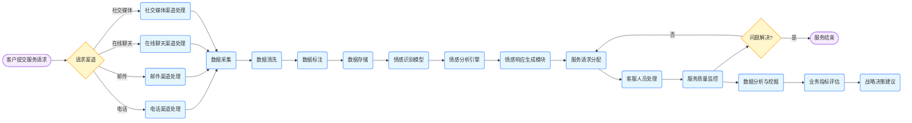

# 企业估值中的情感AI客户服务平台评估

> 关键词：企业估值、情感AI、客户服务平台、评估方法、应用场景

> 摘要：本文聚焦于企业估值中情感AI客户服务平台的评估。首先介绍了相关背景，包括评估的目的、范围、预期读者等。接着阐述了情感AI、客户服务平台等核心概念及其联系，通过文本示意图和Mermaid流程图进行清晰展示。详细讲解了核心算法原理和具体操作步骤，并结合Python代码进行说明。深入分析了数学模型和公式，辅以举例加深理解。通过项目实战，从开发环境搭建、源代码实现与解读等方面进行详细说明。探讨了情感AI客户服务平台的实际应用场景，推荐了学习资源、开发工具框架和相关论文著作。最后总结了未来发展趋势与挑战，还提供了常见问题解答和扩展阅读参考资料，旨在为企业在评估情感AI客户服务平台时提供全面、深入的技术参考。

## 1. 背景介绍 
### 1.1 目的和范围
企业在进行战略规划、投资决策、融资等活动时，准确评估资产价值至关重要。情感AI客户服务平台作为一种新兴的企业资产，其评估具有独特的复杂性和重要性。本文的目的在于为企业提供一套系统、科学的评估方法和思路，帮助企业合理确定情感AI客户服务平台的价值。范围涵盖了情感AI客户服务平台的核心概念、算法原理、数学模型、实际应用场景等多个方面，旨在全面剖析该平台的价值构成和评估要点。

### 1.2 预期读者
本文预期读者包括企业的高级管理人员、投资机构的分析师、财务顾问、技术研发人员以及对情感AI和企业估值领域感兴趣的专业人士。对于企业高管和投资分析师而言，本文可以为他们的决策提供有价值的参考；对于技术研发人员，有助于他们深入理解情感AI客户服务平台的价值，从而更好地进行产品研发和优化；对于其他感兴趣的专业人士，能够帮助他们拓宽知识视野，了解该领域的最新动态。

### 1.3 文档结构概述
本文首先介绍背景信息，让读者了解评估情感AI客户服务平台的重要性和相关背景知识。接着阐述核心概念与联系，清晰界定关键术语和概念，并展示它们之间的关系。核心算法原理和具体操作步骤部分，通过Python代码详细讲解实现方法。数学模型和公式部分，用数学语言描述平台的价值评估逻辑，并举例说明。项目实战部分，通过实际案例展示开发过程和代码解读。实际应用场景部分，介绍平台在不同行业的具体应用。工具和资源推荐部分，为读者提供学习和开发所需的各类资源。最后总结未来发展趋势与挑战，解答常见问题，并提供扩展阅读和参考资料。

### 1.4 术语表
#### 1.4.1 核心术语定义
- **情感AI**：指利用人工智能技术对人类情感进行识别、分析、理解和响应的技术领域。它结合了自然语言处理、机器学习、计算机视觉等多种技术，旨在让计算机能够感知和理解人类的情感状态。
- **客户服务平台**：是企业为客户提供服务的综合性系统，通常包括客户咨询、投诉处理、问题解决等功能。它可以通过多种渠道与客户进行交互，如电话、邮件、在线聊天等。
- **企业估值**：是指对企业整体价值进行评估的过程，通常考虑企业的资产、负债、盈利能力、市场前景等多个因素。在本文中，主要关注情感AI客户服务平台对企业价值的贡献。

#### 1.4.2 相关概念解释
- **情感识别**：是情感AI的核心技术之一，通过分析文本、语音、图像等数据，识别出人类表达的情感状态，如高兴、悲伤、愤怒等。
- **客户满意度**：是衡量客户服务平台效果的重要指标，反映了客户对企业提供的服务的满意程度。情感AI客户服务平台可以通过提高服务质量和响应速度来提升客户满意度。
- **数据挖掘**：是从大量数据中提取有价值信息的过程。在情感AI客户服务平台中，数据挖掘可以用于分析客户行为、情感趋势等，为企业决策提供支持。

#### 1.4.3 缩略词列表
- **NLP**：Natural Language Processing，自然语言处理
- **ML**：Machine Learning，机器学习
- **CV**：Computer Vision，计算机视觉

## 2. 核心概念与联系 
### 核心概念原理
#### 情感AI原理
情感AI主要基于机器学习和深度学习技术，通过对大量情感数据的训练，让模型学习到情感表达的模式和特征。在文本情感分析中，常用的方法是使用词向量表示文本，然后通过神经网络模型进行分类。例如，将文本中的每个单词转换为一个向量，然后将这些向量输入到卷积神经网络（CNN）或循环神经网络（RNN）中，输出文本的情感类别（如积极、消极、中性）。

#### 客户服务平台原理
客户服务平台的核心是实现客户与企业之间的高效沟通和问题解决。它通常包括客户信息管理、服务请求处理、知识库管理等模块。客户可以通过各种渠道提交服务请求，平台将请求分配给相应的客服人员或自动处理系统进行处理。同时，平台会记录客户的历史服务信息，以便为客户提供更个性化的服务。

### 架构的文本示意图
```plaintext
情感AI客户服务平台架构

客户交互层
|-- 电话渠道
|-- 邮件渠道
|-- 在线聊天渠道
|-- 社交媒体渠道

数据处理层
|-- 数据采集模块
|-- 数据清洗模块
|-- 数据标注模块
|-- 数据存储模块

情感AI层
|-- 情感识别模型
|-- 情感分析引擎
|-- 情感响应生成模块

业务逻辑层
|-- 客户信息管理
|-- 服务请求分配
|-- 知识库管理
|-- 服务质量监控

决策支持层
|-- 数据分析与挖掘
|-- 业务指标评估
|-- 战略决策建议
```

### Mermaid流程图


## 3. 核心算法原理 & 具体操作步骤 
### 核心算法原理
#### 情感识别算法
在文本情感分析中，常用的算法是基于深度学习的卷积神经网络（CNN）。CNN通过卷积层提取文本的局部特征，池化层对特征进行降维，最后通过全连接层进行分类。以下是一个简单的Python代码示例，使用Keras库实现基于CNN的文本情感分析模型：

```python
import numpy as np
from keras.preprocessing.text import Tokenizer
from keras.preprocessing.sequence import pad_sequences
from keras.models import Sequential
from keras.layers import Embedding, Conv1D, GlobalMaxPooling1D, Dense

# 示例数据
texts = ["This is a great movie!", "This movie is terrible."]
labels = [1, 0]

# 分词
tokenizer = Tokenizer(num_words=1000)
tokenizer.fit_on_texts(texts)
sequences = tokenizer.texts_to_sequences(texts)

# 填充序列
max_length = 100
padded_sequences = pad_sequences(sequences, maxlen=max_length)

# 构建模型
model = Sequential()
model.add(Embedding(input_dim=1000, output_dim=100, input_length=max_length))
model.add(Conv1D(filters=128, kernel_size=5, activation='relu'))
model.add(GlobalMaxPooling1D())
model.add(Dense(1, activation='sigmoid'))

# 编译模型
model.compile(optimizer='adam', loss='binary_crossentropy', metrics=['accuracy'])

# 训练模型
model.fit(padded_sequences, np.array(labels), epochs=10, batch_size=1)
```

#### 服务请求分配算法
服务请求分配算法的目标是将客户的服务请求分配给最合适的客服人员。常用的算法是基于规则的分配算法和基于机器学习的分配算法。基于规则的分配算法根据客服人员的技能、工作量、工作时间等因素进行分配；基于机器学习的分配算法则通过对历史服务数据的学习，预测客服人员处理请求的效率和质量，从而进行分配。以下是一个简单的基于规则的服务请求分配算法的Python代码示例：

```python
# 客服人员信息
agents = [
    {"id": 1, "skills": ["product A", "product B"], "workload": 0},
    {"id": 2, "skills": ["product B", "product C"], "workload": 1},
    {"id": 3, "skills": ["product A", "product C"], "workload": 0}
]

# 服务请求信息
request = {"product": "product A"}

# 分配算法
def assign_request(request, agents):
    eligible_agents = []
    for agent in agents:
        if request["product"] in agent["skills"]:
            eligible_agents.append(agent)
    if not eligible_agents:
        return None
    # 选择工作量最小的客服人员
    min_workload_agent = min(eligible_agents, key=lambda x: x["workload"])
    min_workload_agent["workload"] += 1
    return min_workload_agent["id"]

# 分配服务请求
assigned_agent_id = assign_request(request, agents)
print(f"服务请求分配给客服人员 {assigned_agent_id}")
```

### 具体操作步骤
#### 数据准备
- 收集客户服务相关的数据，包括客户咨询记录、投诉记录、服务评价等。
- 对数据进行清洗，去除噪声和无效信息。
- 对数据进行标注，为情感分析和服务请求分类提供标签。

#### 模型训练
- 选择合适的算法和模型结构，如上述的CNN模型。
- 将标注好的数据划分为训练集和测试集。
- 使用训练集对模型进行训练，调整模型参数，提高模型的性能。

#### 模型评估
- 使用测试集对训练好的模型进行评估，计算准确率、召回率、F1值等指标。
- 根据评估结果对模型进行优化和调整。

#### 平台部署
- 将训练好的模型部署到客户服务平台上。
- 配置平台的参数和规则，确保平台正常运行。

#### 持续优化
- 定期收集新的数据，对模型进行更新和训练。
- 根据客户反馈和业务需求，对平台的功能和性能进行优化。

## 4. 数学模型和公式 & 详细讲解 & 举例说明 
### 情感分析数学模型
#### 逻辑回归模型
逻辑回归是一种常用的二分类模型，用于将文本分为积极和消极两类。其数学模型可以表示为：

$$P(y=1|x)=\frac{1}{1 + e^{-(w^T x + b)}}$$

其中，$x$ 是输入的文本特征向量，$w$ 是权重向量，$b$ 是偏置项，$y$ 是情感标签（1表示积极，0表示消极）。

#### 详细讲解
逻辑回归模型通过对输入特征进行线性组合，然后通过 sigmoid 函数将其映射到 $[0, 1]$ 区间，表示文本为积极情感的概率。训练逻辑回归模型的目标是找到最优的权重向量 $w$ 和偏置项 $b$，使得模型的预测结果与真实标签之间的损失最小。常用的损失函数是对数损失函数：

$$L(w,b)=-\frac{1}{N}\sum_{i=1}^{N}[y_i\log(P(y=1|x_i))+(1 - y_i)\log(1 - P(y=1|x_i))]$$

其中，$N$ 是样本数量，$y_i$ 是第 $i$ 个样本的真实标签，$P(y=1|x_i)$ 是模型对第 $i$ 个样本的预测概率。

#### 举例说明
假设我们有一个简单的文本数据集，包含两个样本：

| 文本 | 情感标签 |
| ---- | ---- |
| "This is a great movie!" | 1 |
| "This movie is terrible." | 0 |

我们可以将文本转换为特征向量，例如使用词袋模型。假设我们只考虑两个单词 "great" 和 "terrible"，则第一个样本的特征向量为 $x_1 = [1, 0]$，第二个样本的特征向量为 $x_2 = [0, 1]$。

初始化权重向量 $w = [0.5, -0.5]$ 和偏置项 $b = 0$，则第一个样本的预测概率为：

$$P(y=1|x_1)=\frac{1}{1 + e^{-(0.5\times1 + (-0.5)\times0 + 0)}}=\frac{1}{1 + e^{-0.5}}\approx0.62$$

第二个样本的预测概率为：

$$P(y=1|x_2)=\frac{1}{1 + e^{-(0.5\times0 + (-0.5)\times1 + 0)}}=\frac{1}{1 + e^{0.5}}\approx0.38$$

根据对数损失函数计算损失：

$$L(w,b)=-\frac{1}{2}[(1\times\log(0.62)+(1 - 1)\times\log(1 - 0.62))+(0\times\log(0.38)+(1 - 0)\times\log(1 - 0.38))]\approx0.47$$

通过不断调整权重向量和偏置项，使得损失函数最小化，从而得到最优的模型参数。

### 企业估值数学模型
#### 收益法模型
收益法是企业估值中常用的方法之一，其基本思想是将企业未来的预期收益折现到当前时刻，得到企业的价值。情感AI客户服务平台的价值可以通过计算其对企业收益的贡献来评估。假设企业的预期收益为 $E$，折现率为 $r$，平台的收益贡献比例为 $\alpha$，则平台的价值 $V$ 可以表示为：

$$V=\sum_{t=1}^{n}\frac{\alpha E_t}{(1 + r)^t}$$

其中，$E_t$ 是第 $t$ 年的预期收益，$n$ 是预测期的年数。

#### 详细讲解
收益法模型的关键在于确定预期收益、折现率和平台的收益贡献比例。预期收益可以通过对企业历史数据的分析和市场趋势的预测来确定；折现率反映了资金的时间价值和投资风险，通常根据市场利率和企业的风险水平来确定；平台的收益贡献比例可以通过分析平台对客户满意度、客户忠诚度、销售额等指标的影响来确定。

#### 举例说明
假设某企业预计未来三年的收益分别为 $E_1 = 100$ 万元，$E_2 = 120$ 万元，$E_3 = 150$ 万元，折现率 $r = 0.1$，情感AI客户服务平台的收益贡献比例 $\alpha = 0.2$。则平台的价值为：

$$V=\frac{0.2\times100}{(1 + 0.1)^1}+\frac{0.2\times120}{(1 + 0.1)^2}+\frac{0.2\times150}{(1 + 0.1)^3}$$

$$=\frac{20}{1.1}+\frac{24}{1.21}+\frac{30}{1.331}\approx18.18 + 19.83 + 22.54 = 60.55$$（万元）

## 5. 项目实战：代码实际案例和详细解释说明 
### 5.1  开发环境搭建
#### 硬件环境
- 服务器：建议使用多核处理器、大容量内存和高速硬盘的服务器，以满足模型训练和平台运行的需求。例如，使用具有 8 核以上处理器、32GB 以上内存和 1TB 以上硬盘的服务器。
- 显卡：如果使用深度学习模型进行情感分析，建议配备 NVIDIA GPU，以加速模型训练。例如，使用 NVIDIA Tesla V100 或 NVIDIA GeForce RTX 3080 显卡。

#### 软件环境
- 操作系统：建议使用 Linux 操作系统，如 Ubuntu 或 CentOS。
- Python 环境：安装 Python 3.7 或以上版本，并使用虚拟环境管理工具，如 virtualenv 或 conda。
- 深度学习框架：安装 TensorFlow 或 PyTorch 深度学习框架，用于构建和训练情感分析模型。
- Web 框架：安装 Flask 或 Django Web 框架，用于搭建客户服务平台的前端界面和后端服务。

### 5.2  源代码详细实现和代码解读
#### 情感分析模块
```python
import numpy as np
from keras.preprocessing.text import Tokenizer
from keras.preprocessing.sequence import pad_sequences
from keras.models import load_model

# 加载预训练的模型
model = load_model('sentiment_model.h5')

# 分词器
tokenizer = Tokenizer(num_words=1000)
tokenizer.fit_on_texts(["This is a sample text."])

# 情感分析函数
def analyze_sentiment(text):
    sequences = tokenizer.texts_to_sequences([text])
    max_length = 100
    padded_sequences = pad_sequences(sequences, maxlen=max_length)
    prediction = model.predict(padded_sequences)
    sentiment = "Positive" if prediction[0][0] > 0.5 else "Negative"
    return sentiment

# 测试
text = "This is a great product!"
sentiment = analyze_sentiment(text)
print(f"文本情感: {sentiment}")
```

代码解读：
- 首先，使用 `load_model` 函数加载预训练的情感分析模型。
- 然后，创建一个分词器并对示例文本进行训练。
- 定义 `analyze_sentiment` 函数，该函数接受一个文本作为输入，将文本转换为序列并进行填充，然后使用模型进行预测，最后根据预测结果判断文本的情感是积极还是消极。
- 最后，调用 `analyze_sentiment` 函数对示例文本进行情感分析并输出结果。

#### 客户服务平台后端模块
```python
from flask import Flask, request, jsonify

app = Flask(__name__)

# 模拟客服人员信息
agents = [
    {"id": 1, "skills": ["product A", "product B"], "workload": 0},
    {"id": 2, "skills": ["product B", "product C"], "workload": 1},
    {"id": 3, "skills": ["product A", "product C"], "workload": 0}
]

# 服务请求分配函数
def assign_request(request_info):
    eligible_agents = []
    for agent in agents:
        if request_info["product"] in agent["skills"]:
            eligible_agents.append(agent)
    if not eligible_agents:
        return None
    min_workload_agent = min(eligible_agents, key=lambda x: x["workload"])
    min_workload_agent["workload"] += 1
    return min_workload_agent["id"]

# 处理服务请求的 API
@app.route('/service_request', methods=['POST'])
def handle_service_request():
    data = request.get_json()
    product = data.get('product')
    if not product:
        return jsonify({"error": "Missing product information"}), 400
    request_info = {"product": product}
    assigned_agent_id = assign_request(request_info)
    if assigned_agent_id is None:
        return jsonify({"message": "No available agent"}), 404
    return jsonify({"assigned_agent_id": assigned_agent_id}), 200

if __name__ == '__main__':
    app.run(debug=True)
```

代码解读：
- 使用 Flask 框架创建一个 Web 应用。
- 模拟客服人员信息，包括技能和工作量。
- 定义 `assign_request` 函数，用于将服务请求分配给最合适的客服人员。
- 创建一个处理服务请求的 API `/service_request`，该 API 接受一个 JSON 格式的请求，包含产品信息。根据产品信息调用 `assign_request` 函数进行分配，并返回分配结果。
- 最后，启动 Flask 应用。

### 5.3  代码解读与分析
#### 情感分析模块
- 优点：代码结构简单，易于理解和实现。使用预训练的模型可以快速进行情感分析，提高开发效率。
- 缺点：模型的性能取决于预训练数据的质量和数量，如果数据不够丰富或代表性不足，可能会导致分析结果不准确。
- 改进方向：可以使用更多的训练数据对模型进行微调，或者尝试使用更复杂的模型结构，如 BERT 等。

#### 客户服务平台后端模块
- 优点：使用 Flask 框架搭建后端服务，简单易用，便于开发和部署。基于规则的分配算法易于实现和理解。
- 缺点：基于规则的分配算法可能不够灵活，无法适应复杂的业务场景。例如，没有考虑客服人员的工作效率和服务质量等因素。
- 改进方向：可以使用机器学习算法对历史服务数据进行分析，预测客服人员的工作效率和服务质量，从而实现更智能的服务请求分配。

## 6. 实际应用场景 
### 电商行业
在电商行业，情感AI客户服务平台可以用于处理客户的咨询和投诉。通过情感分析，平台可以快速识别客户的情绪状态，对于情绪激动的客户，及时转接给经验丰富的客服人员进行处理，提高客户满意度。同时，平台可以根据客户的历史购买记录和情感偏好，为客户提供个性化的推荐和服务，促进销售增长。

### 金融行业
在金融行业，情感AI客户服务平台可以用于风险评估和客户关系管理。通过分析客户的咨询内容和情感状态，平台可以判断客户的风险承受能力和投资意愿，为客户提供更合适的金融产品和服务。同时，平台可以及时发现客户的不满情绪，采取措施进行化解，维护良好的客户关系。

### 医疗行业
在医疗行业，情感AI客户服务平台可以用于患者咨询和健康管理。患者可以通过平台咨询医生的建议和解答疑问，平台可以通过情感分析了解患者的心理状态，提供相应的心理支持和疏导。同时，平台可以根据患者的健康数据和情感状态，为患者制定个性化的健康管理方案，提高患者的健康水平。

### 旅游行业
在旅游行业，情感AI客户服务平台可以用于旅游咨询和预订服务。通过分析客户的旅游需求和情感偏好，平台可以为客户提供个性化的旅游线路和景点推荐。同时，平台可以及时处理客户的投诉和问题，提高客户的旅游体验。

## 7. 工具和资源推荐
### 7.1 学习资源推荐
#### 7.1.1 书籍推荐
- 《Python机器学习》：本书详细介绍了Python在机器学习领域的应用，包括数据预处理、模型选择、评估和优化等方面的内容，适合初学者入门。
- 《深度学习》：由深度学习领域的三位顶尖专家编写，全面介绍了深度学习的基本原理、算法和应用，是深度学习领域的经典教材。
- 《自然语言处理入门》：本书系统地介绍了自然语言处理的基本概念、方法和技术，包括分词、词性标注、命名实体识别、情感分析等内容，适合对自然语言处理感兴趣的读者。

#### 7.1.2 在线课程
- Coursera上的“机器学习”课程：由斯坦福大学教授Andrew Ng主讲，是机器学习领域最受欢迎的在线课程之一，涵盖了机器学习的基本概念、算法和应用。
- edX上的“深度学习基础”课程：由deeplearning.ai提供，深入介绍了深度学习的基本原理和实践技巧，适合有一定编程基础的学习者。
- 网易云课堂上的“自然语言处理实战”课程：通过实际案例讲解自然语言处理的应用，包括文本分类、情感分析、机器翻译等内容，帮助学习者快速掌握自然语言处理技术。

#### 7.1.3 技术博客和网站
- 博客园：是国内知名的技术博客网站，有很多关于机器学习、人工智能等领域的技术文章和经验分享。
- Medium：是一个全球性的技术博客平台，有很多国际知名的技术专家和学者在上面分享最新的技术研究成果和实践经验。
- Kaggle：是一个数据科学竞赛平台，上面有很多公开的数据集和优秀的解决方案，学习者可以通过参加竞赛来提高自己的技术水平。

### 7.2 开发工具框架推荐
#### 7.2.1 IDE和编辑器
- PyCharm：是一款专门为Python开发设计的集成开发环境，具有代码自动补全、调试、版本控制等功能，提高开发效率。
- Jupyter Notebook：是一个交互式的开发环境，适合进行数据探索、模型训练和可视化等工作。
- Visual Studio Code：是一款轻量级的代码编辑器，支持多种编程语言和插件扩展，可用于开发Python、JavaScript等项目。

#### 7.2.2 调试和性能分析工具
- TensorBoard：是TensorFlow提供的可视化工具，可用于监控模型训练过程中的损失函数、准确率等指标，帮助开发者调试模型。
- Py-Spy：是一个用于分析Python程序性能的工具，可以实时监控程序的CPU使用率、内存占用等情况，找出性能瓶颈。
- cProfile：是Python标准库中的性能分析模块，可以统计程序中各个函数的执行时间和调用次数，帮助开发者优化代码。

#### 7.2.3 相关框架和库
- TensorFlow：是Google开发的深度学习框架，具有强大的计算能力和丰富的工具集，广泛应用于图像识别、自然语言处理等领域。
- PyTorch：是Facebook开发的深度学习框架，具有动态图的特点，易于使用和调试，受到很多研究人员和开发者的喜爱。
- NLTK：是Python中常用的自然语言处理库，提供了丰富的语料库和工具，可用于分词、词性标注、情感分析等任务。

### 7.3 相关论文著作推荐
#### 7.3.1 经典论文
- 《Attention Is All You Need》：提出了Transformer模型，是自然语言处理领域的重大突破，为后续的BERT、GPT等模型奠定了基础。
- 《Convolutional Neural Networks for Sentence Classification》：介绍了使用卷积神经网络进行文本分类的方法，是文本情感分析领域的经典论文。
- 《Deep Learning in Neural Networks: An Overview》：对深度学习的发展历程、基本原理和应用进行了全面的综述，是深度学习领域的重要文献。

#### 7.3.2 最新研究成果
- 《RoBERTa: A Robustly Optimized BERT Pretraining Approach》：提出了RoBERTa模型，对BERT模型进行了优化，提高了模型的性能。
- 《GPT-3: Language Models are Few-Shot Learners》：介绍了GPT-3模型，展示了大规模预训练语言模型在自然语言处理任务中的强大能力。
- 《Emotion Recognition from Text: A Survey》：对文本情感识别的研究现状进行了全面的综述，分析了各种方法的优缺点和应用场景。

#### 7.3.3 应用案例分析
- 《Applying Sentiment Analysis to Customer Service in E-commerce》：分析了情感分析在电商客户服务中的应用案例，介绍了如何使用情感分析提高客户满意度和销售业绩。
- 《Using AI in Financial Customer Service: A Case Study》：以某金融机构为例，介绍了人工智能在金融客户服务中的应用实践，包括客户咨询、风险评估等方面。
- 《Emotion AI in Healthcare: A Case Study of Patient Support》：探讨了情感AI在医疗行业的应用案例，如何通过情感分析为患者提供心理支持和健康管理服务。

## 8. 总结：未来发展趋势与挑战
### 未来发展趋势
#### 多模态融合
未来的情感AI客户服务平台将不仅仅局限于文本分析，还将融合语音、图像、视频等多种模态的数据，实现更全面、准确的情感识别和分析。例如，通过分析客户的语音语调、面部表情等信息，更精准地了解客户的情感状态。

#### 个性化服务
随着大数据和人工智能技术的发展，平台将能够根据客户的个性化需求和偏好，提供更加个性化的服务。例如，根据客户的历史购买记录、浏览行为和情感偏好，为客户推荐更符合其需求的产品和服务。

#### 智能化决策
平台将具备更强的智能化决策能力，能够根据情感分析结果和业务规则，自动做出决策和建议。例如，当客户情绪激动时，平台可以自动调整服务策略，转接给更合适的客服人员或提供安抚性的回复。

#### 行业应用拓展
情感AI客户服务平台将在更多行业得到广泛应用，如教育、娱乐、政务等。不同行业将根据自身的特点和需求，对平台进行定制化开发和应用，推动行业的数字化转型和升级。

### 挑战
#### 数据质量和隐私问题
情感AI客户服务平台需要大量的高质量数据进行训练和优化，但数据的收集、标注和管理面临着诸多挑战。同时，客户数据的隐私保护也是一个重要问题，如何在保证数据安全的前提下，充分利用数据的价值，是需要解决的关键问题。

#### 算法性能和可解释性
目前的情感分析算法在某些复杂场景下的性能还不够理想，如处理模糊语言、多义性文本等。此外，深度学习模型通常是黑盒模型，其决策过程难以解释，这在一些对决策可解释性要求较高的领域，如金融、医疗等，可能会限制其应用。

#### 技术人才短缺
情感AI客户服务平台的开发和应用需要具备跨学科知识的技术人才，包括机器学习、自然语言处理、软件工程等方面的专业知识。目前，这类技术人才相对短缺，制约了行业的发展。

#### 伦理和法律问题
随着情感AI的广泛应用，伦理和法律问题也日益凸显。例如，如何确保情感AI的决策公平、公正，避免歧视和偏见；如何规范情感AI的使用，防止其被滥用等。

## 9. 附录：常见问题与解答
### 问题1：情感AI客户服务平台的评估方法有哪些？
答：常见的评估方法包括收益法、市场法和成本法。收益法通过计算平台对企业未来收益的贡献来评估其价值；市场法通过比较类似平台的市场交易价格来确定平台的价值；成本法通过计算平台的开发成本和维护成本来评估其价值。在实际评估中，通常会综合使用多种方法，以提高评估结果的准确性。

### 问题2：如何提高情感分析模型的准确性？
答：可以从以下几个方面提高情感分析模型的准确性：
- 使用更多的训练数据：丰富的训练数据可以让模型学习到更多的情感表达模式和特征，提高模型的泛化能力。
- 选择合适的模型结构：不同的模型结构适用于不同的任务和数据，选择合适的模型结构可以提高模型的性能。
- 进行数据预处理：对数据进行清洗、标注和特征提取等预处理操作，去除噪声和无效信息，提高数据的质量。
- 进行模型调优：通过调整模型的超参数，如学习率、批量大小等，优化模型的性能。

### 问题3：情感AI客户服务平台的部署需要注意哪些问题？
答：部署情感AI客户服务平台需要注意以下问题：
- 硬件资源：确保服务器具备足够的计算能力和存储空间，以满足平台的运行需求。
- 软件环境：安装合适的操作系统、深度学习框架和Web框架，并配置好相关的环境变量。
- 数据安全：采取有效的数据安全措施，保护客户数据的隐私和安全。
- 性能优化：对平台进行性能测试和优化，确保平台能够快速响应客户请求，提高用户体验。

### 问题4：情感AI客户服务平台与传统客户服务平台有什么区别？
答：情感AI客户服务平台与传统客户服务平台的主要区别在于：
- 情感识别能力：情感AI客户服务平台具备情感识别功能，能够感知客户的情绪状态，提供更个性化的服务。
- 智能化程度：情感AI客户服务平台可以利用人工智能技术自动处理客户请求，提高服务效率和质量。
- 数据分析能力：情感AI客户服务平台可以对客户数据进行深入分析，挖掘客户需求和行为模式，为企业决策提供支持。

## 10. 扩展阅读 & 参考资料
### 扩展阅读
- 《人工智能时代的客户服务变革》
- 《情感计算：从理论到应用》
- 《企业估值的艺术与科学》

### 参考资料
- 《Python深度学习实战》
- 《自然语言处理实战：基于Python和深度学习》
- 《机器学习：实用案例解析》
- 《企业价值评估》

作者：AI天才研究院/AI Genius Institute & 禅与计算机程序设计艺术 /Zen And The Art of Computer Programming