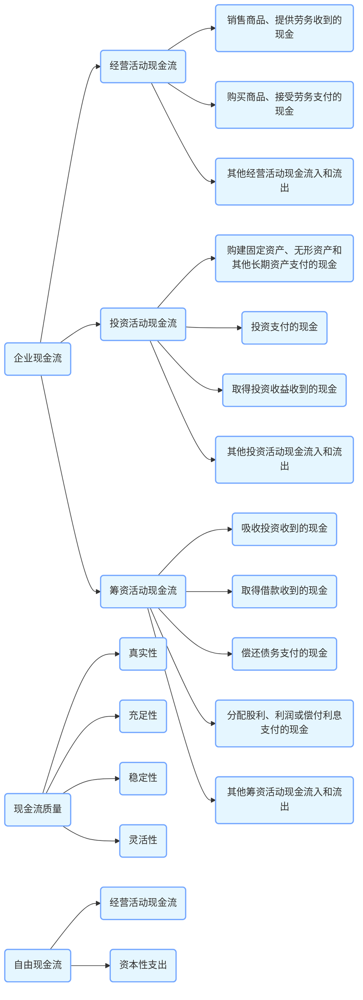

# 企业估值中的现金流质量分析

> 关键词：企业估值、现金流质量、自由现金流、现金流分析指标、现金流预测

> 摘要：本文聚焦于企业估值中的现金流质量分析。首先介绍了研究该主题的目的和范围，明确预期读者以及文档结构。接着阐述了现金流、现金流质量等核心概念及其联系，给出相应的文本示意图和 Mermaid 流程图。详细讲解了现金流分析的核心算法原理，并通过 Python 代码展示具体操作步骤。深入探讨了现金流分析涉及的数学模型和公式，结合实际例子进行说明。通过项目实战，从开发环境搭建到源代码实现和解读，展示如何进行现金流质量分析。分析了现金流质量分析在企业融资、投资决策等实际应用场景。推荐了相关的学习资源、开发工具框架以及论文著作。最后总结了现金流质量分析在企业估值领域的未来发展趋势与挑战，解答常见问题并提供扩展阅读和参考资料，旨在为企业估值和现金流质量分析提供全面且深入的技术指导。

## 1. 背景介绍 
### 1.1 目的和范围
在企业估值过程中，现金流质量分析具有至关重要的地位。准确评估企业的现金流质量能够为投资者、债权人、管理层等利益相关者提供关于企业财务健康状况和未来发展潜力的关键信息。本研究的目的在于深入探讨企业估值中现金流质量分析的方法、技术和应用，为相关人员提供全面且实用的分析框架。

研究范围涵盖了现金流质量的各个方面，包括现金流的来源、稳定性、充足性、灵活性等。同时，结合企业估值的不同方法，分析现金流质量对企业价值评估的影响。此外，还将探讨如何通过现金流质量分析发现企业潜在的风险和机会。

### 1.2 预期读者
本文的预期读者包括金融分析师、投资者、企业管理人员、财务顾问以及对企业估值和现金流分析感兴趣的研究人员。对于金融分析师和投资者而言，本文可以帮助他们更准确地评估企业的价值，做出更明智的投资决策。企业管理人员可以通过本文了解如何提高企业的现金流质量，优化企业的财务状况。财务顾问可以将本文的分析方法应用到实际的咨询服务中，为客户提供更专业的建议。研究人员则可以从本文中获取相关的研究思路和方法，进一步深入研究企业估值和现金流质量分析领域的问题。

### 1.3 文档结构概述
本文将按照以下结构进行组织：
- 核心概念与联系：介绍现金流、现金流质量等核心概念，分析它们之间的联系，并通过文本示意图和 Mermaid 流程图进行直观展示。
- 核心算法原理 & 具体操作步骤：讲解现金流分析的核心算法原理，如自由现金流的计算方法，并使用 Python 代码展示具体的操作步骤。
- 数学模型和公式 & 详细讲解 & 举例说明：介绍现金流分析涉及的数学模型和公式，如净现值公式、内部收益率公式等，并结合实际例子进行详细讲解。
- 项目实战：通过一个实际的项目案例，展示如何进行现金流质量分析，包括开发环境搭建、源代码实现和代码解读。
- 实际应用场景：分析现金流质量分析在企业融资、投资决策、并购重组等实际应用场景中的作用。
- 工具和资源推荐：推荐相关的学习资源、开发工具框架以及论文著作，帮助读者进一步深入学习和研究。
- 总结：总结现金流质量分析在企业估值领域的未来发展趋势与挑战。
- 附录：解答常见问题，提供扩展阅读和参考资料。

### 1.4 术语表
#### 1.4.1 核心术语定义
- **现金流**：指企业在一定会计期间按照现金收付实现制，通过一定经济活动（包括经营活动、投资活动、筹资活动和非经常性项目）而产生的现金流入、现金流出及其总量情况的总称。
- **现金流质量**：是指企业现金流能够按照企业的预期目标进行运转的质量，包括现金流的真实性、充足性、稳定性和灵活性等方面。
- **自由现金流**：是指企业经营活动产生的现金流量扣除资本性支出（CAPEX）的差额，即企业可以自由支配的现金流量。自由现金流反映了企业的盈利能力和财务弹性。
- **经营现金流**：是指企业在日常经营活动中产生的现金流量，主要包括销售商品、提供劳务收到的现金，购买商品、接受劳务支付的现金等。经营现金流是企业现金的主要来源，反映了企业经营活动的现金创造能力。
- **投资现金流**：是指企业在投资活动中产生的现金流量，主要包括购建固定资产、无形资产和其他长期资产支付的现金，投资支付的现金，取得投资收益收到的现金等。投资现金流反映了企业的投资活动对现金流量的影响。
- **筹资现金流**：是指企业在筹资活动中产生的现金流量，主要包括吸收投资收到的现金，取得借款收到的现金，偿还债务支付的现金，分配股利、利润或偿付利息支付的现金等。筹资现金流反映了企业的筹资活动对现金流量的影响。

#### 1.4.2 相关概念解释
- **现金流量表**：是反映企业在一定会计期间现金和现金等价物流入和流出的报表。现金流量表将企业的现金流量分为经营活动现金流量、投资活动现金流量和筹资活动现金流量三部分，通过对现金流量表的分析可以了解企业的现金来源和去向，评估企业的现金流质量。
- **权责发生制**：是指企业在确认收入和费用时，按照权利和责任的发生来确定，而不是按照现金的收付来确定。权责发生制下的利润表反映了企业的经营业绩，但可能存在利润与现金流量不匹配的情况。
- **收付实现制**：是指企业在确认收入和费用时，按照现金的收付来确定。收付实现制下的现金流量表反映了企业的现金实际收支情况，更能体现企业的现金流质量。

#### 1.4.3 缩略词列表
- **FCF**：Free Cash Flow，自由现金流
- **OCF**：Operating Cash Flow，经营现金流
- **ICF**：Investing Cash Flow，投资现金流
- **FCF**：Financing Cash Flow，筹资现金流
- **CAPEX**：Capital Expenditure，资本性支出

## 2. 核心概念与联系 
### 核心概念原理
#### 现金流
现金流是企业生存和发展的血液，它反映了企业在一定时期内现金的流入和流出情况。现金流可以分为经营活动现金流、投资活动现金流和筹资活动现金流。经营活动现金流是企业通过日常经营活动产生的现金流量，如销售商品、提供劳务收到的现金，购买商品、接受劳务支付的现金等。投资活动现金流是企业在投资活动中产生的现金流量，如购建固定资产、无形资产和其他长期资产支付的现金，投资支付的现金，取得投资收益收到的现金等。筹资活动现金流是企业在筹资活动中产生的现金流量，如吸收投资收到的现金，取得借款收到的现金，偿还债务支付的现金，分配股利、利润或偿付利息支付的现金等。

#### 现金流质量
现金流质量是指企业现金流能够按照企业的预期目标进行运转的质量，它包括现金流的真实性、充足性、稳定性和灵活性等方面。现金流的真实性是指现金流数据的准确可靠，没有虚假或误导性信息。现金流的充足性是指企业的现金流量能够满足企业的日常经营活动、投资活动和筹资活动的需要。现金流的稳定性是指企业的现金流量在一定时期内保持相对稳定，不受外界因素的影响过大。现金流的灵活性是指企业能够根据市场变化和企业发展的需要，灵活调整现金流量的规模和结构。

#### 自由现金流
自由现金流是企业经营活动产生的现金流量扣除资本性支出后的余额，它是企业可以自由支配的现金流量。自由现金流反映了企业的盈利能力和财务弹性，是企业价值评估的重要指标之一。自由现金流可以用于企业的再投资、偿还债务、分配股利等，对企业的长期发展具有重要意义。

### 架构的文本示意图
```plaintext
企业现金流
|-- 经营活动现金流
|   |-- 销售商品、提供劳务收到的现金
|   |-- 购买商品、接受劳务支付的现金
|   |-- 其他经营活动现金流入和流出
|-- 投资活动现金流
|   |-- 购建固定资产、无形资产和其他长期资产支付的现金
|   |-- 投资支付的现金
|   |-- 取得投资收益收到的现金
|   |-- 其他投资活动现金流入和流出
|-- 筹资活动现金流
|   |-- 吸收投资收到的现金
|   |-- 取得借款收到的现金
|   |-- 偿还债务支付的现金
|   |-- 分配股利、利润或偿付利息支付的现金
|   |-- 其他筹资活动现金流入和流出

现金流质量
|-- 真实性
|-- 充足性
|-- 稳定性
|-- 灵活性

自由现金流 = 经营活动现金流 - 资本性支出
```

### Mermaid 流程图


## 3. 核心算法原理 & 具体操作步骤 
### 核心算法原理
#### 自由现金流的计算
自由现金流（FCF）是企业经营活动产生的现金流量扣除资本性支出后的余额，其计算公式为：
$$FCF = OCF - CAPEX$$
其中，$OCF$ 表示经营活动现金流，$CAPEX$ 表示资本性支出。

经营活动现金流可以通过间接法从净利润调整得到，其计算公式为：
$$OCF = 净利润 + 非现金费用（如折旧、摊销） - 营运资本变动$$

资本性支出是指企业为了维持或扩大生产经营规模而进行的长期资产投资，如购建固定资产、无形资产和其他长期资产的支出。

#### 现金流分析指标
除了自由现金流外，还可以通过一些现金流分析指标来评估企业的现金流质量，如经营现金流量比率、现金流量充足率、现金流量利息保障倍数等。

- **经营现金流量比率**：反映了企业经营活动现金流量对流动负债的保障程度，其计算公式为：
$$经营现金流量比率 = \frac{经营活动现金流}{流动负债}$$

- **现金流量充足率**：反映了企业经营活动现金流量对资本性支出、存货增加和现金股利分配的满足程度，其计算公式为：
$$现金流量充足率 = \frac{经营活动现金流}{资本性支出 + 存货增加 + 现金股利分配}$$

- **现金流量利息保障倍数**：反映了企业经营活动现金流量对利息支出的保障程度，其计算公式为：
$$现金流量利息保障倍数 = \frac{经营活动现金流}{利息支出}$$

### 具体操作步骤
以下是使用 Python 代码实现自由现金流计算和现金流分析指标计算的具体操作步骤：

```python
import pandas as pd

# 示例数据
data = {
    '净利润': [1000, 1200, 1500],
    '折旧': [200, 220, 250],
    '摊销': [50, 60, 70],
    '营运资本变动': [100, 120, 150],
    '资本性支出': [300, 350, 400],
    '流动负债': [500, 600, 700],
    '存货增加': [50, 60, 70],
    '现金股利分配': [100, 120, 150],
    '利息支出': [50, 60, 70]
}

df = pd.DataFrame(data)

# 计算经营活动现金流
df['经营活动现金流'] = df['净利润'] + df['折旧'] + df['摊销'] - df['营运资本变动']

# 计算自由现金流
df['自由现金流'] = df['经营活动现金流'] - df['资本性支出']

# 计算经营现金流量比率
df['经营现金流量比率'] = df['经营活动现金流'] / df['流动负债']

# 计算现金流量充足率
df['现金流量充足率'] = df['经营活动现金流'] / (df['资本性支出'] + df['存货增加'] + df['现金股利分配'])

# 计算现金流量利息保障倍数
df['现金流量利息保障倍数'] = df['经营活动现金流'] / df['利息支出']

print(df)
```

### 代码解释
1. **导入必要的库**：使用 `pandas` 库来处理数据。
2. **定义示例数据**：创建一个包含净利润、折旧、摊销、营运资本变动等数据的字典。
3. **将数据转换为 DataFrame**：使用 `pd.DataFrame()` 函数将字典转换为 DataFrame。
4. **计算经营活动现金流**：根据公式 `经营活动现金流 = 净利润 + 折旧 + 摊销 - 营运资本变动` 计算经营活动现金流。
5. **计算自由现金流**：根据公式 `自由现金流 = 经营活动现金流 - 资本性支出` 计算自由现金流。
6. **计算现金流分析指标**：分别计算经营现金流量比率、现金流量充足率和现金流量利息保障倍数。
7. **打印结果**：使用 `print()` 函数打印计算结果。

## 4. 数学模型和公式 & 详细讲解 & 举例说明 
### 净现值（NPV）模型
净现值是指投资项目在未来各期现金流量的现值之和与初始投资之间的差额。净现值模型是企业估值中常用的一种方法，它考虑了资金的时间价值，能够反映投资项目的真实价值。

净现值的计算公式为：
$$NPV = \sum_{t=0}^{n} \frac{CF_t}{(1 + r)^t} - I_0$$
其中，$NPV$ 表示净现值，$CF_t$ 表示第 $t$ 期的现金流量，$r$ 表示折现率，$I_0$ 表示初始投资，$n$ 表示投资项目的寿命期。

#### 详细讲解
净现值模型的基本思想是将未来各期的现金流量按照一定的折现率折现到当前时刻，然后将折现后的现金流量之和与初始投资进行比较。如果净现值大于零，则说明投资项目的收益大于成本，该项目具有投资价值；如果净现值小于零，则说明投资项目的收益小于成本，该项目不具有投资价值；如果净现值等于零，则说明投资项目的收益等于成本，该项目的投资收益刚好能够弥补成本。

#### 举例说明
假设某投资项目的初始投资为 $1000$ 万元，预计未来 $5$ 年的现金流量分别为 $200$ 万元、$300$ 万元、$400$ 万元、$500$ 万元和 $600$ 万元，折现率为 $10\%$。则该投资项目的净现值为：

$$NPV = \frac{200}{(1 + 0.1)^1} + \frac{300}{(1 + 0.1)^2} + \frac{400}{(1 + 0.1)^3} + \frac{500}{(1 + 0.1)^4} + \frac{600}{(1 + 0.1)^5} - 1000$$

```python
import numpy as np

# 初始投资
I0 = 1000

# 未来各期现金流量
CF = np.array([200, 300, 400, 500, 600])

# 折现率
r = 0.1

# 计算净现值
NPV = np.sum(CF / (1 + r) ** np.arange(1, len(CF) + 1)) - I0

print(f"净现值: {NPV} 万元")
```

### 内部收益率（IRR）模型
内部收益率是指使投资项目的净现值等于零的折现率。内部收益率模型是企业估值中另一种常用的方法，它反映了投资项目的实际收益率。

内部收益率的计算公式为：
$$\sum_{t=0}^{n} \frac{CF_t}{(1 + IRR)^t} - I_0 = 0$$
其中，$IRR$ 表示内部收益率，$CF_t$ 表示第 $t$ 期的现金流量，$I_0$ 表示初始投资，$n$ 表示投资项目的寿命期。

#### 详细讲解
内部收益率模型的基本思想是通过不断试错的方法，找到一个折现率，使得投资项目的净现值等于零。这个折现率就是投资项目的内部收益率。如果内部收益率大于企业的资本成本，则说明投资项目的收益大于成本，该项目具有投资价值；如果内部收益率小于企业的资本成本，则说明投资项目的收益小于成本，该项目不具有投资价值。

#### 举例说明
假设某投资项目的初始投资为 $1000$ 万元，预计未来 $5$ 年的现金流量分别为 $200$ 万元、$300$ 万元、$400$ 万元、$500$ 万元和 $600$ 万元。则该投资项目的内部收益率为：

```python
import numpy as np

# 初始投资
I0 = -1000

# 未来各期现金流量
CF = np.array([200, 300, 400, 500, 600])

# 计算内部收益率
IRR = np.irr(np.concatenate(([I0], CF)))

print(f"内部收益率: {IRR * 100:.2f}%")
```

### 盈利指数（PI）模型
盈利指数是指投资项目未来各期现金流量的现值之和与初始投资的比值。盈利指数模型是企业估值中一种辅助性的方法，它可以帮助企业判断投资项目的相对盈利能力。

盈利指数的计算公式为：
$$PI = \frac{\sum_{t=0}^{n} \frac{CF_t}{(1 + r)^t}}{I_0}$$
其中，$PI$ 表示盈利指数，$CF_t$ 表示第 $t$ 期的现金流量，$r$ 表示折现率，$I_0$ 表示初始投资，$n$ 表示投资项目的寿命期。

#### 详细讲解
盈利指数模型的基本思想是将未来各期的现金流量按照一定的折现率折现到当前时刻，然后将折现后的现金流量之和与初始投资进行比较。如果盈利指数大于 $1$，则说明投资项目的收益大于成本，该项目具有投资价值；如果盈利指数小于 $1$，则说明投资项目的收益小于成本，该项目不具有投资价值；如果盈利指数等于 $1$，则说明投资项目的收益等于成本，该项目的投资收益刚好能够弥补成本。

#### 举例说明
假设某投资项目的初始投资为 $1000$ 万元，预计未来 $5$ 年的现金流量分别为 $200$ 万元、$300$ 万元、$400$ 万元、$500$ 万元和 $600$ 万元，折现率为 $10\%$。则该投资项目的盈利指数为：

```python
import numpy as np

# 初始投资
I0 = 1000

# 未来各期现金流量
CF = np.array([200, 300, 400, 500, 600])

# 折现率
r = 0.1

# 计算未来现金流量的现值之和
PV = np.sum(CF / (1 + r) ** np.arange(1, len(CF) + 1))

# 计算盈利指数
PI = PV / I0

print(f"盈利指数: {PI}")
```

## 5. 项目实战：代码实际案例和详细解释说明 
### 5.1  开发环境搭建
#### 安装 Python
首先，需要安装 Python 编程语言。可以从 Python 官方网站（https://www.python.org/downloads/）下载适合自己操作系统的 Python 安装包，并按照安装向导进行安装。

#### 安装必要的库
在进行现金流质量分析时，需要使用一些 Python 库，如 `pandas`、`numpy` 等。可以使用 `pip` 命令来安装这些库：
```sh
pip install pandas numpy
```

### 5.2  源代码详细实现和代码解读
以下是一个完整的项目实战代码，用于对企业的现金流质量进行分析：

```python
import pandas as pd
import numpy as np

# 读取数据
data = pd.read_csv('cash_flow_data.csv')

# 计算经营活动现金流
data['经营活动现金流'] = data['净利润'] + data['折旧'] + data['摊销'] - data['营运资本变动']

# 计算自由现金流
data['自由现金流'] = data['经营活动现金流'] - data['资本性支出']

# 计算经营现金流量比率
data['经营现金流量比率'] = data['经营活动现金流'] / data['流动负债']

# 计算现金流量充足率
data['现金流量充足率'] = data['经营活动现金流'] / (data['资本性支出'] + data['存货增加'] + data['现金股利分配'])

# 计算现金流量利息保障倍数
data['现金流量利息保障倍数'] = data['经营活动现金流'] / data['利息支出']

# 分析现金流质量
def analyze_cash_flow_quality(row):
    quality = []
    if row['经营现金流量比率'] > 1:
        quality.append('经营活动现金流对流动负债保障程度较好')
    else:
        quality.append('经营活动现金流对流动负债保障程度较弱')
    if row['现金流量充足率'] > 1:
        quality.append('经营活动现金流能够满足资本性支出、存货增加和现金股利分配的需求')
    else:
        quality.append('经营活动现金流可能无法满足资本性支出、存货增加和现金股利分配的需求')
    if row['现金流量利息保障倍数'] > 1:
        quality.append('经营活动现金流对利息支出的保障程度较好')
    else:
        quality.append('经营活动现金流对利息支出的保障程度较弱')
    return ', '.join(quality)

data['现金流质量分析'] = data.apply(analyze_cash_flow_quality, axis=1)

# 打印结果
print(data)

# 保存结果
data.to_csv('cash_flow_analysis_result.csv', index=False)
```

### 代码解读
1. **导入必要的库**：导入 `pandas` 和 `numpy` 库，用于数据处理和数值计算。
2. **读取数据**：使用 `pd.read_csv()` 函数读取包含企业现金流数据的 CSV 文件。
3. **计算经营活动现金流**：根据公式 `经营活动现金流 = 净利润 + 折旧 + 摊销 - 营运资本变动` 计算经营活动现金流。
4. **计算自由现金流**：根据公式 `自由现金流 = 经营活动现金流 - 资本性支出` 计算自由现金流。
5. **计算现金流分析指标**：分别计算经营现金流量比率、现金流量充足率和现金流量利息保障倍数。
6. **分析现金流质量**：定义一个函数 `analyze_cash_flow_quality()`，根据现金流分析指标对企业的现金流质量进行分析，并将分析结果添加到 DataFrame 中。
7. **打印结果**：使用 `print()` 函数打印计算结果。
8. **保存结果**：使用 `data.to_csv()` 函数将计算结果保存为 CSV 文件。

### 5.3  代码解读与分析
#### 数据处理部分
代码首先使用 `pd.read_csv()` 函数读取 CSV 文件，将数据加载到 DataFrame 中。然后，通过对 DataFrame 中的列进行操作，计算经营活动现金流、自由现金流和各种现金流分析指标。这种数据处理方式非常方便，可以快速完成数据的计算和分析。

#### 现金流质量分析部分
定义的 `analyze_cash_flow_quality()` 函数根据现金流分析指标对企业的现金流质量进行评估。通过判断经营现金流量比率、现金流量充足率和现金流量利息保障倍数是否大于 $1$，可以得出企业的现金流质量是较好还是较弱。这种分析方法简单直观，能够快速判断企业的现金流状况。

#### 结果保存部分
最后，使用 `data.to_csv()` 函数将计算结果保存为 CSV 文件，方便后续的查看和分析。

## 6. 实际应用场景 
### 企业融资
在企业进行融资时，投资者和债权人通常会关注企业的现金流质量。良好的现金流质量表明企业具有较强的盈利能力和偿债能力，能够按时偿还债务和支付利息。因此，企业可以通过提高现金流质量来吸引更多的投资者和债权人，获得更多的融资机会。例如，企业可以通过优化经营活动，提高经营活动现金流；合理安排投资活动，避免过度投资导致现金流出过大；优化筹资活动，降低筹资成本等方式来提高现金流质量。

### 投资决策
投资者在进行投资决策时，会对企业的现金流质量进行深入分析。现金流质量好的企业通常具有较高的投资价值，因为它们能够为投资者带来稳定的现金回报。投资者可以通过分析企业的自由现金流、经营现金流量比率、现金流量充足率等指标，评估企业的现金流质量，从而做出更明智的投资决策。例如，投资者可以选择自由现金流持续增长、经营现金流量比率较高的企业进行投资。

### 并购重组
在企业进行并购重组时，现金流质量分析也非常重要。收购方需要评估被收购方的现金流状况，以确定被收购方的价值和潜在风险。如果被收购方的现金流质量较差，可能会给收购方带来财务压力和风险。因此，收购方需要对被收购方的现金流进行详细分析，包括经营活动现金流、投资活动现金流和筹资活动现金流等方面，以确保并购重组的成功。例如，收购方可以关注被收购方的自由现金流是否能够覆盖其债务和资本性支出，经营活动现金流是否稳定等。

### 企业绩效评估
企业管理层可以通过现金流质量分析来评估企业的绩效。现金流质量是企业经营状况的重要反映，良好的现金流质量表明企业的经营活动健康、高效。管理层可以通过分析企业的现金流指标，如经营现金流量比率、现金流量充足率等，发现企业经营中存在的问题，并及时采取措施进行改进。例如，如果经营现金流量比率较低，说明企业的经营活动现金流对流动负债的保障程度较弱，管理层可以采取措施提高经营活动现金流，如加强应收账款管理、优化库存管理等。

## 7. 工具和资源推荐
### 7.1 学习资源推荐
#### 7.1.1 书籍推荐
- 《财务报表分析与股票估值》：这本书详细介绍了财务报表分析的方法和技巧，以及如何通过财务报表分析进行股票估值。书中包含了大量的案例和实际操作方法，对于学习现金流质量分析和企业估值非常有帮助。
- 《自由现金流估值：如何评估企业的真实价值》：本书重点介绍了自由现金流估值的方法和原理，以及如何通过自由现金流分析评估企业的真实价值。书中提供了丰富的案例和实际操作指南，适合想要深入学习自由现金流分析的读者。
- 《公司理财》：这是一本经典的公司理财教材，涵盖了公司理财的各个方面，包括现金流分析、资本预算、融资决策等。书中的内容系统全面，讲解深入浅出，对于学习企业估值和现金流分析的基础知识非常有帮助。

#### 7.1.2 在线课程
- Coursera 上的“Financial Markets”课程：该课程由耶鲁大学的 Robert Shiller 教授主讲，介绍了金融市场的基本原理和运行机制，包括现金流分析、资产定价等内容。课程内容丰富，讲解生动，适合对金融市场和现金流分析感兴趣的初学者。
- edX 上的“Corporate Finance”课程：该课程由麻省理工学院的 Stewart C. Myers 教授主讲，深入探讨了公司理财的核心概念和方法，包括现金流分析、资本结构决策、股利政策等。课程难度适中，适合有一定财务基础的学习者。
- Udemy 上的“Financial Statement Analysis for Beginners”课程：该课程专门针对初学者，介绍了财务报表分析的基本方法和技巧，包括现金流分析、比率分析等。课程内容简单易懂，适合想要快速入门财务报表分析的读者。

#### 7.1.3 技术博客和网站
- Seeking Alpha：这是一个知名的金融投资网站，提供了大量的股票分析、公司财报解读和现金流分析等内容。网站上的文章由专业的分析师和投资者撰写，具有较高的参考价值。
- Investopedia：这是一个权威的金融知识学习网站，提供了丰富的金融术语解释、投资策略分析和现金流分析等内容。网站上的内容通俗易懂，适合初学者学习金融知识。
- 雪球网：这是一个国内知名的投资社交平台，提供了大量的股票分析、公司财报解读和现金流分析等内容。网站上的用户可以分享自己的投资经验和观点，与其他投资者进行交流和互动。

### 7.2 开发工具框架推荐
#### 7.2.1 IDE和编辑器
- PyCharm：这是一款专业的 Python 集成开发环境（IDE），提供了丰富的代码编辑、调试、测试等功能。PyCharm 支持多种 Python 库和框架，能够提高开发效率。
- Jupyter Notebook：这是一个交互式的开发环境，适合进行数据分析和可视化。Jupyter Notebook 支持多种编程语言，包括 Python、R 等，能够方便地展示代码和分析结果。
- Visual Studio Code：这是一款轻量级的代码编辑器，支持多种编程语言和插件。Visual Studio Code 具有丰富的代码编辑功能和调试功能，适合进行 Python 开发。

#### 7.2.2 调试和性能分析工具
- PDB：这是 Python 自带的调试工具，能够帮助开发者定位代码中的错误和问题。PDB 支持单步调试、断点调试等功能，使用方便。
- cProfile：这是 Python 自带的性能分析工具，能够帮助开发者分析代码的性能瓶颈。cProfile 可以统计代码中各个函数的执行时间和调用次数，帮助开发者优化代码性能。
- Py-Spy：这是一个第三方的性能分析工具，能够实时监控 Python 程序的性能。Py-Spy 可以生成火焰图，直观地展示代码的性能瓶颈。

#### 7.2.3 相关框架和库
- Pandas：这是一个强大的数据分析库，提供了丰富的数据处理和分析功能。Pandas 支持多种数据格式的读取和写入，能够方便地进行数据清洗、转换和分析。
- NumPy：这是一个基础的数值计算库，提供了高效的数组操作和数学函数。NumPy 是许多数据分析和机器学习库的基础，能够提高代码的运行效率。
- Matplotlib：这是一个常用的可视化库，提供了丰富的绘图功能。Matplotlib 可以绘制各种类型的图表，如折线图、柱状图、散点图等，能够直观地展示数据分析结果。

### 7.3 相关论文著作推荐
#### 7.3.1 经典论文
- “Valuation: Measuring and Managing the Value of Companies”：这篇论文是企业估值领域的经典之作，详细介绍了企业估值的方法和理论，包括现金流折现法、相对估值法等。论文内容系统全面，具有较高的学术价值。
- “Free Cash Flow Hypothesis”：这篇论文提出了自由现金流假说，认为企业的自由现金流过多会导致管理层的过度投资和浪费。论文对自由现金流的研究具有重要的理论意义和实践价值。
- “Cash Flow Ratios: A New Approach to Financial Analysis”：这篇论文提出了一种新的现金流比率分析方法，通过对现金流比率的分析可以更准确地评估企业的财务状况和经营绩效。论文的研究成果对现金流分析领域具有重要的贡献。

#### 7.3.2 最新研究成果
- “The Impact of Cash Flow Quality on Firm Value: Evidence from China”：这篇论文研究了现金流质量对中国企业价值的影响，发现现金流质量好的企业具有较高的市场价值。论文的研究成果对于理解现金流质量与企业价值之间的关系具有重要的参考意义。
- “Cash Flow Forecasting: A Machine Learning Approach”：这篇论文提出了一种基于机器学习的现金流预测方法，通过对历史现金流数据的分析和建模，可以更准确地预测企业未来的现金流。论文的研究成果对于提高现金流预测的准确性具有重要的意义。
- “The Role of Cash Flow in Corporate Governance”：这篇论文研究了现金流在公司治理中的作用，发现现金流质量好的企业具有更好的公司治理结构。论文的研究成果对于理解现金流与公司治理之间的关系具有重要的启示作用。

#### 7.3.3 应用案例分析
- “Case Studies in Cash Flow Analysis”：这本书收集了大量的现金流分析案例，通过对不同行业和企业的现金流分析案例的研究，可以更好地理解现金流分析的方法和应用。书中的案例具有较高的实际应用价值。
- “Cash Flow Analysis in Mergers and Acquisitions”：这本书专门介绍了现金流分析在并购重组中的应用，通过对并购重组案例的现金流分析，可以更好地评估并购重组的价值和风险。书中的内容对于从事并购重组业务的人员具有重要的参考价值。
- “Cash Flow Management in Small and Medium-Sized Enterprises”：这本书研究了中小企业的现金流管理问题，通过对中小企业现金流管理案例的分析，可以提出一些有效的现金流管理策略和方法。书中的内容对于中小企业的管理者具有重要的指导意义。

## 8. 总结：未来发展趋势与挑战
### 未来发展趋势
#### 智能化分析
随着人工智能和机器学习技术的不断发展，现金流质量分析将越来越智能化。未来，企业可以利用人工智能算法对大量的现金流数据进行分析和挖掘，发现潜在的风险和机会。例如，通过机器学习算法可以对现金流数据进行预测，帮助企业提前做好资金安排和风险管理。

#### 实时监控
传统的现金流质量分析通常是基于定期的财务报表进行的，存在一定的滞后性。未来，随着信息技术的不断进步，企业可以实现对现金流的实时监控。通过实时监控现金流的变化，企业可以及时发现问题并采取措施进行调整，提高企业的资金使用效率和风险管理能力。

#### 与其他领域的融合
现金流质量分析将与其他领域的分析方法和技术进行融合，如财务分析、风险管理、战略管理等。通过融合不同领域的分析方法和技术，可以更全面地评估企业的财务状况和经营绩效，为企业的决策提供更有力的支持。例如，将现金流分析与风险管理相结合，可以更好地评估企业的财务风险和经营风险。

### 挑战
#### 数据质量问题
现金流质量分析依赖于准确可靠的现金流数据。然而，在实际应用中，企业的现金流数据可能存在质量问题，如数据不准确、不完整、不一致等。这些数据质量问题会影响现金流质量分析的结果，导致分析结论不准确。因此，如何提高现金流数据的质量是现金流质量分析面临的一个重要挑战。

#### 模型复杂度问题
随着现金流质量分析方法和技术的不断发展，分析模型越来越复杂。复杂的模型虽然可以提高分析的准确性，但也增加了模型的理解和应用难度。企业需要具备一定的专业知识和技能才能正确理解和应用这些复杂的模型。因此，如何降低模型的复杂度，提高模型的可理解性和可操作性是现金流质量分析面临的另一个重要挑战。

#### 外部环境变化问题
企业的现金流状况受到外部环境的影响较大，如宏观经济环境、行业竞争环境、政策法规环境等。外部环境的变化会导致企业的现金流状况发生变化，增加了现金流质量分析的难度。因此，如何及时准确地评估外部环境变化对企业现金流的影响，是现金流质量分析面临的又一个重要挑战。

## 9. 附录：常见问题与解答
### 1. 现金流质量分析与利润分析有什么区别？
现金流质量分析和利润分析都是企业财务分析的重要组成部分，但它们的侧重点不同。利润分析主要关注企业的盈利能力，通过分析企业的收入、成本、费用等指标来评估企业的经营业绩。而现金流质量分析主要关注企业的现金流量状况，通过分析企业的现金流入、现金流出及其总量情况来评估企业的财务健康状况和未来发展潜力。利润分析基于权责发生制，可能存在利润与现金流量不匹配的情况；而现金流质量分析基于收付实现制，更能体现企业的现金实际收支情况。

### 2. 如何提高企业的现金流质量？
提高企业的现金流质量可以从以下几个方面入手：
- **优化经营活动**：加强应收账款管理，缩短收款周期；优化库存管理，降低库存积压；提高销售效率，增加经营活动现金流入。
- **合理安排投资活动**：避免过度投资，确保投资项目具有良好的回报率；合理规划投资资金的使用，避免资金闲置和浪费。
- **优化筹资活动**：选择合适的筹资方式和筹资时机，降低筹资成本；合理安排债务结构，避免过度负债。
- **加强现金流管理**：建立健全现金流管理制度，加强对现金流的预测和监控；合理安排资金的使用，确保企业的资金链安全。

### 3. 现金流质量分析指标有哪些局限性？
现金流质量分析指标虽然可以帮助我们评估企业的现金流状况，但它们也存在一定的局限性：
- **指标计算的主观性**：一些现金流分析指标的计算可能存在主观性，如折旧、摊销等非现金费用的计算方法可能会影响指标的结果。
- **指标的滞后性**：现金流分析指标通常是基于历史数据计算的，存在一定的滞后性，不能及时反映企业当前的现金流状况。
- **指标的单一性**：单个现金流分析指标只能反映企业现金流状况的某一个方面，不能全面评估企业的现金流质量。因此，在进行现金流质量分析时，需要综合考虑多个指标。

### 4. 如何进行现金流预测？
进行现金流预测可以按照以下步骤进行：
- **收集历史数据**：收集企业过去的现金流量数据，包括经营活动现金流、投资活动现金流和筹资活动现金流等。
- **分析影响因素**：分析影响企业现金流的因素，如市场需求、销售价格、成本费用、投资计划、筹资计划等。
- **建立预测模型**：根据历史数据和影响因素，建立现金流预测模型。可以使用简单的线性回归模型、时间序列模型等，也可以使用更复杂的机器学习模型。
- **进行预测**：使用建立好的预测模型对企业未来的现金流进行预测。在预测过程中，需要考虑各种不确定性因素的影响，进行敏感性分析和情景分析。
- **监控和调整**：定期监控企业的现金流实际情况，与预测结果进行对比分析。如果发现实际情况与预测结果存在较大差异，需要及时调整预测模型和预测结果。

## 10. 扩展阅读 & 参考资料
### 扩展阅读
- 《财务分析与决策》：这本书进一步深入探讨了财务分析的方法和决策技巧，对于想要提高财务分析能力的读者非常有帮助。
- 《价值评估：公司价值的衡量与管理》：本书详细介绍了公司价值评估的方法和理论，包括现金流折现法、相对估值法等，对于深入学习企业估值有很大的帮助。
- 《财务风险管理》：这本书介绍了企业财务风险管理的方法和策略，包括现金流风险管理、汇率风险管理、利率风险管理等，对于了解企业风险管理有重要的参考价值。

### 参考资料
- 企业财务报表：企业的资产负债表、利润表和现金流量表是进行现金流质量分析的重要依据。可以从企业的官方网站、证券交易所网站等渠道获取企业的财务报表。
- 金融数据库：如 Wind 数据库、东方财富 Choice 数据库等，这些数据库提供了丰富的金融数据和分析工具，可以用于进行现金流质量分析和企业估值。
- 学术期刊：如《会计研究》、《金融研究》、《管理世界》等，这些学术期刊发表了大量关于现金流质量分析和企业估值的研究论文，可以从中获取最新的研究成果和方法。

作者：AI天才研究院/AI Genius Institute & 禅与计算机程序设计艺术 /Zen And The Art of Computer Programming