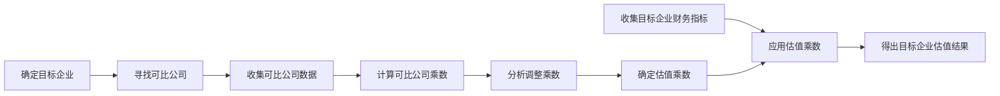

# 企业估值中的相对估值法

> 关键词：企业估值、相对估值法、可比公司、乘数模型、财务指标

> 摘要：本文围绕企业估值中的相对估值法展开，详细介绍了相对估值法的背景、核心概念、算法原理、数学模型等内容。通过实际案例展示了相对估值法在企业估值中的应用，分析了其实际应用场景，并推荐了相关的学习资源、开发工具和论文著作。最后对相对估值法的未来发展趋势与挑战进行了总结，同时解答了常见问题，为读者全面了解和应用相对估值法提供了有价值的参考。

## 1. 背景介绍 
### 1.1 目的和范围
企业估值是金融领域的核心问题之一，它对于投资者、管理者、并购方等众多利益相关者都具有至关重要的意义。相对估值法作为企业估值的重要方法之一，旨在通过比较目标企业与可比公司的某些财务指标或市场数据，来估算目标企业的价值。本文的目的在于深入探讨相对估值法的原理、操作步骤、应用场景等方面，帮助读者全面掌握这一方法，并能够在实际工作中合理运用。本文的范围涵盖相对估值法的基本概念、核心算法、数学模型、实际案例分析以及相关的工具和资源推荐等内容。

### 1.2 预期读者
本文预期读者包括金融领域的从业者，如投资银行家、分析师、基金经理等，他们在日常工作中需要对企业进行估值，相对估值法是他们常用的工具之一；同时也适合企业管理者，帮助他们了解自身企业的市场价值，为战略决策提供依据；此外，对于金融专业的学生和对企业估值感兴趣的爱好者，本文也能为他们提供系统的学习资料。

### 1.3 文档结构概述
本文将按照以下结构展开：首先介绍相对估值法的背景信息，包括目的、预期读者和文档结构概述等；接着阐述相对估值法的核心概念，通过文本示意图和 Mermaid 流程图展示其原理和架构；然后详细讲解核心算法原理和具体操作步骤，并使用 Python 源代码进行阐述；随后介绍相对估值法的数学模型和公式，并举例说明；再通过实际案例展示相对估值法的应用过程；之后分析相对估值法的实际应用场景；接着推荐相关的学习资源、开发工具和论文著作；最后对相对估值法的未来发展趋势与挑战进行总结，并解答常见问题，提供扩展阅读和参考资料。

### 1.4 术语表
#### 1.4.1 核心术语定义
- **企业估值**：指对企业的经济价值进行评估的过程，确定企业在特定时间点的市场价值。
- **相对估值法**：通过比较目标企业与可比公司的某些财务指标或市场数据，来估算目标企业价值的方法。
- **可比公司**：与目标企业在业务、规模、行业等方面具有相似特征的企业。
- **乘数**：用于衡量企业价值与某一财务指标之间关系的比率，如市盈率、市净率等。

#### 1.4.2 相关概念解释
- **财务指标**：反映企业财务状况和经营成果的指标，如净利润、净资产、营业收入等。
- **市场数据**：包括股票价格、市值等与市场交易相关的数据。
- **估值基准**：在相对估值法中，作为比较基础的财务指标或市场数据。

#### 1.4.3 缩略词列表
- **PE**：市盈率（Price-to-Earnings Ratio），即股票价格与每股收益的比率。
- **PB**：市净率（Price-to-Book Ratio），即股票价格与每股净资产的比率。
- **PS**：市销率（Price-to-Sales Ratio），即股票价格与每股销售收入的比率。

## 2. 核心概念与联系 

相对估值法的核心思想是基于“类似的资产应该具有类似的价值”这一原则。通过寻找与目标企业具有相似特征的可比公司，以可比公司的某些财务指标或市场数据为基础，计算出相应的乘数，再将该乘数应用到目标企业的相关财务指标上，从而估算出目标企业的价值。

### 核心概念原理的文本示意图
相对估值法的原理可以用以下文本示意图表示：

首先确定目标企业，然后寻找在业务、规模、行业等方面与目标企业相似的可比公司集合。收集可比公司的市场数据（如股票价格）和财务数据（如净利润、净资产等），计算可比公司的乘数（如市盈率、市净率等）。对这些乘数进行分析和调整，得到合适的估值乘数。最后将该估值乘数应用到目标企业的相应财务指标上，得出目标企业的估值结果。

### Mermaid 流程图


## 3. 核心算法原理 & 具体操作步骤 

### 核心算法原理
相对估值法的核心算法基于乘数模型，常见的乘数包括市盈率（PE）、市净率（PB）、市销率（PS）等。以市盈率为例，其计算公式为：

$PE = \frac{股票价格}{每股收益}$

在相对估值法中，我们先计算可比公司的平均市盈率，然后将该平均市盈率乘以目标企业的每股收益，即可得到目标企业的估值。

### 具体操作步骤
1. **确定目标企业**：明确需要进行估值的企业。
2. **寻找可比公司**：从同一行业或具有相似业务模式的企业中挑选与目标企业在规模、盈利能力、增长前景等方面相近的公司。
3. **收集数据**：收集可比公司和目标企业的相关财务数据，如净利润、净资产、营业收入等，以及可比公司的市场数据，如股票价格。
4. **计算乘数**：根据收集到的数据，计算可比公司的各种乘数，如市盈率、市净率、市销率等。
5. **分析调整乘数**：对计算得到的乘数进行分析，考虑可比公司与目标企业之间的差异，对乘数进行适当调整。
6. **确定估值乘数**：选择合适的乘数作为估值基准。
7. **应用估值乘数**：将确定的估值乘数乘以目标企业的相应财务指标，得到目标企业的估值。

### Python 源代码实现
```python
import pandas as pd

# 定义可比公司数据
comparable_companies = {
    'Company': ['Company A', 'Company B', 'Company C'],
    'Stock Price': [50, 60, 70],
    'Earnings per Share': [2, 3, 4]
}

# 创建可比公司数据框
df_comparable = pd.DataFrame(comparable_companies)

# 计算可比公司的市盈率
df_comparable['PE Ratio'] = df_comparable['Stock Price'] / df_comparable['Earnings per Share']

# 计算平均市盈率
average_pe = df_comparable['PE Ratio'].mean()

# 定义目标企业的每股收益
target_eps = 2.5

# 计算目标企业的估值
target_valuation = average_pe * target_eps

print(f"可比公司平均市盈率: {average_pe}")
print(f"目标企业的估值: {target_valuation}")
```

## 4. 数学模型和公式 & 详细讲解 & 举例说明 

### 常见的乘数模型和公式
1. **市盈率（PE）模型**
    - 公式：$PE = \frac{P}{EPS}$，其中 $P$ 为股票价格，$EPS$ 为每股收益。
    - 目标企业估值公式：$V = PE_{avg} \times EPS_{target}$，其中 $PE_{avg}$ 为可比公司的平均市盈率，$EPS_{target}$ 为目标企业的每股收益。
2. **市净率（PB）模型**
    - 公式：$PB = \frac{P}{BVPS}$，其中 $P$ 为股票价格，$BVPS$ 为每股净资产。
    - 目标企业估值公式：$V = PB_{avg} \times BVPS_{target}$，其中 $PB_{avg}$ 为可比公司的平均市净率，$BVPS_{target}$ 为目标企业的每股净资产。
3. **市销率（PS）模型**
    - 公式：$PS = \frac{P}{SPS}$，其中 $P$ 为股票价格，$SPS$ 为每股销售收入。
    - 目标企业估值公式：$V = PS_{avg} \times SPS_{target}$，其中 $PS_{avg}$ 为可比公司的平均市销率，$SPS_{target}$ 为目标企业的每股销售收入。

### 详细讲解
这些乘数模型的基本思想是通过比较目标企业与可比公司在不同财务指标上的相对价值，来估算目标企业的价值。市盈率反映了市场对企业盈利的预期，市净率反映了企业的净资产价值，市销率则反映了企业的销售收入规模。在实际应用中，需要根据企业的特点和行业的特性选择合适的乘数模型。

### 举例说明
假设我们要对一家科技公司进行估值，选择了三家可比的科技公司，其相关数据如下：

| 公司名称 | 股票价格（元） | 每股收益（元） | 每股净资产（元） | 每股销售收入（元） |
| ---- | ---- | ---- | ---- | ---- |
| 可比公司 A | 100 | 5 | 20 | 30 |
| 可比公司 B | 120 | 6 | 25 | 35 |
| 可比公司 C | 150 | 7 | 30 | 40 |

1. **计算乘数**
    - 市盈率：
        - 可比公司 A 的市盈率：$PE_A = \frac{100}{5} = 20$
        - 可比公司 B 的市盈率：$PE_B = \frac{120}{6} = 20$
        - 可比公司 C 的市盈率：$PE_C = \frac{150}{7} \approx 21.43$
        - 平均市盈率：$PE_{avg} = \frac{20 + 20 + 21.43}{3} \approx 20.48$
    - 市净率：
        - 可比公司 A 的市净率：$PB_A = \frac{100}{20} = 5$
        - 可比公司 B 的市净率：$PB_B = \frac{120}{25} = 4.8$
        - 可比公司 C 的市净率：$PB_C = \frac{150}{30} = 5$
        - 平均市净率：$PB_{avg} = \frac{5 + 4.8 + 5}{3} \approx 4.93$
    - 市销率：
        - 可比公司 A 的市销率：$PS_A = \frac{100}{30} \approx 3.33$
        - 可比公司 B 的市销率：$PS_B = \frac{120}{35} \approx 3.43$
        - 可比公司 C 的市销率：$PS_C = \frac{150}{40} = 3.75$
        - 平均市销率：$PS_{avg} = \frac{3.33 + 3.43 + 3.75}{3} \approx 3.5$

2. **假设目标企业的每股收益为 6 元，每股净资产为 22 元，每股销售收入为 32 元**
    - 基于市盈率模型的估值：$V_{PE} = 20.48 \times 6 = 122.88$（元）
    - 基于市净率模型的估值：$V_{PB} = 4.93 \times 22 = 108.46$（元）
    - 基于市销率模型的估值：$V_{PS} = 3.5 \times 32 = 112$（元）

## 5. 项目实战：代码实际案例和详细解释说明 

### 5.1  开发环境搭建
要实现相对估值法的代码，我们可以使用 Python 编程语言。以下是开发环境搭建的步骤：
1. **安装 Python**：从 Python 官方网站（https://www.python.org/downloads/）下载并安装适合你操作系统的 Python 版本。
2. **安装必要的库**：我们需要使用 `pandas` 库来处理数据，使用以下命令进行安装：
```sh
pip install pandas
```

### 5.2  源代码详细实现和代码解读
```python
import pandas as pd

# 定义可比公司数据
comparable_companies = {
    'Company': ['Company X', 'Company Y', 'Company Z'],
    'Stock Price': [80, 90, 100],
    'Earnings per Share': [4, 5, 6],
    'Book Value per Share': [20, 25, 30],
    'Sales per Share': [30, 35, 40]
}

# 创建可比公司数据框
df_comparable = pd.DataFrame(comparable_companies)

# 计算可比公司的市盈率、市净率和市销率
df_comparable['PE Ratio'] = df_comparable['Stock Price'] / df_comparable['Earnings per Share']
df_comparable['PB Ratio'] = df_comparable['Stock Price'] / df_comparable['Book Value per Share']
df_comparable['PS Ratio'] = df_comparable['Stock Price'] / df_comparable['Sales per Share']

# 计算平均市盈率、市净率和市销率
average_pe = df_comparable['PE Ratio'].mean()
average_pb = df_comparable['PB Ratio'].mean()
average_ps = df_comparable['PS Ratio'].mean()

# 定义目标企业的财务指标
target_eps = 5
target_bvps = 22
target_sps = 33

# 计算目标企业基于不同乘数模型的估值
target_valuation_pe = average_pe * target_eps
target_valuation_pb = average_pb * target_bvps
target_valuation_ps = average_ps * target_sps

print("可比公司数据：")
print(df_comparable)
print(f"平均市盈率: {average_pe}")
print(f"平均市净率: {average_pb}")
print(f"平均市销率: {average_ps}")
print(f"目标企业基于市盈率模型的估值: {target_valuation_pe}")
print(f"目标企业基于市净率模型的估值: {target_valuation_pb}")
print(f"目标企业基于市销率模型的估值: {target_valuation_ps}")
```

### 代码解读与分析
1. **数据定义**：首先，我们定义了一个包含可比公司信息的字典 `comparable_companies`，其中包括公司名称、股票价格、每股收益、每股净资产和每股销售收入。
2. **数据处理**：使用 `pandas` 库的 `DataFrame` 函数将字典转换为数据框 `df_comparable`，方便后续的数据处理。
3. **乘数计算**：分别计算可比公司的市盈率、市净率和市销率，并将结果添加到数据框中。
4. **平均乘数计算**：计算可比公司的平均市盈率、市净率和市销率。
5. **目标企业估值**：定义目标企业的每股收益、每股净资产和每股销售收入，然后使用平均乘数计算目标企业基于不同乘数模型的估值。
6. **结果输出**：打印可比公司数据、平均乘数和目标企业的估值结果。

## 6. 实际应用场景 
相对估值法在实际中有广泛的应用场景，以下是一些常见的场景：
1. **投资决策**：投资者在选择投资标的时，需要对企业的价值进行评估。相对估值法可以帮助投资者快速比较不同企业的相对价值，判断股票是否被高估或低估，从而做出投资决策。
2. **并购重组**：在企业并购重组过程中，需要确定目标企业的合理价格。相对估值法可以为并购方提供一个参考价格，帮助其评估并购的可行性和合理性。
3. **企业融资**：企业在进行股权融资或债权融资时，需要向投资者或债权人展示企业的价值。相对估值法可以帮助企业确定合理的融资价格，提高融资的成功率。
4. **财务分析**：分析师在对企业进行财务分析时，使用相对估值法可以了解企业在行业中的地位和竞争力，评估企业的经营绩效和发展前景。

## 7. 工具和资源推荐
### 7.1 学习资源推荐
#### 7.1.1 书籍推荐
- 《估值：难点、解决方案及相关案例》：本书详细介绍了各种估值方法，包括相对估值法，通过丰富的案例帮助读者理解和应用估值技巧。
- 《投资中最简单的事》：从投资的角度出发，介绍了如何运用相对估值法等方法进行股票投资，具有很强的实践指导意义。

#### 7.1.2 在线课程
- Coursera 上的“Corporate Finance”课程：该课程涵盖了企业估值的相关内容，包括相对估值法的原理和应用，由知名教授授课，内容丰富。
- 网易云课堂上的“金融估值分析实战”课程：通过实际案例讲解相对估值法等估值方法的应用，适合有一定基础的学习者。

#### 7.1.3 技术博客和网站
- Seeking Alpha：提供大量的金融分析文章和企业估值报告，其中包括对相对估值法的应用案例分析。
- 雪球网：国内知名的财经社区，有很多投资者分享企业估值的经验和方法，对学习相对估值法有很大帮助。

### 7.2 开发工具框架推荐
#### 7.2.1 IDE和编辑器
- PyCharm：功能强大的 Python 集成开发环境，提供代码编辑、调试、版本控制等功能，适合开发相对估值法的代码。
- Jupyter Notebook：交互式的开发环境，方便进行数据探索和代码演示，对于学习和实践相对估值法非常有用。

#### 7.2.2 调试和性能分析工具
- Py-Spy：可以对 Python 代码进行性能分析，帮助找出代码中的性能瓶颈，优化相对估值法的代码。
- pdb：Python 内置的调试器，可以帮助开发者定位代码中的错误，确保相对估值法代码的正确性。

#### 7.2.3 相关框架和库
- Pandas：用于数据处理和分析的 Python 库，在相对估值法中可以方便地处理可比公司和目标企业的数据。
- NumPy：提供高效的数值计算功能，在计算乘数和估值时可以提高代码的运行效率。

### 7.3 相关论文著作推荐
#### 7.3.1 经典论文
- "Valuation Using Multiples"：该论文详细介绍了相对估值法的原理、方法和应用，是相对估值法领域的经典之作。
- "Comparable Company Analysis: A Guide to Valuing a Business"：对可比公司分析这一相对估值法的核心方法进行了深入探讨，具有很高的学术价值。

#### 7.3.2 最新研究成果
- 关注顶级金融学术期刊，如《Journal of Finance》《Review of Financial Studies》等，这些期刊会发表关于企业估值的最新研究成果，包括相对估值法的改进和应用。

#### 7.3.3 应用案例分析
- 各大投资银行的研究报告中经常会有相对估值法的应用案例分析，可以通过阅读这些报告了解相对估值法在实际项目中的应用。

## 8. 总结：未来发展趋势与挑战
### 未来发展趋势
1. **与大数据和人工智能的结合**：随着大数据和人工智能技术的发展，相对估值法可以利用更多的数据来源和更先进的算法进行分析。例如，通过挖掘社交媒体数据、行业报告等非结构化数据，更全面地评估企业的价值；利用机器学习算法对可比公司进行筛选和乘数的调整，提高估值的准确性。
2. **跨行业和跨境估值的应用**：全球化的发展使得企业的业务范围越来越广泛，跨行业和跨境并购、投资等活动日益频繁。相对估值法将在这些领域得到更广泛的应用，需要考虑不同行业和国家的差异，开发更适合的估值模型。
3. **与其他估值方法的融合**：相对估值法虽然简单易懂，但也存在一定的局限性。未来，它可能会与绝对估值法（如现金流折现法）等其他估值方法相结合，综合考虑企业的各种因素，提供更准确的估值结果。

### 挑战
1. **可比公司的选择难度增加**：随着市场的发展和企业的多元化经营，找到真正具有可比性的公司变得越来越困难。不同企业在业务模式、财务结构、发展阶段等方面存在差异，需要更加细致地筛选和调整可比公司。
2. **市场波动的影响**：相对估值法依赖于市场数据，市场波动会对乘数的计算产生影响，导致估值结果的不稳定。在市场大幅波动的情况下，如何准确评估企业的价值是一个挑战。
3. **新兴行业的估值难题**：对于一些新兴行业，如人工智能、区块链等，由于缺乏历史数据和成熟的商业模式，传统的相对估值法可能不适用。需要开发新的估值指标和方法来适应这些新兴行业的特点。

## 9. 附录：常见问题与解答
### 问题 1：如何选择合适的可比公司？
解答：选择可比公司时，需要考虑多个因素。首先，行业是一个重要的因素，应选择与目标企业处于同一行业或具有相似业务模式的公司。其次，规模也是一个关键因素，可比公司的规模应与目标企业相近。此外，还需要考虑企业的盈利能力、增长前景、财务结构等因素。可以通过行业研究报告、数据库等途径寻找可比公司，并对其进行详细的分析和筛选。

### 问题 2：不同乘数模型的适用范围是什么？
解答：市盈率模型适用于盈利稳定、行业成熟的企业，因为市盈率反映了市场对企业盈利的预期。市净率模型适用于资产密集型企业，如制造业、银行业等，因为市净率反映了企业的净资产价值。市销率模型适用于尚未盈利或盈利不稳定的企业，如互联网企业、初创企业等，因为市销率反映了企业的销售收入规模。

### 问题 3：相对估值法的局限性有哪些？
解答：相对估值法的局限性主要包括以下几点。首先，它依赖于可比公司的选择，如果可比公司选择不当，会导致估值结果不准确。其次，相对估值法只考虑了企业的相对价值，没有考虑企业的内在价值和未来现金流。此外，市场波动会对乘数的计算产生影响，导致估值结果的不稳定。

## 10. 扩展阅读 & 参考资料
### 扩展阅读
- 《金融炼金术》：乔治·索罗斯的著作，探讨了金融市场的运行规律和投资者的心理，对理解企业估值和市场波动有一定的帮助。
- 《聪明的投资者》：本杰明·格雷厄姆的经典著作，介绍了价值投资的理念和方法，其中包括企业估值的相关内容。

### 参考资料
- Damodaran, A. (2012). The Dark Side of Valuation: Valuing Young, Distressed, and Complex Businesses. Pearson.
- Koller, T., Goedhart, M., & Wessels, D. (2015). Valuation: Measuring and Managing the Value of Companies. Wiley.

作者：AI天才研究院/AI Genius Institute & 禅与计算机程序设计艺术 /Zen And The Art of Computer Programming