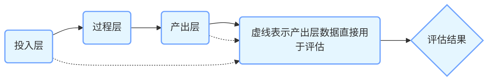

# 企业估值中的研发效率评估

> 关键词：企业估值、研发效率评估、研发投入、产出指标、评估模型

> 摘要：本文聚焦于企业估值中的研发效率评估这一关键主题。在当今竞争激烈的商业环境中，研发能力是企业核心竞争力的重要组成部分，准确评估研发效率对于合理确定企业价值至关重要。文章将深入探讨研发效率评估的背景、核心概念、算法原理、数学模型等内容，并结合实际案例展示评估过程，同时介绍相关工具和资源，最后对未来发展趋势与挑战进行总结，旨在为企业管理者、投资者等提供全面且深入的研发效率评估知识和方法。

## 1. 背景介绍 
### 1.1 目的和范围
在企业的发展进程中，研发活动是推动创新、提升竞争力的关键因素。研发投入往往占据企业大量的资源，然而研发成果的不确定性使得准确衡量研发效率变得困难。本研究的目的在于建立一套科学、合理的研发效率评估体系，以帮助企业管理者更好地了解研发资源的利用情况，优化研发决策；同时为投资者提供参考，以便更准确地评估企业的价值和发展潜力。

本研究的范围涵盖了不同行业、不同规模的企业，重点关注研发投入与产出之间的关系，通过多种指标和方法来综合评估研发效率。

### 1.2 预期读者
本文的预期读者主要包括企业管理者、研发部门负责人、投资者、金融分析师以及对企业研发管理和估值感兴趣的研究人员。企业管理者可以借助本文的评估方法优化研发资源配置，提高研发效率；投资者和金融分析师可以利用研发效率评估结果更准确地评估企业价值，做出投资决策；研究人员则可以从理论和实践的角度深入探讨研发效率评估的相关问题。

### 1.3 文档结构概述
本文将按照以下结构展开：首先介绍核心概念与联系，明确研发效率评估所涉及的基本概念和它们之间的关系；接着阐述核心算法原理和具体操作步骤，通过 Python 代码详细说明评估过程；然后介绍数学模型和公式，并结合实例进行讲解；再通过项目实战展示实际案例和代码解读；之后探讨实际应用场景；推荐相关的工具和资源；最后总结未来发展趋势与挑战，并提供常见问题与解答以及扩展阅读和参考资料。

### 1.4 术语表
#### 1.4.1 核心术语定义
- **研发效率**：指企业在研发活动中，投入的资源（如资金、人力、时间等）与所获得的产出（如新产品、新技术、专利等）之间的比率关系。它反映了企业利用研发资源创造价值的能力。
- **研发投入**：企业在一定时期内用于研发活动的各种资源的总和，主要包括研发资金投入、研发人员投入等。
- **研发产出**：企业通过研发活动所获得的成果，如新产品销售收入、专利数量、技术转让收入等。

#### 1.4.2 相关概念解释
- **全要素生产率（TFP）**：衡量生产过程中所有投入要素综合利用效率的指标，在研发效率评估中可用于综合考虑多种投入要素对研发产出的影响。
- **数据包络分析（DEA）**：一种非参数的效率评估方法，通过构建生产前沿面来评估决策单元（如企业）的相对效率。

#### 1.4.3 缩略词列表
- **R&D**：Research and Development，即研究与开发。
- **DEA**：Data Envelopment Analysis，数据包络分析。
- **TFP**：Total Factor Productivity，全要素生产率。

## 2. 核心概念与联系 

### 核心概念原理
研发效率评估的核心在于理解研发投入与研发产出之间的关系。研发投入是企业为开展研发活动所付出的成本，包括资金、人力、设备等方面的投入。研发产出则是研发活动带来的各种成果，如新产品的推出、新技术的应用、专利的获得等。研发效率就是衡量在一定的研发投入下，能够获得多少研发产出。

从原理上讲，研发效率可以用简单的比率来表示：研发效率 = 研发产出 / 研发投入。然而，实际情况中研发投入和产出的衡量并非如此简单，研发投入不仅包括直接的资金投入，还涉及到人力的时间成本、设备的折旧等；研发产出也不仅仅是数量上的成果，还包括成果的质量、市场价值等因素。

### 架构的文本示意图
研发效率评估的架构可以分为以下几个层次：
- **投入层**：包括研发资金投入、研发人员投入、研发设备投入等。这些投入是研发活动的基础，为研发产出提供了必要的资源。
- **过程层**：涉及研发项目的管理、研发流程的优化等。良好的研发过程管理可以提高研发效率，减少资源的浪费。
- **产出层**：涵盖新产品销售收入、专利数量、技术转让收入等。这些产出是研发活动的直接成果，反映了研发投入的价值。
- **评估层**：通过各种评估方法和指标，对研发投入和产出进行综合分析，得出研发效率的评估结果。

### Mermaid 流程图


该流程图展示了研发效率评估的整体架构，从投入层开始，经过过程层的研发活动，产生产出层的成果，最后在评估层进行综合评估，得出评估结果。同时，投入层和产出层的数据也直接用于评估，体现了评估过程对原始数据的依赖。

## 3. 核心算法原理 & 具体操作步骤 

### 算法原理
在研发效率评估中，常用的算法有数据包络分析（DEA）和随机前沿分析（SFA）等。这里我们重点介绍数据包络分析（DEA），它是一种基于线性规划的非参数方法，用于评估多个决策单元（DMU）的相对效率。

DEA 的基本思想是通过构建一个生产前沿面，将所有决策单元投影到该前沿面上，位于前沿面上的决策单元被认为是相对有效的，而偏离前沿面的决策单元则存在效率损失。

### Python 源代码详细阐述
以下是一个使用 Python 的`pydoe`库实现的简单 DEA 模型示例：
```python
import numpy as np
from pydoe import dea

# 定义决策单元（DMU）的投入和产出数据
# 假设有 5 个企业，每个企业有 2 种投入和 1 种产出
inputs = np.array([[2, 3], [4, 6], [3, 5], [5, 7], [6, 8]])
outputs = np.array([[5], [8], [6], [9], [10]])

# 运行 DEA 模型
efficiencies = dea(inputs, outputs, orientation='in')

# 输出每个决策单元的效率值
for i, eff in enumerate(efficiencies):
    print(f"企业 {i + 1} 的研发效率: {eff}")
```
### 具体操作步骤
1. **数据收集**：收集各个决策单元（如企业）的研发投入和产出数据。投入数据可以包括研发资金、研发人员数量等，产出数据可以包括新产品销售收入、专利数量等。
2. **数据预处理**：对收集到的数据进行清洗和标准化处理，确保数据的准确性和可比性。
3. **选择评估模型**：根据研究目的和数据特点，选择合适的评估模型，如 DEA 模型。
4. **运行模型**：使用 Python 等编程语言实现所选的评估模型，并将预处理后的数据输入模型进行计算。
5. **结果分析**：根据模型输出的效率值，对各个决策单元的研发效率进行排名和分析，找出效率较高和较低的企业，并分析其原因。

## 4. 数学模型和公式 & 详细讲解 & 举例说明 

### 数据包络分析（DEA）的数学模型
DEA 模型有多种形式，其中最基本的是 CCR 模型（Charnes - Cooper - Rhodes 模型）。CCR 模型假设规模报酬不变，用于评估决策单元的技术效率。

设共有 $n$ 个决策单元（DMU），每个决策单元有 $m$ 种投入和 $s$ 种产出。对于第 $j$ 个决策单元，其投入向量为 $x_j=(x_{1j},x_{2j},\cdots,x_{mj})^T$，产出向量为 $y_j=(y_{1j},y_{2j},\cdots,y_{sj})^T$。

CCR 模型的数学表达式如下：
$$
\begin{align*}
\max\ & \theta \\
\text{s.t.} & \sum_{j = 1}^{n} \lambda_j x_{ij} \leq \theta x_{i0}, \quad i = 1,2,\cdots,m \\
& \sum_{j = 1}^{n} \lambda_j y_{rj} \geq y_{r0}, \quad r = 1,2,\cdots,s \\
& \lambda_j \geq 0, \quad j = 1,2,\cdots,n
\end{align*}
$$
其中，$\theta$ 是待评估决策单元 $DMU_0$ 的效率值，$\lambda_j$ 是权重系数。

### 详细讲解
目标函数 $\max\ \theta$ 表示最大化待评估决策单元的效率值。约束条件 $\sum_{j = 1}^{n} \lambda_j x_{ij} \leq \theta x_{i0}$ 表示在加权组合其他决策单元的投入时，不能超过待评估决策单元投入的 $\theta$ 倍；约束条件 $\sum_{j = 1}^{n} \lambda_j y_{rj} \geq y_{r0}$ 表示在加权组合其他决策单元的产出时，要不少于待评估决策单元的产出。

### 举例说明
假设有 3 个企业（决策单元），投入和产出数据如下表所示：

| 企业 | 研发资金投入（万元） | 研发人员数量 | 新产品销售收入（万元） |
| ---- | -------------------- | ------------ | ---------------------- |
| 企业 1 | 100 | 10 | 200 |
| 企业 2 | 200 | 20 | 300 |
| 企业 3 | 150 | 15 | 250 |

将这些数据代入 CCR 模型进行计算，假设我们要评估企业 1 的研发效率。设 $\theta$ 为企业 1 的效率值，$\lambda_1,\lambda_2,\lambda_3$ 为权重系数。

则目标函数为 $\max\ \theta$，约束条件为：
$$
\begin{align*}
100\lambda_1 + 200\lambda_2 + 150\lambda_3 &\leq 100\theta \\
10\lambda_1 + 20\lambda_2 + 15\lambda_3 &\leq 10\theta \\
200\lambda_1 + 300\lambda_2 + 250\lambda_3 &\geq 200 \\
\lambda_1,\lambda_2,\lambda_3 &\geq 0
\end{align*}
$$
通过求解这个线性规划问题，可以得到企业 1 的研发效率值 $\theta$。如果 $\theta = 1$，则说明企业 1 是技术有效的；如果 $\theta < 1$，则说明企业 1 存在效率损失。

## 5. 项目实战：代码实际案例和详细解释说明 

### 5.1  开发环境搭建
在进行研发效率评估的项目实战之前，需要搭建相应的开发环境。以下是具体步骤：
1. **安装 Python**：建议使用 Python 3.7 及以上版本，可以从 Python 官方网站（https://www.python.org/downloads/）下载并安装。
2. **安装必要的库**：需要安装`numpy`、`pandas`、`pydoe`等库。可以使用`pip`命令进行安装：
```sh
pip install numpy pandas pydoe
```
3. **选择开发工具**：可以使用 Jupyter Notebook、PyCharm 等开发工具。Jupyter Notebook 适合进行交互式开发和数据分析，PyCharm 则是一个功能强大的 Python 集成开发环境。

### 5.2  源代码详细实现和代码解读
以下是一个完整的研发效率评估项目实战代码示例：
```python
import numpy as np
import pandas as pd
from pydoe import dea

# 读取数据
data = pd.read_csv('r_d_data.csv')

# 提取投入和产出数据
inputs = data[['研发资金投入', '研发人员数量']].values
outputs = data[['新产品销售收入']].values

# 运行 DEA 模型
efficiencies = dea(inputs, outputs, orientation='in')

# 将效率值添加到原始数据中
data['研发效率'] = efficiencies

# 按研发效率降序排序
sorted_data = data.sort_values(by='研发效率', ascending=False)

# 输出结果
print(sorted_data)

# 保存结果到 CSV 文件
sorted_data.to_csv('r_d_efficiency_results.csv', index=False)
```
### 代码解读
1. **数据读取**：使用`pandas`库的`read_csv`函数读取存储研发投入和产出数据的 CSV 文件。
2. **数据提取**：从读取的数据中提取投入和产出数据，并将其转换为`numpy`数组。
3. **运行 DEA 模型**：使用`pydoe`库的`dea`函数运行 DEA 模型，计算每个决策单元的研发效率。
4. **结果处理**：将计算得到的研发效率值添加到原始数据中，并按研发效率降序排序。
5. **结果输出**：打印排序后的结果，并将结果保存到新的 CSV 文件中。

### 5.3  代码解读与分析
通过上述代码，我们可以对多个企业的研发效率进行评估和比较。排序后的结果可以帮助我们快速找出研发效率较高和较低的企业。对于研发效率较高的企业，可以分析其成功经验，如研发管理模式、技术创新策略等；对于研发效率较低的企业，则需要深入分析原因，如研发资源配置不合理、研发流程存在问题等，并提出相应的改进措施。

## 6. 实际应用场景 
### 企业内部管理
在企业内部，研发效率评估可以帮助企业管理者更好地了解研发部门的工作绩效，优化研发资源配置。通过对不同研发项目的效率评估，管理者可以确定哪些项目具有较高的投入产出比，从而加大对这些项目的资源支持；对于效率较低的项目，则可以考虑调整研发策略或终止项目，避免资源的浪费。

### 投资者决策
投资者在进行投资决策时，研发效率是一个重要的参考指标。研发效率高的企业通常具有更强的创新能力和市场竞争力，未来的发展潜力更大。投资者可以通过评估企业的研发效率，筛选出具有投资价值的企业，提高投资回报率。

### 行业比较
研发效率评估还可以用于行业内企业之间的比较。通过对同行业不同企业的研发效率进行排名和分析，可以了解企业在行业中的地位和竞争力。对于行业内研发效率较低的企业，可以借鉴效率较高企业的经验，提升自身的研发水平。

### 政府政策制定
政府在制定科技政策时，需要考虑企业的研发效率。通过对不同行业、不同地区企业的研发效率进行评估，政府可以了解科技资源的利用情况，制定针对性的政策措施，如加大对研发效率较低地区和行业的扶持力度，促进科技资源的合理配置和高效利用。

## 7. 工具和资源推荐
### 7.1 学习资源推荐
#### 7.1.1 书籍推荐
- 《研发管理：赢在研发力》：本书全面介绍了研发管理的理论和实践，包括研发战略规划、研发项目管理、研发团队建设等内容，对于理解研发效率评估的背景和重要性有很大帮助。
- 《数据包络分析（DEA）：模型、方法与应用》：系统阐述了数据包络分析的基本原理、模型和应用案例，是学习 DEA 方法进行研发效率评估的重要参考书籍。

#### 7.1.2 在线课程
- Coursera 上的“Data Science Specialization”：该课程涵盖了数据分析、机器学习等多个领域的知识，其中包括一些关于效率评估的方法和技术，对于提升研发效率评估的数据分析能力有很大帮助。
- edX 上的“Operations Research: Models and Methods”：课程介绍了运筹学的基本模型和方法，包括线性规划等内容，对于理解 DEA 模型的数学原理有重要作用。

#### 7.1.3 技术博客和网站
- 博客园：有很多技术博主分享关于数据分析、机器学习等方面的经验和案例，其中不乏关于研发效率评估的相关内容。
- Kaggle：一个数据科学竞赛平台，上面有很多关于数据分析和建模的优秀案例和开源代码，可以从中学习到不同的评估方法和技巧。

### 7.2 开发工具框架推荐
#### 7.2.1 IDE和编辑器
- Jupyter Notebook：一个交互式的开发环境，适合进行数据分析和模型开发。可以方便地编写代码、运行代码和展示结果，并且支持 Markdown 文本和数学公式的显示。
- PyCharm：一款功能强大的 Python 集成开发环境，提供了代码编辑、调试、版本控制等一系列功能，适合大规模项目的开发。

#### 7.2.2 调试和性能分析工具
- Py-Spy：一个用于分析 Python 程序性能的工具，可以实时查看 Python 程序的 CPU 使用率、函数调用时间等信息，帮助开发者找出程序中的性能瓶颈。
- pdb：Python 内置的调试器，可以在代码中设置断点，逐步执行代码，查看变量的值，帮助开发者调试代码中的错误。

#### 7.2.3 相关框架和库
- Scikit-learn：一个常用的机器学习库，提供了丰富的机器学习算法和工具，如线性回归、决策树、支持向量机等，可以用于研发效率评估中的数据建模和分析。
- TensorFlow：一个开源的深度学习框架，适用于处理大规模数据和复杂的模型。在研发效率评估中，如果需要处理图像、文本等非结构化数据，可以考虑使用 TensorFlow 进行建模。

### 7.3 相关论文著作推荐
#### 7.3.1 经典论文
- Charnes, A., Cooper, W. W., & Rhodes, E. (1978). Measuring the efficiency of decision making units. European Journal of Operational Research, 2(6), 429 - 444. 该论文首次提出了数据包络分析（DEA）方法，是 DEA 领域的经典之作。
- Fare, R., Grosskopf, S., & Lovell, C. A. K. (1994). Production Frontiers. Cambridge University Press. 本书系统地介绍了生产前沿面理论和方法，对于理解研发效率评估的理论基础有重要意义。

#### 7.3.2 最新研究成果
- 近年来，随着人工智能和大数据技术的发展，一些研究开始将深度学习等方法应用于研发效率评估中。可以通过学术数据库（如 IEEE Xplore、ACM Digital Library 等）搜索相关的最新研究论文。

#### 7.3.3 应用案例分析
- 一些知名企业的研发效率评估案例可以在企业的年报、行业研究报告中找到。例如，苹果公司、华为公司等在研发管理和效率评估方面有很多成功的经验，可以进行深入分析和学习。

## 8. 总结：未来发展趋势与挑战
### 未来发展趋势
- **多维度评估**：未来的研发效率评估将不仅仅局限于传统的投入产出指标，还将考虑更多的维度，如研发成果的质量、市场影响力、社会价值等。例如，评估研发成果对环境保护、社会公平等方面的贡献。
- **智能化评估**：随着人工智能和大数据技术的不断发展，研发效率评估将越来越智能化。利用机器学习算法可以自动收集、分析和处理大量的研发数据，提高评估的准确性和效率。
- **跨学科融合**：研发效率评估将与管理学、经济学、统计学等多个学科进行更深入的融合。例如，结合经济学中的成本效益分析方法，更全面地评估研发活动的经济效益。

### 挑战
- **数据质量和获取难度**：准确的研发效率评估需要大量高质量的数据，但企业的研发数据往往存在分散、不完整、不准确等问题，同时数据的获取也受到企业隐私和安全等因素的限制。
- **评估指标的主观性**：研发产出的评估指标往往具有一定的主观性，如专利的质量、新产品的市场潜力等。如何制定客观、科学的评估指标是一个挑战。
- **动态评估的困难**：研发活动是一个动态的过程，研发效率也会随着时间和市场环境的变化而变化。如何进行动态的研发效率评估，及时反映研发活动的实际情况，是未来需要解决的问题。

## 9. 附录：常见问题与解答
### 问题 1：研发效率评估的结果是否具有绝对的可比性？
解答：研发效率评估的结果通常是相对的，不具有绝对的可比性。不同行业、不同企业的研发活动具有不同的特点和背景，其研发投入和产出的衡量标准也可能不同。因此，在进行比较时，需要考虑行业特点、企业规模等因素，进行合理的调整和分析。

### 问题 2：如何提高企业的研发效率？
解答：提高企业的研发效率可以从以下几个方面入手：优化研发资源配置，合理分配研发资金和人力；加强研发项目管理，提高项目的执行效率；建立有效的激励机制，激发研发人员的积极性和创造力；加强与外部科研机构和企业的合作，共享研发资源和成果。

### 问题 3：DEA 模型的局限性有哪些？
解答：DEA 模型的局限性主要包括：对数据的依赖性较强，如果数据存在误差或缺失，会影响评估结果的准确性；假设生产技术是固定的，没有考虑技术进步和创新的影响；只能评估相对效率，不能确定绝对效率水平。

## 10. 扩展阅读 & 参考资料
### 扩展阅读
- 《创新管理：技术、市场与组织变革的整合》：进一步深入探讨创新管理的理论和实践，对于理解研发效率评估在创新过程中的作用有很大帮助。
- 《大数据时代的企业管理变革》：介绍了大数据技术在企业管理中的应用，包括如何利用大数据进行研发效率评估和决策。

### 参考资料
- 企业年报和财务报告：可以从中获取企业的研发投入和产出数据。
- 行业研究报告：了解行业的发展趋势和企业的竞争态势，为研发效率评估提供背景信息。
- 学术数据库：如 IEEE Xplore、ACM Digital Library、CNKI 等，搜索相关的学术论文和研究成果。

作者：AI天才研究院/AI Genius Institute & 禅与计算机程序设计艺术 /Zen And The Art of Computer Programming