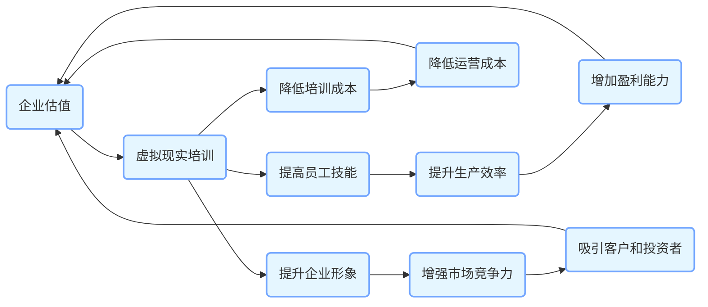

# 企业估值中的虚拟现实培训应用评估

> 关键词：企业估值、虚拟现实培训、应用评估、成本效益分析、投资回报率

> 摘要：本文聚焦于企业估值中虚拟现实培训应用的评估。随着虚拟现实技术的发展，其在企业培训领域的应用日益广泛。文章深入探讨了虚拟现实培训的核心概念、算法原理、数学模型等理论知识，并结合实际案例进行详细分析，旨在为企业在评估虚拟现实培训应用对自身价值的影响时提供全面的方法和思路。同时，介绍了相关的工具和资源，最后对未来发展趋势与挑战进行了总结。

## 1. 背景介绍 
### 1.1 目的和范围
本文章的目的在于为企业提供一套全面且系统的方法，用于评估虚拟现实培训在企业估值中的应用价值。随着科技的飞速发展，虚拟现实（VR）技术在企业培训中的应用越来越普遍。然而，企业在决定是否采用以及如何评估虚拟现实培训的效果和价值时，面临着诸多困惑。本文将涵盖虚拟现实培训的基本概念、评估方法、实际应用案例以及相关的工具和资源，帮助企业从多个角度对虚拟现实培训的应用进行评估，以确定其对企业价值的影响。

### 1.2 预期读者
本文的预期读者主要包括企业管理者、投资者、企业估值专家以及对虚拟现实技术在企业培训领域应用感兴趣的技术爱好者。企业管理者可以通过本文了解如何评估虚拟现实培训对企业绩效和价值的提升作用，从而做出合理的投资决策；投资者可以借助本文的评估方法，判断企业在虚拟现实培训方面的投资是否具有潜力；企业估值专家可以将本文的内容作为参考，更准确地评估企业的价值；技术爱好者则可以通过本文了解虚拟现实培训的相关技术和应用场景。

### 1.3 文档结构概述
本文将按照以下结构进行组织：首先介绍核心概念与联系，明确虚拟现实培训的定义、原理和架构；接着阐述核心算法原理和具体操作步骤，通过 Python 代码详细说明评估过程；然后介绍数学模型和公式，并结合实际例子进行讲解；之后通过项目实战，展示虚拟现实培训应用评估的具体代码实现和分析；再探讨实际应用场景，说明虚拟现实培训在不同行业的应用情况；随后推荐相关的工具和资源，包括学习资源、开发工具框架和论文著作；最后对未来发展趋势与挑战进行总结，并提供常见问题的解答和扩展阅读参考资料。

### 1.4 术语表
#### 1.4.1 核心术语定义
- **虚拟现实（VR）**：是一种利用计算机生成的模拟环境，通过头戴式显示器、手柄等设备，使用户产生身临其境的感觉，仿佛置身于虚拟世界中。
- **虚拟现实培训**：利用虚拟现实技术创建的培训环境，让学员在虚拟场景中进行学习和实践，以提高技能和知识水平。
- **企业估值**：对企业的整体价值进行评估的过程，通常考虑企业的资产、负债、盈利能力、市场竞争力等因素。
- **投资回报率（ROI）**：指投资所获得的收益与投资成本之间的比率，用于衡量投资的效益。

#### 1.4.2 相关概念解释
- **沉浸感**：虚拟现实技术的核心特征之一，指用户在虚拟环境中感受到的真实感和参与感。沉浸感越强，用户越能全身心地投入到虚拟场景中，从而提高培训效果。
- **交互性**：指用户与虚拟环境之间的互动能力。在虚拟现实培训中，交互性可以让学员与虚拟对象进行实时交互，模拟真实的操作场景，增强学习体验。
- **模拟场景**：虚拟现实培训中创建的虚拟环境，用于模拟实际工作场景或特定的学习情境。模拟场景可以根据培训需求进行定制，提供多样化的学习体验。

#### 1.4.3 缩略词列表
- **VR**：虚拟现实（Virtual Reality）
- **ROI**：投资回报率（Return on Investment）

## 2. 核心概念与联系 

### 2.1 虚拟现实培训的原理
虚拟现实培训的原理基于计算机图形学、人机交互技术和传感器技术。计算机通过生成虚拟场景的三维模型，利用图形渲染引擎将其呈现给用户。用户通过头戴式显示器、手柄等设备与虚拟场景进行交互，传感器实时采集用户的动作和位置信息，并将其反馈给计算机，从而实现用户与虚拟环境的实时互动。

### 2.2 虚拟现实培训与企业估值的联系
虚拟现实培训对企业估值有着多方面的影响。首先，它可以提高员工的培训效果和技能水平，从而提升企业的生产效率和产品质量，增加企业的盈利能力。其次，虚拟现实培训可以减少培训成本，如培训场地租赁、教材费用等，降低企业的运营成本。此外，采用先进的虚拟现实培训技术可以提升企业的形象和竞争力，吸引更多的客户和投资者，进而提高企业的市场价值。

### 2.3 核心概念架构示意图


该示意图展示了虚拟现实培训与企业估值之间的相互关系。虚拟现实培训通过提高员工技能、降低培训成本和提升企业形象等方面，对企业的生产效率、盈利能力、运营成本和市场竞争力产生影响，最终影响企业的估值。

## 3. 核心算法原理 & 具体操作步骤 

### 3.1 核心算法原理
在评估虚拟现实培训在企业估值中的应用时，我们可以采用成本效益分析和投资回报率（ROI）计算的方法。成本效益分析是指比较实施虚拟现实培训的成本与所获得的效益，以确定是否值得投资。投资回报率则是衡量投资效益的重要指标，计算公式为：

$$ROI = \frac{收益 - 成本}{成本} \times 100\%$$

### 3.2 具体操作步骤
#### 步骤 1：确定成本
虚拟现实培训的成本主要包括硬件设备成本、软件开发成本、培训师资成本和维护成本等。我们可以通过以下 Python 代码来计算总成本：

```python
# 定义各项成本
hardware_cost = 50000  # 硬件设备成本
software_cost = 30000  # 软件开发成本
training_teacher_cost = 20000  # 培训师资成本
maintenance_cost = 10000  # 维护成本

# 计算总成本
total_cost = hardware_cost + software_cost + training_teacher_cost + maintenance_cost

print(f"虚拟现实培训的总成本为: {total_cost} 元")
```

#### 步骤 2：确定收益
收益可以从多个方面来衡量，如提高生产效率带来的额外收入、降低培训成本节省的费用等。假设通过实施虚拟现实培训，企业的生产效率提高了 20%，原本的年收入为 100 万元，那么额外收入为：

```python
original_income = 1000000  # 原本的年收入
efficiency_improvement = 0.2  # 生产效率提高的比例

additional_income = original_income * efficiency_improvement

print(f"由于生产效率提高带来的额外收入为: {additional_income} 元")
```

#### 步骤 3：计算投资回报率
根据前面计算的成本和收益，我们可以使用 Python 代码计算投资回报率：

```python
# 计算投资回报率
roi = (additional_income - total_cost) / total_cost * 100

print(f"虚拟现实培训的投资回报率为: {roi}%")
```

### 3.3 算法总结
通过以上步骤，我们可以对虚拟现实培训在企业估值中的应用进行量化评估。首先确定实施虚拟现实培训的各项成本，然后估算所获得的收益，最后计算投资回报率。投资回报率越高，说明虚拟现实培训的效益越好，对企业估值的提升作用越大。

## 4. 数学模型和公式 & 详细讲解 & 举例说明 

### 4.1 成本效益分析模型
成本效益分析模型可以用以下公式表示：

$$效益 - 成本 > 0$$

当效益大于成本时，说明实施虚拟现实培训是值得的。效益可以包括直接效益和间接效益，直接效益如提高生产效率带来的额外收入，间接效益如提升企业形象、增强员工满意度等。成本则包括硬件设备成本、软件开发成本、培训师资成本和维护成本等。

### 4.2 投资回报率公式
投资回报率（ROI）的计算公式为：

$$ROI = \frac{收益 - 成本}{成本} \times 100\%$$

其中，收益是指实施虚拟现实培训后所获得的额外收入或节省的费用，成本是指实施虚拟现实培训的总成本。

### 4.3 举例说明
假设某企业计划实施虚拟现实培训，硬件设备成本为 80000 元，软件开发成本为 40000 元，培训师资成本为 30000 元，维护成本为 15000 元。通过实施虚拟现实培训，企业的生产效率提高了 25%，原本的年收入为 150 万元。

#### 计算总成本
总成本 = 硬件设备成本 + 软件开发成本 + 培训师资成本 + 维护成本
$$总成本 = 80000 + 40000 + 30000 + 15000 = 165000 元$$

#### 计算额外收入
额外收入 = 原本的年收入 × 生产效率提高的比例
$$额外收入 = 1500000 \times 0.25 = 375000 元$$

#### 计算投资回报率
$$ROI = \frac{375000 - 165000}{165000} \times 100\% \approx 127.27\%$$

从计算结果可以看出，该企业实施虚拟现实培训的投资回报率较高，说明该投资是值得的，对企业估值有积极的提升作用。

## 5. 项目实战：代码实际案例和详细解释说明 

### 5.1  开发环境搭建
为了实现虚拟现实培训应用评估的代码，我们可以使用 Python 编程语言。以下是搭建开发环境的步骤：

#### 步骤 1：安装 Python
从 Python 官方网站（https://www.python.org/downloads/）下载并安装适合你操作系统的 Python 版本。建议安装 Python 3.7 及以上版本。

#### 步骤 2：安装开发工具
可以选择使用 PyCharm、VS Code 等集成开发环境（IDE）来编写和运行 Python 代码。这里以 PyCharm 为例，从 JetBrains 官方网站（https://www.jetbrains.com/pycharm/download/）下载并安装 PyCharm 社区版。

#### 步骤 3：创建虚拟环境
虚拟环境可以隔离不同项目的依赖库，避免冲突。在命令行中使用以下命令创建虚拟环境：

```bash
python -m venv myenv
```

#### 步骤 4：激活虚拟环境
在 Windows 系统中，使用以下命令激活虚拟环境：

```bash
myenv\Scripts\activate
```

在 Linux 或 macOS 系统中，使用以下命令激活虚拟环境：

```bash
source myenv/bin/activate
```

### 5.2  源代码详细实现和代码解读
以下是一个完整的 Python 代码示例，用于评估虚拟现实培训在企业估值中的应用：

```python
# 定义各项成本
hardware_cost = 80000  # 硬件设备成本
software_cost = 40000  # 软件开发成本
training_teacher_cost = 30000  # 培训师资成本
maintenance_cost = 15000  # 维护成本

# 计算总成本
total_cost = hardware_cost + software_cost + training_teacher_cost + maintenance_cost

# 定义原本的年收入和生产效率提高的比例
original_income = 1500000  # 原本的年收入
efficiency_improvement = 0.25  # 生产效率提高的比例

# 计算额外收入
additional_income = original_income * efficiency_improvement

# 计算投资回报率
roi = (additional_income - total_cost) / total_cost * 100

# 输出结果
print(f"虚拟现实培训的总成本为: {total_cost} 元")
print(f"由于生产效率提高带来的额外收入为: {additional_income} 元")
print(f"虚拟现实培训的投资回报率为: {roi}%")
```

### 代码解读
- **定义各项成本**：通过变量定义硬件设备成本、软件开发成本、培训师资成本和维护成本。
- **计算总成本**：将各项成本相加得到总成本。
- **定义原本的年收入和生产效率提高的比例**：根据实际情况设定原本的年收入和生产效率提高的比例。
- **计算额外收入**：使用原本的年收入乘以生产效率提高的比例得到额外收入。
- **计算投资回报率**：根据投资回报率的公式计算投资回报率。
- **输出结果**：使用 `print` 函数输出总成本、额外收入和投资回报率。

### 5.3  代码解读与分析
通过以上代码，我们可以方便地计算虚拟现实培训的成本、收益和投资回报率。在实际应用中，我们可以根据不同的企业情况调整各项成本和收益的参数，以得到更准确的评估结果。同时，我们还可以对代码进行扩展，例如考虑更多的成本和收益因素，或者将计算结果保存到文件中进行进一步的分析。

## 6. 实际应用场景 
### 6.1 制造业
在制造业中，虚拟现实培训可以用于新员工的操作技能培训。例如，汽车制造企业可以利用虚拟现实技术创建汽车装配的虚拟场景，让新员工在虚拟环境中进行装配操作练习，避免了在实际生产线上进行操作可能带来的风险和损失。通过虚拟现实培训，新员工可以更快地掌握操作技能，提高生产效率和产品质量，从而为企业带来更高的收益。

### 6.2 医疗行业
医疗行业可以利用虚拟现实培训来提高医护人员的手术技能和应急处理能力。例如，通过创建虚拟的手术场景，医护人员可以在虚拟环境中进行手术模拟练习，熟悉手术流程和操作技巧。在遇到紧急情况时，医护人员可以通过虚拟现实培训获得的经验进行更快速、准确的处理，提高医疗服务的质量和安全性。

### 6.3 教育领域
在教育领域，虚拟现实培训可以为学生提供更加生动、直观的学习体验。例如，在历史、地理等学科的教学中，教师可以利用虚拟现实技术创建历史场景或地理环境，让学生身临其境地感受历史事件的发生和地理环境的特点。这样可以提高学生的学习兴趣和学习效果，促进学生的全面发展。

### 6.4 航空航天业
航空航天业对员工的技能和安全要求非常高。虚拟现实培训可以用于飞行员的飞行训练、航空工程师的设计培训等。例如，通过创建虚拟的飞行场景，飞行员可以在虚拟环境中进行各种飞行操作的训练，包括起飞、降落、应急处理等。这样可以减少实际飞行训练的成本和风险，同时提高飞行员的技能水平和应对突发事件的能力。

## 7. 工具和资源推荐
### 7.1 学习资源推荐
#### 7.1.1 书籍推荐
- 《虚拟现实技术与应用》：本书系统地介绍了虚拟现实技术的基本原理、关键技术和应用领域，适合初学者和有一定基础的读者阅读。
- 《企业估值：理论与实践》：详细讲解了企业估值的各种方法和模型，对于理解企业估值在虚拟现实培训应用评估中的作用有很大帮助。

#### 7.1.2 在线课程
- Coursera 上的“虚拟现实开发入门”课程：由知名高校的教授授课，涵盖了虚拟现实技术的基础知识和开发实践。
- Udemy 上的“企业估值实战”课程：通过实际案例讲解企业估值的方法和技巧，具有很强的实用性。

#### 7.1.3 技术博客和网站
- 虚拟现实技术博客（https://www.vrfocus.com/）：提供虚拟现实技术的最新资讯、技术文章和产品评测。
- 企业估值论坛（https://www.valuationforum.com/）：聚集了众多企业估值专家和从业者，分享企业估值的经验和案例。

### 7.2 开发工具框架推荐
#### 7.2.1 IDE和编辑器
- PyCharm：一款专业的 Python 集成开发环境，提供了丰富的代码编辑、调试和分析功能。
- Visual Studio Code：一款轻量级的代码编辑器，支持多种编程语言，具有丰富的插件生态系统。

#### 7.2.2 调试和性能分析工具
- Py-Spy：一个用于 Python 程序的性能分析工具，可以帮助开发者找出程序中的性能瓶颈。
- PDB：Python 内置的调试器，可以在程序运行过程中进行单步调试和变量查看。

#### 7.2.3 相关框架和库
- Unity：一个跨平台的游戏开发引擎，也广泛应用于虚拟现实开发。它提供了丰富的工具和资源，方便开发者创建虚拟现实场景和应用。
- OpenCV：一个开源的计算机视觉库，可以用于处理虚拟现实场景中的图像和视频数据。

### 7.3 相关论文著作推荐
#### 7.3.1 经典论文
- 《虚拟现实技术在企业培训中的应用研究》：该论文探讨了虚拟现实技术在企业培训中的应用现状、优势和挑战，为后续的研究提供了重要的参考。
- 《企业估值方法的比较与应用》：对各种企业估值方法进行了详细的比较和分析，有助于读者选择合适的估值方法。

#### 7.3.2 最新研究成果
- 《基于机器学习的虚拟现实培训效果评估模型》：提出了一种基于机器学习的虚拟现实培训效果评估模型，提高了评估的准确性和可靠性。
- 《虚拟现实培训对企业创新能力的影响研究》：研究了虚拟现实培训对企业创新能力的影响机制，为企业实施虚拟现实培训提供了理论支持。

#### 7.3.3 应用案例分析
- 《某制造业企业虚拟现实培训应用案例分析》：详细介绍了某制造业企业实施虚拟现实培训的过程、效果和经验教训，为其他企业提供了借鉴。
- 《医疗行业虚拟现实培训应用案例研究》：通过对医疗行业虚拟现实培训应用案例的研究，总结了虚拟现实培训在医疗行业的应用模式和发展趋势。

## 8. 总结：未来发展趋势与挑战
### 8.1 未来发展趋势
- **技术不断升级**：随着计算机图形学、传感器技术和人工智能的不断发展，虚拟现实技术将不断升级，提供更加逼真、交互性更强的培训体验。例如，未来的虚拟现实培训可能会实现更加精准的手势识别和眼动追踪，提高用户与虚拟环境的交互效率。
- **应用范围扩大**：虚拟现实培训将不仅仅局限于制造业、医疗行业、教育领域和航空航天业等传统行业，还将在金融、娱乐、旅游等更多领域得到广泛应用。例如，金融机构可以利用虚拟现实培训来提高员工的风险评估和客户服务能力。
- **与其他技术融合**：虚拟现实培训将与人工智能、大数据、物联网等技术深度融合，实现更加智能化、个性化的培训。例如，通过人工智能算法可以根据学员的学习进度和表现，自动调整培训内容和难度。

### 8.2 挑战
- **成本较高**：目前，虚拟现实培训的硬件设备和软件开发成本仍然较高，这限制了其在一些中小企业的应用。未来需要不断降低成本，提高虚拟现实培训的性价比。
- **内容质量参差不齐**：由于虚拟现实培训市场的快速发展，市场上的培训内容质量参差不齐。一些培训内容可能存在不真实、不准确的问题，影响培训效果。因此，需要加强对培训内容的审核和管理，提高内容质量。
- **用户接受度有待提高**：部分用户对虚拟现实技术还存在一定的陌生感和恐惧感，对虚拟现实培训的接受度有待提高。需要加强对虚拟现实技术的宣传和推广，让更多的用户了解和认识虚拟现实培训的优势和价值。

## 9. 附录：常见问题与解答
### 问题 1：虚拟现实培训的效果如何衡量？
答：虚拟现实培训的效果可以从多个方面进行衡量，如学员的学习成绩、技能提升情况、工作绩效改善等。还可以通过问卷调查、学员反馈等方式了解学员的学习体验和满意度。

### 问题 2：实施虚拟现实培训需要哪些技术支持？
答：实施虚拟现实培训需要计算机图形学、人机交互技术、传感器技术等支持。同时，还需要开发相应的虚拟现实软件和培训课程。

### 问题 3：虚拟现实培训的成本高吗？
答：虚拟现实培训的成本相对较高，主要包括硬件设备成本、软件开发成本、培训师资成本和维护成本等。但随着技术的发展和市场竞争的加剧，成本有望逐渐降低。

### 问题 4：虚拟现实培训适用于所有行业吗？
答：虚拟现实培训并不适用于所有行业，主要适用于对技能要求较高、操作风险较大的行业，如制造业、医疗行业、航空航天业等。对于一些对技能要求较低、操作简单的行业，可能不需要采用虚拟现实培训。

## 10. 扩展阅读 & 参考资料
### 扩展阅读
- 《虚拟现实：从概念到现实》：深入探讨了虚拟现实技术的发展历程、技术原理和未来发展趋势。
- 《企业价值评估与风险管理》：介绍了企业价值评估的方法和风险管理的策略，对于企业管理者和投资者具有重要的参考价值。

### 参考资料
- 《虚拟现实技术标准与规范》
- 《企业估值准则》
- 相关企业的年报和财务报告

作者：AI天才研究院/AI Genius Institute & 禅与计算机程序设计艺术 /Zen And The Art of Computer Programming