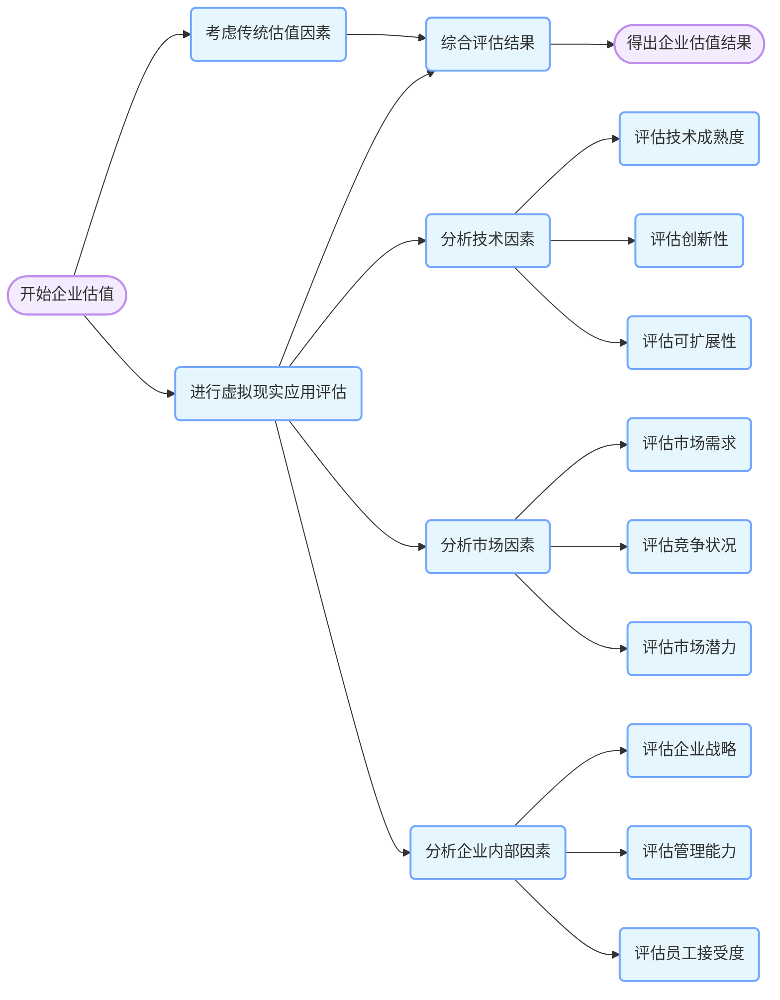

# 企业估值中的虚拟现实应用评估

> 关键词：企业估值、虚拟现实应用、评估方法、数学模型、实际应用场景

> 摘要：本文聚焦于企业估值中虚拟现实应用的评估。首先介绍了相关背景，包括目的范围、预期读者等内容。接着阐述了核心概念与联系，通过文本示意图和Mermaid流程图清晰展示原理和架构。详细讲解了核心算法原理及具体操作步骤，结合Python源代码进行说明。引入数学模型和公式，并举例阐释。通过项目实战给出代码案例及详细解释。分析了虚拟现实应用在企业估值中的实际应用场景。推荐了学习资源、开发工具框架和相关论文著作。最后总结未来发展趋势与挑战，提供常见问题解答及扩展阅读参考资料，旨在为企业在估值中准确评估虚拟现实应用提供全面且深入的指导。

## 1. 背景介绍 
### 1.1 目的和范围
在当今数字化快速发展的时代，虚拟现实（VR）技术正逐渐渗透到各个行业，为企业带来了新的发展机遇和挑战。企业估值是投资者、管理者等利益相关者了解企业价值的重要手段，而准确评估企业中虚拟现实应用的价值则成为企业估值中的关键环节。本文的目的在于深入探讨如何在企业估值过程中对虚拟现实应用进行科学、合理的评估。范围涵盖了虚拟现实应用的核心概念、评估算法、数学模型、实际应用场景等多个方面，旨在为企业估值提供全面、系统的虚拟现实应用评估方法和理论支持。

### 1.2 预期读者
本文的预期读者主要包括企业估值领域的专业人士，如资产评估师、投资分析师等，他们可以通过本文获取关于虚拟现实应用评估的专业知识和方法，提升评估的准确性和可靠性。同时，企业管理者也可以从中了解如何衡量企业中虚拟现实应用的价值，以便更好地制定战略决策。此外，对虚拟现实技术和企业估值感兴趣的研究人员和学者也能从本文中获得有价值的研究思路和参考资料。

### 1.3 文档结构概述
本文共分为十个部分。第一部分为背景介绍，阐述了文章的目的、范围、预期读者和文档结构概述，并给出了相关术语表。第二部分介绍核心概念与联系，通过文本示意图和Mermaid流程图展示虚拟现实应用评估的原理和架构。第三部分讲解核心算法原理及具体操作步骤，结合Python源代码详细说明。第四部分引入数学模型和公式，并进行详细讲解和举例说明。第五部分通过项目实战给出代码实际案例及详细解释。第六部分分析虚拟现实应用在企业估值中的实际应用场景。第七部分推荐学习资源、开发工具框架和相关论文著作。第八部分总结未来发展趋势与挑战。第九部分为附录，提供常见问题与解答。第十部分给出扩展阅读和参考资料。

### 1.4 术语表
#### 1.4.1 核心术语定义
- **企业估值**：指对企业的经济价值进行评估的过程，通过综合考虑企业的资产、负债、盈利能力、市场前景等因素，确定企业在特定时间点的价值。
- **虚拟现实（VR）**：是一种利用计算机技术生成的模拟环境，通过头戴式显示器、手柄等设备，使用户产生身临其境的沉浸感，可应用于游戏、教育、医疗、工业等多个领域。
- **虚拟现实应用评估**：对企业中虚拟现实技术的应用情况、效果、价值等方面进行综合评价和分析的过程，旨在确定虚拟现实应用对企业价值的贡献程度。

#### 1.4.2 相关概念解释
- **技术成熟度**：衡量虚拟现实技术在企业应用中达到的完善程度，包括技术的稳定性、性能、功能完整性等方面。技术成熟度越高，虚拟现实应用对企业价值的提升可能越大。
- **用户体验**：指用户在使用虚拟现实应用过程中的感受和体验，包括沉浸感、交互性、舒适度等。良好的用户体验能够吸引更多用户，提高虚拟现实应用的市场竞争力，从而增加企业价值。
- **市场潜力**：指虚拟现实应用在市场上的发展前景和潜在需求，受市场规模、增长趋势、竞争状况等因素影响。市场潜力越大，虚拟现实应用为企业带来的收益可能越高。

#### 1.4.3 缩略词列表
- **VR**：虚拟现实（Virtual Reality）

## 2. 核心概念与联系 
### 核心概念原理
企业估值中的虚拟现实应用评估主要基于以下原理：首先，虚拟现实应用可以通过提升企业的产品或服务质量、拓展市场渠道、提高生产效率等方式为企业创造价值。例如，在房地产行业，利用虚拟现实技术可以让客户更直观地体验房屋的布局和装修效果，提高客户的购买意愿；在工业制造领域，虚拟现实技术可用于员工培训和产品设计，降低成本、提高生产效率。

其次，评估虚拟现实应用的价值需要综合考虑多个因素，包括技术因素（如技术成熟度、创新性）、市场因素（如市场需求、竞争状况）和企业内部因素（如企业战略、管理能力）等。这些因素相互影响，共同决定了虚拟现实应用对企业价值的贡献。

### 架构的文本示意图
```plaintext
企业估值
├── 传统估值因素
│   ├── 资产
│   ├── 负债
│   ├── 盈利能力
│   └── 市场前景
└── 虚拟现实应用评估
    ├── 技术因素
    │   ├── 技术成熟度
    │   ├── 创新性
    │   └── 可扩展性
    ├── 市场因素
    │   ├── 市场需求
    │   ├── 竞争状况
    │   └── 市场潜力
    └── 企业内部因素
        ├── 企业战略
        ├── 管理能力
        └── 员工接受度
```

### Mermaid流程图


## 3. 核心算法原理 & 具体操作步骤 
### 核心算法原理
在企业估值中评估虚拟现实应用的价值，可采用多因素综合评估算法。该算法通过对技术因素、市场因素和企业内部因素等多个方面进行量化评估，然后根据各因素的权重计算出虚拟现实应用的综合价值。具体步骤如下：

1. **确定评估因素和权重**：根据企业的特点和行业情况，确定影响虚拟现实应用价值的因素，并为每个因素分配相应的权重。例如，技术成熟度权重为0.3，市场需求权重为0.3，企业战略权重为0.2等。
2. **对各因素进行量化评估**：针对每个评估因素，制定相应的评估指标和评分标准，对虚拟现实应用在各因素上的表现进行打分。例如，技术成熟度可根据系统的稳定性、性能等指标进行评分。
3. **计算各因素的得分**：将各因素的评分乘以其对应的权重，得到各因素的得分。
4. **计算综合价值**：将各因素的得分相加，得到虚拟现实应用的综合价值。

### Python源代码实现
```python
# 定义评估因素和权重
factors = ['技术成熟度', '创新性', '市场需求', '竞争状况', '企业战略', '管理能力']
weights = [0.3, 0.2, 0.2, 0.1, 0.1, 0.1]

# 对各因素进行量化评估（示例评分）
scores = [80, 70, 75, 60, 70, 75]

# 计算各因素的得分
factor_scores = [score * weight for score, weight in zip(scores, weights)]

# 计算综合价值
total_value = sum(factor_scores)

print(f"虚拟现实应用的综合价值为: {total_value}")
```

### 具体操作步骤
1. **数据收集**：收集与虚拟现实应用相关的技术、市场和企业内部信息，包括技术文档、市场调研报告、企业战略规划等。
2. **指标确定**：根据收集到的数据，确定各评估因素的具体指标和评分标准。
3. **评分**：组织专业人员对虚拟现实应用在各指标上的表现进行评分。
4. **计算价值**：按照上述算法，使用Python代码计算虚拟现实应用的综合价值。
5. **结果分析**：对计算结果进行分析，评估虚拟现实应用对企业价值的贡献，并为企业决策提供参考。

## 4. 数学模型和公式 & 详细讲解 & 举例说明 
### 数学模型
设 $V$ 为虚拟现实应用的综合价值，$F_i$ 为第 $i$ 个评估因素的得分，$W_i$ 为第 $i$ 个评估因素的权重，$n$ 为评估因素的数量。则综合价值的计算公式为：

$$V = \sum_{i=1}^{n} F_i \times W_i$$

### 详细讲解
该数学模型的核心思想是通过对多个评估因素进行加权求和，得到虚拟现实应用的综合价值。每个评估因素的得分反映了虚拟现实应用在该因素上的表现，权重则体现了该因素在整体评估中的重要性。通过加权求和，可以综合考虑各因素的影响，更准确地评估虚拟现实应用的价值。

### 举例说明
假设我们要评估一家游戏企业中虚拟现实游戏应用的价值，确定的评估因素和权重如下：

| 评估因素 | 权重 |
| ---- | ---- |
| 技术成熟度 | 0.3 |
| 创新性 | 0.2 |
| 市场需求 | 0.2 |
| 竞争状况 | 0.1 |
| 企业战略 | 0.1 |
| 管理能力 | 0.1 |

经过专业人员评分，各因素的得分如下：

| 评估因素 | 得分 |
| ---- | ---- |
| 技术成熟度 | 85 |
| 创新性 | 75 |
| 市场需求 | 80 |
| 竞争状况 | 65 |
| 企业战略 | 70 |
| 管理能力 | 75 |

根据上述公式计算综合价值：

$$
\begin{align*}
V &= 0.3 \times 85 + 0.2 \times 75 + 0.2 \times 80 + 0.1 \times 65 + 0.1 \times 70 + 0.1 \times 75 \\
&= 25.5 + 15 + 16 + 6.5 + 7 + 7.5 \\
&= 77.5
\end{align*}
$$

这表明该虚拟现实游戏应用的综合价值为77.5，企业可以根据这个结果进一步评估该应用对企业整体价值的贡献。

## 5. 项目实战：代码实际案例和详细解释说明 
### 5.1  开发环境搭建
#### 安装Python
首先，需要安装Python开发环境。可以从Python官方网站（https://www.python.org/downloads/）下载适合自己操作系统的Python版本，并按照安装向导进行安装。安装完成后，在命令行中输入 `python --version` 验证安装是否成功。

#### 安装必要的库
本项目主要使用Python的基本库，无需额外安装第三方库。如果需要进行数据可视化等操作，可以安装 `matplotlib` 库，使用以下命令进行安装：

```sh
pip install matplotlib
```

### 5.2  源代码详细实现和代码解读
```python
# 定义评估因素和权重
factors = ['技术成熟度', '创新性', '市场需求', '竞争状况', '企业战略', '管理能力']
weights = [0.3, 0.2, 0.2, 0.1, 0.1, 0.1]

# 模拟用户输入各因素的评分
scores = []
for factor in factors:
    score = float(input(f"请输入 {factor} 的评分 (0 - 100): "))
    scores.append(score)

# 计算各因素的得分
factor_scores = [score * weight for score, weight in zip(scores, weights)]

# 计算综合价值
total_value = sum(factor_scores)

# 输出结果
print(f"虚拟现实应用的综合价值为: {total_value}")

# 数据可视化（可选）
import matplotlib.pyplot as plt

plt.bar(factors, factor_scores)
plt.xlabel('评估因素')
plt.ylabel('因素得分')
plt.title('虚拟现实应用评估因素得分')
plt.show()
```

### 代码解读与分析
1. **定义评估因素和权重**：通过列表 `factors` 和 `weights` 分别定义了评估因素和对应的权重。
2. **模拟用户输入评分**：使用 `for` 循环遍历评估因素，提示用户输入每个因素的评分，并将评分存储在列表 `scores` 中。
3. **计算各因素的得分**：使用列表推导式 `[score * weight for score, weight in zip(scores, weights)]` 计算每个因素的得分。
4. **计算综合价值**：使用 `sum()` 函数将各因素的得分相加，得到虚拟现实应用的综合价值。
5. **输出结果**：使用 `print()` 函数输出综合价值。
6. **数据可视化（可选）**：使用 `matplotlib` 库绘制柱状图，直观展示各评估因素的得分情况。

## 6. 实际应用场景 
### 投资决策
在企业进行投资决策时，准确评估虚拟现实应用的价值至关重要。投资者可以通过对目标企业中虚拟现实应用的评估，了解其技术实力、市场前景和发展潜力，从而判断该企业是否具有投资价值。例如，如果一家科技企业在虚拟现实教育领域有成熟的应用，且市场需求大、竞争优势明显，那么投资者可能会更倾向于对该企业进行投资。

### 企业并购
在企业并购过程中，需要对被并购企业的资产和业务进行全面评估，其中包括虚拟现实应用的价值。通过评估，可以确定被并购企业的虚拟现实应用对并购方的战略意义和协同效应，从而合理确定并购价格。例如，一家传统游戏企业并购一家专注于虚拟现实游戏开发的企业时，需要评估被并购企业的虚拟现实技术和游戏产品，以判断是否能够提升自身在游戏市场的竞争力。

### 企业战略规划
企业在制定战略规划时，需要考虑虚拟现实应用对企业未来发展的影响。通过评估虚拟现实应用的价值，企业可以确定是否加大在该领域的投入，以及如何将虚拟现实技术与现有业务进行融合。例如，一家旅游企业通过评估发现虚拟现实技术可以为游客提供更真实的旅游体验，从而吸引更多游客，那么该企业可能会制定战略计划，加大在虚拟现实旅游应用方面的研发和推广力度。

### 企业融资
企业在进行融资时，需要向投资者展示自身的价值和发展潜力。虚拟现实应用作为企业的一项重要资产，其价值评估结果可以作为企业融资的重要依据。例如，一家初创的虚拟现实技术企业在寻求风险投资时，可以通过详细的虚拟现实应用评估报告，向投资者证明其技术的创新性和市场前景，从而提高融资的成功率。

## 7. 工具和资源推荐
### 7.1 学习资源推荐
#### 7.1.1 书籍推荐
- 《虚拟现实：从入门到精通》：本书全面介绍了虚拟现实技术的基本原理、开发工具和应用案例，适合初学者系统学习虚拟现实技术。
- 《企业估值：理论与实践》：详细讲解了企业估值的各种方法和模型，对于理解企业估值中的虚拟现实应用评估有很大帮助。
- 《技术创新管理》：探讨了技术创新的管理策略和方法，有助于了解虚拟现实技术在企业中的应用和发展。

#### 7.1.2 在线课程
- Coursera上的“虚拟现实开发基础”：由知名高校教授授课，系统介绍虚拟现实开发的基础知识和技能。
- edX上的“企业估值与投资分析”：提供了企业估值的理论和实践课程，包括各种估值方法的应用。
- Udemy上的“虚拟现实应用案例分析”：通过实际案例分析，深入了解虚拟现实技术在不同行业的应用和价值评估。

#### 7.1.3 技术博客和网站
- 虚拟现实技术博客（https://www.vrinsider.com/）：提供虚拟现实技术的最新资讯、技术文章和行业报告。
- 企业估值研究网（https://www.bizvaluation.com/）：专注于企业估值领域的研究和交流，有丰富的估值方法和案例分享。
- 技术创新论坛（https://www.techinnovationforum.com/）：讨论技术创新的趋势和应用，包括虚拟现实技术在企业中的创新应用。

### 7.2 开发工具框架推荐
#### 7.2.1 IDE和编辑器
- Unity3D：是一款广泛应用于虚拟现实开发的集成开发环境，提供了丰富的工具和资源，支持多种平台的开发。
- Unreal Engine：具有强大的图形渲染能力和物理模拟功能，适合开发高质量的虚拟现实游戏和应用。
- Visual Studio Code：是一款轻量级的代码编辑器，支持多种编程语言，可用于虚拟现实应用的代码开发和调试。

#### 7.2.2 调试和性能分析工具
- Oculus Rift Developer Kit：用于虚拟现实应用的调试和测试，提供了沉浸式的体验环境，方便开发者发现和解决问题。
- SteamVR Performance Test：可以对虚拟现实应用的性能进行测试和分析，帮助开发者优化应用的性能。
- Unity Profiler：是Unity3D自带的性能分析工具，可用于分析虚拟现实应用的CPU、GPU和内存使用情况。

#### 7.2.3 相关框架和库
- A-Frame：是一个基于Web的虚拟现实框架，使用HTML和JavaScript即可快速创建虚拟现实场景，适合初学者入门。
- Three.js：是一个JavaScript 3D库，可用于创建和展示3D图形和虚拟现实场景，具有良好的跨平台兼容性。
- OpenCV：是一个开源的计算机视觉库，可用于虚拟现实应用中的图像和视频处理，如手势识别、场景重建等。

### 7.3 相关论文著作推荐
#### 7.3.1 经典论文
- "A Framework for Assessing the Value of Virtual Reality Applications in Enterprises"：提出了一个评估企业中虚拟现实应用价值的框架，为后续的研究提供了重要的理论基础。
- "The Impact of Virtual Reality on Business Valuation"：研究了虚拟现实技术对企业估值的影响，分析了虚拟现实应用在不同行业的价值创造机制。
- "Virtual Reality Technology and Its Application in Corporate Strategy"：探讨了虚拟现实技术在企业战略中的应用，强调了虚拟现实应用对企业竞争力的提升作用。

#### 7.3.2 最新研究成果
- 近年来，关于虚拟现实技术在企业估值中的应用研究不断涌现。一些研究通过实证分析，验证了虚拟现实应用对企业财务绩效和市场价值的积极影响；另一些研究则关注虚拟现实技术的创新模式和商业应用，为企业提供了新的发展思路。

#### 7.3.3 应用案例分析
- 一些知名企业在虚拟现实应用方面取得了显著的成果，相关的应用案例分析可以为其他企业提供借鉴。例如，迪士尼公司利用虚拟现实技术打造了沉浸式的主题公园体验，提升了游客的满意度和忠诚度；宝马公司将虚拟现实技术应用于汽车设计和生产过程，提高了生产效率和产品质量。

## 8. 总结：未来发展趋势与挑战
### 未来发展趋势
#### 技术创新驱动
随着计算机技术、图形处理技术和传感器技术的不断发展，虚拟现实技术将不断创新和升级。未来，虚拟现实设备将更加轻便、舒适，图像质量和交互性能将大幅提高，为用户带来更加逼真的沉浸体验。同时，新的虚拟现实技术和应用模式将不断涌现，如增强虚拟现实（AR）与虚拟现实的融合、基于人工智能的智能交互等，将进一步拓展虚拟现实应用的边界。

#### 行业应用拓展
虚拟现实技术将在更多行业得到广泛应用，除了游戏、教育、医疗等传统领域，还将涉及金融、物流、农业等行业。例如，在金融领域，虚拟现实技术可用于模拟投资场景，帮助投资者更好地理解市场风险；在物流领域，可利用虚拟现实技术进行仓库布局规划和员工培训。随着行业应用的拓展，虚拟现实应用在企业估值中的重要性将不断提升。

#### 市场规模扩大
随着消费者对虚拟现实体验的需求不断增加，以及企业对虚拟现实技术的重视和投入加大，虚拟现实市场规模将持续扩大。根据市场研究机构的数据预测，未来几年全球虚拟现实市场将保持高速增长，这将为企业带来更多的商业机会和发展空间，也将对企业估值产生深远影响。

### 挑战
#### 技术标准缺乏
目前，虚拟现实技术的发展还缺乏统一的标准，不同厂商的设备和应用之间存在兼容性问题。这给虚拟现实应用的开发和推广带来了一定的困难，也影响了用户的体验和市场的发展。在企业估值中，技术标准的缺乏可能导致对虚拟现实应用的评估存在不确定性。

#### 数据安全和隐私问题
虚拟现实应用涉及大量的用户数据，如用户的行为数据、生理数据等，数据安全和隐私问题日益凸显。一旦数据泄露，可能会给用户带来严重的损失，也会影响企业的声誉和市场价值。因此，在评估虚拟现实应用的价值时，需要充分考虑数据安全和隐私保护的因素。

#### 人才短缺
虚拟现实技术是一个新兴领域，相关的专业人才短缺。企业在开发和应用虚拟现实技术时，面临着人才招聘和培养的难题。人才短缺可能会限制企业虚拟现实应用的发展速度和质量，从而影响企业的估值。

## 9. 附录：常见问题与解答
### 问题1：如何确定评估因素的权重？
确定评估因素的权重需要综合考虑多个因素，包括企业的战略目标、行业特点、市场环境等。可以采用专家评估法、层次分析法等方法来确定权重。专家评估法是邀请相关领域的专家根据经验和专业知识对各因素的重要性进行评分，然后取平均值作为权重；层次分析法是通过建立层次结构模型，对各因素进行两两比较，确定相对重要性，从而计算出权重。

### 问题2：虚拟现实应用评估的结果是否具有确定性？
虚拟现实应用评估的结果具有一定的不确定性。这是因为评估过程中涉及到多个因素的主观判断，如技术创新性、市场潜力等。此外，虚拟现实技术和市场环境都在不断变化，评估结果可能会随着时间的推移而发生变化。因此，评估结果只能作为参考，企业在决策时需要结合其他因素进行综合考虑。

### 问题3：如何提高虚拟现实应用的价值？
提高虚拟现实应用的价值可以从多个方面入手。在技术方面，加大研发投入，提高技术成熟度和创新性，提升用户体验；在市场方面，加强市场推广，了解市场需求，拓展市场渠道；在企业内部方面，制定合理的战略规划，加强管理，提高员工的接受度和使用能力。

### 问题4：虚拟现实应用评估是否适用于所有企业？
虚拟现实应用评估适用于涉及虚拟现实技术应用的企业。对于一些没有虚拟现实应用的企业，该评估方法可能不适用。但随着虚拟现实技术的普及和发展，越来越多的企业将涉足该领域，因此该评估方法的适用范围将逐渐扩大。

## 10. 扩展阅读 & 参考资料
### 扩展阅读
- 《虚拟现实产业发展白皮书》：详细介绍了虚拟现实产业的发展现状、趋势和政策环境，为进一步了解虚拟现实行业提供了全面的信息。
- 《企业数字化转型案例集》：收录了多个企业在数字化转型过程中应用虚拟现实技术的成功案例，可供企业借鉴和学习。
- 《技术创新与商业模式创新》：探讨了技术创新与商业模式创新之间的关系，对于理解虚拟现实应用的商业价值有一定的帮助。

### 参考资料
- 虚拟现实技术相关的学术论文和研究报告，如IEEE Transactions on Visualization and Computer Graphics等期刊上的文章。
- 企业估值领域的专业书籍和文献，如《估值：难点、解决方案及相关案例》等。
- 行业协会和研究机构发布的统计数据和市场报告，如国际数据公司（IDC）发布的虚拟现实市场研究报告。

作者：AI天才研究院/AI Genius Institute & 禅与计算机程序设计艺术 /Zen And The Art of Computer Programming